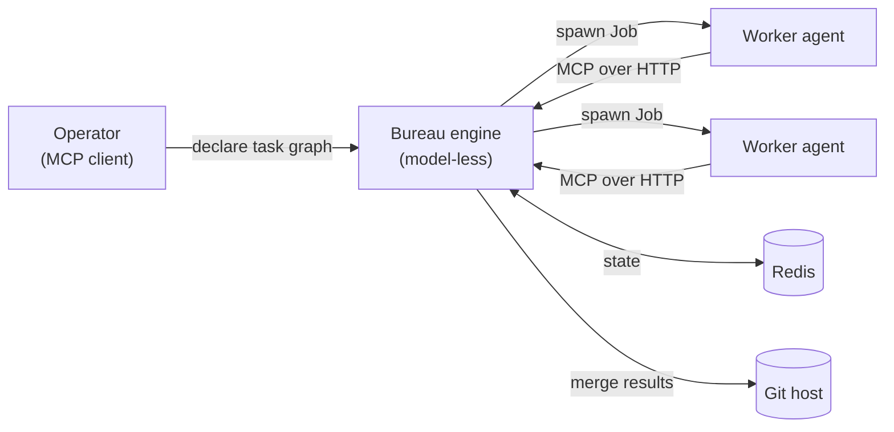

<div align="center">

# The Bureau

**A model-less orchestration engine for AI coding agents.**
Declare work as a task graph, dispatch each agent as an isolated Kubernetes Job,
and drive them over the [Model Context Protocol](https://modelcontextprotocol.io).

[](https://github.com/JacquesBronk/the-bureau/actions/workflows/ci.yml)
[](LICENSE)
[](https://www.npmjs.com/package/the-bureau)

</div>

---

The Bureau is the **control plane** for multi-agent coding work. It holds no model of its
own — it declares a graph of tasks, spawns a worker agent for each as an isolated Kubernetes
Job, coordinates their handoffs, gates their output against acceptance criteria, and merges
the results back. Bring your own model provider and your own Redis; The Bureau is the tool
shed, not the tool.

## How it works



An orchestrator declares a task graph over MCP. The engine dispatches each task as a worker
Job, hands it a scoped MCP surface, watches it run, re-runs it if a validation gate fails,
and promotes passing work to an integration branch.

## Why The Bureau

- **Model-less engine** — the control plane spends no tokens; workers do. Bring any provider
  (a Claude subscription token, or an OpenAI-compatible gateway).
- **Isolation by default** — every agent runs as its own Kubernetes Job with a scoped token
  and network policy; workers never touch each other or the shared state store.
- **MCP-native** — the engine *is* an MCP server; orchestrators and workers speak MCP.
- **Quality gates** — acceptance-criteria validation and automatic rework loops before work
  is promoted, so you don't merge agent output on trust.
- **Polyglot workers** — Node, Python, and .NET worker images out of the box; add a language
  by adding an image.
- **Observable** — first-class OpenTelemetry metrics and traces for every dispatch.

## Install

```bash
npm install the-bureau
npx the-bureau --help
```

Container images are published to the GitHub Container Registry:

- `ghcr.io/jacquesbronk/bureau-engine`
- `ghcr.io/jacquesbronk/bureau-worker` (`-python`, `-dotnet` variants also published)

## Deploy on Kubernetes

A portable Helm chart lives in [`charts/the-bureau`](charts/the-bureau):

```bash
helm install bureau charts/the-bureau \
  --set auth.signingKey.value=<a-strong-random-string> \
  --set redis.url=redis://redis:6379/0 \
  --set model.oauthToken.value=<your-provider-token>
```

The chart deploys the engine, the RBAC it needs to spawn worker Jobs, and the
toolchain/registry configuration. Everything else — ingress, network policies, the reaper,
persistence, external OIDC — is opt-in via `values.yaml`. You bring your own Redis and model
provider.

## Documentation

Architecture and reference docs live in [`docs/`](docs/) — start with
[**Overview**](docs/Overview.md) for the system map, then the
[Subsystems](docs/Subsystems/) and [Reference](docs/Reference/) sections.

## Build & test

```bash
npm ci
npm run build                                # tsc + esbuild bundle
REDIS_URL=redis://localhost:6379 npm test    # tests require a running Redis
```

Details in the [Build & Release Runbook](docs/Operations/Build%20%26%20Release%20Runbook.md).

## Contributing

Pull requests are welcome. `main` is protected: every PR must pass the **typecheck** and
**test** checks before it can merge. Run `npm test` locally against a Redis instance first.

## License

[**FSL-1.1-MIT**](LICENSE) — the [Functional Source License](https://fsl.software): the source
is available and free to use, modify, and redistribute for any purpose **except** building a
product that competes with The Bureau. Two years after each release, that version converts
automatically to the MIT License.
