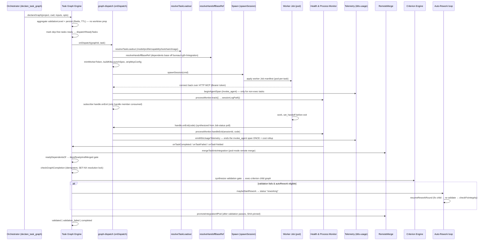

# Data Flow — Life of a Task Graph

End-to-end runtime story of a single task graph under **k8s-only worker dispatch**: how an orchestrator's `declare_task_graph` call becomes running Kubernetes worker Jobs, how each worker's loadout and clone base ref are resolved, how a synthesized Job-exit event is reconciled by health monitoring and its cost accounted through a single authoritative span, how completion merges each worker's branch into a per-graph integration branch, gates promotion behind mechanical validation, optionally drives a bounded auto-rework loop, and finally promotes. Each step links the [System Map](System%20Map.md) component that owns it and cites a source symbol. For the static dependency picture see [System Map](System%20Map.md).

> [!info] k8s-only worker dispatch
> Local/host spawn — the node-pty PTY strategy, the raw detached-child strategy, the `TerminalRegistry` + WebSocket terminal server, engine-side git worktrees, and the in-process merge-coordinator — was **removed** in the k8s-only spawn migration, with the now-inert follow-up code excised. Every worker now runs as a Kubernetes Job (pod-per-task); there is no local agent process, no live PTY stream, and no engine-side worktree. The deleted terminal-streaming subsystem survives only as a removal record at [Terminals & WS Server](../Subsystems/Terminals%20%26%20WS%20Server.md). The in-cluster Job runtime is the infra track's [k8s Spawn & Remote Merge](../Subsystems/k8s%20Spawn%20%26%20Remote%20Merge.md) note.

## Sequence: declare → dispatch → run → exit → complete → (rework) → promote

This sequence shows one k8s graph from declaration to promotion, including the auto-rework detour. Participants map 1:1 to subsystems; the worker is a Kubernetes Job, not a local process.

## Walkthrough

### 1. Declare

The orchestrator calls `declare_task_graph`, which delegates to `TaskGraphManager.declareGraph`. The engine generates a UUID graph id, validates the DAG, and persists the graph plus every task node with its `deps`/`rdeps` index sets to Redis under `graph:*` keys with a TTL (`src/task-graph.ts › declareGraph`; see [Task Graph Engine](../Subsystems/Task%20Graph%20Engine.md)). There is **no** worktree preparation and no isolation rewrite of the inputs — `resolvedInputs = inputs` — because worker isolation is per-pod: each worker Job blobless-clones the destination repo into its own workspace and pushes its own branch (`src/task-graph.ts › declareGraph`). Before persisting, `declareGraph` aggregates a graph-level `validationLevel` (max priority: `integration > unit > self`) from any per-task `validation` field, and captures `validationInstallCmd`, `validationToolchain`, `validationTestCmd`, `validationIntegrationTestCmd`, and the `testServices` set, so the completion-time gate has them (`src/task-graph.ts › declareGraph`). Dependency-free tasks are transitioned to `ready`, an orchestrator-ownership lease is claimed under `graph:<id>:orchestrator`, and `dispatchReadyTasks` runs (`src/task-graph.ts › declareGraph`). All status writes route through the validated transition table in [State Machine & Rework](../Subsystems/State%20Machine%20%26%20Rework.md).

### 2. Dispatch

`dispatchReadyTasks` enforces graph ownership (with an `authoritative` bypass path for worker-driven completion), `maxConcurrency`, and a free-RAM throttle, then for each ready task marks it `running` and invokes the injected `onDispatch` callback (`src/task-graph.ts › dispatchReadyTasks`; see [Task Graph Engine](../Subsystems/Task%20Graph%20Engine.md)). That callback is `createDispatchHandler`. It loads the agent prompt, builds handoff context from completed dependencies and a graph-topology block, then — under k8s (the only strategy) — mints a per-task worker bearer token from the engine signing key and resolves the entire loadout through **one shared call** to `resolveTaskLoadout`: model (with any per-task `model` override already applied), capability template/profile, category, provider env, toolchain name, and worker image. This is the identical pure resolver the dry-run preview uses, so dispatch and preview can never drift (`src/graph-dispatch.ts › createDispatchHandler`, `src/runtime/resolve-loadout.ts › resolveTaskLoadout`; see [Agent Runtime & Providers](../Subsystems/Agent%20Runtime%20%26%20Providers.md)). The handler then fails loud on an unknown NAMED toolchain and gates the resolved image through `deps.imageCatalog.isApproved` before building the launch spec (`src/graph-dispatch.ts › createDispatchHandler`).

The clone base ref threaded into the `K8sLaunchSpec` is **not** the task's raw `gitBaseRef`. `resolveHandoffBaseRef` bases a pod-mode **dependent** task off the per-graph integration branch `bureau/<g8>/integration` (its predecessors' merged code), while root/no-dep tasks, exec-mode pods, and explicitly-pinned criterion/merge-coordinator tasks keep their own base ref — the pod-mode half of the handoff-integration DAG (`src/graph-dispatch.ts › createDispatchHandler`, `src/spawn/integration-branch.ts › resolveHandoffBaseRef`, `src/spawn/integration-branch.ts › integrationBranchName`). Per-task build commands (`BUREAU_INSTALL_CMD`, `BUREAU_BUILD_CMD`, `BUREAU_TEST_CMD`, `BUREAU_INTEGRATION_TEST_CMD`, `BUREAU_LINT_CMD`, `BUREAU_VALIDATION_LEVEL`) are injected via `cmdEnv`; for `execMode` tasks `BUREAU_EXEC_CMD` is set so the pod entrypoint skips Claude entirely (zero-token mechanical validation), and a no-test guard fails a task loudly at dispatch when it declares `validation` but no `test` command (`src/graph-dispatch.ts › createDispatchHandler`). For a `criterion-`-prefixed task under integration-level validation, the handler leases ephemeral Redis/Postgres services from the parent graph's `testServices` and injects `BUREAU_REDIS_URL`/`BUREAU_POSTGRES_URL` (`src/graph-dispatch.ts › createDispatchHandler`; see [Test Service Broker](../Subsystems/Test%20Service%20Broker.md)). After `buildLaunch`, `cmd.k8s.workerArgs = stripMcpConfig(cmd.args)` so the bearer token in `--mcp-config` never lands in the Job manifest. When `spawnSession` throws, the handler calls `onTaskFailed` and returns rather than rethrowing, so a failed spawn never leaves the task false-running with a null session id (`src/graph-dispatch.ts › createDispatchHandler`; see [Spawn & PTY](../Subsystems/Spawn%20%26%20PTY.md)).

### 3. Spawn → worker Job runs

`spawnSession` writes the fsync'd MCP config and delegates to the active `SpawnStrategy` — always `KubernetesJobSpawnStrategy`, which renders and applies a worker Job (pod-per-task); the Job's internals (init/clone container, token Secret, capture sidecar) are the infra track's [k8s Spawn & Remote Merge](../Subsystems/k8s%20Spawn%20%26%20Remote%20Merge.md) note (`src/graph-dispatch.ts › createDispatchHandler`; see [Spawn & PTY](../Subsystems/Spawn%20%26%20PTY.md)). In **workerHttp** mode the worker connects back to the engine's HTTP MCP surface with the `Authorization: Bearer <token>` header, inheriting no user MCP servers and no Redis credentials. There is **no PTY**, **no `onData` stream**, and **no `TerminalRegistry` registration** — those were removed with local spawn. After spawn, the handler stamps the worker's `sessionLogPath` (the read-only sessions-PVC transcript, not the `k8s://…` placeholder logFile) onto the `ProcessEntry` and tracks it with the process monitor (`src/graph-dispatch.ts › createDispatchHandler`; see [Health & Process Monitoring](../Subsystems/Health%20%26%20Process%20Monitoring.md)). While running, the worker coordinates through the workspace layer — `declare_intent`, `lock_files`, `post_discovery`, `yield_to` — over the HTTP MCP surface ([Workspace Awareness & Locks](../Subsystems/Workspace%20Awareness%20%26%20Locks.md)), and before exiting records a structured handoff via `set_handoff` ([Messaging & Handoffs](../Subsystems/Messaging%20%26%20Handoffs.md)).

### 4. Exit → health reconciliation and single-span cost accounting

The k8s strategy has no live process to fire an exit, so it **synthesizes** the exit event from Job-status polling. The only `SpawnHandle` member the dispatch path consumes is `onExit`: the handler subscribes a callback that routes the exit code to `processMonitor.handleExit` (`src/graph-dispatch.ts › createDispatchHandler`; see [Health & Process Monitoring](../Subsystems/Health%20%26%20Process%20Monitoring.md)).

Cost/usage telemetry follows the **cost-conservation contract**: exactly **one authoritative `invoke_agent` span per real-agent invocation**. The span is opened at dispatch — **only for non-exec tasks** (exec/criterion pods run `BUREAU_EXEC_CMD` at zero tokens and get no span) — and tagged with the rework `attempt` (`src/graph-dispatch.ts › createDispatchHandler`, `src/telemetry/instrumentation/agent-spawn.ts › beginAgentSpan`). On exit, when the worker has a stamped `sessionLogPath`, the `onExit` callback fire-and-forget calls `emitK8sUsageTelemetry`, which polls the JSONL transcript for a usage block (bounded retry), aggregates token/cache/cost across all of the worker's Claude invocations, and **owns ending that span exactly once** — with the full cost payload on parse-success or just the exit code otherwise. It also feeds the graph-level `bureau.graph.cost_usd` rollup via `onGraphAgentCost` and records the `cost.source` (`parsed` / `missing`) counter (`src/graph-dispatch.ts › createDispatchHandler`, `src/telemetry/k8s-usage.ts › emitK8sUsageTelemetry`, `src/telemetry/domain/graph.ts › onGraphAgentCost`, `src/telemetry/domain/transcript.ts › onCostSource`; see [Telemetry](../Subsystems/Telemetry.md)). A worker killed or sweep-reaped mid-run never reaches that path, so the `kill_task` and health-sweep `killWorker` seams call `recordCanceledAgentUsage`, which ends the still-open span once and either recovers the transcript's cost or counts a `lost_canceled` cost source, so the loss is never silent (`src/telemetry/k8s-usage.ts › recordCanceledAgentUsage`, `src/telemetry/instrumentation/agent-spawn.ts › endAgentSpanOnCancel`). `handleExit` then waits a grace period for in-flight MCP calls, auto-checkpoints uncommitted git work, and infers completion / yield / death, calling back into the engine ([Health & Process Monitoring](../Subsystems/Health%20%26%20Process%20Monitoring.md)).

### 5. Completion callbacks unlock the graph

The process monitor's outcome callbacks call back into the engine: `onCompleted → onTaskCompleted`, `onFailed → onTaskFailed`, `onYielded → onTaskYielded`. `onTaskCompleted` marks the task complete, integrates the worker's branch (step 6), then readies newly-unblocked dependents via `readyDependentsOf` (`src/task-graph.ts › onTaskCompleted`, `src/task-graph.ts › readyDependentsOf`). A dependent is readied only when it passes the single `depsReadyAndMerged` predicate: every dependency is not just `completed` but its merge has actually **landed** on the integration branch (not in `pending_merges`, and any `merge-<dep>` coordinator has completed) — the scheduler-side half of the handoff-integration gate (`src/task-graph.ts › depsReadyAndMerged`, `src/task-graph.ts › areDepsMerged`). Newly-ready dependents are then dispatched **authoritatively** — a worker just completed, so this engine is the execution driver even if a monitoring session holds the ownership lease — and `checkGraphCompletion` runs. Newly-ready tasks loop back into dispatch (step 2) until every task is terminal (`src/task-graph.ts › onTaskCompleted`, `src/task-graph.ts › dispatchReadyTasks`).

### 6. Branch integration → validation gate → resolve → promote

Branch integration is a **pod-mode remote merge**, not a local worktree merge. For each completed pod-mode task, `onTaskCompleted` adds the task to `graph:<id>:pending_merges` and calls `remoteMerge.mergeTaskIntoIntegration(...)`, emitting `worktree_merged` / `merge_conflict` / `worktree_merge_failed`; a conflict auto-adds a `merge-coordinator` task on the conflict branch whose completion re-attempts the merge, and when no merge clone is configured the merge fails loud with `no_merge_clone` rather than silently advancing (`src/task-graph.ts › onTaskCompleted`, `src/spawn/remote-merge.ts › RemoteMerge`). A rework-fix child's merge is redirected to the **parent** graph's integration branch, and a rework-fix merge conflict fails the fix round terminally rather than injecting an unbounded human-resolve coordinator (`src/task-graph.ts › onTaskCompleted`).

`checkGraphCompletion` is **idempotent**: it returns early when the graph is already in a `TERMINAL_GRAPH_STATUSES` state (`completed | validated | validation_failed | failed | merged | canceled`), so a re-entrant call (e.g. a self-improvement child completing) cannot re-run validation in a loop (`src/task-graph.ts › checkGraphCompletion`). A `reworking` graph is routed straight into `resumeReworkRound` (step 7) instead of the legacy gate re-dispatch. It proceeds only when every task is terminal and, for pod-mode graphs, `pending_merges` has drained (`src/task-graph.ts › checkGraphCompletion`). It then synthesizes a **validation gate**: for `validationLevel === 'unit'` it prepends a synthetic `exec`-type criterion built from `validationInstallCmd && validationTestCmd`; for `'integration'` it does the same, falling back to the aggregated unit `test` command when no dedicated `integrationTest` was declared (`validationIntegrationTestCmd ?? validationTestCmd`) so a test-only integration graph is never promoted ungated. A graph that declared a `unit`/`integration` level but resolves **no** runnable gate now fails loud (`graph_validation_failed`, reason `validation_no_runnable_command`) rather than silently promoting (`src/task-graph.ts › checkGraphCompletion`).

Acceptance criteria are split three ways: `command`/`script`/`assertion` criteria run inline via an in-process `CriterionEngine` (against the engine-side merge-clone dir or `graph.cwd`, `skipCommandsIfCwdInaccessible: true` so a missing cwd cannot spuriously block promote); `agent`-type criteria dispatch as a child validation graph; and `exec`-type criteria are each dispatched as a standalone child graph with a single `execMode: true` task pinned to the integration branch (`gitBaseRef: bureau/<g8>/integration`), so the pod validates the merged candidate — not the pre-merge state — inheriting the parent's `destination` and `defaultToolchain` (`src/task-graph.ts › checkGraphCompletion`, `src/task-graph.ts › dispatchExecValidationChildren`; see [Criterion Engine & Plugins](../Subsystems/Criterion%20Engine%20%26%20Plugins.md)). At dispatch of the first validation child, the integration-branch HEAD is captured as a SHA pin.

When the validation children all resolve, the validated→promote resolution is serialized behind a per-graph/attempt **`SET-NX` completion lock** (`completionlock:<graphId>:<attempt>`) so two exec-criteria children finishing in the same tick cannot both promote (`src/task-graph.ts › tryClaimResolution`). A first-pass **SHA-pin** guard then refuses to promote when the live integration HEAD no longer matches the SHA captured when the first validation child was dispatched (`src/task-graph.ts › checkValidationDispatchPin`). On pass, the engine marks the graph `validated` and promotes the per-graph integration branch into the destination base ref via `promoteIntegrationIfPod`, which excludes `execMode` pods and rework-fix children, treats `ff`/`merge`/`noop`/`deferred` as success (a `pr-only` destination intentionally defers), and fails the graph loudly on `error`/`transient`/`conflict` (`src/task-graph.ts › promoteIntegrationIfPod`). Promotion runs **after** validation passes, so a graph that fails validation never promotes unvalidated work (`src/task-graph.ts › checkGraphCompletion`). The graph then resolves to `validated`, `validation_failed`, or plain `completed`; a graph with child graphs does not complete until all children are terminal (`src/task-graph.ts › checkGraphCompletion`).

### 7. Auto-rework loop (optional)

When a pre-promote validation gate fails and the graph opted in (`autoRework: { maxAttempts, fixRole }`), `maybeStartRework` intercepts the terminal failure. It consults the shared `reworkEligibility` gate — the graph must have `autoRework`, not be a rework-fix child or self-improvement retro, be within the depth cap and budget cap, and the failure reason must be on the fixable-reason **allowlist** (`exit_nonzero`, `test_failure`; every other/unknown reason is non-fixable by default) (`src/task-graph.ts › maybeStartRework`, `src/task-graph.ts › reworkEligibility`). An eligible failure transitions **straight to the non-terminal `reworking` status** without recording the terminal failure or tearing down the workspace, so the graph stays a live file-holder; `enterReworkRound` atomically consumes one budget unit (a `SET-NX` round claim) and writes `currentRound` (attempt index, integration-branch HEAD pins, validation-child ids) in a single graph-record write (`src/task-graph.ts › enterReworkRound`).

`resumeReworkRound` is the single, idempotent, restart-durable reconciler that drives the round: (1) dispatch a real-agent **fix child** — a costed non-exec task pinned to the parent's integration branch, `isReworkFixChild: true`, seeded with the recorded failure; (2) after the fix child is terminal, an empty-fix HEAD guard short-circuits to terminal if the fix moved nothing, else re-dispatch the same exec gate against the updated integration branch **without** flipping status off `reworking`; (3) when re-validation children all pass, run the `checkFixIntegrity` guard (rejecting a "fix" that greened the gate by deleting/renaming/skip-marking the failing test), then the `checkHeadPinForPromote` SHA-pin, before `validated` + `promoteIntegrationIfPod`; any re-validation failure advances to attempt N+1 (budget permitting) or resolves terminally (`src/task-graph.ts › resumeReworkRound`, `src/task-graph.ts › dispatchReworkFixChild`, `src/task-graph.ts › dispatchExecValidationChildren`, `src/task-graph.ts › checkFixIntegrity`, `src/task-graph.ts › checkHeadPinForPromote`). A `reworking` graph re-entering `checkGraphCompletion` (fix-child or re-validation-child completion) is routed to `resumeReworkRound`, and the health sweep calls both `checkGraphCompletion` and `resumeReworkRound` directly for supervised graphs so a round stranded by a crashed resolver is re-driven; a genuinely-stuck `reworking` graph is finalized by `reapStaleGraph` after the inactivity window (`src/task-graph.ts › checkGraphCompletion`, `src/task-graph.ts › resumeReworkRound`, `src/task-graph.ts › reapStaleGraph`; see [State Machine & Rework](../Subsystems/State%20Machine%20%26%20Rework.md)).

### 8. Events → anomaly detection → self-improvement retro

Every `TaskEvent` the engine emits flows through `createEventHandler`. The in-process `AnomalyDetector` evaluates each event **synchronously first**, before any other handling, at zero token cost (`src/graph-dispatch.ts › createEventHandler`; see [Self-Improvement Loop](../Subsystems/Self-Improvement%20Loop.md)). On a qualifying **top-level** graph completion (`SELF_IMPROVEMENT=true`, not a retro/child graph), the handler gathers metrics and anomalies, resolves an explicit review decision (per-graph `selfImprove` flag → config default → size thresholds), and — when any worker transcript was captured — seeds the analyzer with a bounded/redacted transcript **digest** rather than a raw log path, then spawns a `self-improvement-retro` child graph through the same `declareGraph` path; the retro's findings are routed to Forgejo issues or deferred storage on `child_graph_completed` (`src/graph-dispatch.ts › createEventHandler`; see [Self-Improvement Loop](../Subsystems/Self-Improvement%20Loop.md)). Worker-facing tool responses on `set_status`/`check_messages` and other bureau calls are separately enriched with cross-graph situational notes and drained operator directives by the tool-surface wrapper (owned by [MCP Server Core & Tool Surface](../Subsystems/MCP%20Server%20Core%20%26%20Tool%20Surface.md) and the Context Pipe, not this handler).

### 9. Test-service cleanup on terminal graph state

When a [Test Service Broker](../Subsystems/Test%20Service%20Broker.md) is configured (k8s mode) and the graph reaches any terminal state, the event handler reads `deps.testServiceManager` at call time and fire-and-forget calls `stopAllForGraph(event.graphId)`, tearing down every ephemeral Redis/Postgres Pod/Service the graph leased and draining its Redis index. The guard fires on `graph_completed`, `graph_failed`, `graph_canceled`, or `graph_validation_failed` (the last added to prevent leaks when integration validation fails before promote) (`src/graph-dispatch.ts › createEventHandler`, `src/spawn/test-service-manager.ts › TestServiceManager`). The health sweep additionally renews every supervised active graph's test-service leases each cycle so a live worker's test Pod is never reaped under it (see [Test Service Broker](../Subsystems/Test%20Service%20Broker.md)).

## Related

- [System Map](System%20Map.md)
- [Overview](../Overview.md)
- [Task Graph Engine](../Subsystems/Task%20Graph%20Engine.md)
- [State Machine & Rework](../Subsystems/State%20Machine%20%26%20Rework.md)
- [Spawn & PTY](../Subsystems/Spawn%20%26%20PTY.md)
- [k8s Spawn & Remote Merge](../Subsystems/k8s%20Spawn%20%26%20Remote%20Merge.md)
- [Agent Runtime & Providers](../Subsystems/Agent%20Runtime%20%26%20Providers.md)
- [Messaging & Handoffs](../Subsystems/Messaging%20%26%20Handoffs.md)
- [Workspace Awareness & Locks](../Subsystems/Workspace%20Awareness%20%26%20Locks.md)
- [Health & Process Monitoring](../Subsystems/Health%20%26%20Process%20Monitoring.md)
- [Criterion Engine & Plugins](../Subsystems/Criterion%20Engine%20%26%20Plugins.md)
- [Telemetry](../Subsystems/Telemetry.md)
- [Self-Improvement Loop](../Subsystems/Self-Improvement%20Loop.md)
- Context Pipe
- [MCP Server Core & Tool Surface](../Subsystems/MCP%20Server%20Core%20%26%20Tool%20Surface.md)
- [Test Service Broker](../Subsystems/Test%20Service%20Broker.md)
- [Terminals & WS Server](../Subsystems/Terminals%20%26%20WS%20Server.md) (removal record — no longer a live participant)
