# System Map

Top-level component map of the Bureau MCP server: the major subsystems and the real dependencies that wire them together. Every edge below is citable either to a load-bearing symbol in the source or to the subsystem note that already proves it. For per-subsystem detail follow the wikilinks; for the runtime life of a task graph see [Data Flow](Data%20Flow.md).

## Component map

This flowchart shows the major components and the direction of their real dependencies. Edges are construction/wiring (solid) — who passes what to whom at startup and at dispatch — except the dashed seams: instrumentation, the worker→engine HTTP call, the gateway's upstream proxy call, and the health sweep's out-of-band k8s Job-status query. **Worker dispatch is k8s-only**: every worker runs as a k8s Job/pod, reached over HTTP MCP and observed via logs + Job status. The former local PTY/raw spawn strategies, the terminal registry + WebSocket terminal server, engine-side git worktrees, and the in-process merge-coordinator were all removed in the k8s-only spawn migration, with the now-inert local-only follow-up code excised. The engine runs under two transports: the original stdio surface (one process = one loadout) and a Streamable HTTP surface that serves many per-connection surfaces (the model-less "engine" of the MCP-over-HTTP model-less engine (tool shed) decomposition). In HTTP mode the background control plane (startup recovery + health sweep actions) is gated behind a Redis leader lease. Several cross-cutting flows also appear: the engine→worker **Context Pipe** (operator-injected directives drained into a worker — either piggybacked on the worker's next tool response, or pulled by the worker over the HTTP transport's `GET /directives` endpoint); the health sweep's **interrogation watcher** (a stuck worker is diagnosed by a sidecar graph, and on an unrecoverable-stuck timeout its WIP is committed before the pod is actually killed); a config-driven **[MCP Gateway](../Subsystems/MCP%20Gateway.md)** that proxies allowlisted upstream MCP servers (e.g. quipu) as namespaced tools onto each per-worker HTTP surface; and a **[GraphRegistry](../Subsystems/Workspace%20Awareness%20%26%20Locks.md)** that keeps a cross-graph situational map so a worker's tool responses can be enriched with what other live graphs are touching. A boot-loaded **git-destination registry** is threaded through both dispatch (worker Job git config) and the engine merge path so a graph can target a named repo other than the default (multi-repo), and the HTTP transport carries a Redis-backed **EventStore** so SSE streams survive a client reconnect. A **Toolchain Registry** (`src/spawn/toolchain-registry.ts › loadToolchainRegistry`) is loaded at boot and threaded into the dispatch bundle; it resolves per-task toolchain names (e.g. `node`, `python`, `dotnet`) to specific worker images, with each resolved image gated through the `ImageCatalog` allowlist before dispatch (`src/graph-dispatch.ts › createDispatchHandler`). A **[Test Service Broker](../Subsystems/Test%20Service%20Broker.md)** subsystem is also wired into the tool surface: it provisions ephemeral k8s Redis/Postgres Pods for integration-test graphs, leases them in Redis, emits lifecycle events via an injected `emitEvent` callback wired to `graphManager.emitEventPublic`, and is cleaned up on any terminal graph event — `graph_completed`, `graph_failed`, `graph_canceled`, or `graph_validation_failed` — by the dispatch event handler; the health sweep additionally renews every supervised active graph's test-service leases each cycle so a live worker's test Pod is never reaped under it (`src/graph-dispatch.ts › createEventHandler`, `src/spawn/test-service-manager.ts › TestServiceManager`). Three cross-cutting control loops also thread through the hub: a **bounded auto-rework loop** (opt-in `autoRework`) that intercepts a *fixable* pre-promote validation failure and, instead of going terminal, drives the graph through a non-terminal `reworking` status — spawning a real-agent fix child on the integration branch, re-validating, and promoting only behind fix-integrity + SHA-pin guards ([State Machine & Rework](../Subsystems/State%20Machine%20%26%20Rework.md)); a **handoff-integration dependency gate** where each pod-mode dependent clones its predecessors' merged code off the per-graph integration branch and is held from dispatch until those merges have actually landed; and **cost conservation**, where a single authoritative `invoke_agent` span per real-agent invocation is owned end-to-end so killed/swept workers still get their cost accounted or a `lost_canceled` counter ([Telemetry](../Subsystems/Telemetry.md)). The k8s worker-Job internals (image, init/clone container, token Secret, capture sidecar) are owned by the [k8s Spawn & Remote Merge](../Subsystems/k8s%20Spawn%20%26%20Remote%20Merge.md) note and the Deployment & Infrastructure track — this map references them rather than redrawing them.

```mermaid
flowchart TD
  cli["cli.ts"]
  core["MCP Server Core & Tool Surface<br/>(mcp-server.ts · registerSurface factory)"]
  stdio["stdio transport<br/>(one loadout)"]
  http["Streamable HTTP transport<br/>(BUREAU_MCP_TRANSPORT=http)"]
  auth["Auth & per-connection loadout<br/>(runtime/auth · capabilityAllowsTool)"]
  gateway["MCP Gateway<br/>(mcp-gateway/* — proxy tools)"]
  upstream["Upstream MCP servers<br/>(quipu, …)"]
  leader["LeaderElector<br/>(engine/leader.ts — Redis lease)"]
  redis["Redis & Connection Layer<br/>(redis.ts)"]
  tge["Task Graph Engine<br/>(task-graph.ts + graph-dispatch.ts)"]
  sm["State Machine & Rework"]
  runtime["Agent Runtime & Providers<br/>(resolveTaskLoadout)"]
  spawn["Spawn (k8s-only)<br/>(spawner → KubernetesJobSpawnStrategy)"]
  k8s["k8s worker Job<br/>(worker-http → engine HTTP)"]
  rmerge["Pod-mode remote git merge<br/>(RemoteMerge)"]
  msg["Messaging & Handoffs"]
  ws["Workspace Awareness & Locks"]
  graphReg["GraphRegistry<br/>(workspace/graph-registry.ts)"]
  health["Health & Process Monitoring"]
  crit["Criterion Engine & Plugins"]
  tel["Telemetry"]
  si["Self-Improvement Loop"]
  tmpl["Templates & Agent Registry"]
  pipe["Context Pipe<br/>(directives.ts · inject_context/heartbeat)"]
  op["Operator / coordinator<br/>(HTTP MCP client)"]
  gitreg["Git-destination registry<br/>(git-registry.ts — loaded at boot)"]
  evt["Redis EventStore<br/>(redis-event-store.ts — SSE resume)"]
  toolchainReg["Toolchain Registry<br/>(toolchain-registry.ts — loaded at boot)"]
  tsb["Test Service Broker<br/>(TestServiceManager · ImageCatalog)"]
  tsk8s["Ephemeral test Pod/Service<br/>(Redis / Postgres)"]

  cli --> core
  core --> stdio
  core --> http
  http --> auth
  auth --> redis
  http --> gateway
  gateway -.proxy call.-> upstream
  gateway --> redis
  core --> leader
  leader --> health
  core --> redis
  core --> tge
  core --> spawn
  core --> msg
  core --> ws
  core --> graphReg
  core --> health
  core --> tel
  core --> si
  core --> tmpl

  core --> runtime

  tge --> sm
  tge --> runtime
  tge --> msg
  tge --> ws
  tge --> graphReg
  tge --> crit
  tge --> health
  tge --> tel
  tge --> si
  tge --> rmerge

  runtime --> spawn
  spawn --> k8s
  k8s -.HTTP+token.-> http
  health -.job status.-> k8s
  spawn --> redis
  health --> tge
  health --> redis
  msg --> redis
  ws --> redis
  ws --> graphReg
  graphReg --> redis
  si --> redis
  tmpl --> redis
  leader --> redis

  redis -.instruments.-> tel

  op -.inject_context.-> http
  core --> pipe
  pipe --> redis
  pipe -.drain on next tool response.-> k8s
  http -.GET /directives drain.-> k8s
  health -.interrogate watcher.-> tge
  health -.SIGTERM on auto-kill.-> spawn

  core --> gitreg
  gitreg --> tge
  gitreg --> rmerge
  core --> toolchainReg
  toolchainReg --> tge
  http --> evt
  evt --> redis

  core --> tsb
  tsb --> redis
  tsb -.creates Pod/Service.-> tsk8s
  tge -.stopAllForGraph on terminal event.-> tsb
  health -.renew leases.-> tsb
```

## Walkthrough

**Core is the spine.** `cli.ts` dynamically imports `mcp-server.ts`, which on module load builds the Redis clients and constructs every manager, then registers the profile-/capability-gated tool surface ([MCP Server Core & Tool Surface](../Subsystems/MCP%20Server%20Core%20%26%20Tool%20Surface.md)). The core depends on the [Redis & Connection Layer](../Subsystems/Redis%20%26%20Connection%20Layer.md) for a single command client minted at module load, plus a lazily-minted client for the telemetry events bridge when telemetry starts. There is no shared dedicated blocking client: `await_graph_event` mints a fresh per-call blocking client so concurrent HTTP sessions block independently instead of serializing on one connection. All shared managers (`PeerRegistry`, `Messaging`, `HandoffManager`, `FileLockManager`, `WorkspaceLedger`, `DiscoveryStore`, `GraphRegistry`, `YieldManager`, `ProcessMonitor`) are constructed in the core with the same `redis` client injected, which is why every subsystem's state edge ultimately terminates at Redis.

**The tool surface is a per-connection factory.** All interceptors and tool registrations were extracted into a single `registerSurface(server, getContext, opts)` factory so the same surface can be installed once at module scope for stdio or once per connection for HTTP (`src/mcp-server.ts › registerSurface`). Inside it, core reassigns `server.registerTool` once for activity recording (the dead-agent-detection interception point) and once for response enrichment, then gates each registration. **The gate is now capability-aware**: when a per-connection `Capability` descriptor is present it authorizes each tool via `capabilityAllowsTool(toolName, capability)`; otherwise it falls back to the legacy profile check `isToolAllowed(toolName, profile ?? "full")` — the generalization of profile gating into a first-class capability descriptor (`src/mcp-server.ts › registerSurface`, `src/runtime/capability.ts › capabilityAllowsTool`). The enrichment wrapper is the edge from the tool surface into [Workspace Awareness & Locks](../Subsystems/Workspace%20Awareness%20%26%20Locks.md) and [Health & Process Monitoring](../Subsystems/Health%20%26%20Process%20Monitoring.md); it now resolves the caller graph's `destKey` and passes the `GraphRegistry` into `enrichResponse`, so a worker's tool response can carry cross-graph situational hints (what other live graphs are touching) rather than only its own project's intents (`src/mcp-server.ts › registerSurface`, `src/workspace/graph-registry.ts › GraphRegistry`). The same wrapper is the worker-side terminus of the **Context Pipe**: on every bureau tool call (gated by a cheap `hasDirectives` EXISTS check) it drains any pending engine directives for the call's `graphId`/`taskId` and prepends them at high salience, and surfaces unread inbox messages at lower salience — a fail-safe path that falls back to the unmodified result on any error. A second, runtime-agnostic drain path is the HTTP transport's `GET /directives` endpoint (`src/runtime/http-transport.ts › startHttpTransport`); see Context Pipe. For stdio, `registerSurface` is called once with the module-level singletons and `enforceLoadout: false`. Coordinator-facing reads on the surface include `get_workspace_state` — now constructed with the `GraphRegistry` so its snapshot spans active graphs (`src/mcp-server.ts › registerSurface`) — and `get_task_graph`, constructed with the `redis` client so its response can be enriched with additive sub-graph links and orchestration internals read straight from Redis. The surface also gates the **[Test Service Broker](../Subsystems/Test%20Service%20Broker.md)** tools: `register_image` is always available, while `start_test_service`/`extend_lease`/`stop_test_service`/`list_test_services` are gated behind a non-null `testServiceManager`, which only exists in k8s mode; `heartbeat` is additionally passed the `testServiceManager` so a worker's heartbeat auto-extends the leases of the test services it holds.

**Config-driven agent/model tooling was added to the surface.** Three new tools are registered alongside `list_agents`: `create_agent` (writes a runtime agent `.md` and exports it back via PR), `refresh_agents` (rescans the agents dir), and `list_models` (queries the LiteLLM gateway) (`src/mcp-server.ts › registerSurface`). The surface has since grown further: a first-party **skill catalog** (`list_skills`/`install_skill`) plus the `bureau_discover` capability-discovery tool are gated on the same factory, backed by a `skillCatalog` loaded from a `skillsDir` resolved the same env-override-first way as `agentsDir` so it works in the flattened container image; `observe_events` (observer-safe event tailing) and `query_all_discoveries` are registered too (`src/mcp-server.ts › registerSurface`). The criteria-plugin tools no longer hard-code `../plugins/criteria`: `list_criteria_plugins`/`save_criteria_plugin` (and the `bureau_discover` plugin scan) now read a module-level `criteriaDir` resolved via `defaultCriteriaDir(__dirname)` — an env-override-first (`CRITERIA_DIR`) resolution that also fixed criteria-plugin loading in the flattened `/app` image (`src/mcp-server.ts › registerSurface`, `src/criterion-engine.ts › defaultCriteriaDir`). Templates are no longer loaded from a filesystem `templates/` directory: `use_template`/`list_templates` are now backed by a compiled template registry (with `use_template` also carrying the shared dry-run dependency bundle), which fixed an ENOENT `/templates` failure on the cluster (`src/mcp-server.ts › registerSurface`). `declare_task_graph` and `use_template` both receive a shared `dryRunDeps` bundle (`{ agentsDir, toolchainRegistry, imageCatalog, gitRegistry }`) so their pure preview path resolves the identical loadout as real dispatch. The bundle is declared once at module scope and threaded into both tools from inside the surface factory — `main()` never references it (`src/mcp-server.ts › dryRunDeps`, `src/mcp-server.ts › registerSurface`).

**HTTP transport adds a model-less, multi-tenant surface.** When `BUREAU_MCP_TRANSPORT=http`, `main()` skips the stdio connect and instead starts the Streamable HTTP transport. `buildSurface` is now async and receives `(getCtx, capability, project)`: it builds a fresh `McpServer`, calls `registerSurface(surface, getCtx, { capability, enforceLoadout: true })`, then registers the per-project proxy tools via `registerProxyToolsForWorker(surface, project)` (`src/mcp-server.ts › main`, `src/mcp-server.ts › registerProxyToolsForWorker`). Each connection authenticates a bearer token and resolves its own loadout and capability: worker tokens (carrying a `taskId`) resolve both loadout and `Capability` from the task record via `resolveLoadoutFromTask` + `resolveCapabilityFromTask`, while operator-entry tokens carry an explicit engine-signed loadout claim resolved through `resolveOperatorLoadout` (`src/mcp-server.ts › main`). The bind is fail-closed — `assertBindAllowed` refuses a non-loopback host unless auth is configured. The HTTP transport is constructed with a Redis-backed `RedisEventStore` so SSE streams are durably resumable across a reconnect: each MCP stream is a TTL'd Redis list of JSON-encoded messages keyed `mcp:evt:<streamId>`, and all store errors degrade gracefully rather than faulting the request path (`src/runtime/redis-event-store.ts › RedisEventStore`). On shutdown the transport drains every open SDK transport before closing, and an unknown session id returns HTTP 404 (not 400) so clients auto-reconnect (`src/runtime/http-transport.ts › startHttpTransport`); see [Engine Lifecycle & Leader Election](../Subsystems/Engine%20Lifecycle%20%26%20Leader%20Election.md). This is the engine half of the MCP-over-HTTP model-less engine (tool shed) decomposition; per-connection context is threaded through a `ContextResolver` rather than module globals, and the engine signing key is loaded unconditionally at startup so a stdio orchestrator dispatching k8s Jobs is not starved of the key (`src/mcp-server.ts › main`); see [Auth & Tokens](../Subsystems/Auth%20%26%20Tokens.md).

**The MCP Gateway proxies allowlisted upstream servers to workers.** At module load the engine reads a typed MCP-server registry from `BUREAU_MCP_REGISTRY_FILE` via `loadMcpRegistry(process.env)` and constructs an `McpGateway` over it; an unset/missing file yields an empty registry and a complete no-op (no proxy tools, no augmentation, no extra Redis traffic), while a malformed registry fails loud at boot (`src/mcp-gateway/registry.ts › loadMcpRegistry`, `src/mcp-gateway/gateway.ts › McpGateway`). When the registry is non-empty, `registerProxyToolsForWorker` resolves the servers allowed for the connection's project via `resolveAllowedServers` and registers one namespaced proxy tool per upstream tool onto that worker's surface (`src/mcp-server.ts › registerProxyToolsForWorker`, `src/mcp-gateway/registry.ts › resolveAllowedServers`, `src/mcp-gateway/proxy-tools.ts › registerProxyTools`). Because the call-time authorization interceptor must accept those same proxy-tool names, the `authenticate` callback augments the worker's resolved `Capability` with its allowed proxy-tool names through `augmentCapabilityForCallTime` — using the identical `proxyToolName()` namespacing as registration, and degrading (never failing worker auth) when an upstream is slow or down (`src/mcp-gateway/capability-augmentation.ts › augmentCapabilityForCallTime`). On session init the engine pushes a one-time capability-awareness directive — composed by the pure `buildCapabilityNoteDirective` and delivered over the existing directive channel — so a worker learns which upstream tools it may call without any new per-request Redis traffic (`src/mcp-gateway/capability-note.ts › buildCapabilityNoteDirective`); see [MCP Gateway](../Subsystems/MCP%20Gateway.md).

**A Redis leader lease gates the background control plane.** `main()` constructs a `LeaderElector` over the command client; on `onAcquired` it runs startup recovery (re-attaching or re-dispatching agents from continuation markers), and the health sweep only performs leader-only actions when `elector.isLeader()` is true. The lease is a `SET … PX NX` with a Lua-guarded renew at one-third the lease interval (`src/engine/leader.ts › LeaderElector`). This prevents multiple engine replicas from double-driving recovery; see [Engine Lifecycle & Leader Election](../Subsystems/Engine%20Lifecycle%20%26%20Leader%20Election.md).

**The Task Graph Engine is the hub.** `TaskGraphManager` is constructed with placeholder callbacks, then the real `onDispatch`/`onEvent` handlers built in `graph-dispatch.ts` are injected as a single `DispatchDeps` bundle (`src/mcp-server.ts › main`, `src/graph-dispatch.ts › DispatchDeps`). That bundle carries `handoffManager`, `processMonitor`, `messaging`, `yieldManager`, `toolchainRegistry`, `imageCatalog`, and (set after k8s init) `testServiceManager` (`src/graph-dispatch.ts › DispatchDeps`). The workspace seams `cleanupWorkspace` and `getHandoff` used by the GraphRegistry teardown/footprint paths are **not** part of that bundle — they are wired separately onto the `TaskGraphManager` through `setCallbacks` (alongside `onDispatch`/`onEvent`/`killWorker`), where `cleanupWorkspace` clears the ledger + discovery keys and `getHandoff` reads a task's handoff for footprint capture (`src/task-graph.ts › setCallbacks`). Before building the launch command, dispatch resolves the agent's model, profile, category, provider env, capability, toolchain, **and** worker image through **one shared call** to `resolveTaskLoadout` — the same pure resolver the dry-run preview uses, so dispatch and preview can never drift (`src/graph-dispatch.ts › createDispatchHandler`, `src/runtime/resolve-loadout.ts › resolveTaskLoadout`); the earlier separate `resolveAgentConfig` call was replaced by it. A per-task `model` field on the task node (set at `declare_task_graph` time) overrides the role's resolved default inside that resolver and is passed through verbatim to `claude --model` (`src/runtime/resolve-loadout.ts › resolveTaskLoadout`). The resolved `Capability` (mcp/harness/suppressMemory) is persisted onto the task record **both before and after** spawn so a worker connecting over HTTP has its privilege read from the record, not a header it controls (`src/graph-dispatch.ts › createDispatchHandler`).

Every status write routes through the validated transition table owned by [State Machine & Rework](../Subsystems/State%20Machine%20%26%20Rework.md); on graph completion the engine evaluates acceptance criteria via the [Criterion Engine & Plugins](../Subsystems/Criterion%20Engine%20%26%20Plugins.md). A **validation gate** is synthesized at completion time from fields aggregated during `declareGraph`: when tasks carry a `validation` field (`self`/`unit`/`integration`), `declareGraph` rolls them into a graph-level `validationLevel` (highest priority wins) and captures `validationInstallCmd`, `validationToolchain`, `validationTestCmd`, `validationIntegrationTestCmd`, and the `testServices` set (`src/task-graph.ts › declareGraph`). At `checkGraphCompletion` time a synthetic `exec`-type criterion is prepended for the `unit`/`integration` levels unless an explicit exec criterion is already declared, prefixed with the install command and tagged with the graph's toolchain (`src/task-graph.ts › checkGraphCompletion`). The integration gate now falls back to the aggregated unit `test` command when no dedicated `integrationTest` was declared (`validationIntegrationTestCmd ?? validationTestCmd`) so a test-only integration graph is never promoted ungated, and a graph that declared a `unit`/`integration` level but resolves **no** runnable gate now fails loud (`graph_validation_failed`, reason `validation_no_runnable_command`) rather than silently promoting as if validation passed (`src/task-graph.ts › checkGraphCompletion`). `checkGraphCompletion` is now a **public** method: besides its normal invocation from completion callbacks, the health sweep calls it directly each cycle for supervised `validating` graphs so a resolution stranded by a crashed completion-lock holder is re-driven (`src/task-graph.ts › checkGraphCompletion`). On a validation failure the recorded detail is seeded from a k8s-only validation-pod-log reader wired into the manager at startup (`main()` builds it over the worker namespace) so a failed checker's output (e.g. `uncovered: [E-03]`) surfaces as the `graph_validation_failed` detail (`src/mcp-server.ts › main`, `src/task-graph.ts › checkGraphCompletion`). The validated→promote resolution is serialized behind a per-graph/attempt `SET-NX` completion lock (`completionlock:<graphId>:<attempt>`) so two exec-criteria children finishing in the same tick cannot both promote, and a first-pass **SHA-pin** guard refuses to promote when the live integration HEAD no longer matches the SHA captured when the first validation child was dispatched (`src/task-graph.ts › tryClaimResolution`, `src/task-graph.ts › checkValidationDispatchPin`). A new **`exec` criterion type** dispatches each criterion as a standalone child graph with a single `execMode: true` task pinned to the integration branch (`gitBaseRef: bureau/<graphId-prefix>/integration`), running the command without Claude (zero-token mechanical validation) and inheriting the parent's `destination` and `defaultToolchain` (`src/task-graph.ts › checkGraphCompletion`). The `CriterionEngine` `onDispatch` callback is now wired with a real `declareGraph` fix-dispatcher so `onFail: "fix"` inline criteria actually spawn a fix agent as a child graph (`src/task-graph.ts › checkGraphCompletion`), and inline `command`/`script` criteria now run against the engine-side merge-clone dir (or `graph.cwd`), skipped-as-passing when the cwd is inaccessible so a missing cwd cannot spuriously block promote (`src/task-graph.ts › checkGraphCompletion`). A `reapStaleGraph(graphId, reason)` method finalizes graphs stuck in `active`/`validating`/`reworking` with no live tasks — the health sweep calls it after a 30-minute inactivity window as a backstop; `reworking` was added to its accepted set so a genuinely-stuck rework graph the sweep flags as stale is actually reaped rather than being silently immortal (`src/task-graph.ts › reapStaleGraph`).

**A bounded auto-rework loop turns a fixable validation failure into a fix-and-re-validate cycle.** Auto-rework is opt-in per graph (`autoRework: { maxAttempts, fixRole }`, threaded through `declareGraph`); when a pre-promote exec/validation gate fails, `maybeStartRework` consults the shared `reworkEligibility` gate — the graph must have `autoRework`, not be a rework fix child or self-improvement retro, be within the depth cap (3) and budget cap (3), and the failure reason must be on a small fixable-reason **allowlist** (`exit_nonzero`, `test_failure`; every other or unknown reason is non-fixable by default and falls through to terminal `validation_failed`) (`src/task-graph.ts › maybeStartRework`, `src/task-graph.ts › reworkEligibility`). An eligible failure transitions **straight to the non-terminal `reworking` status** (a new `GraphStatus` member) without recording the terminal validation failure or tearing down the workspace, so the graph stays a live file-holder (`src/types/graph.ts › GraphStatus`, `src/task-graph.ts › enterReworkRound`). `enterReworkRound` atomically consumes one budget unit (a `ReworkManager`-tracked `SET-NX` round claim) and writes `currentRound` (attempt index, integration-branch HEAD pins, validation-child ids) in a single graph record write, then hands to `resumeReworkRound` — the single, idempotent, restart-durable reconciler that dispatches a real-agent **fix child** (a costed non-exec task pinned to the parent's integration branch, `isReworkFixChild: true`, seeded with the recorded failure), re-validates by re-dispatching the same exec gate against the updated integration branch (keeping status `reworking`, not `validating`), and on all-pass runs the `checkFixIntegrity` guard (rejecting a "fix" that greened the gate by deleting/renaming/skip-marking the failing test) plus the `checkHeadPinForPromote` SHA-pin before promoting; any re-validation failure loops to attempt N+1 (budget permitting) or resolves terminally (`src/task-graph.ts › resumeReworkRound`, `src/task-graph.ts › dispatchReworkFixChild`, `src/task-graph.ts › dispatchExecValidationChildren`, `src/task-graph.ts › checkFixIntegrity`). A `reworking` graph re-entering `checkGraphCompletion` (fix-child or re-validation-child completion) is routed to `resumeReworkRound` rather than the legacy gate re-dispatch, and the health sweep + `checkGraphCompletion` drive stranded rounds after a restart (`src/task-graph.ts › checkGraphCompletion`); see [State Machine & Rework](../Subsystems/State%20Machine%20%26%20Rework.md) and [Criterion Engine & Plugins](../Subsystems/Criterion%20Engine%20%26%20Plugins.md).

**Workspace awareness is registry-backed and torn down centrally.** `graphManager.setGraphRegistry(reg, gitDestinations)` wires the `GraphRegistry` and git destinations after construction (`src/task-graph.ts › setGraphRegistry`). `declareGraph` registers each new graph in the registry keyed by `destKey(destination, cwd)`, recording its predicted file footprint (parsed from task descriptions), focus, and base ref; on task completion the engine accumulates the *actual* changed files from the task handoff; and `updateGraphStatus` syncs the registry (`validating`, then `done` on terminal, which also calls the single `teardownGraph` path that deregisters and clears the previously-orphaned ledger/discovery cleanup keys) (`src/task-graph.ts › declareGraph`, `src/task-graph.ts › onTaskCompleted`); see [Workspace Awareness & Locks](../Subsystems/Workspace%20Awareness%20%26%20Locks.md).

**Spawn dispatches every worker as a k8s worker Job (k8s-only).** Local PTY/raw spawn was removed entirely in the k8s-only migration; worker dispatch now selects the `k8s` strategy unconditionally. The dispatch handler mints a per-task worker token from the engine signing key, builds a `K8sLaunchSpec`, and strips `--mcp-config` from the worker argv so the token never lands in the Job manifest; the worker then reaches the engine over HTTP using that token (`src/graph-dispatch.ts › createDispatchHandler`). The clone base ref threaded into the spec is no longer the task's raw `gitBaseRef`: `resolveHandoffBaseRef` bases a pod-mode **dependent** task off the per-graph integration branch (`bureau/<g8>/integration`, its predecessors' merged code) rather than the graph base ref, while root/no-dep, exec-mode, and explicitly-pinned criterion/merge tasks keep their own base — the pod-mode half of the handoff-integration DAG (`src/graph-dispatch.ts › createDispatchHandler`, `src/spawn/integration-branch.ts › resolveHandoffBaseRef`). Complementing it on the scheduler side, a dependent is held from dispatch until its dependencies' merges have actually landed on integration, not merely reached `status: completed` (`src/task-graph.ts › depsReadyAndMerged`, `src/task-graph.ts › areDepsMerged`). When a graph-scoped git destination is in play, dispatch resolves the graph's named `destination` against the boot-loaded `gitRegistry` and threads the resolved `GitDestination` into the `K8sLaunchSpec`; a graph that names a destination absent from the registry fails the task loudly (`src/graph-dispatch.ts › createDispatchHandler`); see [k8s Spawn & Remote Merge](../Subsystems/k8s%20Spawn%20%26%20Remote%20Merge.md) and Multi-repo Git Destinations. Alongside destination resolution, the handler consumes the toolchain/image already resolved by `resolveTaskLoadout`, fails loud on an unknown NAMED toolchain, and gates the resolved image through `deps.imageCatalog.isApproved` before building the spec (`src/graph-dispatch.ts › createDispatchHandler`). Per-task build commands (`BUREAU_INSTALL_CMD`, `BUREAU_BUILD_CMD`, `BUREAU_TEST_CMD`, `BUREAU_INTEGRATION_TEST_CMD`, `BUREAU_LINT_CMD`, `BUREAU_VALIDATION_LEVEL`) are injected via `cmdEnv` merged into `extraEnv`, and a **no-test guard** fails a task loudly at dispatch when it declares `validation` but no `test` command rather than letting a token-free pod false-green (`src/graph-dispatch.ts › createDispatchHandler`). For `execMode` tasks, `BUREAU_EXEC_CMD` is set to the task's command string and the pod skips Claude entirely; exec-mode pods are not assigned `node.branch`, so the remote-merge gate in `checkGraphCompletion` is bypassed for them (`src/graph-dispatch.ts › createDispatchHandler`). At the integration validation level, when a `criterion-…` exec task dispatches, the handler leases ephemeral Redis/Postgres services from the `TestServiceManager` and injects their connection strings (`BUREAU_REDIS_URL`/`BUREAU_POSTGRES_URL`) into the pod env (`src/graph-dispatch.ts › createDispatchHandler`). When `spawnSession` throws for any reason, the handler calls `onTaskFailed` and returns rather than rethrowing, so a failed spawn never leaves the task false-running with a null session id (`src/graph-dispatch.ts › createDispatchHandler`). Liveness for k8s workers is resolved out-of-band from the Job's status rather than a local PID: a `KubernetesJobSpawnStrategy.jobStatusFor` resolver is threaded into both `await_graph_event` and the health sweep so a worker doing silent build/test work is not false-killed. See [k8s Spawn & Remote Merge](../Subsystems/k8s%20Spawn%20%26%20Remote%20Merge.md).

**Health closes the loop back to the engine.** The `ProcessMonitor`'s `onCompleted`/`onFailed`/`onYielded` callbacks call back into `graphManager.onTaskCompleted`/`onTaskFailed`/`onTaskYielded`, so a finished or dead agent re-enters the scheduler (`src/mcp-server.ts › processMonitor`). On a non-zero exit the monitor derives a low-cardinality `failureReason`: a `threadedReason` supplied by the k8s exit channel (a definitive spawn-layer classification, e.g. `exec_verdict_lost` for a gone exec Job) wins; otherwise `isIntegrationBranchMissing(output)` distinguishes a not-yet-created integration branch (`integration_branch_missing`) ahead of the generic `classifyGitError(output)` fallback. That reason is threaded through `onTaskFailed`, re-emitted on the `task_failed` event as the OTel `error.type`, **and now persisted onto the task node** so the graph's own `checkGraphCompletion` — and the parent's auto-rework fixable-reason discriminator — can read *why* a task failed, not only that it did (`src/mcp-server.ts › processMonitor`, `src/task-graph.ts › onTaskFailed`, `src/spawn/remote-merge.ts › isIntegrationBranchMissing`). The reverse `tge → health` edge is the dispatch handler's `onExit` callback — the only `SpawnHandle` member the k8s path consumes, synthesized by `KubernetesJobSpawnStrategy` from Job-status polling. That callback hands each worker's exit to `processMonitor.handleExit` and — because the k8s strategy has no live `onData` stream — fires pod-mode usage telemetry from the captured session transcript: when a **non-exec** task ran with a sessions-PVC transcript, `onExit` calls `emitK8sUsageTelemetry`, which parses the worker's JSONL transcript and emits per-agent token/cost/cache metrics; it is fire-and-forget and never throws into the poll loop (`src/graph-dispatch.ts › createDispatchHandler`, `src/telemetry/k8s-usage.ts › emitK8sUsageTelemetry`). Under the cost-conservation contract there is now **one authoritative `invoke_agent` span per real-agent invocation**: it is opened at dispatch (only for non-exec tasks — exec/criterion pods run `BUREAU_EXEC_CMD` at zero tokens and get no span — and tagged with the rework `attempt`), and `emitK8sUsageTelemetry` **owns ending it exactly once**, upgrading the end-result to the full cost payload on parse-success and feeding the graph-level `bureau.graph.cost_usd` rollup; a killed or sweep-reaped worker never reaches that path, so both the `kill_task` and the health-sweep `killWorker` seams call `recordCanceledAgentUsage`, which ends the still-open span once and either recovers whatever the transcript held or counts a `lost_canceled` cost source so the loss is never silent (`src/graph-dispatch.ts › createDispatchHandler`, `src/telemetry/k8s-usage.ts › recordCanceledAgentUsage`, `src/mcp-server.ts › main`); see [Telemetry](../Subsystems/Telemetry.md). When a worker completion or auto-retry re-enters the scheduler, the engine dispatches the unblocked dependents with `authoritative: true`, which bypasses the foreign-owner skip and atomically (re)claims the `graph:<id>:orchestrator` lease immediately before the dispatch loop, so the completion-processing engine (not the declaring/monitoring owner under k8s) does not starve the dependent task.

**The terminal/PTY layer no longer exists.** Earlier revisions of this map showed a `TerminalRegistry` fed by both spawn paths and observed by a WebSocket terminal server. That entire subsystem was deleted in the k8s-only spawn migration, with the inert remnants excised. k8s workers are observed via logs + HTTP MCP, never a live PTY; the only `SpawnHandle` member still consumed is `onExit`. The [Terminals & WS Server](../Subsystems/Terminals%20%26%20WS%20Server.md) note is retained as a removal record.

**Graph completion integrates a per-graph branch remotely (pod-mode only).** Under k8s-only dispatch each worker pushes its own branch rather than sharing a worktree, so the engine integrates remotely; local-mode worktree isolation and the in-process merge-coordinator were removed in the k8s-only migration and branch integration now flows solely through the pod-mode `RemoteMerge` seam. The engine is given a `RemoteMerge` implementation when a non-empty git-destination registry is loaded at boot (base clone dir `BUREAU_MERGE_CLONE_DIR`, default `/workspace/bureau-merge`). On a pod-mode task completion `onTaskCompleted` merges the task branch into the per-graph integration branch by calling the `RemoteMerge.mergeTaskIntoIntegration` primitive; a `conflict` outcome auto-adds a `merge-coordinator` task on the conflicted branch whose completion re-attempts the merge, and merge failures are classified via `classifyGitError` into the `error.type` on the worktree-merge span (`src/task-graph.ts › onTaskCompleted`, `src/spawn/remote-merge.ts › RemoteMerge`). For a **rework fix child** the merge id is redirected to the parent graph so the fix commit lands on the *parent's* integration branch (the merged candidate re-validation re-runs against), and a rework-fix merge conflict fails the fix round terminally rather than injecting an unbounded human-resolve `merge-coordinator` into the reworking parent (`src/task-graph.ts › onTaskCompleted`). Promotion of the per-graph integration branch into the base ref is performed by `promoteIntegrationIfPod`, which excludes `execMode` pods (they push no branch) and **rework fix children** (their fix commit already landed on the *parent's* integration branch, so promoting here would push the parent's un-revalidated branch — which the un-gated promote guard exists to prevent), and treats `ff`/`merge`/`noop`/`deferred` as promote successes while `error`/`transient`/`conflict` fails the graph loudly (`src/task-graph.ts › promoteIntegrationIfPod`). Promotion runs *after* acceptance-criteria validation passes, so a graph that fails validation never promotes unvalidated work (`src/task-graph.ts › checkGraphCompletion`); see [k8s Spawn & Remote Merge](../Subsystems/k8s%20Spawn%20%26%20Remote%20Merge.md) and Multi-repo Git Destinations.

**Self-Improvement rides the event stream.** The in-process `AnomalyDetector` is wired into the dispatch event handler and evaluates every `TaskEvent` synchronously; on a qualifying graph completion the [Self-Improvement Loop](../Subsystems/Self-Improvement%20Loop.md) spawns a `self-improvement-retro` child graph through the same `declareGraph` path (`src/graph-dispatch.ts › createEventHandler`). The retro is now gated by an explicit review decision (`resolveReviewDecision`: the graph's per-graph `selfImprove` flag → config default → size thresholds) and, when a worker transcript was captured, the analyzer is seeded with a bounded/redacted transcript digest (`buildTranscriptDigest`) rather than a raw log path (`src/graph-dispatch.ts › createEventHandler`). A separate **lifecycle absence-detection** detector checks that every completed task called `set_handoff` + `set_status` when a graph terminates (`src/task-graph.ts › checkGraphCompletion`).

**The Test Service Broker provisions ephemeral test dependencies.** An `ImageCatalog` (a Redis-backed image allowlist) is constructed unconditionally at module load, and in k8s mode `main()` constructs a `TestServiceManager` over the k8s API, Redis, and the worker namespace, passing an `emitEvent` callback wired to `graphManager.emitEventPublic` so it can emit `test_service_started`/`_stopped`/`_expired` and `image_not_approved` as graph events (`src/mcp-server.ts › main`, `src/spawn/test-service-manager.ts › TestServiceManager`). The `tge -.stopAllForGraph.-> tsb` edge is the cleanup seam: the dispatch event handler reads `deps.testServiceManager` at call time and on any terminal graph event — including `graph_validation_failed` — fire-and-forget calls `stopAllForGraph(graphId)`, which deletes every Pod/Service and Redis key indexed for the graph (`src/graph-dispatch.ts › createEventHandler`, `src/spawn/test-service-manager.ts › TestServiceManager`). The health sweep extends the leases of every supervised active graph's test services each cycle so a live worker's Pod is never reaped under it; see [Test Service Broker](../Subsystems/Test%20Service%20Broker.md).

**Redis is instrumented by Telemetry, not the reverse.** The dashed edge marks that `createRedisClient` passes every client through `wrapRedisClient`, so Redis commands emit spans/metrics — a one-directional instrumentation seam that is a no-op when telemetry is disabled (`src/redis.ts › createRedisClient`, `src/telemetry/instrumentation/redis.ts › wrapRedisClient`). `bureau.*` metric and attribute names are the telemetry wire contract, and OTel spans now carry code provenance (`service.version.commit` from the bundle-baked `BUNDLE_COMMIT`) with native source-maps enabled so recorded stack frames resolve to `src/` paths (`src/mcp-server.ts › main`); see [Redis & Connection Layer](../Subsystems/Redis%20%26%20Connection%20Layer.md) and [Telemetry](../Subsystems/Telemetry.md).

## Shared types

The cross-cutting type barrels (`src/types/*`) are owned by [MCP Server Core & Tool Surface](../Subsystems/MCP%20Server%20Core%20%26%20Tool%20Surface.md). One module, `src/types/agent.ts`, is consumed by the agent-registry tooling: it defines `AgentDef` (per-role id/name/description/category/tags/model/effort/profile/file, the optional `runtime`/`provider` routing fields, and the newer `provenance` (`curated`/`dynamic`) + `sourceFile` fields that track runtime-authored agents) and `AgentManifest` (`version` + `agents: AgentDef[]`, plus optional `runtimes`/`providers` maps) (`src/types/agent.ts › AgentDef`, `src/types/agent.ts › AgentManifest`). The manifest is no longer read straight from a static `agents.json`: `list_agents` now loads it through `loadAgentManifest(agentsDir)` (a frontmatter scan of the agent `.md` files) and augments each entry with its resolved `capability` via `resolveCapability`, dropping the earlier direct `readFileSync`/`JSON.parse` of `agents.json`; that manifest-load-and-summarize logic is now factored into an exported pure `buildListAgents(agentsDir, category?)` that the tool handler delegates to (`src/tools/list-agents.ts › registerListAgents`, `src/tools/list-agents.ts › buildListAgents`, `src/runtime/resolve-agent.ts › loadAgentManifest`); see [Templates & Agent Registry](../Subsystems/Templates%20%26%20Agent%20Registry.md). A `needsLangFragment(category, role)` predicate returns `true` for roles in the `implementation`/`testing`/`quality` categories or for specific code-touching operations roles (`merge-coordinator`, `integrator`, `debugger`, `devops`, `release-manager`), and is consumed by the dispatch handler (via `buildLaunch`) to gate appending a static per-language prompt fragment to the agent's system prompt (`src/types/agent.ts › needsLangFragment`, `src/graph-dispatch.ts › createDispatchHandler`).

## Related

- [Data Flow](Data%20Flow.md)
- [Overview](../Overview.md)
- [MCP Server Core & Tool Surface](../Subsystems/MCP%20Server%20Core%20%26%20Tool%20Surface.md)
- [Task Graph Engine](../Subsystems/Task%20Graph%20Engine.md)
- [Redis & Connection Layer](../Subsystems/Redis%20%26%20Connection%20Layer.md)
- [Agent Runtime & Providers](../Subsystems/Agent%20Runtime%20%26%20Providers.md)
- MCP-over-HTTP model-less engine (tool shed)
- [MCP Gateway](../Subsystems/MCP%20Gateway.md)
- [Engine Lifecycle & Leader Election](../Subsystems/Engine%20Lifecycle%20%26%20Leader%20Election.md)
- [Auth & Tokens](../Subsystems/Auth%20%26%20Tokens.md)
- [k8s Spawn & Remote Merge](../Subsystems/k8s%20Spawn%20%26%20Remote%20Merge.md)
- Multi-repo Git Destinations
- [Messaging & Handoffs](../Subsystems/Messaging%20%26%20Handoffs.md)
- [Workspace Awareness & Locks](../Subsystems/Workspace%20Awareness%20%26%20Locks.md)
- [Health & Process Monitoring](../Subsystems/Health%20%26%20Process%20Monitoring.md)
- [Criterion Engine & Plugins](../Subsystems/Criterion%20Engine%20%26%20Plugins.md)
- [State Machine & Rework](../Subsystems/State%20Machine%20%26%20Rework.md)
- [Telemetry](../Subsystems/Telemetry.md)
- [Test Service Broker](../Subsystems/Test%20Service%20Broker.md)
- [Terminals & WS Server](../Subsystems/Terminals%20%26%20WS%20Server.md)
- Context Pipe
- [Self-Improvement Loop](../Subsystems/Self-Improvement%20Loop.md)
- [Templates & Agent Registry](../Subsystems/Templates%20%26%20Agent%20Registry.md)
