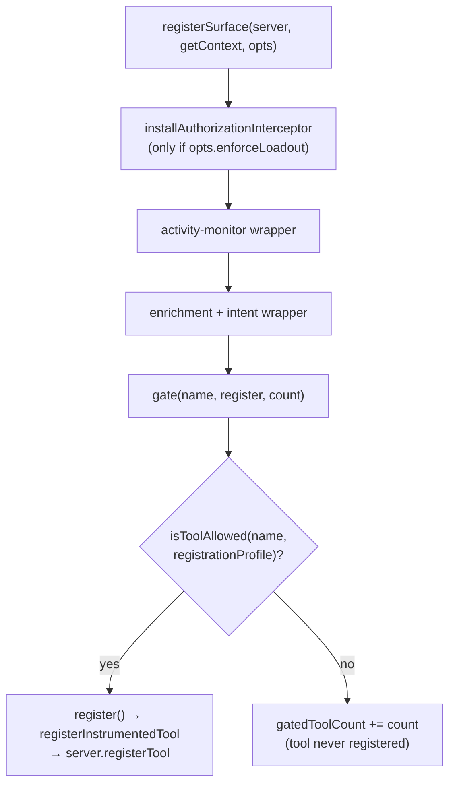
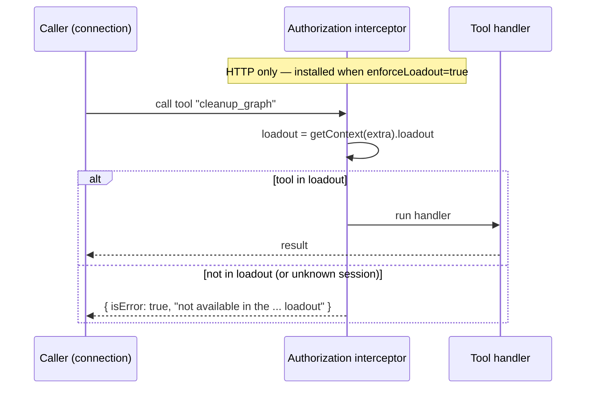

# MCP Tool Catalog

Catalog of every MCP tool the server registers, its purpose (paraphrased from the tool's own `description`), and the lowest loadout profile that exposes it. Every tool is registered in `src/mcp-server.ts` inside `registerSurface()` through the profile-gated `gate()` helper — one `gate()` call per tool, each registering exactly one tool (`src/mcp-server.ts:725-791`). The four loadout profiles and their exact membership are defined in `src/mcp-profiles.ts`. This catalog is meant to be diffed against the registered tools and the profile sets.

There is no terminal tool family: k8s workers are observed via logs + HTTP-MCP, never a live PTY. At the current surface there are **59 `gate()` call sites**, covering the core working set plus `get_workspace_state`, the five Test Service Broker tools `register_image`/`start_test_service`/`extend_lease`/`stop_test_service`/`list_test_services`, the runtime agent-authoring/model-discovery trio `create_agent`/`refresh_agents`/`list_models`, and `observe_events`, `query_all_discoveries`, `list_skills`, `install_skill`, `bureau_discover` (`src/mcp-server.ts › registerSurface`). **55 of those gates are unconditional**, but the four `start_test_service`/`extend_lease`/`stop_test_service`/`list_test_services` gates run only when a `TestServiceManager` exists (k8s mode), so a `full` connection registers **55 tools without a test-service manager and 59 with one** (`src/mcp-server.ts › registerSurface`). Treat the symbol-anchored membership in `src/mcp-profiles.ts` and `src/runtime/capability.ts › KNOWN_MCP_TOOLS` as authoritative.

## The `registerSurface` registration mechanism

All interceptors and tool registrations are installed onto a `McpServer` instance by `registerSurface(server, getContext, opts)` (`src/mcp-server.ts:528-794`). The function is transport-agnostic: every shared dependency (Redis, the graph manager, the registry, …) is closed over from module scope, and only the per-connection `server`, `getContext` resolver, and `opts` vary (`src/mcp-server.ts:533-537`). `opts` carries two flags: `registrationProfile: ProfileName` (which profile decides what gets registered) and `enforceLoadout: boolean` (whether to install the call-time authorization interceptor) (`src/mcp-server.ts:536`).

`registerSurface` installs three layered wrappers around `server.registerTool`, then runs the gated registrations:

1. **Authorization interceptor (outermost, HTTP only).** Installed first — and therefore outermost at call time — only when `opts.enforceLoadout` is true (`src/mcp-server.ts:536-538`). It rejects any call to a tool not in the caller's per-connection loadout before the handler runs (see stdio vs HTTP enforcement).
2. **Activity-monitor wrapper.** Monkey-patches `server.registerTool` so every tool call records to the Redis-backed `ActivityMonitor`, which the orchestrator's health sweep uses to detect dead agents (`src/mcp-server.ts:547-571`).
3. **Enrichment + intent-autopublish wrapper.** Intercepts a set of tool responses to inject workspace-awareness context, drains engine directives, and surfaces unread inbox messages; also auto-publishes agent intent as a side effect of `set_status` (`src/mcp-server.ts:576-707`).

Because each wrapper re-binds `server.registerTool` to call the previous binding, the registration order fixes the call-time wrapper order. Tools register through `registerInstrumentedTool`, which itself calls `server.registerTool` (`src/telemetry/instrumentation/mcp-register.ts:57-72`, `src/telemetry/instrumentation/mcp-register.ts:147`), so the wrappers intercept every tool regardless of OTel state.

### Registration-time gating via `gate()`

After the wrappers, `registerSurface` defines a local `gate(toolName, register, count = 1)` helper and calls it once per tool (`src/mcp-server.ts:715-722`). `gate()` consults `isToolAllowed(toolName, opts.registrationProfile)`: if allowed it runs the `register` callback and adds `count` to `registeredToolCount`; otherwise it adds `count` to `gatedToolCount` and the tool is never registered (`src/mcp-server.ts:715-722`). Every `gate()` call uses the default `count = 1` — there are no multi-tool bundles; each cleanup tool has its own per-name gate. A gated tool therefore does not appear in that connection's tool list at all — gating is a *registration-time* mechanism, not a call-time denial (`src/mcp-server.ts:709-722`). `registerSurface` returns `{ registered, gated }` derived live from these counters (`src/mcp-server.ts:793`); the startup log reads them rather than a hand-counted literal (`src/mcp-server.ts:799-802`).

The wrappers install in order (auth → activity → enrichment); each `gate()` either registers a tool through all installed wrappers or skips it (`src/mcp-server.ts:533-707`).

## The four loadout profiles

`ProfileName` is one of `minimal | coordinator | operator | full` (`src/mcp-profiles.ts:3-10`). The profiles are *nested by containment*: `minimal ⊂ coordinator ⊂ operator`, with `full` a separate "no filtering" sentinel.

| Profile | Definition | Size | Citation |
|---|---|---|---|
| `minimal` | the specialist working set every worker gets | 20 tools | `src/mcp-profiles.ts › MINIMAL_TOOLS` |
| `coordinator` | `minimal` + orchestration tools | 46 tools | `src/mcp-profiles.ts › COORDINATOR_TOOLS` |
| `operator` | `coordinator` + admin/cross-agent tools | 52 tools | `src/mcp-profiles.ts › OPERATOR_TOOLS` |
| `full` | sentinel `null` → no filtering; every registered tool | all (55, or 59 in k8s mode) | `src/mcp-profiles.ts › isToolAllowed` |

`coordinator` spreads `MINIMAL_TOOLS` then adds its own (`src/mcp-profiles.ts:38-40`); `operator` spreads `COORDINATOR_TOOLS` then adds the admin tools (`src/mcp-profiles.ts:71-72`). The nesting is enforced by tests: coordinator includes every minimal tool, and operator includes every coordinator tool (`test: tests/mcp-profiles.test.ts > "coordinator includes all minimal tools"`, `test: tests/mcp-profiles.test.ts > "includes the admin tools coordinator lost"`). `isToolAllowed` returns `true` unconditionally for `full`, else membership-tests the profile's set (`src/mcp-profiles.ts:114-117`).

The **operator-only** tools — those in `OPERATOR_TOOLS` but not `COORDINATOR_TOOLS` — are exactly five admin/cross-agent tools: `cleanup_all`, `cleanup_graph`, `kill_session`, `kill_task`, `cancel_task_graph` (`src/mcp-profiles.ts:71-79`). Tests assert coordinator excludes all five and operator includes all five (`test: tests/mcp-profiles.test.ts > "coordinator no longer includes the operator-only admin tools"`, `test: tests/mcp-profiles.test.ts > "includes the admin tools coordinator lost"`). `inject_context` is also operator-gated but is added by the Context pipe and is treated separately below.

Seven registration sites — `list_criteria_plugins`, `save_criteria_plugin`, `bureau_setup`, `register_image`, and `list_skills`/`install_skill`/`bureau_discover` — register tools that belong to **no** profile set, so they are reachable only under `full` (`src/mcp-profiles.ts › MINIMAL_TOOLS`, `src/runtime/capability.ts › KNOWN_MCP_TOOLS`). The other four Test Service Broker tools (`start_test_service`/`extend_lease`/`stop_test_service`/`list_test_services`) are in `MINIMAL_TOOLS` so workers on the minimal profile can lease test services; they still register only when a `TestServiceManager` exists (k8s mode) (`src/mcp-server.ts:786-791`, `src/mcp-profiles.ts:30-35`).

### How the active profile is chosen

`getActiveProfile(env)` resolves the stdio/env profile: an explicit `BUREAU_PROFILE` matching a valid profile wins; absent that, a spawned agent (`SPAWNED_BY` set) gets `minimal` and a top-level orchestrator gets `full` (`src/mcp-profiles.ts:92-100`). The module-scope `activeProfile` is seeded from this once at load (`src/mcp-server.ts:124`). For HTTP connections, a worker's loadout comes from its task record and an operator's from an engine-signed `loadout` claim, validated through `parseLoadout`, which defaults to least-privilege `minimal` for absent/unrecognized values (`src/mcp-profiles.ts:108-110`, `src/mcp-server.ts:940`).

## stdio vs HTTP enforcement

The same `registerSurface` runs in both transports but with opposite enforcement strategies:

- **stdio** — called once at module scope with `{ registrationProfile: activeProfile, enforceLoadout: false }` (`src/mcp-server.ts:799-802`). The process has a single loadout, so registration-time gating *is* the enforcement: disallowed tools are simply never registered. No call-time interceptor is installed.
- **HTTP** — each connection builds a fresh `McpServer` via `buildSurface`, calling `registerSurface(surface, getCtx, { registrationProfile: "full", enforceLoadout: true })` (`src/mcp-server.ts:940`). Every tool is registered (registrationProfile `full`), and the authorization interceptor enforces the *per-connection* loadout at call time: a call to a tool not in `getContext(extra).loadout` is rejected fail-closed without running the handler, and an unknown/closed session is also denied (`src/runtime/authorization.ts:46-58`, `src/runtime/authorization.ts:8-16`).

On HTTP the interceptor authorizes each call against the connection's loadout; on stdio there is no interceptor and the same decision is made once at registration time (`src/runtime/authorization.ts:26-59`, `src/mcp-server.ts:536-538`).

## Registered tool count

There are **59 `gate()` call sites**, each registering exactly one tool (`src/mcp-server.ts › registerSurface`). 55 register unconditionally; the four test-service gates (`start_test_service`, `extend_lease`, `stop_test_service`, `list_test_services`) are wrapped in an `if (testServiceManager)` block and register only in k8s mode — so a `full` connection exposes **55 tools without a test-service manager, 59 with one** (`src/mcp-server.ts › registerSurface`). There is no multi-tool bundle: `list_graphs`, `cleanup_graph`, and `cleanup_all` each register through an independent per-name gate. The gate sites include `get_workspace_state` and the five Test Service Broker tools `register_image`/`start_test_service`/`extend_lease`/`stop_test_service`/`list_test_services` (`src/mcp-server.ts:778`, `src/mcp-server.ts:785-791`), the `create_agent`/`refresh_agents`/`list_models` trio, and `observe_events` (coordinator), `query_all_discoveries` (minimal), and `list_skills`/`install_skill`/`bureau_discover` (full-only) (`src/mcp-server.ts › registerSurface`, `src/mcp-profiles.ts › MINIMAL_TOOLS`, `src/mcp-profiles.ts › COORDINATOR_TOOLS`).

## Catalog

Profile column = lowest loadout that exposes the tool (`minimal ⊂ coordinator ⊂ operator`). "full only" means the tool is in none of `MINIMAL_TOOLS`, `COORDINATOR_TOOLS`, or `OPERATOR_TOOLS`. Purposes are paraphrased from the tool's own `description` field; the citation is the tool's registration line range.

### minimal (20; 4 of the 20 are k8s mode only)

| Tool | Purpose (from `description`) | Profile | Citation |
|---|---|---|---|
| `set_status` | Update your session's phase + what you're working on; in a graph this emits a progress event for the orchestrator | minimal | `src/tools/set-status.ts:24-28` |
| `set_handoff` | REQUIRED structured handoff context for the next agent; call before the session ends (and before the final commit) | minimal | `src/tools/set-handoff.ts:69-73` |
| `check_messages` | Check inbox, project broadcasts, and task-graph events | minimal | `src/tools/check-messages.ts:18-22` |
| `send_message` | Send a message to another session by ID or role; delivered to their inbox, read on their next `check_messages` | minimal | `src/tools/send-message.ts:15-19` |
| `lock_files` | Acquire exclusive file locks (auto-expire after 5 min) | minimal | `src/tools/lock-files.ts:12-16` |
| `unlock_files` | Release file locks you previously acquired | minimal | `src/tools/unlock-files.ts:12-16` |
| `get_status` | Get detailed status of a specific peer session | minimal | `src/tools/get-status.ts:7-11` |
| `check_health` | Health check on all peers or a specific peer (PID liveness, idle time, phase) | minimal | `src/tools/check-health.ts:15-20` |
| `bureau_health` | Structured health snapshot of the Bureau MCP server | minimal | `src/tools/bureau-health.ts:24-29` |
| `get_version` | Bureau version, build info, runtime diagnostics | minimal | `src/tools/get-version.ts:21-25` |
| `declare_intent` | Declare files you plan to modify; enables workspace conflict detection | minimal | `src/tools/declare-intent.ts:12-16` |
| `post_discovery` | Share a mid-task finding with other agents in the graph (or project, 24h) | minimal | `src/tools/post-discovery.ts:15-19` |
| `query_discoveries` | Query shared findings posted by other agents | minimal | `src/tools/query-discoveries.ts:12-16` |
| `query_all_discoveries` | Query the shared knowledge base across ALL graphs (global view; newest-first, capped at 50, provenance includes graphId) | minimal | `src/tools/query-all-discoveries.ts › registerQueryAllDiscoveries`, `src/mcp-profiles.ts › MINIMAL_TOOLS` |
| `yield_to` | Pause and wait for other agents before resuming; checkpoints progress | minimal | `src/tools/yield-to.ts:12-16` |
| `start_test_service` | Start an ephemeral test service (redis/postgres) scoped to a graph; returns a ready-to-use connection string; auto-cleaned on graph completion or lease expiry (k8s mode only) | minimal (k8s) | `src/tools/start-test-service.ts:20-24`, `src/mcp-server.ts:787` |
| `extend_lease` | Extend a running test service's lease (absolute TTL from now) (k8s mode only) | minimal (k8s) | `src/tools/extend-lease.ts:15-18`, `src/mcp-server.ts:793` |
| `stop_test_service` | Immediately stop a running test service and release its k8s resources (k8s mode only) | minimal (k8s) | `src/tools/stop-test-service.ts:15-18`, `src/mcp-server.ts:789` |
| `list_test_services` | List running test services for a graph with connection strings and lease expiry (k8s mode only) | minimal (k8s) | `src/tools/list-test-services.ts:15`, `src/mcp-server.ts:790` |
| `heartbeat` | Cheap liveness signal; call once per turn — engine delivers pending directives + peer messages on the response, and (in k8s mode) auto-extends the session's active test-service leases | minimal | `src/tools/heartbeat.ts:19-23`, `src/tools/heartbeat.ts:38-50` |

### coordinator (adds 26 to minimal)

| Tool | Purpose (from `description`) | Profile | Citation |
|---|---|---|---|
| `declare_task_graph` | Declare a dependency graph of tasks to execute | coordinator | `src/tools/declare-task-graph.ts:17-21` |
| `spawn_session` | Spawn a new Claude Code session with a role | coordinator | `src/tools/spawn-session.ts:29-33` |
| `await_graph_event` | Block (zero-CPU) until task-graph events arrive | coordinator | `src/tools/await-graph-event.ts:77-80` |
| `approve_task` | Approve a task waiting at an approval gate | coordinator | `src/tools/approve-task.ts:10-14` |
| `reject_task` | Reject a completed task, triggering a rework cycle (max 3 by default) | coordinator | `src/tools/reject-task.ts:14-18` |
| `retry_task` | Retry a failed/canceled task in-place without a new graph | coordinator | `src/tools/retry-task.ts:10-15` |
| `add_task` | Add a task to a running graph at runtime (task injection) | coordinator | `src/tools/add-task.ts:10-14` |
| `get_task_graph` | Full status of a task graph with visualization | coordinator | `src/tools/get-task-graph.ts:13-17` |
| `monitor_graph` | Dashboard-style snapshot of a task graph (returns immediately) | coordinator | `src/tools/monitor-graph.ts:51-55` |
| `observe_events` | Passively tail task-graph events for one or more projects from a client cursor (read-only, no consumer group); each event carries its stream id for resume/dedup/gap-detection — for observers/dashboards, not orchestrators | coordinator | `src/tools/observe-events.ts › registerObserveEvents`, `src/mcp-profiles.ts › COORDINATOR_TOOLS` |
| `list_agents` | List available agent roles for graphs and `spawn_session` | coordinator | `src/tools/list-agents.ts:9-13` |
| `use_template` | Instantiate a graph from a template with variable substitution | coordinator | `src/tools/use-template.ts:14-18` |
| `list_templates` | List available graph templates | coordinator | `src/tools/list-templates.ts:11-15` |
| `merge_graphs` | Merge an active source graph into an active target graph | coordinator | `src/tools/merge-graphs.ts:10-15` |
| `broadcast` | Send a message to all peers in a project group | coordinator | `src/tools/broadcast.ts:12-16` |
| `list_peers` | List registered sessions with health indicators | coordinator | `src/tools/list-peers.ts:8-12` |
| `get_result` | Captured output + exit code of a completed task | coordinator | `src/tools/get-result.ts:10-14` |
| `get_handoff` | Read structured handoff context from a completed task | coordinator | `src/tools/get-handoff.ts:10-14` |
| `get_rework_history` | View rejection/rework history for a task | coordinator | `src/tools/get-rework-history.ts:10-14` |
| `resume_graph` | Reconnect this orchestrator to an in-flight graph; claim ownership | coordinator | `src/tools/resume-graph.ts:16-20` |
| `get_agent_log` | Read the tail of a running/completed agent's output log | coordinator | `src/tools/get-agent-log.ts:14-19` |
| `list_graphs` | List all task graphs in Redis with status/count/age | coordinator | `src/tools/cleanup.ts:7-12` |
| `get_workspace_state` | Project-wide snapshot of declared intents, conflicts, and active file locks across every graph on a project | coordinator | `src/tools/get-workspace-state.ts:17-37`, `src/mcp-profiles.ts:59` |
| `create_agent` | Author a new agent role at runtime — writes `agents/dynamic/<id>.md` and opens an export-back git PR (guardrails: id charset, no coordinator/full/operator template) | coordinator | `src/tools/create-agent.ts › buildCreateAgentHandler`, `src/mcp-profiles.ts › COORDINATOR_TOOLS` |
| `refresh_agents` | Force a re-scan of the agent roster; returns each role with `provenance` (curated\|dynamic) and `sourceFile` | coordinator | `src/tools/refresh-agents.ts › registerRefreshAgents`, `src/mcp-profiles.ts › COORDINATOR_TOOLS` |
| `list_models` | Query a LiteLLM gateway provider's `/model/info` for available models + metadata (degrades to a `providerUnavailable` result when no gateway is configured/reachable) | coordinator | `src/tools/list-models.ts › buildListModelsHandler`, `src/mcp-profiles.ts › COORDINATOR_TOOLS` |

### operator (adds 6 to coordinator)

| Tool | Purpose (from `description`) | Profile | Citation |
|---|---|---|---|
| `cleanup_graph` | Delete all Redis keys for a specific graph ID | operator | `src/tools/cleanup.ts:52-57`, `src/mcp-profiles.ts:71-79` |
| `cleanup_all` | Nuclear option: delete ALL the-bureau Redis keys (requires `confirm=true`) | operator | `src/tools/cleanup.ts:102-107`, `src/mcp-profiles.ts:71-79` |
| `kill_session` | Terminate a spawned worker session by session ID | operator | `src/tools/kill-session.ts:6-11`, `src/mcp-profiles.ts:71-79` |
| `kill_task` | Kill a running task by taskId+graphId; mark it failed | operator | `src/tools/kill-task.ts:14-18`, `src/mcp-profiles.ts:71-79` |
| `cancel_task_graph` | Cancel all non-completed tasks in a graph | operator | `src/tools/cancel-task-graph.ts:10-14`, `src/mcp-profiles.ts:71-79` |
| `inject_context` | Deliver an engine directive to a running worker (prepended to its next MCP response at high salience); author derived from the authenticated caller | operator | `src/tools/inject-context.ts:32-38`, `src/mcp-profiles.ts:71-79` |

### full only (7)

`register_image` is gated unconditionally. The four Test Service Broker tools (`start_test_service`/`extend_lease`/`stop_test_service`/`list_test_services`) are in `minimal (k8s)`, not this section.

| Tool | Purpose (from `description`) | Profile | Citation |
|---|---|---|---|
| `list_criteria_plugins` | List acceptance-criteria plugins from the criteria dir (`CRITERIA_DIR` override, else `plugins/criteria/`) | full only | `src/tools/list-criteria-plugins.ts:10-14`, `src/criterion-engine.ts › defaultCriteriaDir` |
| `save_criteria_plugin` | Promote an inline criterion to a named reusable plugin (writes + commits to git) | full only | `src/tools/save-criteria-plugin.ts:15-19` |
| `bureau_setup` | Configure which MCP servers spawned agents inherit (`discover`/`apply`/`reset`) | full only | `src/tools/bureau-setup.ts:8-17` |
| `register_image` | Add a container image to the approved catalog for use with `start_test_service` (any authenticated user, V1) | full only | `src/tools/register-image.ts:14-23`, `src/mcp-server.ts › registerSurface` |
| `list_skills` | List the first-party skills the engine can serve into a Claude Code client (client-side construct, served over HTTP) | full only | `src/tools/list-skills.ts › registerListSkills`, `src/runtime/capability.ts › KNOWN_MCP_TOOLS` |
| `install_skill` | Return a first-party skill's files for the agent to write into `~/.claude/skills/<id>/` — the HTTP engine cannot write the client filesystem, so it does NOT write files itself | full only | `src/tools/install-skill.ts › registerInstallSkill`, `src/runtime/capability.ts › KNOWN_MCP_TOOLS` |
| `bureau_discover` | Curated orientation map of the live engine (templates, models, agents, criteria plugins, installable skills, active-graph count, health); each section degrades independently | full only | `src/tools/bureau-discover.ts › buildBureauDiscover`, `src/runtime/capability.ts › KNOWN_MCP_TOOLS` |

## Context-pipe tools

The two Context-pipe tools are the engine→worker steering channel. `heartbeat` is in `MINIMAL_TOOLS` so every worker can ping (`src/mcp-profiles.ts:14-30`); `inject_context` is in `OPERATOR_TOOLS` only — never a coordinator or minimal tool — so only an engine/header-assigned `operator` connection can push directives (`src/mcp-profiles.ts:71-79`). The directive an `inject_context` call enqueues is delivered on the target worker's next bureau tool response by the enrichment wrapper's drain step (`src/mcp-server.ts:617-646`) — see [MCP Server Core & Tool Surface](../Subsystems/MCP%20Server%20Core%20%26%20Tool%20Surface.md) ("The Context pipe").

## Notes on profile membership

- **`list_graphs` is coordinator; its `cleanup_*` counterparts are operator-only and gate independently.** The trio is registered by three separate per-name gates: `gate('list_graphs', ...)`, `gate('cleanup_graph', ...)`, `gate('cleanup_all', ...)` (`src/mcp-server.ts:763-765`, `src/tools/cleanup.ts:7-150`). `list_graphs` is a harmless read kept in `COORDINATOR_TOOLS` (`src/mcp-profiles.ts:38-67`); `cleanup_graph`/`cleanup_all` are in `OPERATOR_TOOLS` (`src/mcp-profiles.ts:71-79`). Because each cleanup tool is its own gate key, a **stdio** `coordinator` registration profile registers `list_graphs` only and drops `cleanup_graph`/`cleanup_all`. On **HTTP** the call-time interceptor independently rejects `cleanup_*` for a coordinator loadout (`src/runtime/authorization.ts:46-58`).
- **Four `full`-only tools.** `list_criteria_plugins`, `save_criteria_plugin`, `bureau_setup`, and `register_image` appear in none of the three filtered sets, so `isToolAllowed` returns `true` for them only under `full` (`src/mcp-profiles.ts:14-86`, `src/mcp-profiles.ts:114-117`).

## History & decisions

- The three-profile model (`minimal`/`coordinator`/`full`) shipped first via the MCP profile registry, with `gate()` wrapping all `register*()` calls.
- The `operator` profile was added by a repartition that moved `cleanup_all`/`cleanup_graph`/`kill_session`/`kill_task`/`cancel_task_graph` out of `coordinator` into the new `operator` set and introduced the HTTP call-time authorization interceptor.
- The Context pipe added the `heartbeat` (minimal) and `inject_context` (operator) tools.

## Related

- [MCP Server Core & Tool Surface](../Subsystems/MCP%20Server%20Core%20%26%20Tool%20Surface.md)
- [Spawn & PTY](../Subsystems/Spawn%20%26%20PTY.md)
- [Task Graph Engine](../Subsystems/Task%20Graph%20Engine.md)
- [Workspace Awareness & Locks](../Subsystems/Workspace%20Awareness%20%26%20Locks.md)
- [Criterion Engine & Plugins](../Subsystems/Criterion%20Engine%20%26%20Plugins.md)
- [Test Service Broker](../Subsystems/Test%20Service%20Broker.md)
- [Overview](../Overview.md)
