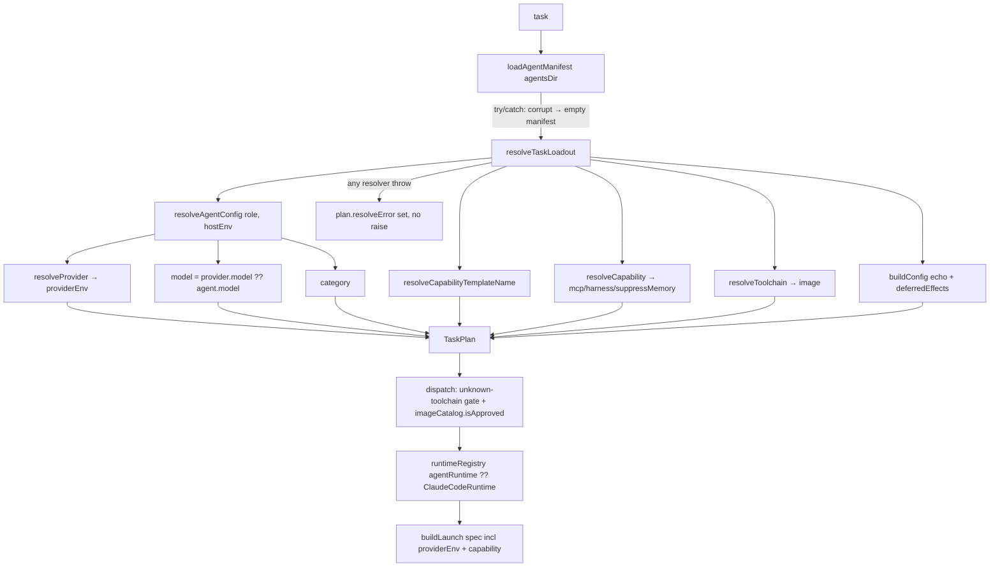
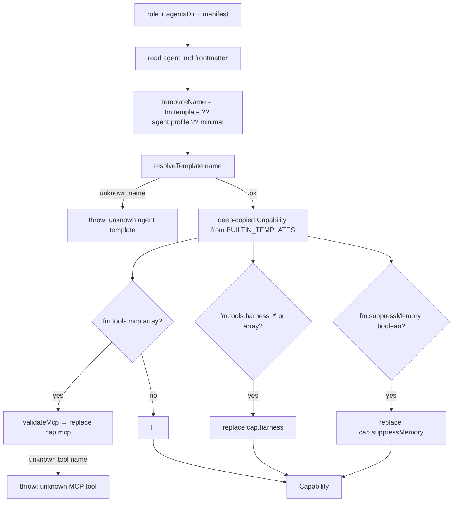
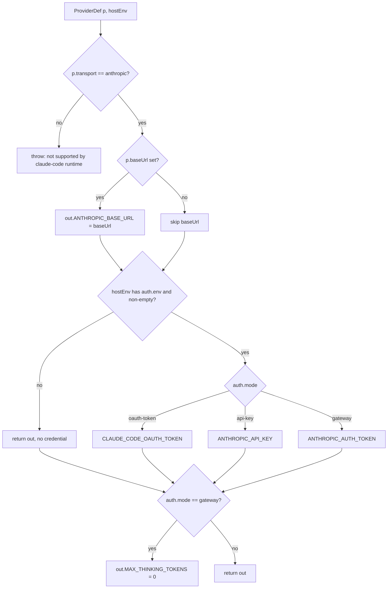

# Agent Runtime & Providers

## Overview

The Agent Runtime & Providers layer decouples The Bureau from being hard-wired to the Claude Code CLI and to a single Anthropic account: each agent can name a **runtime** (which harness/adapter launches it) and a **provider** (which model, endpoint, and auth bundle it uses), and — since the config-driven-tooling work — resolves its **tool capability** (MCP allowlist, harness/built-in tool policy, memory suppression) declaratively from a named template plus per-axis frontmatter overrides (`src/runtime/resolve-agent.ts › resolveAgentConfig`, `src/runtime/resolve-agent.ts › resolveCapability`, `src/runtime/capability.ts › BUILTIN_TEMPLATES`). Runtime/provider routing was introduced as Phase 1 of the pluggable agent runtime and model-provider layer; the capability layer and a frontmatter-derived agent manifest were added in the config-driven-tooling batch. Phase 1 is deliberately a thin seam over the existing Claude spawn path — it adds per-agent model/endpoint/auth routing and registry indirection without changing default behavior (`src/runtime/claude-code.ts › ClaudeCodeRuntime`).

A single **pure per-task resolver**, `resolveTaskLoadout`, now folds provider, capability, model, and toolchain resolution into one descriptive `TaskPlan`, and is shared by both graph dispatch and the dry-run preview so the two can never drift (`src/runtime/resolve-loadout.ts › resolveTaskLoadout`, `src/graph-dispatch.ts › createDispatchHandler`, `src/tools/dry-run.ts › buildDryRunReport`).

## Responsibilities

- Define the runtime/provider vocabulary: `Transport`, `AuthMode`, `ProviderAuth`, `ProviderDef`, `RuntimeDef`, `LaunchSpec`, and the `AgentRuntime` interface (`src/runtime/types.ts › AgentRuntime`, `src/runtime/types.ts › ProviderDef`).
- Load the agent manifest by reading `version`/`runtimes`/`providers` from `agents.json` and **deriving the `agents[]` array from a live scan of `.md` frontmatter** in the curated dir and its `dynamic/` subdir (`src/runtime/resolve-agent.ts › loadAgentManifest`, `src/runtime/resolve-agent.ts › scanAgentFiles`).
- Resolve an agent's provider by precedence — the agent's explicit `provider`, then the `BUREAU_DEFAULT_PROVIDER` host-env override, then a frozen `DEFAULT_PROVIDER` — throwing on an unknown provider name (`src/runtime/provider.ts › resolveProvider`).
- Translate a resolved provider into the endpoint/auth environment variables the agent process needs, including a `MAX_THINKING_TOKENS=0` extended-thinking suppression for gateway providers (`src/runtime/provider.ts › providerEnv`).
- Resolve a role into `{ model, profile, runtime, category, providerEnv }` (`src/runtime/resolve-agent.ts › resolveAgentConfig`).
- Resolve a role's **tool capability** — the `{ mcp, harness, suppressMemory }` descriptor — from a named template (`template` frontmatter → legacy `profile` → `minimal`) with per-axis frontmatter overrides, failing loud on an unknown template or an unknown MCP tool name (`src/runtime/resolve-agent.ts › resolveCapability`, `src/runtime/capability.ts › resolveTemplate`, `src/runtime/capability.ts › KNOWN_MCP_TOOLS`).
- Provide the pure `resolveTaskLoadout` that composes model/provider/capability/toolchain resolution into one `TaskPlan`, capturing any resolver throw into `plan.resolveError` rather than raising (`src/runtime/resolve-loadout.ts › resolveTaskLoadout`).
- Inject `reject_task` into a `reviewLoop` task's resolved MCP allowlist so a minimal-profile reviewer can actually block promotion on a REJECT verdict — added only when the capability is not already `"*"` and does not already list it, regardless of resolution success/failure (`src/runtime/resolve-loadout.ts › resolveTaskLoadout`).
- Surface the agent's `category` on `ResolvedAgentConfig`/`TaskPlan` so dispatch can gate the per-language prompt fragment for code-touching roles (`src/runtime/resolve-agent.ts › resolveAgentConfig`, `src/types/agent.ts › needsLangFragment`).
- Provide the `claude-code` runtime adapter and the `runtimeRegistry` that dispatch looks adapters up in (`src/runtime/claude-code.ts › ClaudeCodeRuntime`, `src/runtime/claude-code.ts › runtimeRegistry`).
- Transmit provider routing/auth env vars to the spawned agent — per-spawn on the local branch, and via the host allowlist as a global default (`src/spawner.ts › buildSpawnCommand`, `src/spawn/strategy.ts › ALLOWLIST_EXTRAS`).

## Key flows

### Per-task loadout resolution at dispatch

This flow shows how a task becomes a launch command. Dispatch and the dry-run preview both call the single pure resolver `resolveTaskLoadout`; only the impure gates (unknown-toolchain fail, async image approval) live in dispatch.

`resolveTaskLoadout` calls `resolveAgentConfig` (which threads `hostEnv` into `resolveProvider` and computes `providerEnv`), resolves the capability template name and full capability, resolves the toolchain image, echoes the per-task build commands, and computes the deferred side-effects, returning a descriptive `TaskPlan` with no side effects; a per-task `task.model` override is applied last, regardless of whether resolution succeeded (`src/runtime/resolve-loadout.ts › resolveTaskLoadout`, `test: src/__tests__/resolve-loadout.test.ts > applies the per-task model override over the role default (A4)`). When the task carries a `reviewLoop`, the resolver also appends `reject_task` to a non-`"*"` capability's `mcp` allowlist (once, only if absent) so a minimal-profile reviewer that would otherwise lack the tool can block promotion on a REJECT verdict — again applied whether or not role resolution succeeded, so a reviewer whose role fails to resolve still gets the tool once dispatch falls back to a default capability (`src/runtime/resolve-loadout.ts › resolveTaskLoadout`, `test: tests/runtime/resolve-loadout-reviewloop.test.ts > adds reject_task to a minimal-profile role's resolved mcp when the task carries reviewLoop`, `test: tests/runtime/resolve-loadout-reviewloop.test.ts > a coordinator role with reviewLoop ends up with reject_task exactly once`). Any throw from the resolvers (unknown provider, unknown template, unknown MCP tool) is caught and stored on `plan.resolveError` instead of propagating; an unknown role is flagged via `roleKnown=false` and does **not** throw (`src/runtime/resolve-loadout.ts › resolveTaskLoadout`, `test: src/__tests__/resolve-loadout.test.ts > flags an unknown role (A3) — resolution does not throw for it`, `test: src/__tests__/resolve-loadout.test.ts > captures a resolver throw as resolveError (A2) — unknown MCP tool`). Graph dispatch loads the manifest defensively (a corrupt `agents.json` degrades to an empty manifest rather than escaping the dispatch handler), then consumes the plan's `model`, `capabilityTemplate`, `category`, `providerEnv`, `mcp`/`harness`/`suppressMemory`, `toolchainName`, and `image`; it runs the two impure gates (an unknown named toolchain fails the task, an unapproved image fails the task) before looking the runtime up in `runtimeRegistry` (falling back to `ClaudeCodeRuntime`) and calling `buildLaunch` (`src/graph-dispatch.ts › createDispatchHandler`). The dry-run preview calls the same resolver over every input task and adds the async image-approval check outside the pure function (`src/tools/dry-run.ts › buildDryRunReport`). The `spawn_session` MCP tool keeps its own direct resolution path (`resolveAgentConfig` + `resolveCapability` under one try/catch) rather than going through `resolveTaskLoadout` (`src/tools/spawn-session.ts › registerSpawnSession`).

### Capability resolution

`resolveCapability` turns an agent's template plus frontmatter into a concrete `{ mcp, harness, suppressMemory }` surface. This is the only place the harness-neutral tool policy becomes concrete.

`resolveTemplate` looks the name up in `BUILTIN_TEMPLATES` and returns a fresh deep copy, throwing `unknown agent template "<name>"` on a miss (`src/runtime/capability.ts › resolveTemplate`). The five built-in templates are `minimal`, `coordinator`, `operator`, `full` (all with `harness: "*"`, memory on), and `nano` (a tiny MCP allowlist, `harness: []`, `suppressMemory: true`) (`src/runtime/capability.ts › BUILTIN_TEMPLATES`, `test: src/__tests__/resolve-loadout.test.ts > resolves a nano agent: small mcp allowlist, no harness, memory suppressed`). A present frontmatter `tools.mcp` replaces the template's MCP axis after being validated against `KNOWN_MCP_TOOLS` — any unlisted name throws `unknown MCP tool "<name>" in agent tools.mcp`; a present `tools.harness` (`"*"` or a list) replaces the harness axis; a present `suppressMemory` boolean replaces that axis (`src/runtime/resolve-agent.ts › resolveCapability`, `src/runtime/resolve-agent.ts › validateMcp`). The `harness` policy is translated to Claude Code `--tools` argv by `toToolFlags` (`"*"` → no flag; `[]` → `--tools ""`; a list → `--tools "A,B"`), and `capabilityAllowsTool` gates the MCP allowlist (`src/runtime/capability.ts › toToolFlags`, `src/runtime/capability.ts › capabilityAllowsTool`, `test: tests/spawner-capability.test.ts > nano capability emits --tools '' and disables auto-memory`). The frontmatter scan reproduces the pre-config-driven capability surface for every shipped agent (`test: tests/tooling-backcompat.test.ts > each agent resolves to its profile's mcp surface`, `test: tests/graph-dispatch-capability.test.ts > every shipped agent resolves to harness '*' (non-nano) or harness [] (nano)`).

### Credential-to-environment mapping

`providerEnv` first guards on transport, then maps the credential by auth mode. This is the only place a provider's auth shape becomes concrete env vars.

`providerEnv` throws if `p.transport` is not `"anthropic"` — `"openai"` is reserved for a future Phase 2 wrapped-mcp runtime and is not handled here (`src/runtime/provider.ts › providerEnv`, `test: tests/runtime/provider.test.ts > throws on a non-anthropic transport (reserved for Phase 2 runtimes)`). It emits `ANTHROPIC_BASE_URL` when `baseUrl` is set, then reads the credential from the named host env var, omitting it entirely if unset or empty, and routes it to the env var matching the auth mode; an exhaustive `never` check guards against an unhandled auth mode (`src/runtime/provider.ts › providerEnv`). Finally, for any `gateway`-mode provider it sets `MAX_THINKING_TOKENS=0` — unconditionally on the auth mode, so it is emitted even when the credential is absent — to disable extended thinking on LiteLLM/Ollama models that do not support it, which would otherwise trigger ~3–4 minutes of exponential-backoff retries on a `does not support thinking` 500 (`src/runtime/provider.ts › providerEnv`, `test: tests/runtime/provider.test.ts > maps gateway auth to ANTHROPIC_BASE_URL + ANTHROPIC_AUTH_TOKEN + MAX_THINKING_TOKENS=0`, `test: tests/runtime/provider.test.ts > sets MAX_THINKING_TOKENS=0 for gateway providers even when credential is absent`). The api-key (Anthropic native) and oauth-token paths leave `MAX_THINKING_TOKENS` unset (`src/runtime/provider.ts › providerEnv`, `test: tests/runtime/provider.test.ts > does NOT set MAX_THINKING_TOKENS for api-key providers (Anthropic native path)`).

## Public interface

| Symbol | Signature | Purpose | Cite |
|---|---|---|---|
| `Transport` | `"anthropic" \| "openai"` | Wire protocol the provider endpoint speaks; only `anthropic` is honored in Phase 1 | `src/runtime/types.ts › Transport` |
| `AuthMode` | `"oauth-token" \| "api-key" \| "gateway"` | How the credential is presented to the agent process | `src/runtime/types.ts › AuthMode` |
| `ProviderDef` | `{ transport; baseUrl?; model?; auth: ProviderAuth }` | A model/endpoint/auth bundle | `src/runtime/types.ts › ProviderDef` |
| `RuntimeDef` | `{ adapter: string; redistributable: boolean }` | Declarative runtime entry in the manifest | `src/runtime/types.ts › RuntimeDef` |
| `AgentRuntime` | `{ id; redistributable; coordination; buildLaunch(spec); hookSettingsFor? }` | Harness adapter interface | `src/runtime/types.ts › AgentRuntime` |
| `DEFAULT_PROVIDER` | frozen `ProviderDef` | Anthropic + api-key from `ANTHROPIC_API_KEY` | `src/runtime/provider.ts › DEFAULT_PROVIDER` |
| `resolveProvider(manifest, agentDef?, hostEnv?)` | returns `ProviderDef` | Resolve provider by precedence: `agentDef.provider` → `BUREAU_DEFAULT_PROVIDER` → `DEFAULT_PROVIDER`; throws on unknown name | `src/runtime/provider.ts › resolveProvider` |
| `providerEnv(p, hostEnv?)` | returns `Record<string,string>` | Credential-to-env mapping; throws on non-anthropic transport; adds `MAX_THINKING_TOKENS=0` for gateway providers | `src/runtime/provider.ts › providerEnv` |
| `loadAgentManifest(agentsDir)` | returns `AgentManifest` | Read providers/runtimes from `agents.json`; derive `agents[]` by scanning curated + `dynamic/` `.md` frontmatter | `src/runtime/resolve-agent.ts › loadAgentManifest` |
| `resolveAgentConfig(manifest, role, hostEnv?)` | returns `ResolvedAgentConfig` | Role → `{ model, profile, runtime, category, providerEnv }` | `src/runtime/resolve-agent.ts › resolveAgentConfig` |
| `resolveCapability(agentsDir, manifest, role)` | returns `Capability` | Role → `{ mcp, harness, suppressMemory }`; template + per-axis frontmatter override; fail-loud | `src/runtime/resolve-agent.ts › resolveCapability` |
| `resolveCapabilityTemplateName(agentsDir, manifest, role)` | returns `string` | The template NAME `resolveCapability` would pick (for display) | `src/runtime/resolve-agent.ts › resolveCapabilityTemplateName` |
| `resolveTaskLoadout(args)` | returns `TaskPlan` | Pure per-task resolver shared by dispatch + dry-run; captures throws into `resolveError` | `src/runtime/resolve-loadout.ts › resolveTaskLoadout` |
| `TaskPlan` | interface | Descriptive resolved loadout for one task (model, capability, toolchain image, providerEnv, deferredEffects, resolveError) | `src/runtime/resolve-loadout.ts › TaskPlan` |
| `Capability` | `{ mcp: string[] \| "*"; harness: HarnessTools; suppressMemory: boolean }` | Harness-neutral tool surface for one agent | `src/runtime/capability.ts › Capability` |
| `BUILTIN_TEMPLATES` | `Record<string, Capability>` | The five named templates: `minimal`/`coordinator`/`operator`/`full`/`nano` | `src/runtime/capability.ts › BUILTIN_TEMPLATES` |
| `resolveTemplate(name)` | returns `Capability` | Named template → fresh deep-copied Capability; throws on unknown name | `src/runtime/capability.ts › resolveTemplate` |
| `KNOWN_MCP_TOOLS` | `ReadonlySet<string>` | Canonical bureau MCP tool names; validates `tools.mcp` frontmatter | `src/runtime/capability.ts › KNOWN_MCP_TOOLS` |
| `toToolFlags(cap)` | returns `string[]` | Harness policy → `--tools` argv (`"*"`→none, `[]`→`--tools ""`, list→`--tools "A,B"`) | `src/runtime/capability.ts › toToolFlags` |
| `capabilityAllowsTool(name, cap)` | returns `boolean` | Whether an MCP tool is permitted by a capability | `src/runtime/capability.ts › capabilityAllowsTool` |
| `ClaudeCodeRuntime` | `AgentRuntime` | `native-mcp`, `redistributable: false` façade over `buildSpawnCommand` | `src/runtime/claude-code.ts › ClaudeCodeRuntime` |
| `runtimeRegistry` | `Record<string, AgentRuntime>` | Adapters keyed by id | `src/runtime/claude-code.ts › runtimeRegistry` |

`loadAgentManifest` no longer throws on a missing `agents` array: it reads `version`/`runtimes`/`providers` from `agents.json` (defaulting `version` to `2.0.0` when the file is absent) and builds the `agents[]` array by scanning `.md` files in the curated dir and its `dynamic/` subdir, deriving each `AgentDef` (including `provenance` and `sourceFile`) from YAML frontmatter (`src/runtime/resolve-agent.ts › loadAgentManifest`, `src/runtime/resolve-agent.ts › scanAgentFiles`, `src/runtime/resolve-agent.ts › readAgentFrontmatter`, `test: src/__tests__/manifest-backcompat.test.ts > loadAgentManifest returns providers from agents.json`, `test: src/__tests__/manifest-backcompat.test.ts > dynamic dir agents have provenance dynamic`). `ClaudeCodeRuntime.buildLaunch` first calls `hookSettingsFor` to compute a steering settings path (returning `/etc/bureau/steer-settings.json` when `spec.workerHttp` is set and `BUREAU_STEERING` is not `"off"`, else `undefined`), then spreads `spec` alongside the computed `steeringSettingsPath` into `buildSpawnCommand`, carrying `providerEnv` and `capability` through unchanged (`src/runtime/claude-code.ts › ClaudeCodeRuntime`).

## Dependencies

- **[Spawn & PTY](Spawn%20%26%20PTY.md)** — `ClaudeCodeRuntime.buildLaunch` wraps `buildSpawnCommand`; the resolved `providerEnv` is delivered through `SpawnCommand.env`, then merged onto the child env by `buildEnv`, and the resolved `capability` drives the `--tools` argv and memory-suppression there (`src/runtime/claude-code.ts › ClaudeCodeRuntime`, `src/spawner.ts › buildSpawnCommand`, `src/spawn/strategy.ts › buildEnv`, `src/runtime/capability.ts › toToolFlags`). The resolved `category` is consumed there to append the static `agents/lang/<toolchain>.md` fragment only when `needsLangFragment(category, role)` is true (`src/types/agent.ts › needsLangFragment`).
- **[Templates & Agent Registry](Templates%20%26%20Agent%20Registry.md)** — `agents.json` supplies the `runtimes`/`providers` maps; the per-agent `runtime`/`provider`/`category`/`profile` fields and the capability `template` live in each agent's `.md` frontmatter, scanned into `AgentDef` (`src/types/agent.ts › AgentDef`, `src/runtime/resolve-agent.ts › scanAgentFiles`, `agents/agents.json`).
- **[Task Graph Engine](Task%20Graph%20Engine.md)** — graph dispatch resolves and dispatches every spawned task through `resolveTaskLoadout` in the dispatch handler (`src/graph-dispatch.ts › createDispatchHandler`).
- The `spawn_session` MCP tool routes through `resolveAgentConfig` + `resolveCapability` directly (`src/tools/spawn-session.ts › registerSpawnSession`).
- The dry-run preview tool routes through `resolveTaskLoadout` (`src/tools/dry-run.ts › buildDryRunReport`).
- Host environment variables named by each provider's `auth.env` (e.g. `ANTHROPIC_API_KEY`, `CLAUDE_CODE_OAUTH_TOKEN`, `LITELLM_KEY`) supply the actual credential values (`src/runtime/provider.ts › providerEnv`).

## Configuration
`agents.json` now holds only global config — `version`, `runtimes`, and `providers`; the `agents[]` array was removed and agents are derived from a scan of `agents/*.md` (curated) and `agents/dynamic/*.md` frontmatter (`agents/agents.json`, `src/runtime/loadAgentManifest`).

Runtimes + providers registered in `agents.json` (`agents/agents.json`):

| Key | Kind | Value | Effect |
|---|---|---|---|
| `runtimes."claude-code"` | runtime | `{ adapter: "claude-code", redistributable: false }` | The only registered adapter; non-redistributable (BYO) |
| `providers."anthropic"` | provider | `transport: anthropic`, `auth: api-key` / `ANTHROPIC_API_KEY` | Default API-key path |
| `providers."anthropic-sub"` | provider | `auth: oauth-token` / `CLAUDE_CODE_OAUTH_TOKEN` | Max-subscription OAuth |
| `providers."local-qwen"` | provider | `baseUrl: http://litellm-gateway:4000`, `model: qwen2.5-coder:14b`, `auth: gateway` / `LITELLM_KEY` | LiteLLM/Ollama gateway |
| `providers."local-qwen3"` | provider | `baseUrl: http://litellm-gateway:4000`, `model: qwen3:14b`, `auth: gateway` / `LITELLM_KEY` | qwen3 variant (tools + 32k context) |
| `providers."local-gpt-oss"` | provider | `baseUrl: http://litellm-gateway:4000`, `model: gpt-oss:20b`, `auth: gateway` / `LITELLM_KEY` | Second gateway provider |

Built-in capability templates (`src/runtime/capability.ts › BUILTIN_TEMPLATES`):

| Template | `mcp` | `harness` | `suppressMemory` | Notes |
|---|---|---|---|---|
| `minimal` | `PROFILE_TOOLS.minimal` | `"*"` | `false` | Default when no template/profile is set |
| `coordinator` | `PROFILE_TOOLS.coordinator` | `"*"` | `false` | Graph-management roles |
| `operator` | `PROFILE_TOOLS.operator` | `"*"` | `false` | Operator roles |
| `full` | `"*"` (all) | `"*"` | `false` | Full MCP + harness surface |
| `nano` | 5-tool allowlist | `[]` (none) | `true` | Small-context local-model bundle; no builtins, memory off |

Per-agent frontmatter fields on `AgentDef`: `category` (gates the per-language fragment append at dispatch), the capability `template`/legacy `profile`, plus optional routing fields `runtime` (defaults to `"claude-code"`) and `provider` (resolved against the `providers` map); `provenance` (`curated`/`dynamic`) and `sourceFile` are derived by the scan (`src/types/agent.ts › AgentDef`, `src/runtime/resolve-agent.ts › scanAgentFiles`). No shipped curated agent declares a `provider`, so all resolve to the default Anthropic path unless overridden (`test: src/__tests__/manifest-backcompat.test.ts > all curated agents resolve to their expected template`).

A process-level env override selects the provider for every role that does not pin one explicitly (`src/runtime/provider.ts › resolveProvider`):

| Var | Type | Default | Effect |
|---|---|---|---|
| `BUREAU_DEFAULT_PROVIDER` | string (a key in `providers`) | unset → `DEFAULT_PROVIDER` (Anthropic api-key) | Repoints all un-pinned roles at the named provider (e.g. `anthropic-sub`, `local-qwen`); an explicit `agentDef.provider` still wins, and an unknown key throws `Unknown provider "<name>" for agent "<default>"` (`test: tests/runtime/provider-default.test.ts > falls back to DEFAULT_PROVIDER (anthropic api-key) when no override is set`) |

Env vars added to the spawn allowlist as a global-default path (`src/spawn/strategy.ts › ALLOWLIST_EXTRAS`):

| Var | Type | Default | Effect |
|---|---|---|---|
| `ANTHROPIC_BASE_URL` | string | unset | Routes the agent to an alternate (e.g. LiteLLM) endpoint |
| `ANTHROPIC_AUTH_TOKEN` | string | unset | Gateway auth token |
| `CLAUDE_CODE_OAUTH_TOKEN` | string | unset | Subscription (OAuth) auth |

Per-spawn `providerEnv` (computed by `resolveAgentConfig`/`resolveTaskLoadout`) is the primary path and overrides these host-global values, because it is merged last into `SpawnCommand.env` and `buildEnv` applies command env (`cmdEnv`) after the allowlist (`src/spawner.ts › buildSpawnCommand`, `src/spawn/strategy.ts › buildEnv`). The gateway-only `MAX_THINKING_TOKENS=0` rides on the per-spawn `providerEnv` path (one of the keys `providerEnv` returns for a gateway provider) and is **not** among `ALLOWLIST_EXTRAS`'s members, so a host-global gateway default set purely via inherited env vars would not carry the thinking suppression. The three provider-routing extras in `ALLOWLIST_EXTRAS` are `ANTHROPIC_BASE_URL`, `ANTHROPIC_AUTH_TOKEN`, and `CLAUDE_CODE_OAUTH_TOKEN`; the set's full membership also carries `REDIS_URL`, `SESSION_ID`, `NODE_ENV`, `ANTHROPIC_API_KEY`, `GEMINI_API_KEY`, and `OPENAI_API_KEY` — `MAX_THINKING_TOKENS` is absent from all of them (`src/runtime/provider.ts › providerEnv`, `src/spawn/strategy.ts › ALLOWLIST_EXTRAS`).

## Failure modes

- **Unknown provider name** — `resolveProvider` throws `Unknown provider "<name>" …`, whether the name came from an agent's `provider` field or from `BUREAU_DEFAULT_PROVIDER` (in which case the error reads `for agent "<default>"`) (`src/runtime/provider.ts › resolveProvider`). Under dispatch this throw is caught inside `resolveTaskLoadout` and stored on `plan.resolveError`; dispatch warns and spawns with no overrides (`src/runtime/resolve-loadout.ts › resolveTaskLoadout`, `src/graph-dispatch.ts › createDispatchHandler`).
- **Unknown capability template / unknown MCP tool** — `resolveTemplate` throws `unknown agent template "<name>"` and `validateMcp` throws `unknown MCP tool "<name>" in agent tools.mcp`; both are caught into `plan.resolveError` at dispatch (and warned in `spawn_session`) (`src/runtime/capability.ts › resolveTemplate`, `src/runtime/resolve-agent.ts › validateMcp`, `test: src/__tests__/resolve-loadout.test.ts > captures a resolver throw as resolveError (A2) — unknown MCP tool`).
- **Unknown runtime id** — registry lookup misses; dispatch and `spawn_session` warn and fall back to `ClaudeCodeRuntime` (`src/runtime/claude-code.ts › runtimeRegistry`, `src/tools/spawn-session.ts › registerSpawnSession`).
- **Non-anthropic transport** — `providerEnv` throws; the throw is captured (into `resolveError` at dispatch, into the warn-and-continue catch in `spawn_session`), so the spawn does not fail — the agent falls back to default host credentials rather than honoring the misconfigured provider (`src/runtime/provider.ts › providerEnv`).
- **Malformed / corrupt `agents.json`** — `JSON.parse` inside `loadAgentManifest` throws; graph dispatch wraps `loadAgentManifest` in a try/catch and degrades to an empty manifest (`{ version: "", agents: [], runtimes: undefined, providers: undefined }`) so the already-"running" task is not left hung, then spawns with no overrides (`src/runtime/resolve-agent.ts › loadAgentManifest`, `src/graph-dispatch.ts › createDispatchHandler`). A *missing* `agents` array is no longer an error — the array is derived from the frontmatter scan.
- **Unknown named toolchain / unapproved image** — the two impure gates in dispatch fail the task explicitly (`src/graph-dispatch.ts › createDispatchHandler`).
- **No credential leak** — `providerEnv` reads credential values from the host env but the resolved map is only ever passed forward as spawn env; the values are never serialized into the note-visible diagnostics. (Diagnostics-log serialization lives in [Spawn & PTY](Spawn%20%26%20PTY.md).)

## Open questions

- The licensing rationale (Claude Code is non-redistributable; subscription credentials must not be routed for third parties) is a documented design premise, not a code-verifiable fact.
- Whether `redistributable: false` is enforced anywhere at runtime (a bundling/ship gate) or is purely descriptive metadata — no enforcement path was located beyond the manifest/registry sync test.
- The exact serialization of the spawn diagnostics log (asserting no `providerEnv` token ever appears in it) lives in [Spawn & PTY](Spawn%20%26%20PTY.md); the no-leak claim above is stated at the level of "the resolved map is only passed forward as spawn env."

## Related

- [Auth & Tokens](Auth%20%26%20Tokens.md) — how the credential values named by each provider's `auth.env` (OAuth token, LiteLLM gateway key) are minted and mounted
- [Spawn & PTY](Spawn%20%26%20PTY.md)
- [Templates & Agent Registry](Templates%20%26%20Agent%20Registry.md)
- [Task Graph Engine](Task%20Graph%20Engine.md)
