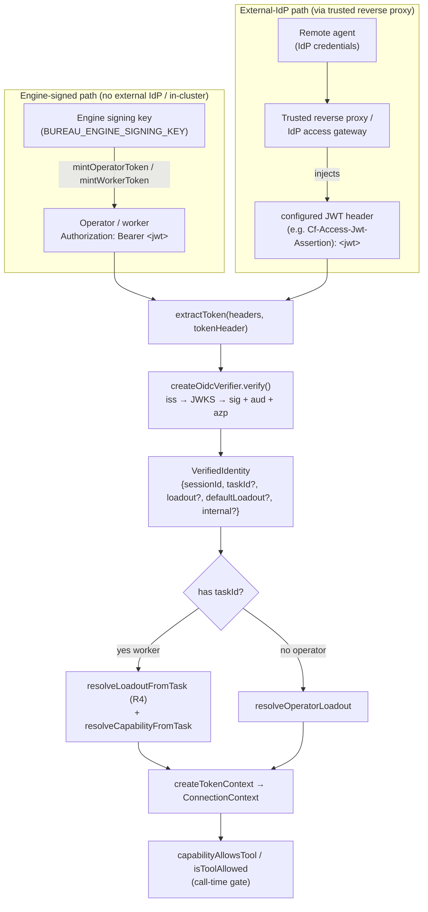
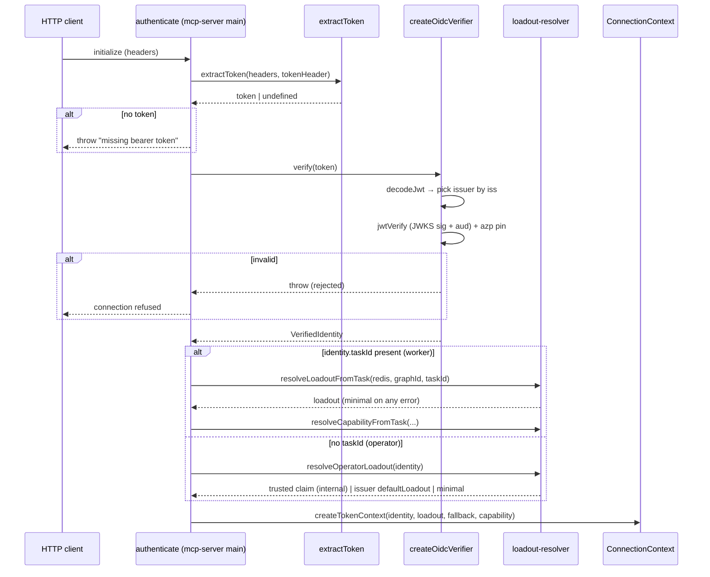

# Auth & Tokens

## Overview

`src/runtime/auth/` is the engine's authentication/authorization token layer: it verifies the bearer JWT on every HTTP MCP connection and maps the verified identity to a *loadout* (tool profile) that gates which tools the connection may call (`src/mcp-server.ts › main`, `src/runtime/connection-context.ts › createTokenContext`). It supports two identity paths against one multi-issuer OIDC verifier: **engine-signed operator/worker bearer tokens** (the no-external-IdP / in-cluster default, minted from a local signing key) and **external-IdP tokens** validated by JWKS, where a trusted reverse proxy in front of the engine may inject the identity JWT into a configured header (`src/runtime/auth/verifier.ts › createOidcVerifier`, `src/runtime/auth/token-source.ts › extractToken`). The external-IdP path is a vendor-neutral OIDC seam: any issuer whose signing keys are published at a JWKS URL can be configured; a hosted access proxy that injects its assertion header (for example, an access gateway that sets `Cf-Access-Jwt-Assertion`) is one such external issuer. The layer is designed **fail-closed**: an unverifiable token is rejected rather than default-allowed, and every loadout-resolution error degrades to the least-privilege `minimal` profile (`src/runtime/auth/verifier.ts › createOidcVerifier`, `src/runtime/auth/loadout-resolver.ts › resolveLoadoutFromTask`).

## Responsibilities

- Extract the bearer JWT from the request headers, honouring a configurable token-source header with an `Authorization: Bearer` fallback (`src/runtime/auth/token-source.ts › extractToken`).
- Build the auth config (mode, issuers, claim mapping, token header) from env or a YAML/JSON file, and append the engine-internal issuer when a signing key is present (`src/runtime/auth/config.ts › loadAuthConfig`, `src/runtime/auth/config.ts › parseAuthConfigFile`).
- Cryptographically verify a token (signature via the issuer's JWKS, issuer, audience — one or more accepted values per issuer — and optional `azp` pin) and map its claims to a `VerifiedIdentity` (`src/runtime/auth/verifier.ts › createOidcVerifier`, `src/runtime/auth/config.ts › IssuerConfig`).
- Mint short-lived engine-signed per-task worker tokens and operator entry tokens (`src/runtime/auth/worker-token.ts › mintWorkerToken`, `src/runtime/auth/worker-token.ts › mintOperatorToken`).
- Load the engine signing key and derive its public JWK for local (no-network) verification of engine-minted tokens (`src/runtime/auth/engine-key.ts › loadEngineSigningKey`, `src/runtime/auth/engine-key.ts › buildEngineJwksFor`).
- Resolve a verified identity to a loadout and a `Capability`, from the task record for workers or from the trusted claim / issuer default for operators (`src/runtime/auth/loadout-resolver.ts › resolveOperatorLoadout`, `src/runtime/auth/loadout-resolver.ts › resolveLoadoutFromTask`, `src/runtime/auth/loadout-resolver.ts › resolveCapabilityFromTask`).
- Enforce the fail-closed bind rule: refuse to serve unauthenticated on a non-loopback host (`src/runtime/auth/fail-closed.ts › assertBindAllowed`).
- Back the `mint-operator-token` CLI subcommand (`src/runtime/auth/operator-token-cli.ts › buildOperatorToken`).

## Key flows

### The two identity paths

Both callers converge on the same multi-issuer verifier; they differ only in which header carries the JWT, which issuer signs it, and where the loadout comes from. This diagram shows the two paths from caller to a resolved `ConnectionContext`.

The engine-signed path holds the private key and mints its own tokens, so the engine-internal issuer is the *one* issuer whose self-asserted loadout claim is trusted (`src/runtime/auth/worker-token.ts › mintOperatorToken`, `src/runtime/auth/loadout-resolver.ts › resolveOperatorLoadout`). The external-IdP path never carries a trusted loadout claim — the trusted reverse proxy validates the caller and injects the identity JWT into the configured header (a raw JWT, no `Bearer` prefix), which `extractToken` reads first, falling back to `Authorization: Bearer` so in-cluster workers/operators that never traverse the proxy keep working (`src/runtime/auth/token-source.ts › extractToken`).

### Token → identity → loadout → capability

The `authenticate` callback wired in `main()` runs this sequence per HTTP connection; the resulting `loadout`/`capability` on the `ConnectionContext` are what the call-time authorization interceptor enforces (`src/mcp-server.ts › main`).

Workers get their loadout from the task record the engine stamped at dispatch, never from the token (rule "R4"); operator entry tokens (no `taskId`) instead carry an engine-signed loadout claim resolved through `resolveOperatorLoadout` (`src/mcp-server.ts › main`, `src/runtime/auth/loadout-resolver.ts › resolveLoadoutFromTask`, `src/runtime/auth/loadout-resolver.ts › resolveOperatorLoadout`). A missing token throws `missing bearer token`, and an invalid signature/issuer/audience/`azp` makes `verify()` throw, so the connection is refused — the token layer never default-allows (`src/mcp-server.ts › main`, `src/runtime/auth/verifier.ts › createOidcVerifier`, `test: tests/runtime/auth/verifier.test.ts > "rejects a token from an unconfigured issuer"`).

## Public interface

| Symbol | Signature (abbrev.) | Purpose |
|---|---|---|
| `extractToken` | `(headers, tokenHeader?) → string \| undefined` | Read the JWT from the configured header, falling back to `Authorization: Bearer`; strips the `Bearer ` scheme, case-insensitive (`src/runtime/auth/token-source.ts › extractToken`). |
| `loadAuthConfig` | `(env?) → AuthConfig` | Build config from `BUREAU_AUTH_CONFIG` file or legacy flat env; append the engine-internal issuer if a signing key exists; throw if `oidc` with no issuer (`src/runtime/auth/config.ts › loadAuthConfig`). |
| `parseAuthConfigFile` | `(text) → AuthConfig` | Parse a YAML/JSON auth config; require issuer+audience per issuer; `audience` may be a scalar string or a non-empty array (an empty array throws) (`src/runtime/auth/config.ts › parseAuthConfigFile`). |
| `effectiveClaimMapping` | `(global, issuer) → ClaimMapping` | Layer a per-issuer claim-mapping override over the global mapping (`src/runtime/auth/config.ts › effectiveClaimMapping`). |
| `createOidcVerifier` | `(cfg, deps?) → TokenVerifier` | Multi-issuer verifier: select issuer by `iss`, verify sig+aud against its JWKS (audience may be one value or an array — the token's `aud` must match ANY listed value), optional `azp` pin, map claims to `VerifiedIdentity` (`src/runtime/auth/verifier.ts › createOidcVerifier`). |
| `defaultDiscover` / `defaultJwksFor` | `(issuer, …) → …` | Vendor-neutral OIDC discovery of `jwks_uri`; build a remote JWKS key-getter (`src/runtime/auth/verifier.ts › defaultDiscover`, `src/runtime/auth/verifier.ts › defaultJwksFor`). |
| `mintWorkerToken` | `(key, {sessionId,taskId,graphId}, ttl=3600) → string` | Sign a short-lived per-task token carrying identity claims **only** (`src/runtime/auth/worker-token.ts › mintWorkerToken`). |
| `mintOperatorToken` | `(key, {sessionId,loadout}, ttl=3600) → string` | Sign an operator entry token with an explicit loadout claim and no `taskId` (`src/runtime/auth/worker-token.ts › mintOperatorToken`). |
| `loadEngineSigningKey` | `(env?) → EngineSigningKey \| undefined` | Decode base64 PKCS8 PEM from `BUREAU_ENGINE_SIGNING_KEY`; `undefined` when absent (`src/runtime/auth/engine-key.ts › loadEngineSigningKey`). |
| `buildEngineJwksFor` | `(signingKey) → (issuer) → JWTVerifyGetKey` | Per-issuer JWKS resolver: static public key for the engine issuer (no network), remote JWKS for all others (`src/runtime/auth/engine-key.ts › buildEngineJwksFor`). |
| `resolveOperatorLoadout` | `(identity) → ProfileName` | Trust the loadout claim for internal identities; use the issuer `defaultLoadout` for external ones; else `minimal` (`src/runtime/auth/loadout-resolver.ts › resolveOperatorLoadout`). |
| `resolveLoadoutFromTask` | `(redis, graphId?, taskId?) → ProfileName` | Read the worker's loadout from its task record; `minimal` on missing/invalid/error (`src/runtime/auth/loadout-resolver.ts › resolveLoadoutFromTask`). |
| `resolveCapabilityFromTask` | `(redis, graphId?, taskId?) → Capability \| undefined` | Read the resolved `Capability` from the task record; `undefined` on missing/invalid/error (`src/runtime/auth/loadout-resolver.ts › resolveCapabilityFromTask`). |
| `assertBindAllowed` | `(mode, host) → void` | Throw unless `oidc` mode or a loopback host — refuses unauthenticated non-loopback binds (`src/runtime/auth/fail-closed.ts › assertBindAllowed`). |
| `buildOperatorToken` / `parseTtlSeconds` | CLI helpers (**off-barrel** — not re-exported by `index.ts`) | Back `the-bureau mint-operator-token`; require the signing key; parse `7d`/`12h`/`3600` TTLs; imported directly by the `mint-operator-token` CLI dispatch, not via the index barrel (`src/runtime/auth/operator-token-cli.ts › buildOperatorToken`, `src/runtime/auth/operator-token-cli.ts › parseTtlSeconds`, `src/cli.ts › runMintOperatorToken`). |

`src/runtime/auth/index.ts` re-exports exactly seven of these modules — `config`, `verifier`, `loadout-resolver`, `fail-closed`, `worker-token`, `engine-key`, and `token-source` — as the subsystem's public barrel (`src/runtime/auth/index.ts`). `operator-token-cli` is deliberately **off-barrel**: `index.ts` does not re-export it, so the operator-token CLI helpers (`buildOperatorToken`/`parseTtlSeconds`) are imported directly by the `mint-operator-token` CLI dispatch — a dynamic `import("./runtime/auth/operator-token-cli.js")` — rather than through the index barrel (`src/runtime/auth/index.ts`, `src/cli.ts › runMintOperatorToken`).

## Trust model (security-honest)

- **Only the engine-internal issuer's loadout claim is trusted.** `loadAuthConfig` appends `{ issuer: "bureau-engine-internal", internal: true }` only when the engine holds the signing key; `resolveOperatorLoadout` trusts a self-asserted loadout claim *only* when `identity.internal` is true (`src/runtime/auth/config.ts › loadAuthConfig`, `src/runtime/auth/loadout-resolver.ts › resolveOperatorLoadout`). An external IdP cannot set `internal` — it is stamped engine-side from config, not read from the token.
- **External-IdP operator tokens get the issuer's configured `defaultLoadout`, never their own claim.** `resolveOperatorLoadout` returns `identity.defaultLoadout ?? "minimal"` for non-internal identities, ignoring any loadout claim in the token (`src/runtime/auth/loadout-resolver.ts › resolveOperatorLoadout`, `test: tests/runtime/auth/loadout-resolver.test.ts > "uses the issuer defaultLoadout for an external identity, ignoring any claim"`). An external issuer *configured* with `defaultLoadout: full` maps its callers to the `full` loadout — a deployment configuration choice, not a code default.
- **Worker tokens carry no loadout at all.** `mintWorkerToken` emits only `bureau_task_id`/`bureau_graph_id` + subject; the loadout is read from the task record (R4) so a worker cannot escalate by editing a header or claim (`src/runtime/auth/worker-token.ts › mintWorkerToken`, `test: tests/runtime/auth/worker-token.test.ts > "does NOT embed a loadout claim (loadout is engine-resolved, R4)"`).
- **Unverified decode is used only to select the issuer.** `verify()` calls `decodeJwt` (no signature check) solely to read `iss` and pick the configured issuer, then performs the real cryptographic check with `jwtVerify` against that issuer's JWKS plus audience and optional `azp` pin (`src/runtime/auth/verifier.ts › createOidcVerifier`, `test: tests/runtime/auth/verifier.test.ts > "rejects a token whose azp differs"`).
- **A rejected JWKS getter is evicted, not cached.** A transient discovery/JWKS failure on first use of an issuer deletes the cached key-getter so the issuer is retried rather than poisoned until pod restart (`src/runtime/auth/verifier.ts › createOidcVerifier`).

## Dependencies

- **`jose`** for all JWT sign/verify, JWKS, and key import/export (`src/runtime/auth/verifier.ts › createOidcVerifier`, `src/runtime/auth/worker-token.ts › mintWorkerToken`).
- **Redis** — the worker loadout/capability/project resolvers read `graph:<graphId>:tasks:<taskId>` task records (`src/runtime/auth/loadout-resolver.ts › resolveLoadoutFromTask`); see [Redis & Connection Layer](Redis%20%26%20Connection%20Layer.md) and [Task Graph Engine](Task%20Graph%20Engine.md).
- **`src/mcp-profiles.ts`** — `parseLoadout` validates a raw loadout string to a `ProfileName` (defaulting to `minimal`), and `isToolAllowed` is the profile-based call-time gate (`src/mcp-profiles.ts › parseLoadout`, `src/mcp-profiles.ts › isToolAllowed`); loadouts are consumed by [MCP Server Core & Tool Surface](MCP%20Server%20Core%20%26%20Tool%20Surface.md).
- **[MCP Server Core & Tool Surface](MCP%20Server%20Core%20%26%20Tool%20Surface.md)** wires this layer: `main()` calls `assertBindAllowed`, constructs the verifier, and installs the `authenticate` callback; `createTokenContext` (in `connection-context.ts`) builds the per-connection `ConnectionContext` (`src/mcp-server.ts › main`, `src/runtime/connection-context.ts › createTokenContext`).
- **[MCP Gateway](MCP%20Gateway.md)** — when an MCP registry is configured, the `authenticate` callback augments the worker's `Capability` with allowed proxy-tool names so the call-time gate accepts them (`src/mcp-server.ts › main`).
- **[Agent Runtime & Providers](Agent%20Runtime%20%26%20Providers.md)** owns the *distinct* `src/runtime/resolve-loadout.ts › resolveTaskLoadout` (dispatch-time loadout resolution). This subsystem's `loadout-resolver.ts` is the **auth-time** resolver — a different module that reads what dispatch already stamped.

## Configuration

| Env / key | Type | Default | Effect |
|---|---|---|---|
| `BUREAU_AUTH_MODE` | `none` \| `oidc` | `none` | `oidc` enables token verification; `none` is dev/loopback-only (`src/runtime/auth/config.ts › loadAuthConfig`, `src/runtime/auth/fail-closed.ts › assertBindAllowed`). |
| `BUREAU_AUTH_CONFIG` | file path | unset | YAML/JSON auth config (multi-issuer); overrides the flat-env path (`src/runtime/auth/config.ts › loadAuthConfig`, `src/runtime/auth/config.ts › parseAuthConfigFile`). |
| `tokenHeader` / `BUREAU_AUTH_TOKEN_HEADER` | string | `Authorization` | Header carrying the JWT; set to the proxy's assertion header (e.g. `Cf-Access-Jwt-Assertion`) when a trusted reverse proxy injects the identity JWT (`src/runtime/auth/token-source.ts › extractToken`, `src/runtime/auth/config.ts › loadAuthConfig`). |
| `BUREAU_AUTH_ISSUER` / `_AUDIENCE` / `_JWKS_URI` | string | — | Legacy single-issuer flat-env config (`src/runtime/auth/config.ts › loadAuthConfig`). |
| `issuers[].audience` | string \| string[] | — (required) | Accepted audience(s) for the issuer; a scalar or a non-empty array. jose's `jwtVerify` passes when the token's `aud` matches ANY listed value; an empty array is rejected at parse time (`src/runtime/auth/config.ts › IssuerConfig`, `src/runtime/auth/config.ts › parseAuthConfigFile`, `src/runtime/auth/verifier.ts › createOidcVerifier`). |
| `issuers[].claimMapping.sessionId` | claim name | `sub` | Which claim becomes `sessionId`; some external issuers set identity in a non-`sub` claim (e.g. `common_name` with an empty `sub`), mapped via this override (`src/runtime/auth/config.ts › effectiveClaimMapping`, `test: tests/runtime/auth/verifier.test.ts > "maps sessionId from common_name when sub is empty and applies the issuer defaultLoadout"`). |
| `issuers[].defaultLoadout` | `ProfileName` | — | Loadout for operator tokens from a non-internal issuer (`src/runtime/auth/loadout-resolver.ts › resolveOperatorLoadout`). |
| `issuers[].authorizedParty` | string | — | When set, the token's `azp` must equal it (defense-in-depth) (`src/runtime/auth/verifier.ts › createOidcVerifier`). |
| `BUREAU_ENGINE_SIGNING_KEY` | base64 PKCS8 PEM | unset | Enables the engine-internal issuer + token minting; loaded unconditionally at startup (`src/runtime/auth/engine-key.ts › loadEngineSigningKey`, `src/runtime/auth/config.ts › loadAuthConfig`). |
| `BUREAU_ENGINE_SIGNING_KID` | string | `engine-key` | JWK `kid` for engine-minted tokens (`src/runtime/auth/engine-key.ts › loadEngineSigningKey`). |

## Failure modes

- **`oidc` mode with no issuer configured → startup throws.** `loadAuthConfig` throws `BUREAU_AUTH_MODE=oidc requires at least one issuer` after the engine-internal issuer append, so a misconfigured deployment fails loud rather than serving open (`src/runtime/auth/config.ts › loadAuthConfig`, `test: tests/runtime/auth/config.test.ts > "throws if oidc mode is set without an issuer"`).
- **Issuer with a missing or empty-array `audience` → config parse throws.** `parseAuthConfigFile` throws `missing 'audience'` when an issuer has none and `'audience' must not be an empty array` for `audience: []`, so an issuer can never be admitted with a vacuous audience match-set (`src/runtime/auth/config.ts › parseAuthConfigFile`, `test: src/__tests__/auth-multi-audience.test.ts > "rejects an empty array audience with a clear error"`).
- **`none` mode on a non-loopback bind → refuses to serve.** `assertBindAllowed` throws a `fail-closed:` error for any non-loopback host in `none` mode, inverting the historical silent fail-open (rule "R11") (`src/runtime/auth/fail-closed.ts › assertBindAllowed`, `test: tests/runtime/auth/fail-closed.test.ts > "rejects none mode on a non-loopback bind"`).
- **Missing/invalid token → connection refused.** `authenticate` throws `missing bearer token` when none is present, and `verify()` throws on a bad signature, unconfigured issuer, wrong audience, or `azp` mismatch (`src/mcp-server.ts › main`, `src/runtime/auth/verifier.ts › createOidcVerifier`, `test: tests/runtime/auth/verifier.test.ts > "rejects a token from an unconfigured issuer"`).
- **Task-record read failure → least privilege.** `resolveLoadoutFromTask` returns `minimal` on a missing node, missing/unknown loadout string, or any Redis error; `parseLoadout` maps any unrecognized value to `minimal`; `resolveCapabilityFromTask` returns `undefined` on any failure (`src/runtime/auth/loadout-resolver.ts › resolveLoadoutFromTask`, `src/mcp-profiles.ts › parseLoadout`, `test: tests/runtime/auth/loadout-resolver.test.ts > "defaults to minimal when loadout is an unknown string"`).
- **Operator token minted without the signing key → CLI error.** `buildOperatorToken` throws `BUREAU_ENGINE_SIGNING_KEY is not set` — operator tokens can only be minted where the key is available (in-cluster) (`src/runtime/auth/operator-token-cli.ts › buildOperatorToken`).

## Design notes

- **The verifier is multi-issuer by construction.** The single-engine HTTP entrypoint authenticates the orchestrator with an engine-minted operator token (self-contained, no external dependency); accepting external-IdP tokens over JWKS is purely *additive* on top of that, because the verifier selects the issuer by `iss` and each issuer carries its own JWKS, audience, and claim mapping. Adding an external issuer never changes the engine-signed path.
- **A configurable token-source header supports proxy-injected identity.** A remote agent behind a trusted reverse proxy may only send the proxy's own credentials to pass the access wall and hold no `Authorization` bearer of its own; the proxy validates the caller and injects the identity JWT into a configured header. `tokenHeader` (default `Authorization`, unchanged) lets the engine read that header, with an `Authorization: Bearer` fallback so in-cluster callers are unaffected. External-issuer JWTs that carry identity in a non-`sub` claim are handled by the per-issuer `claimMapping.sessionId`.
- **Multiple audiences per OIDC issuer.** `IssuerConfig.audience` is `string | string[]`; `parseAuthConfigFile` accepts a scalar or a non-empty array (rejecting `audience: []`), and the verifier hands the value straight to jose's `jwtVerify`, which passes when the token's `aud` matches ANY listed value. Scalar configs are unchanged. This lets one issuer's tokens be accepted for several service audiences (e.g. a shared access app fronting both a dashboard and the engine) without a second issuer entry (`src/runtime/auth/config.ts › IssuerConfig`, `src/runtime/auth/verifier.ts › createOidcVerifier`).

## Related

- [System Map](../Architecture/System%20Map.md)
- [MCP Server Core & Tool Surface](MCP%20Server%20Core%20%26%20Tool%20Surface.md)
- [Agent Runtime & Providers](Agent%20Runtime%20%26%20Providers.md)
- [MCP Gateway](MCP%20Gateway.md)
- [Task Graph Engine](Task%20Graph%20Engine.md)
- [Redis & Connection Layer](Redis%20%26%20Connection%20Layer.md)
