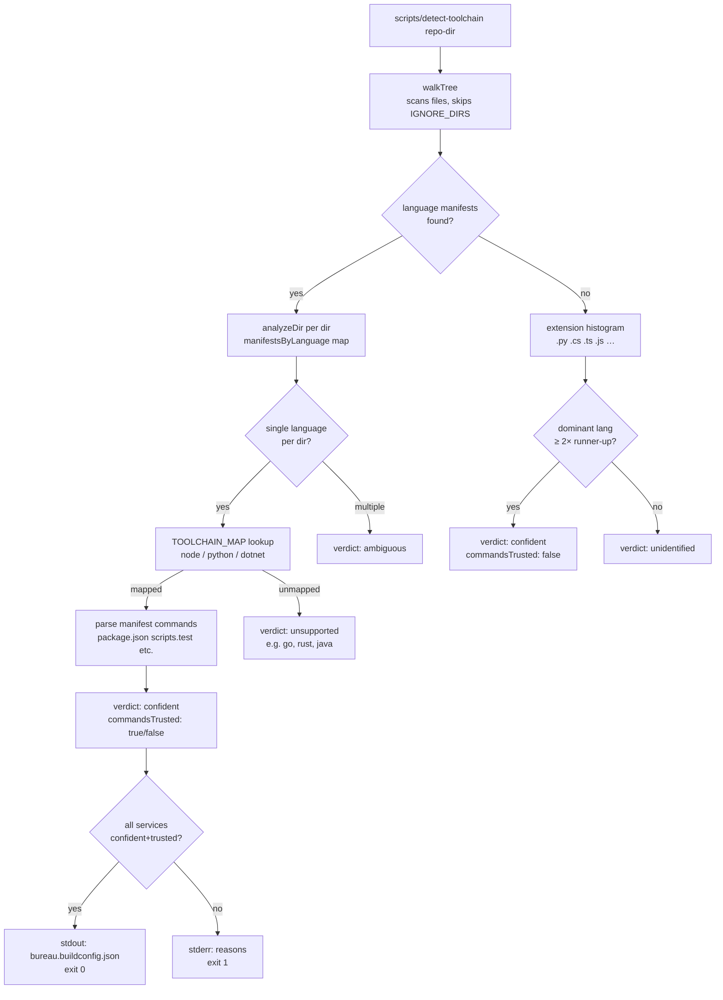
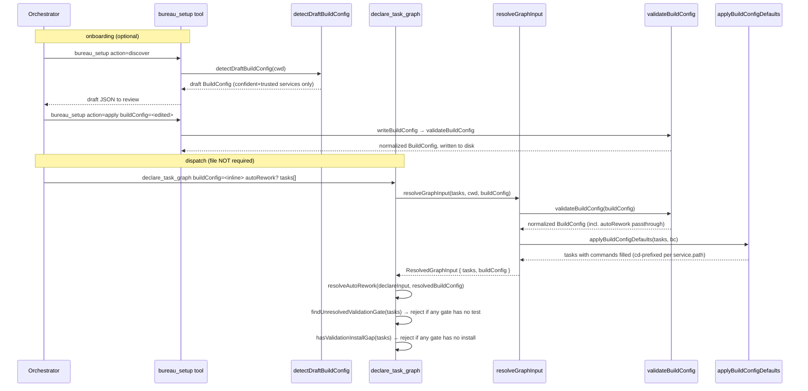
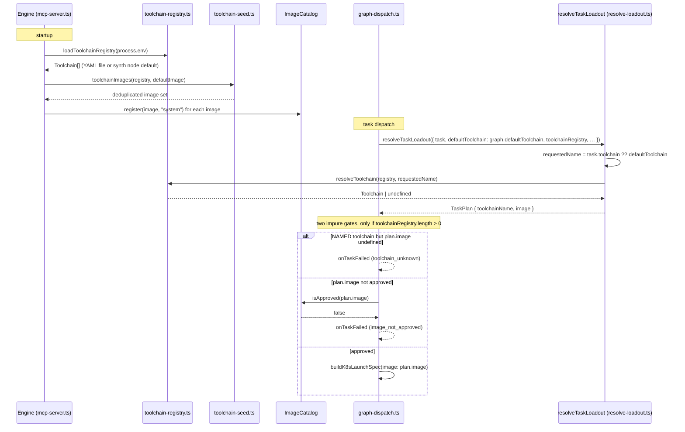
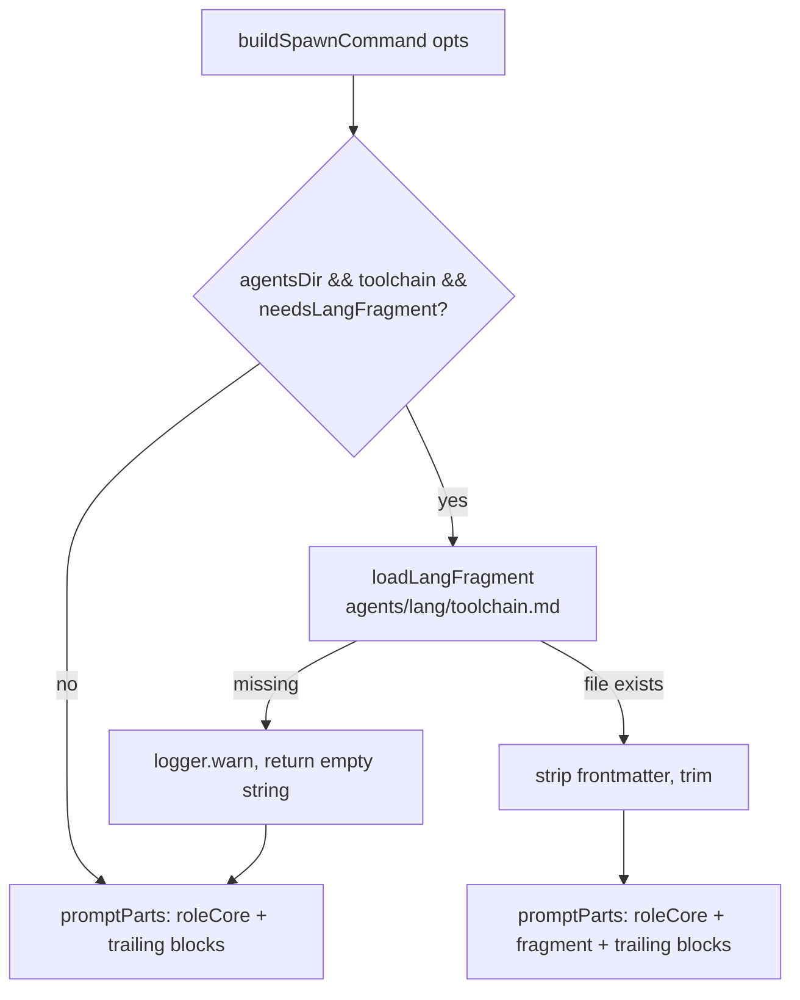

# Build Config & Toolchain Detection

## Overview

This subsystem makes The Bureau language-agnostic: it detects or reads a project's build toolchain (Node, Python, .NET), maps that to a versioned worker image, injects per-language context into agent prompts, and runs the worker entrypoint in a language-neutral exec model. Before this subsystem existed the engine assumed every worker ran Node/npm; now language is data, not code. The subsystem spans four descriptor/dispatch layers — static descriptor files (`bureau.buildconfig.json`), a detection CLI (`scripts/detect-toolchain`), an engine-side toolchain registry (`src/spawn/toolchain-registry.ts › loadToolchainRegistry`), and the worker entrypoint (`docker/worker/entrypoint.sh`) — plus two ergonomic on-ramps that let callers skip the committed descriptor file entirely: an **inline `buildConfig`** object accepted by `declare_task_graph` / `use_template` (`src/tools/declare-task-graph.ts › applyBuildConfigDefaults`), and a **`bureau_setup`** onboarding flow that drafts, writes, and removes the descriptor (`src/tools/bureau-setup.ts › registerBureauSetup`).

## Responsibilities

- **Descriptor types**: define `ServiceConfig` (required: `name`, `path`, `language`; optional: `languageVersion?`, `toolchain?`, `install?`, `build?`, `test?`, `integrationTest?`, `lint?`, `testReport?`) (`src/buildconfig/types.ts › ServiceConfig`), `BuildConfig` (`version: 1`, `services: ServiceConfig[]`, and an optional graph-level `autoRework?: { maxAttempts?, fixRole? }` opt-in for the bounded auto-rework loop) (`src/buildconfig/types.ts › BuildConfig`), and `ResolvedCommands` (all five fields required strings: `install`, `build`, `test`, `integrationTest`, `lint`) (`src/buildconfig/types.ts › ResolvedCommands`).
- **Auto-detection**: walk a repo's file tree for language manifests; fall back to file-extension histograms; classify each service as `confident | unsupported | unidentified | ambiguous` (`src/buildconfig/detect.ts › detectToolchains`).
- **Descriptor loading**: read `bureau.buildconfig.json` off disk and delegate to `validateBuildConfig`; returns `null` when the file is absent, throws `BuildConfigError` on malformed JSON (`src/buildconfig/load.ts › loadBuildConfig`).
- **Descriptor validation (file-independent)**: `validateBuildConfig` parses an already-decoded raw object — flat single-service or `services[]` envelope form — validates each service has `language` + `path`, defaults `name` to `path`, and returns a normalized `BuildConfig`; it does no file I/O, which is what lets the inline and setup paths reuse it (`src/buildconfig/load.ts › validateBuildConfig`). It also passes through a raw `autoRework` field from the `services[]` envelope form (throwing `BuildConfigError` if `autoRework` is present but not an object) and strips it from the flat single-service form so it never leaks into a service (`src/buildconfig/load.ts › validateBuildConfig`, `test: src/__tests__/buildconfig-validate.test.ts > "does not leak autoRework into the flat single-service form"`).
- **Graph-level autoRework resolution**: `normalizeAutoRework` maps a raw `{ maxAttempts?, fixRole? }` to the persisted shape or `undefined` (off) — default `maxAttempts` 1 when the object is present-but-unset, hard-capped at 3, and any value ≤ 0, non-finite, NaN, or Infinity is off; `resolveAutoRework` picks the `declare_task_graph` input over `buildConfig.autoRework` **wholesale** (presence of the declare key, even `{}` or `maxAttempts:0`, wins; only its absence falls back to the descriptor) (`src/tools/resolve-graph-input.ts › normalizeAutoRework`, `src/tools/resolve-graph-input.ts › resolveAutoRework`, `test: src/__tests__/resolve-graph-input.test.ts > "declare input overrides buildConfig wholesale when both are set"`).
- **Descriptor filename constant**: the on-disk name `bureau.buildconfig.json` is exported once as `BUILDCONFIG_FILENAME` and reused by the loader and the setup helpers (`src/buildconfig/load.ts › BUILDCONFIG_FILENAME`).
- **Inline buildConfig resolution**: `applyBuildConfigDefaults` fills each task's missing `install/build/test/integrationTest/lint` from the service its `service` field selects; explicit per-task commands always win, and commands from a non-root service path are prefixed with `cd "<path>" && ` because the worker always runs at `/workspace` (`src/tools/declare-task-graph.ts › applyBuildConfigDefaults`).
- **Shared graph-input resolution**: `resolveGraphInput` — used by both `declare_task_graph` and `use_template` — runs the criteria-mixing guard, validates any inline `buildConfig`, applies buildConfig defaults, then applies `.bureau/config.json` validation defaults, in that precedence order, and returns a `ResolvedGraphInput` object `{ tasks, buildConfig }` (the resolved tasks plus the already-validated `buildConfig`, so the caller can resolve autoRework without a second `validateBuildConfig` call) (`src/tools/resolve-graph-input.ts › resolveGraphInput`, `src/tools/resolve-graph-input.ts › ResolvedGraphInput`, `test: src/__tests__/resolve-graph-input.test.ts > "returns the validated buildConfig alongside tasks so callers don't re-validate it"`).
- **Declare-time validation-gate rejection**: `declare_task_graph` / `use_template` reject at declare time when any task declares a `validation` level (`self`/`unit`/`integration`) but has no resolvable test command after buildConfig fill — `findUnresolvedValidationGate` finds the first offending task (predicate: `validation` set and no `test`) and `formatUnresolvedValidationGateError` names it plus the three remedies, instead of letting the task die ~70ms later at dispatch with no sessionId and cascade-canceling dependents (`src/tools/dry-run.ts › findUnresolvedValidationGate`).
- **Validation install-gap rejection**: `hasValidationInstallGap` returns true when a unit/integration validation task exists but none of those tasks provide a way to install deps — neither a truthy `task.install` (buildConfig service installs are already filled onto `task.install` by this point) nor an install step embedded in the test command matched by the `INSTALL_IN_TEST` regex (e.g. `npm ci && vitest`, `pip install`, `dotnet restore`) (`src/tools/validation-install-gap.ts › hasValidationInstallGap`, `src/tools/validation-install-gap.ts › INSTALL_IN_TEST`). This is a hard declare-time rejection: `declare_task_graph` returns `isError` with `GATE_NO_INSTALL_MESSAGE` before `declareGraph`, so a gap-carrying graph never gets declared (`src/tools/declare-task-graph.ts › registerDeclareTaskGraph`, `src/tools/validation-install-gap.ts › GATE_NO_INSTALL_MESSAGE`). The message documents two escape hatches for genuine cases: fold the install into the test command, or set `install` to a no-op `":"` to assert deps are pre-provisioned (pre-baked image / warm cache) (`src/tools/validation-install-gap.ts › GATE_NO_INSTALL_MESSAGE`). Both symbols live in the dedicated `src/tools/validation-install-gap.ts` module (`dry-run.ts` re-exports them). The hard reject is the sole handling of the condition.
- **`bureau_setup` descriptor onboarding**: validate-then-write (`writeBuildConfig`), read (`readExistingBuildConfig`), delete (`removeBuildConfig`), and draft-from-detection (`detectDraftBuildConfig`) helpers, surfaced through the `bureau_setup` tool's `discover` / `apply` / `reset` actions (`src/bureau-setup.ts › writeBuildConfig`, `src/tools/bureau-setup.ts › registerBureauSetup`).
- **Detection CLI**: `scripts/detect-toolchain` — a dependency-free Node plain-JS reimplementation of `detectToolchains` that emits a draft `bureau.buildconfig.json` on stdout (exit 0) or reasons to stderr (exit 1) (`scripts/detect-toolchain`).
- **Toolchain registry**: at startup load a YAML registry of `{ name, image, … }` entries from `BUREAU_TOOLCHAIN_REGISTRY_FILE` or synthesize a back-compat `node` entry from `BUREAU_WORKER_IMAGE` (`src/spawn/toolchain-registry.ts › loadToolchainRegistry`).
- **Image approval seed**: compute the union of all registry images plus the default image; pre-approve each in the `ImageCatalog` before any dispatch (`src/spawn/toolchain-seed.ts › toolchainImages`, `src/mcp-server.ts › toolchainImages`).
- **Per-task toolchain resolution**: at dispatch resolve `task.toolchain ?? graph.defaultToolchain` against the registry; hard-fail tasks whose toolchain name is unknown or whose image is not in the `ImageCatalog` (`src/graph-dispatch.ts › createDispatchHandler`).
- **Language-fragment injection**: for code-touching roles, load `agents/lang/<toolchain>.md` and append it to the system prompt immediately after the role core, gated by `needsLangFragment(category, role)` (`src/spawner.ts › buildSpawnCommand`, `src/types/agent.ts › needsLangFragment`).
- **Language-agnostic exec model**: interpret `BUREAU_EXEC_CMD` (skip Claude, run a shell command under `bash -o pipefail`, emit `BUREAU_EXEC_RESULT`), and `BUREAU_VALIDATION_LEVEL=self` (run `BUREAU_TEST_CMD` under `bash -o pipefail` after Claude exits clean, emit `BUREAU_VALIDATION_RESULT`) inside the worker entrypoint (`docker/worker/entrypoint.sh`).
- **Pre-install dependencies before the agent**: on the Claude path (not exec pods), when `BUREAU_INSTALL_CMD` is set the entrypoint runs it under `bash -o pipefail -lc` *before* launching the agent, so the agent starts against a populated dependency tree instead of discovering an empty one via a failing test command and reinstalling reactively. The pre-install is non-fatal — a non-zero exit is logged (`[entrypoint] pre-install exited N — agent will handle deps`) and the agent still runs, resolving deps itself as before; the post-agent `validation=self` block still installs independently so final correctness holds even if the agent changed deps (`docker/worker/entrypoint.sh`).

## Key flows

### Flow 1 — Detection to descriptor

The diagram below shows how an orchestrator generates a `bureau.buildconfig.json` for a foreign-language repo.

The CLI prints verdict reasons to stderr, not stdout, so the JSON on stdout is always parseable (`scripts/detect-toolchain`). The TypeScript source (`src/buildconfig/detect.ts`) and the CLI script are intentional duplicates; the CLI comment reads: "NOTE: This file intentionally re-implements src/buildconfig/detect.ts in plain JS so it can run without a build step (dependency-free Node). Keep both in sync when adding new language/manifest rules." (`scripts/detect-toolchain`)

### Flow 2 — Inline buildConfig & setup onboarding

The committed `bureau.buildconfig.json` is optional: a caller can hand the same recipe object to `declare_task_graph`/`use_template` inline, and `bureau_setup` can draft/write/remove the file. This sequence shows both on-ramps sharing `validateBuildConfig`.

`validateBuildConfig` is the single shared validator: the file loader, the inline path, and `writeBuildConfig` all funnel through it, so the flat/`services[]` acceptance and the `language`+`path` requirement are identical everywhere (`src/buildconfig/load.ts › validateBuildConfig`, `test: src/__tests__/buildconfig-validate.test.ts > "accepts the flat single-service form"`). `resolveGraphInput` fixes the precedence: inline `buildConfig` is resolved before `.bureau/config.json` validation defaults, so a build recipe outranks the validation default for the same command (`src/tools/resolve-graph-input.ts › resolveGraphInput`, `test: src/__tests__/buildconfig-defaults.test.ts > "build recipe test beats the .bureau validation default"`). `applyBuildConfigDefaults` never overwrites an explicit task command and prefixes non-root service commands with `cd "<path>" && ` (`src/tools/declare-task-graph.ts › applyBuildConfigDefaults`, `test: src/__tests__/buildconfig-defaults.test.ts > "selects a service by name and prefixes subpath commands with cd"`). `detectDraftBuildConfig` keeps only `confident` + `commandsTrusted` services and strips detection metadata (`verdict`, `commandsTrusted`) so the emitted draft is a clean committable descriptor (`src/bureau-setup.ts › detectDraftBuildConfig`, `test: src/__tests__/bureau-setup-buildconfig.test.ts > "drafts a clean BuildConfig from a confident node repo (no detection metadata)"`). `resolveGraphInput` returns the validated `buildConfig` object alongside the resolved tasks so `declare_task_graph` can call `resolveAutoRework(declareInput, resolvedBuildConfig)` without re-validating — the graph's own `autoRework` input overrides `buildConfig.autoRework` wholesale, and `undefined` (off) is the default when neither is set (`src/tools/resolve-graph-input.ts › resolveAutoRework`). After resolution `declare_task_graph` runs `findUnresolvedValidationGate` against the post-buildConfig-fill tasks and rejects the whole call (before `declareGraph`) if any validation-gated task still has no resolvable test command — closing the gap where such a task died silently at dispatch and cascade-canceled its dependents (`src/tools/dry-run.ts › findUnresolvedValidationGate`). Immediately after that, a second declare-time gate of the same shape applies: `hasValidationInstallGap(resolvedTasks)` rejects with `GATE_NO_INSTALL_MESSAGE` when a unit/integration gate has no way to install deps, so the fresh-clone gate never runs a bare test command against an empty checkout (`src/tools/declare-task-graph.ts › registerDeclareTaskGraph`, `src/tools/validation-install-gap.ts › hasValidationInstallGap`).

### Flow 3 — Toolchain resolution at dispatch

This sequence shows how the engine selects a worker image for a task. The toolchain resolution proper lives in the pure `resolveTaskLoadout`, shared by both dispatch and the dry-run preview; `createDispatchHandler` calls it and keeps only the two impure hard-fail gates.

The registry is loaded once at engine startup. `createDispatchHandler` does not call `resolveToolchain` directly — it invokes `resolveTaskLoadout`, the pure per-task resolver shared by both the dispatch path and the graph dry-run preview (`src/graph-dispatch.ts › createDispatchHandler` calls it at `graph-dispatch.ts:287`; the resolver lives at `src/runtime/resolve-loadout.ts › resolveTaskLoadout`). The actual toolchain resolution happens inside that resolver: it computes `requestedName = task.toolchain ?? defaultToolchain` and, when the registry is non-empty, calls `resolveToolchain(toolchainRegistry, requestedName)`, exposing the result as `toolchainName` + `image` on the returned `TaskPlan` (`src/runtime/resolve-loadout.ts › resolveTaskLoadout`, `requestedName`/`resolveToolchain` at lines 83–84). Two *impure* gates remain in `createDispatchHandler`, both wrapped in `if (deps.toolchainRegistry && deps.toolchainRegistry.length > 0)`: a `toolchain_unknown` hard-fail when a NAMED toolchain resolved to no image (`resolveTaskLoadout` leaves `image` undefined for an unknown name; `graph-dispatch.ts` ~326–332), and an `image_not_approved` hard-fail from the async `ImageCatalog.isApproved` check on the resolved image (`graph-dispatch.ts` ~336–338) (`src/graph-dispatch.ts › createDispatchHandler`). When `toolchainRegistry` is absent or empty this whole block is skipped, `resolveTaskLoadout` leaves `image` undefined, and `buildK8sLaunchSpec` falls back to `cfg.workerImage` for backward compatibility (`src/graph-dispatch.ts › createDispatchHandler`, `test: src/__tests__/toolchain-dispatch.test.ts > "no toolchain registry configured → dispatches cfg.workerImage unchanged"`).

### Flow 4 — Language-fragment injection into agent prompts

`needsLangFragment` returns `true` for categories `{implementation, testing, quality}` and roles `{merge-coordinator, integrator, debugger, devops, release-manager}` (`src/types/agent.ts › needsLangFragment`). A missing or unreadable fragment never fails a dispatch — it returns `""` and logs a warning (`src/spawner.ts › loadLangFragment`). The fragment is positioned immediately after the role core and before any handoff context so it lands in the cacheable system-prompt prefix (`test: src/__tests__/lang-fragment.test.ts > "places the fragment immediately after the role core (cacheable prefix)"`).

### Flow 5 — Worker entrypoint exec model

```mermaid
stateDiagram-v2
  [*] --> Write_MCP_config: entrypoint starts
  Write_MCP_config --> Check_EXEC_CMD: write /tmp/mcp-config.json
  Check_EXEC_CMD --> Exec_branch: BUREAU_EXEC_CMD set
  Check_EXEC_CMD --> Claude_branch: BUREAU_EXEC_CMD unset

  Exec_branch --> emit_EXEC_RESULT: bash -o pipefail -lc $BUREAU_EXEC_CMD
  emit_EXEC_RESULT --> [*]: exit with command exit code (no git push)

  Claude_branch --> Pre_install: BUREAU_INSTALL_CMD set → run it (non-fatal)
  Claude_branch --> run_claude: BUREAU_INSTALL_CMD unset
  Pre_install --> run_claude: prime deps before agent
  run_claude: optionally tee to BUREAU_CAPTURE_LOG
  run_claude --> finalize: trap EXIT/TERM/INT → git add+commit+push (retry ×3)
  finalize --> Check_validation: check BUREAU_VALIDATION_LEVEL
  Check_validation --> Self_install: BUREAU_VALIDATION_LEVEL=self AND rc=0 AND BUREAU_TEST_CMD set
  Check_validation --> [*]: else
  Self_install --> Self_test: BUREAU_INSTALL_CMD set → run install first; rc=0
  Self_install --> emit_VALIDATION_RESULT: install non-zero → emit result with install exit code
  Self_test --> emit_VALIDATION_RESULT: bash -o pipefail -lc $BUREAU_TEST_CMD
  emit_VALIDATION_RESULT --> [*]: propagate exit code
```

Two structured output markers are emitted to stdout for the engine to scrape: `BUREAU_EXEC_RESULT {"exit":N,"durationMs":M}` and `BUREAU_VALIDATION_RESULT {"level":"self","exit":N}` (`docker/worker/entrypoint.sh`). Both the exec command and the self-validation command run under `bash -o pipefail -lc`, so a failure in any segment of a pipe (e.g. `pytest | tail`) propagates instead of being masked by the last stage's success (`docker/worker/entrypoint.sh`, `test: src/__tests__/self-validation-entrypoint.test.ts > "preserves failing exit code from a piped test command (pipefail)"`). Self-validation is skipped (non-fatally) when `BUREAU_TEST_CMD` is unset — the agent's work is still accepted (`docker/worker/entrypoint.sh`, `test: src/__tests__/self-validation-entrypoint.test.ts > "warns and skips (non-fatal) when BUREAU_TEST_CMD is unset and validation=self"`). The self-validation path first runs `BUREAU_INSTALL_CMD` (when set) under `bash -o pipefail -lc`; if the install fails it emits `BUREAU_VALIDATION_RESULT` with the install's exit code and does not run the test command — this closes a tsc-not-found / exit-127 failure where the in-pod self-test ran against an un-installed tree (`docker/worker/entrypoint.sh`). The Claude path also **pre-installs dependencies before the agent starts**: when `BUREAU_INSTALL_CMD` is set, the entrypoint runs it under `bash -o pipefail -lc` between the exec-command check and launching Claude, so the agent begins against a populated tree instead of discovering an empty one via a failing test command and reinstalling reactively (each pod otherwise paying a failed-test + inference + install tax, and siblings re-discovering it independently). This pre-install is non-fatal — a non-zero exit is logged and the agent runs anyway, resolving deps as before; the separate post-agent `validation=self` install still runs, so a mid-run dependency change is still reflected at validation time (`docker/worker/entrypoint.sh`). The branch-push in `finalize` retries up to 3 attempts with exponential backoff (2s → 6s) to survive transient git-host brownouts under parallel clone/push load; all attempts failing is still non-fatal (`docker/worker/entrypoint.sh`).

## Public interface

| Symbol | File | Signature | Description |
|---|---|---|---|
| `detectToolchains` | `src/buildconfig/detect.ts › detectToolchains` | `(dir: string) → DetectionResult` | Walk `dir` for language signals; returns services with verdicts |
| `loadBuildConfig` | `src/buildconfig/load.ts › loadBuildConfig` | `(dir: string) → BuildConfig \| null` | Read `bureau.buildconfig.json`; `null` if absent; throws `BuildConfigError` on malformed JSON; delegates shape validation to `validateBuildConfig` |
| `validateBuildConfig` | `src/buildconfig/load.ts › validateBuildConfig` | `(raw: unknown) → BuildConfig` | Validate an already-parsed object (flat or `services[]`); default `name` to `path`; throws `BuildConfigError`. No file I/O — shared by the inline + setup paths |
| `BUILDCONFIG_FILENAME` | `src/buildconfig/load.ts › BUILDCONFIG_FILENAME` | `const = "bureau.buildconfig.json"` | Canonical descriptor filename; reused by loader + setup helpers |
| `resolveCommands` | `src/buildconfig/load.ts › resolveCommands` | `(svc, defaults, overrides?) → ResolvedCommands` | Three-level merge: defaults < service < overrides |
| `findService` | `src/buildconfig/load.ts › findService` | `(cfg, ref?) → ServiceConfig \| undefined` | Lookup by name or path; single-service short-circuit when `ref` omitted |
| `applyBuildConfigDefaults` | `src/tools/declare-task-graph.ts › applyBuildConfigDefaults` | `(tasks, buildConfig?) → TaskNodeInput[]` | Fill missing per-task commands from the selected service; explicit wins; `cd`-prefix for non-root paths; throws on unknown `task.service` |
| `applyValidationDefaults` | `src/tools/declare-task-graph.ts › applyValidationDefaults` | `(tasks, config?) → TaskNodeInput[]` | Fill `test`/`integrationTest` from `.bureau/config.json` validation defaults |
| `resolveGraphInput` | `src/tools/resolve-graph-input.ts › resolveGraphInput` | `(args) → ResolvedGraphInput` | Shared declare/use_template resolution: criteria guard → validate buildConfig → buildConfig defaults → validation defaults; returns `{ tasks, buildConfig }` so autoRework can resolve without re-validating |
| `normalizeAutoRework` | `src/tools/resolve-graph-input.ts › normalizeAutoRework` | `(raw?) → { maxAttempts, fixRole? } \| undefined` | Normalize raw autoRework: default 1, cap 3, ≤0/NaN/Infinity → off (undefined) |
| `resolveAutoRework` | `src/tools/resolve-graph-input.ts › resolveAutoRework` | `(declareInput?, buildConfig?) → { maxAttempts, fixRole? } \| undefined` | Declare input overrides `buildConfig.autoRework` wholesale; absence falls back to descriptor |
| `findUnresolvedValidationGate` | `src/tools/dry-run.ts › findUnresolvedValidationGate` | `(inputs) → TaskNodeInput \| undefined` | First task whose `validation` gate has no resolved `test` command; drives declare-time rejection |
| `hasValidationInstallGap` | `src/tools/validation-install-gap.ts › hasValidationInstallGap` | `(inputs) → boolean` | True when a unit/integration gate exists but no gated task provides an install — neither a truthy `task.install` nor an install matched by `INSTALL_IN_TEST` in the test command; drives the hard declare-time `gate-no-install` rejection |
| `writeBuildConfig` | `src/bureau-setup.ts › writeBuildConfig` | `(cwd, config) → BuildConfig` | Validate then write `bureau.buildconfig.json` at repo root (committed file, no gitignore) |
| `readExistingBuildConfig` | `src/bureau-setup.ts › readExistingBuildConfig` | `(cwd) → BuildConfig \| null` | Thin wrapper over `loadBuildConfig` |
| `removeBuildConfig` | `src/bureau-setup.ts › removeBuildConfig` | `(cwd) → boolean` | Delete the descriptor; `true` if it existed |
| `detectDraftBuildConfig` | `src/bureau-setup.ts › detectDraftBuildConfig` | `(cwd) → { draft, detections }` | Draft a clean `BuildConfig` from detection (confident+trusted only, metadata stripped) |
| `loadToolchainRegistry` | `src/spawn/toolchain-registry.ts › loadToolchainRegistry` | `(env?) → Toolchain[]` | Read YAML from `BUREAU_TOOLCHAIN_REGISTRY_FILE` or synth default node entry |
| `resolveToolchain` | `src/spawn/toolchain-registry.ts › resolveToolchain` | `(registry, name?) → Toolchain \| undefined` | Name lookup; falls back to `isDefault` then first entry when name omitted |
| `toolchainImages` | `src/spawn/toolchain-seed.ts › toolchainImages` | `(registry, defaultImage) → string[]` | Deduped image set for ImageCatalog boot seed |
| `loadLangFragment` | `src/spawner.ts › loadLangFragment` | `(agentsDir, lang) → string` | Load `agents/lang/<lang>.md`, strip frontmatter; returns `""` on miss (never throws) |
| `needsLangFragment` | `src/types/agent.ts › needsLangFragment` | `(category, role) → boolean` | Gate for per-language fragment append |

## Dependencies

- **`ImageCatalog`** (`src/spawn/image-catalog.js`) — Redis-backed allowlist for approved worker images. The toolchain seed pre-approves all registry images at startup; dispatch checks this at runtime. See [Spawn & PTY](Spawn%20%26%20PTY.md).
- **`graph-dispatch.ts`** — `createDispatchHandler` consumes `src/runtime/resolve-loadout.ts › resolveTaskLoadout` (the shared pure resolver, which internally calls `resolveToolchain`; imported at `graph-dispatch.ts:9`, called at `graph-dispatch.ts:287`) and `src/runtime/claude-code.ts › ClaudeCodeRuntime.buildLaunch` (a façade over `src/spawner.ts › buildSpawnCommand`; imported at `graph-dispatch.ts:10`, called at `graph-dispatch.ts:433`) — passing `toolchain` / `agentsDir` / `category` through to `buildLaunch`; it still receives `toolchainRegistry` and `imageCatalog` via `DispatchDeps` (`src/graph-dispatch.ts › createDispatchHandler`). See [Task Graph Engine](Task%20Graph%20Engine.md). The graph-level `autoRework` resolution and the bounded rework loop itself (dispatching a fix agent, `reworking` state) live in [Task Graph Engine](Task%20Graph%20Engine.md); this subsystem owns only the descriptor field and its `resolveAutoRework` resolution seam.
- **`resolve-graph-input.ts`** — Wires `validateBuildConfig` + `applyBuildConfigDefaults` + `applyValidationDefaults` into the declare/use_template pipeline; also imports `loadBureauConfig` from `mcp-config.ts` (`src/tools/resolve-graph-input.ts › resolveGraphInput`). See [Task Graph Engine](Task%20Graph%20Engine.md).
- **`src/types/graph.ts`** — `TaskNode.toolchain`, `TaskNode.service`, `TaskNode.execMode`, `TaskNode.validation`, `TaskNode.install/build/test/integrationTest/lint`; `GraphNode.defaultToolchain`, `GraphNode.validationToolchain`, `GraphNode.validationInstallCmd`, `GraphNode.validationTestCmd` (`src/types/graph.ts › TaskNode`).
- **`src/prefix-hash.ts`** — The resolved toolchain name is an input to the bureau prefix fingerprint hash, ensuring cache-consistency diagnosis tracks toolchain changes (`src/prefix-hash.ts`).
- **`agents/lang/*.md`** — Static per-language prompt fragments (node, python, dotnet); loaded at dispatch time by `loadLangFragment`. Each fragment carries the message that `bureau.buildconfig.json` is the authoritative command source, not ecosystem conventions.
- **Environment variables** (see Configuration table below).

## Configuration

| Variable | Type | Default | Effect |
|---|---|---|---|
| `BUREAU_TOOLCHAIN_REGISTRY_FILE` | path | — | YAML file path; if set and valid, loads the registry from it; if file has empty `toolchains:` list, warns and falls back to synth default (`src/spawn/toolchain-registry.ts › loadToolchainRegistry`) |
| `BUREAU_WORKER_IMAGE` | image URI | `bureau-worker:latest` | Used as the synth default node image when no registry file is set; also included in the boot seed regardless (`src/spawn/toolchain-registry.ts › loadToolchainRegistry`, `src/mcp-server.ts › toolchainImages`) |
| `BUREAU_EXEC_CMD` | shell string | — | If set in the worker pod, entrypoint skips Claude and runs this command under `bash -o pipefail -lc`; emits `BUREAU_EXEC_RESULT` to stdout; exits with the command's exit code (`docker/worker/entrypoint.sh`) |
| `BUREAU_VALIDATION_LEVEL` | `self` | — | If `self` and `rc=0`, entrypoint runs `BUREAU_TEST_CMD` after Claude; emits `BUREAU_VALIDATION_RESULT` (`docker/worker/entrypoint.sh`) |
| `BUREAU_TEST_CMD` | shell string | — | Test command run by the self-validation path under `bash -o pipefail -lc`; absence is non-fatal (warns and skips) (`docker/worker/entrypoint.sh`) |
| `BUREAU_INSTALL_CMD` | shell string | — | Available in the worker pod env. The entrypoint runs it under `bash -o pipefail -lc` **before launching the agent** (Claude path only, non-fatal) so the agent starts with deps primed; the `BUREAU_VALIDATION_LEVEL=self` path also runs it before `BUREAU_TEST_CMD`, failing self-validation with the install's exit code if it errors (`src/graph-dispatch.ts › createDispatchHandler`, `docker/worker/entrypoint.sh`) |
| `BUREAU_BUILD_CMD` | shell string | — | Available in the worker pod env for build-phase commands (`src/graph-dispatch.ts › createDispatchHandler`) |
| `BUREAU_LINT_CMD` | shell string | — | Available in the worker pod env for lint commands (`src/graph-dispatch.ts › createDispatchHandler`) |
| `BUREAU_INTEGRATION_TEST_CMD` | shell string | — | Integration-test command for validation (`src/graph-dispatch.ts › createDispatchHandler`) |

## Failure modes

| Failure | Trigger | How it surfaces |
|---|---|---|
| `BuildConfigError` (bad JSON) | `bureau.buildconfig.json` has malformed JSON | `loadBuildConfig` throws `BuildConfigError` naming the file (`… is not valid JSON: …`) before validation (`src/buildconfig/load.ts › loadBuildConfig`) |
| `BuildConfigError` (bad shape) | Config is not an object, or a service is missing `language`/`path` | `validateBuildConfig` throws `BuildConfigError` (`buildconfig must be a JSON object` / `buildconfig: each service needs language + path (got …)`) — messages no longer embed the filename since the validator is file-independent (`src/buildconfig/load.ts › validateBuildConfig`, `test: src/__tests__/buildconfig-validate.test.ts > "throws BuildConfigError when a service lacks language or path"`) |
| `BuildConfigError` (unknown service) | An inline-buildConfig task's `service` field names a service not in the config | `applyBuildConfigDefaults` throws `BuildConfigError` listing the available service names (`src/tools/declare-task-graph.ts › applyBuildConfigDefaults`, `test: src/__tests__/buildconfig-defaults.test.ts > "throws BuildConfigError when a task names an unknown service"`) |
| Rejected setup write | `bureau_setup action=apply` given an invalid `buildConfig` | `writeBuildConfig` validates first and throws `BuildConfigError` before writing — no partial file is left on disk (`src/bureau-setup.ts › writeBuildConfig`, `test: src/__tests__/bureau-setup-buildconfig.test.ts > "rejects an invalid config before writing"`) |
| `toolchain_unknown` | Task `toolchain` field names a toolchain not in the registry | Dispatch logs error, emits `recordSpawnFailure('toolchain_unknown', …)` OTel span, calls `onTaskFailed`; task goes to `failed` state; no spawn (`src/graph-dispatch.ts › createDispatchHandler`) |
| `image_not_approved` | Resolved toolchain image not in `ImageCatalog` | Same as above with `'image_not_approved'` tag; the image can be added via `register_image` tool then retried (`src/graph-dispatch.ts › createDispatchHandler`) |
| No-test-with-gate (declare-time) | Task sets `validation` (`self`/`unit`/`integration`) but has no resolvable `test` command after buildConfig fill | `declare_task_graph` / `use_template` reject the whole call **before** `declareGraph` — `findUnresolvedValidationGate` finds it, `formatUnresolvedValidationGateError` names the task and the three remedies (set `task.test`, bind `task.service` to a buildConfig service with a test command, or drop `validation`) (`src/tools/dry-run.ts › findUnresolvedValidationGate`) |
| No-test-with-gate (dispatch fallback) | A validation-gated task with no `test` reaches dispatch (e.g. via a path that skips the declare-time check) | Dispatch still hard-fails at the no-test guard before spawn; logs error and calls `onValidationNoTestCommand` telemetry then `onTaskFailed` (`src/graph-dispatch.ts › createDispatchHandler`) |
| Validation install gap | A unit/integration validation gate exists but no gated task provides a dependency install (no truthy `task.install`, no `INSTALL_IN_TEST` match in the test command) | `declare_task_graph` / `use_template` **reject** the whole call with `isError` and `GATE_NO_INSTALL_MESSAGE` before `declareGraph`; the dry-run lint also surfaces it as an `error`-severity `gate-no-install` finding. Escape hatches: fold install into the test command, or set `install` to `":"` for pre-provisioned deps (`src/tools/declare-task-graph.ts › registerDeclareTaskGraph`, `src/tools/validation-install-gap.ts › hasValidationInstallGap`, `src/tools/validation-install-gap.ts › GATE_NO_INSTALL_MESSAGE`) |
| Pre-install failure | `BUREAU_INSTALL_CMD` is set but the pre-agent install fails in the worker pod | Non-fatal: the entrypoint logs `[entrypoint] pre-install exited N — agent will handle deps` to stderr and still launches the agent, which resolves deps as before; only the `set -e` is suspended around the install so the pod is not aborted (`docker/worker/entrypoint.sh`) |
| Self-validation install failure | `BUREAU_VALIDATION_LEVEL=self` with `BUREAU_INSTALL_CMD` set, and the install command fails | Entrypoint emits `BUREAU_VALIDATION_RESULT` with the install's exit code, skips the test command, and sets `rc` to that code — self-validation fails loud rather than testing an un-installed tree (`docker/worker/entrypoint.sh`) |
| Invalid autoRework in descriptor | `bureau.buildconfig.json` / inline `buildConfig` has `autoRework` present but not an object | `validateBuildConfig` throws `BuildConfigError` (`buildconfig: autoRework must be an object …`) (`src/buildconfig/load.ts › validateBuildConfig`) |
| Missing language fragment | `agents/lang/<toolchain>.md` absent or unreadable | `loadLangFragment` returns `""` and logs a warning; prompt is built without the fragment; dispatch succeeds (`src/spawner.ts › loadLangFragment`) |
| `BUREAU_TEST_CMD` unset with `BUREAU_VALIDATION_LEVEL=self` | Self-validation triggered but env var missing | Entrypoint warns to stderr (`bureau: validation=self but BUREAU_TEST_CMD is unset — skipping self-test`) and exits 0; agent work is accepted (`docker/worker/entrypoint.sh`, `test: src/__tests__/self-validation-entrypoint.test.ts > "warns and skips (non-fatal) when BUREAU_TEST_CMD is unset and validation=self"`) |
| Piped test/exec masking | A test or exec command pipes a failing stage into a succeeding one (`pytest \| tail`) | Both run under `bash -o pipefail -lc`, so the first failing segment's non-zero code propagates and the validation is correctly marked failed (`docker/worker/entrypoint.sh`) |
| Transient push failure | The git host browns out under parallel git load at branch-push time | `finalize` retries the push up to 3× with 2s→6s backoff; total failure is logged non-fatally so WIP is never lost (`docker/worker/entrypoint.sh`) |
| Empty toolchain registry YAML | `BUREAU_TOOLCHAIN_REGISTRY_FILE` points to a file with empty `toolchains: []` | `loadToolchainRegistry` warns to console and falls back to the synth default node entry (`src/spawn/toolchain-registry.ts › loadToolchainRegistry`) |
| Invalid registry YAML | `BUREAU_TOOLCHAIN_REGISTRY_FILE` has unparseable YAML | `loadToolchainRegistry` throws a descriptive error with the file path and parse detail (`src/spawn/toolchain-registry.ts › loadToolchainRegistry`) |
| Registry entry missing `name`/`image` | A YAML entry in `BUREAU_TOOLCHAIN_REGISTRY_FILE` lacks `name` or `image` | `loadToolchainRegistry` throws an error naming only the offending entry JSON — no file path or parse detail (`src/spawn/toolchain-registry.ts › loadToolchainRegistry`) |

## Design decisions

The design adopted a **hybrid of option A (abstraction via descriptor) and option B (per-language images)** rather than either alone. Agent role cores were made language-neutral with per-language context injected at spawn time as static fragments, rather than building per-language agent variants. This keeps the agent catalog small and makes adding a new language additive (new image + new `agents/lang/<lang>.md` only).

The `scripts/detect-toolchain` CLI is a deliberate plain-JS reimplementation of `src/buildconfig/detect.ts` so it can run pre-build without a compiled artifact (`scripts/detect-toolchain`). Keeping the two in sync is a stated maintenance requirement.

The bounded auto-rework loop is opt-in and default-off; its footprint in *this* subsystem is the descriptor surface — an optional `autoRework` field on `BuildConfig`, `validateBuildConfig` passthrough, and the `normalizeAutoRework` / `resolveAutoRework` resolution in `resolve-graph-input.ts` (declare input overrides the descriptor wholesale). The loop mechanics (`reworking` state, fix-agent dispatch, budget/promote) live in [Task Graph Engine](Task%20Graph%20Engine.md).

## Open questions

- **Language-agnostic / model-less engine as a design principle:** The decision to make language a data concern (descriptor + registry + per-task image selection) rather than embedding language logic in the engine is foundational. Its consequences are: new languages are purely additive (no engine changes); the descriptor file (or inline object) is the contract between orchestrator and worker; the engine carries no language logic at all.
- **Why `scripts/detect-toolchain` duplicates rather than imports the compiled TypeScript**: The comment says "dependency-free Node" and "runs without a build step." This is the stated reason, but the maintenance burden of two synchronized implementations is real — any new language rule added to `detect.ts` must also be reflected in the CLI script. No alternative (e.g. a pre-built bundle checked in) is currently documented.
- **`commandsTrusted` for non-node languages**: For Python and .NET, `parseManifestCommands` sets `trusted: true` (the file is readable) but returns `commands: {}` (no commands extracted). This means detection produces `commandsTrusted: true` for a Python repo even though no commands were extracted, and `detectDraftBuildConfig` would still emit that service into a draft. Whether this is correct or a limitation is not documented in the code (unverified).
- **k8s mode and inline buildConfig / validation defaults**: `resolveGraphInput` runs `loadBureauConfig(cwd)`, which degrades to defaults when no workspace is mounted (k8s engine pods), so `.bureau/config.json` validation defaults are silently skipped there — but the inline `buildConfig` path still works because the recipe travels in the tool call. The exact behavioral boundary between the two on a k8s dispatch is documented in code comments (`src/tools/resolve-graph-input.ts › resolveGraphInput`) but not exercised by a dedicated k8s-mode test (unverified end-to-end).
- **Unit/integration validation level execution path**: The descriptor and exec-criterion mechanics dispatch a separate zero-token criterion pod for `unit`/`integration` validation levels, but the entrypoint's `BUREAU_VALIDATION_LEVEL=self` path only runs within the same pod after Claude exits. Whether `BUREAU_VALIDATION_LEVEL` can take values other than `self` at the entrypoint level is unverified.

## Related

- [Spawn & PTY](Spawn%20%26%20PTY.md) — `ImageCatalog`, spawn strategy, `buildSpawnCommand`, and the k8s dispatch layer that consumes toolchain resolution.
- [Task Graph Engine](Task%20Graph%20Engine.md) — `TaskNode.toolchain`, `TaskNode.service`, `GraphNode.defaultToolchain`, `declareGraph` storage and persistence of toolchain fields; `resolveGraphInput` shared by `declare_task_graph` and `use_template`; `checkGraphCompletion` validation dispatch.
- [Templates & Agent Registry](Templates%20%26%20Agent%20Registry.md) — `agents.json` agent definitions carrying the `category` field that `needsLangFragment` reads; the `agents/lang/*.md` files live alongside the agent definitions.
- [Criterion Engine & Plugins](Criterion%20Engine%20%26%20Plugins.md) — exec-criterion mode (`execMode: true`, `BUREAU_EXEC_CMD`) is the zero-token mechanical validation path that this subsystem enables via the worker entrypoint.
