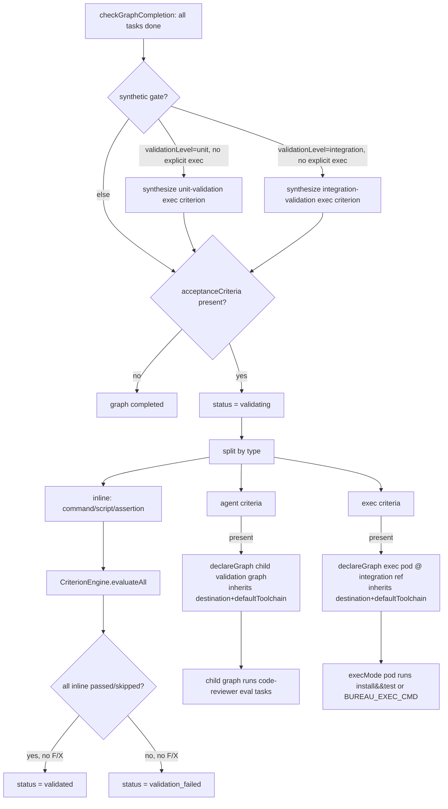
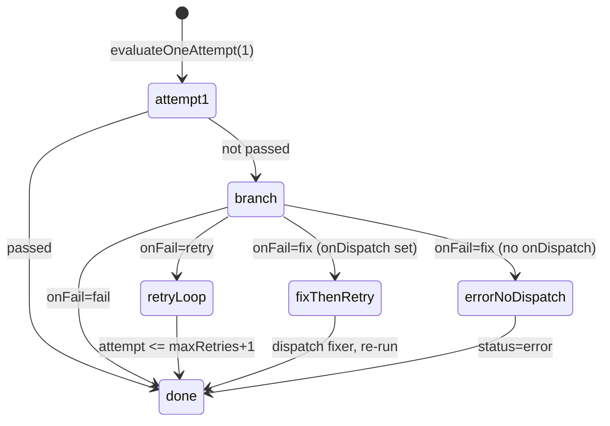

# Criterion Engine & Plugins

## Overview

This subsystem evaluates **acceptance criteria** — structured, typed quality checks attached to a task graph — and resolves whether a graph's work is `validated` or `validation_failed`. It exists to move deterministic verification off the LLM: where the old `__verify__` mechanism spawned a Haiku agent to parse a prompt and run shell commands, the `CriterionEngine` runs `command`, `script`, and `assertion` criteria as plain CPU-bound child processes, escalating to an LLM only for subjective `agent`-type criteria (`src/criterion-engine.ts:1-19`). A fifth `exec` type was added later under the language-agnostic epic for **mechanical, zero-token validation**: an `exec` criterion is dispatched as a child graph whose pod clones the graph's integration branch and runs the check command directly (no Claude session), driving the unit/integration validation gates for non-Node toolchains (`src/types/graph.ts:12`, `src/task-graph.ts:1602-1639`). The engine is a self-contained module with no Redis or telemetry dependency; the [Task Graph Engine](Task%20Graph%20Engine.md) orchestrates *when* it runs and translates its results into graph-status transitions (`src/criterion-engine.ts:21-25`, `src/task-graph.ts:1369-1647`). Under k8s/pod dispatch, where `graph.cwd` is an orchestrator-side path that does not exist inside the engine pod, `command`/`script` criteria are *skipped* rather than failed so a filesystem mismatch cannot spuriously block promote (`src/criterion-engine.ts:78-85`). A later **requirement-coverage** layer lets an `exec` criterion carry `coverageIds` (EARS SHALL ids); at dispatch the engine rewrites the check into a self-contained script that runs the suite and then a deterministic, model-free JUnit checker asserting every declared id has a passing tagged test — the mechanism that closes the acceptance-criteria loop back to the business-analyst's EARS spec (`src/types/graph.ts › CriterionDef`, `src/coverage/coverage-command.ts › composeCoverageCommand`).

## Responsibilities

- Define the five criterion types and evaluate each in its own handler: `command` (bash), `script` (named plugin), `assertion` (in-process expression), `agent` (delegated callback), and `exec` (routed through `onDispatch` identically to `agent` for direct `CriterionEngine` callers; in the graph-completion path it bypasses the engine and is dispatched as a child validation pod instead) (`src/criterion-engine.ts:220-228`, `src/types/graph.ts:12`).
- Run criteria **sequentially** via `evaluateAll`, applying per-criterion `onFail` handling — `fail` (collect as-is), `retry` (re-run up to `maxRetries + 1` attempts), or `fix` (dispatch a fixer via `onDispatch`, then re-run) (`src/criterion-engine.ts:132-176`).
- Build a **sanitized child-process environment** containing only a short allow-list of inherited process vars plus `BUREAU_*` context and declared criterion inputs (`src/criterion-engine.ts:243-260`).
- Resolve and list **plugins** from `plugins/criteria/<name>/plugin.json`, validating required inputs and applying manifest defaults before execution (`src/criterion-engine.ts:184-188`, `src/criterion-engine.ts:304-316`).
- Expose two MCP tools — `list_criteria_plugins` (discovery) and `save_criteria_plugin` (promote an inline check to a reusable, git-committed plugin) (`src/tools/list-criteria-plugins.ts:6-32`, `src/tools/save-criteria-plugin.ts:11-65`).

## Key flows

### Graph-completion validation (inline vs. dispatched split)

When all of a graph's tasks finish, the [Task Graph Engine](Task%20Graph%20Engine.md) splits acceptance criteria by type: `command`/`script`/`assertion` run **inline** via `CriterionEngine.evaluateAll`, `agent` criteria are dispatched as a **child validation graph** that needs a real Claude session, and `exec` criteria are dispatched as **child validation pods** pinned to the integration branch (zero-token, no Claude). Both dispatched branches `return` early, so a graph mixing `agent` and `exec` criteria silently drops the `exec` block — the two are not combined in current usage (`src/task-graph.ts:1481-1639`, `src/task-graph.ts:1573-1575`). This flow is from `src/task-graph.ts:1369-1647`.

**Synthetic validation gate (Phase 4):** Before the criteria split, `checkGraphCompletion` synthesizes an exec criterion when the graph carries a `validationLevel` and no explicit exec criterion is already declared. For `validationLevel === 'unit'` with `validationTestCmd` set, it generates a `unit-validation` exec criterion whose `check` prepends `validationInstallCmd` (if any) to `validationTestCmd` joined by ` && ` — so a fresh-clone Python validation pod can run `pip install -e . && pytest` without a pre-baked env. For `validationLevel === 'integration'` with `validationIntegrationTestCmd` set, a matching `integration-validation` exec criterion is synthesized. Both synthetic criteria inherit the graph's `validationToolchain` (falling back to `defaultToolchain`) so a Python graph boots the `python` image rather than `node`. The synthetic criterion is added to a local copy of the graph only (not persisted to Redis); the existing exec dispatch path handles it identically to a declared criterion (`src/task-graph.ts:1422-1474`).

**Destination inheritance fix (Phase 4):** Both the agent-criteria child graph and each exec-criteria child graph now inherit the parent's `destination` and `defaultToolchain` when calling `declareGraph`. Before this fix, the validation child graph was declared with only `{ parentGraphId }`, causing it to fall back to the default git destination (the-bureau) and fail to clone the integration branch — which only exists on the parent's destination repo. Inheriting `destination` + `defaultToolchain` fixes multi-repo validation (`src/task-graph.ts:1592`, `src/task-graph.ts:1631`).

Inline criteria emit a `task_completed` or `task_failed` event per criterion, with a synthetic task id `criterion-<name>` carrying the evidence/diagnostic as detail; alongside each generic event the path also emits a dedicated `criterion_passed`/`criterion_failed`/`criterion_skipped` lifecycle event and calls `onCriterionEvaluated` (OTel metrics), each wrapped in try/catch so telemetry cannot throw into the eval loop (`src/task-graph.ts:1526-1568`, `test: tests/production-features.test.ts > "emits criterion_passed event for a passing inline criterion alongside task_completed"`, `test: tests/production-features.test.ts > "calls onCriterionEvaluated with correct fields for a passing command criterion"`). A `skipped` result (see Configuration / Failure modes) is treated as passing for promote purposes — `inlineAllPassed` accepts `status === "passed" || status === "skipped"`, the generic event maps to `task_completed` (not `task_failed`), and the lifecycle event is `criterion_skipped` (`src/task-graph.ts:1521-1554`). When agent-type criteria exist, a child graph is declared with `parentGraphId` set (and the parent's `destination`/`defaultToolchain` inherited) and one evaluation task per criterion, defaulting to role `DEFAULT_AGENT_CRITERION_ROLE = "code-reviewer"` (or the criterion's `fixRole`); if inline criteria already failed, the parent is marked `validation_failed` immediately (`src/task-graph.ts:1576-1600`, `test: tests/production-features.test.ts > "spawns validation child graph for agent-type criteria only"`). Exec-type criteria are dispatched separately, one child graph per criterion, each with `gitBaseRef` pinned to `bureau/<8-char graphId>/integration` and `execMode: true` so the pod clones the merged candidate and runs the check command token-free rather than failing on the pre-merge base; the criterion's `inputs.toolchain` is forwarded to select the worker image (`src/task-graph.ts:1606-1639`, `test: src/__tests__/exec-criterion.test.ts > "exec criterion gitBaseRef is set to bureau/<8-char-graphId>/integration"`, `test: src/__tests__/exec-criterion.test.ts > "exec criterion toolchain is forwarded from criterion inputs"`). The `validating`/`validated`/`validation_failed` graph statuses and child-graph completion handling are owned by the [Task Graph Engine](Task%20Graph%20Engine.md) and [State Machine & Rework](State%20Machine%20%26%20Rework.md).

### Per-criterion evaluation and onFail lifecycle

`evaluateAll` runs each criterion once, then applies its `onFail` policy if it did not pass. This sequence is from `src/criterion-engine.ts:132-176`.

`retry` re-runs the criterion while `attempt <= maxRetries + 1` (default `maxRetries` is 1, giving one extra attempt) (`src/criterion-engine.ts:144-147`). `fix` requires an `onDispatch` callback: it builds a fix prompt from the failed criterion's check/evidence/diagnostic, fires the optional `onFixStarted` observer (try/catch-isolated), dispatches the `fixRole` (default `DEFAULT_FIX_ROLE = "debugger"`), then re-runs the criterion; without `onDispatch` it returns an `error` result explaining the misconfiguration (`src/criterion-engine.ts:148-168`, `src/criterion-engine.ts:36`, `src/criterion-engine.ts:475-480`). The inline graph-completion path now supplies a real `onDispatch` that declares a fix-agent child graph, so an inline `onFail:"fix"` failure does enter the fix branch and fire `onFixStarted` (see Dependencies) (`src/task-graph.ts:1498-1506`). The `verifier` fallback that previously stood in here was removed when the `verifier` agent role was deleted.

Before executing a child process, both `runCommand` and `runScript` consult `canRunProcessCriteria()`: when the `skipCommandsIfCwdInaccessible` option is set and the engine cannot `access(opts.cwd)`, they short-circuit and return `status:'skipped'` with a diagnostic naming the inaccessible `cwd` and the k8s/pod-dispatch context, never spawning a process (`src/criterion-engine.ts:262-269`, `src/criterion-engine.ts:287-293`, `test: src/__tests__/criterion-pod-dispatch.test.ts > "returns skipped when cwd is inaccessible and skipCommandsIfCwdInaccessible=true"`). The accessibility probe runs at most once per engine instance — its boolean result is cached in `cwdAccessible` and reused across every criterion (`src/criterion-engine.ts:116-126`, `test: src/__tests__/criterion-pod-dispatch.test.ts > "only probes the filesystem once per engine instance"`). The gate is opt-in: with the option unset (the default) or `false`, an inaccessible `cwd` is NOT skipped — the command runs and fails on the real filesystem error, preserving local/host behaviour unchanged (`src/criterion-engine.ts:117`, `test: src/__tests__/criterion-pod-dispatch.test.ts > "returns failed (not skipped) when skipCommandsIfCwdInaccessible is not set (default)"`). Only `command` and `script` criteria are gated; `assertion`, `agent`, and `exec` criteria never go through `canRunProcessCriteria` and are never skipped (`src/criterion-engine.ts:220-228`, `test: src/__tests__/criterion-pod-dispatch.test.ts > "is NOT skipped regardless of skipCommandsIfCwdInaccessible — assertions run inline"`).

## Public interface

### `class CriterionEngine` (`src/criterion-engine.ts:101`)

- `constructor(opts: CriterionEngineOptions)` — `pluginsDir` defaults to `<cwd>/plugins/criteria`; per-criterion timeout defaults to 30000 ms (`src/criterion-engine.ts:107-110`, `src/criterion-engine.ts:29`).
- `evaluateAll(criteria): Promise<CriterionResult[]>` — sequential evaluation with `onFail` retry/fix logic (`src/criterion-engine.ts:132-176`).
- `evaluateOne(criterion): Promise<CriterionResult>` — single attempt, no retry/fix (`src/criterion-engine.ts:179-181`).
- `resolvePlugin(name): Promise<PluginManifest>` — reads and JSON-parses `plugins/criteria/<name>/plugin.json`; throws if missing/malformed (`src/criterion-engine.ts:184-188`).
- `listPlugins(): Promise<PluginManifest[]>` — scans the plugins dir, skipping entries without a valid `plugin.json`; returns `[]` if the dir does not exist (`src/criterion-engine.ts:191-211`).

The `evaluateOneAttempt` switch dispatches by type; `exec` shares `agent`'s handler (`runAgent`), so a direct `CriterionEngine` caller that supplies `onDispatch` evaluates an `exec` criterion by dispatching its `check` to a role (the criterion's `fixRole`, else `DEFAULT_FIX_ROLE`) and mapping the returned `{ passed }` to `passed`/`failed`; with no `onDispatch` it returns `error` "Agent criterion requires onDispatch" (`src/criterion-engine.ts:220-228`, `src/criterion-engine.ts:422-433`, `test: src/__tests__/exec-criterion.test.ts > "exec type with onDispatch configured returns passed when dispatch returns passed"`, `test: src/__tests__/exec-criterion.test.ts > "exec type without onDispatch returns error with helpful diagnostic"`).

### Assertion sub-types (`runAssertion`, `src/criterion-engine.ts:335-418`)

The assertion `check` is parsed as `type:arg`. Supported types: `file_exists`, `file_not_empty`, `regex:<pattern>:<path>`, `json_valid`, and `exit_zero:<command>` (runs the command via bash and passes on exit 0) (`src/criterion-engine.ts:346-413`). Unknown assertion types and missing colons return an `error` result (`src/criterion-engine.ts:338-339`, `src/criterion-engine.ts:415`).

### MCP tools

- `list_criteria_plugins()` — no inputs; renders name, version, description, tags, and inputs for every plugin, then always appends a machine-readable `{ plugins: [...] }` JSON envelope after a `---` separator (empty list, not prose, when none exist) matching the sibling list tools' text+JSON convention (`src/tools/list-criteria-plugins.ts › buildListCriteriaPluginsHandler`). The core handler is factored out of MCP registration (`buildListCriteriaPluginsHandler`) and the raw enumeration into `buildListCriteriaPlugins(pluginsDir)`, which `bureau_discover` also reuses (`src/tools/list-criteria-plugins.ts › buildListCriteriaPlugins`). The plugins dir is resolved by `defaultCriteriaDir(__dirname)` = `$CRITERIA_DIR` if set, else `<__dirname>/../plugins/criteria` — the env override lets the flattened `/app` image locate the criteria dir (`src/criterion-engine.ts › defaultCriteriaDir`, `src/mcp-server.ts:178`).
- `save_criteria_plugin(name, description, tags, script, entrypoint="check.sh", inputs?)` — creates `plugins/criteria/<name>/`, writes `plugin.json` and the entrypoint (chmod 0755), then attempts `git add`/`git commit` (failure tolerated if not a git repo) (`src/tools/save-criteria-plugin.ts:33-64`, `src/mcp-server.ts:735`).

### Coverage module (`src/coverage/`)

- `composeCoverageCommand(check, coverageIds, toolchain): string` — pure builder of the self-contained `BUREAU_EXEC_CMD` for a coverage-gated exec criterion (`src/coverage/coverage-command.ts › composeCoverageCommand`).
- `selectChecker(toolchain): CheckerVariant` — returns the `{ filename, interpreter, source }` variant for `python`/`node`/`dotnet`; throws for any other toolchain (`src/coverage/checkers.ts › selectChecker`).
- `makeValidationPodLogReader(api, namespace): (childGraphId) => Promise<string | undefined>` — builds the best-effort k8s pod-log reader wired into `TaskGraphCallbacks.readValidationPodLog`; resolves the failed validation child's single pod by label, reads the `agent` container's last 50 lines, and never throws (`src/coverage/pod-log-reader.ts › makeValidationPodLogReader`).

### Types

`CriterionDef` (`name`, `type`, `check`, `inputs?`, `onFail`, `fixRole?`, `maxRetries?`, `coverageIds?`) and `CriterionResult` (`name`, `type`, `status`, `evidence`, `diagnostic?`, `durationMs`, `exitCode?`, `attempt`) are defined in `src/types/graph.ts › CriterionDef` / `src/types/graph.ts › CriterionResult` and re-exported through `src/types.ts`. `CriterionDef.type` is a **five-member** union — `'command' | 'script' | 'assertion' | 'agent' | 'exec'` — the `'exec'` member added by alongside matching additions to the Zod input enum and the telemetry `CriterionEvaluatedEvent.criterionType` union (`src/types/graph.ts › CriterionDef`, `src/telemetry/domain/criterion.ts:17`). `CriterionDef.coverageIds?: string[]` was added by — the EARS SHALL ids gating an `exec` criterion (see Requirement coverage); its JSDoc records the "valid only on an exec criterion, at most one per graph" contract that `validateGraphInput` enforces (`src/types/graph.ts › CriterionDef`). `CriterionResult.status` is `'passed' | 'failed' | 'skipped' | 'error'` — the `'skipped'` member predates but was previously unreachable for `command`/`script`; made it a live status for those types under the cwd-skip gate without changing the union itself (`src/types/graph.ts:23`). The `TaskEvent` event union carries a `criterion_skipped` member alongside `criterion_passed`/`criterion_failed`/`criterion_fix_started` (`src/types/event.ts:10`).

`acceptanceCriteria?: CriterionDef[]` is the only criterion-array field on `TaskGraph` and on `TaskNodeInput` (`src/types/graph.ts › TaskGraph`, `src/types/graph.ts › TaskNodeInput`). A later change added a cluster of **toolchain/validation** fields used by the exec-criterion validation gates: per-task `toolchain`, `execMode`, `service`, `install`, `build`, `test`, `integrationTest`, `lint`, and `validation?: 'self' | 'unit' | 'integration'` on both `TaskNode` and `TaskNodeInput` (`src/types/graph.ts › TaskNode`, `src/types/graph.ts › TaskNodeInput`), plus graph-level aggregates `defaultToolchain`, `validationLevel`, `validationToolchain`, `validationInstallCmd`, `validationTestCmd`, `validationIntegrationTestCmd`, and `testServices` on `TaskGraph` (`src/types/graph.ts › TaskGraph`). The engine itself reads none of these except via the `exec` criterion's `inputs.toolchain`; the [Task Graph Engine](Task%20Graph%20Engine.md) aggregates per-task `validation`/commands at declare time and synthesises the exec criteria at completion. Both `TaskGraph` and `TaskNodeInput` have since accumulated **auto-rework** fields (`currentRound`, `validationDispatchHead`, `autoRework`, `attempt`, `failureReason`, `selfImprove`) that belong to [State Machine & Rework](State%20Machine%20%26%20Rework.md), not this subsystem — the engine does not read them (`src/types/graph.ts › TaskGraph`). The legacy host-mode fields the note previously described as `@deprecated` (`hosts?` on `TaskGraph`, `host?` on `TaskNode`/`TaskNodeInput`) have since been **removed entirely** — no `host`/`hosts` field exists (`src/types/graph.ts › TaskGraph`, `src/types/graph.ts › TaskNode`). The k8s-only spawn migration earlier **removed** the engine-side worktree-isolation fields — `isolateParallel`/`baseCommit` from `TaskGraph` and `isolate`/`worktreePath` from `TaskNode`/`TaskNodeInput` — because pod-per-task isolation supersedes local `git worktree`; none were criterion-related.

## Plugin format

A plugin is a directory under `plugins/criteria/` with a `plugin.json` manifest (`name`, `version`, `description`, `tags`, `entrypoint`, `inputs`) and an executable entrypoint script (`src/criterion-engine.ts:88-95`). The bundled `typecheck-workspace` plugin declares a required `WORKSPACE` input and runs `npm run typecheck --workspace=$WORKSPACE`, reading the working directory from `$BUREAU_CWD` (`plugins/criteria/typecheck-workspace/plugin.json`, `plugins/criteria/typecheck-workspace/check.sh`). Inputs are passed to the script as environment variables, never shell-interpolated (`src/criterion-engine.ts:256-258`, `src/criterion-engine.ts:271-275`).

## Requirement coverage (EARS `coverageIds`)

An `exec` criterion may carry `coverageIds` — a list of EARS SHALL ids (e.g. `["E-01","E-03"]`) whose passing, requirement-tagged tests must exist for the gate to pass. It is the mechanical enforcement of an acceptance spec: the Business Analyst agent's EARS requirements become ids, and this checker fails the validation pod if any id lacks a green tagged test (`src/types/graph.ts › CriterionDef`).

**Declare-time validation.** `validateGraphInput` (called by both `declareGraph` and the dry-run path) enforces three rules on `coverageIds`: it is valid *only* on an `exec` criterion (else throw), each id must match `^[A-Za-z0-9._-]+$` (rejects shell-injection like `E-01; rm -rf /`), and at most one exec criterion per graph may carry it (each exec criterion runs its own pod + suite) (`src/graph-validate.ts › validateGraphInput`, `test: src/__tests__/coverage-ids-validation.test.ts > "throws when coverageIds is on a non-exec criterion"`, `test: src/__tests__/coverage-ids-validation.test.ts > "throws when an id has unsafe characters"`, `test: src/__tests__/coverage-ids-validation.test.ts > "throws when more than one exec criterion carries coverageIds"`). The Zod input schema on `declare_task_graph` accepts the field so it survives to the engine (`src/tools/declare-task-graph.ts › coverageIds`, `test: src/__tests__/coverage-ids-field.test.ts > "is retained by the acceptance-criteria schema (not stripped)"`).

This diagram shows how a coverage-gated `exec` criterion becomes a self-contained pod command; the flow is from `dispatchExecValidationChildren` → `composeCoverageCommand` → `selectChecker` (`src/task-graph.ts › dispatchExecValidationChildren`, `src/coverage/coverage-command.ts › composeCoverageCommand`).

```mermaid
flowchart TD
    A[exec criterion w/ coverageIds] --> B[dispatchExecValidationChildren]
    B --> C{coverageIds present?}
    C -- no --> D[identical pre-extraction path\ntest-file existence preflight only]
    C -- yes --> E[resolve execToolchain\ninputs.toolchain → validationToolchain → defaultToolchain → node]
    E --> F[composeCoverageCommand]
    F --> G[selectChecker toolchain]
    G --> H[BUREAU_EXEC_CMD:\nheredoc checker into /tmp\nrun check; rc1\nrun checker --report --expect; rc2\nexit-max rc1,rc2]
    H --> I[declareGraph exec pod\ngitBaseRef bureau/&lt;8char&gt;/integration\nexecMode true, toolchain execToolchain]
    I --> J[pod runs suite → JUnit → checker]
    J -- uncovered --> K["checker exit 1<br>stderr &#39;uncovered: [E-03, E-07]&#39;"]
    K --> L[readValidationPodLog surfaces tail\nas graph_validation_failed detail]
```

**Command composition.** `composeCoverageCommand(check, coverageIds, toolchain)` is pure: it emits a single `BUREAU_EXEC_CMD` string carrying everything the pod needs (no file/env side-channel). It exports `BUREAU_JUNIT_PATH=bureau-junit.xml` and `BUREAU_EARS_IDS`, heredocs the selected checker into `/tmp/<filename>`, then runs `<check>; rc1=$?` followed by `<interpreter> <checker> --report ... --expect ...; rc2=$?` and `exit $(( rc1 != 0 ? rc1 : rc2 ))` — the checker runs **unconditionally** (exit-max composition, not `&&`) so a suite that fails still reports which ids were uncovered (`src/coverage/coverage-command.ts › composeCoverageCommand`, `test: src/__tests__/coverage-command.test.ts > "runs the checker unconditionally with exit-max composition (not &&)"`, `test: src/__tests__/coverage-command.test.ts > "heredocs the checker into /tmp and invokes it with the interpreter"`). The suite is expected to write JUnit XML to `bureau-junit.xml`.

**Per-toolchain checkers.** The checker bodies ship as inlined string constants (they bundle into the engine — no runtime file read) keyed by toolchain: `python` → `ears-cover.py` (run under `python3`), and `node`/`dotnet` → `ears-cover.cjs` (a dependency-free CommonJS variant run under `node`, present in every worker image; JUnit XML is language-agnostic so one node scanner serves both) (`src/coverage/checkers.ts › selectChecker`). `selectChecker` throws a helpful error for an unknown toolchain, listing the supported set (`src/coverage/checkers.ts › selectChecker`, `test: src/__tests__/coverage-command.test.ts > "throws for a toolchain with no checker variant"`).

**Checker semantics (both variants, behaviorally identical).** An id is *covered* iff ≥1 `<testcase>` is present whose `name + classname` matches the id AND every matched testcase passes (no `<failure>`/`<error>`/`<skipped>`); a missing or all-non-passing id is uncovered. Matching is boundary-anchored — left boundary is any non-alphanumeric or start (so a dotted classname separator like `suite.E-05` counts), right boundary is `]`/`-`/end, which prevents substring collision (`E-1` never matches `[E-10]`). A missing/unparseable report exits `2` (fail-closed, not "zero testcases → uncovered"); uncovered ids exit `1` with `uncovered: [...]` on stderr; all covered exits `0` (`src/coverage/checkers.ts › PYTHON_CHECKER`, `src/coverage/checkers.ts › NODE_CHECKER`, `test: src/__tests__/ears-cover-checker.test.ts > "does NOT let E-1 be satisfied by [E-10] (collision guard)"`, `test: src/__tests__/ears-cover-checker.test.ts > "treats a skipped tagged test as uncovered"`, `test: src/__tests__/ears-cover-checker.test.ts > "exits non-zero on an unparseable report"`).

**Failure surfacing.** When a validation child pod fails, `checkGraphCompletion` reads the failed child's pod-log tail via the injected `readValidationPodLog` callback and attaches it as the `graph_validation_failed` detail (and seeds the recorded `ValidationFailure`), so an operator sees the checker's `uncovered: [E-03, E-07]` line rather than a bare "validation failed". The read is best-effort and k8s-only — the reader is `makeValidationPodLogReader`, which resolves the child's single pod by label and reads the `agent` container's last 50 lines, wired at the composition root in `mcp-server.ts`; it never throws into completion (`src/task-graph.ts:1756-1769`, `src/coverage/pod-log-reader.ts › makeValidationPodLogReader`, `src/mcp-server.ts:1015-1027`, `test: src/__tests__/coverage-surfacing.test.ts > "attaches the pod-log tail as the failure detail"`, `test: src/__tests__/coverage-surfacing.test.ts > "swallows a throwing reader (event still emitted, no detail, no throw)"`, `test: src/__tests__/coverage-reader.test.ts > "returns undefined (not throw) when the api errors"`). The `readValidationPodLog?` callback is declared on `TaskGraphCallbacks` and absent locally (`src/types/graph.ts › TaskGraphCallbacks`).

## Dependencies

- **No Redis, no telemetry import.** The engine uses only `node:child_process`, `node:util`, `node:fs/promises`, and `node:path` (`src/criterion-engine.ts:21-25`).
- **[Task Graph Engine](Task%20Graph%20Engine.md)** — sole inline caller; dynamically imports `CriterionEngine` and invokes `evaluateAll` inside `checkGraphCompletion`, then maps results to graph status (`src/task-graph.ts:1369-1647`).
- **[State Machine & Rework](State%20Machine%20%26%20Rework.md)** — owns the `validating → validated|validation_failed` graph transitions this subsystem drives, and the child-validation-graph lifecycle.
- **`onDispatch` callback** — supplied by the caller for `agent`/`exec`/`fix` flows. The inline graph-completion path **now wires a real `onDispatch`** (it was dormant before): the callback declares a one-task fix-agent child graph via `declareGraph` and returns `passed: true` with evidence `Fix agent dispatched: <role>`, so an inline `onFail:"fix"` criterion that fails enters the fix branch instead of returning `error` (`src/task-graph.ts:1498-1506`, `test: src/__tests__/exec-criterion.test.ts > "onDispatch is wired: CriterionEngine receives onDispatch that calls declareGraph"`).
- **`onFixStarted` callback** — supplied by the inline path; fires telemetry/event emission immediately before a fix dispatch. Now that `onDispatch` is wired, a failing inline `onFail:"fix"` criterion does enter the fix branch, so `onFixStarted` fires, `criterion_fix_started` is emitted, and `onCriterionFixStarted` (`bureau.criterion.fixes`) is incremented (`src/task-graph.ts:1507-1518`, `src/criterion-engine.ts:148-168`, `test: tests/production-features.test.ts > "task-graph inline path: onFail:'fix' with onDispatch wired emits criterion_fix_started and spawns a fix child graph"`).

## Configuration

| Option / var | Type | Default | Effect |
|---|---|---|---|
| `cwd` | string | (required) | Working dir for child processes; base for assertion path resolution and default `pluginsDir` (`src/criterion-engine.ts:108`) |
| `pluginsDir` | string | `<cwd>/plugins/criteria` | Directory scanned for plugin manifests (`src/criterion-engine.ts:108`) |
| `timeoutMs` | number | 30000 | Per-criterion child-process timeout; on kill, result is `error` "Timeout after Nms" (`src/criterion-engine.ts:76-77`, `src/criterion-engine.ts:29`, `src/criterion-engine.ts:109`, `src/criterion-engine.ts:277`) |
| `skipCommandsIfCwdInaccessible` | boolean | `false` (option absent) | When true and `opts.cwd` is not accessible, `command`/`script` criteria return `status:'skipped'` instead of executing; a skipped criterion does NOT block promote. Intended for k8s/pod dispatch where `graph.cwd` is an orchestrator-side path absent in the engine pod. The [Task Graph Engine](Task%20Graph%20Engine.md) now sets it to `true` **unconditionally** on the inline engine — workers always run in-cluster (k8s), so the earlier `selectStrategyName(process.env) === "k8s"` gate was removed in the k8s-only migration (`src/criterion-engine.ts:78-85`, `src/task-graph.ts:1494-1497`) |
| `criterion.onFail` | enum | (per def) | `fail`/`retry`/`fix` post-failure policy (`src/criterion-engine.ts:138-168`) |
| `criterion.maxRetries` | number | 1 | Extra attempts under `retry`/`fix` (`attempt <= maxRetries + 1`) (`src/criterion-engine.ts:140`, `src/criterion-engine.ts:144`) |
| Inherited env | — | PATH, HOME, USER, SHELL, LANG, NODE_PATH, TERM | Only these parent vars leak into child processes (`src/criterion-engine.ts:246`) |
| Injected env | — | `BUREAU_GRAPH_ID`, `BUREAU_CWD`, `BUREAU_TASK_ID?`, `BUREAU_TASK_OUTPUT?` | Bureau context for criterion scripts (`src/criterion-engine.ts:251-255`) |

## Failure modes

- **Plugin not found / malformed** → `script` criterion returns an `error` result naming the plugin and the underlying error; `resolvePlugin` throws and is caught (`src/criterion-engine.ts:294-296`).
- **Missing required plugin input** → `error` result "Required input '{key}' not provided" before the entrypoint runs (`src/criterion-engine.ts:300-303`).
- **Command/script timeout** → child is killed; result `error` "Timeout after Nms" (`src/criterion-engine.ts:277`, `src/criterion-engine.ts:325`).
- **`cwd` inaccessible under k8s/pod dispatch** → with `skipCommandsIfCwdInaccessible` set, `command`/`script` criteria return `status:'skipped'` (diagnostic: "cwd '{path}' is not accessible on this host (k8s/pod dispatch …)") rather than failing; the inline path counts skipped as passing so a missing engine-pod `cwd` cannot spuriously emit `criterion_failed` → `graph_validation_failed` and block promote-to-base. This replaced the prior behaviour where such criteria failed in ~13ms on the filesystem error (observed: graph `aa546c74`) (`src/criterion-engine.ts:262-269`, `src/criterion-engine.ts:287-293`, `src/task-graph.ts:1521-1524`).
- **Non-zero exit** → `failed` result carrying stdout/stderr and the numeric exit code (`src/criterion-engine.ts:279`, `src/criterion-engine.ts:327`).
- **`fix` without `onDispatch`** → `error` "onFail:\"fix\" requested but onDispatch is not configured" (`src/criterion-engine.ts:161-167`).
- **`agent` criterion without `onDispatch`** → `error` "Agent criterion requires onDispatch" (`src/criterion-engine.ts:423-428`).
- **Malformed assertion** → `error` for missing `type:arg` colon, missing `regex:pattern:path` colon, or unknown assertion type (`src/criterion-engine.ts:338-339`, `src/criterion-engine.ts:373`, `src/criterion-engine.ts:415`).
- **`fix` without `onDispatch` (engine level)** → when `CriterionEngine` is instantiated without `onDispatch`, a `onFail:"fix"` failure returns `status:'error'` ("onDispatch is not configured") and `onFixStarted`/`criterion_fix_started`/`bureau.criterion.fixes` are NOT fired — the fix branch is never entered without a dispatcher (`src/criterion-engine.ts:148-168`, `test: src/__tests__/exec-criterion.test.ts > "exec type without onDispatch returns error with helpful diagnostic"`). Note: the task-graph inline evaluation path **now wires a real `onDispatch`** since, so this failure mode does not occur on the standard inline path — fix dispatch is live there.

## Related

- [Task Graph Engine](Task%20Graph%20Engine.md)
- [State Machine & Rework](State%20Machine%20%26%20Rework.md)
- [Telemetry](Telemetry.md)
- Business Analyst
