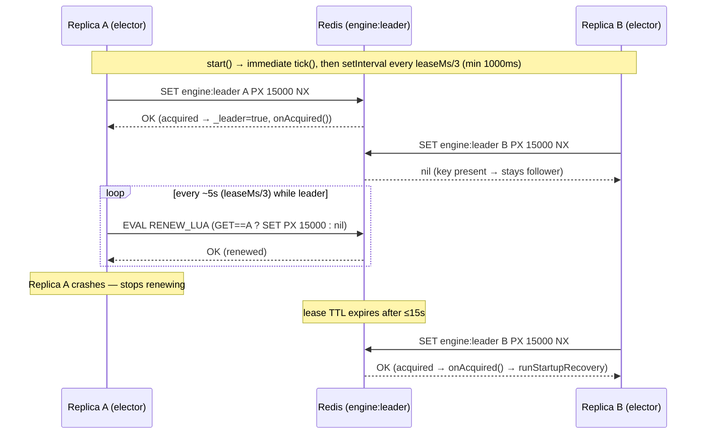
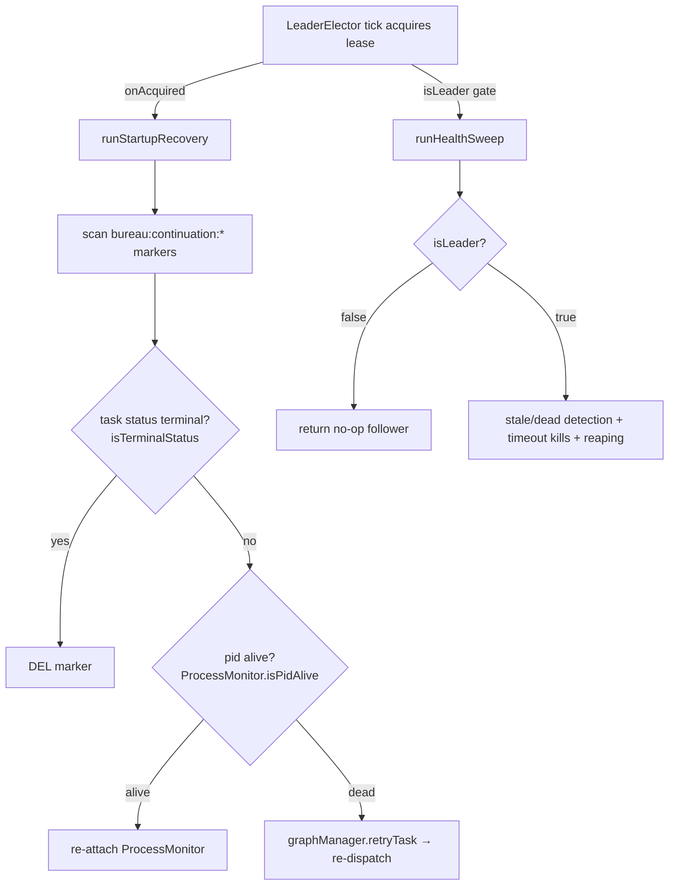
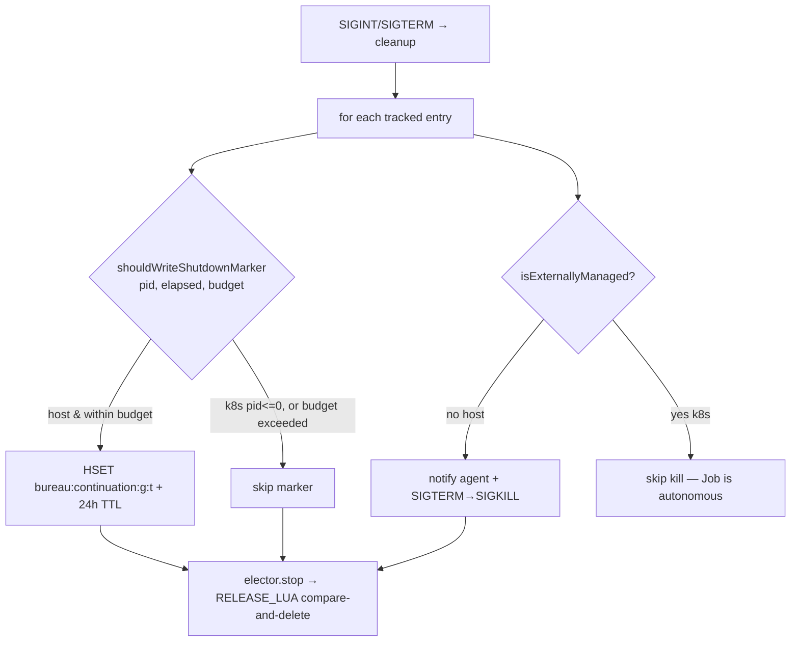

# Engine Lifecycle & Leader Election

## Overview

This subsystem is the single-writer guarantee for running the engine in HA (multiple replicas). A Redis-lease `LeaderElector` elects exactly one replica as leader, and only that leader performs singleton background work — startup recovery and health-sweep reaping — so two engines never double-dispatch or double-reap the same task (`src/engine/leader.ts › LeaderElector`, `src/health-sweep.ts › runHealthSweep`). Alongside it, `src/engine/lifecycle.ts` holds three tiny pure decision helpers that drive k8s-safe graceful shutdown and startup-recovery pruning, factored out of `mcp-server.ts` so they are unit-testable without booting the server (`src/engine/lifecycle.ts › isExternallyManaged`).

The two files total ~103 LOC; the substance is the lease protocol and where the elector/helpers are wired into the server boot and shutdown paths (which live in [MCP Server Core & Tool Surface](MCP%20Server%20Core%20%26%20Tool%20Surface.md)).

## Responsibilities

- Elect one leader among engine replicas via a Redis lease and expose `isLeader()` (`src/engine/leader.ts › LeaderElector`).
- Renew the lease at one-third the lease interval, using a compare-and-set so only the current owner can renew (`src/engine/leader.ts › RENEW_LUA`).
- Release the lease on graceful stop using a compare-and-delete, so a slow ex-leader cannot delete a new leader's lease (`src/engine/leader.ts › RELEASE_LUA`).
- Fail safe: any Redis error during a tick means "not leader this tick" — a replica that cannot reach Redis must never believe it holds leadership (`src/engine/leader.ts › LeaderElector`).
- Fire `onAcquired` / `onLost` callbacks on leadership transitions, which the server uses to run recovery and pause the control plane (`src/mcp-server.ts › main`).
- Decide whether a shutdown continuation marker should be written for an entry (k8s-managed vs host, within a time budget) (`src/engine/lifecycle.ts › shouldWriteShutdownMarker`).
- Classify a session as externally-managed (k8s Job, pid ≤ 0) vs a local OS process (`src/engine/lifecycle.ts › isExternallyManaged`).
- Decide whether a continuation marker's task status is terminal (marker should be pruned), delegating to the authoritative task-status predicate (`src/engine/lifecycle.ts › isTerminalStatus`).

## Key flows

### Leader election + lease renewal + failover

The elector runs a periodic tick: a follower tries `SET key id PX lease NX`; the leader renews via a Lua GET==id guard; on any lost/failed renewal it drops to follower and re-contends on the next tick. This sequence shows two replicas, a leader dying, and the follower taking over.

The immediate-then-interval schedule and the `renewMs = max(1000, floor(leaseMs/3))` cadence are in `start()`; the acquire/renew branches and the fail-safe demotion are in the private `tick()` (`src/engine/leader.ts › LeaderElector`). A second elector cannot acquire while the first holds the lease, and a follower takes over after the leader releases or its lease expires (`test: tests/engine/leader.test.ts > "a second elector cannot acquire while the first holds the lease"`, `test: tests/engine/leader.test.ts > "a follower takes over after the leader releases (stop)"`).

### Leader-gated background work (recovery + reaping)

`onAcquired` runs startup recovery; the 30s health sweep no-ops on followers. Both are guarded by the same `isLeader()` so exactly one replica dispatches and reaps.

Startup recovery is invoked only from `onAcquired`, not unconditionally, and prunes markers whose task is already terminal before re-attaching alive agents or retrying dead ones (`src/mcp-server.ts › main`, `src/engine/lifecycle.ts › isTerminalStatus`). The health sweep returns immediately when a leader predicate is present and returns false (`src/health-sweep.ts › runHealthSweep`).

### k8s-safe graceful shutdown

On SIGINT/SIGTERM the server writes a continuation marker per host agent (gated by budget), skips externally-managed k8s entries, kills local agents, then releases the lease.

Externally-managed (k8s) entries never get a marker — their Jobs are autonomous and the restarted engine finalizes them via the health sweep — and host entries are skipped once the shutdown time budget is exhausted (`src/engine/lifecycle.ts › shouldWriteShutdownMarker`). The kill loop filters to `!isExternallyManaged(e.pid)` because `processMonitor.killProcess` is a no-op for pid ≤ 0 workers (`src/mcp-server.ts › main`, `src/engine/lifecycle.ts › isExternallyManaged`).

## Public interface

`src/engine/leader.ts`:

- `class LeaderElector(redis, opts: LeaderElectorOptions)` — Redis-lease leader. Options: `instanceId` (required), `key` (default `"engine:leader"`), `leaseMs` (default `15_000`), `onAcquired?`, `onLost?` (`src/engine/leader.ts › LeaderElector`).
- `isLeader(): boolean` — returns the cached in-memory `_leader` flag, not a live Redis read (`src/engine/leader.ts › LeaderElector`).
- `start(): Promise<void>` — does one immediate `tick()`, then `setInterval` at `max(1000, floor(leaseMs/3))`; the interval timer is `unref()`'d; a second `start()` no-ops because the timer already exists (`src/engine/leader.ts › LeaderElector`).
- `stop(): Promise<void>` — clears the interval and, if leader, releases the lease via `RELEASE_LUA` (`src/engine/leader.ts › LeaderElector`).

`src/engine/lifecycle.ts`:

- `isExternallyManaged(pid: number): boolean` — `pid <= 0`; a k8s Job worker registers pid = 0 (`src/engine/lifecycle.ts › isExternallyManaged`).
- `shouldWriteShutdownMarker(pid, elapsedMs, budgetMs): boolean` — false for externally-managed; otherwise `elapsedMs < budgetMs` (`src/engine/lifecycle.ts › shouldWriteShutdownMarker`).
- `isTerminalStatus(status: string | undefined): boolean` — `status !== undefined && isTerminal(status)`; delegates to `state-machine.ts` (`src/engine/lifecycle.ts › isTerminalStatus`).

## Dependencies

- **Redis** — the lease is a single string key (`engine:leader` by default) manipulated with `SET … PX NX` and two Lua scripts via `redis.eval` (`src/engine/leader.ts › LeaderElector`). See [Redis & Connection Layer](Redis%20%26%20Connection%20Layer.md).
- **`logger`** — warns on release/tick failures but never throws out of a tick (`src/engine/leader.ts › LeaderElector`).
- **`state-machine.ts › isTerminal`** — `isTerminalStatus` delegates to it so terminal-set membership stays authoritative in one place (`src/engine/lifecycle.ts › isTerminalStatus`). See [State Machine & Rework](State%20Machine%20%26%20Rework.md).
- **Consumers in `mcp-server.ts › main`** — construct the elector, run recovery in `onAcquired`, gate `startHealthSweep` on `isLeader()`, and call `elector.stop()` during shutdown (`src/mcp-server.ts › main`). See [MCP Server Core & Tool Surface](MCP%20Server%20Core%20%26%20Tool%20Surface.md) and [Health & Process Monitoring](Health%20%26%20Process%20Monitoring.md).

## Configuration

| Env var | Type | Default | Effect | Citation |
|---|---|---|---|---|
| `BUREAU_LEADER_LEASE_MS` | int ms | `15000` (invalid/≤0 → 15000) | Lease TTL; renewal runs at `max(1000, floor(lease/3))` | `src/mcp-server.ts › main`, `src/engine/leader.ts › LeaderElector` |
| `BUREAU_SHUTDOWN_BUDGET_MS` | int ms | `8000` (invalid/≤0 → 8000) | Wall-clock budget for writing continuation markers during shutdown | `src/mcp-server.ts › main`, `src/engine/lifecycle.ts › shouldWriteShutdownMarker` |

Elector `instanceId` is `${hostname()}:${process.pid}:${Date.now()}`, and `key` defaults to `engine:leader` (`src/mcp-server.ts › main`, `src/engine/leader.ts › LeaderElector`).

## Failure modes

- **Redis unreachable during a tick** — the tick's catch demotes a current leader to follower and fires `onLost`; a follower simply stays a follower. No replica retains leadership without a live lease (`src/engine/leader.ts › LeaderElector`, `test: tests/engine/leader.test.ts > "fires onLost once when the lease is lost"`).
- **Lease stolen/expired externally** — the next renewal `EVAL RENEW_LUA` returns nil (GET no longer equals this id), so `_leader` flips to false and `onLost` fires once (`src/engine/leader.ts › RENEW_LUA`, `test: tests/engine/leader.test.ts > "fires onLost once when the lease is lost"`).
- **Slow ex-leader releasing a reassigned lease** — `RELEASE_LUA` is a GET==id compare-and-delete, so an ex-leader whose lease already expired and was re-acquired by another replica deletes nothing (`src/engine/leader.ts › RELEASE_LUA`).
- **Overlapping ticks / double start** — a `_ticking` re-entrancy guard drops a tick that starts while another is in flight, and the `timer` guard makes `start()` idempotent (`src/engine/leader.ts › LeaderElector`).
- **Shutdown budget exhausted** — host agents past the budget get no continuation marker and are logged as "shutdown budget exceeded"; they are recovered from their task record on restart instead (`src/engine/lifecycle.ts › shouldWriteShutdownMarker`, `src/mcp-server.ts › main`).
- **k8s worker at shutdown** — externally-managed entries are skipped for both marker-writing and killing; their autonomous Job is finalized by the next leader's health sweep (`src/engine/lifecycle.ts › isExternallyManaged`, `src/mcp-server.ts › main`).

## Not this subsystem — naming caveat

Despite the filename, `src/engine/lifecycle.ts` is **unrelated** to the telemetry `LifecycleAnomalyDetector` (`lifecycle.missing_handoff` / `lifecycle.missing_status`). That detector lives in `src/telemetry/domain/anomaly.ts` and is documented in [Telemetry](Telemetry.md); `src/__tests__/lifecycle-anomaly.test.ts` constructs it directly and does **not** import `src/engine/lifecycle.ts` (`test: tests/engine/lifecycle.test.ts`, which is the actual unit test for this file). That detector is initialized by the telemetry bootstrap in `main()`, which dynamically imports and calls `initLifecycleAnomalyDetector(m)` when a meter is present, in its own guarded try/catch alongside the sibling init steps (`src/mcp-server.ts › main`). The initialization lives in the telemetry bootstrap of `mcp-server.ts`, **not** in `src/engine/lifecycle.ts`.

## Related

- [MCP Server Core & Tool Surface](MCP%20Server%20Core%20%26%20Tool%20Surface.md) — constructs the elector, runs recovery in `onAcquired`, drives graceful shutdown.
- [Health & Process Monitoring](Health%20%26%20Process%20Monitoring.md) — the leader-gated health sweep that does the reaping.
- [Telemetry](Telemetry.md) — the unrelated `LifecycleAnomalyDetector` (naming caveat above).
- [System Map](../Architecture/System%20Map.md) — cross-subsystem map referencing this control-plane seam.
- [Redis & Connection Layer](Redis%20%26%20Connection%20Layer.md) — the lease key store.
- [State Machine & Rework](State%20Machine%20%26%20Rework.md) — `isTerminal` that `isTerminalStatus` delegates to.
