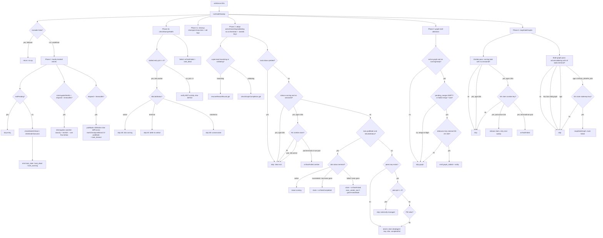
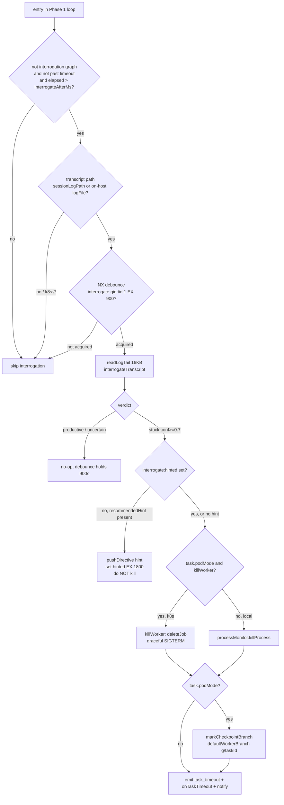
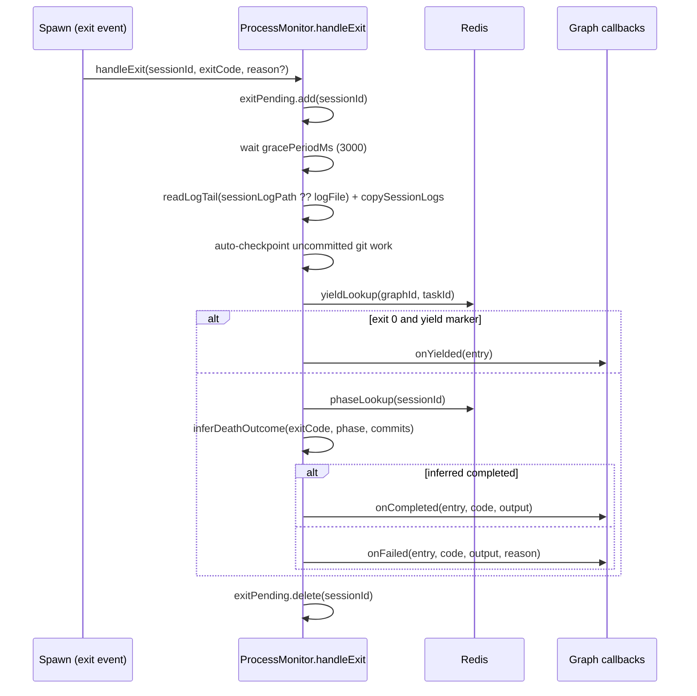

# Health & Process Monitoring

## Overview

This subsystem detects when spawned agent processes are alive, stale, dead, or timed out, and reconciles those observations with task-graph state. Its centre is a 30-second sweep (`runHealthSweep`) that inspects locally tracked child processes, runs a startup health gate for silent agents, cleans up stale artifacts, scans Redis for dead agents owned by other sessions, finalizes orphaned k8s Job workers from their Job status, detects graphs that are active but can make no forward progress (nothing running/ready and no pending merge, or a failed merge) (src/health-sweep.ts › runHealthSweep), detects zombie running tasks whose `sessionId` was never stamped after a failed dispatch and reaps them after a 30-second grace window (src/health-sweep.ts › runHealthSweep), and finalizes graphs stuck non-terminal with all tasks already terminal — preventing an otherwise-immortal graph from inflating `activeGraphs` forever (src/health-sweep.ts › reapStaleGraphs). It also carries the restart-durable rework-loop seam: each cycle it re-adopts orphaned `reworking` and `validating` graphs (not just `active`) from their `graph:*:taskIds` sets and re-drives them — calling `resumeReworkRound` on a mid-round `reworking` graph and `checkGraphCompletion` on a stranded `validating` graph — so a graph orphaned at an idle inter-step point after an engine restart is advanced rather than stranded or wrongly reaped, with the rework-round mechanics themselves owned by [State Machine & Rework](State%20Machine%20%26%20Rework.md) and [Task Graph Engine](Task%20Graph%20Engine.md) (src/health-sweep.ts › runHealthSweep). Each sweep cycle also renews test-service leases for its supervised active graphs so a live worker's Redis or Postgres is never reaped under it (src/health-sweep.ts › runHealthSweep). Between an agent's `interrogateAfterMs` threshold and its hard `timeoutMs`, the sweep also runs an inline **interrogation watcher** that reads the agent's own stream-json transcript tail and classifies it productive / stuck / uncertain, hinting-then-killing a confidently-stuck worker before the blunt timeout burns its remaining budget (src/health-sweep.ts › runHealthSweep, src/interrogator.ts › interrogateTranscript). For a pod-mode (k8s) worker the early kill and the hard-timeout kill both terminate the worker via the injected `killWorker` dep (which deletes the Job → graceful SIGTERM) so the worker's entrypoint commits and pushes its WIP before the pod dies — `ProcessMonitor.killProcess` is a no-op for a `pid <= 0` worker and would never actually stop the pod (src/health-sweep.ts › runHealthSweep, src/health-sweep.ts › runHealthSweep). When the engine runs HA, the sweep first checks `isLeader()` and no-ops entirely on a follower replica so only the leader runs the background control plane (src/health-sweep.ts › runHealthSweep); the leadership mechanism itself is owned by [Engine Lifecycle & Leader Election](Engine%20Lifecycle%20%26%20Leader%20Election.md). The `ProcessMonitor` class owns process lifecycle bookkeeping and exit handling (src/process-monitor.ts › ProcessMonitor); `ActivityMonitor` records per-agent tool-call activity in Redis (src/activity-monitor.ts › ActivityMonitor). It exists because a child agent's stdout alone is an unreliable liveness signal — Claude CLI in `-p` mode buffers stdout until its response completes, so the sweep cross-references MCP activity, peer registration, k8s Job status, git commits, and phase before declaring an agent dead (src/health-sweep.ts › runHealthSweep, src/health-sweep.ts › runHealthSweep). (The vestigial `heartbeat:<sessionId>` shell-heartbeat read — orphaned when the k8s-only spawn migration removed its `watcher.cjs` producer — has been removed from the startup gate, so MCP activity is now the sole startup-gate liveness source.)

## Responsibilities

- Run a periodic (default 30s) health sweep over locally tracked agent processes, emitting `task_stale`, `task_dead`, `task_warning`, and `task_timeout` graph events; and at the tail of each cycle run zombie-task detection, graph-stall detection, and stale-graph reaping (src/health-sweep.ts › runHealthSweep, src/health-sweep.ts › startHealthSweep).
- No-op the entire sweep on a follower replica when an `isLeader()` predicate is supplied and returns false, so background supervision runs only on the elected leader; when the predicate is undefined (non-HA / tests) the sweep always runs (src/health-sweep.ts › runHealthSweep, src/mcp-server.ts › main; test: tests/health-sweep.test.ts > "no-ops on a follower (isLeader returns false)", > "runs when isLeader is undefined (non-HA / default)"). The leader lease itself is owned by [Engine Lifecycle & Leader Election](Engine%20Lifecycle%20%26%20Leader%20Election.md).
- Classify a tracked agent as alive / stale / dead using PID liveness plus a phase-scaled idle threshold, treating a `pid <= 0` entry as alive (externally-managed k8s worker) (src/process-monitor.ts › ProcessMonitor.checkStaleOrDead, src/process-monitor.ts › ProcessMonitor.checkStaleOrDead).
- Gate agent startup: detect agents that produced no output, escalating alive-but-silent agents over consecutive sweeps and failing dead-and-silent agents immediately. The "produced output" check reads the worker's real transcript when one is captured — `entry.sessionLogPath` (the engine-side read-only `/sessions` PVC path for a k8s worker, where *any* bytes count as output) takes priority over the `entry.logFile`, for which only bytes beyond the spawn header (`logHeaderBytes`) count; this stopped k8s workers — whose `logFile` is a `k8s://…` placeholder that never exists on the engine FS — from being escalated to ~50 false error-level "stalled" logs per run while they wrote a 700KB transcript and worked fine (src/process-monitor.ts › ProcessMonitor.checkStartupHealth, src/health-sweep.ts › runHealthSweep).
- Exempt k8s (pod-mode) workers from the local startup-gate heuristic: a stalled entry with `pid <= 0` is never killed on the log-file/PID signals (which are meaningless for an externally-managed worker — its log lives at `k8s://…` off-host and `isPidAlive(0)` is always true). Instead the gate consults `k8sJobStatus`; an `active` Job is left running, a terminal Job is left for the k8s strategy's `onExit` poll to finalize, and when no `k8sJobStatus` accessor is wired the `pid <= 0` entry is skipped conservatively (src/health-sweep.ts › runHealthSweep; test: tests/health-sweep-k8s-startup.test.ts > "does NOT kill a k8s worker stalled in startup gate when its Job is active", > "skips kill conservatively when k8sJobStatus is not provided and pid=0").
- Infer whether a dead agent completed or failed, using exit code, new git commits since task start, and last-known phase (src/process-monitor.ts › ProcessMonitor.inferDeathOutcome).
- Handle child-process exit with a grace period, yield-marker detection, auto-checkpoint of uncommitted work, and completion/failure dispatch (src/process-monitor.ts › ProcessMonitor.handleExit).
- Detect dead agents owned by other (or crashed) MCP-server sessions by scanning Redis for running graph tasks whose peer registration expired or whose PID is gone (src/health-sweep.ts › runHealthSweep).
- Re-discover orphaned non-terminal graphs after an engine restart by enumerating `graph:*:taskIds` sets (independent of the orchestrator key, which TTLs out when the engine dies), adopting any graph still `active`, `reworking`, or `validating`, and refreshing the `graph:<gid>:orchestrator` claim only for `active` and `reworking` graphs — a `validating` graph is driven passively by its live validation child's completion callback and so gets no claim refresh (src/health-sweep.ts › runHealthSweep; test: tests/health-sweep.test.ts > "re-discovers an orphaned active graph via :taskIds when its orchestrator key has expired", > "re-discovers an orphaned reworking graph via :taskIds and refreshes its orchestrator claim").
- Re-drive stalled rework rounds and stranded validation-completion locks: for a supervised `reworking` graph the sweep calls `graphManager.resumeReworkRound(gid)` every cycle (idempotent — a no-op once the round is waiting on a live child), and for a supervised `validating` graph it calls `graphManager.checkGraphCompletion(gid)` every cycle to re-drive a completion lock stranded by a holder that crashed mid-resolve; both cover the idle inter-step points a process-watching sweep would otherwise never re-advance (src/health-sweep.ts › runHealthSweep, src/task-graph.ts › resumeReworkRound, src/task-graph.ts › checkGraphCompletion; test: tests/health-sweep.test.ts > "does NOT call resumeReworkRound or checkGraphCompletion for a plain active graph"). The rework-loop and completion-lock mechanics are owned by [State Machine & Rework](State%20Machine%20%26%20Rework.md) and [Task Graph Engine](Task%20Graph%20Engine.md).
- Finalize orphaned k8s (pod-mode) Job workers from the durable task record: for a `running` task with `task.podMode` set, query the worker Job status and complete or fail the task on a terminal Job status, independent of the volatile peer record (src/health-sweep.ts › runHealthSweep; test: tests/health-sweep.test.ts > "finalizes a succeeded k8s Job as completed", > "finalizes a failed k8s Job as failed").
- Detect graph-level stalls: for each active graph with zero `running` and zero `ready` tasks, emit a `graph_stalled` event when nothing can make forward progress — i.e. when the `pending_merges` set is **empty**, OR when a `merge-*` task is `failed` (a non-empty `pending_merges` with no failed merge is in-flight work and is NOT treated as a stall) — debounced to at most once per 5 minutes per graph (src/health-sweep.ts › runHealthSweep).
- Interrogate long-running-but-not-yet-timed-out agents: once `elapsed > interrogateAfterMs` (the task field, else `0.4 × timeoutMs`) and still before `timeoutMs`, read the agent's stream-json transcript tail and classify productive / stuck / uncertain; on confident-stuck push a hint directive first and kill only on the second confident-stuck verdict; `productive` and `uncertain` are both no-ops (the haiku sidecar analysis graph that previously fired on `uncertain` was removed). The whole block is wrapped in try/catch and never throws into the sweep, and is skipped for tasks in the residual `interrogation` graph to avoid unbounded recursion (src/health-sweep.ts › runHealthSweep, src/types/graph.ts › TaskNode; test: tests/health-sweep.test.ts > "D7: pushes hint directive and does NOT kill on first confident-stuck (when recommendedHint present)", > "does NOT interrogate a task in the 'interrogation' sidecar graph (recursion guard)").
- Kill agents that exceed their task `timeoutMs`: for a local (`pid > 0`) agent via `processMonitor.killProcess` (SIGTERM, then SIGKILL after 10s), and for a pod-mode (`task.podMode`) worker via the `killWorker` dep (Job delete → graceful SIGTERM). For any pod-mode kill the sweep also records the checkpoint branch (`markCheckpointBranch(…defaultWorkerBranch(gid, tid))`) so an E1 retry resumes from the WIP the worker pushes on SIGTERM (src/health-sweep.ts › runHealthSweep, src/process-monitor.ts › ProcessMonitor.killProcess).
- Clean up `bureau/checkpoint/*` branches older than 24h and persisted session logs older than 48h (src/process-monitor.ts › ProcessMonitor.cleanupCheckpointBranches, src/health-sweep.ts › runHealthSweep).
- Serve on-demand health snapshots via the `check_health` and `bureau_health` MCP tools (src/tools/check-health.ts › registerCheckHealth, src/tools/bureau-health.ts › registerBureauHealth).

- Detect zombie running tasks: when `task.status === 'running'` but `!task.sessionId` (the dispatch set `status=running` but spawn failed before writing the sessionId), the cross-session sweep reaps the task after a 30-second grace window — consulting `k8sJobStatus` for pod-mode tasks (an `active` Job means the sessionId is still in transit; the claim is released and the task is re-checked next sweep), and immediately failing terminal-Job or non-pod zombies behind the same NX-claim pattern as regular dead-agent detection (src/health-sweep.ts › runHealthSweep; test: tests/retry-409-zombie.test.ts > "marks a non-pod zombie (running, null sessionId, old) as failed", > "does NOT touch a pod-mode zombie whose Job is still active (may be starting)"). Each reaped zombie increments the `bureau.anomaly.detected` counter via `onZombieDetected` (`anomaly.type=dispatch.zombie_task`, severity `high`) and threads `failureReason: 'dispatch.zombie_task'` into `onTaskFailed` (src/health-sweep.ts › runHealthSweep, src/telemetry/domain/health.ts › onZombieDetected).
- Finalize graphs stuck non-terminal: `reapStaleGraphs()` runs at the end of every sweep; for each `active`, `validating`, or `reworking` graph with all tasks terminal, no live child graph (an in-flight validation child — or a child graph itself mid-rework — protects its parent), and no activity for > `STALE_GRAPH_MS` (30 minutes), it claims `graph:stalereap:<gid>:claimed` (NX, EX 300) and calls `graphManager.reapStaleGraph()` to mark the graph `failed` — closing the gap where a `validating` graph whose validator child crashed (or a `reworking` graph whose loop is genuinely stuck) could remain non-terminal forever and inflate `bureau_health.activeGraphs`. For a `reworking` graph the idle horizon also folds in `currentRound.enteredAt` and its fix/re-validation child graphs' timestamps — the parent's own round-0 tasks are frozen terminal at round entry, so without this a healthy mid-round graph would look idle and be reaped out from under a live fix agent (src/health-sweep.ts › reapStaleGraphs; test: tests/reap-stale-graphs.test.ts > "reaps a validating graph with all-terminal tasks idle past the horizon", > "does NOT reap a parent graph that has a still-active child graph", > "reaps a genuinely-stuck reworking graph (all-terminal tasks, old round, idle past the horizon)", > "does NOT reap a healthy mid-round reworking graph — recent currentRound.enteredAt protects it despite stale (round-0-frozen) task timestamps").
- Renew test-service leases for supervised active graphs: when `deps.testServiceManager` is provided (`TestServiceManager` wired at `src/mcp-server.ts › main` only in k8s mode), the sweep calls `testServiceManager.extendLeasesForGraph(gid, 120)` for every supervised `active` graph each cycle, so the manager's own expiry sweep never reaps a Redis or Postgres pod while its owning worker is still running — the 120-second renewal window is intentionally larger than the 30-second sweep cadence (src/health-sweep.ts › runHealthSweep; test: src/__tests__/test-service-manager.test.ts > "extendLeasesForGraph renews every active service in the graph (#233)").

## Key flows

### Periodic health sweep

This flowchart shows the sequential phases of one `runHealthSweep` iteration over locally tracked agents, cross-session Redis state, and graph-level stall detection.

Before any phase runs, the sweep returns immediately if an `isLeader` predicate is supplied and reports false, so follower replicas perform no supervision (src/health-sweep.ts › runHealthSweep). Phase 1 iterates `processMonitor.getAll()`, skips any session whose exit handler is mid-flight (`isExitPending`), and for each tracked task fetches the peer phase, last activity, and runs `checkStaleOrDead` (src/health-sweep.ts › runHealthSweep). Dead outcomes run `inferDeathOutcome` and re-check task status and the Redis result key to avoid racing the exit handler before completing or failing the task (src/health-sweep.ts › runHealthSweep). Still within Phase 1 and before the hard `timeoutMs` kill, each entry that has run past its `interrogateAfterMs` threshold runs the interrogation watcher (detailed in the next flow), which classifies the agent from its transcript and may hint or kill it early (src/health-sweep.ts › runHealthSweep). Phase 1b runs the startup gate over `checkStartupHealth(...).stalled`: each stalled entry with `pid <= 0` is treated as a k8s worker and routed through `k8sJobStatus` instead of the local log/heartbeat heuristic — an `active` Job is left running (`continue`), a terminal or `gone` Job is left for the strategy's `onExit` poll (`continue`), a Job-status API error or a missing accessor also skips the kill conservatively, and only `pid > 0` entries fall through to the MCP-activity liveness check (src/health-sweep.ts › runHealthSweep, src/health-sweep.ts › runHealthSweep). Phase 2 builds the supervised `graphIds` set from local entries, `graph:*:orchestrator` keys this session owns, and `graph:*:taskIds` sets for any still-`active`, `reworking`, or `validating` graph whose orchestrator key has expired — the last path is what re-adopts a graph orphaned by an engine crash, since an expired orchestrator key is never returned by `scanKeys` and a restarted engine has no local `processMonitor` entry for its k8s workers (src/health-sweep.ts › runHealthSweep). It refreshes the `graph:<gid>:orchestrator` claim only while the graph is `active` or `reworking`, leaving terminal graphs' keys to TTL out; on a `reworking` graph it additionally calls `resumeReworkRound(gid)` and on a `validating` graph `checkGraphCompletion(gid)` each cycle to re-drive an orphaned round or a stranded completion lock (src/health-sweep.ts › runHealthSweep). For each running, non-yielded task: a pod-mode (`task.podMode`) task with a `k8sJobStatus` dependency is finalized from the Job status — `active` leaves it running, `succeeded` (or a non-exec `gone` after running) completes it (no `task_warning`, since the exit is confirmed not inferred), and `failed` — or a `gone` Job for an exec/criterion pod (`task.execMode`), which fails closed with `failureReason: 'exec_verdict_lost'` rather than silently promoting an unobserved verdict — fails it, each gated behind the same `deadagent:<sid>:claimed` NX claim (src/health-sweep.ts › runHealthSweep; src/spawn/k8s-strategy.ts › K8sJobStatus). Otherwise the legacy path applies: a task whose peer registration expired or whose PID is dead atomically claims a `deadagent:<sid>:claimed` key so only one sweep handles it; a peer with `pid <= 0` (an externally-managed worker with no local OS process) is skipped rather than PID-probed (src/health-sweep.ts › runHealthSweep, src/health-sweep.ts › runHealthSweep). Phase 3 reuses the same `graphIds` set: for each graph whose status is `active` and which has zero `running` and zero `ready` tasks, it checks the `graph:<gid>:pending_merges` Redis set and whether any `merge-*` task is `failed`, then emits `graph_stalled` only when nothing can make forward progress — the guard is `!hasPendingMerges || hasFailedMergeTask`, so an **empty** `pending_merges` set (genuine deadlock / finalize failure) or a `failed` `merge-*` task fires the event, while a non-empty `pending_merges` with no failed merge is treated as in-flight merge work and skipped (the merge→dispatch gap). When it does fire it first claims a `graph:stall:<gid>:notified` debounce key (`SET … NX EX 300`) so the event fires at most once per 5-minute window, with a cause-specific notify message (`no running or ready tasks and no pending merges`, `blocked on failed merge task`, or both) (src/health-sweep.ts › runHealthSweep). Phase 4 then calls `reapStaleGraphs()`: it scans all `graph:*:taskIds` sets, builds a set of graph IDs whose non-terminal child graphs are still active (these parents are protected), and for each remaining `active`, `validating`, or `reworking` graph with all tasks terminal and last task/graph activity older than `STALE_GRAPH_MS` (30 minutes) — a `reworking` graph's horizon additionally folding in `currentRound.enteredAt` and its child graphs' timestamps so a healthy mid-round graph is not reaped on its frozen round-0 tasks — claims `graph:stalereap:<gid>:claimed` (NX, EX 300) and calls `graphManager.reapStaleGraph(gid, reason)` to mark it `failed`; it also runs inside Section 2's task loop with a separate pass: zombie detection for tasks with `status='running'` and no `sessionId`, which the regular dead-agent detection skips because it guards on `task.sessionId` existing (src/health-sweep.ts › runHealthSweep, src/health-sweep.ts › reapStaleGraphs).

### Interrogation watcher (productive-vs-stuck steering)

This flowchart shows the inline interrogation block that runs per locally-tracked entry between its `interrogateAfterMs` threshold and its hard `timeoutMs`, classifying the agent from its own transcript and escalating hint-then-kill.

The block is entered only when the entry is not part of the sidecar's own `interrogation` graph (`task.project === 'interrogation'`), is not already past `timeoutMs` (the hard kill below owns that), and has run longer than `interrogateAfterMs` — which is the task field if set, otherwise `Math.floor(timeoutMs × 0.4)`, and absent both the block is skipped (src/health-sweep.ts › runHealthSweep; src/types/graph.ts › TaskNode). It resolves a transcript path — `task.sessionLogPath` (the durable k8s capture path) or an on-host `logFile` that is not a `k8s://` placeholder and exists — and a `pid<=0`/`k8s://` worker with no captured `sessionLogPath` is skipped, so the watcher never tries to read an off-host log (src/health-sweep.ts › runHealthSweep; test: tests/health-sweep.test.ts > "skips interrogation for k8s:// logFile entries without sessionLogPath"). A `SET interrogate:<gid>:<tid>:1 EX 900 NX` debounce caps interrogation at once per 15 minutes per task; on acquire it reads the last 16KB of the transcript via `ProcessMonitor.readLogTail` and runs the pure `interrogateTranscript` classifier (src/health-sweep.ts › runHealthSweep; src/interrogator.ts › interrogateTranscript). On a `stuck` verdict at `confidence >= 0.7` the D7 escalation ladder applies: if `interrogate:hinted:<gid>:<tid>` is unset and the diagnosis carries a `recommendedHint`, the sweep pushes that hint as an `engine-interrogator` directive via `pushDirective` and sets the hinted key (`EX 1800`) without killing; on the second confident-stuck pass (hinted already set) or when no hint is available, it kills the agent, marks the checkpoint branch for pod-mode tasks (`markCheckpointBranch(…defaultWorkerBranch(gid, tid))` so a retry can resume from it), emits a `task_timeout` event whose `detail` carries the serialized diagnosis, increments the timeout telemetry counter, and notifies. The kill itself is mechanism-aware: a pod-mode (`task.podMode`) worker is terminated via the injected `killWorker` (Job delete → graceful SIGTERM, so the worker's `finalize()` commits and pushes its WIP before the pod dies), while a local agent uses `processMonitor.killProcess` — `killProcess` is a no-op for a `pid <= 0` worker, so without `killWorker` the pod would never actually be stopped (src/health-sweep.ts › runHealthSweep, src/health-sweep.ts › runHealthSweep; src/task-graph.ts › markCheckpointBranch; src/spawn/k8s-dispatch.ts › defaultWorkerBranch; src/directives.ts › pushDirective; test: tests/health-sweep.test.ts > "D7: kills agent on second confident-stuck when already hinted", > "D7: kills agent immediately on first confident-stuck when no recommendedHint"). Both `uncertain` and `productive` verdicts are no-ops; the 900s debounce already prevents re-interrogation. The earlier full-pod `haiku` interrogation sidecar (which fired on `uncertain`, spawned a one-shot `interrogation` child graph, and was consumed via `interrogate:child`/`interrogate:sidecar` on a later sweep) was removed as too costly — the inline heuristic plus the directive-hint Context pipe replaced it (src/health-sweep.ts › runHealthSweep; test: tests/health-sweep.test.ts > "does NOT kill a productive agent even when past interrogateAfterMs").

### Child-process exit handling

This sequence shows how `handleExit` processes a clean or dirty agent exit, including the yield short-circuit and auto-checkpoint.

The grace period lets in-flight MCP calls (e.g. `set_handoff`) flush before the result tail is captured (src/process-monitor.ts › ProcessMonitor.handleExit). A non-zero exit is still inferred as completion when new commits exist or the phase is `done`, and the output is prefixed with `[inferred-completion: …]` (src/process-monitor.ts › ProcessMonitor.handleExit). The `exitPending` set is the guard the sweep honours to avoid double-processing (src/process-monitor.ts › ProcessMonitor.isExitPending, src/health-sweep.ts › runHealthSweep).

`handleExit(sessionId, exitCode, reason?)` threads an optional spawn-layer `reason` into `onFailed(entry, code, output, reason)` — the k8s exit channel synthesizes `reason = 'exec_verdict_lost'` for a gone exec/criterion Job. The dispatch handler's `onFailed` then derives the task's `failureReason`: the threaded reason wins, else an integration-branch-missing classification, else `classifyGitError(output)` (falling back to `exit_nonzero`); it stamps the result on the task via `onTaskFailed(gid, tid, sid, code, { failureReason })`, where it feeds OTel `error.type` and the fixable-reason allowlist that the auto-rework trigger discriminator consults (src/process-monitor.ts › ProcessMonitor.handleExit, src/mcp-server.ts › main, src/task-graph.ts › onTaskFailed). For a pod-mode worker `handleExit` also reads the real PVC transcript (`entry.sessionLogPath`) rather than the `k8s://…` placeholder `logFile` when capturing exit output, so a synthesized fallback handoff keeps the agent's final-result text (src/process-monitor.ts › ProcessMonitor.handleExit; test: tests/process-monitor.test.ts > "#313-B M4: pod-mode handleExit reads sessionLogPath (not the k8s:// placeholder) for synthesized output").

## Public interface

- `runHealthSweep(deps): Promise<void>` — one sweep iteration; takes redis, sessionId, graphManager, processMonitor, activityMonitor, log, notify, plus the optional `k8sJobStatus(graphId, taskId)` Job-status probe, the optional `killWorker(sessionId, ctx?)` graceful-terminate hook — where `ctx = { graphId, taskId, sessionLogPath }` threads kill-time cost accounting into the [Telemetry](Telemetry.md) cancel-cost channel — (both set only for the k8s strategy), the optional `isLeader()` predicate, and the optional `testServiceManager` (wired from `src/mcp-server.ts › main` only in k8s mode) for test-service lease renewal (src/health-sweep.ts › HealthSweepDeps, src/health-sweep.ts › runHealthSweep).
- `STALE_GRAPH_MS = 30 * 60_000` — the inactivity horizon (30 minutes) after which a stuck non-terminal graph is reaped; exported so tests can verify the threshold without magic numbers (src/health-sweep.ts › STALE_GRAPH_MS).
- `reapStaleGraphs(deps): Promise<void>` — scan all `graph:*:taskIds` sets; for each `active`, `validating`, or `reworking` graph with all tasks terminal, no live child graph (an in-flight validator or a mid-rework child protects its parent), and last activity > `STALE_GRAPH_MS` — where a `reworking` graph's horizon also folds in `currentRound.enteredAt` and its child graphs' timestamps — claim `graph:stalereap:<gid>:claimed` (NX, EX 300) and call `graphManager.reapStaleGraph(gid, reason)` to mark the graph `failed` and emit `graph_failed` (src/health-sweep.ts › reapStaleGraphs; test: tests/reap-stale-graphs.test.ts > "reaps a validating graph with all-terminal tasks idle past the horizon", > "reaps a genuinely-stuck reworking graph (all-terminal tasks, old round, idle past the horizon)").
- `startHealthSweep(deps, intervalMs = 30_000): interval` — wraps `runHealthSweep` in a `setInterval`; swallows all errors so the sweep never crashes the server (src/health-sweep.ts › startHealthSweep).
- `ProcessMonitor` class — `track` / `remove` / `get` / `getAll` / `isExitPending` for the entry map (src/process-monitor.ts › ProcessMonitor).
- `ProcessMonitor.handleExit(sessionId, exitCode, reason?): Promise<void>` — exit pipeline described above; the optional `reason` is a spawn-layer failure classification (e.g. `exec_verdict_lost`) threaded through to `onFailed(entry, code, output, reason)`, and for a pod-mode worker the exit output is read from the real PVC transcript (`entry.sessionLogPath`) rather than the `k8s://…` placeholder `logFile` (src/process-monitor.ts › ProcessMonitor.handleExit; test: tests/process-monitor.test.ts > "#313-B M4: pod-mode handleExit reads sessionLogPath (not the k8s:// placeholder) for synthesized output").
- `ProcessMonitor.killProcess(sessionId): Promise<boolean>` — returns false immediately for an entry with `pid <= 0` (an externally-managed k8s Job worker with no local OS process, never signalling the engine's process group); otherwise SIGTERM, poll 1s, SIGKILL at 10s (src/process-monitor.ts › ProcessMonitor.killProcess; test: tests/process-monitor.test.ts > "returns false and never signals the process group for pid<=0").
- `ProcessMonitor.checkStartupHealth(startupTimeoutMs = 30_000, maxWarnings = 3)` — returns `{ warned, failed, stalled }`; reads the transcript (`sessionLogPath`, any bytes = output) for a captured worker and the local `logFile` (bytes beyond `logHeaderBytes`) otherwise, and surfaces a still-silent `pid <= 0` worker quietly in `stalled` after `maxWarnings` without the noisy error log (src/process-monitor.ts › ProcessMonitor.checkStartupHealth).
- `static ProcessMonitor.checkStaleOrDead(params): StaleCheckResult` — alive/stale/dead with `effectiveThresholdMs`; a `pid <= 0` entry (externally-managed k8s worker) is treated as `alive` here, since its liveness is the Job status, not a local PID (src/process-monitor.ts › ProcessMonitor.checkStaleOrDead, src/process-monitor.ts › ProcessMonitor.checkStaleOrDead).
- `static ProcessMonitor.inferDeathOutcome(params): Promise<DeathInferenceResult>` — completed/failed inference (src/process-monitor.ts › ProcessMonitor.inferDeathOutcome).
- `static ProcessMonitor.isPidAlive(pid): boolean` — `process.kill(pid, 0)` probe (src/process-monitor.ts › ProcessMonitor.isPidAlive).
- `static ProcessMonitor.cleanupCheckpointBranches(cwd, maxAgeMs = 24h)` / `cleanupOldLogs(cwd, maxAgeMs = 48h)` / `copySessionLogs(cwd, sessionId, logFile)` / `readLogTail(logFile, maxBytes)` (src/process-monitor.ts › ProcessMonitor.cleanupCheckpointBranches).
- `ActivityMonitor` class — `initialize` / `recordToolCall` / `recordPhaseChange` / `getMetrics` / `checkStale` / `cleanup` over the `metrics:<sessionId>` Redis hash, TTL 86400s (src/activity-monitor.ts › ActivityMonitor).
- `interrogateTranscript(jsonlTail): StuckDiagnosis` (src/interrogator.ts) — pure, IO-free classifier over a stream-json JSONL transcript tail. Reads the last 12 `tool_use` entries and their results and emits a `{ verdict: 'stuck'|'productive'|'uncertain', confidence, loopSignature?, missing?, recommendedHint?, remediable?, evidence[] }`. A `stuck` verdict needs ≥ 2 of three signals — repetition (≥ 3 same-name tool calls with ≥ 0.85 bigram-Dice arg similarity), no-new-edits (≥ 3 calls in window, none Edit/Write/NotebookEdit/MultiEdit), and repeated-errors (≥ 2 similar error results, or ≥ 3 errors) — and maps the loop signature to a static hint table (vitest/jest, tsc, git push, else generic) for the `recommendedHint`/`missing`/`remediable` fields (src/interrogator.ts › LOOP_HINTS, src/interrogator.ts › interrogateTranscript). The no-new-edits signal (`hasRecentEdits`) is computed over the *recent* tool-call window (the last `WINDOW_SIZE` = 12 tool uses), not the whole transcript tail, so an early edit no longer masks a later stuck loop (src/interrogator.ts › interrogateTranscript).
- `buildStartupDiagnostics(params): StartupDiagnostics` — pure function adding `nodeVersion`/`platform` to a diagnostics object for the startup summary log (src/startup-diagnostics.ts › buildStartupDiagnostics).
- `check_health` MCP tool — per-peer or all-peer report with `isAlive`, `idleSeconds`, phase, plus system memory and load average (src/tools/check-health.ts › registerCheckHealth).
- `bureau_health` MCP tool — server uptime, RSS/heap MB, active peer count, active graph count, Redis ping latency, version; `registerBureauHealth` delegates to the extracted `buildBureauHealth(registry, redis)` helper (a single `graph:*` scan, also reused by `bureau_discover`) that computes the snapshot (src/tools/bureau-health.ts › registerBureauHealth, src/tools/bureau-health.ts › buildBureauHealth). The active graph count scans `graph:*` keys and counts graphs whose status is `active`, `validating`, or `reworking` (src/tools/bureau-health.ts › buildBureauHealth), where `ACTIVE_GRAPH_STATUSES` is a `ReadonlySet<GraphStatus>` so a future enum-name drift becomes a compile error (src/tools/bureau-health.ts › ACTIVE_GRAPH_STATUSES). `reworking` was added to the set because a mid-round rework graph has live children and is active work — omitting it under-counted active graphs while the auto-rework loop was mid-round (src/tools/bureau-health.ts › ACTIVE_GRAPH_STATUSES; test: tests/tools/bureau-health.test.ts > "counts 'reworking' graphs as active (#317 phase3 pre-merge sweep item 5a)"). Graphs that enter `validating` while running acceptance criteria (gated at src/task-graph.ts › checkGraphCompletion, set at src/task-graph.ts › checkGraphCompletion) are likewise counted (test: tests/tools/bureau-health.test.ts > "counts active and validating graphs (#135)"). This corrects an earlier latent bug where the set held the non-existent literal `verifying`.

## Dependencies

- **Redis** — peer registration (`peers:<sid>`), activity metrics (`metrics:<sid>`), task results (`result:<gid>:<tid>`), orchestrator ownership (`graph:<gid>:orchestrator`), and dead-agent claims (`deadagent:<sid>:claimed`) (src/health-sweep.ts › runHealthSweep, src/health-sweep.ts › runHealthSweep, src/activity-monitor.ts › ActivityMonitor). The sweep no longer reads the shell-heartbeat key `heartbeat:<sid>` — its `watcher.cjs` producer was removed and the orphaned read deleted (src/health-sweep.ts › runHealthSweep). The only surviving `heartbeat:`-prefixed key is `heartbeat:mcp:<sid>`, written by the `heartbeat` MCP tool and not read here (src/tools/heartbeat.ts › registerHeartbeat).
- **[Task Graph Engine](Task%20Graph%20Engine.md)** — `TaskGraphManager`: `getTask`, `getAllTasks`, `getGraph`, `onTaskCompleted`, `onTaskFailed` (with the `{ failureReason }` option), `emitEventPublic`, `reapStaleGraph`, and — for the restart-durable rework seam — `resumeReworkRound` and `checkGraphCompletion`; dead/timeout detection drives `onTaskFailed`/`onTaskCompleted`, and the per-cycle resume driver drives `resumeReworkRound`/`checkGraphCompletion` (src/health-sweep.ts › runHealthSweep, src/task-graph.ts › resumeReworkRound, src/task-graph.ts › onTaskFailed).
- **[Spawn & PTY](Spawn%20%26%20PTY.md)** — `ProcessEntry` records (including `logHeaderBytes`) come from the spawner; for a k8s worker `spawnSession` returns `pid: handle.pid` (which is `0` for an externally-managed Job) and a `k8s://` placeholder `logFile`, and starts **no** local heartbeat watcher — the k8s-only spawn migration removed `spawnProcessWatcher`/`watcher.cjs`, so liveness now comes from k8s Job status, not a shell-level heartbeat (src/spawner.ts › spawnSession, src/spawner.ts › spawnSession). The worker's real transcript is stamped onto `ProcessEntry.sessionLogPath` (the read-only `/sessions` PVC path) by the dispatch path — `graph-dispatch.ts` computes `sessionLogPath(graphId, task.id)` when a `sessionPvc` is configured and stamps it on the tracked entry (src/graph-dispatch.ts › createDispatchHandler, src/graph-dispatch.ts › createDispatchHandler, src/spawn/k8s-manifest.ts › sessionLogPath) — and the startup gate and interrogator read it in place of the placeholder `logFile` (src/types/peer.ts › ProcessEntry).
- **Context Pipe & Directives** — the interrogation watcher delivers its hint via `pushDirective`, appending an `engine-interrogator` directive to the `directive:<gid>:<tid>` Redis list (24h TTL) that the worker drains on its next tool call; the kill+checkpoint path uses [Task Graph Engine](Task%20Graph%20Engine.md)'s `markCheckpointBranch` and the `defaultWorkerBranch` helper from the k8s dispatch module so an E1 retry resumes from the worker's pushed branch (the E1 retry-resume semantics live in [State Machine & Rework](State%20Machine%20%26%20Rework.md)); a pod-mode kill terminates via the `killWorker` dep rather than `killProcess` so the worker's `finalize()` pushes that branch before the pod dies (src/directives.ts › pushDirective, src/task-graph.ts › markCheckpointBranch, src/spawn/k8s-dispatch.ts › defaultWorkerBranch, src/health-sweep.ts › runHealthSweep). The mid-task steering channel that delivers these hints to a heads-down worker (engine `GET /directives` drain + a claude-code PostToolUse hook wired via the spawner's `steeringSettingsPath` → `--settings`) is owned by Context Pipe & Directives (src/spawner.ts › SpawnCommandOptions, src/spawner.ts › buildSpawnCommand).
- **[Engine Lifecycle & Leader Election](Engine%20Lifecycle%20%26%20Leader%20Election.md)** — the `isLeader()` predicate passed to the sweep is `() => elector.isLeader()` where `elector` is a `LeaderElector`; only the lease holder runs the sweep, so the HA control plane is single-writer (src/mcp-server.ts › main, src/mcp-server.ts › main).
- **[Test Service Broker](Test%20Service%20Broker.md)** — `TestServiceManager.extendLeasesForGraph(gid, 120)` is called for each supervised active graph every sweep cycle when `deps.testServiceManager` is wired. The `TestServiceManager` is instantiated at `src/mcp-server.ts › main` only in k8s mode (when `activeStrategy instanceof KubernetesJobSpawnStrategy`) and passed to `startHealthSweep` at `src/mcp-server.ts › main`; in local/non-k8s mode the field is `undefined` and the lease-renewal block is skipped (src/health-sweep.ts › runHealthSweep).
- **k8s spawn strategy** — when the active strategy is `KubernetesJobSpawnStrategy`, `k8sJobStatus` is wired to `activeStrategy.jobStatusFor(graphId, taskId)`, returning a `K8sJobStatus` of `active | succeeded | failed | gone`; otherwise it is `undefined` and pod-mode tasks are skipped (src/mcp-server.ts › main). The graceful-terminate `killWorker` dep passed to the sweep is wired to `spawner.killSession` (→ strategy `kill` → `deleteJob`, a graceful SIGTERM) (src/mcp-server.ts › main, src/spawner.ts › killSession, src/spawn/k8s-strategy.ts › K8sJobStatus, src/spawn/k8s-strategy.ts › KubernetesJobSpawnStrategy.kill, src/spawn/k8s-strategy.ts › KubernetesJobSpawnStrategy.kill). The Job-status and Job-delete internals are owned by [k8s Spawn & Remote Merge](k8s%20Spawn%20%26%20Remote%20Merge.md) and the k8s runtime.
- **[Workspace Awareness & Locks](Workspace%20Awareness%20%26%20Locks.md)** — yield markers: `handleExit` short-circuits to `onYielded` via `yieldLookup`, and the cross-session sweep skips tasks already in `yielded` status (src/process-monitor.ts › ProcessMonitor.handleExit, src/health-sweep.ts › runHealthSweep).
- **[Telemetry](Telemetry.md)** — `onTaskWarning` / `onTaskStale` / `onTaskDead` / `onTaskTimeout` bucketed counters, plus `onZombieDetected`, which emits the `bureau.anomaly.detected` counter (labelled `anomaly.type=dispatch.zombie_task`, `anomaly.severity=high`, `error.category=dispatch`) for every reaped zombie task; all calls are wrapped in try/catch so telemetry never breaks the sweep (src/health-sweep.ts › runHealthSweep, src/telemetry/domain/health.ts › onZombieDetected, src/telemetry/domain/health.ts › onTaskTimeout). Each pod-mode auto-kill also passes `ctx = { graphId, taskId, sessionLogPath }` to `killWorker` so the kill path can attribute the terminated worker's usage into the [Telemetry](Telemetry.md) cancel-cost conservation channel, and every sweep transcript read is counted via `onTranscriptRead('interrogation', 'ok'|'missing')` (src/health-sweep.ts › runHealthSweep). The cancel-cost mechanics themselves (span↔rollup conservation, `lost_canceled` counter) are owned by [Telemetry](Telemetry.md).
- **git** (`gitAsync`) — auto-checkpoint, commit-since-start inference, checkpoint-branch cleanup (src/process-monitor.ts › ProcessMonitor.handleExit, src/process-monitor.ts › ProcessMonitor.inferDeathOutcome, src/process-monitor.ts › ProcessMonitor.cleanupCheckpointBranches).

## Configuration

| Name | Type | Default | Effect | Source |
|---|---|---|---|---|
| `startHealthSweep` interval | ms | 30000 | Sweep cadence | src/health-sweep.ts › startHealthSweep |
| `gracePeriodMs` (ProcessMonitor option) | ms | 3000 | Delay after exit before processing, for in-flight MCP flush | src/process-monitor.ts › ProcessMonitor.isExitPending |
| `checkStartupHealth` startupTimeoutMs | ms | 30000 | Age before an output-less agent is evaluated | src/process-monitor.ts › ProcessMonitor.checkStartupHealth |
| `checkStartupHealth` maxWarnings | count | 3 | Consecutive silent sweeps before kill (~90s) | src/process-monitor.ts › ProcessMonitor.checkStartupHealth, src/health-sweep.ts › runHealthSweep |
| task `staleAfterMs` | ms | 600000 | Base idle threshold (per-task, fallback) | src/health-sweep.ts › runHealthSweep |
| Phase silence multipliers | map | testing 3x, starting/committing/reviewing/analyzing 2x, investigating 1.5x, else 1x | Scales the stale threshold per phase | src/process-monitor.ts › PHASE_SILENCE_MULTIPLIERS |
| `MAX_OUTPUT_BYTES` | bytes | 102400 (100KB) | Log tail captured on exit | src/process-monitor.ts › MAX_OUTPUT_BYTES |
| `PEER_TTL_SECONDS` | s | 60 | Peer registration TTL; expiry signals death cross-session | src/registry.ts › PEER_TTL_SECONDS |
| `BUREAU_LEADER_LEASE_MS` | env (ms) | 15000 | Leader-election lease; only the leader runs the sweep | src/mcp-server.ts › main |
| task `interrogateAfterMs` | ms | per-task field, else `0.4 × timeoutMs` | Age before the interrogation watcher classifies productive-vs-stuck | src/health-sweep.ts › runHealthSweep, src/types/graph.ts › TaskNode |
| `interrogate:<gid>:<tid>:1` debounce | s | 900 (NX) | Min interval between interrogations of one task | src/health-sweep.ts › runHealthSweep |
| `interrogate:hinted` TTL | s | 1800 | Window in which a hinted task escalates to kill on the next confident-stuck | src/health-sweep.ts › runHealthSweep |
| `directive:<gid>:<tid>` TTL | s | 86400 | Hint-directive list lifetime | src/directives.ts › pushDirective |
| `metrics:` TTL | s | 86400 | Activity-metrics key lifetime | src/activity-monitor.ts › TTL |
| `STALE_GRAPH_MS` | ms | 1800000 (30 min) | Inactivity horizon before a stuck non-terminal graph is reaped | src/health-sweep.ts › STALE_GRAPH_MS |
| Zombie claim TTL (`deadagent:zombie:…:claimed`) | s | 300 | Prevents concurrent sweeps double-reaping the same zombie task | src/health-sweep.ts › runHealthSweep |
| Stale-reap claim TTL (`graph:stalereap:…:claimed`) | s | 300 | Single-reaper HA guard + per-graph debounce for stale-graph reaping | src/health-sweep.ts › reapStaleGraphs |
| Test-service lease renewal TTL | s | 120 | Lease window renewed by `extendLeasesForGraph` each sweep; larger than the 30s cadence so the lease stays ahead | src/health-sweep.ts › runHealthSweep |
| `BUREAU_DISABLE_ENRICHMENT` | env | unset | Reflected in startup diagnostics `enrichmentEnabled` (and the workspace-awareness config log) | src/mcp-server.ts › logStartupDiagnostics, src/mcp-server.ts › registerSurface |

## Failure modes

- **Race: dead detection vs exit handler** — historically every clean exit raced the sweep into a false `task_dead`. Guarded by the `exitPending` set, by re-checking task terminal status, and by checking the Redis result key before failing (src/health-sweep.ts › runHealthSweep, src/health-sweep.ts › runHealthSweep; test: tests/dead-detection-race.test.ts > "does not emit task_dead when exit handler completed the task before health sweep ran").
- **Silent-at-startup agents** — Claude CLI buffers stdout; an alive agent with an empty log is checked against MCP tool-call activity before being killed (recent `metrics:<sessionId>` activity within 120s spares it), and is marked completed instead of failed if its phase is `done` (src/health-sweep.ts › runHealthSweep; test: tests/health-sweep.test.ts > "skips killing stalled agent when MCP activity is recent", > "marks stalled agent as completed when phase=done"). The former shell-heartbeat liveness branch was removed: the k8s-only spawn migration deleted its `watcher.cjs` producer and the orphaned `heartbeat:<sessionId>` read / `heartbeatAlive` computation were then deleted from the startup gate, leaving `mcpActive` as the sole signal (src/health-sweep.ts › runHealthSweep). For the only worker kind that now exists (k8s, `pid <= 0`), Phase 1b routes the entry through `k8sJobStatus` (src/health-sweep.ts › runHealthSweep) before this heuristic runs at all.
- **Dead-and-silent agents** — an output-less process whose PID is gone is failed immediately with a startup diagnostic that surfaces stderr / spawn-diag hints (src/process-monitor.ts › ProcessMonitor.checkStartupHealth, src/health-sweep.ts › runHealthSweep; test: tests/health-sweep.test.ts > "marks startup failed agents as failed and emits task_dead").
- **Cross-session double-handling** — two sweeps could both process the same dead agent; an atomic `SET … NX EX 300` claim on `deadagent:<sid>:claimed` serialises handling (src/health-sweep.ts › runHealthSweep, src/health-sweep.ts › runHealthSweep).
- **Silent graph deadlock / failed finalize** — when a graph sits `active` with nothing `running`/`ready` and nothing left to make progress (no pending merges) or a `merge-*` task has `failed`, no other event would surface it because the sweep otherwise watches processes, not graph progress. Phase 3 surfaces this as a `graph_stalled` event when `pending_merges` is **empty** or a `merge-*` task is `failed`, and suppresses it while any task is still `running` or `ready` (src/health-sweep.ts › runHealthSweep; test: tests/health-sweep-stall.test.ts > "emits graph_stalled when active graph has no running/ready tasks and no pending merges", > "does NOT emit graph_stalled when active graph has at least one running task").
- **False `graph_stalled` during the merge→dispatch gap** — in the brief window between an upstream task completing (its branch entering merge, so `pendingMerges` is non-empty) and the dependent task being dispatched, `runningCount` and `readyCount` are momentarily both zero. The original condition (`hasPendingMerges || hasFailedMergeTask`) fired a spurious `graph_stalled` here, misleading an orchestrator polling at that instant; k8s/pod ff-merges widened the gap to ~20s, making it observable. The condition was inverted to `!hasPendingMerges || hasFailedMergeTask`: a non-empty `pending_merges` with no failed merge is in-flight work and is no longer treated as a stall (src/health-sweep.ts › runHealthSweep; test: tests/health-sweep-stall.test.ts > "does NOT emit graph_stalled when no running/ready tasks but a non-failed merge is pending (merge→dispatch gap)", > "#168 case 1: {runningCount:0, readyCount:0, pendingMerges:[one], hasFailedMergeTask:false} → NOT stalled").
- **Graph-stall notification storm** — without debouncing, a persistent stall would emit `graph_stalled` every sweep tick (~120 events/hour). A `graph:stall:<gid>:notified` `SET … NX EX 300` gate caps emission at once per 5 minutes per graph, mirroring the `deadagent:<sid>:claimed` pattern (src/health-sweep.ts › runHealthSweep).
- **Signalling the engine's own process group** — k8s Job workers register with `pid=0` and have no local OS process; calling `process.kill(0, "SIGTERM")` would signal the engine's *entire* process group. `killProcess` guards against this by returning false immediately for any entry with `pid <= 0`, and the cross-session sweep skips `peer.pid <= 0` rather than PID-probing it (src/process-monitor.ts › ProcessMonitor.killProcess, src/health-sweep.ts › runHealthSweep; test: tests/process-monitor.test.ts > "returns false and never signals the process group for pid<=0").
- **Startup gate false-killing a busy k8s worker** — the startup gate's liveness heuristic reads a local log file and probes the PID. A k8s worker has no on-host log (its `logFile` is `k8s://…`) and registers `pid=0`, so it always looks output-less, and `isPidAlive(0)` is always true on Linux; a worker doing a silent stretch of local work (npm ci, tsc, vitest) past the ~120s MCP-activity window would therefore be killed and its completed/pushed branch discarded. Phase 1b now short-circuits `pid <= 0` entries through `k8sJobStatus` before the local heuristic, never killing a worker whose Job is `active` and deferring terminal Jobs to the `onExit` handler (src/health-sweep.ts › runHealthSweep; test: tests/health-sweep-k8s-startup.test.ts > "does NOT kill a k8s worker stalled in startup gate when its Job is active", > "still kills a non-k8s stalled agent (pid>0) with no heartbeat or MCP activity"). This is the Section-1b counterpart of the same false-kill fixed in the `await_graph_event` timeout path (over in [Task Graph Engine](Task%20Graph%20Engine.md)); Section 2 (cross-session) was already correct via the `task.podMode` + `k8sJobStatus` guard from the restart-durable work (src/health-sweep.ts › runHealthSweep).
- **Restart mis-inferring a recovered k8s worker as failed** — the peer record's 60s TTL expires before the graph becomes adoptable (120s orchestrator TTL) on an engine restart, so keying finalization off the volatile peer record mis-inferred a succeeded worker as failed. Finalization is therefore gated on the durable `task.podMode` record and the actual Job status, not the peer record (src/health-sweep.ts › runHealthSweep; test: tests/health-sweep.test.ts > "finalizes an orphaned k8s task whose peer record expired (realistic restart)").
- **Orphaned graph never re-adopted after engine crash** — an expired orchestrator key is not returned by `scanKeys`, and a restarted engine has no local `processMonitor` entry for its k8s workers, so an orphaned active graph's pod-mode tasks would never be finalized. The sweep re-enumerates active graphs via the durable `graph:*:taskIds` sets to close this (src/health-sweep.ts › runHealthSweep; test: tests/health-sweep.test.ts > "re-discovers an orphaned active graph via :taskIds when its orchestrator key has expired").
- **Double-supervision across HA replicas** — with more than one engine replica, every replica's `setInterval` would otherwise run the sweep and double-handle dead agents and stalls. The leader gate makes the sweep a no-op on followers, so only the lease holder supervises (src/health-sweep.ts › runHealthSweep, src/mcp-server.ts › main; test: tests/health-sweep.test.ts > "no-ops on a follower (isLeader returns false)").
- **Busy-but-unproductive worker** — a worker looping on an unobtainable signal (e.g. re-running `vitest` with no Redis) emits tool calls continuously, so it looks healthy to every liveness check and only the blunt `timeoutMs` would eventually kill it — burning its budget and losing uncommitted work at `maxRetries: 0`. The interrogation watcher classifies such a worker from its transcript and, on a confident-stuck verdict, hints it once (so it can self-recover) then kills it early, marking a checkpoint branch first so an E1 retry resumes the work; productive workers are never disrupted and the hard `timeoutMs` remains the final backstop. The classifier and the whole watcher block are fail-safe — any exception is swallowed so interrogation can never break the sweep (src/health-sweep.ts › runHealthSweep, src/interrogator.ts › interrogateTranscript; test: tests/health-sweep.test.ts > "does NOT kill a productive agent even when past interrogateAfterMs", > "D7: pushes hint directive and does NOT kill on first confident-stuck (when recommendedHint present)").
- **Interrogation recursion** — when the `uncertain`-verdict haiku sidecar still existed, its one-task `interrogation` graph had a short `timeoutMs` whose derived `interrogateAfterMs` (~0.4×) could fire and recursively spawn another sidecar without end. The sidecar was removed, but the watcher still skips any task whose `project` is `interrogation` so the guard remains correct for any residual interrogation-project task (src/health-sweep.ts › runHealthSweep; test: tests/health-sweep.test.ts > "does NOT interrogate a task in the 'interrogation' sidecar graph (recursion guard)").
- **k8s worker mis-observed as stalled (false error-log storm)** — a k8s worker registers `pid=0` and `logFile="k8s://…"` (a placeholder that never exists on the engine FS), and `isPidAlive(0)` is always true on Linux, so the startup gate `stat()`'d the placeholder (always "no output") and escalated every producing worker to ~50 false error-level "agent stalled" logs per run while it wrote a 700KB transcript and worked fine. `checkStartupHealth` now reads the worker's real transcript via `entry.sessionLogPath` (the engine-side read-only `/sessions` PVC path; any bytes = output) so a producing worker is cleared, and suppresses the noisy error log for a still-silent `pid <= 0` worker — surfacing it quietly in `stalled` for the caller's authoritative `k8sJobStatus` check (src/process-monitor.ts › ProcessMonitor.checkStartupHealth).
- **Auto-kill never terminating a k8s pod / losing WIP** — both auto-kill paths (interrogation confident-stuck and hard `timeoutMs`) originally called `processMonitor.killProcess`, which is a no-op for a `pid <= 0` worker — so the k8s pod was never SIGTERM'd, the worker's `finalize()` trap never fired, and uncommitted WIP was lost (only manual `kill_session` worked). The sweep now routes a pod-mode kill through the injected `killWorker` (wired to `spawner.killSession` → `deleteJob` → graceful SIGTERM, honouring `terminationGracePeriodSeconds=120`) so the worker commits and pushes its WIP to its branch before the pod dies, and `markCheckpointBranch` runs for every pod-mode kill so an E1 retry resumes from that branch (src/health-sweep.ts › runHealthSweep, src/health-sweep.ts › runHealthSweep, src/mcp-server.ts › main, src/spawner.ts › killSession, src/spawn/k8s-strategy.ts › KubernetesJobSpawnStrategy.kill).
- **Exec/criterion pod loses its verdict** — an exec-mode validation pod's exit code *is* its verdict (exit 0 = passed), so a Job that vanishes (`gone`) before a terminal succeeded/failed is observed would, under the normal `gone-after-running → completed` rule, silently promote unverified work. Both finalization paths now fail such a pod closed: the live k8s exit channel synthesizes exit 1 with `reason = 'exec_verdict_lost'`, and the sweep's Section-2 finalization treats `jobStatus === 'gone' && task.execMode` as the same class as a failed Job, calling `onTaskFailed(…, { failureReason: 'exec_verdict_lost' })`; a non-exec worker keeps the `gone-after-running → completed` semantics (its product is the pushed branch) (src/health-sweep.ts › runHealthSweep; test: tests/health-sweep.test.ts > "fails closed: a gone k8s Job for an EXEC criterion pod is finalized FAILED, not completed (#318)", > "an observed-succeeded EXEC criterion pod still completes (real pass preserved)"). The exec-pod exit-synthesis internals are owned by [k8s Spawn & Remote Merge](k8s%20Spawn%20%26%20Remote%20Merge.md).
- **Immortal or prematurely-reaped reworking graph** — a `reworking` graph's own tasks are frozen terminal at round entry, so it looks idle by its task timestamps: the stale-reaper would reap a healthy mid-round graph out from under a live fix agent, while a genuinely-stuck rework loop (no resume driver able to advance it) would otherwise be immortal and inflate `activeGraphs`. The reaper now includes `reworking` in its status guard, protects a parent with a live `reworking` child, and folds `currentRound.enteredAt` + fix/re-validation child-graph timestamps into the idle horizon; the sweep's per-cycle `resumeReworkRound` re-drive keeps a re-adopted round advancing (src/health-sweep.ts › reapStaleGraphs, src/health-sweep.ts › runHealthSweep; test: tests/reap-stale-graphs.test.ts > "reaps a genuinely-stuck reworking graph (all-terminal tasks, old round, idle past the horizon)", > "does NOT reap a healthy mid-round reworking graph — recent currentRound.enteredAt protects it despite stale (round-0-frozen) task timestamps", > "does NOT reap a healthy mid-round reworking graph — a recently-terminal fix-child's completedAt protects it").
- **Sweep crash** — `startHealthSweep` wraps each iteration in try/catch so a thrown error never tears down the server (src/health-sweep.ts › startHealthSweep).
- **Kill that doesn't take** — `killProcess` returns false if SIGTERM throws, and escalates to SIGKILL after a 10s grace poll (src/process-monitor.ts › ProcessMonitor.killProcess).

- **Zombie task from failed spawn** — when `graph-dispatch.ts` sets `status=running` before calling `spawnSession`, and the spawn fails (e.g. a k8s `createJob` returns 409 AlreadyExists on a retry), the task is left `running` with a null `sessionId` — a zombie that no live session will ever clean up via the normal dead-agent path (which guards on `task.sessionId` existing). The zombie detection block at the start of the Section 2 task loop reaps such tasks after a 30-second grace window using the NX-claim pattern; for pod-mode zombies it consults `k8sJobStatus` to distinguish in-transit sessionIds (active Job → wait) from truly orphaned ones (terminal/gone Job → fail). The graph-dispatch side-fix (`onTaskFailed` on spawn error) ensures future spawn errors set the task failed before returning, so the zombie is a backstop for the rare case where graph-dispatch's own error path also fails (src/health-sweep.ts › runHealthSweep; test: tests/retry-409-zombie.test.ts > "marks a pod-mode zombie with a terminal Job (failed) as failed", > "does NOT reap a very recently dispatched task (< 30s) with null sessionId — avoids race"). Every reap also emits `bureau.anomaly.detected` (`dispatch.zombie_task`, severity `high`) so the condition is alertable even though the sweep runs in a bare `setInterval` with no active span — a `span.addEvent` would silently no-op there (src/telemetry/domain/health.ts › onZombieDetected).
- **Graph stuck non-terminal (immortal validating graph)** — when a `validating` graph's validator child graph dies without transitioning its parent to `validated` or `validation_failed`, the parent remains `validating` forever: no per-task sweep event fires (all tasks are already terminal), no process exit handler runs, and the orchestrator key eventually expires. This inflates `bureau_health.activeGraphs` indefinitely. `reapStaleGraphs()` closes this gap: it scans `graph:*:taskIds`, protects parents with a still-active child (in-flight validators), and marks stale non-terminal graphs failed after 30 minutes of inactivity via `graphManager.reapStaleGraph()`. The same path covers an `active` graph whose final task completed but whose status was never advanced to `completed` due to a state-machine bug or engine crash (src/health-sweep.ts › reapStaleGraphs; test: tests/reap-stale-graphs.test.ts > "does NOT reap a parent graph that has a still-active child graph", > "does NOT reap a recently-active graph (within the idle horizon)").

## Related

- [Engine Lifecycle & Leader Election](Engine%20Lifecycle%20%26%20Leader%20Election.md)
- Context Pipe & Directives
- [Spawn & PTY](Spawn%20%26%20PTY.md)
- [k8s Spawn & Remote Merge](k8s%20Spawn%20%26%20Remote%20Merge.md)
- [Task Graph Engine](Task%20Graph%20Engine.md)
- [State Machine & Rework](State%20Machine%20%26%20Rework.md)
- [Workspace Awareness & Locks](Workspace%20Awareness%20%26%20Locks.md)
- [Telemetry](Telemetry.md)
- [Redis & Connection Layer](Redis%20%26%20Connection%20Layer.md)
