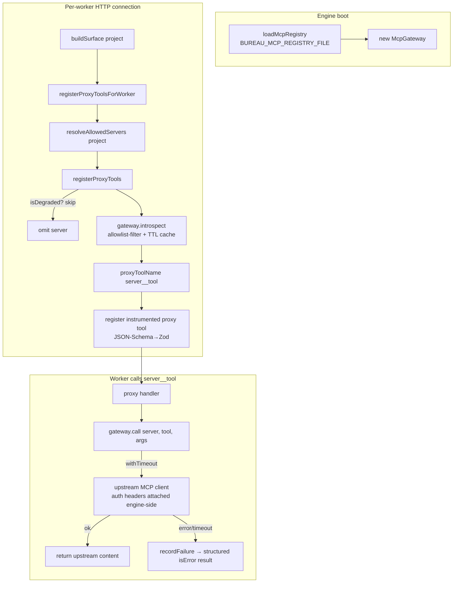
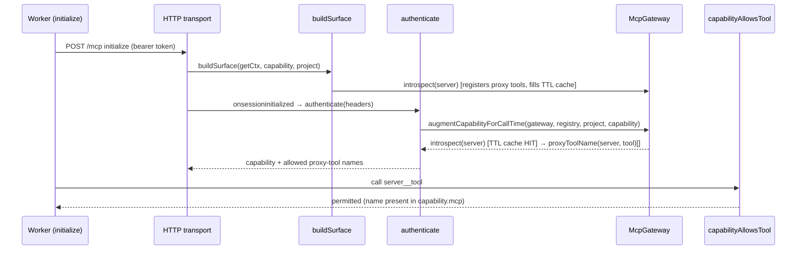

# MCP Gateway

## Overview

The MCP Gateway lets network-isolated worker pods use selected tools of remote MCP servers (e.g. a remote RAG server) **through the engine**, which proxies and ACLs every call, driven entirely by a YAML registry with no per-server code. The engine holds the upstream client connections and credentials; a worker only ever sees namespaced `<server>__<tool>` proxy tools registered on its own per-connection surface, and never receives an upstream URL or secret (`src/mcp-gateway/gateway.ts › defaultClientFactory`, `src/mcp-gateway/proxy-tools.ts › registerProxyTools`). It is a config-driven MCP gateway and one arm of the MCP-over-HTTP model-less ("tool shed") engine. With no `BUREAU_MCP_REGISTRY_FILE` set the whole subsystem is a complete no-op — the default (`src/mcp-server.ts › registerProxyToolsForWorker`).

## Responsibilities

- Load a typed MCP-server registry from `BUREAU_MCP_REGISTRY_FILE`, returning `[]` when unset/missing and failing loud on any malformed entry (`src/mcp-gateway/registry.ts › loadMcpRegistry`, `test: tests/mcp-gateway/registry.test.ts > "throws when tools allowlist is absent or empty (no implicit expose-all)"`).
- Resolve, per worker project, the subset of registry servers that worker may use — default-open unless an entry restricts itself via `projects` (`src/mcp-gateway/registry.ts › resolveAllowedServers`).
- Hold a pool of live upstream MCP clients, introspect each server's `tools/list` (allowlist-filtered, TTL-cached), and proxy calls with a timeout, a circuit breaker, and OTel spans (`src/mcp-gateway/gateway.ts › McpGateway`).
- Register one first-class proxy tool per allowlisted upstream tool of each non-degraded server onto a worker's surface, converting the upstream JSON-Schema to Zod (`src/mcp-gateway/proxy-tools.ts › registerProxyTools`, `src/mcp-gateway/json-schema-to-zod.ts › jsonSchemaToZod`).
- Augment the worker's call-time `Capability` with its allowed proxy-tool names so the authorization interceptor permits them (`src/mcp-gateway/capability-augmentation.ts › augmentCapabilityForCallTime`).
- Push a one-time, session-init capability-awareness directive telling a worker which upstream tools it may call (`src/mcp-gateway/capability-note.ts › buildCapabilityNoteDirective`, `src/workspace/enrichment.ts › formatCapabilityNote`).
- Resolve per-server auth secrets from a k8s projected-volume directory and translate them to outbound request headers, engine-side only (`src/mcp-gateway/secrets.ts › defaultSecretResolver`, `src/mcp-gateway/secrets.ts › authHeaders`).

## Key flows

### Proxy request flow (registration + call)

This flowchart shows how an allowed upstream tool becomes a worker-callable proxy tool and how a call is proxied through the engine, filtered and credentialed on the engine side (`src/mcp-server.ts › registerProxyToolsForWorker`, `src/mcp-gateway/proxy-tools.ts › registerProxyTools`, `src/mcp-gateway/gateway.ts › McpGateway`).

At boot the engine reads the registry and constructs one `McpGateway` over it (`src/mcp-server.ts › main`). On each worker HTTP connection, `buildSurface` calls `registerProxyToolsForWorker(surface, project)`, which resolves the project-allowed servers and registers a proxy tool per allowlisted upstream tool (`src/mcp-server.ts › registerProxyToolsForWorker`). Registration skips any server the breaker has marked degraded and isolates a per-tool registration failure so one bad tool cannot abort the rest (`src/mcp-gateway/proxy-tools.ts › registerProxyTools`). Each proxy handler forwards to `gateway.call`, returning the upstream `content` on success or a structured `isError` result on failure (`src/mcp-gateway/proxy-tools.ts › registerProxyTools`, `test: tests/mcp-gateway/gateway-call.test.ts > "returns a structured error (never throws) when the upstream call fails"`).

### Call-time capability augmentation

This sequence shows how a worker's authenticated connection has its `Capability` widened to include the allowed proxy-tool names, so the call-time authorization interceptor accepts them — mirroring registration-time naming exactly (`src/mcp-server.ts › main`, `src/mcp-gateway/capability-augmentation.ts › augmentCapabilityForCallTime`).

`augmentCapabilityForCallTime` re-uses `proxyToolName()` — not an inline template — so its names match what `registerProxyTools` registered; an inline `${e.name}__${t.name}` would diverge for names needing the hash branch and the interceptor would then deny the correctly-registered tool (`src/mcp-gateway/capability-augmentation.ts › augmentCapabilityForCallTime`). It is a no-op on an empty registry and skips a degraded or throwing upstream rather than failing worker auth (`test: tests/mcp-gateway/capability-augmentation.test.ts > "skips a degraded server without failing the whole augmentation (degrade, never fail)"`). The augmentation depends on registration-time `introspect()` having already populated the TTL cache, so the call-time `introspect()` is a cache hit rather than a fresh round-trip that could diverge from what was registered (`src/mcp-server.ts › main`).

## Public interface

| Symbol | Signature | Purpose |
|---|---|---|
| `loadMcpRegistry` | `(env = process.env): McpServerEntry[]` | Parse+validate the YAML registry at `BUREAU_MCP_REGISTRY_FILE`; `[]` when unset/missing; throws on any malformed entry (`src/mcp-gateway/registry.ts › loadMcpRegistry`) |
| `resolveAllowedServers` | `(registry, project): McpServerEntry[]` | The servers a worker on `project` may use — unrestricted (no `projects`) plus those listing the project (`src/mcp-gateway/registry.ts › resolveAllowedServers`) |
| `McpGateway` | class | Client pool + `introspect(name)` (allowlist+TTL), `call(name, tool, args)` (timeout/structured-error/span), `isDegraded(name)` circuit breaker (`src/mcp-gateway/gateway.ts › McpGateway`) |
| `defaultClientFactory` | `(secretResolver): ClientFactory` | Builds real SDK clients for `sse`/`streamable-http`; single-flight connect + rebuild-on-failure; attaches auth headers to the upstream `requestInit` (`src/mcp-gateway/gateway.ts › defaultClientFactory`) |
| `proxyToolName` | `(server, tool): string` | Namespaced `<server>__<tool>` name valid for `^[A-Za-z0-9_-]{1,64}$` and collision-resistant (`src/mcp-gateway/proxy-tools.ts › proxyToolName`) |
| `registerProxyTools` | `(server, gateway, entries): Promise<string[]>` | Register one proxy tool per non-degraded entry's allowlisted upstream tools; returns registered names (`src/mcp-gateway/proxy-tools.ts › registerProxyTools`) |
| `augmentCapabilityWithProxyTools` | `(cap, names): Capability` | Pure: append proxy names to a list-shaped capability; `*` unchanged (`src/mcp-gateway/proxy-tools.ts › augmentCapabilityWithProxyTools`) |
| `augmentCapabilityForCallTime` | `(gateway, registry, project, capability): Promise<Capability>` | Widen a worker's call-time capability with its allowed proxy-tool names; no-op on empty registry (`src/mcp-gateway/capability-augmentation.ts › augmentCapabilityForCallTime`) |
| `buildCapabilityNoteDirective` | `(registry, project, graphId, taskId): DirectiveRecord \| undefined` | Compose the one-time session-init awareness directive; `undefined` when there is nothing to say (`src/mcp-gateway/capability-note.ts › buildCapabilityNoteDirective`) |
| `jsonSchemaToZod` | `(schema): z.ZodTypeAny` | Convert an upstream tool's JSON-Schema `inputSchema` to Zod; degrades to a permissive object; never throws (`src/mcp-gateway/json-schema-to-zod.ts › jsonSchemaToZod`) |
| `defaultSecretResolver` | `(env): SecretResolver` | Read a `secretRef`'s keys from `BUREAU_MCP_SECRETS_DIR/<secretRef>/<key>` files (k8s projected volume) (`src/mcp-gateway/secrets.ts › defaultSecretResolver`) |
| `authHeaders` | `(auth, secrets): Record<string,string>` | Map an entry's auth mode + resolved secret to outbound headers: `headers` spreads keys, `bearer` sets `Authorization: Bearer <token>`, `none` empty (`src/mcp-gateway/secrets.ts › authHeaders`) |

Registration and augmentation are wired into the engine by `registerProxyToolsForWorker` (short-circuits on an empty registry) and the HTTP `authenticate` callback in `main()`; those wirings are owned by [MCP Server Core & Tool Surface](MCP%20Server%20Core%20%26%20Tool%20Surface.md) and [Auth & Tokens](Auth%20%26%20Tokens.md) (`src/mcp-server.ts › registerProxyToolsForWorker`, `src/mcp-server.ts › main`).

## Registry shape & naming

An `McpServerEntry` has `name`, `type` (free-form, informational), `transport` (`streamable-http` | `sse`), `url`, `auth` (`{ mode: headers|bearer|none, secretRef? }`), a required non-empty `tools` allowlist, and optional `projects` (`src/mcp-gateway/registry.ts › McpServerEntry`, `examples/mcp-registry.yaml`). `loadMcpRegistry` rejects a missing required field, an unsupported auth mode, a `headers`/`bearer` mode without a `secretRef`, a duplicate name, an unsupported transport (stdio), and an absent/empty `tools` allowlist — a GitOps ConfigMap mistake fails loud in engine-boot logs rather than silently (`src/mcp-gateway/registry.ts › loadMcpRegistry`, `test: tests/mcp-gateway/registry.test.ts > "rejects an unsupported transport (stdio)"`).

`proxyToolName` guarantees the `<server>__<tool>` output is valid for the API tool-name limit and that no two distinct `(server, tool)` pairs deterministically collide: characters outside the charset are replaced with `-`, and a short stable sha1 hash of the *original* pair is appended whenever sanitization changed a component, the joined raw does not contain exactly one `__` separator, the name exceeds 64 chars, or the name already ends in the hash-branch's own `_[0-9a-f]{6}` shape (`src/mcp-gateway/proxy-tools.ts › proxyToolName`, `test: tests/mcp-gateway/proxy-tools.test.ts > "never collides two distinct pairs whose underscores merge with the separator at the join boundary"`).

## Dependencies

- **`@modelcontextprotocol/sdk` client** — `SSEClientTransport` / `StreamableHTTPClientTransport` for upstream connections (`src/mcp-gateway/gateway.ts › defaultClientFactory`).
- **[Telemetry](Telemetry.md)** — `call()` opens a `bureau.mcp.proxy` span with `mcp.server`/`mcp.type`/`mcp.tool`/`mcp.degraded` attributes via the injected tracer; a throwing tracer cannot break the never-throws contract (`src/mcp-gateway/gateway.ts › McpGateway`).
- **[MCP Server Core & Tool Surface](MCP%20Server%20Core%20%26%20Tool%20Surface.md)** — `buildSurface` / `registerProxyToolsForWorker` register proxy tools onto each per-connection surface (`src/mcp-server.ts › registerProxyToolsForWorker`).
- **[Auth & Tokens](Auth%20%26%20Tokens.md)** — the HTTP `authenticate` path calls `augmentCapabilityForCallTime` after resolving the worker's `Capability` from its task record (`src/mcp-server.ts › main`).
- **Directive channel / [Workspace Awareness & Locks](Workspace%20Awareness%20%26%20Locks.md) enrichment** — the session-init note is delivered over the existing directive queue (drained on the worker's next tool call), reusing `formatCapabilityNote` (`src/mcp-gateway/capability-note.ts › buildCapabilityNoteDirective`, `src/workspace/enrichment.ts › formatCapabilityNote`).
- **k8s Secret projected volume** — per-server credentials mounted under `BUREAU_MCP_SECRETS_DIR/<secretRef>/` (`src/mcp-gateway/secrets.ts › defaultSecretResolver`).

## Configuration

| Key / option | Type | Default | Effect |
|---|---|---|---|
| `BUREAU_MCP_REGISTRY_FILE` | path | unset | YAML registry file; unset/missing → empty registry → whole subsystem is a no-op (`src/mcp-gateway/registry.ts › loadMcpRegistry`) |
| `BUREAU_MCP_SECRETS_DIR` | path | unset | Root under which `<secretRef>/<key>` files are read; unset → resolver returns `{}` (`src/mcp-gateway/secrets.ts › defaultSecretResolver`) |
| `ttlMs` (opt) | number | `120_000` | Introspect cache TTL (`src/mcp-gateway/gateway.ts › McpGateway`) |
| `timeoutMs` (opt) | number | `10_000` | Per upstream connect/list/call timeout (`src/mcp-gateway/gateway.ts › McpGateway`) |
| `breakerThreshold` (opt) | number | `3` | Consecutive failures before a server is degraded (`src/mcp-gateway/gateway.ts › McpGateway`) |
| `breakerCooldownMs` (opt) | number | `30_000` | Half-open cooldown before a degraded server is retried (`src/mcp-gateway/gateway.ts › McpGateway`) |

Registry entry fields are described under [Registry shape & naming](#registry-shape--naming); the shipped example exposes a remote RAG server's `context`/`search` tools over `streamable-http` with `headers`-mode secrets (`examples/mcp-registry.yaml`).

## Failure modes

- **Upstream slow/down** — `call()` is timeout-wrapped and never throws; a failure returns `{ ok: false, error: "mcp_unavailable", ... }`, which the proxy handler surfaces to the worker as an `isError` text result, so the tool call degrades but the task proceeds (`src/mcp-gateway/gateway.ts › McpGateway`, `test: tests/mcp-gateway/gateway-call.test.ts > "returns a structured error on timeout"`).
- **Repeated failure → circuit open** — after `breakerThreshold` consecutive failures a server `isDegraded` for the cooldown window; degraded servers are skipped at registration and augmentation. After cooldown it is retried (half-open); a success resets the counter, a failure re-arms the window (`src/mcp-gateway/gateway.ts › McpGateway`, `test: tests/mcp-gateway/gateway-call.test.ts > "P3: recovers from degraded after the cooldown window"`).
- **Introspect failure at registration** — `registerProxyTools` catches a throwing `introspect()` per entry and continues, so one bad server does not block the others' tools (`src/mcp-gateway/proxy-tools.ts › registerProxyTools`).
- **Duplicate proxy-tool name** — `registerInstrumentedTool` throws synchronously on a duplicate; the per-tool try/catch skips it rather than aborting registration for the rest (`src/mcp-gateway/proxy-tools.ts › registerProxyTools`).
- **Single-use SDK client** — the SDK sets `_transport` synchronously on `connect()`, so a `Client` is single-use even across a *failed* connect; `defaultClientFactory` makes `connect()` single-flight and rebuilds the client/transport pair after a failed connect or `close()`, so the next attempt (e.g. after the breaker cooldown) gets a fresh, connectable instance (`src/mcp-gateway/gateway.ts › defaultClientFactory`, `test: tests/mcp-gateway/client-factory.test.ts`).
- **Empty registry / no identity / no allowed servers** — `augmentCapabilityForCallTime`, `buildCapabilityNoteDirective`, and `registerProxyToolsForWorker` all degrade to a no-op rather than error (`src/mcp-gateway/capability-note.ts › buildCapabilityNoteDirective`, `test: tests/mcp-gateway/capability-note-directive.test.ts > "returns undefined for an empty registry (engine-wide no-op default)"`).

## History & decisions

- The original design specified a broad capability-typed `KnowledgeProvider` seam (an `McpRagProvider`, a `LocalCloneProvider`, and a `KnowledgeRouter` with a grep floor). The strategy hierarchy was **superseded at implementation time**: it shipped instead as a config-driven typed MCP gateway & registry — the RAG server is one YAML entry, not code — with the router/provider classes never built.
- The proxy-tool naming-collision class is hardened against `proxyToolName`'s boundary-merge and hash-branch-impersonation cases (`src/mcp-gateway/proxy-tools.ts › proxyToolName`).
- **Future consumer:** the seam is the foundation for worker-RAG — agents querying the incident/trace knowledge base through this gateway.

## Open questions

- Whether any deployed registry restricts servers per project is a config/runtime fact, not a code fact; the shipped example is default-open (no `projects:`), so every worker with a non-empty registry sees the remote RAG server (`examples/mcp-registry.yaml`). The per-project mechanism itself is exercised by tests (`test: tests/mcp-gateway/registry.test.ts > "includes a restricted server only for its listed project"`).
- `UpstreamClient.close()` is currently unreachable — `McpGateway` never invokes it, so no upstream connection is ever explicitly closed; a source comment flags a connect/close race to fix if lifecycle cleanup is ever wired through it (`src/mcp-gateway/gateway.ts › defaultClientFactory`). Not filed as a gap because it is dead-but-inert code the author annotated, not a live defect.

## Related

- [MCP Server Core & Tool Surface](MCP%20Server%20Core%20%26%20Tool%20Surface.md) — `buildSurface` / `registerProxyToolsForWorker` wiring
- [Auth & Tokens](Auth%20%26%20Tokens.md) — capability resolution the call-time augmentation extends
- MCP-over-HTTP model-less engine (tool shed) — the model-less engine this proxies through
- [Telemetry](Telemetry.md) — the `bureau.mcp.proxy` span
- [Workspace Awareness & Locks](Workspace%20Awareness%20%26%20Locks.md) — directive/enrichment channel the awareness note reuses
- [System Map](../Architecture/System%20Map.md)
