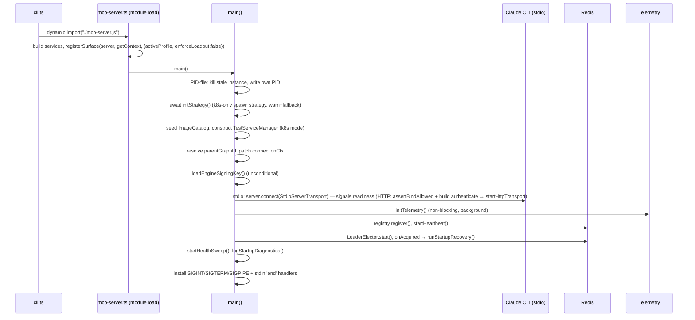
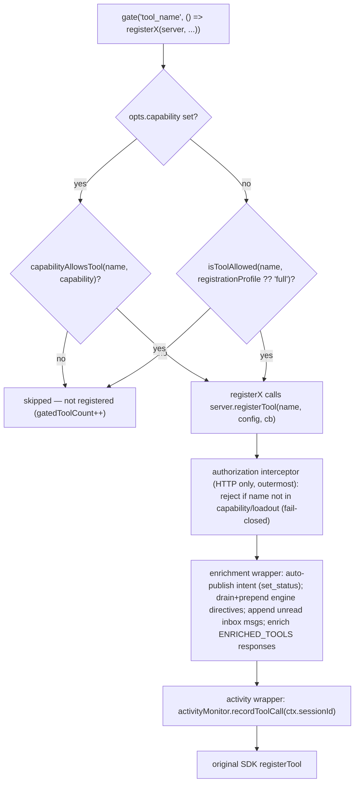
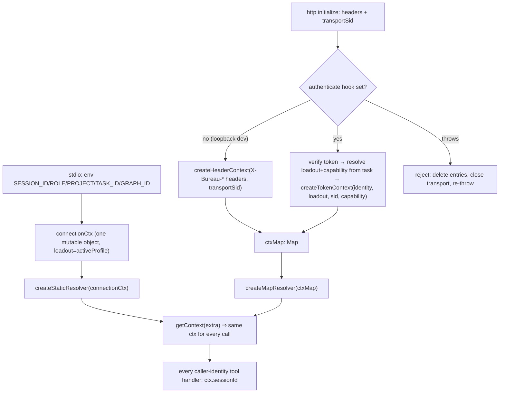
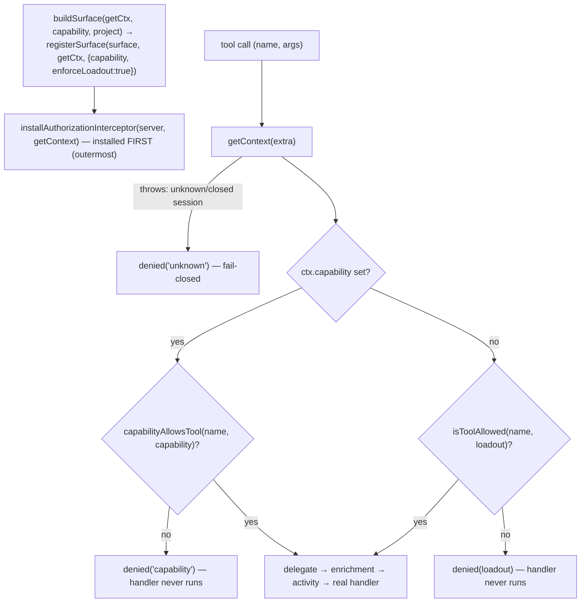
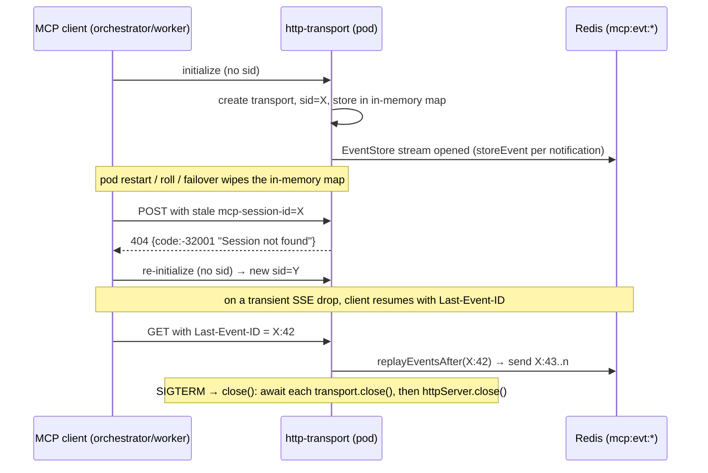
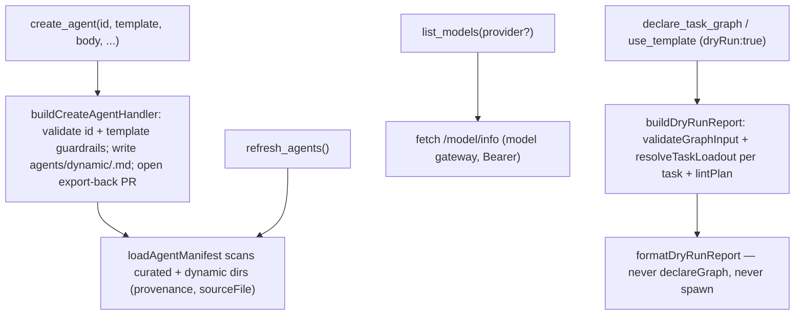

# MCP Server Core & Tool Surface

## Overview

This subsystem is the MCP server's process spine: the entry points (`cli.ts` → `mcp-server.ts`), the construction and wiring of all core services, the registration/authorization middleware, the profile- and capability-gated registration of every MCP tool, the per-connection identity seam, the transport branch (stdio or Streamable HTTP), and the startup/shutdown lifecycle. All interceptors and every gate-registration are bundled into a `registerSurface(server, getContext, opts)` factory (`src/mcp-server.ts › registerSurface`). In stdio mode `registerSurface` is called once at module scope with the module singletons and `{ registrationProfile: activeProfile, enforceLoadout: false }`; in HTTP mode it is called once per connection with `{ capability, enforceLoadout: true }` so each worker gets a freshly-registered, capability-scoped surface (`src/mcp-server.ts › registerSurface`, `src/mcp-server.ts › main`). Caller identity is not a process global: a `ConnectionContext` is resolved per tool call through a `ContextResolver`, so the same surface serves one agent over stdio or N agents over HTTP, each with its own identity, loadout, and capability (`src/runtime/connection-context.ts › ConnectionContext`, `src/mcp-server.ts › connectionCtx`). It also owns the shared cross-cutting utilities — `logger.ts`, `status-line.ts`, `utils/git.ts`, `utils/git-auth.ts`, `utils/format.ts`, `startup-diagnostics.ts` — and the barrel type modules under `src/types/`. Per-tool signatures are catalogued in [MCP Tool Catalog](../Reference/MCP%20Tool%20Catalog.md); build/release and test procedures live in [Build & Release Runbook](../Operations/Build%20%26%20Release%20Runbook.md) and [Testing Runbook](../Operations/Testing%20Runbook.md). Three adjacent concerns that Core only wires in are documented separately: the MCP gateway proxy-tool registration ([MCP Gateway](MCP%20Gateway.md)), the token→loadout→capability resolution ([Auth & Tokens](Auth%20%26%20Tokens.md)), and the k8s spawn/remote-merge machinery ([k8s Spawn & Remote Merge](k8s%20Spawn%20%26%20Remote%20Merge.md)).

## Responsibilities

- Provide the CLI entry points from a single `async main()` (the dispatch is wrapped in an async function because esbuild rejects top-level `await` for CJS bundles): bare invocation forwards to the MCP server; the `config` subcommand runs interactive MCP-inheritance configuration; the `mint-operator-token` subcommand prints an engine-signed operator/coordinator token to stdout — its internals are auth-owned, see [Auth & Tokens](Auth%20%26%20Tokens.md).
- Construct the `McpServer` advertising the real package version via the hoisted `_bureauPkg.version` (esbuild `BUNDLE_VERSION` define, package.json fallback) and, in stdio mode, connect it over stdio as the first async action in `main()`, before OTEL/Redis setup, so a slow boot never trips the Claude CLI MCP init timeout (`src/mcp-server.ts › main`).
- Bundle the (HTTP-only) call-time authorization interceptor, the two registration interceptors, and every gated tool registration into a single `registerSurface(server, getContext, opts)` factory (`src/mcp-server.ts › registerSurface`).
- Resolve caller identity per tool call via a `ContextResolver` rather than module globals: stdio returns one static `ConnectionContext` seeded from the session env; HTTP looks the context up per call by transport session id (`src/mcp-server.ts › connectionCtx`, `src/runtime/connection-context.ts › createMapResolver`).
- Wrap `server.registerTool` to record every tool call to the Redis-backed `ActivityMonitor` under the per-call caller's `ctx.sessionId` (the single dead-agent-detection interception point), in a try/catch so a context-resolution failure never blocks the call (`src/mcp-server.ts › registerSurface`).
- Wrap `server.registerTool` again to auto-publish intent from `set_status`, drain-and-prepend pending engine directives (high salience) and append unread inbox messages (low salience) on EVERY bureau tool response (the "Context pipe"), and inject workspace-awareness enrichment into the fixed `ENRICHED_TOOLS` set — all reading identity from `getContext(args[1])` (`src/mcp-server.ts › registerSurface`).
- Gate every tool registration through a `gate(name, register)` helper that is **capability-aware**: when the connection carries a resolved `Capability`, `capabilityAllowsTool(name, capability)` decides registration; otherwise it falls back to `isToolAllowed(name, registrationProfile ?? "full")`. stdio passes the env-derived `activeProfile` and no capability; HTTP passes the worker's task-resolved capability (`src/mcp-server.ts › registerSurface`, `src/runtime/capability.ts › capabilityAllowsTool`, `src/mcp-profiles.ts › isToolAllowed`).
- Register the runtime agent-authoring and model-discovery tools as first-class members of the tool surface: `create_agent`, `refresh_agents`, and `list_models` (all in `COORDINATOR_TOOLS`) (`src/mcp-server.ts › registerSurface`, `src/mcp-profiles.ts › COORDINATOR_TOOLS`).
- Register the observability, cross-graph-discovery, orientation, and skill-serving tools that were added after the initial surface: `observe_events` (coordinator — passive read-only stream tail for dashboards/observers), `query_all_discoveries` (minimal — cross-graph knowledge-base read), and `bureau_discover`/`list_skills`/`install_skill` (no profile set → `full`-only — a curated engine orientation map plus the first-party client-side skill catalog served over HTTP) (`src/mcp-server.ts › registerSurface`, `src/tools/observe-events.ts › registerObserveEvents`, `src/tools/query-all-discoveries.ts › registerQueryAllDiscoveries`, `src/tools/bureau-discover.ts › buildBureauDiscover`, `src/tools/list-skills.ts › registerListSkills`, `src/tools/install-skill.ts › registerInstallSkill`).
- Resolve the criteria-plugin and skill catalogs the same env-override-first way as `agentsDir` — `criteriaDir = defaultCriteriaDir(__dirname)` honours a `CRITERIA_DIR` override (falling back to `<dist>/../plugins/criteria`) so `list_criteria_plugins`/`save_criteria_plugin` work in the flattened `/app` container image, and `skillsDir = defaultSkillsDir(__dirname)` feeds `loadSkillCatalog` (`src/mcp-server.ts › registerSurface`, `src/criterion-engine.ts › defaultCriteriaDir`, `src/runtime/resolve-skill.ts › loadSkillCatalog`).
- Wire the `dryRun` preview path: a module-level `dryRunDeps = { agentsDir, toolchainRegistry, imageCatalog, gitRegistry }` is threaded into both `declare_task_graph` and `use_template` registrations so a `dryRun: true` flag resolves and lints a graph without declaring or spawning anything (`src/mcp-server.ts › registerSurface`, `src/tools/declare-task-graph.ts › registerDeclareTaskGraph`, `src/tools/use-template.ts › registerUseTemplate`).
- Enforce per-connection authorization at call time on the HTTP surface via `installAuthorizationInterceptor`, which rejects (fail-closed) any tool call outside the connection's `capability` (when set) or `loadout`; stdio never installs it and relies on registration-time gating (`src/runtime/authorization.ts › installAuthorizationInterceptor`).
- Branch the transport on `BUREAU_MCP_TRANSPORT` (default `stdio`): stdio connects the single module `server`; `http` stands up a Streamable HTTP server that builds one `McpServer` + one `StreamableHTTPServerTransport` per session and owns each connected worker's peer record (`src/mcp-server.ts › main`, `src/runtime/http-transport.ts › startHttpTransport`).
- Resolve the active profile from `BUREAU_PROFILE` (env-injectable `getActiveProfile(env)`), defaulting top-level orchestrators to `full` and spawned agents (`SPAWNED_BY` set) to `minimal`; `operator` is never env-self-selected (`src/mcp-profiles.ts › getActiveProfile`).
- Partition the four loadouts (`minimal` ⊂ `coordinator` ⊂ `operator`, plus `full`): the admin/cross-agent tools `cleanup_all`, `cleanup_graph`, `kill_session`, `kill_task`, `cancel_task_graph`, and `inject_context` belong to `operator` only; `create_agent`/`refresh_agents`/`list_models`/`get_workspace_state`/`observe_events` are in `coordinator`; `register_image`/`bureau_discover`/`list_skills`/`install_skill` are in no set (so `full`-only); `start_test_service`/`extend_lease`/`stop_test_service`/`list_test_services`, `query_all_discoveries`, and `heartbeat` are in `MINIMAL_TOOLS` (`src/mcp-profiles.ts › MINIMAL_TOOLS`, `src/mcp-profiles.ts › COORDINATOR_TOOLS`, `src/mcp-profiles.ts › OPERATOR_TOOLS`). `KNOWN_MCP_TOOLS` (the drift-guard set) grew to include all five newer tools (`src/runtime/capability.ts › KNOWN_MCP_TOOLS`).
- Run startup recovery (leadership-gated): scan `bureau:continuation:*` markers from a prior graceful shutdown and either re-attach monitoring or reset the task for re-dispatch; the recovery is wrapped in a `runStartupRecovery()` closure invoked by the `LeaderElector`'s `onAcquired` callback so only the elected leader replays it (`src/mcp-server.ts › main`). The leader-election/HA rationale is infra-owned — see [Engine Lifecycle & Leader Election](Engine%20Lifecycle%20%26%20Leader%20Election.md).
- Perform graceful shutdown: write continuation markers (subject to a `BUREAU_SHUTDOWN_BUDGET_MS` budget, default 8s), SIGTERM→SIGKILL locally-tracked agents while skipping externally-managed (k8s Job) entries, stop background services including the `LeaderElector`, flush OTEL, and quit Redis (`src/mcp-server.ts › main`).
- Stay alive in headless mode when stdin closes but the session still owns running agents/graphs (`src/mcp-server.ts › main`).
- Provide shared utilities: structured logging to stderr (`logger.ts`), the terminal-title status line (`status-line.ts`), git command wrappers with clone-concurrency backpressure (`utils/git.ts`), the no-leakage PAT askpass primitive (`utils/git-auth.ts`), and the type barrels (`src/types/`).

## Key flows

### Startup sequence

This sequence shows the order of operations from CLI launch to a ready, fully-instrumented server (all inside `src/mcp-server.ts › main`).

The PID file `/tmp/the-bureau-<sessionId>.pid` is session-scoped: a stale instance from the same session is SIGTERM'd (then SIGKILL after 3s) before the new one writes its PID (`src/mcp-server.ts › main`). `initStrategy()` is awaited to select the spawn strategy — since the k8s-only spawn migration worker dispatch is k8s-only, with a warn-and-continue fallback — the strategy machinery is infra-owned (see [Spawn & PTY](Spawn%20%26%20PTY.md)). In stdio mode the transport connects before OTEL and Redis registration to avoid MCP_TIMEOUT kills; just before connecting, `parentGraphId` is resolved from the graph record and patched onto the mutable `connectionCtx` so the enrichment interceptor sees child-graph workspace access on the first tool call (`src/mcp-server.ts › main`, `src/mcp-server.ts › connectionCtx`). The engine signing key is loaded unconditionally at the top of the connect block because k8s dispatch runs under a stdio orchestrator too. In HTTP mode there is no stdio connect; instead `startHttpTransport` is stood up, preceded by `assertBindAllowed(authConfig.mode, httpHost)` (a fail-closed bind guard owned by the auth layer — see [Auth & Tokens](Auth%20%26%20Tokens.md)) and the construction of the optional `authenticate`/`preResolveCapability`/`preResolveProject` hooks (`src/mcp-server.ts › main`). There is no post-handshake terminal setup: the k8s-only spawn migration removed `setupTerminals()`, the `TerminalRegistry`, the WebSocket terminal server, and the `src/types/terminal.ts` module entirely — k8s workers are observed via logs + HTTP-MCP, never a live PTY; see [Terminals & WS Server](Terminals%20%26%20WS%20Server.md) (deprecation note).

### Tool registration pipeline

This flowchart shows how a single tool registration flows through the (HTTP-only) authorization interceptor, the two middleware wrappers, and the capability-or-profile gate.

All interceptors and every gate-registration live inside `registerSurface(server, getContext, { capability?, registrationProfile?, enforceLoadout })` (`src/mcp-server.ts › registerSurface`). When `enforceLoadout` is true (HTTP only), `installAuthorizationInterceptor` is installed FIRST so it is outermost at call time; in stdio it is never installed. The first wrapper (activity) records every call to Redis keyed by the per-call caller's `ctx.sessionId` resolved from `getContext(args[1])`, wrapped in a try/catch so a context-resolution failure never blocks the call. The second wrapper (enrichment) is installed after, so it wraps the activity-wrapping version; it auto-publishes workspace intent on `set_status`, and for the `ENRICHED_TOOLS` set (`set_status`, `check_messages`, `lock_files`, `get_handoff`, `check_health`, `set_handoff`, `send_message`, `list_peers`) it post-processes the response through `enrichResponse`. Both wrappers swallow side-effect errors. The `gate()` helper counts registered vs. gated tools live (no hardcoded literal) and chooses `capabilityAllowsTool` over `isToolAllowed` whenever the connection carries a resolved capability (`src/mcp-server.ts › registerSurface`).

**The "Context pipe".** The enrichment wrapper runs an engine→worker context pipe on EVERY bureau tool response. After the real handler returns, when the caller has a `graphId`+`taskId` it does a cheap `hasDirectives` EXISTS gate and, if set, `drainDirectives` (atomic read-and-clear) and builds a high-salience prefix per directive (`⚠️ ENGINE DIRECTIVE (from <author>, <iso-ts>): <message>`); independently it calls `messaging.checkMessages(ctx.sessionId)` to build a low-salience `[MESSAGE from <from>]: <body>` suffix per unread inbox message. For an `ENRICHED_TOOLS` response the directive prefix goes ABOVE the workspace-enrichment text and the inbox suffix BELOW; for a non-enriched response the same prefix/suffix wrap the raw text. Both branches are individually try/caught and fall back to the unmodified result (`src/mcp-server.ts › registerSurface`). The directive store helpers live in `src/directives.ts` (`directive:<graphId>:<taskId>` Redis list, 24h TTL).

**P2 — runtime-agnostic HTTP drain endpoint (`GET /directives`).** Because a heads-down worker may go many turns without calling a bureau tool, P2 added an out-of-band drain path on the HTTP transport. When both a `drainDirectives?(graphId, taskId)` dep and `authenticate` are supplied, a `GET /directives` request authenticates the caller's worker token, rejects with `401` if the token carries no `graphId`+`taskId`, and otherwise returns `{ directives }` after draining (delivered exactly once) — `404 Not Found` when either dep is absent (`src/runtime/http-transport.ts › startHttpTransport`). The boot site wires it to the same store helper as the in-wrapper pipe (`src/mcp-server.ts › main`). This endpoint bypasses the MCP tool surface entirely, so it works for workers whose runtime offers no in-turn tool-response surface.

### Per-connection identity & HTTP transport

This flow shows how, in HTTP mode, two concurrent workers each resolve their own `ConnectionContext` (identity + loadout + capability) from one engine, and how stdio collapses to a single static context.

The per-call resolver is the seam that lets one tool surface serve either topology. In stdio, `connectionCtx` is seeded by hand from the session env consts — including `loadout: activeProfile` and `tenant` — keeping the `"orchestrator"` role fallback that a bare env read would drop, and wrapped in `createStaticResolver`, which returns that one mutable object for every call so the late `connectionCtx.parentGraphId = ...` patch is visible to all subsequent calls (`src/mcp-server.ts › connectionCtx`, `src/runtime/connection-context.ts › ConnectionContext`). In HTTP mode `startHttpTransport` builds a `ctxMap` keyed by the SDK transport session id, wraps it in `createMapResolver` (which throws rather than borrowing another agent's identity when a session is unknown), and on each `initialize` builds the connection's context (`src/runtime/http-transport.ts › startHttpTransport`, `src/runtime/connection-context.ts › createMapResolver`). The transport takes an optional `authenticate(headers, fallbackSessionId) => Promise<ConnectionContext>` hook: when provided it is awaited inside `onsessioninitialized`, and when omitted the legacy header path `createHeaderContext` derives identity directly from `X-Bureau-*` headers — including `loadout` from `x-bureau-loadout`, validated by `parseLoadout` and defaulting to `minimal` (least privilege) (`src/runtime/connection-context.ts › createHeaderContext`, `src/mcp-profiles.ts › parseLoadout`). If `authenticate` throws, the transport logs, deletes the half-built `ctxMap`/`transports` entries, closes the transport, and re-throws — fail-closed at the door (`src/runtime/http-transport.ts › startHttpTransport`).

The authenticated path's context factory is `createTokenContext(identity, loadout, fallbackSessionId, capability?)`, which maps a verified token identity to a `ConnectionContext` — `sessionId` from the identity's claim (falling back to the transport sid only when empty), `taskId`/`graphId` from the identity, the engine-resolved `loadout` and optional `capability` passed in (never read from the token itself) (`src/runtime/connection-context.ts › createTokenContext`). The token verification, loadout resolution (`resolveLoadoutFromTask`/`resolveOperatorLoadout`), and capability resolution (`resolveCapabilityFromTask`) that produce those arguments live in `src/runtime/auth/*` and are engine/infra-owned — see [Auth & Tokens](Auth%20%26%20Tokens.md); Core only consumes the results to seat a context (`src/mcp-server.ts › main`).

Because the MCP SDK forbids one `McpServer` across multiple transports, the HTTP path creates one `McpServer` + one `StreamableHTTPServerTransport` per session via `buildSurface(getCtx, capability, project)` — a callback that calls `registerSurface(surface, getCtx, { capability, enforceLoadout: true })` and then `registerProxyToolsForWorker(surface, project)` — all sharing the engine singletons and the single `ctxMap` (`src/runtime/http-transport.ts › startHttpTransport`, `src/mcp-server.ts › registerProxyToolsForWorker`). Before `buildSurface` runs, `resolveSurfaceArgs` pre-resolves the connection's `capability` and `project` from the initialize headers (both degrade to `undefined` on any failure — a down resolver must never reject a connection that would otherwise succeed under the full-registration fallback) (`src/runtime/http-transport.ts › resolveSurfaceArgs`). The pre-resolved `capability` drives registration-time gating; the pre-resolved `project` scopes the MCP-gateway proxy-tool registration — the gateway itself (upstream MCP servers, ACL registry, proxy-tool naming) is documented in [MCP Gateway](MCP%20Gateway.md). DNS-rebinding protection is on, with `allowedHosts` from `BUREAU_MCP_ALLOWED_HOSTS`. The engine owns each connected worker's peer record: `onSessionInit` calls `registry.putPeer(makeWorkerPeer(ctx))` (and pushes a one-time capability-awareness directive when the gateway registry is non-empty) and `onSessionClose` calls `registry.removePeer(...)` (`src/runtime/http-transport.ts › startHttpTransport`, `src/mcp-server.ts › main`). This decomposition follows the model-less-engine, MCP-over-HTTP architecture.

**Reconnect contract (O6).** Because logical identity is derived from token claims and not from the SDK-assigned transport session id, a worker that drops its HTTP/SSE session and re-initializes with the *same* per-task token is rebuilt with the same logical `sessionId`/`taskId`/`graphId` — engine state lives in Redis, not the connection. `createTokenContext` is the mechanism: it ignores the transport sid except as a fallback when the token carries no `sessionId` claim (`src/runtime/connection-context.ts › createTokenContext`, `src/runtime/http-transport.ts › startHttpTransport`).

### Loadout & capability authorization (D3)

This flow shows how the HTTP surface authorizes each tool call against the connection's assigned capability (Phase 2) or loadout — the key change being that both are a property of the connection (engine/task-assigned) rather than self-selected by the worker.

D3 repurposes the profile system from a registration-time, env-self-selected gate into a per-connection, engine-assigned authorization filter on the central surface, so a worker cannot escalate its own loadout. `installAuthorizationInterceptor` wraps `server.registerTool` so each call resolves `ctx = getContext(extra)` and rejects — via a `denied(name, ...)` `{ isError: true }` result, without running the handler — when the tool is not permitted; if the context lookup throws (unknown/closed session) it also rejects with `denied(name, "unknown")`, i.e. fail-closed (`src/runtime/authorization.ts › installAuthorizationInterceptor`). Phase 2 makes the check **capability-first**: when `ctx.capability` is set the interceptor uses `capabilityAllowsTool(name, ctx.capability)` (the resolved per-task MCP allowlist), otherwise it falls back to the `ProfileName`-based `isToolAllowed(name, ctx.loadout)` (`src/runtime/authorization.ts › installAuthorizationInterceptor`, `src/runtime/capability.ts › capabilityAllowsTool`).

The loadout partition is the substantive profile policy: `cleanup_all`, `cleanup_graph`, `kill_session`, `kill_task`, `cancel_task_graph`, and `inject_context` are `operator`-only, so a `coordinator` connection can drive its fleet but cannot issue the blunt cross-agent cleanup/kill/cancel instruments or inject engine directives (`src/mcp-profiles.ts › OPERATOR_TOOLS`). The four ordered profiles are `minimal` ⊂ `coordinator` ⊂ `operator`, plus `full` (null = no filtering) (`src/mcp-profiles.ts › isToolAllowed`). stdio is deliberately untouched: it passes `enforceLoadout: false`, never installs the interceptor, and keeps registration-time gating on the env-derived `activeProfile` (`src/mcp-server.ts › registerSurface`). The `Capability` descriptor (an `{ mcp, harness, suppressMemory }` bundle) and its built-in templates — including the small-context `nano` bundle — live in `src/runtime/capability.ts`; `KNOWN_MCP_TOOLS` is the canonical tool-name set a drift-guard test asserts every registered tool appears in (`src/runtime/capability.ts › BUILTIN_TEMPLATES`, `src/runtime/capability.ts › KNOWN_MCP_TOOLS`).

### Session resilience: spec-compliant 404, durable EventStore, graceful drain

This flow shows how a client whose session was invalidated by a pod restart re-establishes automatically, how server→client SSE streams survive a transient drop, and how a rolling deploy drains in-flight work (all in `src/runtime/http-transport.ts › startHttpTransport`).

Both routing branches for an unknown session now return spec-compliant **404** (the signal a compliant MCP client uses to discard the session and re-`initialize`), replacing the prior non-compliant 400 that wedged the client on a dead session: the POST branch returns `404 { code: -32001, message: "Session not found" }`, the GET/DELETE branch returns `404 "Session not found"` (`src/runtime/http-transport.ts › startHttpTransport`). For SSE resumability the transport takes an optional `eventStore?: EventStore` dep passed into the SDK options; the boot site always supplies a `RedisEventStore`, which keys each stream as a Redis list `mcp:evt:<streamId>` with a TTL (default 3600s), encodes the event id as `<streamId>:<index>`, and degrades gracefully — any Redis error in `storeEvent`/`replayEventsAfter` is logged and swallowed so it never throws into the request path (`src/runtime/redis-event-store.ts › RedisEventStore`). `close()` is a graceful drain for rolling deploys: it `await`s each open SDK transport's `close()`, clears the map, evicts idle keep-alive sockets via `closeAllConnections()`, and awaits `httpServer.close()` (`src/runtime/http-transport.ts › startHttpTransport`). Multi-replica safety is by design but the deployment runs at `replicas: 1` today — the ingress/`RollingUpdate` side is infra-owned and deferred; see [Engine Lifecycle & Leader Election](Engine%20Lifecycle%20%26%20Leader%20Election.md).

**SSE keep-alive heartbeat (long-poll survival).** A long-blocking tool call (notably `await_graph_event`) produces zero bytes on its SSE response while the Redis `XREADGROUP BLOCK` is parked, so a reverse-proxy idle timeout can tear down an otherwise-alive connection. `startSseHeartbeat(res, intervalMs = 15_000)` writes a spec-safe `: ping\n\n` SSE comment line every 15s while the response is writable, returning a stop function; the timer is `unref`'d so it never holds the process open. It wraps each of the three `transport.handleRequest` paths in a `try/finally`, and the transport also clears Node's default `requestTimeout` (`src/runtime/http-transport.ts › startSseHeartbeat`, `src/runtime/http-transport.ts › startHttpTransport`). The comment line is ignored by any SSE parser; it is defense-in-depth complementing the infra-side reverse-proxy `readTimeout = 0`.

Five caller-identity handlers were re-routed off `registry.getSelf()` (the engine, not the caller, under multi-connection) onto `ctx.sessionId`: `set_status`, `send_message`, `broadcast`, `spawn_session` (spawnedBy provenance), and `check_messages`. `PeerRegistry` gained `putPeer`/`removePeer`/`applyPeerUpdate` for engine-owned per-session records (`src/registry.ts › PeerRegistry`).

### Runtime agent authoring, model discovery, and dry-run
This flow shows the three tools that let an orchestrator shape and preview a graph before spending tokens.

**`create_agent`** authors a new agent role at runtime. `buildCreateAgentHandler(agentsDir)` validates the id against `/^[a-z][a-z0-9-]{0,62}$/`, forbids the `coordinator`/`full`/`operator` templates (dynamic agents must use `minimal` or `nano`), writes `agents/dynamic/<id>.md` with YAML-quoted frontmatter, and opens an export-back pull request so the definition survives a PVC reset; a duplicate id overwrites the file idempotently but the PR returns `null` (`src/tools/create-agent.ts › buildCreateAgentHandler`, `test: src/__tests__/create-agent.test.ts > "rejects coordinator/full/operator template (guardrail)"`, `test: src/__tests__/create-agent.test.ts > "YAML-injection: newline in template is written as a quoted JSON string, not a bare multiline"`). **`refresh_agents`** forces a re-scan and returns the roster with per-agent `provenance` (`curated` | `dynamic`) and `sourceFile`, so the caller can confirm a newly-created role is visible (`src/tools/refresh-agents.ts › registerRefreshAgents`, `test: src/__tests__/refresh-agents.test.ts > "returns dynamic agents from dynamic/ with provenance=dynamic"`). Both rely on `loadAgentManifest(agentsDir)`, which now scans a `curated` top-level dir plus a `dynamic/` dir and tags each `AgentDef` with `provenance`/`sourceFile` (`src/runtime/resolve-agent.ts › loadAgentManifest`, `src/types/agent.ts › AgentDef`).

**`list_models`** queries a model gateway provider and returns its models with metadata. `buildListModelsHandler(agentsDir)` looks the named provider up in `manifest.providers` (or auto-discovers the first `gateway`-auth provider with a `baseUrl`), fetches `<baseUrl>/model/info` with a `Bearer` token read from the provider's `auth.env` host var, and maps each entry to a `ModelInfo` (via `.map`, not `.filter`) — always keeping `model_name` as `name` and populating `description`/`tags`/`maxTokens` from `model_info` only when present, so entries lacking `model_info` (e.g. embedding models) are kept with just a `name` and nothing is dropped (`src/tools/list-models.ts › buildListModelsHandler`, `test: src/__tests__/list-models.test.ts > "auto-discovers first gateway provider when no provider specified"`). Two failure surfaces now **degrade gracefully instead of throwing**: when auto-discovery finds no gateway provider it returns a structured `{ provider: null, baseUrl: null, models: [], providerUnavailable: true, reason }` result (a direct-Anthropic-only deployment is a normal state, not an error), and a configured-but-unreachable gateway (a `fetch` rejection) returns the same `providerUnavailable` shape naming the unreachable `baseUrl`; it still throws on an unknown/baseUrl-less *named* provider and on a non-ok gateway response (`src/tools/list-models.ts › buildListModelsHandler`).

**`dryRun`** is a boolean flag on `declare_task_graph` and `use_template` (not a standalone tool) that resolves and lints a graph without declaring or spawning. When set, the handler builds `buildDryRunReport` from the module-level `dryRunDeps` (or returns an `isError` "dry-run is not available" message when `dryRunDeps` is not wired) and returns `formatDryRunReport(report)` instead of calling `declareGraph` (`src/tools/declare-task-graph.ts › registerDeclareTaskGraph`, `src/tools/use-template.ts › registerUseTemplate`, `test: src/__tests__/dry-run-tool.test.ts > "returns a dry-run report and never calls declareGraph"`, `test: src/__tests__/dry-run-tool.test.ts > "returns an error (not a crash) when dryRun is set but dryRunDeps is not wired"`). `buildDryRunReport` runs the SAME declare-time validations via `validateGraphInput` (surfacing throws as `graph-invalid` findings rather than crashing), resolves each task through the pure `resolveTaskLoadout` (role/model/capability-template/toolchain/image/build-config), performs the async image-approval check outside the pure resolver, and appends `lintPlan` findings (`src/tools/dry-run.ts › buildDryRunReport`, `src/graph-validate.ts › validateGraphInput`, `src/runtime/resolve-loadout.ts › resolveTaskLoadout`). `validateGraphInput` also enforces the requirement-coverage rules — `coverageIds` is valid only on an `exec` criterion, each id must match `^[A-Za-z0-9._-]+$`, and at most one `exec` criterion per graph may carry them (`src/graph-validate.ts › validateGraphInput`). `lintPlan` is a pure structural lint that mirrors dispatch's guards: it errors on an unknown role, a resolver failure, a `validation` gate with no resolvable test command (`hasUnresolvedValidationGate`: `validation` set but no `task.test`), an unsupported test-service type (only `redis`/`postgres`), an unknown toolchain, an unapproved image, and — since — a `gate-no-install` gap (a unit/integration gate whose tasks provide no way to install deps, via `hasValidationInstallGap`); the `gate-no-install` finding was **escalated from `severity:"warning"` to `severity:"error"`** so the lint no longer understates a condition that `declare_task_graph`/`use_template` now hard-reject at declare time (`src/tools/dry-run.ts › lintPlan`). It still warns on a no-Edit/Write capability with build/test work, integration validation with no test services, a `reviewloop-no-reject` tripwire (a `reviewLoop` task whose resolved capability somehow lacks `reject_task` — should never fire, see below), and `dependsOn` coupling — now worded as "dependents receive their dependencies' committed/merged work via the per-graph integration branch (impl→impl and impl→review chains supported); only a predecessor's uncommitted working-tree state is invisible" (`src/tools/dry-run.ts › lintPlan`, `src/tools/validation-install-gap.ts › hasValidationInstallGap`, `test: src/__tests__/dry-run-lint.test.ts > "errors on a validation gate with no test command (mirrors dispatch)"`, `test: src/__tests__/dry-run-lint.test.ts > "warns when a no-harness capability (nano) has build/test work"`). `hasValidationInstallGap` was extracted into its own module `src/tools/validation-install-gap.ts` (with the message constant `GATE_NO_INSTALL_MESSAGE`) and re-exported from `dry-run.ts` for back-compat; its predicate is deliberately permissive — a gated task satisfies it via a truthy `task.install` (a no-op `":"` counts, asserting deps are pre-provisioned) OR an install/fetch step embedded in `task.test` (matched by an `INSTALL_IN_TEST` regex over `npm ci`, `pip install`, `dotnet restore`, `go mod download`, …), so `npm ci && vitest` is not flagged (`src/tools/validation-install-gap.ts › hasValidationInstallGap`, `src/tools/validation-install-gap.ts › GATE_NO_INSTALL_MESSAGE`). `resolveTaskLoadout` is the shared per-task resolver used by both dispatch and dry-run, so the preview matches what dispatch would actually do; it also **injects `reject_task` into any `reviewLoop` task's capability** (regardless of resolve success) so a minimal-profile reviewer can actually block promotion on a REJECT verdict (`src/runtime/resolve-loadout.ts › resolveTaskLoadout`).

**Declare-time validation-gate rejection.** Both `declare_task_graph` and `use_template` now reject at declare time — before `declareGraph`, over the same post-buildConfig-fill `resolvedTasks` the dispatcher sees — on two independent conditions, checked back-to-back in the same order in both tools:

1. **No resolvable test command.** Via the shared `findUnresolvedValidationGate`/`formatUnresolvedValidationGateError` helpers: when a task declares any `validation` level (including `self`) but has no resolvable test command, the tool returns an `isError` result instead of letting the task die ~70ms later at dispatch with no sessionId and cascade-canceling dependents (`src/tools/declare-task-graph.ts › registerDeclareTaskGraph`, `src/tools/use-template.ts › registerUseTemplate`, `src/tools/dry-run.ts › findUnresolvedValidationGate`).
2. **No dependency-install command.** Immediately after the check, both tools call `hasValidationInstallGap(resolvedTasks)` and, if true, return an `isError` result carrying `GATE_NO_INSTALL_MESSAGE` — a toolchain-agnostic message telling the caller to set `task.install` or a `buildConfig` service install (`npm ci`, `pip install -e .`, `dotnet restore`, `go mod download`, …). This escalated the pre-existing dry-run-only `gate-no-install` warning into a hard declare-time rejection because a unit/integration gate with no install clones fresh and false-fails the bare test command (the incident class). The check is placed at the tool-handler layer beside the rejection so `resolveGraphInput` stays a pure resolver and internal `declareGraph` callers keep the softer warn-and-proceed path (`src/tools/declare-task-graph.ts › registerDeclareTaskGraph`, `src/tools/use-template.ts › registerUseTemplate`, `src/tools/validation-install-gap.ts › hasValidationInstallGap`, `src/tools/validation-install-gap.ts › GATE_NO_INSTALL_MESSAGE`).

Because the hard reject returns early on the exact `hasValidationInstallGap(resolvedTasks)` predicate, a residual advisory line each success-response builder carried (`⚠️ [gate-no-install] …`) was unreachable dead code, removed from both handlers so the hard reject is now the sole handling of the condition (`src/tools/declare-task-graph.ts › registerDeclareTaskGraph`, `src/tools/use-template.ts › registerUseTemplate`). A best-effort **sibling-overlap advisory** (`findSiblingFileOverlaps`/`formatSiblingOverlapWarning`) is also appended to `declare_task_graph`'s success response, right after the coupled-work warning, wrapped in try/catch so it can never block a declare (`src/tools/declare-task-graph.ts › registerDeclareTaskGraph`). The same two tools gained `autoRework` (opt-in bounded auto-fix loop, `maxAttempts` 1–3, off by default) and `selfImprove` (force retro on/off) inputs, both threaded into `declareGraph`; a declare-level `autoRework` overrides `buildConfig`'s wholesale rather than merging (`src/tools/declare-task-graph.ts › registerDeclareTaskGraph`). These are owned by [State Machine & Rework](State%20Machine%20%26%20Rework.md) / [Self-Improvement Loop](Self-Improvement%20Loop.md); Core only wires the tool inputs.

## Public interface

The module exposes no exports of its own — it is an executable entry that runs on import. Its "interface" is the set of CLI entry points and the constructed server. Per-tool signatures are catalogued in [MCP Tool Catalog](../Reference/MCP%20Tool%20Catalog.md).

Cross-cutting utilities (the load-bearing exported API of this subsystem):

| Symbol | Signature | Description | Citation |
|---|---|---|---|
| `createLogger` | `(ctx) => pino.Logger` | Child pino logger bound to correlation IDs; all logs to stderr (stdout reserved for MCP JSON-RPC). The root `logger` carries a `mixin` injecting `trace_id`/`span_id`/`trace_flags` when a valid OTel span is active; a safe no-op until `initTelemetry()` injects the dynamically-imported `@opentelemetry/api` refs | `src/logger.ts › createLogger` |
| `git` / `gitSafe` / `gitAsync` / `gitSafeAsync` | git command wrappers | sync/async git execution with safe (non-throwing) variants; async path enforces a `BUREAU_GIT_TIMEOUT_MS` timeout (default 120s) and emits a `git.<op>` span + `bureau.git.op` metric. `gitSafeAsync` takes an optional `{ env, attempt, transient }` argument (env merged over `process.env` for one invocation; attempt/transient tag the OTel metric) and applies clone-concurrency backpressure — at most `BUREAU_GIT_MAX_CONCURRENT_CLONES` (default 3) simultaneous `clone` ops, the rest queued | `src/utils/git.ts › gitSafeAsync` |
| `createAskpass` | `(repoUrl, token) => { env, dispose() }` | PAT-askpass primitive: for a non-empty token, writes a `0o700` temp `GIT_ASKPASS` script and returns env with `GIT_ASKPASS`/`GIT_TERMINAL_PROMPT`; the token never appears in the returned env, only in the script file, and `dispose()` removes it. Empty token → no-op | `src/utils/git-auth.ts › createAskpass` |
| `withGitAuth` | `(repoUrl, fn) => Promise<T>` | Convenience wrapper on `createAskpass`: when `BUREAU_GIT_TOKEN` is set it injects the askpass env into `fn` and `dispose()`s in a `finally`; no-op (`fn({})`) when unset | `src/utils/git-auth.ts › withGitAuth` |
| `RedisEventStore` | `class implements EventStore` | SDK `EventStore` over Redis lists (`mcp:evt:<streamId>`, TTL'd) for SSE resumability in HTTP mode; event id `<streamId>:<index>`; all Redis errors degrade gracefully | `src/runtime/redis-event-store.ts › RedisEventStore` |
| `getActiveProfile` / `parseLoadout` / `isToolAllowed` / `getProfileToolList` | profile/loadout helpers | Resolve the env profile (env-injectable), validate a raw loadout string to a `ProfileName` defaulting to `minimal`, and test/list tools per profile | `src/mcp-profiles.ts › getActiveProfile`, `src/mcp-profiles.ts › parseLoadout`, `src/mcp-profiles.ts › isToolAllowed` |
| `capabilityAllowsTool` / `resolveTemplate` / `toToolFlags` / `KNOWN_MCP_TOOLS` / `BUILTIN_TEMPLATES` | capability descriptor | Harness-neutral tool-surface bundle (`{ mcp, harness, suppressMemory }`), its built-in templates (incl. `nano`), the canonical tool-name set, the per-tool allow check, and the `--tools` argv translation | `src/runtime/capability.ts › capabilityAllowsTool`, `src/runtime/capability.ts › BUILTIN_TEMPLATES`, `src/runtime/capability.ts › KNOWN_MCP_TOOLS` |
| `buildDryRunReport` / `lintPlan` / `formatDryRunReport` | dry-run helpers | Resolve+lint a graph plan without side effects; the report/formatter power the `dryRun` flag | `src/tools/dry-run.ts › buildDryRunReport`, `src/tools/dry-run.ts › lintPlan` |
| `resolveTaskLoadout` / `validateGraphInput` | shared resolver/validator | Pure per-task loadout resolver + declare-time input validation, shared by dispatch and dry-run so the preview equals the real path | `src/runtime/resolve-loadout.ts › resolveTaskLoadout`, `src/graph-validate.ts › validateGraphInput` |
| `discoverAndReport` / `applySetupChoices` / `writeBureauConfig` | bureau-setup MCP-config API | Discover MCP servers and persist `.bureau/config.json` | `src/bureau-setup.ts › discoverAndReport` |
| `writeBuildConfig` / `readExistingBuildConfig` / `removeBuildConfig` / `detectDraftBuildConfig` | bureau-setup buildconfig API | Validate/write/read/remove the committed `bureau.buildconfig.json`, and draft one from toolchain detection (confident, command-trusted, language-bearing services only) | `src/bureau-setup.ts › writeBuildConfig`, `src/bureau-setup.ts › detectDraftBuildConfig` |
| `needsLangFragment` | `(category, role) => boolean` | Whether the per-language prompt fragment (`agents/lang/<lang>.md`) is appended: true for categories implementation/testing/quality or named ops/infra roles; false for planning/research/documentation | `src/types/agent.ts › needsLangFragment` |

`src/types/index.ts` is a barrel re-exporting `graph`, `task`, `event`, `peer`, `agent`, `telemetry`, `handoff`, `template`, `store`, `api`, `workspace`, and now the `parseToolOutput` helper from `src/types/parse-tool-output.ts` (`src/types/index.ts`). The `api` module carries the typed wire-output shapes of the read-surface tools (including the newer `QueryAllDiscoveriesOutput` and `BureauDiscoverOutput`). The wire-shape contract test seeds Redis, invokes **nine** read-surface handlers — `bureau_health`, `check_health`, `get_version`, `list_peers`, `list_templates`, `get_workspace_state`, `monitor_graph`, `get_task_graph`, `list_graphs` — and structurally asserts each emitted JSON still matches its published `*Output` type, so a tool that silently changes its output shape fails CI (`test: src/__tests__/api-contract.test.ts > "bureau_health emits BureauHealthOutput"`). It does NOT cover `query_all_discoveries` or `bureau_discover`; their `QueryAllDiscoveriesOutput`/`BureauDiscoverOutput` shapes are asserted by separate envelope tests (`test: src/__tests__/query-all-discoveries-envelope.test.ts`, `test: tests/tools/bureau-discover.test.ts`). The `host` re-export and `src/types/host.ts` were **removed** by the dead-host-fields pass — `HostConfig` no longer exists anywhere in `src/`; the earlier state that added `host.ts` is superseded. `types/agent.ts` defines `AgentDef`/`AgentManifest`: each agent may declare an optional `runtime`/`provider`, and now carries optional `provenance` (`curated` | `dynamic`) and `sourceFile` fields populated by the manifest scan; the manifest may carry `runtimes`/`providers` registries (`src/types/agent.ts › AgentDef`).

## Dependencies
- **MCP SDK** — `@modelcontextprotocol/sdk` `McpServer` + `StdioServerTransport`; in HTTP mode also `StreamableHTTPServerTransport` + `isInitializeRequest` + the SDK `EventStore` interface (implemented by `RedisEventStore`) over a `node:http` server (`src/mcp-server.ts › registerSurface`, `src/runtime/http-transport.ts › startHttpTransport`).
- **Redis** — this module creates one long-lived commands client at module scope (`const redis = createRedisClient(...)`), a `createBlockingRedis()` factory that mints a fresh blocking client per `await_graph_event` call (so concurrent HTTP sessions block independently), and a separate `getRedis` factory passed to the telemetry events-bridge (`getRedis: async () => createRedisClient(redisConfig)`); in HTTP mode the SSE `RedisEventStore` reuses the module-scope commands client (`src/mcp-server.ts › main`). The authoritative client inventory and connection-pooling policy live in [Redis & Connection Layer](Redis%20%26%20Connection%20Layer.md).
- **All peer subsystems** are wired here: [Task Graph Engine](Task%20Graph%20Engine.md), [Spawn & PTY](Spawn%20%26%20PTY.md), [Health & Process Monitoring](Health%20%26%20Process%20Monitoring.md), [Messaging & Handoffs](Messaging%20%26%20Handoffs.md), [Workspace Awareness & Locks](Workspace%20Awareness%20%26%20Locks.md), [Self-Improvement Loop](Self-Improvement%20Loop.md), [Telemetry](Telemetry.md), [Criterion Engine & Plugins](Criterion%20Engine%20%26%20Plugins.md), [State Machine & Rework](State%20Machine%20%26%20Rework.md), [Templates & Agent Registry](Templates%20%26%20Agent%20Registry.md), [Test Service Broker](Test%20Service%20Broker.md). The terminal subsystem ([Terminals & WS Server](Terminals%20%26%20WS%20Server.md)) is no longer wired.
- **MCP gateway** — a config-driven typed gateway/registry (`loadMcpRegistry`/`McpGateway`/`registerProxyTools`) is constructed at boot and threaded into `buildSurface` so per-worker surfaces get project-scoped proxy tools; an empty registry (the default) is a complete no-op. The gateway internals are owned by [MCP Gateway](MCP%20Gateway.md) (`src/mcp-server.ts › registerProxyToolsForWorker`).
- **Auth layer** — `loadAuthConfig`/`createOidcVerifier`/`resolveLoadoutFromTask`/`resolveCapabilityFromTask`/`assertBindAllowed`/`loadEngineSigningKey`/`extractToken` from `src/runtime/auth/*`; Core consumes them in the HTTP `authenticate` hook only. Owned by [Auth & Tokens](Auth%20%26%20Tokens.md) (`src/mcp-server.ts › main`).
- **node-pty** — no longer a dependency; dropped with the terminal subsystem by the k8s-only spawn migration (the type-only `@types/ws` devDependency remains orphaned).
- **`claude` CLI** — the binary this server is configured into; the agent-facing MCP server key must be `bureau-agent` (see [Spawn & PTY](Spawn%20%26%20PTY.md)). Claude Code connects to the engine as a `type: "http"` MCP client in HTTP mode.

## Configuration

Environment variables read at module load (`src/mcp-server.ts › connectionCtx` and neighbouring module consts):

| Var | Type | Default | Effect | Citation |
|---|---|---|---|---|
| `BUREAU_PROFILE` | `minimal`\|`coordinator`\|`operator`\|`full` | derived | Explicit profile override (env-self-selecting `operator` is possible but not the default) | `src/mcp-profiles.ts › getActiveProfile` |
| `SPAWNED_BY` | string | unset | When set (no explicit profile), defaults profile to `minimal` | `src/mcp-profiles.ts › getActiveProfile` |
| `SESSION_ID` / `SESSION_ROLE` / `SESSION_PROJECT` / `TASK_ID` / `GRAPH_ID` | string | random uuid / `orchestrator` / `""` | Session identity + graph/task context | `src/mcp-server.ts › connectionCtx` |
| `AGENTS_DIR` | path | `<dist>/../agents` | Agent prompt directory (curated + dynamic scan) | `src/mcp-server.ts › connectionCtx` |
| `BUREAU_MCP_TRANSPORT` | `stdio`\|`http` | `stdio` | Selects the MCP transport; `http` serves the surface to N worker connections | `src/mcp-server.ts › main` |
| `BUREAU_MCP_HTTP_PORT` / `BUREAU_MCP_HTTP_HOST` | int / string | `3917` / `127.0.0.1` | HTTP listen port + bind host | `src/mcp-server.ts › main` |
| `BUREAU_MCP_ALLOWED_HOSTS` | csv | `127.0.0.1:<port>,localhost:<port>` | DNS-rebinding allowlist; a non-loopback host without updating this 403s every request | `src/runtime/http-transport.ts › startHttpTransport` |
| `BUREAU_TENANT` | string | unset | Multi-tenant seam; copied onto `ConnectionContext.tenant` | `src/mcp-server.ts › connectionCtx` |
| `BUREAU_GIT_TOKEN` | string | unset | When set, `withGitAuth` injects this PAT via a temp `GIT_ASKPASS` script | `src/utils/git-auth.ts › withGitAuth` |
| `BUREAU_GIT_TIMEOUT_MS` | int | `120000` | Timeout for git command wrappers | `src/utils/git.ts › gitSafeAsync` |
| `BUREAU_GIT_MAX_CONCURRENT_CLONES` | int | `3` | Cap on simultaneous git `clone` ops across all destinations; excess callers queue | `src/utils/git.ts › gitSafeAsync` |
| `BUREAU_SHUTDOWN_BUDGET_MS` | int | `8000` | Time budget for writing continuation markers during graceful shutdown | `src/mcp-server.ts › main` |
| `SELF_IMPROVEMENT` | bool | unset | Set by `--with-self-improvement`; enables depth-limit gating on `declare_task_graph` | `src/mcp-server.ts › registerSurface` |

## Failure modes

- **Slow startup → MCP_TIMEOUT kill.** Mitigated by connecting the stdio transport first and deferring OTEL/Redis setup (`src/mcp-server.ts › main`).
- **Stale same-session instance.** The PID file is reconciled on startup (SIGTERM, then SIGKILL after 3s) (`src/mcp-server.ts › main`).
- **Terminal-title OSC pollution in redirected/daemon logs.** The status-line write of the `\x1b]2;…` escape is guarded on `process.stderr.isTTY` and headless, so HTTP/daemon mode gets no `]2;…` codes (`src/mcp-server.ts › statusLine`).
- **Unknown HTTP session.** `createMapResolver` throws rather than silently returning another agent's identity; the authorization interceptor catches the throw and fails closed with `denied(name, "unknown")` (`src/runtime/connection-context.ts › createMapResolver`, `src/runtime/authorization.ts › installAuthorizationInterceptor`).
- **Stale session id after a pod restart/roll.** A POST/GET/DELETE carrying an unknown `mcp-session-id` returns **HTTP 404 `Session not found`** (POST: JSON-RPC `code: -32001`), the spec-compliant re-`initialize` signal (`src/runtime/http-transport.ts › startHttpTransport`).
- **SSE notification stream dropped mid-flight.** The client resumes from `Last-Event-ID` and the engine replays only later events via `replayEventsAfter`; a Redis fault degrades gracefully (`src/runtime/redis-event-store.ts › RedisEventStore`).
- **Pod killed mid-request during a rolling deploy.** `close()` awaits each open transport's drain before tearing down the HTTP server (`src/runtime/http-transport.ts › startHttpTransport`).
- **Reverse-proxy drops a long-poll SSE connection.** The transport writes a `: ping\n\n` comment every 15s per `handleRequest` and clears Node's `requestTimeout` (`src/runtime/http-transport.ts › startSseHeartbeat`, `src/runtime/http-transport.ts › startHttpTransport`).
- **Tool call outside the connection's capability/loadout (HTTP).** The authorization interceptor returns an `isError` result and never invokes the handler; no activity is recorded and no enrichment runs because it is outermost (`src/runtime/authorization.ts › installAuthorizationInterceptor`).
- **`dryRun` requested but not wired.** Both `declare_task_graph` and `use_template` return an `isError` "dry-run is not available (dryRunDeps not wired)" message instead of crashing (`src/tools/declare-task-graph.ts › registerDeclareTaskGraph`, `src/tools/use-template.ts › registerUseTemplate`, `test: src/__tests__/dry-run-tool.test.ts > "returns an error (not a crash) when dryRun is set but dryRunDeps is not wired"`).
- **stdout corruption.** All logs go to stderr; stdout is reserved for MCP JSON-RPC (`src/logger.ts › createLogger`).
- **EPIPE / broken pipe.** `SIGPIPE` is ignored and EPIPE `uncaughtException` is swallowed so a disconnecting parent does not crash the server (`src/mcp-server.ts › main`).
- **Other uncaught errors.** Non-EPIPE `uncaughtException` logs FATAL and exits(1); `unhandledRejection` also logs FATAL and exits(1) — *except during graceful shutdown*, when `isShuttingDown()` is true and the rejection is logged as a warning and swallowed (in-flight Redis ops reject as `redis.quit()` races them) (`src/mcp-server.ts › main`).
- **stdin closes while work in flight.** In stdio mode the server enters headless mode and stays alive if it owns running agents/graphs; in HTTP mode the stdin-`end` handler returns early and the server keeps running as a daemon (`src/mcp-server.ts › main`).
- **Crash mid-graph.** Continuation markers written during graceful shutdown are replayed on next startup (on the elected leader) to re-attach or re-dispatch tasks; markers for already-terminal tasks are dropped (`src/mcp-server.ts › main`).

## Related

- [MCP Tool Catalog](../Reference/MCP%20Tool%20Catalog.md)
- [Build & Release Runbook](../Operations/Build%20%26%20Release%20Runbook.md)
- [Testing Runbook](../Operations/Testing%20Runbook.md)
- [MCP Gateway](MCP%20Gateway.md)
- [Auth & Tokens](Auth%20%26%20Tokens.md)
- [k8s Spawn & Remote Merge](k8s%20Spawn%20%26%20Remote%20Merge.md)
- [Spawn & PTY](Spawn%20%26%20PTY.md)
- [Task Graph Engine](Task%20Graph%20Engine.md)
- [Health & Process Monitoring](Health%20%26%20Process%20Monitoring.md)
- [Messaging & Handoffs](Messaging%20%26%20Handoffs.md)
- [Workspace Awareness & Locks](Workspace%20Awareness%20%26%20Locks.md)
- [Telemetry](Telemetry.md)
- [Redis & Connection Layer](Redis%20%26%20Connection%20Layer.md)
- [Test Service Broker](Test%20Service%20Broker.md)
- [Templates & Agent Registry](Templates%20%26%20Agent%20Registry.md)
- [Overview](../Overview.md)
- [Engine Lifecycle & Leader Election](Engine%20Lifecycle%20%26%20Leader%20Election.md)
- [Terminals & WS Server](Terminals%20%26%20WS%20Server.md)
