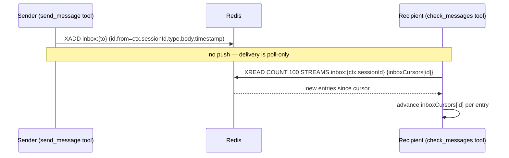
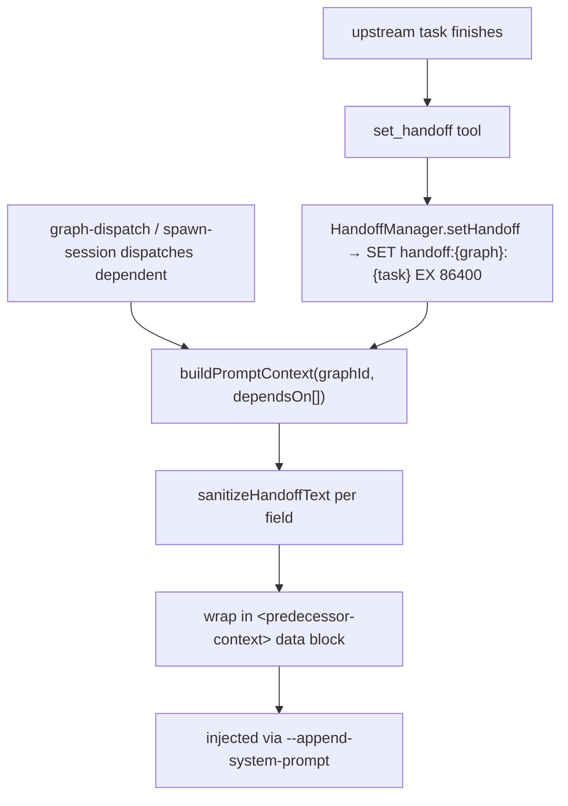
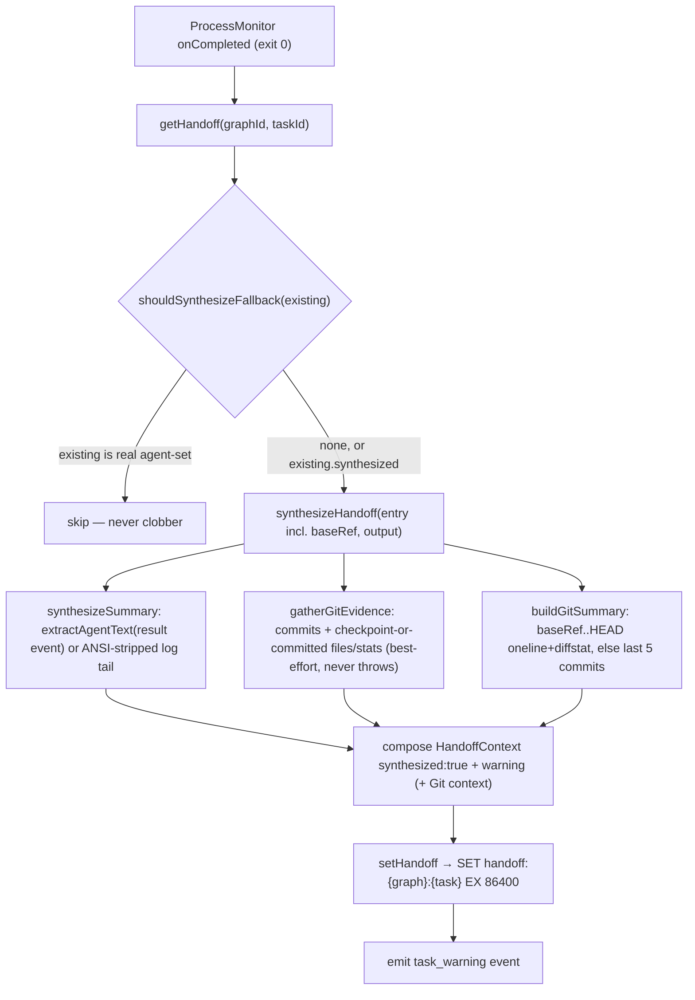

# Messaging & Handoffs

## Overview

This subsystem moves information between Claude sessions in two distinct shapes. **Messaging** is durable agent-to-agent communication over Redis streams: direct inbox messages, project-wide broadcasts, and (via `check_messages`) graph events, all consumed by polling rather than push (`src/messaging.ts:14-122`, `src/tools/check-messages.ts:27-85`). **Handoffs** are structured, durable end-of-task reports that one task leaves for its downstream dependents, persisted in Redis and injected into the successor's prompt as reference context (`src/handoff.ts:5-121`). Because handoff content authored by one agent flows into another agent's prompt, the handoff path carries a dedicated prompt-injection defense layer — sanitization plus structural framing (`src/handoff-sanitizer.ts:21-43`, `src/handoff.ts:99-121`). A third, narrower channel — the **directive store** (`src/directives.ts`) — carries engine→worker steering messages on a per-task Redis list, drained onto worker tool responses by the engine's enrichment wrapper rather than polled like the inbox (`src/directives.ts:18-72`).

## Responsibilities

- Deliver direct messages to a recipient session's inbox stream as durable Redis stream entries; recipients pick them up on their next `check_messages` poll (`src/messaging.ts:23-43`, `src/tools/send-message.ts:17`).
- Provide incremental, cursor-based reads of a *given* session's inbox so each `check_messages` returns only new entries; `checkMessages(sessionId = this.sessionId)` reads `inbox:<sessionId>` via a per-session cursor map (`inboxCursors`), so in HTTP multi-connection mode the caller reads its own inbox rather than the engine's (`src/messaging.ts:45-71`, `src/messaging.ts:15`).
- Publish and incrementally consume project broadcast streams (`src/messaging.ts:72-122`).
- Seed broadcast/event cursors to the current stream head so a freshly spawned agent never replays project history — the stdio session seeds both at startup (event cursor under key `${sessionId}:${project}`), and HTTP sessions seed their event cursor lazily on first `check_messages` (`src/messaging.ts:91-94`, `src/mcp-server.ts:256-264`, `src/tools/check-messages.ts:43-49`).
- Persist structured per-task handoff context in Redis with a 24h TTL (`src/handoff.ts:5-13`).
- Render predecessor handoffs into a single prompt-context block injected into downstream tasks at dispatch/spawn time (`src/handoff.ts:21-121`, `src/graph-dispatch.ts:153`).
- Sanitize free-text handoff fields and wrap them in a data-boundary block to mitigate prompt injection (`src/handoff-sanitizer.ts:21-43`, `src/handoff.ts:99-121`).
- Synthesize a fallback handoff when a worker completes (exit 0) without calling `set_handoff`, so dependent tasks are not left blind — inferred from the agent's log output and best-effort git state (recent task-branch commits, plus a changed-file list drawn from the auto-checkpoint diff or, when the agent committed cleanly and left no checkpoint, from the task's own commit range), flagged `synthesized`, and labelled in downstream prompt context (`src/handoff-synthesis.ts:252-285`, `src/handoff-synthesis.ts:216-246`, `src/mcp-server.ts:349-370`, `src/handoff.ts:34-37`).
- Provide the engine→worker **directive store** primitive: enqueue (`pushDirective`), atomically read-and-clear (`drainDirectives`), and O(1)-probe (`hasDirectives`) per-task steering messages on the Redis list `directive:<graphId>:<taskId>` with a 24h TTL (`src/directives.ts:23-72`).

## Key flows

### Direct message round-trip

This sequence shows a `send_message` from one agent reaching another agent's `check_messages`.

`sendMessage(toSessionId, fromSessionId, type, body)` writes the message as a single `XADD` stream entry on `inbox:{toSessionId}` and returns the message uuid — it publishes nothing and does not notify the recipient (`src/messaging.ts:23-43`, `test: tests/messaging.test.ts > "sendMessage does not publish to any notify: channel"`). The sender id is supplied by the caller; the `send_message` tool passes `ctx.sessionId` resolved per-call from the `ContextResolver`, so in HTTP multi-connection mode the `from` is the connecting worker, not the central engine's id (`src/tools/send-message.ts:28-34`, `test: tests/runtime/context-wiring.test.ts > "uses ctx.sessionId as the 'from', not getSelf()"`). Delivery is poll-only: the recipient receives the message on its next `check_messages`, as the tool description states honestly (`src/tools/send-message.ts:19`). The `send_message` tool resolves a role name to a concrete session id before calling it (`src/tools/send-message.ts:29-33`). `checkMessages(sessionId = this.sessionId)` reads from `inbox:{sessionId}` starting at the in-memory per-session cursor (`inboxCursors.get(sessionId) ?? "0-0"`), parses each flat field array, and advances that session's cursor so subsequent calls only return newer entries (`src/messaging.ts:15`, `src/messaging.ts:45-71`, `test: tests/messaging.test.ts > "should only return new messages on subsequent checks"`). The cursors live only in process memory — see Failure modes for the durability caveat.

### check_messages aggregation

`check_messages` is the single tool an agent calls to drain three sources at once: its inbox, the project broadcast stream, and the project event stream (`src/tools/check-messages.ts:27-85`). The handler resolves the caller per-call from the `ContextResolver` and updates *the caller's* peer activity via `registry.applyPeerUpdate(ctx.sessionId, { lastActivity })` (replacing the former `touchActivity()`/`register()` on the engine's own record), then reads the caller's own inbox with `messaging.checkMessages(ctx.sessionId)` — so in HTTP multi-connection mode a worker reads its own inbox and touches its own peer record, not the engine's (`src/tools/check-messages.ts:28-32`, `src/registry.ts:100-111`, `test: tests/tools/check-messages.test.ts > "reads caller's inbox and updates caller's peer record (identity divergence test)"`). Inbox and broadcasts go through the `Messaging` class; events are read inline from `events:{project}` against the `eventCursors` map, which is keyed per session+project as `${ctx.sessionId}:${project}` and lazy-seeded to the current stream head on first access for that pair, so a new session never replays event history and concurrent HTTP sessions each advance their own event cursor independently (`src/tools/check-messages.ts:37-72`, `test: tests/tools/check-messages.test.ts > "isolates event cursors per session — session A and B advance independently"`, `test: tests/tools/check-messages.test.ts > "seeds new HTTP session cursor to current stream head on first access"`). Events of type `task_progress` are filtered out before returning, to prevent sibling-agent progress updates from flooding inboxes (`src/tools/check-messages.ts:55-71`). Results from all three sources are tagged with a `channel` field and returned as one JSON array (`src/tools/check-messages.ts:74-78`).

### Handoff injection into downstream tasks

This flow shows how a completed task's handoff becomes prompt context for its dependents.

When a dependent task is dispatched and has `dependsOn` entries, `buildPromptContext` loads each predecessor's handoff, renders its fields (files changed, git stats, summary, decisions, warnings, tests, commits, exports/schema/config changes), and concatenates them under a `## Context from predecessor tasks` header (`src/handoff.ts:21-104`). Every free-text field is passed through `sanitizeHandoffText` first, and the whole block is wrapped in `<predecessor-context>` tags with an explicit notice telling the model to treat the content as reference data, not instructions (`src/handoff.ts:106-121`, `test: tests/handoff-security.test.ts > "wraps output in predecessor-context tags"`). When a predecessor handoff carries `synthesized: true`, `buildPromptContext` prepends an italic "Auto-synthesized" provenance note warning that the predecessor did not call `set_handoff` and the context is inferred and may be incomplete (`src/handoff.ts:34-37`, `test: tests/handoff-fallback-integration.test.ts > "a synthesized handoff is stored and surfaces in a dependent task's prompt context"`). The graph dispatcher calls this for each dependent task (`src/graph-dispatch.ts:153`); the `spawn_session` tool does the same when a graph-scoped session is spawned directly (`src/tools/spawn-session.ts:73-86`).

### Fallback handoff synthesis on completion without set_handoff

This flow shows what happens when a worker exits successfully but never called `set_handoff`.

In the `onCompleted` handler, after persisting the task result and broadcasting completion, the engine checks for an existing handoff and calls `shouldSynthesizeFallback(existing)`, which returns `true` when no handoff exists or when the existing one is itself `synthesized` (a stale fallback from a prior attempt a retry should refresh), and `false` for a real agent-set handoff so it is never clobbered (`src/mcp-server.ts:350-351`, `src/handoff-synthesis.ts:291-293`, `test: tests/handoff-synthesis.test.ts > "never clobbers a real (agent-set) handoff"`). When synthesis is warranted, the engine calls `synthesizeHandoff(entry, output)` where `entry` carries `taskId`, `graphId`, `cwd`, `startedAt`, and a `baseRef` sourced from the `BUREAU_GIT_BASE_REF` environment variable at the call site (`src/mcp-server.ts:353-356`, `src/handoff-synthesis.ts:252-259`). `synthesizeHandoff` builds the summary from the agent's own final text — the LAST `{"type":"result",…,"result":"…"}` event of the claude `--output-format stream-json` log via `extractAgentText` + `stripAnsi`, falling back to the ANSI-stripped log tail when no result event is present — prefixes an `[auto-synthesized…]` marker, caps at 500 chars, attaches a synthesis warning, sets `synthesized: true`, and merges best-effort git evidence (`src/handoff-synthesis.ts:66-83`, `src/handoff-synthesis.ts:252-285`, `test: tests/handoff-synthesis.test.ts > "uses the clean result prose, not the token-usage noise"`). The composer additionally runs `buildGitSummary(cwd, baseRef)` in parallel with `gatherGitEvidence`: when a `baseRef` is set it produces a compact `git[<baseRef>..HEAD]: <oneline commits>; (<diffstat tail>)` line over the task branch, otherwise it falls back to the last 5 commits (`last 5 commits` label) and the `HEAD` show-stat, capped at 400 chars and never throwing (`src/handoff-synthesis.ts:98-143`, `src/handoff-synthesis.ts:256-259`). The git summary becomes the summary body when the log was empty (`(no output captured)`) and a `baseRef`-derived summary exists; otherwise the log summary is kept and the git summary is appended as an extra `Git context: …` warning (`src/handoff-synthesis.ts:261-275`). `gatherGitEvidence` parses the auto-checkpoint sha from a leading `bureau_metadata` line and, when a `cwd` is available, reads recent commits since task start — omitting the `--since=@<epoch>` filter and taking the unfiltered last-10 commits when `startedAt` is `0` (no known start), since the `--since=@0` epoch form parses inconsistently across git versions (`src/handoff-synthesis.ts:155-162`) — plus the checkpoint commit's `--name-status` / `--numstat` to populate `commits`, `filesChanged`, and `gitStats`; every git call is wrapped so it never throws and missing fields are simply omitted (`src/handoff-synthesis.ts:9-19`, `src/handoff-synthesis.ts:147-249`, `test: tests/handoff-synthesis.test.ts > "gathers commits + checkpoint file/stat evidence from a real repo"`, `test: tests/handoff-synthesis.test.ts > "returns an empty object for a non-git cwd (best-effort, never throws)"`). When the auto-checkpoint path yields no changed files but the task made commits in its window, `gatherGitEvidence` derives the changed-file list from the task's own commit range instead — `git diff --name-status <oldest>^..HEAD`, falling back to a per-commit `git show --name-status` walk when the oldest commit is a root commit with no parent — deduping paths, capping at 50, and marking each `summary: "(from committed work)"`, so an agent that commits cleanly and exits without a checkpoint still yields a reliable file footprint (`src/handoff-synthesis.ts:216-246`, `test: tests/handoff-synthesis.test.ts > "captures files from commits made during the task (no uncommitted checkpoint)"`). The synthesized handoff is then stored via `setHandoff` and a `task_warning` event is emitted regardless of synthesis success, preserving observability of the underlying reliability gap; synthesis itself is best-effort and a failure is logged rather than propagated (`src/mcp-server.ts:349-370`, `test: tests/handoff-fallback-integration.test.ts > "a synthesized handoff is stored and surfaces in a dependent task's prompt context"`).

## Public interface

### `Messaging` class (`src/messaging.ts:14`)

The class is constructed with two args — a single command Redis client and the engine's/own session id; there is no subscriber client and no pub/sub machinery (`src/messaging.ts:18-21`, `test: tests/messaging.test.ts > "Messaging constructor accepts a single redis client (no subRedis param)"`). The constructor `sessionId` is only a *default*: read and broadcast cursors are kept in per-key maps (`inboxCursors`, `lastBroadcastIds`), and `checkMessages` takes an explicit `sessionId` so one shared `Messaging` instance serves many connected workers' inboxes in HTTP mode (`src/messaging.ts:15-16`, `src/messaging.ts:45-46`).

| Symbol | Signature | Description | Citation |
|---|---|---|---|
| `sendMessage` | `(to, from, type, body) => Promise<string>` | XADD to `inbox:{to}`; `from` is caller-supplied; returns msg uuid (publishes nothing) | `src/messaging.ts:23-43` |
| `checkMessages` | `(sessionId = this.sessionId) => Promise<PeerMessage[]>` | Cursor-incremental read of `inbox:{sessionId}` via the per-session `inboxCursors` map | `src/messaging.ts:45-71` |
| `broadcast` | `(project, from, body) => Promise<void>` | XADD an `announcement` to `broadcast:{project}` | `src/messaging.ts:72-88` |
| `initBroadcastCursor` | `(project) => Promise<void>` | Seed broadcast cursor to current stream head | `src/messaging.ts:90-93` |
| `checkBroadcasts` | `(project) => Promise<PeerMessage[]>` | Cursor-incremental read of a project broadcast stream | `src/messaging.ts:95-122` |

### `HandoffManager` class (`src/handoff.ts:7`)

| Symbol | Signature | Description | Citation |
|---|---|---|---|
| `setHandoff` | `(handoff: HandoffContext) => Promise<void>` | Persist JSON at `handoff:{graph}:{task}` with 24h TTL | `src/handoff.ts:10-13` |
| `getHandoff` | `(graphId, taskId) => Promise<HandoffContext \| null>` | Read + JSON-parse a stored handoff | `src/handoff.ts:15-19` |
| `buildPromptContext` | `(graphId, depTaskIds[]) => Promise<string>` | Render predecessor handoffs into a sanitized, framed prompt block (with an Auto-synthesized provenance note for synthesized predecessors) | `src/handoff.ts:21-121` |

### `sanitizeHandoffText` (`src/handoff-sanitizer.ts:21`)

Strips markdown headings, horizontal rules, code fences (replaced with `[code removed]`), a blocklist of instruction-override phrases (replaced with `[filtered]`), and URLs (replaced with `[url removed]`), then trims (`src/handoff-sanitizer.ts:21-43`).

### `handoff-synthesis` module (`src/handoff-synthesis.ts`)

A standalone module of mostly-pure functions composing a fallback `HandoffContext` from a completed worker's log + git state. The composer and git-evidence functions are async; the rest are pure.

| Symbol | Signature | Description | Citation |
|---|---|---|---|
| `synthesizeHandoff` | `(entry: {taskId, graphId, cwd?, startedAt, baseRef?}, output) => Promise<HandoffContext>` | Compose a complete fallback handoff (`summary`, `warnings`, `synthesized:true`, plus best-effort git evidence and a `baseRef`-aware git summary) | `src/handoff-synthesis.ts:252-285` |
| `shouldSynthesizeFallback` | `(existing: HandoffContext \| null) => boolean` | `true` iff `!existing \|\| existing.synthesized` — never clobbers a real handoff | `src/handoff-synthesis.ts:291-293` |
| `synthesizeSummary` | `(output) => string` | Marker-prefixed, 500-char-capped summary from agent result text or ANSI-stripped tail | `src/handoff-synthesis.ts:66-83` |
| `buildGitSummary` | `(cwd, baseRef) => Promise<string>` | Compact task-branch summary: `baseRef..HEAD` oneline + diffstat, else last-5-commits fallback; 400-char-capped, never throws | `src/handoff-synthesis.ts:98-143` |
| `extractAgentText` | `(output) => string \| undefined` | LAST claude stream-json `result` event's `result` field (ANSI-stripped) | `src/handoff-synthesis.ts:37-59` |
| `parseCheckpointSha` | `(output) => string \| undefined` | Sha from the leading `bureau_metadata` `auto_checkpoint` line | `src/handoff-synthesis.ts:9-19` |
| `gatherGitEvidence` | `(cwd, startedAt, checkpointSha) => Promise<Pick<HandoffContext, "filesChanged"\|"gitStats"\|"commits">>` | Best-effort recent-commits + checkpoint file/stat evidence, with a committed-range (`<oldest>^..HEAD`) changed-file fallback when no checkpoint files exist; never throws | `src/handoff-synthesis.ts:147-249`, `src/handoff-synthesis.ts:216-246` |

### `directives` module (`src/directives.ts`)

A standalone Redis-list directive store — the engine→worker steering primitive of the Context pipe. Directives are queued per running task under the key `directive:<graphId>:<taskId>` (a Redis list) and consumed out-of-band of the inbox-stream messaging path; each record is `{id, author, message, ts, provenance:{subject, graphId, taskId}}` (`src/directives.ts:4-20`).

| Symbol | Signature | Description | Citation |
|---|---|---|---|
| `pushDirective` | `(redis, graphId, taskId, record) => Promise<string>` | `RPUSH` a JSON directive to `directive:{graph}:{task}` and set a 24h `EXPIRE`; generates a uuid `id` when none supplied; returns the id | `src/directives.ts:23-41` |
| `drainDirectives` | `(redis, graphId, taskId) => Promise<DirectiveRecord[]>` | Read-and-clear: `LRANGE 0 -1` then `DEL` the key, JSON-parsing each entry and skipping malformed ones | `src/directives.ts:44-62` |
| `hasDirectives` | `(redis, graphId, taskId) => Promise<boolean>` | O(1) `EXISTS` gate used to avoid the drain round-trip when nothing is pending | `src/directives.ts:65-72` |

The store is the wire primitive only; it does not itself surface directives to a worker. Producers `pushDirective`: the operator-only `inject_context` tool (author derived from the caller's `ConnectionContext`, with a 4096-char cap and a secret-pattern reject) and the health-sweep interrogation watcher (author `engine-interrogator`, pushing a `recommendedHint` on the first confident-stuck verdict before escalating to a kill) (`src/tools/inject-context.ts:73-91`, `src/health-sweep.ts:187-199`). The consumer is the engine's per-tool **enrichment wrapper** in `mcp-server.ts`, which on every bureau tool response runs the `hasDirectives` EXISTS gate and, when set, `drainDirectives` and prepends each as a high-salience `⚠️ ENGINE DIRECTIVE` line above the workspace/inbox content — making `heartbeat` (a cheap once-per-turn call) the guaranteed delivery point for cooperative workers (`src/mcp-server.ts:721-765`, `src/tools/heartbeat.ts:13-38`). The enrichment wrapper itself is documented in [MCP Server Core & Tool Surface](MCP%20Server%20Core%20%26%20Tool%20Surface.md); this note covers only the store primitive it drains.

### MCP tools

| Tool | Backing call | Citation |
|---|---|---|
| `send_message` | `messaging.sendMessage` with `from = ctx.sessionId` (after role→id resolution) | `src/tools/send-message.ts:26-37` |
| `broadcast` | `messaging.broadcast` with sender `ctx.sessionId` (defaults channel to `global`) | `src/tools/broadcast.ts:22-29` |
| `check_messages` | `applyPeerUpdate(ctx.sessionId)` + `checkMessages(ctx.sessionId)` + `checkBroadcasts` + per-session event read | `src/tools/check-messages.ts:27-85` |
| `set_handoff` | `handoffManager.setHandoff` (graphId/taskId from `ctx`/peer data). Free-text fields are Zod-validated only against a generous 4000-char `SAFETY_MAX_CHARS` hard bound; the handler then runs `applyTruncation` to shorten each field to its documented soft cap and appends a `truncated: [...]` note rather than hard-rejecting an over-cap call. The `synthesized` provenance flag is system-set only and is NOT part of `handoffInputSchema` — an agent cannot forge it | `src/tools/set-handoff.ts:254-297`, `src/tools/set-handoff.ts:66-110`, `src/tools/set-handoff.ts:114-249`, `src/types/handoff.ts:16-19` |
| `get_handoff` | `handoffManager.getHandoff` | `src/tools/get-handoff.ts:20-27` |

All four messaging/handoff tool registrations pass their per-call `getContext` resolver as a trailing argument to `registerInstrumentedTool`, so the caller's identity — resolved once from the `ConnectionContext` — is attached to each tool-call OTel span as `bureau.graph.id` / `bureau.task.id` / `bureau.role` and fed to the lifecycle-absence anomaly detector; this is span/telemetry enrichment only and does not alter the message/handoff payloads or the caller-identity resolution the handlers already perform (`src/tools/send-message.ts:39`, `src/tools/broadcast.ts:30`, `src/tools/check-messages.ts:85`, `src/tools/set-handoff.ts:299`, `src/telemetry/instrumentation/mcp-register.ts:64-212`).

## Dependencies

- **[Redis & Connection Layer](Redis%20%26%20Connection%20Layer.md)** — all state is Redis streams (`inbox:*`, `broadcast:*`) and keys (`handoff:*`); the class uses the stream helpers `parseStreamMessages` and `getStreamLatestId` (`src/messaging.ts:3`, `src/redis.ts:230-234`, `src/redis.ts:236-242`). It holds a single command Redis client, passed in at construction (`src/messaging.ts:18-21`, `src/mcp-server.ts:252`); there is no dedicated subscriber connection — the former `subRedis` pub/sub client was removed along with the nudge.
- **[Task Graph Engine](Task%20Graph%20Engine.md)** — handoffs are keyed by `graphId:taskId`; `buildPromptContext` is driven by a task's `dependsOn` list at dispatch (`src/handoff.ts:10`, `src/graph-dispatch.ts:153`). The directive store is likewise keyed `directive:<graphId>:<taskId>`, and the enrichment wrapper only drains it when `ctx.graphId` and `ctx.taskId` are both set (`src/directives.ts:18-20`, `src/mcp-server.ts:723-727`).
- **[MCP Server Core & Tool Surface](MCP%20Server%20Core%20%26%20Tool%20Surface.md)** — the per-tool enrichment wrapper is the sole consumer of the directive store; it runs `hasDirectives`/`drainDirectives` on every bureau tool response and surfaces directives at high salience above inbox messages (`src/mcp-server.ts:721-765`). The `inject_context` (operator) and `heartbeat` tools, plus the [health-sweep](Task%20Graph%20Engine.md) interrogation watcher, are the directive producers/delivery points (`src/tools/inject-context.ts:80-85`, `src/tools/heartbeat.ts:19`, `src/health-sweep.ts:187-199`). The messaging/handoff tools also share that note's telemetry seam, `registerInstrumentedTool`, which they now feed `getContext` for caller-identity span attributes (`src/telemetry/instrumentation/mcp-register.ts:64-212`).
- **[Spawn & PTY](Spawn%20%26%20PTY.md)** — the rendered handoff block is built from the dependent task's `dependsOn` predecessors and threaded into the spawn call, which injects it into the spawned agent via `--append-system-prompt` (`src/tools/spawn-session.ts:73-86`, `src/tools/spawn-session.ts:98`).
- **[Workspace Awareness & Locks](Workspace%20Awareness%20%26%20Locks.md)** — the peer registry resolves role names to session ids for `send_message` (`src/tools/send-message.ts:30-33`); the sender id no longer comes from `registry.getSelf()` but from the per-call `ConnectionContext` (`ctx.sessionId`), so the message `from` is the caller, not the engine (`src/tools/send-message.ts:34`, `src/tools/broadcast.ts:23-25`). `check_messages` writes the caller's peer activity through `registry.applyPeerUpdate(ctx.sessionId, ...)` (`src/tools/check-messages.ts:30`, `src/registry.ts:100-111`).
- The graph-dispatch completion/failure handlers and the retro-handler use `broadcast` to announce graph outcomes and retro reports (`src/graph-dispatch.ts:725-790`).

## Configuration

| Key | Type | Default | Effect | Citation |
|---|---|---|---|---|
| Handoff `TTL` | const seconds | `86400` (24h) | Expiry on every `handoff:{graph}:{task}` key | `src/handoff.ts:5`, `src/handoff.ts:12` |
| Directive `TTL` | const seconds | `86400` (24h) | `EXPIRE` reset on every `pushDirective` to `directive:{graph}:{task}` | `src/directives.ts:39` |
| `BUREAU_GIT_BASE_REF` | env var | unset | Base ref the synthesized-fallback `buildGitSummary` diffs the task branch against (`<baseRef>..HEAD`); falls back to last-5-commits when unset | `src/mcp-server.ts:354`, `src/handoff-synthesis.ts:108-119` |
| `inject_context` message cap | const | `4096` bytes | Max directive message length; over-cap and secret-pattern messages are rejected | `src/tools/inject-context.ts:9`, `src/tools/inject-context.ts:49-71` |
| `checkMessages` / `checkBroadcasts` read count | const | `COUNT 100` | Max entries returned per drain per stream | `src/messaging.ts:46-50`, `src/messaging.ts:98-102` |
| `set_handoff` field hard bound | const `SAFETY_MAX_CHARS` | `4000` chars | Zod-schema hard reject only above this per free-text field — a generous safety bound against pathological input, not the working limit | `src/tools/set-handoff.ts:34`, `src/tools/set-handoff.ts:66-110` |
| `set_handoff` field soft caps | const `SOFT_CAP` map | summary 800, warning 500, decisionWhat 500, decisionWhy 800, commitMessage 300, etc. | Documented per-field target lengths; the handler auto-truncates to these with a `…[truncated]` marker instead of rejecting, so a model that overshoots does not waste a turn | `src/tools/set-handoff.ts:14-34`, `src/tools/set-handoff.ts:114-249` |

The broadcast/inbox stream key names are derived, not configured: `inbox:{sessionId}` and `broadcast:{project}` (`src/messaging.ts:6-12`).

## Failure modes

- **Cursor durability** — the `inboxCursors`, `lastBroadcastIds`, and `eventCursors` maps live in process memory; on MCP-server restart, inbox reads resume from `"0-0"` (re-reading the whole inbox), while the stdio session's broadcast/event cursors are re-seeded to the stream head at startup (event cursor under the per-session key `${sessionId}:${project}`), intentionally skipping anything sent while down; HTTP sessions seed their event cursor lazily on first `check_messages` (`src/messaging.ts:15-16`, `src/mcp-server.ts:256-264`, `src/tools/check-messages.ts:43-49`).
- **HTTP multi-connection cursor sharing (partial Phase-1 limitation)** — directed inbox reads are per-session (`inboxCursors` keyed by sessionId), and the event-stream cursor is now also per-session: `eventCursors` is keyed `${ctx.sessionId}:${project}` so concurrent HTTP sessions advance their own event cursor independently (`src/tools/check-messages.ts:42-49`, `test: tests/tools/check-messages.test.ts > "isolates event cursors per session — session A and B advance independently"`). The remaining shared cursor is the **project broadcast cursor** (`lastBroadcastIds`), which is still engine-scoped/per-process inside the `Messaging` instance; in HTTP mode multiple workers in the same project share one broadcast read position and can consume each other's broadcasts (`src/messaging.ts:16`, `src/messaging.ts:95-122`). The `inboxCursors` and `eventCursors` maps are also unpruned (grow per session). These are documented Phase-1 follow-ups; the event-cursor follow-up is resolved, the broadcast-cursor one remains. In stdio/single-agent mode there is exactly one session, so the sharing is moot.
- **Delivery is poll-only by design** — there is no push path; an agent discovers inbox messages only when it next calls `check_messages`. `sendMessage` neither publishes nor notifies (`src/messaging.ts:23-43`, `test: tests/messaging.test.ts > "sendMessage does not publish to any notify: channel"`). The earlier half-wired `notify:{session}` pub/sub nudge (an unwired `onNotify` callback that was permanently `null`) was removed entirely rather than completed, settling durable-stream + polling as the intended design.
- **Missing handoff** — `getHandoff` returns `null` for an absent/expired key; `buildPromptContext` silently skips predecessors with no handoff and returns `""` if none resolve (`src/handoff.ts:15-19`, `src/handoff.ts:28`, `src/handoff.ts:102`). `set_handoff` falls back to `ctx.graphId`/`ctx.taskId` from the `ConnectionContext` when the args omit them, then reads the authoritative `graphId` from peer data (`peers:{ctx.sessionId}`) when not explicitly supplied, so a handoff still records under the correct graph after a `merge_graphs` re-points the running task (`src/tools/set-handoff.ts:270-283`).
- **Stream drain cap** — each `check_messages` returns at most 100 entries per stream; a backlog larger than 100 requires repeated calls to fully drain (`src/messaging.ts:47`, `src/messaging.ts:99`).
- **Fallback handoff is best-effort and lossy** — when synthesis runs, the summary is *inferred* from log output (agent result text or the ANSI-stripped tail) and may be incomplete or empty (`(no output captured)`); git evidence is omitted entirely when the task has no `cwd`, is not a git repo, or git commands fail, since both `gatherGitEvidence` and `buildGitSummary` run every git call through a swallow-and-return-null `tryGit` wrapper (`src/handoff-synthesis.ts:66-83`, `src/handoff-synthesis.ts:85-91`, `src/handoff-synthesis.ts:147-249`, `test: tests/handoff-synthesis.test.ts > "handles empty / whitespace-only output"`). Synthesis failure does not block completion — it is caught and logged, and the `task_warning` event still fires so the underlying reliability gap (agent skipped `set_handoff`) stays observable (`src/mcp-server.ts:349-370`). The downstream provenance note flags the inferred content to the successor agent (`src/handoff.ts:34-37`).
- **Sanitizer is best-effort** — the sanitizer is regex blocklist-based and explicitly documented as one layer of defense-in-depth that adaptive attackers can bypass; structural framing and schema validation are the primary defenses (`src/handoff-sanitizer.ts:1-9`).
- **Over-long handoff fields are silently shortened, not rejected** — the schema's per-field hard cap is a 4000-char safety bound and the handler auto-truncates each free-text field down to its documented soft cap (`applyTruncation`), replacing the tail with `…[truncated]` and listing the shortened field paths in the tool response; only input beyond 4000 chars per field is still hard-rejected by Zod. This trades completeness for turn-efficiency — a model that overshoots keeps its call instead of being bounced, but the truncated content is lost to the successor (`src/tools/set-handoff.ts:114-249`, `src/tools/set-handoff.ts:287-297`, `test: tests/tools/set-handoff-resilience.test.ts > "truncates an over-cap summary with a marker and reports it"`, `test: tests/tools/set-handoff-schema.test.ts > "rejects a 4001-character summary (safety bound)"`).

## History & decisions

- **Caller-identity seam** — to support the central HTTP multi-connection engine (where `registry.getSelf()` is the *engine's* id, not the caller's), the messaging tools were re-plumbed to resolve the caller per-call from a `ConnectionContext` via a `ContextResolver`. `send_message`/`broadcast` now use `ctx.sessionId` as the message `from` instead of `getSelf().id` (`src/tools/send-message.ts:34`, `src/tools/broadcast.ts:25`); `check_messages` reads the caller's own inbox via `checkMessages(ctx.sessionId)` and touches the caller's peer record via `applyPeerUpdate(ctx.sessionId, ...)` rather than the engine's, backed by the per-session `inboxCursors` map that replaced the single `lastInboxId` (`src/messaging.ts:15`, `src/messaging.ts:45-71`, `src/tools/check-messages.ts:28-32`); `set_handoff` now sources `graphId`/`taskId` from `ctx` (`src/tools/set-handoff.ts:270-283`). In stdio mode a single env-seeded `ConnectionContext` makes `ctx.sessionId === getSelf().id`, so behaviour is unchanged (`src/runtime/connection-context.ts:25-44`). The event-stream cursor was subsequently made per-session as well (see next entry); only the project broadcast cursor remains engine-scoped — a documented Phase-1 limitation (see Failure modes).
- **Per-session event cursors** — the `check_messages` event-stream cursor was keyed only by `project`, so concurrent HTTP sessions in the same project shared one event read position and could consume each other's events. It was re-keyed to `${ctx.sessionId}:${project}` with lazy per-session seeding to the current stream head on first access, and the stdio startup seeding in `mcp-server.ts` was updated to the same key format; the same change also made `await_graph_event` reactive over HTTP. Stdio behaviour is unchanged (single sessionId → single cursor per project) (`src/tools/check-messages.ts:42-49`, `src/mcp-server.ts:256-264`). The broadcast cursor was not changed and remains the one engine-scoped shared cursor.
- The `Messaging` class was introduced as Redis-streams inbox + broadcast with pub/sub nudges and cursor-based incremental reads.
- **Notify nudge removed** — the `notify:{session}` pub/sub nudge was never wired to a consumer (`onNotify` had zero callers), so it was deleted in full: `sendMessage`'s publish, the `startListening`/`stopListening`/`onNotify` methods, the `subRedis` constructor param, and the dedicated `subRedis` connection in `mcp-server.ts` (creation, boot subscribe, shutdown quit). Durable stream + `check_messages` polling is the settled design, and the `send_message` tool description was made honest ("they receive it on their next check_messages").
- **Broadcast/event cursor seeding** — newly spawned agents were reading 50–60 accumulated stream messages on their first `check_messages` call, wasting context tokens; cursors are now seeded to the latest stream id at startup so agents only see post-spawn traffic (`test: tests/cursor-init.test.ts > "after initBroadcastCursor, checkBroadcasts only returns new messages"`).
- **task_progress exclusion** — sibling-task progress events were flooding inboxes; `check_messages` now drops `task_progress` from the event stream output.
- **Fallback handoff synthesis** — agents completing without calling `set_handoff` previously left dependent tasks blind, surfaced only as a `task_warning`. A synthesis path was added in three steps: the `synthesized` provenance flag + `buildPromptContext` rendering, the `handoff-synthesis` module producing a marker summary + best-effort git evidence, and the `onCompleted` wiring that stores the fallback while preserving the `task_warning`. A hardening follow-up from HTTP validation improved summary quality (extract the agent's actual `result` text from the claude stream-json log instead of the raw token-usage tail) and made `onCompleted` re-synthesize a stale prior synthesized fallback on retry while never clobbering a real handoff (`src/handoff-synthesis.ts:37-83`, `src/handoff-synthesis.ts:291-293`). A later enrichment added the `buildGitSummary` task-branch history pass and threaded a `baseRef` (from `BUREAU_GIT_BASE_REF`) through `synthesizeHandoff`, so a synthesized fallback now also carries `git[<baseRef>..HEAD]` commit + diffstat context — and uses it as the summary body when the agent log was empty (`src/handoff-synthesis.ts:98-143`, `src/handoff-synthesis.ts:252-285`, `src/mcp-server.ts:353-356`).
- **`gatherGitEvidence` `--since=@0` fix** — for a task with no known start time (`startedAt` `0`), the synthesized-fallback commit gather previously always emitted `git log --since=@<epoch>`; with `startedAt=0` the resulting `--since=@0` form parses inconsistently across git versions and returned zero commits on some git builds, leaving `result.commits` unset. The fix appends the `--since=@<epoch>` arg only when `sinceSec > 0` and otherwise gathers the unfiltered last-10 commits; runs with a real `startedAt` are unchanged (`src/handoff-synthesis.ts:155-162`, `test: tests/handoff-synthesis.test.ts > "gathers commits + checkpoint file/stat evidence from a real repo"`).
- **Committed-work file footprint** — `gatherGitEvidence` populated `filesChanged` only from the auto-checkpoint commit (the uncommitted delta), so an agent that committed its work cleanly and exited — leaving no uncommitted delta to checkpoint — produced a synthesized handoff with an empty file list, degrading the downstream footprint feed. A committed-range fallback was added: when the checkpoint path yields no files but the task made commits, changed files are derived from `git diff --name-status <oldest>^..HEAD` (with a per-commit `git show --name-status` walk when the oldest commit is a root commit with no parent), deduped and capped at 50, each tagged `(from committed work)` (`src/handoff-synthesis.ts:216-246`, `test: tests/handoff-synthesis.test.ts > "captures files from commits made during the task (no uncommitted checkpoint)"`).
- **Caller identity on tool spans** — the messaging/handoff tool registrations were updated to thread their per-call `getContext` resolver into `registerInstrumentedTool`, so each tool-call span now carries the caller's `bureau.graph.id` / `bureau.task.id` / `bureau.role` and the lifecycle-absence anomaly detector is fed on every call; the tool handlers' own caller-identity resolution was already in place and is unchanged (`src/tools/send-message.ts:39`, `src/tools/check-messages.ts:85`, `src/telemetry/instrumentation/mcp-register.ts:64-212`).
- **Handoff prompt-injection defense** — because handoff fields authored by one agent are injected into a successor's system prompt, a three-layer mitigation was added: per-field `sanitizeHandoffText`, structural `<predecessor-context>` framing in `buildPromptContext`, and `set_handoff` Zod length/format limits.
- **Graph-merge tolerance** — `set_handoff` was made to read the authoritative `graphId` from peer data (`peers:{sessionId}`) before storing, so a task re-pointed to a different graph by `merge_graphs` still records its handoff under the target graph.
- `set_handoff` schema fields were made optional so an agent that provides only a summary still records a handoff rather than failing validation.
- **Auto-truncate over-cap handoff text instead of hard-rejecting** — models cannot self-count characters, so the previous tight per-field Zod hard caps (summary ≤500, warnings ≤300×10, etc.) turned an over-long field into a wasted turn: the whole `set_handoff` call was rejected and the agent had to retry. The schema hard caps were raised to a uniform generous `SAFETY_MAX_CHARS` (4000) safety bound and a new `applyTruncation` handler pass shortens each free-text field down to a documented `SOFT_CAP` (summary 800, warning 500, decision fields 500/800, commit message 300, findings prose, schema/config changes, test failures, etc.), replacing the tail with `…[truncated]` and reporting the shortened field paths in the tool response. The tool description was also updated to tell agents free text is auto-truncated (write naturally) and to avoid embedding code/diffs/heavy escaping — an investigation established that the client-side `{"__unparsedToolInput":…}` wrapper for malformed tool-call JSON never reaches this handler (the MCP transport rejects non-JSON before a `CallToolRequest` exists), so discouraging the inputs that make models emit bad JSON is the only server-side mitigation (`src/tools/set-handoff.ts:114-249`, `test: tests/tools/set-handoff-resilience.test.ts > "applyTruncation is a pure function reporting exactly the fields it shortened"`, `test: tests/tools/set-handoff-schema.test.ts > "accepts a 501-character summary (soft cap no longer a hard reject)"`).

## Open questions

- **Home for the directive/Context-pipe primitive.** The Context pipe spans three subsystems: the store primitive (`src/directives.ts`, documented here), the per-tool enrichment-wrapper delivery (documented in [MCP Server Core & Tool Surface](MCP%20Server%20Core%20%26%20Tool%20Surface.md)), and the interrogation-watcher producer in health-sweep. A dedicated `Context Pipe & Directives` note may be a better long-term home that pulls these together; for now the primitive is documented in this Messaging note.
- `broadcast` writes stream entries with `type: "announcement"`, a value outside the `PeerMessage["type"]` union; `checkBroadcasts` then casts it back to that union (`src/messaging.ts:84`, `src/messaging.ts:114`, `src/types/peer.ts:28`). This is a type-soundness smell but has no observed runtime effect (body/from are what consumers read).

## Related

- [MCP Server Core & Tool Surface](MCP%20Server%20Core%20%26%20Tool%20Surface.md)
- [Redis & Connection Layer](Redis%20%26%20Connection%20Layer.md)
- [Task Graph Engine](Task%20Graph%20Engine.md)
- [Spawn & PTY](Spawn%20%26%20PTY.md)
- [Workspace Awareness & Locks](Workspace%20Awareness%20%26%20Locks.md)
