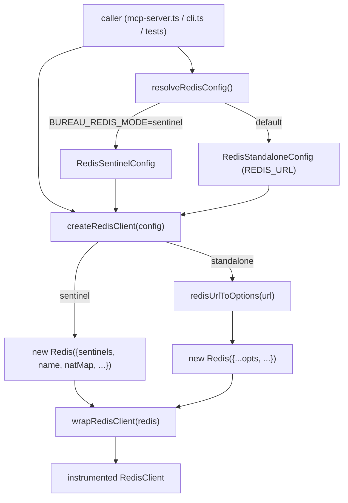
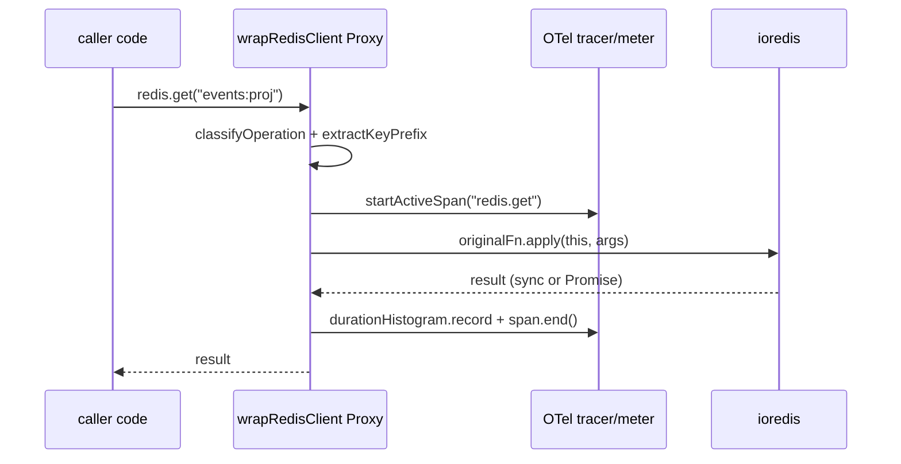

# Redis & Connection Layer

## Overview

The Redis & Connection Layer is the single factory through which every Bureau process obtains its Redis connection. It centralizes connection configuration (standalone URL or Sentinel failover), retry behavior, OpenTelemetry instrumentation, and a handful of keyspace helper utilities used across the codebase (`src/redis.ts:21-108`). All shared Bureau state — peer registry, task graphs, messaging streams, handoffs, locks, telemetry — flows through clients minted here, so this layer is the chokepoint for connection policy and observability. A sibling concern, the prompt-prefix fingerprint, lives in `src/prefix-hash.ts` and feeds cache-consistency diagnostics rather than connection management (`src/prefix-hash.ts:26-35`).

## Responsibilities

- Resolve connection configuration from environment variables into a typed `RedisConfig` discriminated union, including an optional `natMap` parsed from `BUREAU_REDIS_NAT_MAP` in sentinel mode (`src/redis.ts:21-57`).
- Construct `ioredis` clients for either standalone or Sentinel mode, applying a shared retry strategy and request-retry cap; in standalone mode the `redis://` URL is first converted to an ioredis connection options object via `redisUrlToOptions()` rather than passed as a raw URL string (`src/redis.ts:180-208`, `src/redis.ts:164-178`).
- Wrap every constructed client with OpenTelemetry span + metric instrumentation before returning it (`src/redis.ts:207`, `src/telemetry/instrumentation/redis.ts:138-305`).
- Provide a non-blocking SCAN-based key enumerator (`scanKeys`) as a safe replacement for `KEYS` (`src/redis.ts:214-223`).
- Provide stream helpers: read the latest stream id for cursor seeding (`getStreamLatestId`) and parse flat XREAD field arrays into objects (`parseStreamMessages`) (`src/redis.ts:230-234`, `src/redis.ts:236-242`).
- Compute a stable SHA-256 fingerprint of the bureau-controlled prompt prefix (role definition + sorted MCP tool names + CLAUDE.md + resolved toolchain) for cache-consistency telemetry; the toolchain is folded into the canonical JSON so a node-coder and a python-coder sharing one role core no longer collide on a single prefix hash (`src/prefix-hash.ts:6-13`, `src/prefix-hash.ts:26-35`). The cache anomaly detector's ring buffer and cooldown keys are correspondingly scoped to `(role, model, toolchain)` — the ring key changed from `bureau:cache-anomaly:${role}:${model}` to `bureau:cache-anomaly:${role}:${model}:${toolchain}` — so that a mixed-language graph does not trip a false-positive `cache.prefix_instability` anomaly (`src/telemetry/domain/anomaly.ts:89`, `src/telemetry/domain/anomaly.ts:122-129`, `test: src/__tests__/prefix-hash-fidelity.test.ts > "STILL fires when one toolchain shows ≥3 distinct prefix hashes (control)"`, `test: src/__tests__/prefix-hash-fidelity.test.ts > "does NOT fire when the 3 distinct hashes come purely from different toolchains"`). Toolchain inclusion in the hash itself is locked by two determinism tests (`test: src/__tests__/prefix-hash-fidelity.test.ts > "differs for node vs python with the same role core"`, `test: src/__tests__/prefix-hash-fidelity.test.ts > "is identical for two calls with the same role + toolchain"`).

## Key flows

### Client construction

This diagram shows how a caller obtains a fully instrumented Redis client from configuration resolution through to the OTel wrapper.

`resolveRedisConfig()` reads `BUREAU_REDIS_MODE`; when it equals `"sentinel"` it parses `BUREAU_REDIS_SENTINELS` (comma-separated `host:port`, split on the last colon to tolerate IPv6-style hosts) and defaults the master name to `bureau-master` (`src/redis.ts:25-39`). In sentinel mode it additionally parses `BUREAU_REDIS_NAT_MAP` via the `parseNatMap()` helper and includes the resulting `natMap` only when the var is present (`src/redis.ts:44`, `src/redis.ts:46-52`). Otherwise it returns a standalone config from `REDIS_URL`, defaulting to `redis://localhost:6379` (`src/redis.ts:55-56`). `createRedisClient()` also accepts a bare string URL, in which case it is treated as standalone — a backward-compatibility path used by every test file (`src/redis.ts:181-184`). In standalone mode the `redis://` URL is converted to an ioredis connection options object by `redisUrlToOptions()` and spread into the constructor options, rather than passed to ioredis as a raw URL string (`src/redis.ts:200-205`, `src/redis.ts:164-178`). `redisUrlToOptions()` uses the WHATWG `URL` parser to extract host (default `localhost`), port (default `6379`), an optional numeric `db` from the path segment, URL-decoded `username`/`password`, and sets an empty `tls` object when the scheme is `rediss:` (`src/redis.ts:164-178`). Both branches apply `maxRetriesPerRequest: 3`, `lazyConnect: false`, and a capped linear `retryStrategy` of `min(times * 200, 5000)` ms (`src/redis.ts:185`, `src/redis.ts:194-197`, `src/redis.ts:202-205`). In sentinel mode the resolved `natMap` is forwarded straight to ioredis (`src/redis.ts:193`). The constructed client is always passed through `wrapRedisClient()` before being returned (`src/redis.ts:207`).

### Command instrumentation (Proxy seam)

This diagram shows how each Redis command issued on a wrapped client emits a span and metrics.

`wrapRedisClient()` returns the client untouched when OTel is disabled (`getMeter()` or `getTracer()` returns `null`), making instrumentation zero-cost when telemetry is off (`src/telemetry/instrumentation/redis.ts:139-144`, `test: tests/telemetry/instrumentation/redis.test.ts > "wrapRedisClient — disabled path"`). When enabled, it returns a `Proxy` whose `get` trap wraps each function property: `pipeline`/`multi` get a pipeline factory wrapper, everything else gets a per-command wrapper (`src/telemetry/instrumentation/redis.ts:291-304`). Each command span carries `db.system=redis`, the command name, a bureau-semantic operation label, and a first-colon-segment `key_prefix` (never the full key, for cardinality/PII safety) (`src/telemetry/instrumentation/redis.ts:103-107`, `src/telemetry/instrumentation/redis.ts:163-172`). Pipelines emit a single `redis.pipeline` span on the terminal `exec()` carrying `bureau.redis.batch_size`; individual queued commands are counted but not individually spanned (`src/telemetry/instrumentation/redis.ts:213-289`).

### Stream cursor seeding

On startup, when a session has a project, the server seeds its event and broadcast cursors to the current stream head so a newly spawned agent only sees messages added after it starts, not the entire project history (`src/mcp-server.ts:206-218`). The cursor value comes from `getStreamLatestId(redis, "events:<project>")`, which returns `"0-0"` for an empty or absent stream (`src/redis.ts:230-234`).

## Public interface

| Symbol | Signature | Description | Citation |
|---|---|---|---|
| `resolveRedisConfig` | `() => RedisConfig` | Build standalone/sentinel config from env vars (incl. `natMap` from `BUREAU_REDIS_NAT_MAP`) | `src/redis.ts:21-57` |
| `createRedisClient` | `(config?: RedisConfig \| string) => RedisClient` | Construct + instrument an ioredis client | `src/redis.ts:180-208` |
| `redisUrlToOptions` | `(urlStr: string) => RedisOptions` | Convert a `redis://`/`rediss://` URL to ioredis connection options via WHATWG `URL` (host/port/db/username/password/tls); avoids ioredis's legacy `url.parse()` DEP0169 warning (module-internal; not exported) | `src/redis.ts:164-178` |
| `scanKeys` | `(redis, pattern) => Promise<string[]>` | Non-blocking SCAN enumeration of matching keys | `src/redis.ts:214-223` |
| `getStreamLatestId` | `(redis, streamKey) => Promise<string>` | Latest stream id, `"0-0"` if empty | `src/redis.ts:230-234` |
| `parseStreamMessages` | `(fields: string[]) => Record<string,string>` | Pair flat XREAD field array into an object | `src/redis.ts:236-242` |
| `parseNatMap` | `(raw: string \| undefined) => Record<string,{host;port}> \| undefined` | Parse `BUREAU_REDIS_NAT_MAP` into the ioredis natMap shape with fail-fast validation (module-internal; not exported) | `src/redis.ts:83-159` |
| `wrapRedisClient` | `<T>(client: T) => T` | Proxy a client with span+metric instrumentation | `src/telemetry/instrumentation/redis.ts:138-305` |
| `computePrefixHash` | `(inputs: PrefixHashInputs) => string` | Stable SHA-256 of the prompt-prefix inputs (role definition, sorted MCP tool names, CLAUDE.md, `toolchain`) | `src/prefix-hash.ts:26-35` |
| `loadPrefixHashInputs` | `(roleDefinition, cwd, configCwd?, toolchain="node") => PrefixHashInputs` | Gather prefix-hash inputs at dispatch time; `toolchain` defaults to `"node"` when unresolved | `src/prefix-hash.ts:45-73` |

`RedisClient` is a type alias for `ioredis`'s `Redis` (`src/redis.ts:4`). `RedisConfig` is the discriminated union of `RedisStandaloneConfig` (`mode: "standalone"`, `url`) and `RedisSentinelConfig` (`mode: "sentinel"`, `sentinels`, `masterName`, optional `password`, optional `natMap`) (`src/redis.ts:6-19`). The `natMap` is populated from `BUREAU_REDIS_NAT_MAP` by `resolveRedisConfig()` in sentinel mode (`src/redis.ts:44`).

## Dependencies

- **`ioredis`** — the underlying Redis driver (`src/redis.ts:1`).
- **Telemetry core** — `wrapRedisClient` imports `getMeter`/`getTracer` from `telemetry/core` and `METRIC`/`ATTR` from `telemetry/schema`; instrumentation is a no-op until telemetry is initialized (`src/telemetry/instrumentation/redis.ts:10-11`, `src/telemetry/instrumentation/redis.ts:139-144`). See [Telemetry Stack Runbook](../Operations/Telemetry%20Stack%20Runbook.md).
- **`mcp-config`** — `loadPrefixHashInputs` calls `readUserMcpServers` to enumerate configured MCP servers for the hash (`src/prefix-hash.ts:4`, `src/prefix-hash.ts:48-55`). See [MCP Server Core & Tool Surface](MCP%20Server%20Core%20%26%20Tool%20Surface.md).
- **Consumers**: [MCP Server Core & Tool Surface](MCP%20Server%20Core%20%26%20Tool%20Surface.md) constructs one long-lived module-level client at startup — the command client (`src/mcp-server.ts:174`). The blocking path for `await_graph_event`'s `XREADGROUP ... BLOCK` consumer is a per-call factory `createBlockingRedis = () => createRedisClient(redisConfig)` (`src/mcp-server.ts:228-231`), wired into `registerAwaitGraphEvent` so each call gets its own connection and concurrent blocking reads never starve the command client (`src/mcp-server.ts:752`, `src/tools/await-graph-event.ts:128`, `src/tools/await-graph-event.ts:213-222`, `src/mcp-server.ts:1220-1221`). A separate events-bridge client is created during post-handshake telemetry init: `startEventsBridge` is passed a `getRedis: async () => createRedisClient(redisConfig)` factory (`src/mcp-server.ts:977-981`) which it invokes unconditionally to obtain its own consumer connection (`src/telemetry/events-bridge.ts:51`). A pub/sub subscriber (`subRedis`) was removed when the unwired `notify:` nudge was deleted in favour of stream-plus-polling delivery. [Self-Improvement Loop](Self-Improvement%20Loop.md) consumes the prefix hash through `graph-dispatch`, which resolves the per-task toolchain first and then passes it into `loadPrefixHashInputs` so the fingerprint reflects the toolchain the agent will actually run (`src/graph-dispatch.ts:360-373`).

## Configuration
| Env var | Type | Default | Effect | Citation |
|---|---|---|---|---|
| `BUREAU_REDIS_MODE` | string | unset (standalone) | `"sentinel"` selects Sentinel mode | `src/redis.ts:22`, `src/redis.ts:25` |
| `BUREAU_REDIS_SENTINELS` | string | required in sentinel mode | Comma-separated `host:port` sentinel list; throws if empty | `src/redis.ts:26-38` |
| `BUREAU_REDIS_MASTER_NAME` | string | `bureau-master` | Sentinel monitored master name | `src/redis.ts:39` |
| `BUREAU_REDIS_PASSWORD` | string | unset | Auth password (only attached when set) | `src/redis.ts:23`, `src/redis.ts:50` |
| `BUREAU_REDIS_NAT_MAP` | string | unset | Sentinel-mode-only NAT map: comma-separated `internalHost:internalPort=externalHost:externalPort` pairs, parsed into ioredis `natMap`; ignored in standalone mode; malformed entries throw at startup | `src/redis.ts:44`, `src/redis.ts:83-159` |
| `REDIS_URL` | string | `redis://localhost:6379` | Standalone connection URL | `src/redis.ts:55` |

Connection tuning constants are hardcoded, not env-configurable: `maxRetriesPerRequest = 3` and `retryStrategy = min(times * 200, 5000)` ms apply to both modes; `sentinelRetryStrategy` reuses the same function (`src/redis.ts:185`, `src/redis.ts:194-197`).

### `BUREAU_REDIS_NAT_MAP` parsing rules

`parseNatMap()` splits the var on commas, trims each entry, and skips empty entries (e.g. a trailing comma) (`src/redis.ts:90-92`). Each remaining entry must contain exactly one `=` separator — two or more throws (`src/redis.ts:95-100`, `test: tests/redis-sentinel.test.ts > "throws on double '=' in entry (a:1=b:2=c:3)"`). The internal side (left of `=`) must be exactly `host:port`: exactly one colon, non-empty host, and an integer port in 1–65535 — otherwise it throws (`src/redis.ts:106-124`, `test: tests/redis-sentinel.test.ts > "throws when internal key has no colon (missing internal port)"`). The external side (right of `=`) must contain exactly one colon separating host and port; multiple colons (e.g. a bare IPv6 address like `::1:7001`) throw deterministically (`src/redis.ts:128-138`, `test: tests/redis-sentinel.test.ts > "throws deterministically on IPv6 internal side (a:6379=::1:7001)"`). External host must be non-empty and external port an integer in 1–65535 (`src/redis.ts:144-153`). IPv6 is unsupported on both sides by design, rejected by the one-colon rules rather than silently half-working (`src/redis.ts:59-82`). An absent or empty var returns `undefined`, so `resolveRedisConfig()` omits the `natMap` key entirely (`src/redis.ts:86`, `src/redis.ts:158`, `src/redis.ts:51`, `test: tests/redis-sentinel.test.ts > "omits natMap when BUREAU_REDIS_NAT_MAP is not set"`). The map key in the resulting object is the verbatim internal `host:port` string (`src/redis.ts:155`, `test: tests/redis-sentinel.test.ts > "parses a single natMap entry"`).

## Failure modes

- **Misconfigured Sentinel mode** — `BUREAU_REDIS_MODE=sentinel` with an empty/missing `BUREAU_REDIS_SENTINELS` throws `"BUREAU_REDIS_SENTINELS must be set when BUREAU_REDIS_MODE=sentinel"` at config resolution, before any connection attempt (`src/redis.ts:27-29`).
- **Malformed `BUREAU_REDIS_NAT_MAP` entry** — `parseNatMap()` throws a descriptive `Invalid BUREAU_REDIS_NAT_MAP entry "<entry>": ...` error at startup for a missing/duplicate `=`, a malformed internal `host:port`, an out-of-range port, or an IPv6/multi-colon side, before any connection attempt (`src/redis.ts:95-153`).
- **Malformed sentinel entry** — an entry without a colon, or with an empty host or non-numeric port, throws `Invalid sentinel entry (expected host:port): "<entry>"` (`src/redis.ts:33-36`).
- **Connection loss** — ioredis retries per `retryStrategy`; per-request commands fail after `maxRetriesPerRequest: 3` (`src/redis.ts:185`, `src/redis.ts:194-197`). The MCP server logs `error`, `close`, and `reconnecting` events on the command client but does not crash (`src/mcp-server.ts:175`, `src/mcp-server.ts:181`, `src/mcp-server.ts:182`).
- **Prefix-hash computation failure** — `loadPrefixHashInputs` falls back to `['bureau-agent']` if MCP servers can't be read and treats an unreadable CLAUDE.md as absent; the dispatch path additionally catches any throw and omits `prefix_hash` from telemetry rather than failing the task (`src/prefix-hash.ts:55-69`, `src/graph-dispatch.ts:368-373`).
- **Instrumentation overhead** — none when telemetry is disabled: the wrapper short-circuits and returns the raw client (`src/telemetry/instrumentation/redis.ts:139-144`).

## Related

- [MCP Server Core & Tool Surface](MCP%20Server%20Core%20%26%20Tool%20Surface.md)
- [Telemetry Stack Runbook](../Operations/Telemetry%20Stack%20Runbook.md)
- [Self-Improvement Loop](Self-Improvement%20Loop.md)
- [Redis Sentinel Runbook](../Operations/Redis%20Sentinel%20Runbook.md)
- [Messaging & Handoffs](Messaging%20%26%20Handoffs.md)
