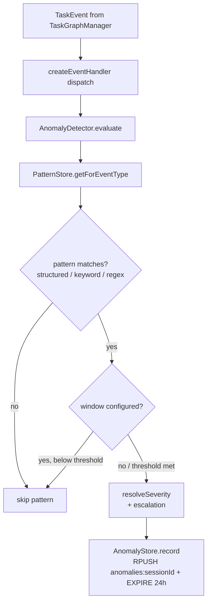
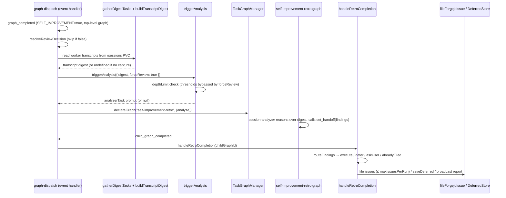
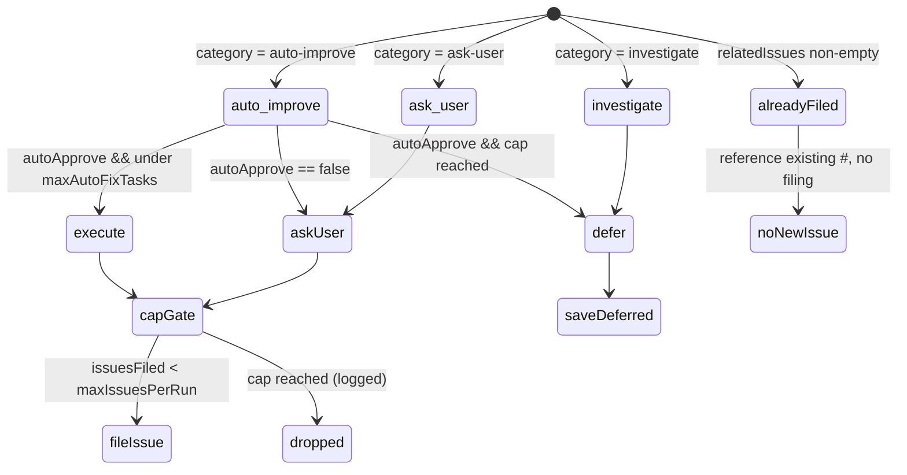
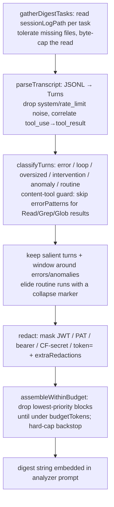

# Self-Improvement Loop

## Overview

The Self-Improvement Loop is a closed loop that lets the Bureau detect anomalies in its own task-graph execution, analyze a completed session with an LLM, and route the resulting findings to Forgejo issues or deferred storage. Detection is in-process TypeScript middleware (zero token cost); analysis is an out-of-process Claude Code child graph (`src/self-improvement/anomaly-detector.ts:29-57`, `src/graph-dispatch.ts:729-810`). The whole subsystem is gated behind the `SELF_IMPROVEMENT` environment variable and is off by default (`src/graph-dispatch.ts:729`, `src/self-improvement/types.ts:70-71`). The current middleware design replaced an earlier LLM "watchdog" agent. The analyzer is not handed a blank log path: the event handler builds a bounded, redacted, mechanically-curated **transcript digest** of the completed graph's worker sessions and embeds it in the analyzer prompt (`src/self-improvement/transcript-digest.ts:272`, `src/graph-dispatch.ts:752-763`).

## Responsibilities

- Evaluate every `TaskEvent` against on-disk JSON anomaly patterns and record matches to Redis, with no LLM involvement (`src/self-improvement/anomaly-detector.ts:57-121`, `src/graph-dispatch.ts:614`).
- Persist anomaly records per session in Redis with a 24-hour TTL (`src/self-improvement/anomaly-store.ts:6-15`).
- On graph completion, resolve a **review decision** (per-graph `selfImprove` flag → config `defaultReview` → duration/task-count/anomaly thresholds) and skip the retro when it is false (`src/self-improvement/index.ts:76-89`, `src/graph-dispatch.ts:745`).
- Build a bounded, redacted transcript digest of the completed graph's worker sessions and, if any transcript was captured, embed it in the analyzer task prompt instead of a raw log path (`src/self-improvement/transcript-digest.ts:272`, `src/self-improvement/session-analyzer.ts:96-160`, `src/graph-dispatch.ts:752-763`).
- Spawn the retrospective as a child graph with project `self-improvement-retro` (`src/graph-dispatch.ts:783-786`).
- On retro completion, route the analyzer's structured findings into execute / defer / ask-user / already-filed buckets and act on each, capping total issues filed at `maxIssuesPerRun` (`src/self-improvement/retro-handler.ts:40-98`, `src/self-improvement/decision-handler.ts:21-53`).
- Deduplicate against issues the analyzer already filed itself: any finding carrying a non-empty `relatedIssues` is routed to `alreadyFiled` and no new issue is created for it (`src/self-improvement/decision-handler.ts:17-33`).
- File Forgejo issues for auto-improve and ask-user findings (`src/forgejo.ts:8-54`, `src/graph-dispatch.ts:808-809`).
- Persist "investigate" findings for surfacing at the start of a later session (`src/self-improvement/deferred-store.ts:17-22`, `src/self-improvement/index.ts:74-90`).
- Enforce a recursion depth limit so self-improvement graphs cannot trigger further self-improvement graphs (`src/self-improvement/index.ts:42-49`, `src/tools/declare-task-graph.ts:94-104`).

## Key flows

### Flow 1 — In-process anomaly detection

This flowchart shows how a `TaskEvent` becomes a recorded anomaly. Every event handled by the event handler is evaluated synchronously before any other handling (`src/graph-dispatch.ts:614`).

Detection is driven by patterns loaded from `.bureau/anomaly-patterns.json`; an empty or unreadable file yields an empty pattern set and silently disables detection (`src/self-improvement/pattern-store.ts:20-35`). The detector supports three detection modes — `structured` (operators `$in`,`$gt`,`$gte`,`$lt`,`$lte`,`$eq`), `keyword`, and `regex` — plus optional time-windowing and severity escalation (`src/self-improvement/anomaly-detector.ts:125-231`, `src/self-improvement/pattern-types.ts:7-58`). The `AnomalyDetector` is constructed once at server startup and wired into the event handler — it is added to `dispatchDeps` and passed to `createEventHandler(dispatchDeps)` (`src/mcp-server.ts:452-460`, `src/mcp-server.ts:484-502`, `src/mcp-server.ts:508`, `src/graph-dispatch.ts:614`).

### Flow 2 — Session retrospective lifecycle

This sequence shows the round-trip from a completed graph through the analyzer child graph back to issue filing. The retro is a separate Claude Code session that receives structured anomaly data plus a curated transcript digest, not raw logs.

The trigger only fires for top-level graphs when `SELF_IMPROVEMENT === "true"`, the graph is not itself a `self-improvement*` project, and it has no `parentGraphId` (`src/graph-dispatch.ts:729`). Before spawning, the event handler resolves the review decision and returns early if it is false (`src/graph-dispatch.ts:745`), then gathers each worker's persisted transcript and builds the digest, passing it plus `forceReview: true` into `triggerAnalysis` — the size thresholds were already applied by `resolveReviewDecision`, so `triggerAnalysis` skips its own threshold gate but still enforces the depth limit (`src/graph-dispatch.ts:752-766`, `src/self-improvement/index.ts:46-73`). The retro graph is declared with `parentGraphId` set to the triggering graph so the depth guard can see its lineage (`src/graph-dispatch.ts:786`). On `child_graph_completed`, the handler no-ops unless the child's project is exactly `self-improvement-retro` and the analyzer handoff contains a non-empty `findings` array (`src/self-improvement/retro-handler.ts:41-51`).

### Flow 3 — Finding routing state

This state diagram shows how `routeFindings` classifies each finding: first by whether the analyzer already filed it, then by its `category` and the `autoApprove` config.

Before category routing, `routeFindings` checks `relatedIssues`: a finding whose `relatedIssues` array is non-empty is diverted to the `alreadyFiled` bucket and never re-filed, so the analyzer can file an issue directly (there is no redis/shell access in its sandbox) and record the number to prevent the engine double-filing (`src/self-improvement/decision-handler.ts:17-33`, `src/self-improvement/session-analyzer.ts:150-160`). An empty `relatedIssues` array is treated the same as absent — the finding is filed normally (`src/self-improvement/decision-handler.ts:17-19`, `test: tests/self-improvement/retro-dedup.test.ts > "(d) treats an empty relatedIssues array the same as absent — finding is filed normally"`). With the default config `autoApprove: false`, every auto-improve finding is routed to `askUser` rather than executed (`src/self-improvement/decision-handler.ts:33-45`, `src/self-improvement/types.ts:73`). Execute-bucket findings are filed as Forgejo issues with the `auto-improve` label — they are NOT run as fix graphs (`src/graph-dispatch.ts:808`, `src/self-improvement/retro-handler.ts:72-77`). Issue filing across both the execute (`auto-improve`) and ask-user (`needs-input`) buckets is capped at `maxIssuesPerRun` (default 5): `handleRetroCompletion` counts issues filed and breaks both loops once the cap is reached, logging how many findings were dropped (`src/self-improvement/retro-handler.ts:69-97`, `src/self-improvement/types.ts:72`). This routing is exercised by `test: tests/self-improvement/decision-handler.test.ts > "caps auto-improve tasks at maxAutoFixTasks"`, and the issue cap by `test: tests/self-improvement/retro-handler.test.ts > "enforces maxIssuesPerRun cap across both auto-improve and ask-user findings"`. The dedup path is exercised by `test: tests/self-improvement/retro-dedup.test.ts > "(a) skips issue creation for a finding with relatedIssues and references the existing number in the report"`.

### Flow 4 — Transcript digest construction

This flowchart shows how `buildTranscriptDigest` turns each worker's raw JSONL transcript into a bounded, redacted salience digest. The module is pure (no I/O): the event handler reads the files via `gatherDigestTasks` and passes the parsed events in (`src/self-improvement/transcript-digest.ts:366`, `src/graph-dispatch.ts:752-763`).

Salience is priority-ranked — `intervention`/`error` (5) > `anomaly` (4) > `loop` (3) > `oversized` (2) > `routine` (0) — and the budget trimmer drops the lowest-priority blocks first until the estimate fits `budgetTokens` (default 18000), appending a truncation note and a hard-cap backstop (`src/self-improvement/transcript-digest.ts:115-119`, `src/self-improvement/transcript-digest.ts:251-268`). A turn is tagged `error` when a tool result is `is_error` **or**, for a *process-output* tool, a secondary `errorPatterns` regex (`/Error:/`, `/Traceback/`, `/\bFAILED\b/`, …) hits the result text — but that content heuristic is **skipped for content-returning tools** (`Read`/`Grep`/`Glob`, the `DEFAULT_CONTENT_TOOLS` set): a file/search result that merely contains a literal `Error:`/`FAILED` substring is not a tool failure, so only `is_error` is trusted there (each result is paired with its tool call by index) (`src/self-improvement/transcript-digest.ts:33`, `src/self-improvement/transcript-digest.ts:125-141`, `test: tests/self-improvement/transcript-digest.test.ts > "does not flag content-returning tools (Read/Grep/Glob) on incidental error-like substrings, but still flags Bash and truly-errored reads"`). Redaction always applies a built-in secret floor (JWT, `ghp/gho/ghs`/`glpat` PATs, `Bearer`, `x-access-token`, `CF-Access-Client-Secret`, `BUREAU_*TOKEN`/`GIT_TOKEN` assignments); config-supplied `extraRedactions` are added on top of that floor, never replacing it (`src/self-improvement/transcript-digest.ts:197-221`, `test: tests/self-improvement/transcript-digest.test.ts > "additive redaction: extra patterns mask alongside built-in redactions in a single call"`). `gatherDigestTasks` counts every attempted transcript read as an `onTranscriptRead("retro_digest", ...)` visibility signal — `ok` when content is present, `missing` when the file is absent/empty — a [Telemetry](Telemetry.md) counter that does not change read semantics (`src/self-improvement/transcript-digest.ts:377`).

## Public interface

| Symbol | Signature | Description | Citation |
|---|---|---|---|
| `triggerAnalysis` | `(opts: TriggerAnalysisOptions) => string \| null` | Depth gate + threshold gate (the latter bypassed when `forceReview`); returns the analyzer prompt (embedding `digest` when supplied) or null | `src/self-improvement/index.ts:46-73` |
| `resolveReviewDecision` | `(graphFlag, configDefault, thresholdsPass) => boolean` | Retro review precedence: per-graph `selfImprove` → config `defaultReview` → size thresholds | `src/self-improvement/index.ts:76-89` |
| `checkDeferredWork` | `(opts: CheckDeferredOptions) => Promise<string \| null>` | Builds a "previous sessions found N improvements" message from the deferred store | `src/self-improvement/index.ts:91-107` |
| `buildTranscriptDigest` | `(input: DigestInput) => string` | Pure builder: parse → classify → keep salient + window → redact → fit token budget | `src/self-improvement/transcript-digest.ts:272` |
| `gatherDigestTasks` | `(tasks, readFile, maxBytes?) => DigestTaskInput[]` | Reads each worker's `sessionLogPath` JSONL (byte-capped, missing tolerated), attaches outcomes | `src/self-improvement/transcript-digest.ts:366` |
| `resolveDigestConfig` | `(env?) => Partial<DigestOptions>` | Resolves digest tuning: defaults → mounted ConfigMap JSON → env scalar overrides (`errorPatterns`/`contentTools`/`allowlist` replace, `extraRedactions` add) | `src/self-improvement/digest-config.ts:18` |
| `AnomalyDetector` | `class { evaluate(event): Promise<AnomalyRecord[]> }` | In-process pattern-matching middleware over TaskEvents | `src/self-improvement/anomaly-detector.ts:29-121` |
| `AnomalyStore` | `class { record/list/count/clear }` | Redis list storage under `anomalies:<sessionId>` | `src/self-improvement/anomaly-store.ts:8-32` |
| `PatternStore` | `class { load(): number; getForEventType(t) }` | Loads & validates `.bureau/anomaly-patterns.json`; SIGHUP-reloadable | `src/self-improvement/pattern-store.ts:8-48` |
| `DeferredStore` | `class { save/load/listSessions/dismiss }` | Redis storage for postponed findings, TTL = `ttlDays` | `src/self-improvement/deferred-store.ts:7-39` |
| `shouldTriggerAnalysis` | `(config, metrics) => boolean` | True if any of duration / taskCount / anomaly thresholds met | `src/self-improvement/session-analyzer.ts:10-18` |
| `buildAnalyzerTask` | `(opts) => string` | Renders the retro task prompt (anomaly tables + instructions) | `src/self-improvement/session-analyzer.ts:89-152` |
| `routeFindings` | `(findings, config) => RoutedFindings` | Buckets findings into execute / defer / askUser / alreadyFiled | `src/self-improvement/decision-handler.ts:21-54` |
| `formatReport` | `(routed) => string` | Human-readable session-retro summary (includes an "Already filed by analyzer" section) | `src/self-improvement/decision-handler.ts:56-102` |
| `handleRetroCompletion` | `(opts) => Promise<void>` | Reads handoff findings, routes, files issues (capped at `maxIssuesPerRun`), broadcasts | `src/self-improvement/retro-handler.ts:40-109` |
| `fileForgejoIssue` | `(finding, label, log) => Promise<void>` | POSTs a Forgejo issue for a finding; skips if env unset | `src/forgejo.ts:8-54` |

`anomalyPatternSchema` / `patternFileSchema` (zod) define the pattern file contract (`src/self-improvement/pattern-types.ts:48-66`).

## Dependencies

- **Redis** for anomaly records (`anomalies:<sessionId>`, 24h TTL) and deferred findings (`self-improvement:deferred:<sessionId>`, configurable TTL) (`src/self-improvement/anomaly-store.ts:5-15`, `src/self-improvement/deferred-store.ts:5-21`). `DeferredStore.listSessions` uses `scanKeys` (SCAN, not KEYS) (`src/self-improvement/deferred-store.ts:30-33`).
- **[Task Graph Engine](Task%20Graph%20Engine.md)** — consumes `TaskEvent`s from the event handler and spawns the retro via `declareGraph`; `getGraphDepth` walks the `parentGraphId` chain for the depth guard (`src/graph-dispatch.ts:614`, `src/graph-dispatch.ts:766`, `src/task-graph.ts:1248-1258`).
- **Worker transcript PVC** — the digest is built from each worker task's persisted `sessionLogPath` (the read-only `/sessions` PVC for k8s workers). A task with capture off (no `sessionLogPath`) or a missing file yields empty events, tolerated as not-an-error (`src/self-improvement/transcript-digest.ts:366-395`, `src/graph-dispatch.ts:752-757`).
- **Digest ConfigMap / env** — `resolveDigestConfig` reads a mounted ConfigMap JSON (`BUREAU_DIGEST_CONFIG_PATH`, default `/etc/bureau/digest-config.json`) and `BUREAU_DIGEST_*` env scalars to tune digest bounds and salience patterns (`src/self-improvement/digest-config.ts:17`).
- **[Templates & Agent Registry](Templates%20%26%20Agent%20Registry.md)** — the retro graph uses role `session-analyzer`; the `self-improvement-coordinator` agent is the meta-agent counterpart (`src/graph-dispatch.ts:723`, `agents/session-analyzer.md`, `agents/self-improvement-coordinator.md`).
- **[Health & Process Monitoring](Health%20%26%20Process%20Monitoring.md)** — patterns key off process/exit events (e.g. `dead_pid`) emitted into the same TaskEvent stream (`.bureau/anomaly-patterns.json`). The health sweep also emits `graph_stalled` for an active graph that has zero `running`/`ready` tasks **and** either no pending merges or a failed `merge-*` task — a pending non-failed merge is treated as in-flight work and does NOT trigger a stall (`src/health-sweep.ts:616-626`). The `graph-stall` pattern matches the event and surfaces a genuine stall to the retro loop (`.bureau/anomaly-patterns.json`).
- **[Messaging & Handoffs](Messaging%20%26%20Handoffs.md)** — the analyzer returns findings via `set_handoff`; results are `broadcast` back to the session project (`src/self-improvement/retro-handler.ts:44-97`).
- **Forgejo REST API** via `fetch` (`src/forgejo.ts:39-54`). The same module also exports `openForgejoPR`, which opens an export-back PR for a dynamically created agent file — that is used by the `create_agent` export-back path, a separate concern, NOT by this loop (`src/forgejo.ts:88-153`).
- The `self-improvement-coordinator` / `session-analyzer` mapping and trigger gating are catalogued in [Self-Improvement Loop](Self-Improvement%20Loop.md) itself; [Telemetry](Telemetry.md) owns the separate cache `CacheAnomalyDetector`, which is unrelated to this subsystem.

## Configuration

`SelfImprovementConfig` defaults (`src/self-improvement/types.ts:70-82`); loaded/merged by `loadBureauConfig` from `.bureau` config (`src/mcp-config.ts:75`, `src/mcp-config.ts:108-114`).

| Key | Type | Default | Effect | Citation |
|---|---|---|---|---|
| `SELF_IMPROVEMENT` (env) | string | unset | Master gate — trigger only runs when `"true"` | `src/graph-dispatch.ts:729`, `src/cli.ts:57` |
| `enabled` | boolean | `false` | Config-level enable (set true by `--self-improve` CLI path) | `src/self-improvement/types.ts:69-70`, `src/cli.ts:35` |
| `analyzerModel` | string | `"sonnet"` | Model label surfaced in CLI banner | `src/self-improvement/types.ts:71` |
| `maxIssuesPerRun` | number | `5` | Hard cap on Forgejo issues filed per retro run, enforced in code; also stated as text in the analyzer prompt | `src/self-improvement/types.ts:72`, `src/self-improvement/retro-handler.ts:59-85`, `src/self-improvement/session-analyzer.ts:148` |
| `autoApprove` | boolean | `false` | If false, auto-improve findings go to ask-user | `src/self-improvement/types.ts:73`, `src/self-improvement/decision-handler.ts:23-31` |
| `depthLimit` | number | `1` | Max nesting depth for self-improvement graphs | `src/self-improvement/types.ts:74`, `src/tools/declare-task-graph.ts:94-98` |
| `maxAutoFixTasks` | number | `3` | Cap on execute-bucket findings | `src/self-improvement/types.ts:76`, `src/self-improvement/decision-handler.ts:24-28` |
| `deferredTtlDays` | number | `7` | TTL for deferred findings in Redis | `src/self-improvement/types.ts:77`, `src/self-improvement/deferred-store.ts:14` |
| `defaultReview` | boolean? | unset | Config-level retro-review default; overrides size thresholds, overridden by per-graph `selfImprove`. Only merged when the raw value is a boolean | `src/self-improvement/types.ts:68`, `src/mcp-config.ts:108-114`, `src/self-improvement/index.ts:76-89` |
| `analyzerTrigger.minDurationMs` | number | `300000` | Trigger if session ran ≥ 5 min | `src/self-improvement/types.ts:52-56`, `src/self-improvement/session-analyzer.ts:14` |
| `analyzerTrigger.minToolCalls` | number | `20` | Trigger if ≥ 20 tasks completed | `src/self-improvement/types.ts:54`, `src/self-improvement/session-analyzer.ts:15` |
| `analyzerTrigger.triggerOnAnomalies` | boolean | `true` | Trigger if any anomaly recorded | `src/self-improvement/types.ts:55`, `src/self-improvement/session-analyzer.ts:16` |

The pattern file path is `<cwd>/.bureau/anomaly-patterns.json`; the shipped file declares 13 patterns over `version: 1`, of which 12 are enabled (only `duration-outlier` is disabled) (`src/self-improvement/pattern-store.ts:13`, `.bureau/anomaly-patterns.json`). The newest, `graph-stall`, is a `structured` pattern on the `graph_stalled` event type with empty conditions and `high` severity (`.bureau/anomaly-patterns.json`). Forgejo issue filing reads `FORGEJO_URL`, `FORGEJO_TOKEN`, `FORGEJO_OWNER`, `FORGEJO_REPO` (`src/forgejo.ts:14-21`, `src/forgejo.ts:16`).

Transcript-digest tuning is resolved by `resolveDigestConfig` in precedence order defaults → mounted ConfigMap JSON → env scalars. The ConfigMap lives at `BUREAU_DIGEST_CONFIG_PATH` (default `/etc/bureau/digest-config.json`); numeric scalars can also be set via env, and `errorPatterns`/`contentTools`/`allowlist` from the ConfigMap **replace** the code defaults while `extraRedactions` are **added** to the built-in secret floor (`src/self-improvement/digest-config.ts:18`, `src/self-improvement/digest-config.ts:47`, `test: tests/self-improvement/digest-config.test.ts > "treats extraRedactions as additive (separate from built-in floor)"`).

| Env / ConfigMap key | Type | Default | Effect | Citation |
|---|---|---|---|---|
| `BUREAU_DIGEST_CONFIG_PATH` | string | `/etc/bureau/digest-config.json` | Path to the digest-config ConfigMap JSON | `src/self-improvement/digest-config.ts:20` |
| `BUREAU_DIGEST_WINDOW_TURNS` / `windowTurns` | number | `3` | Turns of context kept around each error/anomaly | `src/self-improvement/digest-config.ts:34`, `src/self-improvement/transcript-digest.ts:17-38` |
| `BUREAU_DIGEST_BUDGET_TOKENS` / `budgetTokens` | number | `18000` | Hard token budget; lowest-priority blocks dropped to fit | `src/self-improvement/digest-config.ts:35`, `src/self-improvement/transcript-digest.ts:17-38` |
| `BUREAU_DIGEST_OVERSIZED_BYTES` / `oversizedBytes` | number | `8192` | Tool-result byte size that flags a turn `oversized` | `src/self-improvement/digest-config.ts:36`, `src/self-improvement/transcript-digest.ts:17-38` |
| `BUREAU_DIGEST_LOOP_THRESHOLD` / `loopThreshold` | number | `3` | Consecutive identical non-allowlisted calls to flag a loop | `src/self-improvement/digest-config.ts:37`, `src/self-improvement/transcript-digest.ts:17-38` |
| `BUREAU_DIGEST_TASK_PROMPT_BUDGET` / `taskPromptBudget` | number | `500` | Max chars of the task-prompt excerpt (word-boundary truncated) | `src/self-improvement/digest-config.ts:38`, `src/self-improvement/transcript-digest.ts:17-38` |
| `errorPatterns` (ConfigMap) | string[] | `Exit code`, `fatal:`, `Error:`, `Traceback`, `FAILED` | Secondary error-content signals (applied only to non-content tools); **replaces** defaults | `src/self-improvement/digest-config.ts:45-46`, `src/self-improvement/transcript-digest.ts:28` |
| `contentTools` (ConfigMap) | string[] | `Read`, `Grep`, `Glob` | Content-returning tools whose result text is exempted from the `errorPatterns` heuristic (only `is_error` flags them); **replaces** defaults | `src/self-improvement/digest-config.ts:47`, `src/self-improvement/transcript-digest.ts:33` |
| `allowlist` (ConfigMap) | string[] | `TaskUpdate`,`TaskCreate`,`set_status`,`heartbeat`,`check_messages` | Routine tools excluded from loop/friction; **replaces** defaults | `src/self-improvement/digest-config.ts:48`, `src/self-improvement/transcript-digest.ts:29` |
| `extraRedactions` (ConfigMap) | {pattern,kind}[] | `[]` | **Added** on top of the built-in secret redaction floor | `src/self-improvement/digest-config.ts:49-57`, `src/self-improvement/transcript-digest.ts:197-221` |

## Failure modes

- **Missing/invalid pattern file** → `PatternStore.load` logs a warning and uses an empty pattern set; detection is silently disabled but the server runs (`src/self-improvement/pattern-store.ts:27-34`).
- **Anomaly record write failure** → caught per-pattern, logged at warn, evaluation continues (`src/self-improvement/anomaly-detector.ts:115-117`).
- **Detector evaluation throws** → caught in the event handler; the event is still processed normally (`src/graph-dispatch.ts:614`).
- **Review decision false** → the event handler logs `retro skipped by review decision` and returns before building the digest or triggering analysis (`src/graph-dispatch.ts:745-751`).
- **No worker transcript captured** → `gatherDigestTasks` returns empty events for those tasks; when no task yielded any events, the digest is `undefined` and the analyzer falls back to the log-hint/git-pivot prompt (`src/self-improvement/transcript-digest.ts:366-395`, `src/graph-dispatch.ts:757-763`, `src/self-improvement/session-analyzer.ts:96-119`).
- **Malformed digest ConfigMap JSON** → `resolveDigestConfig` logs a warning and falls back to defaults rather than throwing; a missing file emits no warning (`src/self-improvement/digest-config.ts:22-28`, `test: tests/self-improvement/digest-config.test.ts > "malformed JSON: returns defaults and warns via logger, does not throw"`). Invalid regex in `errorPatterns`/`extraRedactions` is skipped, not thrown (`src/self-improvement/digest-config.ts:40-57`).
- **`FORGEJO_URL`/`FORGEJO_TOKEN` unset** → `fileForgejoIssue` logs a warning and returns without filing; covered by `test: tests/forgejo.test.ts` (`src/forgejo.ts:18-21`).
- **Retro handoff empty / wrong project** → `handleRetroCompletion` no-ops silently (`src/self-improvement/retro-handler.ts:41-51`).
- **More issuable findings than `maxIssuesPerRun`** → `handleRetroCompletion` files issues up to the cap, then breaks both the execute and ask-user loops and logs the count of dropped findings; nothing is filed beyond the cap (`src/self-improvement/retro-handler.ts:69-97`).
- **Depth limit reached** → `triggerAnalysis` returns null and logs a warning; `declare_task_graph` independently rejects over-depth self-improvement graphs as a second guard (`src/self-improvement/index.ts:46-58`, `src/tools/declare-task-graph.ts:95-103`).
- **Invalid regex in a pattern** → `matchesPattern` returns false rather than throwing (`src/self-improvement/anomaly-detector.ts:149-151`).

## Related

- [Task Graph Engine](Task%20Graph%20Engine.md)
- [Templates & Agent Registry](Templates%20%26%20Agent%20Registry.md)
- [Health & Process Monitoring](Health%20%26%20Process%20Monitoring.md)
- [Messaging & Handoffs](Messaging%20%26%20Handoffs.md)
- [Telemetry](Telemetry.md)
- [Redis & Connection Layer](Redis%20%26%20Connection%20Layer.md)
- [Agent Runtime & Providers](Agent%20Runtime%20%26%20Providers.md)
- [Test Service Broker](Test%20Service%20Broker.md)
