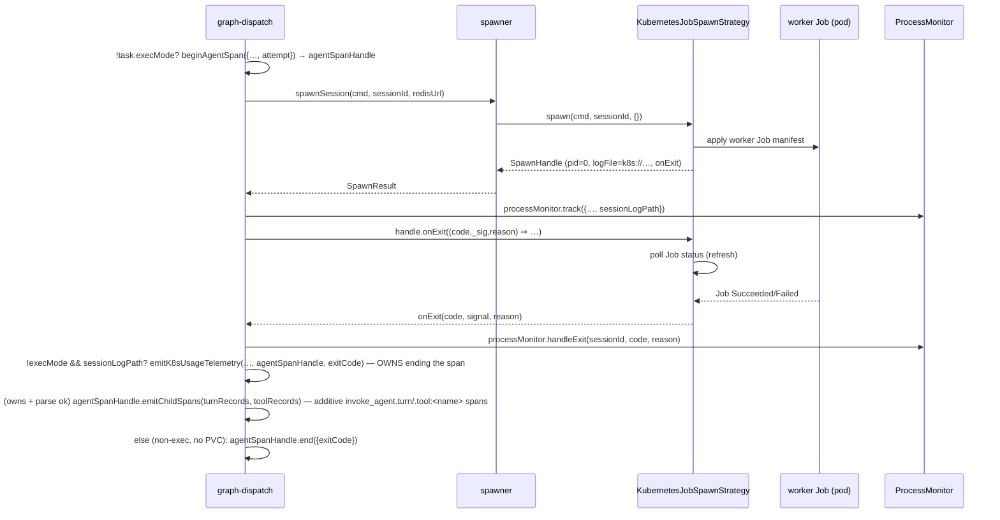

# Spawn (k8s worker dispatch)

> [!info] Architecture: k8s-only worker dispatch
> This subsystem used to spawn agents locally as OS processes (a node-pty PTY strategy, a detached-child raw strategy, an OS sandbox gate, and engine-side git worktrees). All of that was **removed**. The engine now dispatches **every** worker as a Kubernetes Job (pod-per-task). This note documents only the mcp-server-side spawn seam — the command build, the `SpawnStrategy`/`SpawnHandle` interface, the loadout/capability resolution, and the dispatch seam. The in-cluster runtime — Job manifests, worker entrypoint, liveness polling, token plumbing, git clone/remote-merge — is the [k8s Spawn & Remote Merge](k8s%20Spawn%20%26%20Remote%20Merge.md) note (its infra-cluster half is k8s Spawn Strategy). The agent resolvers (`resolveAgentConfig`/`resolveCapability`/`resolveTaskLoadout`) are owned by [Agent Runtime & Providers](Agent%20Runtime%20%26%20Providers.md); this note describes how the spawn/dispatch seam calls them.

## Overview

Spawn is the thin engine-side layer that turns a dispatched task into a running Claude Code worker. `spawner.ts` builds the `claude` command line — model, prompt (role core + optional per-language fragment + handoff/topology/guidance), MCP config, the harness `--tools` allowlist, and env — and `spawnSession` writes the MCP config to disk and delegates the actual process creation to a pluggable `SpawnStrategy` (`src/spawner.ts › buildSpawnCommand`, `src/spawner.ts › spawnSession`). There is exactly one strategy family: `selectStrategyName()` always returns `"k8s"`, and `buildStrategy()` always constructs a `KubernetesJobSpawnStrategy`, throwing a clear startup error if no cluster is reachable — there is no local spawn fallback (`src/spawn/strategy.ts › selectStrategyName`, `src/spawn/strategy.ts › buildStrategy`). The `KubernetesJobSpawnStrategy` runs each agent as a worker Job in the cluster and is documented in depth by [k8s Spawn & Remote Merge](k8s%20Spawn%20%26%20Remote%20Merge.md); this note covers only the command build, the `SpawnStrategy`/`SpawnHandle` interface, and the dispatch seam that drives it (`src/spawn/strategy.ts › SpawnStrategy`). This k8s-only design replaced an earlier local-spawn model (PTY/raw). `mcp-config.ts` still assembles the merged MCP server set each *stdio* worker sees — i.e. the non-`workerHttp` spawn path, where `buildMergedMcpConfig` runs in the `else` branch (`src/mcp-config.ts › buildMergedMcpConfig`, `src/spawner.ts › buildSpawnCommand`).

Spawns dispatch through a `runtimeRegistry` keyed by runtime id, with `ClaudeCodeRuntime` (a thin façade over `buildSpawnCommand`) as the only registered adapter (`src/runtime/claude-code.ts › ClaudeCodeRuntime`, `src/graph-dispatch.ts › createDispatchHandler`). The dispatch handler resolves everything a task needs through **one** shared pure resolver, `resolveTaskLoadout`, which internally calls `resolveAgentConfig` (model/category/providerEnv), `resolveCapability` (the tool capability), and `resolveToolchain` (image), returning a descriptive `TaskPlan`; the same resolver backs the dry-run graph preview so the two paths cannot drift (`src/runtime/resolve-loadout.ts › resolveTaskLoadout`, `src/graph-dispatch.ts › createDispatchHandler`). Provider routing injects endpoint/auth/model env vars so a role can target a non-default model or gateway (`src/runtime/provider.ts › providerEnv`). A per-task `model` field overrides the role default at spawn time and is passed verbatim to `claude --model`, so an individual task can request cheaper or stronger models without changing the role (`src/runtime/resolve-loadout.ts › resolveTaskLoadout`, `src/spawner.ts › buildSpawnCommand`). The plan also carries a per-task **toolchain** → worker image (gated by an image allowlist) and a static per-language prompt fragment for code-touching roles, so one neutral role core can run a Node, Python, or .NET task (`src/graph-dispatch.ts › createDispatchHandler`, `src/spawner.ts › buildSpawnCommand`). The plan additionally carries a **capability** — an MCP-tool allowlist, a harness (`--tools`) policy, and a `suppressMemory` flag — that `buildSpawnCommand` turns into a reduced built-in tool surface and, for nano agents, a CLAUDE.md-free launch cwd; the resolved loadout+capability are persisted onto the task record *before* the worker spawns (`src/runtime/capability.ts › Capability`, `src/spawner.ts › buildSpawnCommand`, `src/graph-dispatch.ts › createDispatchHandler`).

## Responsibilities

- Resolve per-agent launch config from agent `.md` **frontmatter** — `loadAgentManifest` scans `agents/*.md` (and `agents/dynamic/*.md`) for each agent's `id`/`category`/`model`/`profile`/`template`/`tools`, while `agents.json` now holds only the `providers`/`runtimes` maps (`src/runtime/resolve-agent.ts › loadAgentManifest`). The dispatch handler feeds that manifest to `resolveTaskLoadout`; a corrupt `agents.json` degrades to a no-overrides spawn instead of hanging the already-running task (`src/graph-dispatch.ts › createDispatchHandler`).
- Dispatch the launch through a runtime registry: `runtimeRegistry[runtimeId].buildLaunch(spec)`, falling back to `ClaudeCodeRuntime` (and warning) on an unknown runtime id; `ClaudeCodeRuntime.buildLaunch` is a thin wrapper over `buildSpawnCommand` (`src/graph-dispatch.ts › createDispatchHandler`, `src/runtime/claude-code.ts › ClaudeCodeRuntime`).
- Build the agent spawn command — `claude` flags, model, the appended system prompt (agent prompt + **per-language fragment** + handoff + topology + git/communication guidance), the `--tools` allowlist, and the on-disk MCP config (`src/spawner.ts › buildSpawnCommand`). `buildSpawnCommand` emits `--model <value>` as the first argument only when `opts.model` is set, and passes the value through verbatim (`src/spawner.ts › buildSpawnCommand`, `test: src/__tests__/model-override.test.ts > "passes --model when model is set"`, `test: src/__tests__/model-override.test.ts > "omits --model when model is undefined"`, `test: src/__tests__/model-override.test.ts > "passes unknown model values through verbatim"`).
- Reduce the worker's built-in tool surface from its capability: `toToolFlags(capability)` emits `--tools <A,B>` when the harness policy is a list, `--tools ""` when it is `[]` (nano), and nothing when it is `"*"` (all built-ins) — this removes built-in tool *schemas* from the context, not just gates them (`src/spawner.ts › buildSpawnCommand`, `src/runtime/capability.ts › toToolFlags`).
- Suppress project memory for nano agents: when `capability.suppressMemory` is true, `buildSpawnCommand` launches in a fresh `mkdtemp` CLAUDE.md-free cwd (`createMemoryFreeCwd`) and sets `CLAUDE_CODE_DISABLE_AUTO_MEMORY=1` in the process env; it also skips the "Save Points"/"Git Discipline" prompt sections for a harness that has no file/git tools (`src/spawner.ts › buildSpawnCommand`, `src/spawner.ts › createMemoryFreeCwd`).
- Append a per-language fragment to the prompt prefix for code-touching roles: when `opts.agentsDir`, `opts.toolchain`, and `needsLangFragment(category, role)` are all satisfied, `buildSpawnCommand` appends `agents/lang/<toolchain>.md` right after the role core (so it stays in the cacheable prefix); a missing/unmatched fragment yields `""` and never fails the dispatch (`src/spawner.ts › buildSpawnCommand`, `src/spawner.ts › loadLangFragment`, `src/types/agent.ts › needsLangFragment`).
- Inject a static **sandbox banner** into the prompt prefix for every pod-mode worker: when `opts.workerHttp` is set, `buildSpawnCommand` appends the ≤5-line `SANDBOX_BANNER` (no reachable live Redis/Postgres, no `python3` in the worker image, warm `npm ci` cache) immediately after the role core / language fragment and before the dynamic context blocks, so agents stop re-discovering these facts by burning tool calls (`src/spawner.ts › buildSpawnCommand`).
- Block the main-loop-only harness tools for every pod-mode worker: when `opts.workerHttp` is set, `buildSpawnCommand` emits `--disallowedTools ScheduleWakeup,CronCreate,CronDelete,CronList` (after `--settings`, before `--strict-mcp-config`), so a worker cannot waste a turn calling a `/loop`-style tool that only makes sense in the operator's main loop (`src/spawner.ts › buildSpawnCommand`).
- Carry two static role-agnostic prompt nudges in the assembled system prompt (same "one shared spot in `buildSpawnCommand`, zero prefix-hash churn" pattern as the sandbox banner): a **ToolSearch fully-qualified-name** note appended to the unconditional `## Communication` block telling agents that a deferred `bureau-agent` tool's `select:` query must use the `mcp__bureau-agent__<tool>` form (a bare `select:set_status` fails the harness matcher and wastes a lookup), and an **Editing Discipline** line appended to the `## Git Discipline` block telling code-editing agents to grep first and make one `replace_all: true` `Edit` for character-identical matches. The Editing Discipline line sits inside the `hasGitTools` guard, so nano/no-git-tool workers never see it, whereas the ToolSearch note reaches every role (`src/spawner.ts › buildSpawnCommand`).
- Emit back-dated per-turn / per-tool child spans under the run's `invoke_agent` span at exit: when the transcript parse succeeds and this exit path owns accounting, `emitK8sUsageTelemetry` calls the span handle's `emitChildSpans`, which starts `invoke_agent.turn` and `invoke_agent.tool:<name>` spans with explicit start/end timestamps recovered from the worker transcript, parented on the captured `invoke_agent` context; it is wrapped in a swallow-all `try/catch` and computed independently of the run-level totals, so child-span emission can never affect cost accounting (`src/telemetry/k8s-usage.ts › emitK8sUsageTelemetry`, `src/telemetry/instrumentation/agent-spawn.ts › AgentSpanHandle`).
- Grant `reject_task` to review-loop tasks: inside `resolveTaskLoadout`, when `task.reviewLoop` is set and the capability's MCP allowlist is a list (not `"*"`) missing `reject_task`, the tool is appended to `capability.mcp` — so a minimal-profile reviewer can actually block promotion on a REJECT verdict, applied regardless of resolve success/failure (`src/runtime/resolve-loadout.ts › resolveTaskLoadout`).
- Resolve the spawn model inside `resolveTaskLoadout` with the precedence task.model > role default > global default: the plan seeds `model` from `resolveAgentConfig` and overrides it with the per-task `task.model` when present (`src/runtime/resolve-loadout.ts › resolveTaskLoadout`).
- Resolve the per-task toolchain → worker image inside `resolveTaskLoadout` (precedence task.toolchain > graph.defaultToolchain > registry default). The two *impure* gates stay in the dispatch handler: an unknown **named** toolchain (the plan leaves `image` undefined) fails the task `toolchain_unknown`, and a resolved image that fails the async `imageCatalog.isApproved` check fails it `image_not_approved` — the engine never dispatches against the wrong/unapproved image (`src/runtime/resolve-loadout.ts › resolveTaskLoadout`, `src/graph-dispatch.ts › createDispatchHandler`, `src/spawn/image-catalog.ts › ImageCatalog`).
- Translate per-task command overrides into a `cmdEnv` of `BUREAU_*_CMD`/`BUREAU_VALIDATION_LEVEL`/`BUREAU_EXEC_CMD` vars (install/build/test/integrationTest/lint/validation/exec) and merge them into the Job's `extraEnv`, so a worker (or an exec-criterion pod) runs the project's declared commands; the deep validation semantics belong to [Criterion Engine & Plugins](Criterion%20Engine%20%26%20Plugins.md) (`src/graph-dispatch.ts › createDispatchHandler`).
- Carry the `bureau-agent` MCP server's env: the engine's `BUREAU_*`/`OTEL_*` set minus an `AGENT_MCP_EXCLUDE` blocklist (the WS-proxy secrets **and** the engine's HTTP-transport knobs), so a stdio worker never inherits the engine's HTTP transport mode (`src/spawner.ts › buildSpawnCommand`).
- In **worker-HTTP** mode, bypass `buildMergedMcpConfig` and emit a single `type: "http"` `bureau-agent` entry pointing at the engine MCP URL with a Bearer token, so the worker connects back to the engine surface over HTTP, inherits no user MCP servers, and never receives Redis credentials or the stdio bundle path (`src/spawner.ts › buildSpawnCommand`).
- Persist the resolved `loadout` (profile) and `capability` onto the Redis task record **before** spawning, so a worker connecting over HTTP has its privilege read from the record the moment it connects rather than from a boot-race header it controls (`src/graph-dispatch.ts › createDispatchHandler`).
- Write the MCP config to a unique temp file with `fsync` before delegating to the strategy, so the child reads a complete config (`src/spawner.ts › spawnSession`).
- Build the spawn strategy once at engine startup via `initStrategy` → `buildStrategy` (async, because the k8s strategy loads a kube client), memoizing it; `getStrategy` throws if it was never built (no lazy local fallback), and `getActiveStrategy` exposes the built strategy without constructing one (`src/spawner.ts › initStrategy`, `src/spawner.ts › getStrategy`, `src/spawner.ts › getActiveStrategy`).
- Drive the selected strategy: create the worker Job and expose a `SpawnHandle` with `pid`, `logFile`, `logHeaderBytes`, and an `onExit` subscription synthesized from Job-status polling (`src/spawn/strategy.ts › SpawnHandle`, `src/spawn/strategy.ts › SpawnStrategy`).
- Track live handles in-process so `kill_session`/`kill_task` can terminate a worker by id (`src/spawner.ts › killSession`, `src/spawner.ts › getSpawnHandle`).
- Reject new spawns once a graceful shutdown is in progress (`src/spawner.ts › isShuttingDown`, `src/spawner.ts › spawnSession`).

## Key flows

### Command build and k8s dispatch

This flowchart shows how a dispatch request becomes a running worker Job, marking the boundary where the mcp-server seam hands off to the [k8s Spawn & Remote Merge](k8s%20Spawn%20%26%20Remote%20Merge.md) strategy.

```mermaid
flowchart TD
  prompt0["graph-dispatch: loadAgentPrompt(role) (checks agents/<role>.md then agents/dynamic/<role>.md)"] --> k8s{"selectStrategyName(env) === k8s? (always true)"}
  k8s --> mint["mint per-task worker bearer token; workerHttp = {engineUrl, token}"]
  mint --> hoist["hoist single getGraph(graphId) (shared by git + toolchain registry blocks)"]
  hoist --> manifest["loadAgentManifest(agentsDir) — defensive: corrupt agents.json → empty manifest, no-overrides"]
  manifest --> plan["resolveTaskLoadout(task, graph.defaultToolchain, manifest, toolchainRegistry) → TaskPlan {model(task.model applied), capabilityTemplate, category, providerEnv, capability{mcp,harness,suppressMemory}, toolchainName, image, resolveError?}"]
  plan --> gates["dispatch gates: named toolchain unresolved → toolchain_unknown; imageCatalog.isApproved(image)? → image_not_approved"]
  gates -->|fail| failtc["recordSpawnFailure; onTaskFailed; return"]
  gates -->|ok| cmdenv["build cmdEnv: BUREAU_*_CMD / VALIDATION_LEVEL / EXEC_CMD from task overrides"]
  cmdenv --> spec["buildK8sLaunchSpec({extraEnv: providerEnv+cmdEnv, image, loadout, destination, gitBaseRef=resolveHandoffBaseRef(task,graphId,…), gitBranch})"]
  spec --> hash["prefixHash = computePrefixHash(role + tools + CLAUDE.md + toolchain)"]
  hash --> dispatch["runtimeRegistry[runtime].buildLaunch({...spec, capability}) — defaults to ClaudeCodeRuntime → buildSpawnCommand"]
  dispatch --> frag["needsLangFragment(category, role)? append agents/lang/<toolchain>.md after role core; workerHttp? append SANDBOX_BANNER"]
  frag --> tools["toToolFlags(capability) → --tools allowlist; suppressMemory → CLAUDE.md-free cwd + CLAUDE_CODE_DISABLE_AUTO_MEMORY=1"]
  tools --> httpmode["workerHttp set → single type:http bureau-agent entry (Bearer token), no user servers, no Redis creds"]
  httpmode --> args["claude args: --model, -p task, --append-system-prompt, --tools?, --settings?, workerHttp? --disallowedTools ScheduleWakeup,Cron*, --strict-mcp-config, --mcp-config <json>"]
  args --> strip["cmd.k8s.workerArgs = stripMcpConfig(args) — token never lands in Job manifest"]
  strip --> persist["pre-spawn persist: task record .loadout + .capability (avoid boot-latency race)"]
  persist --> spawn["spawnSession(cmd, sessionId, redisUrl)"]
  spawn --> shut{"isShuttingDown()?"}
  shut -->|yes| reject["throw 'server is shutting down'"]
  shut -->|no| writecfg["write mcp-config.json to temp dir + fsync; rewrite --mcp-config to file path"]
  writecfg --> strat["getStrategy().spawn(cmd, sessionId, {})"]
  strat -. infra boundary .-> k8sstrat"KubernetesJobSpawnStrategy: render + apply worker Job — see [[k8s Spawn & Remote Merge"]]
  k8sstrat --> handle["SpawnHandle {pid=0, logFile=k8s://…, onExit}"]
  handle --> fail{"spawn threw?"}
  fail -->|yes| rollback["recordSpawnFailure(k8s_spawn); onTaskFailed (rollback); return"]
  fail -->|no| result["SpawnResult {sessionId, pid, logFile, logHeaderBytes}"]
```

Because `selectStrategyName(process.env)` always returns `"k8s"`, the dispatch handler mints a per-task worker bearer token, builds `workerHttp = { engineUrl, token }`, and hoists a single `getGraph(graphId)` fetch shared by the git-registry and toolchain-registry blocks (`src/graph-dispatch.ts › createDispatchHandler`). It then loads the agent manifest defensively — a corrupt `agents.json` is caught and downgraded to an empty manifest so the already-running task fails soft with no overrides instead of hanging with no failure event (`src/graph-dispatch.ts › createDispatchHandler`) — and calls `resolveTaskLoadout({ task, defaultToolchain: graph?.defaultToolchain, manifest, agentsDir, toolchainRegistry, hostEnv })`. `resolveTaskLoadout` is pure: it wraps `resolveAgentConfig` + `resolveCapability` + `resolveCapabilityTemplateName` + `resolveToolchain`, applies the `task.model` override, injects `reject_task` into the capability's MCP allowlist for a `task.reviewLoop` task whose allowlist is a list missing it, and captures any resolver throw into `plan.resolveError` (logged, then spawn proceeds with defaults) rather than raising (`src/runtime/resolve-loadout.ts › resolveTaskLoadout`). The handler unpacks the plan into `agentModel`/`agentProfile` (= `plan.capabilityTemplate`)/`agentCategory`/`providerEnvVars`/`resolvedCapability`/`resolvedToolchainName`/`resolvedImage` and derives the privilege `loadout` (`coordinator`/`operator`/`full`, else `minimal`) (`src/graph-dispatch.ts › createDispatchHandler`).

Before the command is built, the handler also reads the role prompt via `loadAgentPrompt`, which checks `agents/<role>.md` first and falls back to `agents/dynamic/<role>.md`, throwing a clear "not found" error naming both paths if neither exists (`src/spawner.ts › loadAgentPrompt`). When `loadAgentPrompt` fails, the handler logs an error, records an `agent_prompt_missing` failure, fails the task, and returns (`src/graph-dispatch.ts › createDispatchHandler`). The `spawn_session` MCP tool runs a lighter one-off variant: it calls `resolveAgentConfig` and `resolveCapability` directly (not `resolveTaskLoadout`), catching a resolution failure into a no-overrides spawn (`src/tools/spawn-session.ts › registerSpawnSession`).

**Toolchain → image resolution.** `resolveTaskLoadout` resolves `task.toolchain ?? graph.defaultToolchain` against the toolchain registry (an absent name selects the registry's default entry; an unknown **named** toolchain leaves `image`/`toolchainName` undefined without throwing). The dispatch handler enforces the two failure gates on the plan: it fails the task with a `toolchain_unknown` spawn failure when the graph named a toolchain the registry did not resolve, and — when an `imageCatalog` is present — fails it with `image_not_approved` unless the resolved image passes the async `isApproved` check (`src/runtime/resolve-loadout.ts › resolveTaskLoadout`, `src/graph-dispatch.ts › createDispatchHandler`, `src/spawn/image-catalog.ts › ImageCatalog`). The resolved toolchain name (defaulting to `"node"` when unresolved) is folded into the prefix-hash inputs, since the appended language fragment is part of the real cacheable prompt prefix (`src/graph-dispatch.ts › createDispatchHandler`).

**Per-language prompt fragment.** Inside `buildSpawnCommand`, immediately after the role core (`opts.agentPrompt`) and before handoff/topology/guidance, a static `agents/lang/<toolchain>.md` fragment is appended when `opts.agentsDir` and `opts.toolchain` are set and `needsLangFragment(opts.category ?? "", opts.role)` is true. `needsLangFragment` returns true for code-touching categories/roles and false for planning/research/documentation roles. `loadLangFragment` strips frontmatter and returns the trimmed body, or `""` (with a warning) when the file is absent/unreadable, so a missing or unmatched fragment never throws or fails the dispatch (`src/spawner.ts › buildSpawnCommand`, `src/spawner.ts › loadLangFragment`, `src/types/agent.ts › needsLangFragment`).

**Capability → tool surface.** `resolveCapability` picks a named template (frontmatter `template` → legacy `profile` → `minimal`) from `BUILTIN_TEMPLATES` and lets a frontmatter `tools.mcp`/`tools.harness`/`suppressMemory` override each axis, failing loud on an unknown template or an unknown `tools.mcp` name (`src/runtime/resolve-agent.ts › resolveCapability`, `src/runtime/capability.ts › resolveTemplate`, `src/runtime/capability.ts › BUILTIN_TEMPLATES`). `buildSpawnCommand` then turns the resulting `Capability` into launch effects: `toToolFlags(capability)` inserts `--tools` after `--append-system-prompt` (`"*"` → no flag; `[]` → `--tools ""`; list → `--tools "A,B"`), and `capability.suppressMemory` swaps the launch cwd for a fresh CLAUDE.md-free `mkdtemp` dir and adds `CLAUDE_CODE_DISABLE_AUTO_MEMORY=1` to the env, while a no-file/no-git harness also drops the git-centric prompt sections (`src/spawner.ts › buildSpawnCommand`, `src/runtime/capability.ts › toToolFlags`, `src/spawner.ts › createMemoryFreeCwd`). The built-in `nano` template (`mcp: [send_message, check_messages, set_status, set_handoff, heartbeat]`, `harness: []`, `suppressMemory: true`) is the small-context local-model bundle (`src/runtime/capability.ts › BUILTIN_TEMPLATES`).

**Pre-spawn persist.** After `buildLaunch` returns the command and `workerArgs` are stripped, the handler reads the Redis task record and writes `.loadout` (the resolved profile) and `.capability` back onto it *before* calling `spawnSession`, so `preResolveCapability` can read the worker's engine-assigned privilege the instant it connects over HTTP rather than losing a boot-latency race; if the record is absent it logs a warning and the worker falls back to the full surface. The same values are re-stamped on the post-spawn node update (`src/graph-dispatch.ts › createDispatchHandler`).

`buildSpawnCommand` collects the orchestrator's `BUREAU_*` and `OTEL_*` env vars (minus the `AGENT_MCP_EXCLUDE` set) plus session-specific vars and assigns them as the **env of the `bureau-agent` MCP server**, not the agent CLI process (`src/spawner.ts › buildSpawnCommand`). `AGENT_MCP_EXCLUDE` strips both the WS-proxy secrets (`BUREAU_WS_SECRET`/`BUREAU_WS_PORT`) and the engine's HTTP-transport knobs (`BUREAU_MCP_TRANSPORT`/`BUREAU_MCP_HTTP_PORT`/`BUREAU_MCP_HTTP_HOST`/`BUREAU_MCP_ALLOWED_HOSTS`), so a spawned worker's own MCP server stays on stdio rather than fighting the engine for its port (`src/spawner.ts › buildSpawnCommand`). In **worker-HTTP** mode (`opts.workerHttp` set — the normal k8s path), it bypasses `buildMergedMcpConfig` entirely and emits a single `bureau-agent` MCP entry of `type: "http"` pointing at the engine MCP URL with an `Authorization: Bearer <token>` header, so the worker connects back to the engine over HTTP, inherits **no** user MCP servers, and never receives Redis credentials; when `workerHttp` is absent the `else` branch builds the stdio `bureau-agent` server (`node <mcpServerPath>`) and runs `buildMergedMcpConfig` (`src/spawner.ts › buildSpawnCommand`, `src/mcp-config.ts › buildMergedMcpConfig`). The `claude` argument list always includes `-p <task>`, `--dangerously-skip-permissions`, `--output-format stream-json`, `--verbose`, `--append-system-prompt`, `--strict-mcp-config`, and `--mcp-config <inline json>`; the optional `--tools <allowlist>` follows `--append-system-prompt`, and when `opts.steeringSettingsPath` is set a `--settings <path>` is injected before `--strict-mcp-config`, loading a hook-based steering adapter supplied by `ClaudeCodeRuntime` in worker mode (`src/spawner.ts › buildSpawnCommand`). For a pod-mode worker (`opts.workerHttp` set), the arg list additionally injects `--disallowedTools ScheduleWakeup,CronCreate,CronDelete,CronList` (after `--settings`, before `--strict-mcp-config`) so the worker cannot invoke the operator's main-loop `/loop`/cron tools; `--disallowedTools` blocks invocation but does not remove the tool schemas, which is acceptable since invocation-blocking is the enforcement goal (`src/spawner.ts › buildSpawnCommand`). The appended system prompt for a pod-mode worker also carries the static `SANDBOX_BANNER` (no live Redis/Postgres, no `python3`, warm `npm ci`) placed right after the role core / language fragment so it lands in the cacheable prefix (`src/spawner.ts › buildSpawnCommand`). Two further static nudges live in the later assembled blocks: an **Editing Discipline** line inside the `## Git Discipline` block (emitted only when `hasGitTools` — i.e. skipped for a nano/harness-`[]` worker) telling code-editing agents to grep first and prefer one `replace_all: true` `Edit` over N identical-string edits, and, in the unconditional `## Communication` block, a **ToolSearch** note requiring the fully-qualified `mcp__bureau-agent__<tool>` form in a `select:` query so an agent's first coordination-tool lookup does not miss and pay a wasted round-trip (`src/spawner.ts › buildSpawnCommand`). Neither nudge changes the prefix hash: `computePrefixHash` hashes `{roleDefinition, mcpToolNames, claudeMdContent, toolchain}`, where `roleDefinition` is the resolved role `.md` prompt (from `loadAgentPrompt`) — not the fully-assembled command with these later shared blocks — so adding them leaves the prefix hash unchanged (`src/prefix-hash.ts › computePrefixHash`, `src/prefix-hash.ts › PrefixHashInputs`).

`spawnSession` rejects the call if shutdown is in progress, then writes the inline `--mcp-config` JSON to a fresh `mkdtemp` file, `fsync`s it, and rewrites the argument to point at the file path before delegating to `getStrategy().spawn(...)` — there is no local sandbox or Phase-0 gate anymore, because the engine dispatches every worker as a k8s Job and pod-level confinement replaces host-level sandboxing (`src/spawner.ts › spawnSession`). It then writes a `spawn-diag.log` of diagnostics and returns the `SpawnResult`. No local PID heartbeat watcher is started: k8s workers have no host PID (`handle.pid` is `0`) and liveness comes from Job status, not a shell-level heartbeat (`src/spawner.ts › spawnSession`). The construction and lifecycle of the worker Job from the `K8sLaunchSpec` are the [k8s Spawn & Remote Merge](k8s%20Spawn%20%26%20Remote%20Merge.md) note's territory.

For a k8s worker the stamped `sessionLogPath` (computed by `sessionLogPath(graphId, taskId)`, set only when a session PVC is configured) is threaded into the in-process `ProcessEntry` via `processMonitor.track({ …, sessionLogPath })`, because such a worker's `logFile` is a `k8s://…` placeholder that never exists on the engine filesystem — liveness/output checks and `get_agent_log` must read the real read-only `/sessions` PVC transcript at this path instead (`src/graph-dispatch.ts › createDispatchHandler`, `src/types/peer.ts › SpawnResult`).

### Exit wiring

This sequence shows how the dispatch layer consumes the strategy's synthesized exit event. The k8s strategy has no live PTY stream, so the only `SpawnHandle` member the dispatch path consumes is `onExit`; usage telemetry is recovered at exit by parsing the captured session transcript rather than from a live stream. Under the cost-conservation model, a **single** `invoke_agent` span is opened at dispatch (for real agents only) and ended **exactly once** — the exit path hands ownership of that span to `emitK8sUsageTelemetry`. That same owning path also back-fills per-turn/per-tool child spans under the `invoke_agent` span from the parsed transcript, as a purely additive observability step.



After spawn, `graph-dispatch` retrieves the handle and — only when `handle.onExit` exists — subscribes a callback that threads the synthesized exit `reason` into `processMonitor.handleExit(sessionId, code, reason)` and, for a non-exec task with a stamped `sessionLogPath`, fires `emitK8sUsageTelemetry(...)` passing it the `agentSpanHandle` and `exitCode`; there is no live `onData` callback because the k8s strategy exposes none (`src/graph-dispatch.ts › createDispatchHandler`, `src/telemetry/k8s-usage.ts › emitK8sUsageTelemetry`). The exit callback **does not end the span itself** — the span is ended exactly once by whichever accounting path owns it: `emitK8sUsageTelemetry` on the transcript-parse path, or `agentSpanHandle.end({exitCode})` inline on the non-exec local path with no session PVC (`src/graph-dispatch.ts › createDispatchHandler`). **Exec/criterion pods** (`task.execMode`) run `BUREAU_EXEC_CMD` with zero tokens and are not agent invocations, so the dispatch handler opens **no** `invoke_agent` span for them and fires **no** usage telemetry (`src/graph-dispatch.ts › createDispatchHandler`).

The agent-span instrumentation lives in `src/telemetry/instrumentation/agent-spawn.ts`. The span is opened at dispatch via `beginAgentSpan` with `dispatchMode: 'pod'`, the resolved `toolchain`/`workerImage` attributes, and a `bureau.task.attempt` attribute carrying the bounded auto-rework attempt index so per-attempt cost is separable (`src/telemetry/instrumentation/agent-spawn.ts › beginAgentSpan`, `src/telemetry/instrumentation/agent-spawn.ts › SpawnedAgentInfo`). `beginAgentSpan` registers each open handle in a `${graphId}:${taskId}`-keyed map and returns an `AgentSpanHandle` whose `end()` deregisters and returns a **boolean ownership signal** — `true` when this call ended the span, `false` when another path already ended it — so a second `end()` is a safe no-op rather than a double-count (`src/telemetry/instrumentation/agent-spawn.ts › beginAgentSpan`, `src/telemetry/instrumentation/agent-spawn.ts › AgentSpanHandle`). At span creation `beginAgentSpan` also captures a `childParentCtx` (`trace.setSpan(context.active(), span)`) so that the handle's optional `emitChildSpans(turns, tools, stamp)` method can — much later, from the unrelated exit async context — synchronously parent back-dated `invoke_agent.turn` / `invoke_agent.tool:<name>` child spans onto **this** `invoke_agent` span; `emitChildSpans` is optional on the interface (a bare `{ end }` test double stays valid) and the disabled-telemetry `NOOP_HANDLE` implements it as a no-op (`src/telemetry/instrumentation/agent-spawn.ts › beginAgentSpan`, `src/telemetry/instrumentation/agent-spawn.ts › AgentSpanHandle`, `src/telemetry/instrumentation/agent-spawn.ts › ChildSpanStamp`). A single span opened at dispatch, plus an `endAgentSpanOnCancel(graphId, taskId, result)` cancel seam, is the whole span lifecycle (`src/telemetry/instrumentation/agent-spawn.ts › endAgentSpanOnCancel`).

`emitK8sUsageTelemetry` reads the worker's transcript on the `/sessions` PVC using a **bounded retry** (`readUsageWithRetry`, default 20 attempts × 1000 ms) so the sidecar has time to flush the final `result` event before it gives up; it aggregates every `result` event's usage block, ends the passed-in `agentSpanHandle` **exactly once** (with cost fields on parse-success, or just `{exitCode}` on no-usage/parse-failure), and — only if that `end()` claimed ownership — emits per-agent token/cost/cache metrics through `onAgentUsage`, feeds the parsed cost to the graph rollup (`onGraphAgentCost` → `bureau.graph.cost_usd`), and bumps the transcript-read / cost-source visibility counters; it is fire-and-forget and swallows any error so it never throws into the poll loop (`src/telemetry/k8s-usage.ts › emitK8sUsageTelemetry`, `src/telemetry/k8s-usage.ts › readUsageWithRetry`, [Telemetry](Telemetry.md)). On that same ownership-claimed, parse-success path it then calls `agentSpanHandle?.emitChildSpans?.(usage.turnRecords, usage.toolRecords, {graphId, taskId, role})` (immediately after `onGraphAgentCost`, before `onAgentUsage`) to emit the per-turn/per-tool child spans; the `turnRecords`/`toolRecords` are recovered by `parseUsageOnce` (via the parser's `getTurnRecords()`/`getToolCallRecords()`) onto the `AggregatedUsage` result, and the whole `emitChildSpans` call is wrapped in a swallow-all `try/catch` computed independently of the run-level totals, so it is purely additive observability that can never perturb cost accounting (`src/telemetry/k8s-usage.ts › emitK8sUsageTelemetry`, `src/telemetry/k8s-usage.ts › AggregatedUsage`, `src/telemetry/instrumentation/agent-spawn.ts › AgentSpanHandle`). The deep cost-conservation mechanics (the `lost_canceled` cost source, the graph rollup, and the kill-time `recordCanceledAgentUsage` recovery seam) belong to [Telemetry](Telemetry.md); this note documents only how the spawn/exit seam opens the span and hands it off. The `spawn_session` tool wires the same `onExit → processMonitor.handleExit` path for its one-off sessions (`src/tools/spawn-session.ts › registerSpawnSession`).

The engine's `task_failed` event handler propagates the worker's real outcome: it threads `event.exitCode` (falling back to `-1` when absent) and, when present, `event.failureReason` into `onTaskFailed`'s `errorType`, so the failure metric/label reflects the actual cause (`src/graph-dispatch.ts › createEventHandler`). The low-cardinality `failureReason` values (`git_auth`, `transient_lock`, `git_clone_timeout`, `git_merge_timeout`, `provider_unavailable`, `other`) come from `classifyGitError`, applied to a worker's git-operation output at the completion boundary rather than at dispatch (`src/utils/git-classify.ts › classifyGitError`, [k8s Spawn & Remote Merge](k8s%20Spawn%20%26%20Remote%20Merge.md)).

When the worker's task node is persisted, a pod-mode task is stamped `podMode = true` and assigned a push branch — **except** exec-mode pods (`task.execMode`), which run `BUREAU_EXEC_CMD` directly and never push a branch, so leaving `node.branch` unset skips the remote-merge gate in `checkGraphCompletion` (`src/graph-dispatch.ts › createDispatchHandler`).

## Public interface

`spawner.ts`:

| Symbol | Signature (abridged) | Description | Citation |
|---|---|---|---|
| `buildSpawnCommand` | `(opts: SpawnCommandOptions) => SpawnCommand` | Build the `claude` command line (emits `--model` first when set; `--tools` from the capability; `--settings` when steering) + MCP config (stdio merged, or single `type:http` in workerHttp mode) + system prompt (role core + optional language fragment); suppressMemory → CLAUDE.md-free cwd; returns `configCwd` | `src/spawner.ts › buildSpawnCommand` |
| `loadAgentPrompt` | `(agentsDir, role) => string` | Read `<role>.md` (top-level, then `dynamic/<role>.md`), strip frontmatter; throws a clear "not found" naming both paths | `src/spawner.ts › loadAgentPrompt` |
| `loadLangFragment` | `(agentsDir, lang) => string` | Read `lang/<lang>.md`, strip frontmatter; returns `""` (logs a warning) when absent/unreadable — never throws | `src/spawner.ts › loadLangFragment` |
| `createMemoryFreeCwd` | `() => string` | `mkdtemp` an isolated CLAUDE.md-free working dir for memory-suppressed (nano) agents | `src/spawner.ts › createMemoryFreeCwd` |
| `spawnSession` | `(cmd, sessionId, redisUrl?) => Promise<SpawnResult>` | Reject during shutdown; write MCP config (fsync), delegate to strategy, write spawn-diag | `src/spawner.ts › spawnSession` |
| `killSession` | `(sessionId) => boolean` | Kill the handle via the strategy, drop it from the registry | `src/spawner.ts › killSession` |
| `getSpawnHandle` | `(sessionId) => SpawnHandle \| undefined` | Look up a live handle (for exit wiring / kill) | `src/spawner.ts › getSpawnHandle` |
| `getActiveSessionIds` | `() => string[]` | Ids of all tracked handles | `src/spawner.ts › getActiveSessionIds` |
| `setShuttingDown` / `isShuttingDown` | `() => void` / `() => boolean` | Gate new spawns during graceful shutdown | `src/spawner.ts › setShuttingDown`, `src/spawner.ts › isShuttingDown` |
| `initStrategy` | `() => Promise<void>` | Build + memoize the k8s spawn strategy once at engine startup (async; loads a kube client) | `src/spawner.ts › initStrategy` |
| `getActiveStrategy` | `() => SpawnStrategy \| undefined` | The built strategy if any; never lazily constructs | `src/spawner.ts › getActiveStrategy` |
| `_setStrategyForTesting` | `(s) => void` | Override strategy (tests only) | `src/spawner.ts › _setStrategyForTesting` |

`SpawnCommandOptions` (selected fields): `model`, `profile`, `workerHttp`, `steeringSettingsPath`, the language-fragment trio `toolchain`/`agentsDir`/`category`, and the `capability` (drives `--tools` + memory suppression) — all optional (`src/spawner.ts › SpawnCommandOptions`).

`spawn/strategy.ts`:

| Symbol | Description | Citation |
|---|---|---|
| `SpawnStrategy` (interface) | `name`, `streamable`, `spawn`, `kill`, `isAlive`, optional `refresh` | `src/spawn/strategy.ts › SpawnStrategy` |
| `SpawnHandle` (interface) | `pid`, `sessionId`, `logFile`, `stderrFile`, optional `logHeaderBytes`/`onExit`; `onExit`'s callback takes `(code, signal?, reason?)` — `reason` is a synthesized failure classification (e.g. `exec_verdict_lost`) threaded to `onTaskFailed` ahead of the generic git classifier (no `onData`/`write`/`resize` — PTY members removed) | `src/spawn/strategy.ts › SpawnHandle` |
| `selectStrategyName` | Pure: always returns `"k8s"` (typed as the literal `"k8s"`) | `src/spawn/strategy.ts › selectStrategyName` |
| `buildStrategy` | Async factory: always constructs `KubernetesJobSpawnStrategy`; throws if no cluster is reachable (no local fallback) | `src/spawn/strategy.ts › buildStrategy` |
| `buildEnv` | Allowlist/blocklist host-env filter + `MCP_TIMEOUT` default | `src/spawn/strategy.ts › buildEnv` |
| `K8sLaunchSpec` (interface) | Per-task data the k8s strategy needs to render a worker Job (incl. resolved `image`); carried on `SpawnCommand.k8s` | `src/spawn/strategy.ts › K8sLaunchSpec` |

`runtime/` (owned by [Agent Runtime & Providers](Agent%20Runtime%20%26%20Providers.md); the spawn seam calls these):

| Symbol | Description | Citation |
|---|---|---|
| `loadAgentManifest` | Reads `providers`/`runtimes` from `agents.json`, derives `agents[]` by scanning `.md` frontmatter (curated + `dynamic/`) | `src/runtime/resolve-agent.ts › loadAgentManifest` |
| `resolveAgentConfig` | Role → `{model, profile, runtime, category, providerEnv}` | `src/runtime/resolve-agent.ts › resolveAgentConfig` |
| `resolveCapability` | Role → `Capability {mcp, harness, suppressMemory}`; frontmatter `template`/`tools`/`suppressMemory` over `BUILTIN_TEMPLATES`; throws on unknown template/tool | `src/runtime/resolve-agent.ts › resolveCapability` |
| `resolveTaskLoadout` | Pure per-task resolver shared by dispatch and dry-run: wraps the three resolvers + `resolveToolchain`, applies `task.model`, captures throws into `resolveError` → `TaskPlan` | `src/runtime/resolve-loadout.ts › resolveTaskLoadout`, `src/runtime/resolve-loadout.ts › TaskPlan` |
| `toToolFlags` | `Capability.harness` → `--tools` argv (`"*"`→none, `[]`→`""`, list→CSV) | `src/runtime/capability.ts › toToolFlags` |
| `ClaudeCodeRuntime` / `runtimeRegistry` | Only registered adapter; `buildLaunch` spreads the spec (incl. `capability`) into `buildSpawnCommand` | `src/runtime/claude-code.ts › ClaudeCodeRuntime` |

`spawn/toolchain-registry.ts`: `Toolchain`, `loadToolchainRegistry` (env-file or synthesized single `node` default), `resolveToolchain` (by name, or default/first when no name; `undefined` for unknown) (`src/spawn/toolchain-registry.ts › Toolchain`, `src/spawn/toolchain-registry.ts › loadToolchainRegistry`, `src/spawn/toolchain-registry.ts › resolveToolchain`).

`spawn/image-catalog.ts`: `ImageCatalog.isApproved(image)` — Redis-backed allowlist consulted at dispatch before a resolved image is used (`src/spawn/image-catalog.ts › ImageCatalog`).

`mcp-config.ts`: `buildMergedMcpConfig` assembles the merged MCP server set for the stdio (non-workerHttp) path; `loadBureauConfig` parses `.bureau/config.json` and also reads the optional `destinations[]` (git-registry middle tier) and `validation` command defaults into `BureauConfig` — those two are consumed by the git/validation tracks, not the spawn command build (`src/mcp-config.ts › buildMergedMcpConfig`, `src/mcp-config.ts › loadBureauConfig`).

`HostConfig` is retained for Redis deserialization compatibility with older records; the `host?`/`hosts?` fields carrying it on `TaskGraph`/`TaskNode`/`TaskNodeInput` are marked `@deprecated` and are never read by the k8s dispatch path (`src/types/host.ts › HostConfig`, `src/types/graph.ts › TaskGraph`, `src/types/graph.ts › TaskNode`, `src/types/graph.ts › TaskNodeInput`).

`SpawnResult` (`{ sessionId, pid, logFile, logHeaderBytes }`) is the return contract consumed by `graph-dispatch`/`process-monitor` (`src/types/peer.ts › SpawnResult`).

Callers: the dispatch handler in [Task Graph Engine](Task%20Graph%20Engine.md) (`src/graph-dispatch.ts › createDispatchHandler`), the `spawn_session` MCP tool (`src/tools/spawn-session.ts › registerSpawnSession`), and `kill_session` (`src/tools/kill-session.ts › registerKillSession`). The dispatch path reaches `buildSpawnCommand` indirectly through `runtimeRegistry[runtime].buildLaunch`.

## Dependencies

- **Kubernetes cluster** — required; `buildStrategy` constructs a kube client at startup and throws if none is reachable. There is no local spawn fallback (`src/spawn/strategy.ts › buildStrategy`).
- **`claude` CLI** — the binary the worker Job runs; invoked with `--strict-mcp-config`, which is why the agent MCP server is named `bureau-agent` not `the-bureau` (avoids a collision with a user-level `the-bureau` server) (`src/spawner.ts › buildSpawnCommand`, `src/mcp-config.ts › buildMergedMcpConfig`).
- **Agent `.md` files + `agents.json`** — the frontmatter scan supplies each agent's model/category/profile/template/tools; `agents.json` supplies `providers`/`runtimes`. `.bureau/config.json` + `.bureau/.env` drive MCP server inheritance/filtering on the stdio path (`src/runtime/resolve-agent.ts › loadAgentManifest`, `src/mcp-config.ts › buildMergedMcpConfig`).
- **Toolchain registry + image catalog** — optional `DispatchDeps.toolchainRegistry` and `DispatchDeps.imageCatalog`; when present they select and gate the per-task worker image at dispatch. The registry/image build and the validation/test-service wiring are owned by [Build Config & Toolchain Detection](Build%20Config%20%26%20Toolchain%20Detection.md) and [Criterion Engine & Plugins](Criterion%20Engine%20%26%20Plugins.md) (`src/graph-dispatch.ts › createDispatchHandler`, `src/spawn/toolchain-registry.ts › loadToolchainRegistry`, `src/spawn/image-catalog.ts › ImageCatalog`).
- The agent resolvers (`resolveAgentConfig`/`resolveCapability`/`resolveTaskLoadout`/`resolveTemplate`) and the capability template set live in [Agent Runtime & Providers](Agent%20Runtime%20%26%20Providers.md).
- Consumed by [Task Graph Engine](Task%20Graph%20Engine.md) (dispatch), [Health & Process Monitoring](Health%20%26%20Process%20Monitoring.md) (track/exit), and [Telemetry](Telemetry.md) (spawn duration/failure, and pod-mode usage parsing via `emitK8sUsageTelemetry` at `onExit`) (`src/graph-dispatch.ts › createDispatchHandler`, `src/telemetry/k8s-usage.ts › emitK8sUsageTelemetry`).
- The in-cluster Job runtime, worker image, manifests, session-log PVC, and worker-token plumbing are owned by [k8s Spawn & Remote Merge](k8s%20Spawn%20%26%20Remote%20Merge.md).

## Configuration

| Key | Type | Default | Effect | Citation |
|---|---|---|---|---|
| `BUREAU_SPAWN_STRATEGY` | env | (unset) | Strategy family selector — but `selectStrategyName()` always returns `"k8s"` regardless; the engine has no local spawn path | `src/spawn/strategy.ts › selectStrategyName` |
| `BUREAU_WORKER_NAMESPACE` / `BUREAU_WORKER_NODE_SELECTOR` | env | `bureau-runner` / (none) | Namespace and `key=value` node selector passed to `KubernetesJobSpawnStrategy` | `src/spawn/strategy.ts › buildStrategy` |
| `BUREAU_TOOLCHAIN_REGISTRY_FILE` | env | (unset → synth `node` default) | Path to a YAML toolchain registry; absent → a single synthesized `node` entry from `BUREAU_WORKER_IMAGE` | `src/spawn/toolchain-registry.ts › loadToolchainRegistry` |
| `BUREAU_WORKER_IMAGE` | env | `bureau-worker:latest` | Image for the synthesized default `node` toolchain when no registry file is set | `src/spawn/toolchain-registry.ts › loadToolchainRegistry` |
| `BUREAU_MCP_TRANSPORT` / `BUREAU_MCP_HTTP_PORT` / `BUREAU_MCP_HTTP_HOST` / `BUREAU_MCP_ALLOWED_HOSTS` | env | (excluded from worker MCP env) | In `AGENT_MCP_EXCLUDE` so a spawned stdio worker's `bureau-agent` server stays on stdio | `src/spawner.ts › buildSpawnCommand` |
| `BUREAU_WS_SECRET` / `BUREAU_WS_PORT` / `BUREAU_WS_INSECURE` | env | (excluded) | Stripped from agent MCP env / `buildEnv` allowlist | `src/spawner.ts › buildSpawnCommand`, `src/spawn/strategy.ts › buildEnv` |
| `MCP_TIMEOUT` | env | `30000` (ms) | Cap on MCP server init; default applied if unset | `src/spawn/strategy.ts › buildEnv` |
| `CLAUDE_CODE_DISABLE_AUTO_MEMORY` | env (worker) | (set to `1` only when `suppressMemory`) | Added to the launched worker's env for memory-suppressed (nano) agents | `src/spawner.ts › buildSpawnCommand` |
| `model` (per-task, declare_task_graph) | string | (unset → role default) | Per-task model override; emitted as `claude --model <value>` verbatim. Precedence: task.model > role default > global default | `src/runtime/resolve-loadout.ts › resolveTaskLoadout`, `src/spawner.ts › buildSpawnCommand` |
| `toolchain` / `defaultToolchain` (per-task / per-graph) | string | (unset → registry default `node`) | Selects the worker image. Precedence: task.toolchain > graph.defaultToolchain > registry default | `src/runtime/resolve-loadout.ts › resolveTaskLoadout` |
| `install` / `build` / `test` / `integrationTest` / `lint` / `validation` / `execMode` (per-task) | string/bool | (unset) | Emitted into the worker env as `BUREAU_*_CMD`/`BUREAU_VALIDATION_LEVEL`/`BUREAU_EXEC_CMD`; deep semantics in [Criterion Engine & Plugins](Criterion%20Engine%20%26%20Plugins.md) | `src/graph-dispatch.ts › createDispatchHandler` |
| agent frontmatter `template` / `tools.mcp` / `tools.harness` / `suppressMemory` | string/list/bool | template `minimal`; harness `*`; memory on | Resolve the agent `Capability`; `tools.harness` → `--tools`, `suppressMemory` → CLAUDE.md-free cwd. Unknown template/tool fails loud | `src/runtime/resolve-agent.ts › resolveCapability`, `src/runtime/capability.ts › BUILTIN_TEMPLATES` |
| `SpawnCommandOptions.capability` | object | (unset) | `{mcp, harness, suppressMemory}`; drives the `--tools` allowlist + memory suppression at command build | `src/spawner.ts › buildSpawnCommand` |
| `SpawnCommandOptions.workerHttp` | object | (unset) | `{ engineUrl, token }`; when set, the worker gets a single `type:http` `bureau-agent` entry (Bearer token) and no stdio server / Redis creds / user MCP servers | `src/spawner.ts › buildSpawnCommand` |
| `SpawnCommandOptions.steeringSettingsPath` | string | (unset) | When set, injects `--settings <path>` so a hook-based mid-task steering adapter activates; supplied by `ClaudeCodeRuntime` in worker mode | `src/spawner.ts › buildSpawnCommand` |
| `agents.json` `providers` / `runtimes` | object | `{}` | Named provider bundles and runtime adapters; the `agents[]` list is derived from `.md` frontmatter, not this file | `src/runtime/resolve-agent.ts › loadAgentManifest` |
| `.bureau/config.json` `destinations` / `validation` | object | (unset) | Git-registry middle tier + validation command defaults parsed into `BureauConfig`; consumed by the git/validation tracks | `src/mcp-config.ts › loadBureauConfig` |

## Failure modes

- **No reachable cluster at startup.** `buildStrategy` (called by `initStrategy`) constructs a kube client and throws if none is reachable; `getStrategy()` then throws `spawn strategy not initialized — call initStrategy()…`. There is no local spawn fallback (`src/spawn/strategy.ts › buildStrategy`, `src/spawner.ts › getStrategy`).
- **Spawn during shutdown.** `spawnSession` throws `server is shutting down — new spawn requests are not accepted` (`src/spawner.ts › spawnSession`).
- **Spawn throws during dispatch → task rolled back.** A spawn failure used to rethrow, leaving the task `running` with a null sessionId (a "zombie" never reaped). The dispatch handler now logs the error, records a `k8s_spawn` failure, and `await graphManager.onTaskFailed(...)` before returning — the task fails loud instead of false-running (`src/graph-dispatch.ts › createDispatchHandler`).
- **Corrupt `agents.json` at dispatch.** `loadAgentManifest` is called inside a try/catch; a parse failure downgrades to an empty manifest and a no-overrides spawn, so the already-running task never hangs with no failure event (`src/graph-dispatch.ts › createDispatchHandler`).
- **Missing agent prompt.** When `loadAgentPrompt` cannot read `<role>.md` or `dynamic/<role>.md`, it throws naming both paths; the handler logs an error, records an `agent_prompt_missing` failure, fails the task, and returns (`src/spawner.ts › loadAgentPrompt`, `src/graph-dispatch.ts › createDispatchHandler`).
- **Unknown template / MCP tool in frontmatter.** `resolveCapability` throws on an unknown `template` name or an unknown `tools.mcp` entry; the throw is captured by `resolveTaskLoadout` into `plan.resolveError` (logged), and the spawn proceeds with default (minimal) capability rather than crashing dispatch (`src/runtime/resolve-agent.ts › resolveCapability`, `src/runtime/resolve-loadout.ts › resolveTaskLoadout`).
- **Unknown toolchain / unapproved image.** A `task.toolchain`/`graph.defaultToolchain` not in the registry fails the task with a `toolchain_unknown` spawn failure; a resolved image that fails `imageCatalog.isApproved` fails it with `image_not_approved` — neither dispatches a worker (`src/graph-dispatch.ts › createDispatchHandler`, `src/spawn/image-catalog.ts › ImageCatalog`).
- **Validation requested without a test command.** A task with `validation` set but no `test` would silently false-green; the dispatch handler fails it loud at dispatch (`onValidationNoTestCommand`, `onTaskFailed`) (`src/graph-dispatch.ts › createDispatchHandler`).
- **task_failed carries the real cause.** The event handler threads `event.exitCode` (fallback `-1`, not `0`) and `event.failureReason` (git-op cause from `classifyGitError`) into `onTaskFailed`, so the failure metric reflects the actual exit code and reason (`src/graph-dispatch.ts › createEventHandler`, `src/utils/git-classify.ts › classifyGitError`).
- **Worker transcript on the ProcessEntry.** Externally-managed k8s workers report a synthetic `k8s://…` `logFile` that never exists on the engine filesystem; the dispatch handler stamps `sessionLogPath(graphId, taskId)` onto the `ProcessEntry` so liveness/output checks and `get_agent_log` read the read-only `/sessions` PVC transcript instead (`src/graph-dispatch.ts › createDispatchHandler`, `src/types/peer.ts › SpawnResult`).
- **Cancel/kill must tear down the Job.** Under pod-mode, marking a task canceled in Redis does not stop the running worker Job; `cancel_task_graph` and `kill_task` route through a best-effort `killWorker` seam (fast path `killSession`, fallback `killByIdentity` by deterministic Job/Secret name) so a pod cannot keep holding CPU/memory or push its branch after the operator stopped it. A killed pod never reaches the normal `onExit → emitK8sUsageTelemetry` path (the strategy's `kill()` clears the Job-status poll first), so the `killWorker` seam also calls `recordCanceledAgentUsage(...)`, which makes one best-effort single-shot transcript parse, ends the still-open `invoke_agent` span exactly once via `endAgentSpanOnCancel`, and — when nothing is recoverable — records the loss on the `lost_canceled` cost source so a canceled attempt's cost is never silently dropped (`src/telemetry/k8s-usage.ts › recordCanceledAgentUsage`, `src/telemetry/instrumentation/agent-spawn.ts › endAgentSpanOnCancel`, [Telemetry](Telemetry.md)).
- **Unknown runtime in `agents.json`.** An unknown `runtime` id falls back to `ClaudeCodeRuntime` with a warning (`src/graph-dispatch.ts › createDispatchHandler`).
- **OAuth-bearing inherited servers (stdio path).** `detectOAuthServers` warns (it does not block) when an inherited server's name or env keys match OAuth patterns (`src/mcp-config.ts › buildMergedMcpConfig`).

## Open questions

- `SpawnStrategy.streamable` and parts of `SpawnHandle` are still named/shaped around the old PTY model (`streamable` is read but no strategy sets it `true`); harmless but vestigial (`src/spawn/strategy.ts › SpawnStrategy`, `src/spawn/strategy.ts › SpawnHandle`).
- The `Toolchain` command fields (`install`/`build`/`test`/`lint`) are parsed but the per-task overrides supply the actual `BUREAU_*_CMD` env; whether the registry-level commands are wired later is [Build Config & Toolchain Detection](Build%20Config%20%26%20Toolchain%20Detection.md)'s concern (`src/spawn/toolchain-registry.ts › Toolchain`).

## Related

- [k8s Spawn & Remote Merge](k8s%20Spawn%20%26%20Remote%20Merge.md)
- [Agent Runtime & Providers](Agent%20Runtime%20%26%20Providers.md)
- k8s Spawn Strategy
- [Task Graph Engine](Task%20Graph%20Engine.md)
- [Health & Process Monitoring](Health%20%26%20Process%20Monitoring.md)
- [Build Config & Toolchain Detection](Build%20Config%20%26%20Toolchain%20Detection.md)
- [Criterion Engine & Plugins](Criterion%20Engine%20%26%20Plugins.md)
- [Telemetry](Telemetry.md)
- [Terminals & WS Server](Terminals%20%26%20WS%20Server.md)
- [Messaging & Handoffs](Messaging%20%26%20Handoffs.md)
- [MCP Server Core & Tool Surface](MCP%20Server%20Core%20%26%20Tool%20Surface.md)
- [MCP Tool Catalog](../Reference/MCP%20Tool%20Catalog.md)
