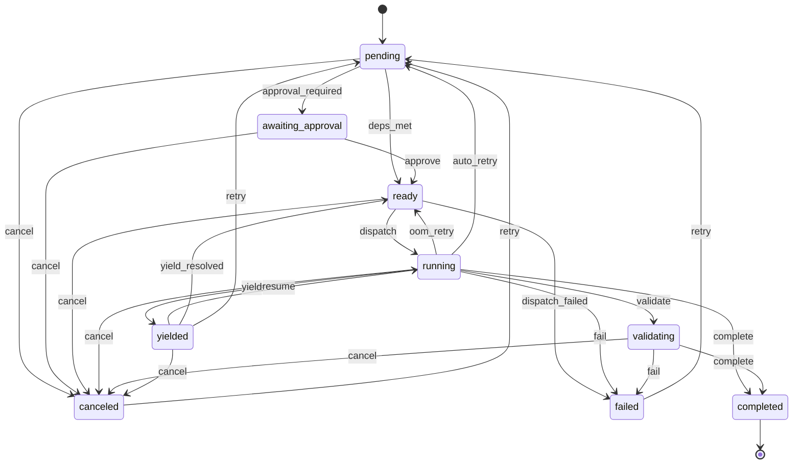
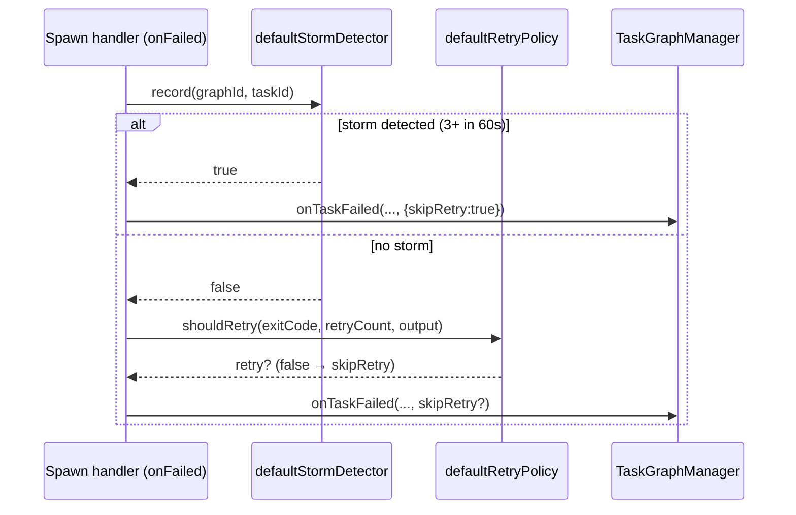
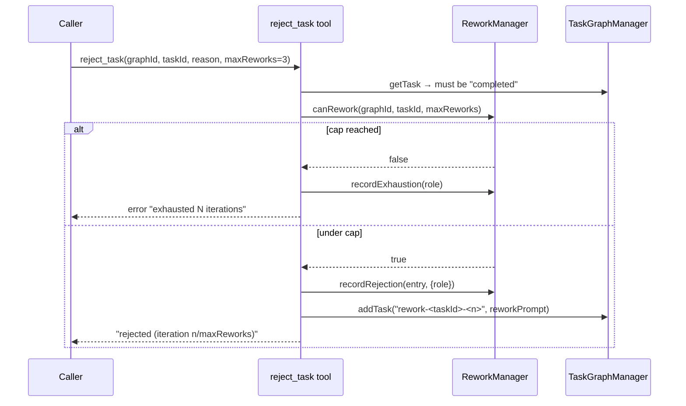

# State Machine & Rework

## Overview

This subsystem owns the **task lifecycle**: the authoritative set of legal task-status transitions, plus the two recovery mechanisms layered on top of it — *retry* (re-run a failed task) and *rework* (reject a completed task and spawn a corrective follow-up task). The state machine is a single declarative transition table that every status write must pass through, replacing what used to be scattered, unvalidated `updateTaskStatus` field writes (`src/state-machine.ts › TRANSITIONS`). It exists to turn silent status corruption into a loud, debuggable `StateTransitionError` and to make the lifecycle auditable in one place (`src/state-machine.ts › StateTransitionError`). Dispatch mechanics — how a `ready` task actually becomes a running agent — live in [Task Graph Engine](Task%20Graph%20Engine.md), not here.

## Responsibilities

- Define the nine task statuses and the legal transitions between them as the single source of truth (`src/state-machine.ts › TaskStatus`, `src/state-machine.ts › TRANSITIONS`).
- Validate every transition: return a transition name on success, `undefined` for a same-state no-op, throw `StateTransitionError` for any transition not in the table (`src/state-machine.ts › transition`).
- Expose lifecycle helpers `isTerminal()` and `canTransitionTo()` (`src/state-machine.ts › isTerminal`, `src/state-machine.ts › canTransitionTo`).
- Decide whether a failed agent process should be retried, based on exit code, attempt count, and non-retryable log patterns (`src/retry-policy.ts › RetryPolicy.shouldRetry`).
- Detect retry storms — three or more distinct task failures in one graph within 60 s (`src/retry-policy.ts › RetryStormDetector.record`).
- Track per-task rework (rejection) history in Redis and enforce a rework iteration cap (`src/rework-manager.ts › ReworkManager`).
- Emit `bureau.rework.iterations` and `bureau.rework.exhausted` telemetry counters (`src/rework-manager.ts › ReworkManager.recordRejection`, `src/rework-manager.ts › ReworkManager.recordExhaustion`).
- Provide the **rework-integrity primitives** — pure decision functions that gate the bounded auto-rework loop's promote step against gamed "fixes": a two-tier fix-integrity guard, a SHA-pin TOCTOU guard, and best-effort merge-conflict branch cleanup (`src/rework/fix-integrity.ts › evaluateFixIntegrity`, `src/rework/sha-pin.ts › checkHeadPin`, `src/rework/conflict-cleanup.ts › cleanupReworkConflictBranches`). The orchestration that calls them lives in [Task Graph Engine](Task%20Graph%20Engine.md).

## Key flows

### Task lifecycle state machine

The diagram shows every status and labelled transition exactly as declared in the `TRANSITIONS` table; the table has 9 states and 24 transitions (`src/state-machine.ts › TRANSITIONS`, `test: tests/.../state-machine.test.ts > "contains exactly 24 valid transitions total"`).

`completed` is the only true terminal state (zero outgoing transitions); `failed` and `canceled` are terminal except for the single `retry → pending` recovery edge (`src/state-machine.ts › TRANSITIONS`, `test: tests/.../state-machine.test.ts > "failed has exactly 1 outgoing transition (→ pending retry)"`). `transition()` is called from exactly one enforcement point, `TaskGraphManager.updateTaskStatus`, and `updateTaskFields` throws if handed a `status` field so no caller can bypass validation (`src/task-graph.ts › TaskGraphManager.updateTaskStatus`, `src/task-graph.ts › TaskGraphManager.updateTaskFields`).

### Retry decision on agent failure

When an agent process exits non-zero, the MCP server's `onFailed` handler runs storm detection first, then the retry-policy gate, before delegating the actual status change to the graph engine. This sequence is from `src/mcp-server.ts:329-401`.

Inside `onTaskFailed`, when retry is *not* skipped: an OOM/SEGFAULT kill (exit 137/139) on a fresh task auto-retries once even when `maxRetries` is 0, routing `running → ready` (the `oom_retry` edge) and re-dispatching **immediately** with no backoff; that immediate re-dispatch is an **authoritative** dispatch (`dispatchReadyTasks(..., { authoritative: true })`) so a worker-failure-driven retry on the processing engine bypasses the foreign-owner skip and claims ownership at dispatch (`src/task-graph.ts › TaskGraphManager.onTaskFailed`). Otherwise, if `task.retries < task.maxRetries`, the task is reset to `pending` via `resetTaskForRetry` and re-dispatch is **scheduled after an exponential backoff delay** rather than fired synchronously (`src/task-graph.ts › TaskGraphManager.onTaskFailed`). The delay is `retryPolicy.nextBackoffMs(retriesBefore)` computed from the pre-increment retry count, so the first retry waits `backoffMs` and each subsequent retry multiplies by `backoffMultiplier` up to `maxBackoffMs` (`src/task-graph.ts › TaskGraphManager.onTaskFailed`, `src/retry-policy.ts › RetryPolicy.nextBackoffMs`). When the computed delay is `<= 0` (test-injected or disabled-backoff policies) re-dispatch is still synchronous via the zero-delay branch (`src/task-graph.ts › TaskGraphManager.onTaskFailed`). Only when neither retry path applies does the task move to `failed` and cascade-cancel its dependents (`src/task-graph.ts › TaskGraphManager.onTaskFailed`).

`resetTaskForRetry` also carries a **pod-mode retry-resume (E1)** behavior: when the failed task is a k8s pod-mode task (`podMode`) that has a recorded `checkpointBranch`, the reset copies that branch onto the retried task's `gitBaseRef`/`gitBranch`, so the retried pod resumes from the worker's WIP checkpoint rather than from the original base ref (`src/task-graph.ts › TaskGraphManager.resetTaskForRetry`, `src/types/graph.ts › TaskNode`). The checkpoint is recorded by the interrogation watcher via `markCheckpointBranch` when it kills a stuck pod-mode worker — both on the interrogation confident-stuck early-kill path and on the `timeoutMs` hard-kill path (`src/task-graph.ts › TaskGraphManager.markCheckpointBranch`, `src/health-sweep.ts:210-216`, `src/health-sweep.ts:250-256`); see [Task Graph Engine](Task%20Graph%20Engine.md) for the interrogation/watcher path.

The backoff is implemented as an `unref`'d `setTimeout` registered in a per-graph `retryTimers` map; the timer callback re-checks graph status before dispatching (it skips canceled/completed/failed graphs) and contains any re-dispatch rejection by warn-logging it rather than letting it escape as an unhandled rejection that the `mcp-server.ts` global handler would turn into `process.exit(1)` (`src/task-graph.ts › TaskGraphManager.onTaskFailed`). `cancelGraph()` clears all pending retry timers for the graph so an in-flight backoff cannot dispatch into a just-canceled graph (`src/task-graph.ts › TaskGraphManager.cancelGraph`). An operator carve-out is documented and tested: `retry_task` / `resume_graph` call `resumeDispatch` unconditionally and so dispatch a mid-backoff task early; the late-firing timer is then a safe no-op because `resumeDispatch` only acts on `ready`/`pending` tasks (`src/task-graph.ts › TaskGraphManager.resumeDispatch`, `test: tests/retry-backoff.test.ts > "R8: operator resumeDispatch during backoff fires early; late timer fire is a no-op (no double-dispatch)"`).

### Rework (reject a completed task)

`reject_task` only accepts a `completed` task, checks the rework cap, records the rejection, and adds a *new* `rework-<taskId>-<iteration>` task rather than mutating the original task's status. This flow is from `src/tools/reject-task.ts › registerRejectTask`. The rejecter recorded on each `ReworkEntry` is resolved from the live connection context (`getContext(extra).sessionId`) rather than a session id closed over at registration time — the tool is registered with its `ContextResolver` passed as the trailing arg to `registerInstrumentedTool`, so the resolver runs per call (`src/tools/reject-task.ts › registerRejectTask`).

**Caller scoping.** A caller that is itself a graph worker — one whose resolved context carries a `taskId` — may reject *only* the tasks its own task's `reviewLoop.canReject` list explicitly names, and only within its own graph: a cross-graph `graphId` is rejected, and a target not in `canReject` is rejected with the allowed list echoed back. Operator/coordinator callers (no `taskId` in context — not spawned as a graph worker) remain unrestricted, matching the prior behavior. This closes a privilege gap where a minimal-profile reviewer granted `reject_task` for its own review loop could reject any completed task in any graph (`src/tools/reject-task.ts › registerRejectTask`).

The rework history (a Redis list at `graph:<graphId>:rework:<taskId>`, 1-day TTL) is readable through the `get_rework_history` tool, which renders each `ReworkEntry`'s iteration, reason, rejecter (first 8 chars), timestamp, and — when present — its `outcome` (`src/rework-manager.ts › ReworkManager.getHistory`, `src/tools/get-rework-history.ts › buildGetReworkHistoryHandler`, `src/types/task.ts › ReworkEntry`). The rejecter field is the session id resolved from the request context at rejection time (`src/tools/reject-task.ts › registerRejectTask`). The tool response is a **structured envelope**: the human-readable lines, then a `\n---\n` separator, then a JSON block `{ "entries": [...] }` — emitted even when the list is empty (`{ "entries": [] }`), so a machine consumer never has to parse prose (`src/tools/get-rework-history.ts › buildGetReworkHistoryHandler`, `test: src/__tests__/get-rework-history-envelope.test.ts > "returns structured empty entries when history is empty"`). The handler was split out as `buildGetReworkHistoryHandler` so tests can drive it without MCP registration (`src/tools/get-rework-history.ts › buildGetReworkHistoryHandler`).

### Rework-integrity guards (auto-rework loop)

The bounded auto-rework loop dispatches a fix child for a failed validation gate, re-validates, and — on a pass — promotes the integration branch to the destination base ref. Three **pure decision primitives** live under `src/rework/` to keep that unattended promote honest; they hold no state and touch neither Redis nor git directly (git/Redis access is via injected best-effort hooks). The loop's orchestration — when each is called — is owned by [Task Graph Engine](Task%20Graph%20Engine.md); this note owns the primitives themselves.

**Fix-integrity guard (two tiers).** The cheapest way for a fix agent to green a re-validation gate is to delete, rename, or `.skip` the failing test rather than fix the code; `evaluateFixIntegrity` rejects those (`src/rework/fix-integrity.ts › evaluateFixIntegrity`). Tier 1 (structured): `findFailedCoverageCriterion` picks the at-most-one coverage-gated exec criterion *iff* it was among the round's failing criteria, and `checkCoverageStillGated` confirms that exact criterion + id set is still what re-validation dispatched — defense-in-depth against round-to-round criteria drift (`src/rework/fix-integrity.ts › findFailedCoverageCriterion`, `src/rework/fix-integrity.ts › checkCoverageStillGated`). Tier 2 (diff-shape): `classifyDiffShape` rejects a diff that deletes a known test file, renames one (to any destination — a rename can silently drop a file out of the runner's glob), adds a per-language skip-marker line inside a changed test file, or — dotnet only — removes more `[Fact]`/`[Theory]` attribute lines than it adds in a modified test file (`src/rework/fix-integrity.ts › classifyDiffShape`, `src/rework/fix-integrity.ts › isKnownTestFilePath`, `src/rework/fix-integrity.ts › SKIP_MARKERS`). Test-file recognition is language-agnostic (a file's own name is evidence); skip-marker scanning runs only when the graph's resolved toolchain has a known marker table, else deletion/rename detection runs alone (`src/rework/fix-integrity.ts › classifyDiffShape`). The diff-shape tier is best-effort: when the diff hook is unavailable it is **skipped, never blocking a legitimate promote** (`src/rework/fix-integrity.ts › evaluateFixIntegrity`). The guard's documented v1 gaps (comment-out-the-assert, conditional early-return, node/python in-file structural test deletion, and build-config gate-neutering) are not caught — a file-existence preflight and downstream PR review are the backstops (`src/rework/fix-integrity.ts › classifyDiffShape`, `test: tests/rework-fix-integrity.test.ts`).

**SHA-pin TOCTOU guard.** Both the promote and the fix-integrity diff read the *live* integration-branch HEAD, opening a window in which a writer with direct push access could slip an un-validated commit into the promote. `sha-pin.ts` closes it: the loop captures the integration HEAD once at re-validation dispatch (`captureIntegrationHeadForPin`, which retries a single transient read), and `checkHeadPin` refuses to promote at pass time if the live HEAD no longer matches the captured SHA (`src/rework/sha-pin.ts › captureIntegrationHeadForPin`, `src/rework/sha-pin.ts › checkHeadPin`). The captured field carries three distinct states: **absent/`undefined`** (no capture capability — no merge hooks) fails *open*, matching every other best-effort HEAD read; **present-but-empty `""`** (a capture was attempted with hooks wired but failed both reads) fails *closed* with a `revalidation_pin_missing` reason, so an observed-but-lost capture can never silently degrade to "no gate"; a **real SHA** is compared, and a mismatch refuses terminally (`src/rework/sha-pin.ts › checkHeadPin`, `src/rework/sha-pin.ts › captureIntegrationHeadForPin`). `resolveIntegrityDiffRange` likewise pins the diff-shape tier's range to `baselineHead..revalidationHead` rather than `..HEAD` (`src/rework/fix-integrity.ts › resolveIntegrityDiffRange`). `readIntegrationHead` is the shared never-throwing hook wrapper (`""` = unknown) (`src/rework/sha-pin.ts › readIntegrationHead`).

**Merge-conflict branch cleanup.** When a rework-fix child's merge into the *parent* integration branch conflicts, the round fails terminally without ever injecting a merge-coordinator, leaving two branches orphaned on origin (the pushed conflict branch and the fix task's own branch). `resolveReworkConflictCleanupTargets` returns exactly those two targets only on the rework-fix conflict path (and `[]` for every success strategy or first-round conflict, which hands its branch to a coordinator instead), and `cleanupReworkConflictBranches` best-effort deletes them — de-duping, dropping falsy entries, and never throwing, blocking, or changing the already-decided round outcome (`src/rework/conflict-cleanup.ts › resolveReworkConflictCleanupTargets`, `src/rework/conflict-cleanup.ts › cleanupReworkConflictBranches`). Correctness is independent of this cleanup: the parent integration branch is already reset by the merge routine before it returns "conflict" — this removes only branch litter (`src/rework/conflict-cleanup.ts › resolveReworkConflictCleanupTargets`).

## Public interface

### `src/state-machine.ts`

- `transition(from, to, taskId, graphId): TransitionName | undefined` — validates a transition; `undefined` for same-state no-op, throws `StateTransitionError` otherwise (`src/state-machine.ts › transition`).
- `isTerminal(status): boolean` — true for `completed`, `failed`, `canceled` (`src/state-machine.ts › isTerminal`).
- `canTransitionTo(from, to): boolean` — non-throwing transition check; true for same-state (`src/state-machine.ts › canTransitionTo`).
- `TRANSITIONS` — the readonly `Map<from, Map<to, TransitionName>>` authoritative table (`src/state-machine.ts › TRANSITIONS`).
- `StateTransitionError` — carries `taskId`, `graphId`, `from`, `to` (`src/state-machine.ts › StateTransitionError`).
- `TaskStatus`, `TransitionName`, `Transition` types (`src/state-machine.ts › TaskStatus`, `src/state-machine.ts › TransitionName`).

### `src/rework-manager.ts` — `class ReworkManager`

- `recordRejection(graphId, taskId, entry, context?)` — RPUSH the `ReworkEntry`, set TTL, increment the rework-iterations counter (`src/rework-manager.ts › ReworkManager.recordRejection`).
- `recordExhaustion(role)` — emit `bureau.rework.exhausted` (`src/rework-manager.ts › ReworkManager.recordExhaustion`).
- `getHistory(graphId, taskId): Promise<ReworkEntry[]>` (`src/rework-manager.ts › ReworkManager.getHistory`).
- `canRework(graphId, taskId, maxReworks): Promise<boolean>` — `llen < maxReworks` (`src/rework-manager.ts › ReworkManager.canRework`).
- `getReworkCount(graphId, taskId): Promise<number>` (`src/rework-manager.ts › ReworkManager.getReworkCount`).

### `src/retry-policy.ts`

- `class RetryPolicy` — `shouldRetry(exitCode, retryCount, logTail): boolean` and `nextBackoffMs(retryCount): number` (`src/retry-policy.ts › RetryPolicy.shouldRetry`, `src/retry-policy.ts › RetryPolicy.nextBackoffMs`).
- `class RetryStormDetector` — `record(graphId, taskId): boolean`, `reset(graphId)`, `failureCount(graphId): number` (`src/retry-policy.ts › RetryStormDetector`, `src/retry-policy.ts › RetryStormDetector.record`).
- `defaultRetryPolicy`, `defaultStormDetector` — process-wide singletons used by the MCP server (`src/retry-policy.ts › defaultRetryPolicy`, `src/retry-policy.ts › defaultStormDetector`, `src/mcp-server.ts:329-401`).

### `src/rework/` — auto-rework integrity primitives (pure)

- `evaluateFixIntegrity(input): GuardVerdict` — the full two-tier guard; `{ok:true}` accepts the fix for promotion (`src/rework/fix-integrity.ts › evaluateFixIntegrity`).
- `findFailedCoverageCriterion(failure, execCriteria)` / `checkCoverageStillGated(failedCoverage, revalidationCriteria)` — tier 1, structured coverage-id gating (`src/rework/fix-integrity.ts › findFailedCoverageCriterion`, `src/rework/fix-integrity.ts › checkCoverageStillGated`).
- `classifyDiffShape(input): GuardVerdict` — tier 2, diff-shape rejection; `isKnownTestFilePath(path)` and the per-language `SKIP_MARKERS` table back it; `parseNameStatus(out)` parses `git diff --name-status -M` into `DiffFile[]` (`src/rework/fix-integrity.ts › classifyDiffShape`, `src/rework/fix-integrity.ts › isKnownTestFilePath`, `src/rework/fix-integrity.ts › SKIP_MARKERS`, `src/rework/fix-integrity.ts › parseNameStatus`).
- `resolveIntegrityDiffRange(baselineOrStartHead, revalidationHead)` — pins tier 2's diff range to the captured SHA (`src/rework/fix-integrity.ts › resolveIntegrityDiffRange`).
- `checkHeadPin(revalidationHead, liveHead): GuardVerdict` — promote-time TOCTOU guard (`src/rework/sha-pin.ts › checkHeadPin`).
- `captureIntegrationHeadForPin(hooks, graphId, destName)` — capture-with-one-retry; `undefined` (no capability) vs `""` (attempted-and-failed) are distinct (`src/rework/sha-pin.ts › captureIntegrationHeadForPin`).
- `readIntegrationHead(hooks, graphId, destName): Promise<string>` — never-throwing best-effort HEAD read, `""` = unknown (`src/rework/sha-pin.ts › readIntegrationHead`).
- `resolveReworkConflictCleanupTargets(input)` / `cleanupReworkConflictBranches(hooks, branches, destName, onFailure?)` — orphan-branch cleanup on the rework-fix conflict path (`src/rework/conflict-cleanup.ts › resolveReworkConflictCleanupTargets`, `src/rework/conflict-cleanup.ts › cleanupReworkConflictBranches`).

### MCP tools

- `reject_task(graphId, taskId, reason, fixerRole?, maxReworks=3)` — registered with a `ContextResolver` (`getContext`) so the rejecter id is read per-call from the request context; a graph-worker caller is scoped to its own graph and `reviewLoop.canReject` list (`src/tools/reject-task.ts › registerRejectTask`).
- `get_rework_history(graphId, taskId)` — returns a human-readable summary plus a `\n---\n`-delimited `{ entries: [...] }` JSON envelope; the core logic is `buildGetReworkHistoryHandler`, callable without MCP registration (`src/tools/get-rework-history.ts › registerGetReworkHistory`, `src/tools/get-rework-history.ts › buildGetReworkHistoryHandler`).

## Dependencies

- **Redis** — rework history lists (`graph:<graphId>:rework:<taskId>`) with an 86 400 s TTL (`src/rework-manager.ts › TTL`, `src/rework-manager.ts › ReworkManager.recordRejection`). See [Redis & Connection Layer](Redis%20%26%20Connection%20Layer.md).
- **[Task Graph Engine](Task%20Graph%20Engine.md)** (`src/task-graph.ts`) — sole consumer of `transition()`; owns `onTaskFailed`, `resetTaskForRetry`, `retryTask`, and dispatch (`src/task-graph.ts › TaskGraphManager.updateTaskStatus`, `src/task-graph.ts › TaskGraphManager.onTaskFailed`).
- **`RetryPolicy`** (`src/retry-policy.ts`) — injected into `TaskGraphManager` via an optional constructor parameter defaulting to `defaultRetryPolicy`; `onTaskFailed` calls `nextBackoffMs` on it to schedule backed-off re-dispatch (`src/task-graph.ts › TaskGraphManager.onTaskFailed`, `src/retry-policy.ts › RetryPolicy.nextBackoffMs`).
- **Telemetry domain** (`src/telemetry/domain/task.ts`) — `recordReworkIteration` / `recordReworkExhausted` back the rework counters (`src/rework-manager.ts › ReworkManager.recordRejection`, `src/telemetry/domain/task.ts › recordReworkIteration`, `src/telemetry/domain/task.ts › recordReworkExhausted`).
- **`ReworkEntry` type** (`src/types/task.ts › ReworkEntry`); `TaskStatus` is re-exported from the state machine, making `state-machine.ts` the type authority.
- The retry/storm singletons are wired into the spawn failure handler in `src/mcp-server.ts:329-401`. See [Spawn & PTY](Spawn%20%26%20PTY.md).

## Configuration

`RetryPolicy` and `RetryStormDetector` take constructor options; the process uses the all-default singletons (`src/retry-policy.ts › RetryPolicy`, `src/retry-policy.ts › RetryStormDetector`, `src/retry-policy.ts › defaultRetryPolicy`, `src/retry-policy.ts › defaultStormDetector`).

| Option | Type | Default | Effect |
|---|---|---|---|
| `maxRetries` | number | 3 | `shouldRetry` returns false once `retryCount >= maxRetries` (`src/retry-policy.ts › RetryPolicy`, `src/retry-policy.ts › RetryPolicy.shouldRetry`) |
| `backoffMs` | number | 5000 | Base backoff for `nextBackoffMs` (`src/retry-policy.ts › RetryPolicy`, `src/retry-policy.ts › RetryPolicy.nextBackoffMs`) |
| `backoffMultiplier` | number | 2 | Exponential factor per attempt (`src/retry-policy.ts › RetryPolicy`, `src/retry-policy.ts › RetryPolicy.nextBackoffMs`) |
| `maxBackoffMs` | number | 60000 | Caps `nextBackoffMs` output (`src/retry-policy.ts › RetryPolicy`, `src/retry-policy.ts › RetryPolicy.nextBackoffMs`) |
| `retryableExitCodes` | number[] | `[1]` | Only these exit codes are retryable (`src/retry-policy.ts › RetryPolicy`, `src/retry-policy.ts › RetryPolicy.shouldRetry`) |
| `nonRetryable` | string[] | API-key/auth/EACCES/EPERM/`--strict-mcp-config` patterns | Any match in the log tail blocks retry (`src/retry-policy.ts › DEFAULT_NON_RETRYABLE`, `src/retry-policy.ts › RetryPolicy.shouldRetry`) |
| storm `windowMs` | number | 60000 | Sliding window for storm detection (`src/retry-policy.ts › RetryStormDetector`) |
| storm `threshold` | number | 3 | Distinct-task failures in-window that trigger a storm (`src/retry-policy.ts › RetryStormDetector`, `src/retry-policy.ts › RetryStormDetector.record`) |
| rework `maxReworks` | number | 3 | `reject_task` cap on rework iterations (`src/tools/reject-task.ts › registerRejectTask`) |
| rework list `TTL` | seconds | 86400 | Expiry on the Redis rework list (`src/rework-manager.ts › TTL`) |

## Failure modes

- **Invalid transition** → `transition()` throws `StateTransitionError` with `from`, `to`, `taskId`, `graphId`; the message contains both IDs (`src/state-machine.ts › StateTransitionError`, `test: tests/.../state-machine.test.ts > "error message includes taskId and graphId"`).
- **Double-completion race** (process monitor + exit handler firing for the same task) → handled idempotently: same-state transition is a no-op, and `onTaskFailed`/`onTaskCompleted` bail early on terminal status (`src/state-machine.ts › transition`, `src/task-graph.ts › TaskGraphManager.onTaskFailed`).
- **Retry storm** (3+ distinct failures / graph / 60 s) → escalation halts: the failing task is forced to `failed` with `skipRetry`, a warning is logged and sent over MCP (`src/mcp-server.ts:329-401`, `src/retry-policy.ts › RetryStormDetector.record`).
- **Non-retryable failure** (auth/permission/config patterns in log tail) → `shouldRetry` returns false, task goes straight to `failed` (`src/retry-policy.ts › RetryPolicy.shouldRetry`, `src/retry-policy.ts › DEFAULT_NON_RETRYABLE`, `test: tests/retry-policy.test.ts > "RetryPolicy — shouldRetry"`).
- **OOM/SEGFAULT** (exit 137/139, first attempt) → auto-retries once even with `maxRetries: 0` via the `oom_retry` edge, re-dispatched immediately (authoritatively, bypassing the foreign-owner skip) with no backoff (`src/task-graph.ts › TaskGraphManager.onTaskFailed`).
- **Re-dispatch into a canceled graph** (backoff timer fires after the graph is canceled) → prevented three ways: `cancelGraph()` clears the graph's pending retry timers, the stale-graph reaper `reapStaleGraph()` likewise clears them before marking a stuck `active`/`validating` graph `failed`, and the timer callback itself re-checks graph status before dispatching (`src/task-graph.ts › TaskGraphManager.cancelGraph`, `src/task-graph.ts › TaskGraphManager.reapStaleGraph`, `src/task-graph.ts › TaskGraphManager.onTaskFailed`, `test: tests/retry-backoff.test.ts > "R3: canceling the graph during backoff delay clears the timer, no dispatch fires"`).
- **Transient Redis error inside the backoff timer** → caught and warn-logged in the timer callback instead of escaping as an unhandled rejection that would `process.exit(1)` (`src/task-graph.ts › TaskGraphManager.onTaskFailed`, `test: tests/retry-backoff.test.ts > "R7: resumeDispatch rejection inside backoff timer is caught and warn-logged"`).
- **Rework cap reached** → `reject_task` returns an error, records `bureau.rework.exhausted`, does not add a rework task (`src/tools/reject-task.ts › registerRejectTask`).
- **Unauthorized reject ** → a graph-worker caller rejecting a task outside its own graph, or one its `reviewLoop.canReject` list does not name, gets an `isError` result and no rework task; operator callers are unaffected (`src/tools/reject-task.ts › registerRejectTask`).
- **Gamed "fix" (test deleted/renamed/skipped)** → `evaluateFixIntegrity` returns `{ok:false, reason}`; the auto-rework loop refuses to promote and routes to operator review instead (`src/rework/fix-integrity.ts › evaluateFixIntegrity`, `src/rework/fix-integrity.ts › classifyDiffShape`).
- **Integration HEAD moved after re-validation / lost pin capture** → `checkHeadPin` refuses the promote terminally: a live-HEAD mismatch and a present-but-empty (`""`) captured SHA both fail closed; only an absent (`undefined`) SHA — no capture capability — fails open (`src/rework/sha-pin.ts › checkHeadPin`).
- **Diff/HEAD hook unavailable** → the diff-shape tier and the diff-range pin are skipped (fail-open), never blocking a legitimate promote; a file-existence preflight and PR review remain the backstops (`src/rework/fix-integrity.ts › evaluateFixIntegrity`, `src/rework/fix-integrity.ts › resolveIntegrityDiffRange`).
- **Rework-fix merge conflict** → the round fails terminally (correctness held by the merge routine's own integration-branch reset); `cleanupReworkConflictBranches` best-effort deletes the two orphaned branches and never throws or alters the outcome (`src/rework/conflict-cleanup.ts › cleanupReworkConflictBranches`).
- **Telemetry sink failure** → counter calls are wrapped in `try/catch` and swallowed, so telemetry never breaks the lifecycle (`src/rework-manager.ts › ReworkManager.recordRejection`, `src/rework-manager.ts › ReworkManager.recordExhaustion`).

## Open questions

- Whether `entry.retryCount` passed to `shouldRetry` in the spawn `onFailed` handler is ever populated with a non-zero value for the same task across attempts was not traced end-to-end; the field originates on the peer entry (`src/types/peer.ts`).
- Whether `RetryStormDetector.reset()` is ever called in production (e.g. on graph pause/resume) was not confirmed; it appears to exist for future/manual use.
- The pod-mode retry-resume (E1) branch in `resetTaskForRetry` has no dedicated unit test asserting that `checkpointBranch` is copied onto `gitBaseRef`/`gitBranch` on retry; the test suite covers the interrogator and health-sweep watcher, not this reset behavior. Behavior is asserted here from code only (`src/task-graph.ts › TaskGraphManager.resetTaskForRetry`).

## Related

- [Task Graph Engine](Task%20Graph%20Engine.md)
- [Spawn & PTY](Spawn%20%26%20PTY.md)
- [Redis & Connection Layer](Redis%20%26%20Connection%20Layer.md)
- Acceptance Criteria & Validation
- [Telemetry](Telemetry.md)
