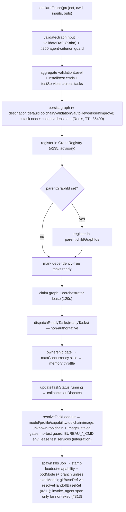
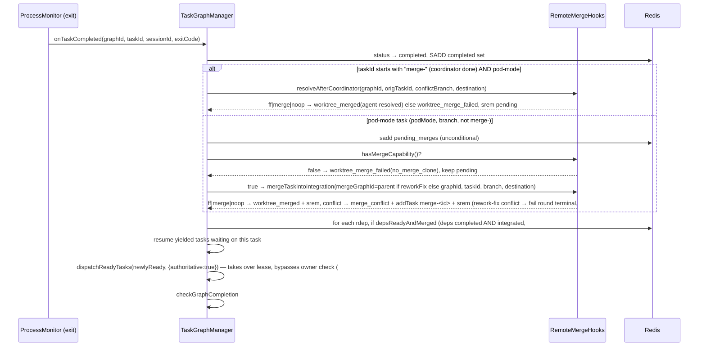
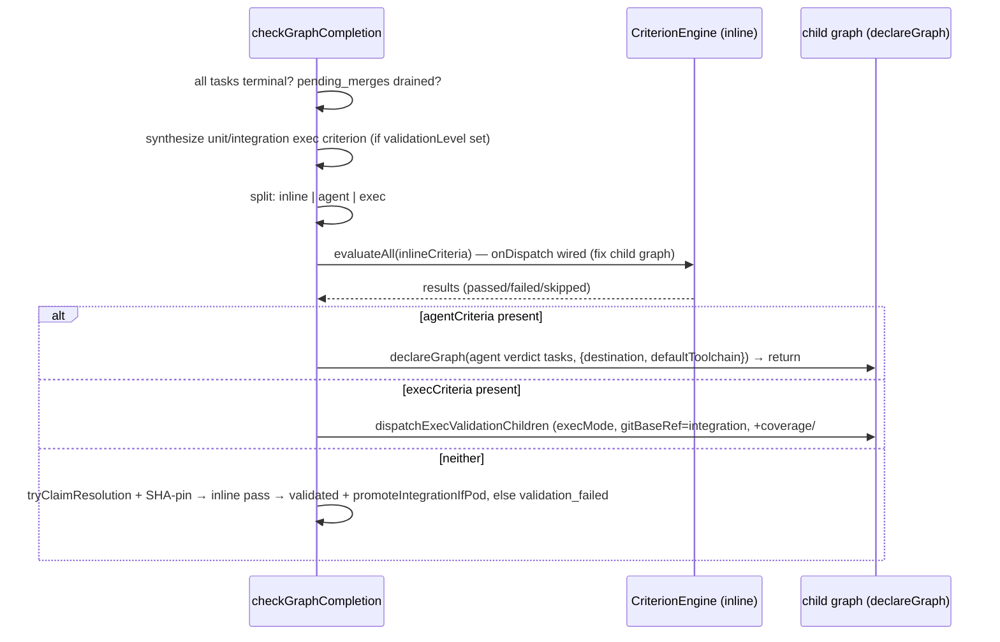
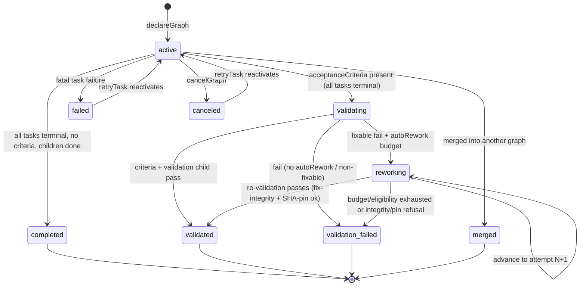

# Task Graph Engine

## Overview

The Task Graph Engine is the DAG scheduler at the heart of the Bureau MCP server: it accepts a set of task nodes with declared dependencies, validates that they form an acyclic graph, and dispatches agents as their dependencies complete (`src/task-graph.ts › declareGraph`). All graph and task state lives in Redis under `graph:*` keys with a 24-hour TTL, so the engine is stateless between calls and safe to drive from any MCP tool handler (`src/task-graph.ts › TTL`, `src/task-graph.ts › getGraph`). `TaskGraphManager` owns scheduling, retry, cancellation, validation, pod-mode remote-merge orchestration, and graph composition; the actual agent spawn and event side effects are delegated to two injected callbacks (`onDispatch`, `onEvent`) built in `graph-dispatch.ts` (`src/task-graph.ts › TaskGraphManager`, `src/graph-dispatch.ts › createDispatchHandler`, `src/types/graph.ts › TaskGraphCallbacks`).

As of the k8s-only spawn migration, every worker is dispatched as a k8s Job and isolation is provided per-pod: each worker blobless-clones the destination repo into its own workspace volume and pushes its own branch — there is no engine-side git working tree or worktree to prepare, and `declareGraph` performs no concurrency analysis or `baseCommit` snapshot (`src/task-graph.ts › declareGraph`). The engine-side host-mode worktree path (`worktree.ts`, the `MergeQueue`/`attemptMerge` local merge, the `isolateParallel`/`isolate` flags) and the entire terminal-streaming subsystem were deleted in that migration; branch integration now flows solely through the pod-mode `RemoteMergeHooks` seam (`src/task-graph.ts › onTaskCompleted`). Workers push their branches and the engine integrates them via per-graph integration branches — see Pod-mode Git Merge and k8s Spawn Strategy for the infra mechanics (`src/task-graph.ts › setRemoteMerge`).

Two behaviors added since the k8s-only migration are central to the current shape. **Integration-branch handoff:** a dependent no longer dispatches merely when its dependencies reach `completed` — the engine holds it until each dependency's work is actually *integrated* onto the per-graph integration branch (the `depsReadyAndMerged` predicate), and a pod-mode dependent clones off that integration branch rather than the base ref, so `impl→impl` and `impl→review` chains see their predecessors' committed work (`src/task-graph.ts › depsReadyAndMerged`, `src/spawn/integration-branch.ts › resolveHandoffBaseRef`). **Bounded auto-rework:** an opt-in per-graph `autoRework` budget lets a failed mechanical validation gate spawn a fix agent and re-run the gate up to a hard cap of 3 attempts, driven through a new non-terminal `reworking` graph status; the deep reconciler mechanics are owned by [State Machine & Rework](State%20Machine%20%26%20Rework.md), while the completion-path integration (the `reworking` branch of `checkGraphCompletion`, the per-graph/attempt completion lock, and the SHA-pin promote guards) is documented here (`src/task-graph.ts › maybeStartRework`, `src/types/graph.ts › GraphStatus`).

A graph may carry an optional `destination` naming a registry entry (a named git repo/baseRef/secret), so one engine can serve graphs targeting different repositories; the engine threads that name into every RemoteMerge call and into the worker Job's git config, while an absent `destination` resolves to the registry default and preserves single-repo behavior — the destination *registry* itself is owned by the infra track (Pod-mode Git Merge, `src/task-graph.ts › declareGraph`, `src/types/graph.ts › TaskGraph`). The `RemoteMergeHooks` seam (`setRemoteMerge`) is wired only when a non-empty git registry is loaded (any engine with `BUREAU_GIT_URL`); in stdio/no-registry mode `remoteMerge` stays undefined and every pod-mode branch is inert (`src/task-graph.ts › setRemoteMerge`, `src/mcp-server.ts › loadGitRegistry`).

## Responsibilities

- Validate that declared tasks form a DAG via Kahn's-algorithm topological sort, rejecting unknown dependencies and cycles before any state is written — the check lives in the extracted `graph-validate.ts` seam (`src/graph-validate.ts › validateDAG`, `test: src/__tests__/graph-validate.test.ts > "throws on a cycle"`, `test: src/__tests__/graph-validate.test.ts > "throws on an unknown dependency id"`).
- At declaration, reject a graph that mixes an `agent` acceptance criterion with a task-level `unit`/`integration` `validation` gate — the guard, since the gate is synthesized as an `exec` criterion at completion and the agent/exec dispatch split would silently drop it (`src/graph-validate.ts › validateGraphInput`, `test: src/__tests__/graph-validate.test.ts > "throws when an agent criterion is mixed with a unit/integration gate"`).
- Persist graph and task nodes to Redis and maintain the dependency index sets `deps:*`, `rdeps:*`, `taskIds`, and `completed` (`src/task-graph.ts › declareGraph`).
- Mark dependency-free tasks `ready` and dispatch them; promote dependent tasks to `ready` as their dependencies complete (`src/task-graph.ts › declareGraph`, `src/task-graph.ts › onTaskCompleted`).
- Drive every task status change through the validated [State Machine & Rework](State%20Machine%20%26%20Rework.md) transition table rather than writing status directly (`src/task-graph.ts › updateTaskStatus`).
- Retry failed tasks (automatic OOM/segfault retry, `maxRetries` retry with backoff, and manual `retry_task`) and cascade-cancel downstream tasks on fatal failure (`src/task-graph.ts › onTaskFailed`, `src/task-graph.ts › retryTask`, `src/task-graph.ts › cascadeCancel`).
- Resolve each task's model, MCP profile, capability, and worker image at dispatch through the single shared `resolveTaskLoadout` resolver (per-task `toolchain` falling back to the graph's `defaultToolchain`, then the registry default), gate the resolved image through the `ImageCatalog` allowlist, and fail the task loudly when the named toolchain is unknown or the image is unapproved (`src/graph-dispatch.ts › createDispatchHandler`, `src/runtime/resolve-loadout.ts › resolveTaskLoadout`). See k8s Spawn Strategy.
- Thread per-task build/test commands into the worker pod as `BUREAU_*_CMD` env vars, and run an exec-criterion validation pod token-free via `BUREAU_EXEC_CMD` (no Claude) (`src/graph-dispatch.ts › createDispatchHandler`).
- Aggregate each task's `validation` depth (`self`/`unit`/`integration`, taking the max), install/test/integration-test commands, toolchain, and `testServices` onto the graph node at declaration, so the completion-time validation gate can synthesize a mechanical exec criterion (`src/task-graph.ts › declareGraph`).
- In k8s/pod mode, integrate each pod-mode worker's pushed branch into a per-graph integration branch through the `RemoteMergeHooks` seam (only on an engine that reports `hasMergeCapability`), and promote the integration branch to the destination base ref on graph completion or after acceptance-criteria validation — excluding exec-mode pods, which run a command directly and push no branch (`src/task-graph.ts › onTaskCompleted`, `src/task-graph.ts › promoteIntegrationIfPod`). See Pod-mode Git Merge.
- Compose graphs: parent/child nesting with event bubbling and depth limiting, and `merge_graphs` absorbing one active graph into another (`src/task-graph.ts › getGraphDepth`, `src/task-graph.ts › mergeGraphs`, `src/task-graph.ts › emitEvent`).
- Detect graph completion (idempotently on terminal graphs), run acceptance criteria (inline, agent-child-graph, and exec-child-graph), and emit the lifecycle event stream consumed by the orchestrator and telemetry (`src/task-graph.ts › checkGraphCompletion`).
- Reap a graph stuck non-terminal (`active`/`validating`/`reworking`) with no live tasks via `reapStaleGraph`, marking it `failed` so the orchestrator does not wait forever (`src/task-graph.ts › reapStaleGraph`).
- Gate every dependent's dispatch on its dependencies being *integrated* (not merely `completed`) via `depsReadyAndMerged`, and base a pod-mode dependent's clone off the per-graph integration branch through `resolveHandoffBaseRef`, so `dependsOn` chains receive their predecessors' merged work (`src/task-graph.ts › depsReadyAndMerged`, `src/task-graph.ts › readyDependentsOf`, `src/spawn/integration-branch.ts › resolveHandoffBaseRef`).
- Run an opt-in bounded auto-rework loop (`autoRework`, hard-capped at 3 attempts) that intercepts a fixable mechanical-validation failure, enters the non-terminal `reworking` status, dispatches a fix-agent child graph, and re-runs the gate — giving up to terminal `validation_failed` when the budget/eligibility runs out (`src/task-graph.ts › maybeStartRework`, `src/task-graph.ts › resumeReworkRound`). See [State Machine & Rework](State%20Machine%20%26%20Rework.md).
- Serialize each graph's `validated→promote` (and `→completed`) resolution behind a per-graph/attempt completion lock so two validation children finishing in the same tick cannot both promote (`src/task-graph.ts › tryClaimResolution`).
- Refuse to promote when the live integration-branch HEAD has moved since the validation gate was dispatched — the first-pass and per-round SHA-pin guards close the re-validate→promote TOCTOU window (`src/task-graph.ts › checkValidationDispatchPin`, `src/task-graph.ts › checkHeadPinForPromote`).

## Shared declare-time validation & loadout resolution

Two pure functions are the single source of truth shared between the live declare/dispatch path and the `declare_task_graph` **dry-run** preview (the dry-run *tool* itself is documented in [MCP Server Core & Tool Surface](MCP%20Server%20Core%20%26%20Tool%20Surface.md)):

- **`validateGraphInput(inputs, acceptanceCriteria?)`** (`src/graph-validate.ts › validateGraphInput`) runs the declare-time checks that are pure functions of the input: (1) `validateDAG` — the Kahn's-algorithm topological sort rejecting unknown-dep ids and cycles, extracted verbatim from the former `TaskGraphManager.validateDAG` (`src/graph-validate.ts › validateDAG`); (2) the guard rejecting an `agent` criterion combined with a task-level `unit`/`integration` `validation` gate (the level is computed by the extracted `maxValidationLevel`, `src/graph-validate.ts › maxValidationLevel`); and (3) the requirement-coverage guard — `coverageIds` is valid only on an `exec` criterion, each id must match `^[A-Za-z0-9._-]+$`, and at most one exec criterion per graph may carry `coverageIds` (`src/graph-validate.ts › validateGraphInput`). `declareGraph` calls it (`validateGraphInput(inputs, opts?.acceptanceCriteria)`) before persisting any state, and `buildDryRunReport` calls the *identical* function, surfacing a throw as a `graph-invalid` finding instead of crashing — so the preview can never diverge from what declare enforces (`src/task-graph.ts › declareGraph`, `src/tools/dry-run.ts › buildDryRunReport`). The engine's own private `validateDAG` now merely delegates to the extracted `validateDAG`, and remains the DAG check for `addTask` and `mergeGraphs` (`src/task-graph.ts › validateDAG`).
- **`resolveTaskLoadout(args)`** (`src/runtime/resolve-loadout.ts › resolveTaskLoadout`) is the pure per-task resolver that returns a `TaskPlan` — resolved `model` (with the per-task `task.model` override already applied), `capabilityTemplate`, `mcp`/`harness`/`suppressMemory` capability, agent `category`, provider env, and the resolved `toolchainName`/`image` — capturing any resolver throw into `plan.resolveError` rather than raising (`src/runtime/resolve-loadout.ts › TaskPlan`). The live dispatch handler and the dry-run preview both call it, so the resolved model/profile/capability/toolchain/image can never drift between "what dry-run shows" and "what dispatch spawns" (`src/graph-dispatch.ts › createDispatchHandler`, `src/tools/dry-run.ts › buildDryRunReport`). It also injects the `reject_task` MCP tool into the resolved capability for any task carrying a `reviewLoop`, applied regardless of resolve success/failure, so a minimal-profile reviewer can actually block promotion on a REJECT verdict — `lintPlan` carries a tripwire `reviewloop-no-reject` finding that should never fire (`src/runtime/resolve-loadout.ts › resolveTaskLoadout`, `src/tools/dry-run.ts › lintPlan`). The two *impure* gates it deliberately excludes — an unknown NAMED toolchain (left with `image` undefined) and the async `ImageCatalog` approval — stay in the dispatch handler; dry-run mirrors them as `unknown-toolchain`/`image-not-approved` findings in `lintPlan` (`src/tools/dry-run.ts › lintPlan`).

Auto-rework configuration is resolved by two sibling pure functions in `resolve-graph-input.ts`: `normalizeAutoRework` floors/caps the raw `{maxAttempts, fixRole}` (default 1 when present-but-unset, hard cap 3, `0`/absent/non-finite → off), and `resolveAutoRework` lets a `declare_task_graph` `autoRework` input override the `bureau.buildconfig.json` `autoRework` *wholesale* (presence of the declare key wins, never a per-field merge) (`src/tools/resolve-graph-input.ts › normalizeAutoRework`, `src/tools/resolve-graph-input.ts › resolveAutoRework`).

A **criteria-mixing guard at the tool boundary** is distinct from the engine's guard: `resolveGraphInput` (shared by `declare_task_graph` and `use_template`) rejects mixing `agent` *and* `exec` criteria in the same graph, throwing `GraphInputError` before the engine is called (`src/tools/resolve-graph-input.ts › resolveGraphInput`). The engine-level guard (`validateGraphInput`) instead rejects an `agent` criterion combined with a mechanical `validation` gate.

**Two hard declare-time gate rejects at the tool handler.** After `resolveGraphInput` fills defaults, the `declare_task_graph` handler applies two mechanical-gate rejects *before* calling `declareGraph` — placed at the tool-handler layer (not in the engine) so `resolveGraphInput` stays a pure resolver and internal (non-tool) `declareGraph` callers keep a softer warn-and-proceed. (1) **No-test:** `findUnresolvedValidationGate` returns the first task declaring `validation` (any level, including `self`) with no resolved `test`, and the handler returns an educational `isError` naming the task and the three remedies (`set task.test`, bind a buildConfig service, or drop the field) — instead of letting the task die ~70 ms later at dispatch with a null sessionId and cascade-canceling dependents (`src/tools/declare-task-graph.ts › registerDeclareTaskGraph`, `src/tools/dry-run.ts › findUnresolvedValidationGate`, `src/tools/dry-run.ts › formatUnresolvedValidationGateError`). (2) **No-install:** `hasValidationInstallGap` flags a graph that has a unit-or-higher gated task (validation priority ≥ 2) where *no* gated task provides a way to install dependencies — neither a `task.install` (buildConfig service installs are folded onto `task.install` upstream by `applyBuildConfigDefaults`) nor an install step embedded in the test command (the broad `INSTALL_IN_TEST` regex: `npm ci`, `pip install`, `dotnet restore`, `go mod download`, …). Such a gate clones fresh and false-fails the bare test command against an empty checkout, so the handler returns the toolchain-agnostic `GATE_NO_INSTALL_MESSAGE` as an `isError`, escalating what was previously a dry-run-only advisory to a hard reject (`src/tools/declare-task-graph.ts › registerDeclareTaskGraph`, `src/tools/validation-install-gap.ts › hasValidationInstallGap`, `src/tools/validation-install-gap.ts › GATE_NO_INSTALL_MESSAGE`). Two escape hatches keep the check permissive: a test command that self-installs (e.g. `npm ci && vitest`) satisfies it, and a no-op `":"` install explicitly asserts pre-provisioned deps (pre-baked image / warm cache) (`src/tools/validation-install-gap.ts › hasValidationInstallGap`). Both rejects reuse the *exact* predicates the dry-run preview's `gate-no-test`/`gate-no-install` findings use, applied to the same post-buildConfig-fill tasks the dispatcher sees, so preview and live declare cannot diverge (`src/tools/dry-run.ts › lintPlan`).

**Two advisory declare-time warnings (never block declare).** After `declareGraph` succeeds, the handler appends up to two proximity warnings to the human-readable output, each wrapped in `try/catch` so an advisory failure can never block a successful declare. (1) **Coupled-work:** when the `graphRegistry` reports another *active* graph on the same destination (`destKey(destination, cwd)`, filtering out the just-declared graph), `formatCoupledWorkWarning` warns that separate graphs on one destination are not mutually enforced — code-coupled work can merge cleanly yet break at test/runtime — and names any overlapping predicted files (`src/tools/declare-task-graph.ts › formatCoupledWorkWarning`, `src/tools/declare-task-graph.ts › registerDeclareTaskGraph`). (2) **Sibling file-overlap:** `findSiblingFileOverlaps` pairs *parallel-sibling* tasks — neither transitively depends on the other, computed from an iterative transitive-closure (DFS/stack) walk over `dependsOn` — whose predicted file footprints (heuristically parsed from the task prose via `parseFileRefsFromDescription`) overlap, and `formatSiblingOverlapWarning` renders an advisory distinguishing **exact-file** overlaps (concurrent edits that can conflict/clobber) from **same-directory** neighbours (a weaker proximity signal), suggesting a `dependsOn` edge or a task merge (`src/tools/declare-task-graph.ts › registerDeclareTaskGraph`, `src/workspace/sibling-overlap.ts › findSiblingFileOverlaps`, `src/workspace/sibling-overlap.ts › formatSiblingOverlapWarning`, `src/workspace/sibling-overlap.ts › SiblingOverlap`). Each overlap pair is deduped by a `"${a}|${b}"` key (lexically ordered ids; a pipe replaced the original NUL-byte delimiter) (`src/workspace/sibling-overlap.ts › findSiblingFileOverlaps`). This advisory is distinct from the workspace-awareness/lock machinery documented in [Workspace Awareness & Locks](Workspace%20Awareness%20%26%20Locks.md) — it is a pure, declare-time, prose-heuristic seatbelt with no runtime enforcement.

## Key flows

### Declaration and dispatch

This flowchart shows how `declareGraph` turns a set of task inputs into running agents. Under k8s-only dispatch every worker is a k8s Job; there is no engine-side worktree-preparation step.

`declareGraph` generates a UUID graph id, calls `validateGraphInput(inputs, opts?.acceptanceCriteria)` (DAG + guard), aggregates validation/command fields across tasks (see below), and writes the graph plus every task node and its `deps`/`rdeps` index sets to Redis in a pipeline. The node persist carries the per-task `toolchain`, `execMode`, `service`, `install`/`build`/`test`/`integrationTest`/`lint`, `validation`, `podMode`, `gitBaseRef`/`gitBranch`, and (for a rework fix task) `attempt` fields (`src/task-graph.ts › declareGraph`). The graph record additionally persists the per-graph `autoRework` budget and `selfImprove` override, and — when the child is a rework fix graph — the `isReworkFixChild` marker and the round-index `attempt` (both dropped from the JSON when unset) (`src/task-graph.ts › declareGraph`, `src/types/graph.ts › TaskGraph`). Worker isolation is provided per-pod under k8s dispatch — there is no concurrency analysis, no `isolate` auto-marking, and no `baseCommit` snapshot (all removed with the host-mode worktree path) (`src/task-graph.ts › declareGraph`). Before persisting, `declareGraph` walks the task inputs and aggregates the graph-level validation gate: `validationLevel` is the max of every task's `validation` (`integration` > `unit` > `self`), and `validationInstallCmd`/`validationToolchain`/`validationTestCmd` are taken from the first unit-or-higher task that declares each, `validationIntegrationTestCmd` from the first integration-level task, and `testServices` is the union of all integration tasks' service lists (`src/task-graph.ts › declareGraph`). It also registers the graph in the `GraphRegistry` for workspace-awareness (advisory, never blocking declare) (`src/task-graph.ts › declareGraph`). Tasks with no dependencies are transitioned to `ready` and an orchestrator-ownership lease is claimed before `dispatchReadyTasks` runs (`src/task-graph.ts › declareGraph`).

`dispatchReadyTasks(graphId, taskIds, cachedTasks?, opts?)` enforces three gates in order: graph ownership, `maxConcurrency` (slice the dispatch list down to the remaining slots), and memory throttling (abort dispatch when free RAM is below 2.0 GB unless `BUREAU_DISABLE_MEM_THROTTLE=1`) (`src/task-graph.ts › dispatchReadyTasks`). The ownership gate has two modes (`src/task-graph.ts › dispatchReadyTasks`): a **non-authoritative** dispatch (the declare/resume path, `opts.authoritative` unset) reads `graph:<id>:orchestrator` and skips with a `task_stale` event if a different session owns the graph, then claims/renews the lease; an **authoritative** dispatch (driven by a worker completion/failure) skips that foreign-owner check entirely and atomically (re)claims the lease (`SET … EX 120`) immediately before the dispatch loop. The authoritative mode exists because in k8s-dispatch mode the engine that processes worker completions (at `BUREAU_ENGINE_URL`) is not the declaring/monitoring orchestrator that owns the lease, and the monitor renews its lease every ~30 s; without the bypass, the dependency-unblocked continuation tasks were starved and multi-phase graphs deadlocked. The dispatch loop transitions each task to `running` and invokes `callbacks.onDispatch` with no worktree preparation (`src/task-graph.ts › dispatchReadyTasks`).

The injected dispatch handler (`createDispatchHandler`) loads the agent prompt (a missing prompt is logged at `error` level and `recordSpawnFailure('agent_prompt_missing')` before the task is failed, so silent task failures are diagnosable) (`src/graph-dispatch.ts › createDispatchHandler`), then — inside the k8s-gated block — resolves the full per-task **loadout** through the single shared `resolveTaskLoadout` call: model (with the `task.model` override already applied inside the resolver), MCP-profile/capability template, agent category, provider env, and the resolved toolchain name/image, all in one pass. The agent manifest is loaded defensively: a corrupt `agents.json` degrades to a no-overrides spawn (matching the pre-refactor catch) rather than escaping `onDispatch` and hanging the already-`running` task; a captured `plan.resolveError` is warn-logged and the spawn proceeds with no overrides (`src/graph-dispatch.ts › createDispatchHandler`, `src/runtime/resolve-loadout.ts › resolveTaskLoadout`). Because the per-task `model` override is applied inside `resolveTaskLoadout` (`if (task.model) model = task.model`), precedence is `task.model > role default > global default`, and an unknown value is passed through verbatim to `claude --model` with no validation (`src/runtime/resolve-loadout.ts › resolveTaskLoadout`, `test: src/__tests__/model-override.test.ts > "task.model overrides role default in dispatch (precedence logic)"`). The handler builds handoff context from completed dependencies and a graph-topology block describing peers/consumers, optionally injects post-yield resume context, then dispatches the agent and wires telemetry and exit handling (`src/graph-dispatch.ts › createDispatchHandler`). Because pod-mode workers clone the destination repo into their own pod workspace, there is no engine-side worktree and `configCwd` is always `undefined` (`src/graph-dispatch.ts › createDispatchHandler`).

**Toolchain, image gating, and command env (k8s branch).** The per-task image is resolved *by* `resolveTaskLoadout` above with precedence `task.toolchain > graph.defaultToolchain > registry default`; the two impure failure gates then run in the handler: a named-but-unknown toolchain (which `resolveTaskLoadout` leaves with `image` undefined) fails the task loudly (`recordSpawnFailure('toolchain_unknown')` → `onTaskFailed`), and a resolved image that is not approved by the async `ImageCatalog` allowlist fails it with `image_not_approved` (`src/graph-dispatch.ts › createDispatchHandler`). A **no-test guard** then fails the task loudly when `task.validation` is set but `task.test` is not — a mechanical-validation task with no test command would silently false-green (`src/graph-dispatch.ts › createDispatchHandler`). The handler builds a `cmdEnv` map (`BUREAU_INSTALL_CMD`/`BUREAU_BUILD_CMD`/`BUREAU_TEST_CMD`/`BUREAU_INTEGRATION_TEST_CMD`/`BUREAU_LINT_CMD`/`BUREAU_VALIDATION_LEVEL` from the matching task fields, and `BUREAU_EXEC_CMD = task.task` for an `execMode` task), then merges it into the launch spec's `extraEnv` and passes the resolved `image` into `buildK8sLaunchSpec` (`src/graph-dispatch.ts › createDispatchHandler`, `test: src/__tests__/dispatch-plumbing.test.ts > "injects BUREAU_TEST_CMD and BUREAU_INSTALL_CMD when task declares test and install overrides"`, `test: src/__tests__/dispatch-plumbing.test.ts > "produces no BUREAU_*_CMD keys when task has no command overrides"`). For an exec-criterion task (`criterion-*` id) whose parent graph has `validationLevel === 'integration'` and `testServices`, the handler leases each ephemeral service (only `redis`/`postgres` are accepted; an unsupported type fails the task) through the `TestServiceManager` and injects `BUREAU_REDIS_URL`/`BUREAU_POSTGRES_URL` into `cmdEnv` (`src/graph-dispatch.ts › createDispatchHandler`). See [Test Service Broker](Test%20Service%20Broker.md).

The launch command is built by looking the runtime adapter up in `runtimeRegistry` by id (defaulting to `"claude-code"`), warning and falling back to `ClaudeCodeRuntime` for an unknown id, and calling `runtime.buildLaunch(spec)` with the resolved `providerEnv`, plus `agentsDir`/`category`/`toolchain` for the role-gated per-language prompt fragment append (F6) and a prefix fingerprint that includes the resolved toolchain (F1-a) (`src/graph-dispatch.ts › createDispatchHandler`, `src/runtime/claude-code.ts › runtimeRegistry`). `ClaudeCodeRuntime.buildLaunch` is a thin façade over `buildSpawnCommand`, so the actual spawn mechanics are unchanged — the model/endpoint/auth swap rides on `spec.providerEnv` (`src/runtime/claude-code.ts › ClaudeCodeRuntime`, `test: tests/runtime/claude-code.test.ts > "buildLaunch delegates to buildSpawnCommand and carries provider env"`). If `spawnSession` throws, the handler rolls the task back to `failed` via `onTaskFailed` (rather than re-throwing) so it is never left false-running with a null sessionId — the zombie fix (`src/graph-dispatch.ts › createDispatchHandler`).

After a successful spawn, the dispatch handler stamps the **engine-assigned loadout** and resolved **capability** onto the task record — the resolved MCP profile (`coordinator`/`operator`/`full`, else `minimal`) and the `{mcp, harness, suppressMemory}` capability — so a worker connecting over HTTP has its privilege read from the task node rather than a header it controls; the loadout+capability are also persisted *before* the spawn so a fast-connecting worker can read them without a boot-latency race (`src/graph-dispatch.ts › createDispatchHandler`, `src/types/graph.ts › TaskNode`). When running under the k8s strategy it additionally sets `podMode = true`, stamps the worker branch (`task.gitBranch` or `defaultWorkerBranch(graphId, taskId)` = `bureau/<g8>/<taskId>`) **unless the task is `execMode`** (an exec pod runs a command directly and pushes no branch, so leaving `branch` unset skips the remote-merge gate), and records the captured-transcript `sessionLogPath` for review-agent discovery (`src/graph-dispatch.ts › createDispatchHandler`, `src/types/graph.ts › TaskNode`). After a successful spawn the engine opens an OTel agent span via `beginAgentSpan` **only for a non-`execMode` task** — exec/criterion pods run `BUREAU_EXEC_CMD` with zero tokens and are not agent invocations, so they get no `invoke_agent` span. The span carries `toolchain`, `workerImage`, `dispatchMode: 'pod'`, and (for a rework fix task) the round-index `attempt` in addition to `taskId`/`graphId`/`role`/`model`. On the k8s path with a session PVC, `emitK8sUsageTelemetry` (fired from the exit handler) *owns* ending that single span — once, with parsed cost on success or `{exitCode}` on parse failure; a non-exec local path with no transcript ends it directly with the exit code (`src/graph-dispatch.ts › createDispatchHandler`).

The k8s launch spec's `gitBaseRef` is computed by `resolveHandoffBaseRef({ task, graphId, isK8s, hasGitDestination })` rather than taken straight from `task.gitBaseRef`: for a pod-mode dependent it resolves to the per-graph integration branch (`bureau/<g8>/integration`) so the worker clones a candidate that already contains its dependencies' merged work, while a merge-coordinator task's explicit `gitBaseRef`/`gitBranch` conflict-branch override is preserved (`src/graph-dispatch.ts › createDispatchHandler`, `src/spawn/integration-branch.ts › resolveHandoffBaseRef`). See Pod-mode Git Merge. See k8s Spawn Strategy for the k8s launch-spec, worker-token minting, and Job-manifest mechanics, which are gated entirely behind `selectStrategyName(env) === "k8s"`. When a git destination registry is loaded, the k8s dispatch block resolves the graph's `destination` name against `deps.gitRegistry` via `resolveDestination` and passes the resolved `GitDestination` into `buildK8sLaunchSpec` so the worker Job's git url/baseRef/secret target that repo (`src/graph-dispatch.ts › createDispatchHandler`, `src/spawn/git-registry.ts › resolveDestination`). See Pod-mode Git Merge for the registry and Job git-config internals, [Spawn & PTY](Spawn%20%26%20PTY.md) for spawn mechanics, and [Messaging & Handoffs](Messaging%20%26%20Handoffs.md) for handoff assembly.

### Completion, dependency unlocking, and pod-mode merge

This sequence shows what happens when a pod-mode (k8s) task finishes. Host-mode worktree merging was removed in the k8s-only migration; merge flows solely through the `RemoteMergeHooks` seam.

`onTaskCompleted` first redirects to the merge target if the graph was merged away, then guards against double-completion of an already-terminal task (`src/task-graph.ts › onTaskCompleted`). After the merge handling and unlocking dependents, it dispatches the newly-ready set with `{ authoritative: true }`, so the engine processing the completion drives continuation dispatch even when a different (monitoring) session holds the ownership lease — the entry-time ownership claim used by the first fix was removed in favor of this atomic claim-at-dispatch, which closes the lease-renewal race during a multi-second pod-mode merge (`src/task-graph.ts › onTaskCompleted`).

**Merge-coordinator completion (pod-mode).** When the completing task id starts with `merge-`, the original task is a pod-mode task, and a `RemoteMergeHooks` seam is wired, the engine calls `remoteMerge.resolveAfterCoordinator(graphId, origTaskId, conflictBranch, graph.destination)` (the graph's `destination` name routes the re-integration to the right per-destination clone) and emits `worktree_merged` (`strategy:"agent-resolved"`, `mode:"pod"`) on an `ff`/`merge`/`noop` outcome or `worktree_merge_failed` (with `reason:"resolve_failed"` on a thrown hook) otherwise, always clearing `pending_merges` and falling through to `task_completed` + `checkGraphCompletion` (`src/task-graph.ts › onTaskCompleted`). The host-mode re-enqueue/ancestor-guard branch that previously handled non-pod coordinator completions was deleted with the worktree path.

**Pod-mode task (k8s).** For a task flagged `podMode` with a `branch` and not itself a `merge-` task, the engine first adds the task to `pending_merges` *unconditionally*, before any capability check, so a non-capable engine that wins the completion handler cannot let the graph silently advance (`src/task-graph.ts › onTaskCompleted`). It then gates on `remoteMerge.hasMergeCapability`: an engine with no working merge clone (e.g. a local stdio dispatcher driving k8s, lacking `BUREAU_MERGE_CLONE_DIR`) emits `worktree_merge_failed` (`mode:"pod"`, `reason:"no_merge_clone"`), does NOT emit `worktree_merging` and does NOT call `mergeTaskIntoIntegration`, and leaves `pending_merges` populated so completion stays blocked (`src/task-graph.ts › onTaskCompleted`, `test: src/__tests__/merge-ownership.test.ts > "emits worktree_merge_failed and does NOT emit worktree_merging"`, `test: src/__tests__/merge-ownership.test.ts > "keeps task in pending_merges so graph cannot silently complete"`). On a capable engine it integrates the worker-pushed branch via `remoteMerge.mergeTaskIntoIntegration(graphId, taskId, branch, graph.destination)` — the graph's `destination` name is threaded through so a multi-repo engine routes the merge to the correct per-destination clone (`src/task-graph.ts › onTaskCompleted`): an `ff`/`merge`/`noop` outcome emits `worktree_merged` (`mode:"pod"`) and clears `pending_merges`; a `conflict` outcome emits `merge_conflict`, clears `pending_merges`, and auto-adds a pod-mode `merge-<taskId>` coordinator task carrying `podMode:true` and `gitBaseRef`/`gitBranch` set to the conflict branch (`bureau/<g8>/conflict-<taskId>`); an `error`/`transient` outcome emits `worktree_merge_failed` and *keeps* `pending_merges` populated so the graph cannot complete with unpromoted work (`src/task-graph.ts › onTaskCompleted`, `test: src/__tests__/merge-ownership.test.ts > "emits worktree_merge_failed and keeps pending_merges on merge error"`). The conflict-resolution prompt instructs the coordinator NOT to push to the integration/base branch — the engine re-integrates the resolved branch itself on coordinator completion (`src/task-graph.ts › onTaskCompleted`). The git-merge internals of these hooks are documented in Pod-mode Git Merge.

**Rework-fix child completion.** When the completing task belongs to a rework fix child (`graph.isReworkFixChild` with a `parentGraphId`), its fix commit must land on the **parent's** integration branch — the merged candidate the re-validation gate re-runs against — so the merge is routed through the parent id (`mergeGraphId = parentGraphId`) while the task branch is passed explicitly; `integrationBranch`/`conflictBranch` derive purely from that id, so the fix lands on the parent integ ref with no RemoteMerge change (`src/task-graph.ts › onTaskCompleted`). A rework-fix merge *conflict* must not inject a merge-coordinator into the reworking parent (that would spawn an unbounded human-resolve task inside the bounded loop): instead the fix child graph is failed terminally (`updateGraphStatus(failed, "rework_fix_merge_conflict")`), the pushed conflict branch and the fix task's own branch are best-effort deleted from origin via `deleteBranches`, and the parent is re-driven so `resumeReworkRound` takes the round to `validation_failed` (`src/task-graph.ts › onTaskCompleted`).

After the merge handling, it walks the reverse-dependency set via `readyDependentsOf`: a dependent is moved to `ready` (or `awaiting_approval` when `requireApproval` is set) only when `depsReadyAndMerged` holds — every dependency is both `completed` (`areDepsReady`) *and* integrated onto the integration branch (`areDepsMerged`: none of its deps sit in `pending_merges` and no unresolved `merge-<dep>` conflict coordinator exists) — guarded by a short-lived per-task dispatch lock to prevent duplicate dispatch (`src/task-graph.ts › readyDependentsOf`, `src/task-graph.ts › depsReadyAndMerged`, `src/task-graph.ts › areDepsMerged`). `areDepsMerged` returns `true` for non-pod / no-merge graphs, so the gate is applied unconditionally. When a conflict coordinator (`merge-<orig>`) completes and its re-integration lands, the original task's dependents — held back by that gate while the coordinator ran — are re-evaluated by a second `readyDependentsOf(reintegratedTaskId)` pass (`src/task-graph.ts › onTaskCompleted`). Yielded tasks waiting on the completed task are resolved and re-dispatched with resume context (`src/task-graph.ts › onTaskCompleted`). When `maxConcurrency` is set, previously throttled `ready` tasks are also picked up (`src/task-graph.ts › onTaskCompleted`). A best-effort footprint capture reads the completed task's handoff `filesChanged` and records them onto the `GraphRegistry` (`src/task-graph.ts › onTaskCompleted`).

### Pod-mode remote merge

The in-process `MergeQueue`, the cross-instance `merge:{graphId}:lock`, `attemptMerge`, `mergeWorktreeBranch`, and the `ff`/`auto-merge`/`transient`/`escalated` strategy tiers all lived in `merge-coordinator.ts` and `worktree.ts`, which were deleted in the k8s-only migration along with the `BUREAU_MERGE_TIMEOUT_MS` queue-timeout race. The engine no longer touches a local git working tree.

In pod mode, integration is delegated to the `RemoteMergeHooks` seam: `mergeTaskIntoIntegration` merges a worker's pushed branch into the per-graph integration branch and returns a `RemoteMergeOutcome` whose `strategy` the engine inspects (`ff`/`merge`/`noop`/`conflict`/`error`/`transient`); `resolveAfterCoordinator` re-integrates a coordinator-resolved conflict branch; and `promoteIntegration` lands the integration branch on the destination base ref (or returns `deferred` for a `pr-only` destination). Alongside those four required core methods the seam carries a fifth **required** read method, `getCloneDir(destName?)` — the engine-side merge clone dir, used as the inline `CriterionEngine` cwd — and adds three genuinely **optional** members the completion and rework paths consume: `getIntegrationHead?(graphId, destName?)` (the current integration-branch HEAD SHA, captured for the empty-fix / SHA-pin guards,), `getIntegrationDiff?(graphId, fromSha, destName?, toSha?)` (the fix-integrity diff-shape tier, Task 8), and `deleteBranches?(branches, destName?)` (best-effort origin cleanup of a rework-fix conflict branch,). The git mechanics, per-destination merge clones, locking, and conflict detection are all owned by the infra track — see Pod-mode Git Merge (`src/spawn/remote-merge.ts › RemoteMergeHooks`).

### Graph completion and acceptance criteria

`checkGraphCompletion` opens with an **idempotency guard**: it loads the graph and returns immediately if the graph is already in a terminal status — `completed`, `validated`, `validation_failed`, `failed`, `merged`, or `canceled` (the `TERMINAL_GRAPH_STATUSES` set). `validating` is deliberately *not* terminal, because a criterion child graph completing must re-enter to resolve it. Without this guard, anything that re-invoked `checkGraphCompletion` on a finished graph — notably a self-improvement analyzer child graph (whose `parentGraphId` is the analyzed graph) emitting `child_graph_completed` — re-entered the acceptance-criteria dispatch and re-emitted `graph_validated`/`graph_completed`, which re-triggered the analyzer in an unbounded validation/analysis loop (`src/task-graph.ts › checkGraphCompletion`, `src/task-graph.ts › TERMINAL_GRAPH_STATUSES`). Immediately after that guard, a graph in the (non-terminal) `reworking` status is routed to `resumeReworkRound` and this function returns — a fix-child or re-validation-child completion re-enters the bounded auto-rework reconciler instead of the legacy validation dispatch below (`src/task-graph.ts › checkGraphCompletion`, `src/task-graph.ts › resumeReworkRound`). It then only proceeds when every task is in a terminal state (`completed`/`canceled`/`failed`) (`src/task-graph.ts › checkGraphCompletion`). Failures of `rework-*` tasks and `autoAdded` tasks (e.g. `merge-*`) are treated as non-fatal; any other fatal failure marks the whole graph `failed`, and the first fatal task's `failureReason` (e.g. `test_failure`, `exec_verdict_lost`) is landed on the graph record so a parent's trigger discriminator can read it via `getGraph(childId)` (`src/task-graph.ts › checkGraphCompletion`). It then waits until the `pending_merges` set drains before evaluating criteria — a gate that covers any graph with pod-mode merge tasks, so an error/transient merge that deliberately leaves `pending_merges` populated keeps the graph from silently advancing (`src/task-graph.ts › checkGraphCompletion`).

**Synthesized validation gates.** Before evaluating explicit acceptance criteria, the completion path synthesizes a mechanical exec criterion from the aggregated validation fields when the graph carries a `validationLevel` and has no explicit `exec` criterion. A `validationLevel === 'unit'` graph with a `validationTestCmd` appends a `unit-validation` exec criterion (`check` = `validationInstallCmd && validationTestCmd`, `onFail:'fail'`, toolchain from `validationToolchain ?? defaultToolchain`) — logging a `[gate-no-install]` warning when no install command was aggregated, since a fresh-clone pod would then run the bare test command with no dependencies (`src/task-graph.ts › checkGraphCompletion`). A `validationLevel === 'integration'` graph appends an `integration-validation` exec criterion built from `validationIntegrationTestCmd ?? validationTestCmd` — the fallback: the declare-time no-test guard only requires `task.test`, so an integration graph frequently carries `validationTestCmd` but no dedicated `validationIntegrationTestCmd`, and without the fallback the gate was silently skipped and the work promoted ungated (`src/task-graph.ts › checkGraphCompletion`). Its `check` is prefixed with a fail-fast TCP **preflight** (`buildIntegrationPreflight`) that bounds the wait for each leased test service (~30 s via bash `/dev/tcp`) so a NetworkPolicy egress gap fails the gate in seconds instead of hanging until task timeout (`src/task-graph.ts › checkGraphCompletion`, `src/validation-preflight.ts › buildIntegrationPreflight`). The synthetic criterion is added to the in-memory graph copy only (not persisted) and handled identically to an explicit exec criterion below; `onValidationDispatched` telemetry fires. **Fail-closed when no runnable gate resolves:** a graph that declared `validationLevel` `unit`/`integration` but resolved *no* runnable exec gate (no synthesized criterion and no explicit exec) is marked `validation_failed` with `reason:"validation_no_runnable_command"` rather than promoted silently as if validation passed — after claiming the per-graph completion lock and offering the failure to `maybeStartRework` (`src/task-graph.ts › checkGraphCompletion`). Declaring an `agent` acceptance criterion alongside such a task-level gate is rejected up front by `validateGraphInput`, so the synthesized exec gate can never be silently dropped by the agent/exec split below (`src/graph-validate.ts › validateGraphInput`).

Acceptance criteria are then split **three ways**: `command`/`script`/`assertion` criteria run inline via `CriterionEngine`; `agent`-type criteria dispatch as a child validation graph that needs a Claude session; and `exec`-type criteria dispatch as child graphs pinned to the integration ref for token-free mechanical validation (`src/task-graph.ts › checkGraphCompletion`). Both child-graph dispatches go through `declareGraph`, so `validateGraphInput` re-runs on the child inputs.

This sequence shows the three-way criteria split at graph completion.

Under k8s dispatch the inline `CriterionEngine` is unconditionally constructed with `skipCommandsIfCwdInaccessible: true` and a cwd of `remoteMerge.getCloneDir(graph.destination) ?? graph.cwd` — preferring the engine-side merge clone (where worker branches are integrated) over `graph.cwd`, which is the orchestrator's local path and may be inaccessible in the engine pod. A command/script criterion whose resolved cwd is unreachable returns `status:'skipped'` (with a diagnostic) instead of failing with a filesystem error and spuriously blocking promote-to-base (`src/task-graph.ts › checkGraphCompletion`, `src/criterion-engine.ts › CriterionEngine`, `src/spawn/remote-merge.ts › RemoteMergeHooks`, `test: src/__tests__/criterion-pod-dispatch.test.ts > "returns skipped when cwd is inaccessible and skipCommandsIfCwdInaccessible=true"`). A `skipped` result is treated identically to `passed` for the promote gate — `inlineAllPassed` accepts `status === "passed" || status === "skipped"` (`src/task-graph.ts › checkGraphCompletion`, `test: src/__tests__/criterion-pod-dispatch.test.ts > "skipped result does not count as failure in batch evaluation"`). Each inline criterion result emits both a generic `task_completed`/`task_failed` event (which the dashboard depends on) and a dedicated three-way lifecycle event — `criterion_passed`, `criterion_failed`, or `criterion_skipped` (a `skipped` result maps to the generic `task_completed`) — and records the `bureau.criterion.*` OTel metrics via `onCriterionEvaluated`, each wrapped so a telemetry throw cannot break evaluation (`src/task-graph.ts › checkGraphCompletion`, `src/types/event.ts › TaskEvent`).

The inline engine is constructed with a real `onDispatch` (replacing the prior dormant-by-design stub): an `onFail:"fix"` criterion enters the fix branch, which calls `declareGraph` to spawn a single fix-agent child graph (`id: fix-<ts>`, `parentGraphId` = this graph) and returns `{ passed: true, evidence: "Fix agent dispatched: <role>" }`, and the `onFixStarted` callback fires `criterion_fix_started` plus `onCriterionFixStarted` (`bureau.criterion.fixes`) (`src/task-graph.ts › checkGraphCompletion`, `src/criterion-engine.ts › CriterionEngine`). Agent- and exec-type criteria surface their pass/fail through child-graph completion, not through `criterion_*` events (`src/task-graph.ts › checkGraphCompletion`).

**Agent criteria.** Agent-type validation tasks default to the verdict-shaped `DEFAULT_AGENT_CRITERION_ROLE` (`code-reviewer`) — an evaluation-only role distinct from the fix-dispatch `DEFAULT_FIX_ROLE` (`debugger`) — when the criterion does not name its own `fixRole`, and are dispatched as a child graph that **inherits the parent's `destination` and `defaultToolchain`** so the validation pod clones the same repo the work merged into and boots the right image (`src/task-graph.ts › checkGraphCompletion`, `src/criterion-engine.ts › DEFAULT_AGENT_CRITERION_ROLE`, `src/criterion-engine.ts › DEFAULT_FIX_ROLE`). This block returns early, so exec criteria are silently dropped when agent criteria are also present — but the engine-level guard now rejects an agent criterion combined with a task-level `validation` gate at declare time, and the tool-level guard rejects an explicit agent+exec mix, so this drop is unreachable from a validated declare (`src/task-graph.ts › checkGraphCompletion`, `src/graph-validate.ts › validateGraphInput`).

**Exec criteria.** Exec criteria are dispatched through the shared `dispatchExecValidationChildren` helper (used by both the initial gate and the rework reconciler's re-validation, so the two cannot diverge). Each exec criterion becomes its own child graph carrying a single task with `execMode: true`, `gitBaseRef = bureau/<g8>/integration` (LOAD-BEARING — pins the pod to the merged candidate so it validates the combined diff, not the pre-merge base), a toolchain resolved from the full fallback chain (`criterion.inputs.toolchain ?? validationToolchain ?? defaultToolchain ?? "node"`), and the inherited `destination`/`defaultToolchain` (`src/task-graph.ts › dispatchExecValidationChildren`). When the criterion carries `coverageIds` its command is rewritten to a self-contained requirement-coverage script (`composeCoverageCommand`,); otherwise its command is prefixed with a fail-fast **test-file existence** preflight (`buildTestFileExistencePreflight`) that fails the gate when a referenced literal test-file path is missing — a `vitest run <file-list>` treats missing args as filters and would otherwise false-green a renamed/deleted test (`src/task-graph.ts › dispatchExecValidationChildren`, `src/validation-preflight.ts › buildTestFileExistencePreflight`). Immediately before dispatch the engine captures the integration-branch HEAD (`captureIntegrationHeadForPin`, retry-once) and persists it as `graph.validationDispatchHead` for the first-pass SHA-pin promote guard. Both the agent and exec blocks mark the graph `validation_failed` immediately (via `markValidationFailed`) if inline criteria already failed.

With no agent or exec criteria, the path resolves on the inline results alone: it first claims the per-graph completion lock (`tryClaimResolution`) and runs the first-pass SHA-pin guard (`checkValidationDispatchPin`, always a no-op here since no validation child was dispatched), then all-passed → `validated` + `promoteIntegrationIfPod`, else `validation_failed` via `markValidationFailed`; `onValidationResult` telemetry records pass/fail when the graph has a `validationLevel` (`src/task-graph.ts › checkGraphCompletion`, `src/task-graph.ts › tryClaimResolution`). See [Criterion Engine & Plugins](Criterion%20Engine%20%26%20Plugins.md).

**Completion serialization and SHA-pin promote guards.** Every resolution that can flip a graph to a terminal/`validated` status and promote — the exec/agent-gate `validating` branch, the inline-only branch, and the plain completion path — first claims a per-graph/attempt completion lock (`tryClaimResolution`, SET-NX `completionlock:<graphId>:<attempt>` with a 300 s self-healing TTL, claim-and-forget). Two concurrent `checkGraphCompletion` drives (e.g. two exec-criteria children finishing in the same tick) therefore cannot both pass the non-atomic `TERMINAL_GRAPH_STATUSES`/`validating` read and double-promote; the loser returns having done nothing (`src/task-graph.ts › tryClaimResolution`). Before a validated graph promotes, a SHA-pin guard re-reads the live integration-branch HEAD and refuses terminally (`validation_failed`, reason `validation_pin_mismatch` or `revalidation_pin_missing`) if it no longer matches the SHA captured when the validation gate was dispatched — `checkValidationDispatchPin` against `graph.validationDispatchHead` for the first-pass gate, and `checkHeadPinForPromote` against `currentRound.revalidationHead` for a rework round — closing the window where a direct push to the integration branch between validation and promote would ship un-validated work (`src/task-graph.ts › checkValidationDispatchPin`, `src/task-graph.ts › checkHeadPinForPromote`).

A graph with `childGraphIds` does not complete until all children reach a terminal state, emitting `graph_awaiting_children` while it waits; when a child completes it re-evaluates its parent (`src/task-graph.ts › checkGraphCompletion`).

**Pod-mode integration promotion.** The pod-mode promote logic lives in the private helper `promoteIntegrationIfPod(graphId, graph, tasks)`, called from both `validated` branches (agent/inline-criteria) and the normal completion path (`src/task-graph.ts › promoteIntegrationIfPod`, `src/task-graph.ts › checkGraphCompletion`). It treats a graph as pod-mode only when some task is `podMode` **and not `execMode`** — exec-mode pods run a command directly with no git work and no branch to promote (`src/task-graph.ts › promoteIntegrationIfPod`). Before a pod-mode graph with `acceptanceCriteria` reached `validated` but returned before the completion-path promote block, so its integration branch was never promoted and validated work was silently stranded; the helper now promotes right after validation passes. The helper returns `true` (caller may advance the graph) when there are no remote-merge hooks, no eligible pod-mode tasks, or the promote succeeds; it returns `false` when the promote fails loudly, in which case it has already marked the graph `failed`, emitted `graph_failed`, and notified the parent — callers must NOT advance the graph on `false` (`src/task-graph.ts › promoteIntegrationIfPod`). Inside the helper, `remoteMerge.promoteIntegration(graphId, graph.destination)` merges the per-graph integration branch into the base ref of the named destination (default repo when `destination` is unset); its outcome strategy is inspected: `ff`/`merge`/`noop` count as a true promotion and emit `worktree_merged` (`mode:"pod"`, `promote:true`); a `deferred` strategy also counts as success but emits `worktree_merged` with `promote:false` — a `deferred` result is returned by a destination whose `completionPolicy` is `pr-only`, where `promoteIntegration` intentionally does *not* push the base ref and leaves the work on the integration branch for a PR/human gate (`src/task-graph.ts › promoteIntegrationIfPod`). An `error`/`transient`/`conflict` strategy (or a thrown hook) emits `worktree_merge_failed` (`reason:"promote_failed"`), marks the graph `failed`, and re-checks the parent (`src/task-graph.ts › promoteIntegrationIfPod`). Results use a synthetic `__integration__` taskId. The promotion git mechanics live in Pod-mode Git Merge.

### Bounded auto-rework loop

`autoRework` is an opt-in per-graph budget (default 1, hard-capped at 3) that lets a *fixable* mechanical-validation failure be repaired automatically instead of going straight to terminal `validation_failed`. Every validation-fail site — the exec mechanical gate, the inline `markValidationFailed`, and the no-runnable-gate branch — offers its failure to `maybeStartRework` before writing the terminal status; an ineligible failure (feature off, a rework fix child, a `selfImprove` retro graph, budget exhausted, a reason not on the fixable allowlist, or beyond the depth cap) is a read-only no-op that falls through to terminal (`src/task-graph.ts › maybeStartRework`, `src/task-graph.ts › reworkEligibility`). An eligible failure transitions **straight to the non-terminal `reworking` status** — it never records a `validation_failed` summary and never tears down the workspace, so the graph stays a live file-holder until the loop ultimately gives up (the H6 teardown-deferral invariant) (`src/task-graph.ts › enterReworkRound`).

`enterReworkRound` consumes one budget unit (SET-NX `reworkclaim:<graphId>:<attempt>`), captures the integration HEAD, and writes `status:"reworking"` plus a `currentRound` record (attempt index, `startHead`, `baselineHead`, `validationChildIds`, the round's `ValidationFailure`) in a single graph SET, then hands off to `resumeReworkRound` — the single idempotent, crash-re-drivable reconciler that dispatches the fix-agent child, then re-dispatches the exec gate (still under `reworking`, so completions route back through the M2 branch), then on all-pass runs the **fix-integrity guard** (rejecting a "fix" that greened the gate by deleting/renaming/skip-marking the failing test) and the SHA-pin before promoting, else advances to attempt N+1 or resolves terminal (`src/task-graph.ts › enterReworkRound`, `src/task-graph.ts › resumeReworkRound`, `src/task-graph.ts › checkFixIntegrity`). The reconciler's internal state machine, the fix-integrity tiers, and the crash-recovery/health-sweep re-drive are owned by [State Machine & Rework](State%20Machine%20%26%20Rework.md); documented here is only its coupling to the completion machinery — the `reworking` status is non-terminal, `checkGraphCompletion` routes `reworking` graphs to `resumeReworkRound`, and `reapStaleGraph`/the health sweep accept `reworking` so a stuck round is not immortal (`src/task-graph.ts › reapStaleGraph`).

## Graph and task lifecycle

The task status enum is owned by [State Machine & Rework](State%20Machine%20%26%20Rework.md) (`src/state-machine.ts`); the engine never assigns a status without routing through `transition` (`src/task-graph.ts › updateTaskStatus`). The graph-level lifecycle below is defined by `GraphStatus` and driven by `updateGraphStatus` / `checkGraphCompletion` (`src/types/graph.ts › GraphStatus`, `src/task-graph.ts › updateGraphStatus`).

`active` is the initial status (`src/task-graph.ts › declareGraph`). `validating`/`validated`/`validation_failed` are reached through acceptance-criteria evaluation (`src/task-graph.ts › checkGraphCompletion`). `reworking` is the non-terminal bounded auto-rework status: a fixable validation failure with `autoRework` budget enters it instead of `validation_failed`, loops through re-validation rounds, and exits to `validated` (re-validation passes the fix-integrity + SHA-pin guards) or terminal `validation_failed` when the loop gives up (`src/task-graph.ts › maybeStartRework`, `src/types/graph.ts › GraphStatus`). `merged` is set by `mergeGraphs` on the source graph (`src/task-graph.ts › mergeGraphs`). A `failed` or `canceled` graph is reactivated to `active` by `retryTask` (which also clears any stale `failureReason`) (`src/task-graph.ts › retryTask`, `test: tests/task-graph.test.ts > "should cascade failure to dependent tasks"`). Once a graph reaches any of the terminal statuses, `checkGraphCompletion` is a no-op (`src/task-graph.ts › checkGraphCompletion`).

## Public interface

`TaskGraphManager` methods (the engine's contract with MCP tool handlers and the process monitor):

| Symbol | Signature (abridged) | Description | Citation |
|---|---|---|---|
| `declareGraph` | `(project, cwd, inputs, opts?) => Promise<{graphId, readyTasks, totalTasks}>` | Run `validateGraphInput` (DAG + guard), aggregate validation/command fields, persist (with optional `destination`/`defaultToolchain`), register in the GraphRegistry, and dispatch a new DAG; no engine-side worktree/concurrency analysis | `src/task-graph.ts › declareGraph` |
| `onTaskCompleted` | `(graphId, taskId, sessionId, exitCode) => Promise<string[]>` | Mark complete, integrate the worker's pushed branch (pod, capability-gated), unlock dependents, authoritatively dispatch newly-ready deps | `src/task-graph.ts › onTaskCompleted` |
| `onTaskFailed` | `(graphId, taskId, sessionId, exitCode, opts?) => Promise<void>` | Retry (immediate OOM/segfault, backoff for maxRetries) or fail+cascade-cancel | `src/task-graph.ts › onTaskFailed` |
| `onTaskYielded` | `(graphId, taskId, yieldContext) => Promise<void>` | Park a task waiting on peers; add runtime deps | `src/task-graph.ts › onTaskYielded` |
| `resumeYieldedTask` | `(graphId, taskId, autoReason?) => Promise<void>` | Resolve + re-dispatch a yielded task | `src/task-graph.ts › resumeYieldedTask` |
| `approveTask` | `(graphId, taskId) => Promise<void>` | Release an `awaiting_approval` task | `src/task-graph.ts › approveTask` |
| `resumeDispatch` | `(graphId) => Promise<string[]>` | Re-dispatch ready/unblocked/resolvable tasks | `src/task-graph.ts › resumeDispatch` |
| `retryTask` | `(graphId, taskId, resetDependents?) => Promise<{...}>` | In-place retry of failed/canceled/yielded task | `src/task-graph.ts › retryTask` |
| `killTaskWorker` | `(task) => Promise<void>` | Best-effort teardown of a task's running worker via the `killWorker` callback (k8s Job delete); never throws | `src/task-graph.ts › killTaskWorker`, |
| `markCheckpointBranch` | `(graphId, taskId, branch) => Promise<void>` | Record a k8s worker's pushed WIP branch on the task node for E1 retry-resume | `src/task-graph.ts › markCheckpointBranch` |
| `cancelGraph` | `(graphId) => Promise<number>` | Cancel all non-terminal tasks; kill each running worker; clear retry timers | `src/task-graph.ts › cancelGraph` |
| `reapStaleGraph` | `(graphId, reason) => Promise<boolean>` | Finalize a graph stuck `active`/`validating`/`reworking` with no live tasks: clear retry timers, mark `failed`, emit `graph_failed`. Idempotent; does NOT kill workers | `src/task-graph.ts › reapStaleGraph`, |
| `resumeReworkRound` | `(graphId) => Promise<void>` | Idempotent reconciler for a `reworking` graph: dispatch/observe the fix child and re-validation for `currentRound`, then resolve (validated+promote / advance / terminal). Called by `checkGraphCompletion` and the health sweep | `src/task-graph.ts › resumeReworkRound`, |
| `setValidationPodLogReader` | `(reader) => void` | Wire the k8s validation-pod-log reader (`readValidationPodLog` callback) after construction — surfaces a failed validation pod's log tail as the failure detail | `src/task-graph.ts › setValidationPodLogReader`, `src/mcp-server.ts › setValidationPodLogReader` |
| `addTask` | `(graphId, input) => Promise<void>` | Inject a task into an active graph (re-validates DAG) | `src/task-graph.ts › addTask` |
| `mergeGraphs` | `(targetGraphId, sourceGraphId, opts?) => Promise<void>` | Absorb an active source graph into a target | `src/task-graph.ts › mergeGraphs` |
| `onValidationCompleted` | `(graphId, passed) => Promise<void>` | Set `validated`/`validation_failed` | `src/task-graph.ts › onValidationCompleted` |
| `getGraph` / `getTask` / `getAllTasks` | reads | Hydrate graph/task nodes from Redis | `src/task-graph.ts › getGraph`, `src/task-graph.ts › getAllTasks` |
| `getGraphDepth` | `(graphId) => Promise<number>` | Walk `parentGraphId` chain (capped at 10) | `src/task-graph.ts › getGraphDepth` |
| `getGraphVisualization` | `(graphId) => Promise<string>` | ASCII status/timing render | `src/task-graph.ts › getGraphVisualization` |
| `setRemoteMerge` / `setGraphRegistry` | `(hooks)` / `(reg, gitDestinations)` | Wire the k8s/pod-mode remote-merge seam and the workspace-awareness registry post-construction | `src/task-graph.ts › setRemoteMerge`, `src/task-graph.ts › setGraphRegistry` |
| `emitEventPublic` | `(event) => Promise<void>` | Emit an event through the bubbling pipeline | `src/task-graph.ts › emitEventPublic` |

Exposed via MCP tools that delegate to these methods: `declare_task_graph` → `declareGraph` (`src/tools/declare-task-graph.ts › registerDeclareTaskGraph`), `merge_graphs` → `mergeGraphs` (`src/tools/merge-graphs.ts › registerMergeGraphs`), `retry_task` → `retryTask` (`src/tools/retry-task.ts › registerRetryTask`). The `declare_task_graph` handler also runs the shared `resolveGraphInput` (config.json/buildConfig defaults + agent/exec mixing guard) and, when `dryRun` is set, routes to `buildDryRunReport` instead of declaring — see [MCP Server Core & Tool Surface](MCP%20Server%20Core%20%26%20Tool%20Surface.md) and [MCP Tool Catalog](../Reference/MCP%20Tool%20Catalog.md).

The read-only `get_task_graph` tool composes the engine's reads into a single coordinator-facing snapshot: it `Promise.all`s `getGraphVisualization` + `getAllTasks` + `getGraph`, renders the ASCII viz plus a `Detailed:` JSON array of `{id, role, status, dependsOn, sessionId, exitCode, retries}` per task, and — as of — appends an additive `Graph:` JSON section carrying per-graph orchestration internals so the thin-client dashboard can drop its direct-Redis reads (`src/tools/get-task-graph.ts › registerGetTaskGraph`). The `Graph:` meta is built additively — only fields with a value are included: `parentGraphId`/`childGraphIds` power the dashboard's expensive-run drill-down; `orchestrator` is the owner-session lease (`graph:<id>:orchestrator`); `mergeLock` reads `merge:<id>:lock`; `yieldState` scans `bureau:yield:<graphId>:*` hashes into `{taskId, agents, reason, yieldedAt}` per parked task; and `deadAgentClaims` maps each task with a `sessionId` to its `deadagent:<sessionId>:claimed` health-sweep claim. The tool takes a `redis` client argument for these reads and is registered as `registerGetTaskGraph(server, graphManager, redis)` (`src/tools/get-task-graph.ts › registerGetTaskGraph`, `src/mcp-server.ts › registerGetTaskGraph`). Note the `merge:<id>:lock` key has no engine-side writer at HEAD (the host-mode merge lock was removed with the worktree path), so `mergeLock` is presently always absent — see Open questions.

`promoteIntegrationIfPod(graphId, graph, tasks)` is a private helper that promotes the per-graph integration branch in pod mode and is called from both `validated` branches and the completion path; it returns `false` (and has already marked the graph `failed` + notified the parent) when the promote fails loudly (`src/task-graph.ts › promoteIntegrationIfPod`).

The host-mode `computeConcurrentTaskIds` helper, the `getMergeQueueDepth` gauge accessor, and all of the `merge-coordinator.ts` exports (`attemptMerge`, `buildMergeContext`, the `MergeQueue` class, `MergeResult`/`MergeQueueItem`) were deleted in the k8s-only migration.

`graph-dispatch.ts` exports the two callback factories `createDispatchHandler` and `createEventHandler`, both taking a `DispatchDeps` bundle (`src/graph-dispatch.ts › createDispatchHandler`, `src/graph-dispatch.ts › createEventHandler`). The pure declare-time seams `validateGraphInput`/`validateDAG`/`maxValidationLevel` live in `graph-validate.ts` and `resolveTaskLoadout` in `runtime/resolve-loadout.ts` (`src/graph-validate.ts › validateGraphInput`, `src/runtime/resolve-loadout.ts › resolveTaskLoadout`).

## Dependencies

- **Redis** — all state via the [Redis & Connection Layer](Redis%20%26%20Connection%20Layer.md) client; keys: `graph:{id}`, `graph:{id}:tasks:{taskId}`, `graph:{id}:deps:*`, `graph:{id}:rdeps:*`, `graph:{id}:taskIds`, `graph:{id}:completed`, `graph:{id}:pending_merges`, `graph:{id}:orchestrator`, `graph:{id}:started_flag`, `graph:{id}:lock:{taskId}`, `resume:{graphId}:{taskId}` (`src/task-graph.ts › declareGraph`, `src/task-graph.ts › onTaskCompleted`, `src/task-graph.ts › dispatchReadyTasks`). The host-mode `merge:{graphId}:lock` key was removed with the local merge path.
- **`graph-validate.ts` (declare-time validation seam)** — the pure `validateDAG` (Kahn topo-sort), `maxValidationLevel`, and `validateGraphInput` (DAG + agent-criterion guard + coverage-id guard) functions, extracted from `TaskGraphManager` so `declareGraph` and the dry-run preview run the identical check. `declareGraph` calls `validateGraphInput`; the engine's private `validateDAG` (used by `addTask`/`mergeGraphs`) now delegates to the extracted one (`src/graph-validate.ts › validateGraphInput`, `src/graph-validate.ts › validateDAG`, `src/graph-validate.ts › maxValidationLevel`, `src/task-graph.ts › validateDAG`).
- **`validation-preflight.ts` (fail-fast gate preflights)** — two pure builders spliced ahead of a synthesized/exec gate command: `buildIntegrationPreflight` bounds the wait for each leased test service via bash `/dev/tcp` so a NetworkPolicy egress gap fails the integration gate in seconds instead of hanging, and `buildTestFileExistencePreflight` fails a gate whose referenced literal test-file paths are missing so a renamed/deleted test cannot silently false-green a `vitest run <file-list>` (`src/validation-preflight.ts › buildIntegrationPreflight`, `src/validation-preflight.ts › buildTestFileExistencePreflight`).
- **`runtime/resolve-loadout.ts` (per-task loadout seam)** — the pure `resolveTaskLoadout` returning a `TaskPlan` (model with `task.model` applied, capability template, mcp/harness/suppressMemory, category, providerEnv, toolchainName, image, resolveError). Shared by the dispatch handler and the dry-run preview so the two can never drift; the impure toolchain/image gates stay in dispatch (`src/runtime/resolve-loadout.ts › resolveTaskLoadout`, `src/runtime/resolve-loadout.ts › TaskPlan`).
- **[State Machine & Rework](State%20Machine%20%26%20Rework.md)** — `transition` validates every status change; `updateTaskStatus` routes the transition and accepts an optional `extraFields` bag (`Omit<Partial<TaskNode>, 'status'>`) merged into the task record in the same SET, while `updateTaskFields` throws if a status field is passed (`src/task-graph.ts › updateTaskStatus`, `src/task-graph.ts › updateTaskFields`).
- **`RemoteMergeHooks` (k8s/pod mode)** — an optional seam (`setRemoteMerge`) supplying `mergeTaskIntoIntegration`, `resolveAfterCoordinator`, and `promoteIntegration`; when wired, pod-mode tasks integrate remotely. This is the *only* merge path — the engine has no local-worktree fallback. Each of these three methods takes a trailing optional `destName?` and the engine passes the graph's `destination` into all three call sites, so a multi-repo engine routes each merge to the correct per-destination clone; the `RemoteMerge` implementation resolves the name through the registry and throws on an unknown one (`src/spawn/remote-merge.ts › RemoteMergeHooks`, `src/task-graph.ts › onTaskCompleted`, `src/task-graph.ts › promoteIntegrationIfPod`). Imported from `spawn/remote-merge.js`; its implementation is owned by the infra track. The seam is wired only when `loadGitRegistry(process.env)` returns a non-empty registry (any engine with `BUREAU_GIT_URL`) — in stdio/no-registry mode `remoteMerge` stays undefined and every pod-mode branch is inert (`src/task-graph.ts › setRemoteMerge`, `src/mcp-server.ts › loadGitRegistry`). Because the seam can be wired on an engine that has no working merge clone, `RemoteMergeHooks` carries `hasMergeCapability` (true only when `BUREAU_MERGE_CLONE_DIR` is set or the default clone dir already has a `.git`); the pod-mode completion path checks it before attempting any merge so a non-capable engine fails loudly instead of silently no-op-completing the graph (`src/spawn/remote-merge.ts › RemoteMergeHooks`, `src/task-graph.ts › onTaskCompleted`, `test: src/__tests__/merge-ownership.test.ts > "returns false when BUREAU_MERGE_CLONE_DIR is not set and clone path has no.git"`). See Pod-mode Git Merge.
- **Git destination registry (k8s/multi-repo)** — `loadGitRegistry(env)` is read once at engine boot and supplies both the `RemoteMerge` constructor (per-destination clones) and the dispatch handler's optional `gitRegistry` dep; when it is non-empty the k8s dispatch path resolves the graph's `destination` via `resolveDestination` into the worker Job's git config (`src/graph-dispatch.ts › createDispatchHandler`, `src/spawn/git-registry.ts › loadGitRegistry`, `src/spawn/git-registry.ts › resolveDestination`). The registry loader and `GitDestination` schema (`name`/`url`/`baseRef`/`secretRef`/`tokenEnv`) live in `spawn/git-registry.ts` and are owned by the infra track — see Pod-mode Git Merge (`src/spawn/git-registry.ts › GitDestination`).
- **`TaskGraphCallbacks`** — `onDispatch`/`onEvent` injected at construction and wired in `mcp-server.ts`; the dispatch handler depends on [Spawn & PTY](Spawn%20%26%20PTY.md), [Messaging & Handoffs](Messaging%20%26%20Handoffs.md), [Telemetry](Telemetry.md), [Self-Improvement Loop](Self-Improvement%20Loop.md), and the [Health & Process Monitoring](Health%20%26%20Process%20Monitoring.md) `ProcessMonitor`. The bundle also carries an optional `killWorker(sessionId, task)` callback: under pod mode it deletes the worker Job so a canceled/killed task stops holding cluster resources and can no longer push its branch; it is wired in `mcp-server.ts` to the spawner, kept as a callback to avoid an import cycle, and implementations must never throw (`src/types/graph.ts › TaskGraphCallbacks`). Two more callbacks were added for the unified teardown: `cleanupWorkspace(graphId)` clears WorkspaceLedger/DiscoveryStore keys, and `getHandoff(graphId, taskId)` returns a completed task's handoff (with `filesChanged`) for footprint capture (`src/types/graph.ts › TaskGraphCallbacks`, `src/task-graph.ts › teardownGraph`, `src/task-graph.ts › onTaskCompleted`). A further optional `readValidationPodLog(childGraphId)` callback (wired in `mcp-server.ts` via `setValidationPodLogReader`, k8s-only, must never throw) reads a failed validation child's pod-log tail so `checkGraphCompletion`/`resumeReworkRound` can surface it as the failure detail and seed the recorded `ValidationFailure` and the fix agent's prompt (`src/types/graph.ts › TaskGraphCallbacks`, `src/task-graph.ts › setValidationPodLogReader`). `DispatchDeps` also carries an optional `testServiceManager`, read from `deps` at call time rather than destructured so a manager late-initialized after `createEventHandler` is constructed (stdio mode) is still visible; on any terminal graph event — including `graph_validation_failed` alongside `graph_completed`/`graph_failed`/`graph_canceled` — the event handler fires `testServiceManager.stopAllForGraph(graphId)` best-effort to tear down that graph's ephemeral services (`src/graph-dispatch.ts › createEventHandler`). See [Test Service Broker](Test%20Service%20Broker.md).
- **Toolchain registry & ImageCatalog (k8s/multi-language)** — `DispatchDeps` carries an optional `toolchainRegistry` (loaded at boot; absent → synthesized single `node` default) and an `imageCatalog` allowlist. `resolveTaskLoadout` resolves the per-task `toolchain` / graph `defaultToolchain` to a worker image; the dispatch handler then gates a resolved image through `imageCatalog.isApproved`; the loaders and schemas live in `spawn/toolchain-registry.ts` / `spawn/image-catalog.ts` and are owned by the infra/spawn track (`src/graph-dispatch.ts › createDispatchHandler`, `src/runtime/resolve-loadout.ts › resolveTaskLoadout`). See k8s Spawn Strategy.
- **Agent runtime & provider layer** — `resolveTaskLoadout` resolves each role's launch config through `resolveAgentConfig` (parsing `agents.json` into model/category/`providerEnv`) plus `resolveCapability`/`resolveCapabilityTemplateName`; the dispatch handler then selects a runtime adapter from `claude-code.ts`'s `runtimeRegistry`; provider env mapping (transport/auth → env vars) lives in `provider.ts` (`src/runtime/resolve-loadout.ts › resolveTaskLoadout`, `src/runtime/resolve-agent.ts › resolveAgentConfig`, `src/runtime/claude-code.ts › runtimeRegistry`). This is Phase 1 of the pluggable agent runtime — see [Spawn & PTY](Spawn%20%26%20PTY.md) for how `providerEnv` reaches the spawned process.
- **Yield managers** — optional `YieldManager`/`YieldEscalation` wired post-construction enable park/resume and escalation timers; escalation is always started with `isWorktree=false` since pod-mode workers run in their own pod workspace, never a local worktree (`src/task-graph.ts › onTaskYielded`). See [Workspace Awareness & Locks](Workspace%20Awareness%20%26%20Locks.md).
- **Telemetry domain hooks** — `onTaskAdded`, `onDispatchThrottled`, `onWorktreeMergeCompleted` (recorded for pod-mode integrate/promote), and the cache/lifecycle anomaly detectors on graph completion, all in `try/catch` so telemetry never blocks scheduling; the `onMergeTimeout` hook was removed with the merge-queue timeout race (`src/task-graph.ts › checkGraphCompletion`).

## Configuration

| Key | Type | Default | Effect | Citation |
|---|---|---|---|---|
| `maxConcurrency` (per-graph opt) | number | unlimited | Caps simultaneously-running tasks at dispatch | `src/task-graph.ts › dispatchReadyTasks`, `test: tests/task-graph.test.ts > "should respect maxConcurrency"` |
| `destination` (per-graph opt) | string | unset (→ registry default) | Names a git-destination registry entry this graph's repo targets; persisted on the graph node, threaded into every RemoteMerge call and the worker Job git config. Unknown name → task fails loudly at dispatch. One repo per graph | `src/task-graph.ts › declareGraph`, `src/tools/declare-task-graph.ts › registerDeclareTaskGraph`, `src/graph-dispatch.ts › createDispatchHandler`, |
| `model` (per-task opt) | string | unset | Overrides the role's resolved model at dispatch (`task.model > role default > global default`), applied inside `resolveTaskLoadout`; unknown values pass through to `claude --model` unvalidated | `src/runtime/resolve-loadout.ts › resolveTaskLoadout`, `src/tools/declare-task-graph.ts › registerDeclareTaskGraph`, |
| `defaultToolchain` (per-graph opt) | string | unset (→ registry default `node`) | Graph-level worker-image profile; overridden by per-task `toolchain` | `src/task-graph.ts › declareGraph`, `src/tools/declare-task-graph.ts › registerDeclareTaskGraph`, |
| `toolchain` (per-task opt) | string | unset | Selects this task's worker image (`task.toolchain > graph defaultToolchain > node`); unknown/unapproved → task fails loudly at dispatch | `src/runtime/resolve-loadout.ts › resolveTaskLoadout`, `src/graph-dispatch.ts › createDispatchHandler`, |
| `validation` (per-task opt) | `'self'\|'unit'\|'integration'` | unset | Task validation depth; aggregated to graph `validationLevel` (max). Requires `test` or the task fails loudly. Cannot be combined with an `agent` acceptance criterion | `src/task-graph.ts › declareGraph`, `src/graph-dispatch.ts › createDispatchHandler`, `src/graph-validate.ts › validateGraphInput`, `test: src/__tests__/dispatch-plumbing.test.ts > "threads BUREAU_VALIDATION_LEVEL when task declares validation level"` |
| `install`/`build`/`test`/`integrationTest`/`lint` (per-task opts) | string | unset | Command overrides emitted to the worker pod as `BUREAU_*_CMD` env vars | `src/graph-dispatch.ts › createDispatchHandler`, `src/tools/declare-task-graph.ts › registerDeclareTaskGraph`, `test: src/__tests__/dispatch-plumbing.test.ts > "injects BUREAU_BUILD_CMD, BUREAU_INTEGRATION_TEST_CMD, BUREAU_LINT_CMD"` |
| `service` (per-task opt) | string | unset | Binds the task to a `bureau.buildconfig.json` service; the engine forwards it but the inline-buildConfig resolution happens in the tool (`applyBuildConfigDefaults`) | `src/types/graph.ts › TaskNode`, `src/tools/declare-task-graph.ts › applyBuildConfigDefaults`, |
| `testServices` (per-task opt) | string[] | unset | Ephemeral service types (`redis`/`postgres`) leased engine-side for integration validation; aggregated to graph `testServices` | `src/task-graph.ts › declareGraph`, `src/graph-dispatch.ts › createDispatchHandler`, |
| `execMode` (per-task, engine-internal) | boolean | `false` | Set by the engine for `exec`-type criteria; pod runs `BUREAU_EXEC_CMD` directly (token-free, no Claude, no branch) | `src/graph-dispatch.ts › createDispatchHandler`, |
| `interrogateAfterMs` (per-task opt) | number | `0.4 × timeoutMs` when unset | Persisted on the task node; consumed by the health watcher to trigger productive-vs-stuck interrogation before the `timeoutMs` kill (interrogation owned by [Health & Process Monitoring](Health%20%26%20Process%20Monitoring.md)) | `src/task-graph.ts › declareGraph`, `src/tools/declare-task-graph.ts › registerDeclareTaskGraph`, `src/types/graph.ts › TaskNode`, |
| `maxRetries` (per-task opt) | number | `0` | Auto-retry budget on failure | `src/task-graph.ts › declareGraph`, `src/task-graph.ts › onTaskFailed` |
| `requireApproval` (per-task opt) | boolean | `false` | Holds task in `awaiting_approval` until `approveTask` | `src/task-graph.ts › onTaskCompleted` |
| `acceptanceCriteria` (per-graph opt) | CriterionDef[] | unset | Post-completion validation gate | `src/task-graph.ts › checkGraphCompletion` |
| `autoRework` (per-graph opt / buildConfig) | `{maxAttempts, fixRole?}` | unset (off) | Opt-in bounded auto-fix loop on validation failure; `maxAttempts` default 1, hard-capped at 3; `0`/absent → off; declare input overrides buildConfig wholesale | `src/tools/resolve-graph-input.ts › resolveAutoRework`, `src/task-graph.ts › maybeStartRework`, |
| `coverageIds` (per-criterion opt) | string[] | unset | EARS SHALL ids whose passing tagged tests the exec gate asserts exist; valid only on an `exec` criterion, ≤1 per graph, ids match `^[A-Za-z0-9._-]+$` | `src/graph-validate.ts › validateGraphInput`, `src/task-graph.ts › dispatchExecValidationChildren`, |
| `selfImprove` (per-graph opt) | boolean | unset | Force retro self-improvement review on/off, overriding thresholds; also excludes the graph from auto-rework | `src/task-graph.ts › declareGraph`, `src/task-graph.ts › reworkEligibility`, |
| `BUREAU_DISABLE_MEM_THROTTLE` | env `"1"` | unset | Disables the <2.0 GB free-RAM dispatch throttle | `src/task-graph.ts › dispatchReadyTasks` |
| `BUREAU_SESSION_ID` / `SESSION_ID` | env | `""` | Orchestrator session id used for graph ownership leasing; an authoritative (completion/failure-driven) dispatch claims this id over a foreign lease | `src/task-graph.ts › TaskGraphManager`, `src/task-graph.ts › dispatchReadyTasks` |
| `selfImprovementDepthLimit` | number (from bureau config) | only when `SELF_IMPROVEMENT=true` | Rejects self-improvement child graphs deeper than the limit | `src/tools/declare-task-graph.ts › registerDeclareTaskGraph` |
| `BUREAU_MERGE_CLONE_DIR` | env (path) | unset | Marks the engine as merge-capable for pod-mode promotion; when unset and the default clone dir has no `.git`, `hasMergeCapability` is false and pod-mode merges fail loudly | `src/spawn/remote-merge.ts › RemoteMergeHooks`, `src/task-graph.ts › onTaskCompleted` |
| `BUREAU_GIT_URL` | env (url) | unset | Presence makes `loadGitRegistry` non-empty, which wires the `RemoteMergeHooks` seam and the dispatch `gitRegistry` dep | `src/mcp-server.ts › loadGitRegistry`, |
| TTL | constant | `86400` s | Expiry on all graph/task Redis keys | `src/task-graph.ts › TTL` |

## Failure modes

- **Cyclic or dangling dependencies** — `validateDAG` throws `"Dependency cycle detected…"` or `"…depends on unknown task…"` before persisting; `declareGraph` (via `validateGraphInput`), `addTask`, and `mergeGraphs` propagate the error (`src/graph-validate.ts › validateDAG`, `src/task-graph.ts › validateDAG`, `test: src/__tests__/graph-validate.test.ts > "throws on a cycle"`).
- **Agent criterion mixed with a mechanical validation gate** — `validateGraphInput` throws at declare time when an `agent` acceptance criterion is combined with a task-level `unit`/`integration` `validation` gate, because the gate is synthesized as an `exec` criterion at completion and the agent-block early-return would silently drop it (`src/graph-validate.ts › validateGraphInput`, `test: src/__tests__/graph-validate.test.ts > "throws when an agent criterion is mixed with a unit/integration gate"`).
- **Agent OOM/segfault** — exit code 137 (SIGKILL) or 139 (SEGFAULT) triggers a single automatic retry even when `maxRetries` is 0; a second such kill falls through to the normal retry budget. The OOM auto-retry is dispatched immediately (and authoritatively, so the processing engine drives the retry even when a monitoring session owns the lease —), unlike the `maxRetries` path, which waits a `RetryPolicy` backoff before re-dispatch (`src/task-graph.ts › onTaskFailed`, `test: tests/task-graph.test.ts > "should auto-retry once on OOM kill (exit code 137) even when maxRetries is 0"`).
- **Fatal task failure** — when retries are exhausted, the task is marked `failed` and `cascadeCancel` BFS-cancels all non-running, non-completed downstream dependents; the graph is then evaluated for `failed` status (`src/task-graph.ts › onTaskFailed`, `src/task-graph.ts › cascadeCancel`, `test: tests/task-graph.test.ts > "should cascade failure to dependent tasks"`).
- **Pod-mode remote-merge failure** — the `RemoteMergeHooks` seam is the only merge path. A thrown or non-success `mergeTaskIntoIntegration`/`resolveAfterCoordinator`/`promoteIntegration` is surfaced as a `worktree_merge_failed` event (`mode:"pod"`, with `reason` `resolve_failed`/`promote_failed` or an `error`/`transient` strategy) rather than escaping. An `error`/`transient` *task* merge keeps `pending_merges` populated (only success/conflict clear it) and a non-success *promote* marks the graph `failed`, so a broken merge clone can no longer let the graph silently complete with unpromoted work (`src/task-graph.ts › onTaskCompleted`, `src/task-graph.ts › promoteIntegrationIfPod`, `test: src/__tests__/merge-ownership.test.ts > "marks graph failed when promoteIntegration returns error"`).
- **Pod-mode merge on a non-capable engine** — if the engine handling a pod-mode task completion has no working merge clone (`hasMergeCapability` false), it emits `worktree_merge_failed` (`reason:"no_merge_clone"`), does NOT emit `worktree_merging` or call `mergeTaskIntoIntegration`, and leaves `pending_merges` populated so the graph cannot reach `completed` (`src/task-graph.ts › onTaskCompleted`, `test: src/__tests__/merge-ownership.test.ts > "does NOT call mergeTaskIntoIntegration on a non-capable engine"`).
- **Pod-mode merge conflict** — a `conflict` outcome emits `merge_conflict` (`mode:"pod"`, with the conflict file list and branch) and auto-adds a pod-mode `merge-<taskId>` coordinator task on the conflict branch (`bureau/<g8>/conflict-<taskId>`); the coordinator is instructed NOT to push to integration/base, and the engine re-integrates the resolved branch via `resolveAfterCoordinator` on the coordinator's completion (`src/task-graph.ts › onTaskCompleted`).
- **Multi-session dispatch race** — for a non-authoritative dispatch (declare/resume), if another session holds the `orchestrator` lease, `dispatchReadyTasks` emits `task_stale` and skips rather than double-spawning (`src/task-graph.ts › dispatchReadyTasks`). An **authoritative** dispatch — driven by a worker completion/failure — deliberately bypasses this check and takes over the lease, because in k8s-dispatch mode the completion-processing engine is not the lease-holding monitor and must drive continuation dispatch itself; without this, dependency-unblocked tasks were starved and multi-phase graphs deadlocked (`src/task-graph.ts › dispatchReadyTasks`).
- **Memory pressure** — dispatch aborts (emitting `task_stale` with a memory-pressure detail) when free RAM < 2.0 GB; tasks stay `ready` until a later dispatch trigger (`src/task-graph.ts › dispatchReadyTasks`).
- **Stale completion after merge** — `onTaskCompleted`/`onTaskFailed` detect a `merged` source graph and recursively redirect to `mergedIntoGraphId`, so an in-flight task that finishes after its graph was merged still resolves in the target (`src/task-graph.ts › onTaskCompleted`, `src/task-graph.ts › onTaskFailed`, `test: tests/task-graph-merge.test.ts > "completes running task in target when onTaskCompleted fires with stale sourceGraphId"`).
- **Re-entrancy on a terminal graph** — `checkGraphCompletion` returns immediately if the graph is already `completed`/`validated`/`validation_failed`/`failed`/`merged`/`canceled`, so a child graph (e.g. a self-improvement analyzer) completing under an already-finished parent cannot re-run validation/completion and re-trigger the analyzer in an unbounded loop (`src/task-graph.ts › checkGraphCompletion`).
- **Yield resume dispatch failure** — `resumeYieldedTask` reverts the task to `failed` (so `retry_task` can recover it) and re-checks completion if the re-dispatch throws (`src/task-graph.ts › resumeYieldedTask`).
- **Retry backoff after a graph is canceled/cleaned** — a `maxRetries` re-dispatch is scheduled on an `unref`'d `setTimeout` registered per-graph in `retryTimers`; `cancelGraph` clears all of a graph's pending timers, and the timer's own fire-time guard re-reads the graph and skips dispatch if it is `canceled`/`completed`/`failed` (or gone, as after `cleanup_graph`/`cleanup_all` which bypass `cancelGraph`). A rejection inside the timer callback is caught and warn-logged rather than escaping as an unhandled rejection that the `mcp-server.ts` global handler would turn into `process.exit(1)` (`src/task-graph.ts › onTaskFailed`, `src/task-graph.ts › cancelGraph`).
- **Telemetry/anomaly errors** — every telemetry hook and the cache anomaly detector are wrapped so a throw cannot block scheduling or graph completion (`src/task-graph.ts › checkGraphCompletion`).
- **Pod-mode retry resumes from a WIP checkpoint (E1)** — when a pod-mode task that recorded a `checkpointBranch` is retried, `resetTaskForRetry` propagates that branch onto the reset task as both `gitBaseRef` and `gitBranch`, so the retried k8s worker resumes from the work-in-progress branch its predecessor pushed instead of restarting from the base ref; a non-pod task, or a pod task with no checkpoint, resets normally with no git-ref override (`src/task-graph.ts › resetTaskForRetry`). The checkpoint itself is recorded out-of-band by `markCheckpointBranch(graphId, taskId, branch)` (`src/task-graph.ts › markCheckpointBranch`, `src/types/graph.ts › TaskNode`). The branch is pushed by the k8s worker entrypoint and the watcher logic lives in [Health & Process Monitoring](Health%20%26%20Process%20Monitoring.md); the engine only consumes the field on retry.
- **Canceled task still holding a worker** — `cancelGraph` tears down each running task's worker via the `killWorker` seam before losing in-memory state, so under pod-mode a canceled task's k8s Job is deleted rather than running to its own timeout and possibly still pushing its branch; the seam is best-effort and never throws (`src/task-graph.ts › cancelGraph`, `src/task-graph.ts › killTaskWorker`).
- **Unknown toolchain / unapproved image** — when a toolchain registry is loaded, a task naming a toolchain absent from the registry fails loudly (`recordSpawnFailure('toolchain_unknown')` → `onTaskFailed`), and a resolved image not on the `ImageCatalog` allowlist fails with `image_not_approved` — neither dispatches a worker (`src/graph-dispatch.ts › createDispatchHandler`).
- **Validation with no test command** — a task with `validation` set but no `test` would silently false-green; the dispatch handler fails it loudly at dispatch with an actionable message and `onValidationNoTestCommand` telemetry (`src/graph-dispatch.ts › createDispatchHandler`). The dry-run preview mirrors this as a `gate-no-test` error finding (`src/tools/dry-run.ts › lintPlan`), and — as of — the `declare_task_graph`/`use_template` handler rejects it up front rather than at dispatch (`src/tools/dry-run.ts › findUnresolvedValidationGate`).
- **Validation gate with no install command** — a unit/integration gate clones the repo fresh, so a gated graph where no gated task can install dependencies runs its test command against an empty checkout and false-fails (the class). The `declare_task_graph`/`use_template` handler rejects this at declare time with the educational `GATE_NO_INSTALL_MESSAGE` — escalating's dry-run-only advisory to a hard error — unless the test command self-installs (`npm ci && …`) or `install` is a no-op `":"` asserting pre-provisioned deps (`src/tools/declare-task-graph.ts › registerDeclareTaskGraph`, `src/tools/validation-install-gap.ts › hasValidationInstallGap`, `src/tools/validation-install-gap.ts › GATE_NO_INSTALL_MESSAGE`).
- **Spawn throw leaves no zombie** — if `spawnSession` throws, the dispatch handler rolls the task back to `failed` via `onTaskFailed` (emitting `task_failed` + an OTel span) instead of re-throwing, so a task is never left false-running with a null sessionId (`src/graph-dispatch.ts › createDispatchHandler`).
- **Corrupt agents.json at dispatch** — the k8s dispatch block loads the agent manifest defensively; a load failure degrades to a no-overrides spawn (empty manifest) rather than escaping `onDispatch` and leaving the already-`running` task hung with no failure event (`src/graph-dispatch.ts › createDispatchHandler`).
- **Unsupported integration test service** — during integration validation the dispatch handler accepts only `redis`/`postgres` test-service types; any other type fails the exec-criterion task rather than leasing an unknown service, and a lease failure also fails the task (`src/graph-dispatch.ts › createDispatchHandler`).
- **Graph stuck non-terminal with no live tasks** — a graph that lands in `active`/`validating`/`reworking` with no live workers and nothing else to drive it is finalized by `reapStaleGraph`: it clears the graph's retry timers, marks it `failed`, and emits `graph_failed` with a `reaped stale graph` detail. It is idempotent (a graph that has since reached a terminal status is left untouched) and does NOT kill workers — its precondition is that none are live. `reworking` was added to the accepted set so a stuck rework round is reapable (before that the health-sweep would identify it as stale but `reapStaleGraph` silently returned `false`, leaving it immortal) (`src/task-graph.ts › reapStaleGraph`).
- **Validation level declared but no runnable gate resolves** — a graph declaring `validationLevel` `unit`/`integration` that synthesizes no exec criterion and has no explicit exec criterion is marked `validation_failed` (`reason:"validation_no_runnable_command"`) instead of promoting silently, mirroring the pod-merge "never silently complete" invariant; `'self'` is agent-based and legitimately excluded (`src/task-graph.ts › checkGraphCompletion`).
- **Integration HEAD moved between validation and promote** — before promoting a validated graph the SHA-pin guard re-reads the live integration HEAD and refuses terminally (`validation_failed`, reason `validation_pin_mismatch`) when it no longer matches the SHA captured at gate dispatch; a capture that was attempted but failed (empty string) fails CLOSED (`revalidation_pin_missing`), while an absent pin (no gate, no hooks, or a pre-existing in-flight graph) fails OPEN (`src/task-graph.ts › checkValidationDispatchPin`, `src/task-graph.ts › checkHeadPinForPromote`).
- **Leased integration service unreachable** — the integration gate command is prefixed with a `/dev/tcp` preflight that waits ~30 s per declared service and exits non-zero fast; without it a Redis/PG client retries forever and the gate pod hangs until task timeout (observed 20+ min) giving no signal (`src/validation-preflight.ts › buildIntegrationPreflight`, `src/task-graph.ts › checkGraphCompletion`).
- **Referenced test file missing** — a non-coverage exec gate is prefixed with an existence check over the literal test-file paths named in its command; a renamed/deleted file fails the gate rather than being treated as a `vitest` filter and silently skipped (`src/validation-preflight.ts › buildTestFileExistencePreflight`, `src/task-graph.ts › dispatchExecValidationChildren`).
- **Rework-fix merge conflict** — a rework-fix child whose fix commit conflicts merging into the parent's integration branch does NOT inject a merge-coordinator (that would add an unbounded human-resolve task inside the bounded loop); the fix child is failed terminally (`reason:"rework_fix_merge_conflict"`), the pushed conflict branch and the fix task's own branch are best-effort deleted from origin, and the parent is re-driven so the round resolves to `validation_failed` (`src/task-graph.ts › onTaskCompleted`).
- **Fix that games the gate (fix-integrity)** — before promoting a passed re-validation, `checkFixIntegrity` rejects a "fix" that greened the gate by deleting/renaming/skip-marking the failing test (structured coverage-id tier + best-effort diff-shape tier); a rejected fix resolves the round terminal rather than promoting (`src/task-graph.ts › checkFixIntegrity`).

## Open questions

- The `validateDAG` step in `mergeGraphs` operates on the cross-graph union and applies `bridgeDeps` before re-validation (`src/task-graph.ts › mergeGraphs`), but whether `merge_graphs` is expected to be safe to call concurrently with active dispatch on either graph (beyond the running-task redirect) is not documented in code or issues.
- The depth-limit guard fires only when `project` starts with `"self-improvement"` and `SELF_IMPROVEMENT=true` (`src/tools/declare-task-graph.ts › registerDeclareTaskGraph`); ordinary parent/child graph nesting is unbounded except by the depth-10 cap inside `getGraphDepth` used for telemetry (`src/task-graph.ts › getGraphDepth`). Whether unbounded non-self-improvement nesting is intended is not recorded.
- `get_task_graph`'s `Graph:` meta exposes a `mergeLock` field read from `merge:<graphId>:lock`, but no code in `src/` *writes* that key at HEAD — the host-mode cross-instance merge lock was removed with the worktree path, and only `cleanup.ts` deletes the key. So `mergeLock` is presently always absent; whether this is an intentional forward-compat placeholder or stale plumbing is not recorded in code.
- After the k8s-only migration there is no engine-side worktree, so every worker runs as a pod and pod-mode integration is the only merge path; whether any non-pod (no `podMode`) task is still a supported runtime configuration of the engine — versus a leftover code path that can no longer be reached because dispatch always stamps `podMode` under the k8s strategy — is not established in code or issues for this subsystem.
- The doc comment on `tryClaimResolution` states the `attempt` argument is "always 0 today (currentRound is not yet set by any code path)", but `enterReworkRound` now writes `currentRound` and `resumeReworkRound` claims the lock with the real per-round `attempt` (`src/task-graph.ts › tryClaimResolution`, `src/task-graph.ts › enterReworkRound`) — the comment is stale relative to the code that shipped around it. This is a harmless in-code comment drift (behavior is correct).

## Related

- [State Machine & Rework](State%20Machine%20%26%20Rework.md)
- [Spawn & PTY](Spawn%20%26%20PTY.md)
- [Messaging & Handoffs](Messaging%20%26%20Handoffs.md)
- [Criterion Engine & Plugins](Criterion%20Engine%20%26%20Plugins.md)
- [Workspace Awareness & Locks](Workspace%20Awareness%20%26%20Locks.md)
- [Self-Improvement Loop](Self-Improvement%20Loop.md)
- [Health & Process Monitoring](Health%20%26%20Process%20Monitoring.md)
- [Terminals & WS Server](Terminals%20%26%20WS%20Server.md)
- [Telemetry](Telemetry.md)
- [Redis & Connection Layer](Redis%20%26%20Connection%20Layer.md)
- [MCP Server Core & Tool Surface](MCP%20Server%20Core%20%26%20Tool%20Surface.md)
- [MCP Tool Catalog](../Reference/MCP%20Tool%20Catalog.md)
- Pod-mode Git Merge
- k8s Spawn Strategy
- Engine HA & Leader Election
- [Test Service Broker](Test%20Service%20Broker.md)
