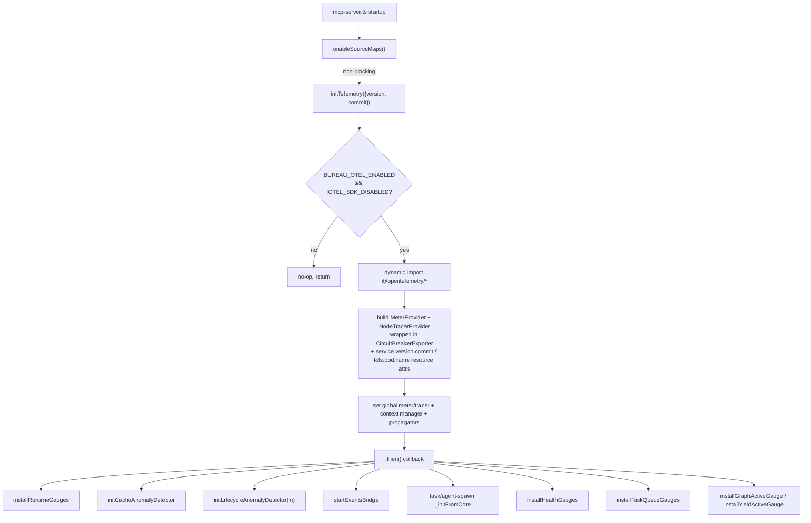
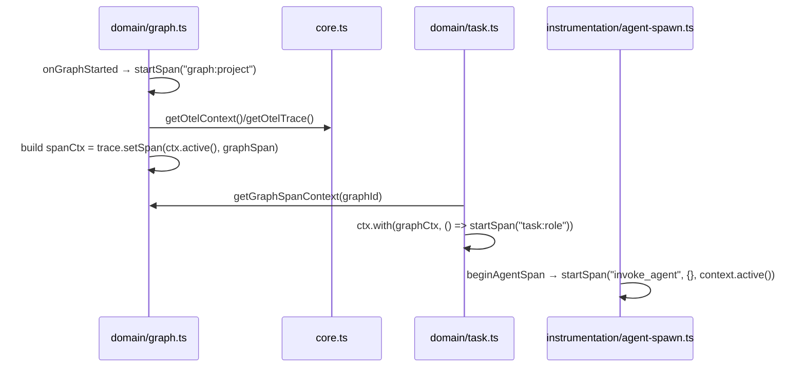
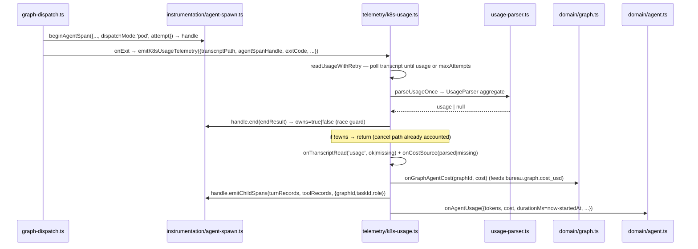
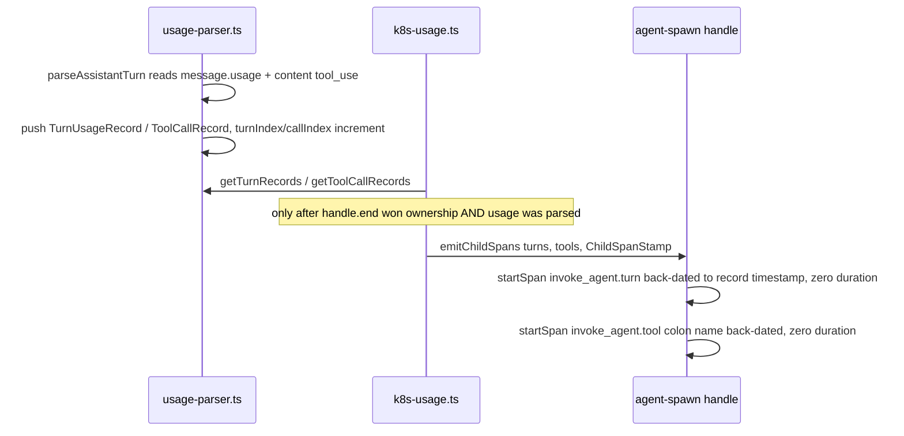

# Telemetry

## Overview

The Telemetry subsystem is a hand-rolled OpenTelemetry pipeline that emits metrics, traces, and observable gauges for every MCP tool call, graph/task/yield/health lifecycle moment, Redis operation, agent spawn, git operation, and Node.js runtime signal. It builds a `MeterProvider` and `NodeTracerProvider` directly (no `NodeSDK`, no auto-instrumentation) and exports over OTLP, wrapping both signals in a circuit breaker (`src/telemetry/core.ts › initTelemetry`, `src/telemetry/core.ts › CircuitBreakerExporter`). Every metric name and attribute key is governed by a single branded schema so a typo fails compilation — 76 metric names (`src/telemetry/schema.ts › METRIC`, `test: tests/telemetry/schema.test.ts > "METRIC contains exactly 76 entries"`). It replaced the prior ad-hoc `bureau.*` telemetry and per-task Redis-blob model.

The whole subsystem is opt-in and fault-isolated: it no-ops unless `BUREAU_OTEL_ENABLED=true` and is never allowed to throw into a caller (`src/telemetry/core.ts › _resolveConfig`, `src/telemetry/core.ts › initTelemetry`).

## Responsibilities

- Initialise and tear down the OTel `MeterProvider` + `NodeTracerProvider`, resolving all config from environment variables (`src/telemetry/core.ts › initTelemetry`, `src/telemetry/core.ts › shutdownTelemetry`).
- Resolve a frozen config object from `OTEL_*` / `BUREAU_*` env vars — the only function in the subsystem that reads `process.env` for config (`src/telemetry/core.ts › _resolveConfig`).
- Wrap both OTLP exporters in a `CircuitBreakerExporter` that opens after consecutive failures and recreates the inner exporter on a reconnect probe (`src/telemetry/core.ts › CircuitBreakerExporter`).
- Define the entire metric/attribute surface as branded TypeScript unions plus runtime `METRIC` / `ATTR` const maps — 76 metric names (`src/telemetry/schema.ts › MetricName`, `src/telemetry/schema.ts › METRIC`, `test: tests/telemetry/schema.test.ts > "METRIC contains exactly 76 entries"`). The five streaming metric names `bureau.spawn.duration`, `bureau.pty.output_bytes`, `bureau.stderr.lines_scanned`, `bureau.stderr.lines_matched`, and `bureau.task.heartbeat_gap` were deleted after the agent-spawn refactor left them producer-less; the transcript-visibility work later added `bureau.transcript.read` and `bureau.cost.source` (`src/telemetry/schema.ts › METRIC`).
- Provide domain hooks that own each metric family: agent usage, graph, task, health (including the zombie-task counter), yield, cache/cost/lifecycle anomaly, criterion, worktree merge, git operations, and the validation gate (`src/telemetry/domain/`).
- Provide instrumentation seams that wrap Redis commands, MCP tool dispatch (with caller-identity + code-provenance span enrichment), the agent spawn lifecycle (the `agent-spawn.ts` seam — the `invoke_agent` span plus the spawn-failures counter), and Node runtime sampling (`src/telemetry/instrumentation/`).
- Run an events-bridge that consumes the `events:{project}` Redis streams and increments `bureau.event` so any TaskEvent produces an OTel signal even if no domain hook covers it (`src/telemetry/events-bridge.ts › startEventsBridge`).
- Parse Claude `stream-json` JSONL output into per-session token/cost usage that feeds `onAgentUsage` and the anomaly detector, and — as a purely additive side channel — accumulate per-turn (`TurnUsageRecord`) and per-tool-call (`ToolCallRecord`) records off each `type: "assistant"` event's nested `message.usage` and `content[].tool_use` blocks, retrievable via `getTurnRecords()` / `getToolCallRecords()` (`src/usage-parser.ts › UsageParser`, `src/usage-parser.ts › TurnUsageRecord`, `src/usage-parser.ts › ToolCallRecord`). On the k8s pod-mode path this parse runs at task completion over the worker's captured `/sessions` transcript via `emitK8sUsageTelemetry`, using a bounded retry loop that polls until the sidecar has flushed a usage-bearing `result` event or the attempt budget expires (`src/telemetry/k8s-usage.ts › emitK8sUsageTelemetry`, `src/telemetry/k8s-usage.ts › readUsageWithRetry`). That function also OWNS ending the single authoritative `invoke_agent` span exactly once (it no longer reconstructs a post-hoc span — see the k8s flow below) (`src/telemetry/k8s-usage.ts › emitK8sUsageTelemetry`).
- Conserve per-agent cost across the whole run: feed each parsed agent cost into its graph's running total via `onGraphAgentCost`, drained and recorded as the `bureau.graph.cost_usd` histogram at the graph's terminal event; and on the kill/cancel path make a best-effort recovery attempt (`recordCanceledAgentUsage`) so a killed worker's cost is accounted rather than silently lost (`src/telemetry/domain/graph.ts › onGraphAgentCost`, `src/telemetry/domain/graph.ts › onGraphCompleted`, `src/telemetry/k8s-usage.ts › recordCanceledAgentUsage`).
- Emit two transcript-visibility counters that make silently-dropped cost observable without altering any read: `bureau.transcript.read{consumer,result}` at each of the five transcript-read sites (usage, interrogation, retro_digest, liveness, get_agent_log) and `bureau.cost.source{source}` on the usage path (`parsed` / `missing` / `lost_canceled`) (`src/telemetry/domain/transcript.ts › onTranscriptRead`, `src/telemetry/domain/transcript.ts › onCostSource`).
- Emit back-dated per-turn and per-tool child spans under each run's `invoke_agent` span — `invoke_agent.turn` (carrying `bureau.turn.index` + `gen_ai.usage.*`) and `invoke_agent.tool:<name>` (carrying `bureau.tool.name` + `bureau.tool.source="worker-transcript"` + `bureau.tool.call_index`) — reconstructed from the same worker transcript the `UsageParser` already reads, for agentic-waste analytics; purely additive observability that never affects the run-level cost/token totals (`src/telemetry/instrumentation/agent-spawn.ts › ChildSpanStamp`, `src/usage-parser.ts › UsageParser`).
- Provide an in-memory test harness with isolated providers and typed metric/span assertions (`src/telemetry/testing.ts › createTelemetryHarness`).
- Inject the OTel `trace` API into the pino root logger during init so every log record emitted under an active span carries `trace_id` / `span_id` / `trace_flags`, correlating logs to traces (`src/telemetry/core.ts › initTelemetry`, `src/logger.ts › injectTraceApi`).
- Enable Node's native source-map support at process startup so `error.stack` — and therefore every `exception.stacktrace` recorded via `span.recordException` — points at `src/…ts` symbols rather than the mangled `dist/mcp-server.bundle.cjs` frames (`src/telemetry/source-maps.ts › enableSourceMaps`).
- Stamp `code.function.name` on tool-call and `invoke_agent` spans as an OTel-stable code-provenance attribute so a code-knowledge store can resolve a span to its source symbol via SCIP (`src/telemetry/instrumentation/mcp-tool.ts › wrapMcpToolHandler`, `src/telemetry/instrumentation/agent-spawn.ts › beginAgentSpan`).

## Key flows

### Initialisation and wire-up

Init is fire-and-forget after the MCP transport connects, so OTEL failures never block server readiness (`src/mcp-server.ts › main`). Source-map support is enabled synchronously just before `initTelemetry()` is invoked (`src/telemetry/source-maps.ts › enableSourceMaps`). The diagram shows the bootstrap fan-out.

`initTelemetry()` resolves config, dynamically imports the OTel packages (a WSL cold-start workaround — a static import of `@opentelemetry/api` hangs even when disabled), builds both providers wrapped in `CircuitBreakerExporter`, registers the global context manager and propagators, then sets the global meter/tracer (`src/telemetry/core.ts › initTelemetry`). Immediately after the dynamic import it calls `injectTraceApi(trace, isSpanContextValid)`, handing the pino logger's trace-context mixin the live `trace` singleton so log records correlate to spans without a per-log dynamic import; until that call the mixin is a safe no-op returning `{}` (`src/telemetry/core.ts › initTelemetry`, `src/logger.ts › injectTraceApi`). The `.then()` callback wires every domain hook and gauge; each wire-up step is independently try/caught. It installs the runtime gauges, the cache-anomaly detector, the lifecycle-anomaly detector (`initLifecycleAnomalyDetector(m)`, guarded by `if (m)`), the events-bridge, the task and agent-spawn domain init (`_initFromCore`), and the health / task-queue / graph-active / yield-active gauges — ten independent steps, each `await import`-ed and try/caught (`src/mcp-server.ts › main`). Redis instrumentation is wired separately inside `getRedis()`, which wraps the client through `wrapRedisClient` (`src/telemetry/instrumentation/redis.ts › wrapRedisClient`).

> [!note] The bootstrap constructs the lifecycle anomaly detector. Between the cache-anomaly and events-bridge steps it dynamically imports `initLifecycleAnomalyDetector` and, when a meter exists, calls `initLifecycleAnomalyDetector(m)` inside its own try/catch, so with telemetry enabled the singleton IS constructed and the `lifecycle.missing_handoff` / `lifecycle.missing_status` anomalies CAN fire (`src/mcp-server.ts › main`, `src/telemetry/domain/anomaly.ts › initLifecycleAnomalyDetector`).

**Two resource attributes are added at build:** `initTelemetry` accepts `opts.commit` (the build's git SHA, baked in at bundle time and overridable via `OTEL_SERVICE_VERSION_COMMIT`) and stamps it as the `service.version.commit` resource attribute; and it reads `K8S_POD_NAME` (downward-API `metadata.name`, falling back to `HOSTNAME`) into the `k8s.pod.name` resource attribute, emitted only when non-empty (`src/telemetry/core.ts › _resolveConfig`, `src/telemetry/core.ts › initTelemetry`, `src/telemetry/core.ts › InitOpts`).

### Trace context: graph → task → agent span parenting

Spans nest into a single trace per graph via cached OTel context APIs, without each module taking its own dynamic import. The flow shows how a child span finds its parent.

`onGraphStarted` builds an OTel `Context` embedding the graph span and stores it keyed by graph ID (`src/telemetry/domain/graph.ts › onGraphStarted`). `onTaskStarted` looks that context up and runs `startSpan` inside `ctx.with(graphCtx, …)`, so the `task:<role>` span is a CHILD_OF the graph span on the same trace (`src/telemetry/domain/task.ts › onTaskStarted`). `beginAgentSpan` starts a long-lived `invoke_agent` span parented to whatever task span is active on the caller's async stack, closed manually via the returned handle's `end()` rather than the `startActiveSpan` callback (`src/telemetry/instrumentation/agent-spawn.ts › beginAgentSpan`, `src/telemetry/instrumentation/agent-spawn.ts › AgentSpanHandle`). There is exactly ONE authoritative `invoke_agent` span per invocation: on the k8s pod-mode path `beginAgentSpan` is called at dispatch immediately after the worker spawns (only for real agents — exec/criterion pods get no span), and the returned handle is threaded to `emitK8sUsageTelemetry`, which ends it exactly once at task completion; the post-hoc `emitCompletedAgentSpan` reconstruction was removed (`src/graph-dispatch.ts › createDispatchHandler`, `src/telemetry/instrumentation/agent-spawn.ts › beginAgentSpan`). The handle's `end()` returns an ownership boolean so the completion path and the kill/cancel path cannot both account the same span (see the k8s and cost-conservation flows).

### k8s pod-mode usage + authoritative span end at task completion

The k8s worker-dispatch strategy has no live PTY `onData` stream, so token/cost telemetry cannot be produced incrementally as the agent runs. Instead, at dispatch `graph-dispatch` opens the single authoritative `invoke_agent` span via `beginAgentSpan` (only for real agents — `task.execMode` pods are skipped), then registers an `onExit` callback that fire-and-forget invokes `emitK8sUsageTelemetry`, passing that span handle and the exit code, whenever the task was started with a `stampedSessionLogPath` (`src/graph-dispatch.ts › createDispatchHandler`, `src/telemetry/k8s-usage.ts › emitK8sUsageTelemetry`). `emitK8sUsageTelemetry` is the live producer of agent-usage telemetry on the k8s path and now also owns ending that span.

`emitK8sUsageTelemetry` reads the captured `session.log` from the read-only `/sessions` PVC through `readUsageWithRetry`, which calls `parseUsageOnce` up to `maxAttempts` times (default 20 × 1000 ms), sleeping between tries, so the sidecar has time to flush the final usage-bearing `result` event before it gives up — a missing/unreadable file on any attempt is treated as "no usage yet" and retried (`src/telemetry/k8s-usage.ts › readUsageWithRetry`, `src/telemetry/k8s-usage.ts › parseUsageOnce`, `test: tests/telemetry/k8s-usage.test.ts > "race resolved: returns usage after N incomplete reads then one complete read"`). `parseUsageOnce` runs the `stream-json` content through `UsageParser`, **aggregating every usage event** because one worker task may invoke Claude multiple times, each producing a `result` event with its own usage block (`src/telemetry/k8s-usage.ts › parseUsageOnce`, `test: tests/telemetry/k8s-usage.test.ts > "aggregates multiple usage events from a multi-invocation transcript"`).

The span is ended exactly once from a single place: the end-result is initialised to a costless twin (`{exitCode}` only) and upgraded to the full token/cost payload only on parse-success, so a throw, a null parse, or an early return still ends the span carrying the exit code (`src/telemetry/k8s-usage.ts › emitK8sUsageTelemetry`, `test: tests/telemetry/k8s-usage.test.ts > "ends the handle exactly once with only exitCode when the parse throws"`). **The span end is claimed BEFORE any metric emission** — because the retry poll can straddle the kill window, and if the cancel path (`recordCanceledAgentUsage`) already ended this span it has already accounted the agent; `handle.end()` returns ownership and a lost claim skips all downstream accounting so the graph rollup and cost-source counters cannot double-count (`src/telemetry/k8s-usage.ts › emitK8sUsageTelemetry`, `test: tests/telemetry/k8s-usage.test.ts > "skips ALL metric emission when the span end was lost to the cancel path (ownership guard, review-313)"`). On a winning claim it emits the `bureau.transcript.read` + `bureau.cost.source` visibility counters, feeds the parsed cost into `onGraphAgentCost`, and calls `onAgentUsage` with the summed tokens/cost and a wall-clock `durationMs = Date.now() − startedAt` (not parse time) (`src/telemetry/k8s-usage.ts › emitK8sUsageTelemetry`, `test: tests/telemetry/k8s-usage.test.ts > "durationMs reflects wall-clock elapsed since startedAt (not parse time)"`, `test: tests/telemetry/k8s-usage.test.ts > "emits transcript.read=usage/ok + cost.source=parsed when usage is found"`). The whole function is fire-and-forget: a missing, empty, or malformed transcript emits the `missing` visibility counters, ends the span with just the exit code, and never throws to the poll loop (`src/telemetry/k8s-usage.ts › emitK8sUsageTelemetry`, `test: tests/telemetry/k8s-usage.test.ts > "never throws — resolves cleanly even for a malformed transcript"`, `test: tests/telemetry/k8s-usage.test.ts > "emits transcript.read=usage/missing + cost.source=missing when no usage is found"`).

### Per-turn / per-tool child spans

This reconstructs, from the same worker transcript `emitK8sUsageTelemetry` already parses, back-dated child spans under the run's single `invoke_agent` span so a dashboard can attribute per-turn tokens and per-tool activity within an agent run without a live stream (agentic-waste analytics). It is a purely additive observability channel: the run-level cost/token totals fed to `onAgentUsage` are computed independently and untouched, and every emission path is swallow-guarded so a failure can never affect cost accounting (`src/telemetry/k8s-usage.ts › emitK8sUsageTelemetry`, `src/telemetry/instrumentation/agent-spawn.ts › AgentSpanHandle`).

**Parser side channel.** `UsageParser.parseLine` routes each `type: "assistant"` event to `parseAssistantTurn`, which reads the *nested* `message.usage` (distinct from the top-level `usage` key `parseRunLevelUsage` consumes, so the two paths never double-fire off one line) and pushes a `TurnUsageRecord` — a monotonic `turnIndex`, the four `gen_ai.usage.*` token counts, an optional `responseModel`, and a `timestamp` (parsed from the event's `timestamp` field via `extractTimestamp`, falling back to parse-time wall clock) — then walks `message.content[]` and pushes one `ToolCallRecord` per `tool_use` block with a monotonic `callIndex` and the enclosing turn's timestamp for both `startTimestamp` and `endTimestamp` (transcript `tool_use` blocks carry no independent timestamp, so the reconstruction is zero-duration by contract) (`src/usage-parser.ts › UsageParser`, `src/usage-parser.ts › TurnUsageRecord`, `src/usage-parser.ts › ToolCallRecord`, `test: tests/usage-parser.test.ts`). These accumulate on the parser instance and surface via `getTurnRecords()` / `getToolCallRecords()`; `parseUsageOnce` copies them onto the returned `AggregatedUsage.turnRecords` / `.toolRecords` (`src/telemetry/k8s-usage.ts › parseUsageOnce`, `src/telemetry/k8s-usage.ts › AggregatedUsage`).

**Emission.** After `emitK8sUsageTelemetry` has won the span-end ownership claim and confirmed usage was parsed, it calls `agentSpanHandle?.emitChildSpans?.(usage.turnRecords, usage.toolRecords, { graphId, taskId, role })` inside its own try/catch — the optional chaining keeps it backward-compatible with hand-rolled `{ end }` test doubles, and it is skipped entirely when the ownership claim was lost to the cancel path or when no usage was found (`src/telemetry/k8s-usage.ts › emitK8sUsageTelemetry`, `test: tests/telemetry/k8s-usage.test.ts > "calls emitChildSpans with turn/tool records extracted from the transcript, re-stamped with graph/task/role from params"`, `test: tests/telemetry/k8s-usage.test.ts > "does not call emitChildSpans when the span end was lost to the cancel path (ownership guard)"`, `test: tests/telemetry/k8s-usage.test.ts > "does not call emitChildSpans when the transcript has no usage"`). `beginAgentSpan`'s handle implements `emitChildSpans` by capturing the parent context once at span-creation time (`childParentCtx = trace.setSpan(context.active(), span)`), so the back-dated children parent onto THIS `invoke_agent` span even though emission happens much later from an unrelated async context. Each `invoke_agent.turn` span is started with the record's `timestamp` as `startTime` and immediately ended at the same instant (zero duration), stamped with `bureau.turn.index`, the four `gen_ai.usage.*` counts, the re-stamped `bureau.graph.id` / `bureau.task.id` / `bureau.role` from the `ChildSpanStamp`, and `gen_ai.response.model` when present; each `invoke_agent.tool:<name>` span is stamped with `bureau.tool.name`, `bureau.tool.source="worker-transcript"` (disambiguating these reconstructed spans from live `execute_tool` spans), `bureau.tool.call_index`, and the same re-stamped identity (`src/telemetry/instrumentation/agent-spawn.ts › beginAgentSpan`, `src/telemetry/instrumentation/agent-spawn.ts › ChildSpanStamp`, `test: tests/telemetry/instrumentation/agent-spawn.test.ts > "creates invoke_agent.turn and invoke_agent.tool:<name> as children of invoke_agent"`, `test: tests/telemetry/instrumentation/agent-spawn.test.ts > "stamps the pinned tool attributes with source=\"worker-transcript\" (disambiguates from execute_tool spans)"`, `test: tests/telemetry/instrumentation/agent-spawn.test.ts > "back-dates child spans to zero duration at the transcript timestamp"`). The whole loop is wrapped in try/catch inside the handle, and `NOOP_HANDLE.emitChildSpans` is a no-op, so an OTel-disabled or failing emission never disturbs the run (`src/telemetry/instrumentation/agent-spawn.ts › beginAgentSpan`, `test: tests/telemetry/instrumentation/agent-spawn.test.ts > "emitChildSpans on the no-op handle does not throw when OTel is not initialized (#355)"`).

**Schema.** Four attribute keys were registered in `schema.ts` with deliberate cardinality: `bureau.tool.name` and `bureau.tool.source` are low-cardinality (bounded tool-name set, single-value source), while `bureau.turn.index` and `bureau.tool.call_index` are high-cardinality span-only per-run counters that are NEVER metric labels — these child spans emit no metrics (`src/telemetry/schema.ts › ATTR`, `src/telemetry/schema.ts › ATTR_LOW`, `src/telemetry/schema.ts › ATTR_HIGH`). No new metric names were added — the `METRIC` map count is 76 (`src/telemetry/schema.ts › METRIC`, `test: tests/telemetry/schema.test.ts > "METRIC contains exactly 76 entries"`).

### Cost conservation: graph rollup + kill/cancel accounting

Two ways per-agent cost could go unrecorded are closed. Each parsed agent cost is fed into a per-graph accumulator via `onGraphAgentCost(graphId, costUsd)`, then drained and recorded as the `bureau.graph.cost_usd` histogram at the graph's terminal event — `onGraphCompleted`, `onGraphFailed`, and `onGraphCanceled` each call `drainGraphCost` and record the total (0 when no agent under that graph was costed, chosen over emitting nothing so an invariant check can tell "confirmed zero" from "no data") with low-cardinality `project` / `has_parent` / `reason` labels only — `graphId` is never a metric label (`src/telemetry/domain/graph.ts › onGraphAgentCost`, `src/telemetry/domain/graph.ts › onGraphCompleted`, `test: tests/telemetry/cost-conservation.test.ts > "(c) records bureau.graph.cost_usd equal to the sum of the graph's agents' recorded costs"`, `test: tests/telemetry/cost-conservation.test.ts > "(d) a graph with zero costed agents records bureau.graph.cost_usd = 0 (chosen over emitting nothing, so the invariant can confirm \"zero\" vs \"no data\")"`). The accumulator is drained even when the meter is disabled, so entries never leak across a graph's terminal event (`src/telemetry/domain/graph.ts › onGraphCompleted`, `test: tests/telemetry/cost-conservation.test.ts > "(c) drains the per-graph accumulator so a later, unrelated graph in the same project is not double-counted"`).

A worker killed mid-run never reaches the normal `onExit → emitK8sUsageTelemetry` path (the k8s strategy's `kill()` clears the Job-status poll before it can fire an exit event), so the `killWorker` seam calls `recordCanceledAgentUsage`, which makes ONE best-effort single-shot (no-retry) `parseUsageOnce` attempt over whatever the transcript already holds, then ends the still-open span via `endAgentSpanOnCancel` (`src/mcp-server.ts › main`, `src/telemetry/k8s-usage.ts › recordCanceledAgentUsage`, `src/telemetry/instrumentation/agent-spawn.ts › endAgentSpanOnCancel`). `endAgentSpanOnCancel` looks up the task's handle in the shared `_activeSpanHandles` map and returns `false` when the span already ended normally or was never opened (e.g. exec-mode pods) — a legitimate silent no-op, no double-accounting (`src/telemetry/instrumentation/agent-spawn.ts › endAgentSpanOnCancel`, `test: tests/telemetry/cost-conservation.test.ts > "(b) does not double-end a span that already ended normally, and does not bump lost_canceled for it"`, `test: tests/telemetry/cost-conservation.test.ts > "(b) is a silent no-op for a task that never had a span (e.g. exec-mode pods never call beginAgentSpan)"`). When usage WAS recoverable it counts toward the graph rollup and emits `bureau.cost.source{source="parsed"}`; when nothing is recoverable (the expected case for a pod SIGKILLed mid-turn, since Claude Code only flushes a usage-bearing `result` at turn end) it emits `bureau.cost.source{source="lost_canceled"}` — the counter, not the recovered cost, is the deliverable, so the loss is accounted rather than silent (`src/telemetry/k8s-usage.ts › recordCanceledAgentUsage`, `src/telemetry/domain/transcript.ts › onCostSource`, `test: tests/telemetry/cost-conservation.test.ts > "(a) emits bureau.cost.source{source=\"lost_canceled\"} when a killed worker has no recoverable usage"`, `test: tests/telemetry/cost-conservation.test.ts > "(a) recovers partial usage when the transcript already has a result event at kill time, and does NOT bump lost_canceled"`).

When the cancel path ends a span it marks it ERROR with `reason="canceled"` via `_applyEndAttributes`, so a canceled attempt is distinguishable from a normal failure in traces (`src/telemetry/instrumentation/agent-spawn.ts › _applyEndAttributes`, `src/telemetry/instrumentation/agent-spawn.ts › AgentEndResult`).

### Per-attempt cost on the rework loop

`beginAgentSpan` stamps `bureau.task.attempt` (the bounded auto-rework loop index, `String(attempt)`, cardinality 0–3) on the `invoke_agent` span when `info.attempt` is defined, and omits it otherwise — including `"0"` for the initial attempt, which is falsy-but-defined, so per-attempt cost is attributable across a fix agent's rework iterations (`src/telemetry/instrumentation/agent-spawn.ts › beginAgentSpan`, `src/telemetry/instrumentation/agent-spawn.ts › SpawnedAgentInfo`, `test: tests/telemetry/instrumentation/agent-spawn.test.ts > "sets bureau.task.attempt=\"2\" as a low-cardinality string when info.attempt is present (#317)"`, `test: tests/telemetry/instrumentation/agent-spawn.test.ts > "sets bureau.task.attempt=\"0\" for the initial attempt (falsy but defined)"`). The dispatch path passes `attempt: task.attempt` (`src/graph-dispatch.ts › createDispatchHandler`). `bureau.task.attempt` is a distinct schema constant from `bureau.git.attempt` (git-push retries within one op); both are low-cardinality (`src/telemetry/schema.ts › ATTR`, `test: tests/telemetry/schema.test.ts > "registers bureau.task.attempt (rework attempt index) as low-cardinality, distinct from bureau.git.attempt (#317)"`). The per-attempt cost invariant — one costed span per attempt, distinct `attempt` values, re-validation exec pods contributing none — is exercised end-to-end (`test: tests/telemetry/rework-cost-invariant.test.ts > "3-round rework graph: attempts 1, 2, 3 each produce exactly one span with distinct attempt values"`).

### MCP caller-identity enrichment + code provenance

Both tool-instrumentation seams stamp a `code.function.name` span attribute (set to the tool name) so a code-knowledge store can resolve the span to its handler symbol via SCIP; the attribute is span-only, never a metric label, to keep cardinality bounded (`src/telemetry/instrumentation/mcp-tool.ts › wrapMcpToolHandler`, `src/telemetry/instrumentation/mcp-register.ts › registerInstrumentedTool`). `registerInstrumentedTool` and `wrapMcpToolHandler` also accept an optional `getContext` resolver (`ContextResolver`) that, when supplied, resolves the caller's `(graphId, taskId, role)` and attaches `bureau.graph.id` / `bureau.task.id` as high-cardinality span attributes and `bureau.role` as a low-cardinality one — each guarded so a resolver error never aborts the call (`src/telemetry/instrumentation/mcp-register.ts › registerInstrumentedTool`, `src/runtime/connection-context.ts › ContextResolver`). The HTTP gateway proxy passes such a resolver for every proxied worker tool (`src/mcp-gateway/proxy-tools.ts › registerProxyTools`).

`registerInstrumentedTool` additionally feeds the lifecycle anomaly detector: on every successful call it invokes `getLifecycleAnomalyDetector()?.recordToolCall(graphId, taskId, toolName)` (`src/telemetry/instrumentation/mcp-register.ts › registerInstrumentedTool`). Because `initLifecycleAnomalyDetector(m)` is wired into the bootstrap, this feed is **live** when telemetry is enabled — the optional-chain resolves to the constructed singleton and each tool call is recorded (`src/mcp-server.ts › main`).

### Lifecycle anomaly detection

`LifecycleAnomalyDetector` is an in-memory absence detector: it tracks which MCP tool names were seen per `(graphId, taskId)` via `recordToolCall`, and on graph termination `observeGraphTerminated` emits a `bureau.anomaly.detected` counter (plus a span event) for every *completed* task that never called `set_handoff` (`lifecycle.missing_handoff`, severity medium) or `set_status` (`lifecycle.missing_status`, severity low), eagerly deleting each examined key to bound memory; it honours the `BUREAU_DISABLE_LIFECYCLE_ANOMALIES=1` kill-switch (`src/telemetry/domain/anomaly.ts › LifecycleAnomalyDetector`, `test: src/__tests__/lifecycle-anomaly.test.ts`). The terminal check is invoked from the task-graph completion path (`src/task-graph.ts › checkGraphCompletion`, calling `getLifecycleAnomalyDetector()?.observeGraphTerminated`). `initLifecycleAnomalyDetector` — the only function that constructs the singleton — **is** called from the telemetry bootstrap (`initLifecycleAnomalyDetector(m)` under an `if (m)` guard), so with telemetry enabled `getLifecycleAnomalyDetector()` returns the live singleton and both `recordToolCall` and `observeGraphTerminated` run, emitting the two `lifecycle.*` anomaly types (`src/telemetry/domain/anomaly.ts › initLifecycleAnomalyDetector`, `src/telemetry/domain/anomaly.ts › getLifecycleAnomalyDetector`, `src/mcp-server.ts › main`). When telemetry is disabled (`getMeter()` null) the detector is not constructed and the optional-chain feeds no-op — the same fault-isolated fallback as every other gauge.

### Cache-anomaly detection on the usage path

Per-task usage feeds the cache/cost anomaly detector fire-and-forget after metric emission (`src/telemetry/domain/agent.ts › onAgentUsage`). The detector and its rules are catalogued in the [Self-Improvement Loop](Self-Improvement%20Loop.md) area; this subsystem owns only the emission. The `bureau.anomaly.detected` counter carries strictly low-cardinality labels while rich context (ratios, cost figures, graph/task IDs) is attached as span events. The detector's ring-buffer, cost-sample, and per-detector cooldown Redis keys are grouped by `(role, model, toolchain)` rather than `(role, model)`, because a mixed-language graph produces genuinely different prompt prefixes per toolchain and keying without it would trip a false-positive `cache.prefix_instability` (`src/telemetry/domain/anomaly.ts › CacheAnomalyDetector`, `test: tests/telemetry/domain/anomaly.test.ts > "respects cooldown — does not fire twice within 5 minutes"`).

### Git operations, retries & merge observability

Every async git operation flows through the single `gitSafeAsync` choke point in `src/utils/git.ts`, which wraps the call in a `git.<op>` span (when a tracer is set) and, on both success and failure, calls `onGitOp` to record the `bureau.git.op` duration histogram (`src/utils/git.ts › gitSafeAsync`, `src/telemetry/domain/git.ts › onGitOp`). The histogram carries low-cardinality labels `bureau.git.operation` (the git subcommand), `bureau.git.ok` (success flag as a string), and `bureau.git.repo` (the worktree basename) (`src/telemetry/domain/git.ts › onGitOp`, `src/telemetry/schema.ts › ATTR_LOW`). The `bureau.git.repo` label assumes bureau's bounded worktree name space and is annotated as not safe for arbitrary repo URLs (`src/telemetry/schema.ts › ATTR_LOW`).

The git-provider brownout-resilience work threaded retry provenance through the same choke point: `onGitOp` now also records `bureau.git.attempt` (0-indexed attempt number, bounded 0–2) and `bureau.git.transient` (`"true"` when the failure was a transient provider error), and — on failures only — `error.type` (the classified `GitErrorType` from `classifyGitError`) plus `bureau.error.category = "git"` (`src/telemetry/domain/git.ts › onGitOp`, `src/telemetry/domain/git.ts › GitOpEvent`, `src/utils/git.ts › gitSafeAsync`, `test: tests/telemetry/domain/git.test.ts`).

The surviving merge-observability path is `onWorktreeMergeCompleted`, called from the pod-mode merge handler on success / failure / conflict, which emits `bureau.worktree.merge.total` and `bureau.worktree.merge.duration`; on a `failed` merge with a classified `errorType` it additionally increments the new `bureau.worktree.merge.error` counter, labelled with `error.type`, `bureau.project`, and `bureau.error.category = "merge"` (`src/telemetry/domain/worktree.ts › onWorktreeMergeCompleted`, `src/telemetry/domain/worktree.ts › WorktreeMergeEvent`, `src/telemetry/schema.ts › METRIC`, `test: tests/telemetry/domain/worktree.test.ts`). The earlier merge-queue metrics `bureau.merge.queue_depth` / `bureau.merge.timeout` and the `domain/merge.ts` module that owned them were deleted outright and are not part of the `bureau.*` contract.

### Zombie-task detection

The health-sweep loop detects tasks that are still `running` but hold a null `sessionId` — orphaned dispatch attempts. On detection it both fails the task through the graph manager with `failureReason: 'dispatch.zombie_task'` and calls `onZombieDetected`, which increments `bureau.anomaly.detected` with `anomaly.type = dispatch.zombie_task`, `anomaly.severity = high`, the task role, and `bureau.error.category = "dispatch"`. The counter (not a span event) is the load-bearing signal here because health-sweep runs in a bare `setInterval` with no active span, where `span.addEvent` would silently no-op (`src/telemetry/domain/health.ts › onZombieDetected`, `src/health-sweep.ts › runHealthSweep`). Symmetrically, `onTaskFailed` now derives a `bureau.error.category` label from the error type — `dispatch` for `dispatch.zombie_task`, `agent` for `exit_nonzero`/`other`, else `git` — via `categoryFromErrorType` (`src/telemetry/domain/task.ts › onTaskFailed`, `src/telemetry/domain/task.ts › categoryFromErrorType`).

### Toolchain, dispatch-mode & worker-image dimensions

The language-agnostic dispatch work threaded three span/metric dimensions through the agent-usage and spawn paths. `onAgentUsage` accepts an optional `toolchain` (e.g. `node` / `python` / `dotnet`) and, when present, attaches it as the low-cardinality `bureau.toolchain` label on the `gen_ai.*` token/cost metrics — omitted when absent to keep the no-toolchain series clean (`src/telemetry/domain/agent.ts › onAgentUsage`). `beginAgentSpan` — now the sole `invoke_agent` span producer — attaches `bureau.toolchain` and the high-cardinality `bureau.worker.image` start attributes when set, and additionally stamps `bureau.dispatch.mode` (`'pod'` for k8s pod-mode dispatch) (`src/telemetry/instrumentation/agent-spawn.ts › beginAgentSpan`, `test: src/__tests__/dispatch-mode-telemetry.test.ts > "beginAgentSpan receives dispatchMode='pod' on every task dispatch"`). `recordSpawnFailure` also carries the `bureau.toolchain` label on spawn-failure paths (`src/telemetry/instrumentation/agent-spawn.ts › recordSpawnFailure`). The schema declares all three keys as fixed wire constants — `bureau.toolchain` and `bureau.dispatch.mode` low-cardinality, `bureau.worker.image` high-cardinality (`src/telemetry/schema.ts › ATTR`, `test: tests/telemetry/toolchain-telemetry.test.ts > "ATTR.TOOLCHAIN resolves to the correct wire key"`).

### Validation gate observability

`src/telemetry/domain/validation.ts` owns three fault-isolated validation-gate counters: `onValidationDispatched` increments `bureau.validation.dispatched` with a `bureau.validation.level` label when a unit/integration validation child graph is booted; `onValidationResult` increments `bureau.validation.result` with `bureau.validation.level` + `bureau.validation.result` (`pass`/`fail`) plus a `bureau.validation.failed_criteria` bucket label — the raw failed-criteria count bucketed to a bounded low-cardinality value (`"0"`/`"1"`/`"2-5"`/`"6+"`, never the raw count or a graph ID), defaulting to `"1"` on the fail path when the count is omitted and always `"0"` on the pass path (`src/telemetry/domain/validation.ts › onValidationResult`, `src/telemetry/schema.ts › ATTR_LOW`, `test: tests/telemetry/domain/validation.test.ts > "increments bureau.validation.result with failed_criteria bucket \"2-5\" for failedCount:3"`, `test: tests/telemetry/domain/validation.test.ts > "does not include a graph.id label (§7.8 cardinality rule)"`); and `onValidationNoTestCommand` increments `bureau.validation.no_test_command` when a task declares a validation level but supplies no test command (`src/telemetry/domain/validation.ts › onValidationDispatched`). The criterion domain also carries an `exec` criterion type surfaced through `onCriterionEvaluated` alongside the other types (`src/telemetry/domain/criterion.ts › onCriterionEvaluated`).

## Public interface

| Symbol | Signature (abbrev.) | Purpose | Citation |
|---|---|---|---|
| `initTelemetry` | `(opts?: {version?, commit?}) => Promise<void>` | Build + register providers (+ `service.version.commit`/`k8s.pod.name` resource attrs); no-op when disabled; never throws | `src/telemetry/core.ts › initTelemetry` |
| `shutdownTelemetry` | `() => Promise<void>` | Flush then shut down both providers; idempotent | `src/telemetry/core.ts › shutdownTelemetry` |
| `getMeter` / `getTracer` | `() => Meter\|null` / `() => Tracer\|null` | Accessors used by every domain/instrumentation module | `src/telemetry/core.ts › getMeter`, `src/telemetry/core.ts › getTracer` |
| `CircuitBreakerExporter` | `class<T extends BaseExporter>` | Wraps an exporter with open/half-open/closed circuit | `src/telemetry/core.ts › CircuitBreakerExporter` |
| `METRIC` / `ATTR` | `Record<string, MetricName>` / `Record<string, AttributeKey>` | Authoritative name + key maps (76 metrics) | `src/telemetry/schema.ts › METRIC`, `src/telemetry/schema.ts › ATTR` |
| `enableSourceMaps` | `() => void` | Enable Node native source-map `Error.stack` rewriting; idempotent, best-effort, never throws | `src/telemetry/source-maps.ts › enableSourceMaps` |
| `startEventsBridge` | `({projects, getRedis}) => Promise<EventsBridgeHandle>` | XREADGROUP consumer incrementing `bureau.event` | `src/telemetry/events-bridge.ts › startEventsBridge` |
| `onAgentUsage` | `(AgentUsageEvent) => void` | Token/cost/cache metrics (optional `bureau.toolchain` label) + anomaly observe keyed by (role, model, toolchain) | `src/telemetry/domain/agent.ts › onAgentUsage` |
| `onGraphStarted` …`onGraphCompleted` | graph lifecycle hooks | Graph counters + graph span ownership | `src/telemetry/domain/graph.ts › onGraphStarted` |
| `onTaskStarted` …`onTaskFailed` | task lifecycle hooks | Task counters/histograms + task span ownership; `onTaskFailed` derives `bureau.error.category` | `src/telemetry/domain/task.ts › onTaskStarted`, `src/telemetry/domain/task.ts › onTaskFailed` |
| `onGitOp` | `(GitOpEvent) => void` | Records `bureau.git.op` histogram + attempt/transient/error.type/error.category labels | `src/telemetry/domain/git.ts › onGitOp` |
| `onWorktreeMergeCompleted` | `(WorktreeMergeEvent) => void` | `bureau.worktree.merge.total`/`.duration` + `.error` on classified failure | `src/telemetry/domain/worktree.ts › onWorktreeMergeCompleted` |
| `onZombieDetected` | `({graphId, taskId, role}) => void` | `bureau.anomaly.detected` counter for zombie tasks (dispatch.zombie_task, severity high) | `src/telemetry/domain/health.ts › onZombieDetected` |
| `onValidationDispatched` / `onValidationResult` / `onValidationNoTestCommand` | validation-gate counters | Emit `bureau.validation.dispatched` / `.result` (+ `failed_criteria` bucket) / `.no_test_command` (fault-isolated) | `src/telemetry/domain/validation.ts › onValidationDispatched`, `src/telemetry/domain/validation.ts › onValidationResult` |
| `onGraphAgentCost` | `(graphId, costUsd) => void` | Accumulate parsed agent cost per graph; drained as `bureau.graph.cost_usd` at graph terminal | `src/telemetry/domain/graph.ts › onGraphAgentCost` |
| `onTranscriptRead` / `onCostSource` | `(consumer, result) => void` / `(source) => void` | `bureau.transcript.read` / `bureau.cost.source` visibility counters | `src/telemetry/domain/transcript.ts › onTranscriptRead`, `src/telemetry/domain/transcript.ts › onCostSource` |
| `LifecycleAnomalyDetector` / `initLifecycleAnomalyDetector` / `getLifecycleAnomalyDetector` | absence detector (in-memory) | Fires `lifecycle.missing_handoff`/`missing_status` on graph termination — constructed by the telemetry bootstrap when a meter exists | `src/telemetry/domain/anomaly.ts › LifecycleAnomalyDetector`, `src/telemetry/domain/anomaly.ts › initLifecycleAnomalyDetector`, `src/mcp-server.ts › main` |
| `wrapRedisClient` | `<T>(client) => T` | Proxy wrapping every ioredis command with span+metric | `src/telemetry/instrumentation/redis.ts › wrapRedisClient` |
| `registerInstrumentedTool` | drop-in for `server.registerTool` (+ optional `getContext`) | Wraps tool callback with span+duration+error counter, `code.function.name`, caller identity, lifecycle feed | `src/telemetry/instrumentation/mcp-register.ts › registerInstrumentedTool` |
| `wrapMcpToolHandler` | `(handler, getContext?) => handler` | stdio-path tool span wrapper (+ `code.function.name`, caller identity) | `src/telemetry/instrumentation/mcp-tool.ts › wrapMcpToolHandler` |
| `beginAgentSpan` | `(SpawnedAgentInfo) => Promise<AgentSpanHandle>` | Single authoritative `invoke_agent` root span (+ `code.function.name`/`bureau.toolchain`/`bureau.worker.image`/`bureau.dispatch.mode`/`bureau.task.attempt`); registered in `_activeSpanHandles`; handle's `end()` returns an ownership boolean and ends the span at most once; handle's `emitChildSpans(turns, tools, stamp)` back-dates `invoke_agent.turn`/`invoke_agent.tool:<name>` children | `src/telemetry/instrumentation/agent-spawn.ts › beginAgentSpan`, `src/telemetry/instrumentation/agent-spawn.ts › AgentSpanHandle` |
| `endAgentSpanOnCancel` | `(graphId, taskId, AgentEndResult) => boolean` | Ends a still-open `invoke_agent` span on the kill/cancel path; `false` (no-op) when already ended or never opened | `src/telemetry/instrumentation/agent-spawn.ts › endAgentSpanOnCancel` |
| `recordSpawnFailure` | `(reason, Partial<SpawnedAgentInfo>) => void` | Increments `bureau.spawn.failures` keyed by reason (+ role/graph/task/toolchain) | `src/telemetry/instrumentation/agent-spawn.ts › recordSpawnFailure` |
| `emitK8sUsageTelemetry` | `(K8sUsageTelemetryParams, deps?) => Promise<void>` | Bounded-retry parse of the pod-mode `/sessions` transcript → owns ending the span once, then `bureau.transcript.read`/`.cost.source` + `onGraphAgentCost` + `emitChildSpans` + `onAgentUsage`; fire-and-forget | `src/telemetry/k8s-usage.ts › emitK8sUsageTelemetry` |
| `readUsageWithRetry` / `parseUsageOnce` | `(readFile, sleep, path, sessionId, opts) => Promise<AggregatedUsage\|null>` / `(readFile, path, sessionId) => AggregatedUsage\|null` | Poll/parse the transcript for aggregated usage, incl. `turnRecords`/`toolRecords` for child spans | `src/telemetry/k8s-usage.ts › readUsageWithRetry`, `src/telemetry/k8s-usage.ts › parseUsageOnce`, `src/telemetry/k8s-usage.ts › AggregatedUsage` |
| `recordCanceledAgentUsage` | `(CanceledUsageParams, deps?) => Promise<void>` | Kill/cancel cost-conservation seam: best-effort recovery + `endAgentSpanOnCancel` + `parsed`/`lost_canceled` cost source | `src/telemetry/k8s-usage.ts › recordCanceledAgentUsage` |
| `installRuntimeGauges` | `() => void` | `process.runtime.nodejs.*` instruments | `src/telemetry/instrumentation/runtime.ts › installRuntimeGauges` |
| `createTelemetryHarness` | `() => Promise<TelemetryHarness>` | In-memory test harness, isolated providers | `src/telemetry/testing.ts › createTelemetryHarness` |
| `UsageParser` | `class` | Parses `stream-json` JSONL → `UsageData`; also accumulates per-turn (`TurnUsageRecord`) / per-tool (`ToolCallRecord`) records via `getTurnRecords()`/`getToolCallRecords()` | `src/usage-parser.ts › UsageParser`, `src/usage-parser.ts › TurnUsageRecord`, `src/usage-parser.ts › ToolCallRecord` |

> [!note] Removed: `recordSpawnDuration` and the live-PTY per-chunk handle methods (output/heartbeat/stderr) were deleted by the agent-spawn refactor when `pty.ts` was replaced by `agent-spawn.ts`. Their five schema-declared metric names (`bureau.spawn.duration`, `bureau.pty.output_bytes`, `bureau.stderr.lines_scanned`, `bureau.stderr.lines_matched`, `bureau.task.heartbeat_gap`) lingered producer-less in `METRIC`, then were deleted from the schema — the gap is resolved (`src/telemetry/schema.ts › METRIC`). The post-hoc `emitCompletedAgentSpan` was likewise removed in favour of a single authoritative span.

## Dependencies

- **OpenTelemetry packages** — `@opentelemetry/{api,sdk-metrics,sdk-trace-node,resources,semantic-conventions,context-async-hooks,core}` and the OTLP HTTP/gRPC exporter packages, all imported dynamically (`src/telemetry/core.ts › initTelemetry`).
- **Redis (ioredis)** — the events-bridge consumes `events:{project}` streams via `XREADGROUP` (`src/telemetry/events-bridge.ts › startEventsBridge`); the cache-anomaly detector uses per-(role,model,toolchain) ZSET ring buffers; `wrapRedisClient` wraps the client created in [Redis & Connection Layer](Redis%20%26%20Connection%20Layer.md) (`src/telemetry/instrumentation/redis.ts › wrapRedisClient`).
- **[Task Graph Engine](Task%20Graph%20Engine.md) / [Spawn & PTY](Spawn%20%26%20PTY.md)** — call the graph/task/agent-spawn hooks during dispatch (`src/graph-dispatch.ts › createDispatchHandler`); on the k8s path `graph-dispatch` also drives `emitK8sUsageTelemetry` from the spawn handle's `onExit`. The task-graph completion path also calls `observeGraphTerminated`, which runs against the live detector when telemetry is enabled (constructed by the bootstrap) (`src/task-graph.ts › checkGraphCompletion`, `src/mcp-server.ts › main`).
- **`ContextResolver`** (`src/runtime/connection-context.ts › ContextResolver`) — supplies caller `(graphId, taskId, role)` to the tool seams; the HTTP gateway passes it per proxied tool (`src/mcp-gateway/proxy-tools.ts › registerProxyTools`).
- **`classifyGitError`** (`src/utils/git-classify.ts`) — supplies the `GitErrorType` recorded as `error.type` on failed git ops and merges (`src/telemetry/domain/git.ts › GitOpEvent`).
- **`UsageParser`** (`src/usage-parser.ts › UsageParser`) — `emitK8sUsageTelemetry` instantiates it to aggregate the transcript's usage events.
- **[Telemetry Stack Runbook](../Operations/Telemetry%20Stack%20Runbook.md)** — the OTLP backend (collector + Jaeger + Prometheus) for local/integration use.

## Configuration

All config is resolved once into a frozen object; precedence is `OTEL_*` > `BUREAU_*` > built-in default (`src/telemetry/core.ts › _resolveConfig`).

| Env var | Type | Default | Effect | Citation |
|---|---|---|---|---|
| `BUREAU_OTEL_ENABLED` | bool | `false` | Master switch — telemetry no-ops unless `'true'` | `src/telemetry/core.ts › _resolveConfig` |
| `OTEL_SDK_DISABLED` | bool | `false` | Hard kill-switch; `'true'` disables even if enabled above | `src/telemetry/core.ts › _resolveConfig` |
| `OTEL_SERVICE_NAME` | string | `the-bureau` | `service.name` resource attribute | `src/telemetry/core.ts › _resolveConfig` |
| `OTEL_SERVICE_VERSION_COMMIT` | string | `opts.commit` (build SHA) | `service.version.commit` resource attr for release-to-commit provenance edges in a code-knowledge store | `src/telemetry/core.ts › _resolveConfig` |
| `K8S_POD_NAME` | string | `HOSTNAME` / `''` | `k8s.pod.name` resource attr (downward API); omitted when empty | `src/telemetry/core.ts › _resolveConfig` |
| `OTEL_EXPORTER_OTLP_PROTOCOL` | string | `http/json` | Base protocol; per-signal override via `…_METRICS_PROTOCOL` / `…_TRACES_PROTOCOL` | `src/telemetry/core.ts › _resolveConfig` |
| `OTEL_EXPORTER_OTLP_ENDPOINT` | url | per-signal default (`:4318/v1/{metrics,traces}` HTTP / `:4317` gRPC) | Unified OTLP target. For HTTP the per-signal path is appended (trailing slash stripped); for gRPC and explicit per-signal overrides it is used verbatim | `src/telemetry/core.ts › _resolveConfig` |
| `OTEL_METRIC_EXPORT_INTERVAL` | int ms | `10000` | Metric reader push interval | `src/telemetry/core.ts › _resolveConfig` |
| `BUREAU_OTEL_MAX_FAILURES` | int | `3` | Consecutive export failures before circuit opens | `src/telemetry/core.ts › _resolveConfig` |
| `BUREAU_OTEL_RECONNECT_INTERVAL_MS` | int ms | `30000` | Reconnect/probe interval while circuit open | `src/telemetry/core.ts › _resolveConfig` |
| `OTEL_PROPAGATORS` | csv | `tracecontext,baggage` | Registered W3C propagators | `src/telemetry/core.ts › _resolveConfig` |
| `OTEL_TRACES_SAMPLER` / `_ARG` | string / float | `parentbased_traceidratio` / `1.0` | Sampler selection | `src/telemetry/core.ts › _resolveConfig` |
| `BUREAU_TELEMETRY_CAPTURE_TOOL_ARGS` | bool | `false` | Dev-only: capture tool args on span (PII risk) | `src/telemetry/core.ts › _resolveConfig`, `src/telemetry/instrumentation/mcp-tool.ts › wrapMcpToolHandler` |
| `BUREAU_DISABLE_CACHE_ANOMALIES` | bool | `false` | Short-circuits the cache/cost anomaly detectors | `src/telemetry/domain/anomaly.ts › CacheAnomalyDetector` |
| `BUREAU_DISABLE_LIFECYCLE_ANOMALIES` | bool | `false` | Short-circuits `observeGraphTerminated` — effective because the detector is constructed by the bootstrap when telemetry is enabled | `src/telemetry/domain/anomaly.ts › LifecycleAnomalyDetector` |
| `BUREAU_GIT_TIMEOUT_MS` | int ms | `120000` | Hard timeout on every git wrapper call; also bounds the `git.<op>` span and `bureau.git.op` histogram | `src/utils/git.ts › resolveTimeoutMs` |

When the effective metrics protocol is gRPC, the subsystem forces cumulative temporality and warns if an admin set a non-cumulative preference, because delta histograms break `@grpc/proto-loader` (`src/telemetry/core.ts › _resolveConfig`, `src/telemetry/core.ts › initTelemetry`).

## Failure modes

- **Export failures** → after `maxFailures` consecutive failures the circuit opens, drops exports with throttled warnings, and recreates the inner exporter on the reconnect probe; on probe success it closes (`src/telemetry/core.ts › CircuitBreakerExporter`).
- **Shutdown flush while circuit open** → `forceFlush()` always delegates to the inner exporter regardless of circuit state, so the final flush is not silently dropped (`src/telemetry/core.ts › CircuitBreakerExporter`).
- **Init failure** → caught, logged at warn, swallowed; the server continues without telemetry (`src/telemetry/core.ts › initTelemetry`).
- **Domain/instrumentation hook throws** → every exported hook wraps its body in try/catch and swallows, so telemetry never propagates an error into graph/task/redis/tool/git execution (`src/telemetry/domain/task.ts › onTaskFailed`, `src/telemetry/domain/git.ts › onGitOp`, `src/telemetry/domain/health.ts › onZombieDetected`, `src/telemetry/instrumentation/mcp-register.ts › registerInstrumentedTool`).
- **Events-bridge Redis error** → loop retries with exponential backoff capped at 30s; per-message faults are isolated and the entry is skipped (`src/telemetry/events-bridge.ts › startEventsBridge`).
- **Source-map support unavailable** → `enableSourceMaps` swallows any error (e.g. a runtime without `process.setSourceMapsEnabled`) and no-ops; stacktraces stay in bundle coordinates but nothing breaks (`src/telemetry/source-maps.ts › enableSourceMaps`).
- **No self-observability** → circuit state changes are visible in logs only; `bureau.otel.*` metrics are intentionally not emitted (`src/telemetry/core.ts › CircuitBreakerExporter`).

## History & decisions

- **Full OTel rebuild** replaced `src/telemetry.ts`, `src/telemetry-hooks.ts`, `src/task-telemetry.ts`, and the per-task Redis telemetry blob; the `bureau.*` metric surface in `schema.ts` became the wire contract.
- **Postmortem: gRPC delta-temporality export drops** — proto3 `optional double` + delta temporality silently dropped entire metric export batches; the fix (force cumulative on gRPC) and the `CircuitBreakerExporter` both live in `core.ts` (`src/telemetry/core.ts › _resolveConfig`, `src/telemetry/core.ts › CircuitBreakerExporter`).
- **Non-blocking init** — `initTelemetry()` made fire-and-forget so the MCP server signals ready in 1–2s regardless of OTEL state.
- **Git & merge observability** routed all async git through the `gitSafeAsync` choke point with a hard timeout, span, and the `bureau.git.op` histogram (`src/utils/git.ts › gitSafeAsync`, `src/telemetry/domain/git.ts › onGitOp`). The merge-queue hooks it also added were later deleted (see below).
- **Unified OTLP endpoint `/v1` path fix** — `_resolveConfig` now appends the per-signal path (`/v1/metrics`, `/v1/traces`) to a unified HTTP endpoint after stripping any trailing slash, while leaving gRPC and explicit per-signal overrides verbatim (`src/telemetry/core.ts › _resolveConfig`, `test: tests/telemetry/core.test.ts > "unified endpoint (HTTP) appends /v1/metrics and /v1/traces per OTLP spec"`).
- **Log–trace correlation** — the pino root logger gained a `mixin` emitting `trace_id`/`span_id`/`trace_flags` under an active span; `initTelemetry()` injects the `trace` API via `injectTraceApi` after its dynamic OTel import, and the mixin is a safe no-op before injection (`src/logger.ts › injectTraceApi`, `src/telemetry/core.ts › initTelemetry`).
- **k8s-only spawn fallout & dead-code sweeps** — the k8s-only worker-dispatch migration stranded several producer-less metrics; a cleanup removed `bureau.worktree.active` and `bureau.task.last_output_age`, and a later one removed `bureau.merge.queue_depth`/`bureau.merge.timeout` and the whole `domain/merge.ts` module. It also corrected the stale `pty_spawn` failure-metric label to `k8s_spawn`.
- **k8s pod-mode usage + span restored** — the `src/telemetry/k8s-usage.ts` module restored agent-usage telemetry on the PTY-less k8s path: `emitK8sUsageTelemetry` read the worker's captured transcript, ran `UsageParser`, emitted `onAgentUsage`, then re-emitted the completed span via a post-hoc `emitCompletedAgentSpan` reconstruction. That post-hoc reconstruction was later replaced by the single authoritative live span (see below); `emitCompletedAgentSpan` no longer exists.
- **Language-agnostic toolchain + validation telemetry** added the `bureau.toolchain`/`bureau.worker.image`/`bureau.dispatch.mode` dimensions, the `bureau.validation.dispatched|result|no_test_command` metrics, the `exec` criterion type, and wove toolchain into the cache-anomaly grouping keys (`src/telemetry/domain/validation.ts › onValidationDispatched`, `src/telemetry/instrumentation/agent-spawn.ts › beginAgentSpan`).
- **MCP caller identity + lifecycle anomaly detector** propagated `(graphId, taskId, role)` onto every MCP tool-call span via an optional `getContext` resolver, and added the `LifecycleAnomalyDetector` (`lifecycle.missing_handoff`/`missing_status` on graph termination). The detector's feed (`recordToolCall`) and terminal check (`observeGraphTerminated`) were wired here, but `initLifecycleAnomalyDetector` was not yet called from the bootstrap, so the detector was inert until the bootstrap wiring below (`src/telemetry/domain/anomaly.ts › LifecycleAnomalyDetector`, `src/telemetry/instrumentation/mcp-register.ts › registerInstrumentedTool`).
- **Lifecycle anomaly detector init wired** — the telemetry bootstrap now dynamically imports and calls `initLifecycleAnomalyDetector(m)` (guarded by `if (m)`, in its own try/catch) between the cache-anomaly and events-bridge steps, so with telemetry enabled the singleton is constructed and `lifecycle.missing_handoff` / `lifecycle.missing_status` can fire (`src/mcp-server.ts › main`, `src/telemetry/domain/anomaly.ts › initLifecycleAnomalyDetector`).
- **Code provenance on OTel spans** added the span-only `code.function.name` attribute to the tool and `invoke_agent` spans, the `service.version.commit` and `k8s.pod.name` resource attributes (with `initTelemetry({commit})` + `K8S_POD_NAME`/downward API), and the new `src/telemetry/source-maps.ts` module enabling Node native source-map rewriting so `exception.stacktrace` frames resolve to `src/…ts` symbols instead of bundle coordinates (`src/telemetry/source-maps.ts › enableSourceMaps`, `src/telemetry/core.ts › initTelemetry`, `src/telemetry/schema.ts › ATTR`, `test: tests/telemetry/source-maps.test.ts`).
- **Dispatch observability schema seams** added the `bureau.worktree.merge.error` counter and the `onZombieDetected` counter for zombie tasks (`dispatch.zombie_task`, severity high) (`src/telemetry/domain/health.ts › onZombieDetected`, `src/telemetry/domain/worktree.ts › onWorktreeMergeCompleted`).
- **Dispatch error-category taxonomy** added the `bureau.error.category` taxonomy — `ATTR_LOW.ERROR_CATEGORY` (`bureau.error.category`, bounded enum `git`/`merge`/`agent`/`dispatch`), `categoryFromErrorType` in `task.ts`, and the `onGitOp` / zombie-counter `error.category` wiring; `classifyGitError` supplies the `error.type` label recorded on failed git ops and merges (`src/telemetry/domain/task.ts › categoryFromErrorType`, `src/telemetry/domain/git.ts › onGitOp`).
- **Git-provider brownout resilience** added retry/backoff to git operations and threaded the `bureau.git.attempt` / `bureau.git.transient` provenance labels through `onGitOp` (`src/telemetry/domain/git.ts › onGitOp`, `src/utils/git.ts › gitSafeAsync`).
- **Agent-spawn relocation + dead streaming surface removed** relocated the agent-spawn instrumentation out of the vestigial `pty.ts` into `src/telemetry/instrumentation/agent-spawn.ts` and deleted the dead live-PTY streaming surface — `recordSpawnDuration` and the output/heartbeat/stderr handle methods, along with their lazy instruments. The `AgentSpanHandle` now exposes only `end()`. The refactor left five metric names — `bureau.spawn.duration`, `bureau.pty.output_bytes`, `bureau.stderr.lines_scanned`, `bureau.stderr.lines_matched`, `bureau.task.heartbeat_gap` — declared in the `METRIC`/`MetricName` wire contract with no remaining producer; this was subsequently cleaned up (see below).
- **Producer-less streaming metrics removed** deleted those five orphaned streaming metric names from `MetricName`/`METRIC` and lowered the count test accordingly (`src/telemetry/schema.ts › METRIC`, `test: tests/telemetry/schema.test.ts > "METRIC contains exactly 76 entries"`).
- **Transcript-read retry before usage emit** replaced the single `readFileSync` in the k8s usage path with `readUsageWithRetry`/`parseUsageOnce`, polling the transcript until the sidecar flushes a usage-bearing `result` event or the attempt budget expires (`src/telemetry/k8s-usage.ts › readUsageWithRetry`).
- **One authoritative invoke_agent span + cost conservation** reshaped the cost/span model: the post-hoc `emitCompletedAgentSpan` was removed in favour of a single live span opened at dispatch and ended exactly once via the handle's ownership-returning `end()`; the `bureau.transcript.read` and `bureau.cost.source` visibility counters were wired at all five transcript-read sites; and the `bureau.graph.cost_usd` rollup was added via `onGraphAgentCost`/`drainGraphCost`, the `recordCanceledAgentUsage` kill/cancel accounting seam with the `lost_canceled` cost source and the `endAgentSpanOnCancel`/`_activeSpanHandles` race guard, plus the emit-path ownership guard so completion and cancel can't double-count (`src/telemetry/domain/graph.ts › onGraphAgentCost`, `src/telemetry/k8s-usage.ts › recordCanceledAgentUsage`, `src/telemetry/instrumentation/agent-spawn.ts › endAgentSpanOnCancel`, `test: tests/telemetry/cost-conservation.test.ts`).
- **Per-attempt cost span attribute** added the low-cardinality `bureau.task.attempt` span attribute (rework-loop index 0–3, distinct from `bureau.git.attempt`) stamped by `beginAgentSpan`, so per-attempt cost is attributable across a fix agent's rework iterations (`src/telemetry/instrumentation/agent-spawn.ts › beginAgentSpan`, `src/telemetry/schema.ts › ATTR`, `test: tests/telemetry/rework-cost-invariant.test.ts`).
- **Failed-criteria bucket on validation result** added the bounded `bureau.validation.failed_criteria` label (`"0"`/`"1"`/`"2-5"`/`"6+"`) to `bureau.validation.result` (`src/telemetry/domain/validation.ts › onValidationResult`, `src/telemetry/schema.ts › ATTR_LOW`, `test: tests/telemetry/domain/validation.test.ts`).
- **Per-turn/per-tool child spans** reconstructs back-dated `invoke_agent.turn` and `invoke_agent.tool:<name>` child spans from the worker transcript the k8s usage path already reads, for agentic-waste analytics. It extended `UsageParser` with a `TurnUsageRecord`/`ToolCallRecord` side channel (`parseAssistantTurn` reading the nested `message.usage` + `content[].tool_use`), threaded `turnRecords`/`toolRecords` through `AggregatedUsage`, added the `AgentSpanHandle.emitChildSpans` seam + `ChildSpanStamp`, and registered four attributes in `schema.ts` (`bureau.tool.name`/`bureau.tool.source` low-cardinality, `bureau.turn.index`/`bureau.tool.call_index` high-cardinality span-only). No new metric names — the count stays 76. Purely additive: run-level cost/token totals and the cost-conservation invariants are untouched, and every emission path is swallow-guarded (`src/telemetry/instrumentation/agent-spawn.ts › ChildSpanStamp`, `src/usage-parser.ts › UsageParser`, `src/telemetry/k8s-usage.ts › emitK8sUsageTelemetry`, `src/telemetry/schema.ts › ATTR`, `test: tests/telemetry/instrumentation/agent-spawn.test.ts`, `test: tests/telemetry/k8s-usage.test.ts`).

## Open questions

- The events-bridge is started for `[sessionProject]` or `['global']` only (`src/telemetry/events-bridge.ts › startEventsBridge`, `src/mcp-server.ts › main`). Whether multi-project deployments lose `bureau.event` coverage for non-session projects could not be confirmed from telemetry code alone and was not traced to the project-routing layer.

## Related

- [Telemetry Stack Runbook](../Operations/Telemetry%20Stack%20Runbook.md)
- [Task Graph Engine](Task%20Graph%20Engine.md)
- [Spawn & PTY](Spawn%20%26%20PTY.md)
- [Redis & Connection Layer](Redis%20%26%20Connection%20Layer.md)
- [Criterion Engine & Plugins](Criterion%20Engine%20%26%20Plugins.md)
- [Self-Improvement Loop](Self-Improvement%20Loop.md)
