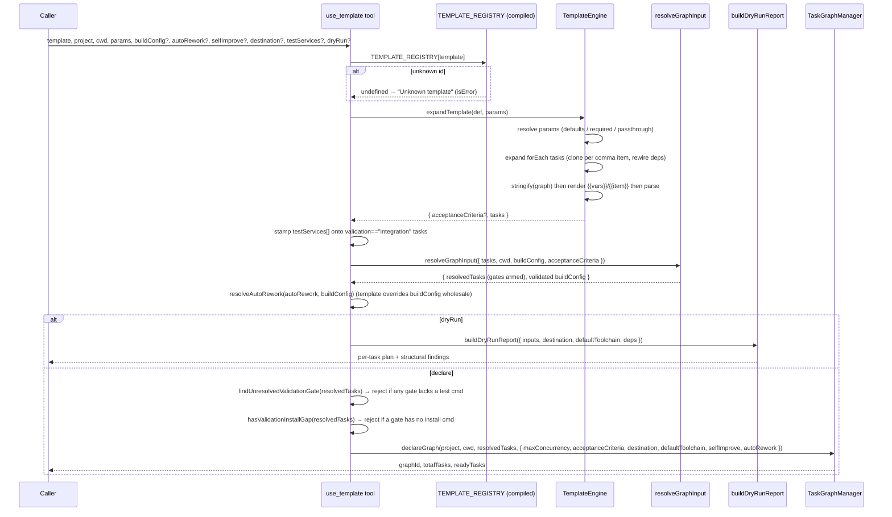
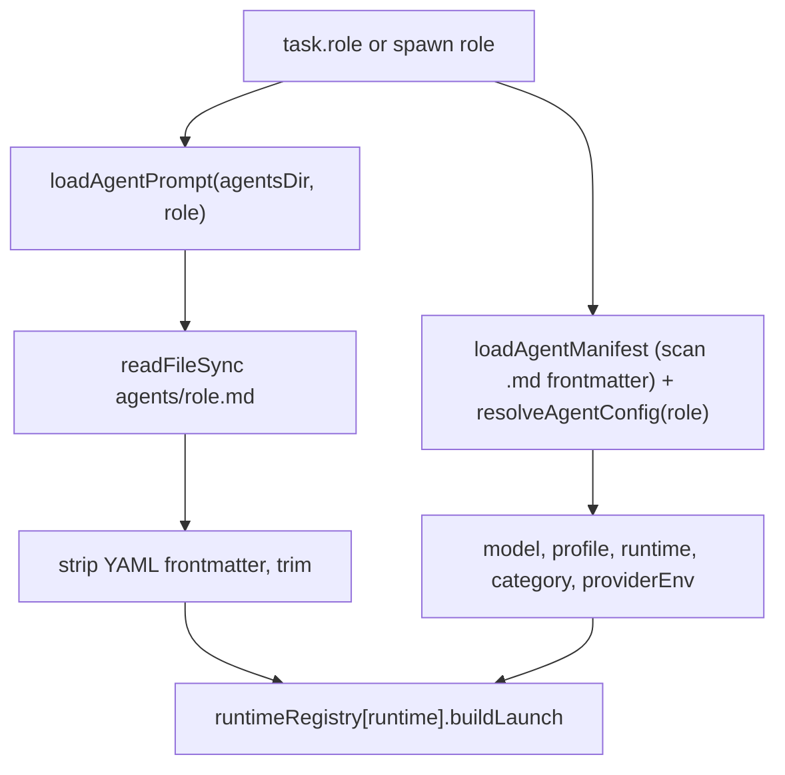

# Templates & Agent Registry

## Overview

This subsystem bundles three loosely-coupled concerns that together let the orchestrator turn a short request into a running multi-agent task graph: a **template engine** that expands parameterized graph definitions into concrete task lists (`src/template-engine.ts › TemplateEngine.expandTemplate`); an **agent registry** — the catalog of role definitions plus one Markdown system prompt per role under `agents/` — surfaced by `list_agents` (`src/tools/list-agents.ts › registerListAgents`); and a **peer registry** that tracks live Claude sessions in Redis with a TTL heartbeat (`src/registry.ts › PeerRegistry`). Two structural aspects shape this subsystem: (1) the templates live in a **compiled-in code registry** at `src/templates/`, keyed by `TEMPLATE_REGISTRY`/`TEMPLATE_LIST` (`src/templates/index.ts › TEMPLATE_REGISTRY`), rather than a filesystem `templates/*.json` directory, and the catalog holds **15 SDLC templates** plus 2 aliases; and (2) the agent manifest's `agents[]` array is not stored in `agents.json` — it is **derived at load time by scanning the frontmatter of every `agents/*.md` and `agents/dynamic/*.md`** (`src/runtime/resolve-agent.ts › loadAgentManifest`). The `loadAgentManifest`/`resolveAgentConfig` machinery is shared with — and documented in depth by — [Agent Runtime & Providers](Agent%20Runtime%20%26%20Providers.md) and [MCP Server Core & Tool Surface](MCP%20Server%20Core%20%26%20Tool%20Surface.md); this note focuses on the template registry, the `list_templates`/`list_agents`/`use_template` tool surface, and the agent-registry structure (curated vs dynamic provenance).

`agents.json` now carries only the global `version`, `runtimes`, and `providers` maps used by the [Agent Runtime & Providers](Agent%20Runtime%20%26%20Providers.md) layer to resolve per-agent model/endpoint/auth routing at spawn time (`agents/agents.json`, `src/runtime/resolve-agent.ts › loadAgentManifest`).

The `agents/` directory also contains a `lang/` subdirectory with three static per-language context fragments (`agents/lang/node.md`, `agents/lang/python.md`, `agents/lang/dotnet.md`). Each fragment is appended immediately after the role core in the system prompt for code-touching roles, providing ecosystem orientation without baking language assumptions into the core files (`src/spawner.ts › loadLangFragment`).

Alongside the agent registry the engine now scans a fourth catalog — a **skill registry** derived from a served `skills/` directory (`skills/<id>/skill.json` manifests) by `loadSkillCatalog`, mirroring the frontmatter-derived agent scan and backing the `list_skills`/`install_skill`/`bureau_discover` tools (`src/runtime/resolve-skill.ts › loadSkillCatalog`, `skills/business-analyst/skill.json`). The tool surface includes two further behaviors: `use_template` forwards a bounded **auto-rework** loop and a **selfImprove** override to `declareGraph`, and rejects at *declare* time any task whose validation gate has no resolvable test command **or no way to install dependencies** — two hard, educating rejections that stop a doomed gate before it clones fresh and false-fails at dispatch (`src/tools/use-template.ts › registerUseTemplate`).

## Responsibilities

- Resolve a template id (or alias) to its definition against the compiled `TEMPLATE_REGISTRY`, then expand it into a graph task list by resolving parameters (defaults, required checks, pass-through), fanning out any `forEach` tasks over a comma-separated param, rewiring downstream deps to the clone ids, and substituting `{{var}}`/`{{item}}` placeholders into the JSON — with **no filesystem access** (`src/tools/use-template.ts › registerUseTemplate`, `src/template-engine.ts › TemplateEngine.expandTemplate`, `src/templates/index.ts › TEMPLATE_REGISTRY`).
- Compose the expanded tasks through the shared `resolveGraphInput` seam — arming each task's validation gate from an inline `buildConfig` (or a committed config), threading `acceptanceCriteria`, and returning the validated `buildConfig` alongside the resolved tasks — before handing the result to the [Task Graph Engine](Task%20Graph%20Engine.md)'s `declareGraph` (`src/tools/use-template.ts › registerUseTemplate`, `src/tools/resolve-graph-input.ts › resolveGraphInput`, `src/tools/resolve-graph-input.ts › ResolvedGraphInput`).
- Resolve the graph-level bounded **auto-rework** setting and forward it (plus the `selfImprove` override) to `declareGraph`: the template's `autoRework` input overrides `buildConfig`'s wholesale (no per-field merge), normalizing to `maxAttempts` 1–3 (default 1) or `undefined` when off (`src/tools/use-template.ts › registerUseTemplate`, `src/tools/resolve-graph-input.ts › resolveAutoRework`, `src/tools/resolve-graph-input.ts › normalizeAutoRework`).
- Reject at *declare* time — before `declareGraph` — any task whose validation gate has no resolvable test command, using the same predicate as the dry-run `gate-no-test` finding, so the task fails loud immediately instead of dying at dispatch (`src/tools/use-template.ts › registerUseTemplate`, `src/tools/dry-run.ts › findUnresolvedValidationGate`).
- Reject at *declare* time — likewise before `declareGraph` — any graph with a unit/integration validation gate but no gated task carrying a dependency-install command (`gate-no-install`), returning the educating `GATE_NO_INSTALL_MESSAGE` instead of the old warn-only advisory; escape hatches (an install step embedded in `task.test`, or a no-op `":"` install for pre-provisioned deps) live inside `hasValidationInstallGap` (`src/tools/use-template.ts › registerUseTemplate`, `src/tools/validation-install-gap.ts › hasValidationInstallGap`, `src/tools/validation-install-gap.ts › GATE_NO_INSTALL_MESSAGE`).
- Optionally run a **dry-run preview** (`dryRun: true`) that resolves the per-task loadout and structurally lints the instantiated graph WITHOUT declaring or spawning, via the shared `buildDryRunReport` (`src/tools/use-template.ts › registerUseTemplate`, `src/tools/dry-run.ts › buildDryRunReport`).
- Inject an array-typed `testServices` onto every expanded task whose `validation === "integration"` — the one graph-shape the string-only `{{param}}` substitution cannot itself produce (`src/tools/use-template.ts › registerUseTemplate`).
- Serve the **skill catalog**: scan a served `skills/` directory for `<id>/skill.json` entries, list them with a per-skill file count, and resolve one skill's full file set (excluding `skill.json`) for delivery — tolerant of a missing directory, fail-loud on a malformed manifest or an id/dir-name mismatch (`src/runtime/resolve-skill.ts › loadSkillCatalog`, `src/runtime/resolve-skill.ts › SkillCatalog`).
- List available templates by mapping over the compiled `TEMPLATE_LIST`, reporting id, name, description, `whenToUse`, aliases, parameters, and task count; the row-building is a pure exported `buildListTemplates()` the tool handler calls (`src/tools/list-templates.ts › registerListTemplates`, `src/tools/list-templates.ts › buildListTemplates`).
- Serve the agent catalog: load the frontmatter-derived manifest and return role id, description, category, model, effort, profile, **provenance** (curated | dynamic), **sourceFile**, and resolved **capability**, optionally filtered by category; the row-building is a pure exported `buildListAgents(agentsDir, category?)` the tool handler calls (`src/tools/list-agents.ts › registerListAgents`, `src/tools/list-agents.ts › buildListAgents`).
- Derive the agent manifest by scanning `.md` frontmatter: `loadAgentManifest` reads `version`/`runtimes`/`providers` from `agents.json`, then builds `agents[]` from `scanAgentFiles(agentsDir)` (curated) plus `scanAgentFiles(agentsDir/dynamic)` (dynamic) (`src/runtime/resolve-agent.ts › loadAgentManifest`, `src/runtime/resolve-agent.ts › scanAgentFiles`).
- Resolve an agent role to its system prompt at spawn time by reading `agents/<role>.md` and stripping YAML frontmatter (`src/spawner.ts › loadAgentPrompt`).
- Register the current session as a peer in Redis, refresh it on a heartbeat, and answer discovery queries filtered by role/host/project (`src/registry.ts › PeerRegistry`).

## Template catalog

`TEMPLATE_LIST` holds exactly 15 distinct templates; `TEMPLATE_REGISTRY` maps each id — and each alias — to the same definition object, throwing on any duplicate id/alias at module load (`src/templates/index.ts › TEMPLATE_REGISTRY`). A regression test asserts the list is 15 with the exact id set and that every alias resolves to its definition (`test: src/__tests__/template-registry.test.ts > "contains exactly the 15 distinct template ids"`).

| id | Role default | Shape | Gate | alias |
|---|---|---|---|---|
| `single-task` | coder | 1 task | `validation` (default `unit`) | — |
| `feature` | coder | 1 task | `validation` (default `unit`) | `standard-feature` |
| `bug-fix` | debugger | 1 task | `validation` (default `unit`) | — |
| `refactor` | refactorer | 1 task | `validation` (default `unit`) | — |
| `add-tests` | tester | 1 task | `validation` (default `unit`) | — |
| `dead-code-removal` | refactorer | 1 task | `validation` (default `unit`) | — |
| `dependency-upgrade` | coder | 1 task | `validation` (default `unit`) | — |
| `targeted-task` | coder | 1 task, destination+buildConfig showcase | `validation` (default `unit`) | — |
| `integration-feature` | coder | 1 task | `validation: "integration"` (fixed) | — |
| `parallel-tasks` | coder | `forEach items` fan-out | per-task `validation` | `parallel-features` |
| `migration` | coder | `forEach units` fan-out | per-task `validation` | — |
| `investigation` | architect | 1 task, read-only | none | — |
| `design-proposal` | architect | 1 task, read-mostly | none | — |
| `audit` | code-reviewer | 1 task | `agent` acceptanceCriterion | — |
| `docs` | docs-writer | 1 task | none | — |

Sources for the table: each template's module (e.g. `src/templates/single-task.ts › singleTask`, `src/templates/parallel-tasks.ts › parallelTasks`, `src/templates/integration-feature.ts › integrationFeature`, `src/templates/audit.ts › audit`, `src/templates/investigation.ts › investigation`). Two templates fan out with `forEach` (`parallel-tasks` over `items`, `migration` over `units`); the rest declare a single self-contained task (`src/templates/parallel-tasks.ts › parallelTasks`, `src/templates/migration.ts › migration`). A catalog lint asserts no template chains a dependent task (`dependsOn`/`deps` empty on every task) and that no template mixes a per-task `validation: unit|integration` gate with an `agent` acceptanceCriterion in its *resolved* form (`test: src/__tests__/template-registry.test.ts > "no template contains a chained dependent task"`, `test: src/__tests__/template-registry.test.ts > "no template combines per-task validation:unit|integration with an agent acceptanceCriterion (resolved, not raw)"`). See [Graph Templates](../Reference/Graph%20Templates.md) for the full per-template parameter reference.

## Key flows

### Template instantiation

This sequence shows `use_template` turning a template id plus params into a declared graph — resolved entirely from the compiled registry, with no `templates/*.json` read (`src/tools/use-template.ts › registerUseTemplate`, `src/template-engine.ts › TemplateEngine.expandTemplate`).

Resolution begins with a registry lookup: an unknown id returns `Unknown template: <id>` as an error result before any expansion (`src/tools/use-template.ts › registerUseTemplate`). Parameter resolution has two passes (`src/template-engine.ts › TemplateEngine.expandTemplate`): for each declared parameter, use the caller's value if present, else the spec `default`, else throw if `required`; then any extra caller-supplied params not declared in the template are merged in as-is. The engine then walks `graph.tasks`: a task carrying `"forEach": "<param>"` is cloned once per trimmed, non-empty comma item of that param, with clone ids `<id>-0`, `<id>-1`, … and `{{item}}` resolving per clone; a regular task is rendered as-is. A dep-rewiring pass replaces any `dependsOn`/`deps` entry naming an expanded `forEach` id with the full list of clone ids (intentional cross-product fan-in). Substitution is purely textual — `render` replaces `{{word}}` tokens via regex over stringified JSON and leaves unmatched tokens untouched (`src/template-engine.ts › TemplateEngine.render`).

After expansion, `use_template` stamps the caller-supplied `testServices` array onto every task whose `validation === "integration"` (the string-only `{{param}}` substitution cannot itself produce an array), then feeds the tasks through `resolveGraphInput`, which arms each declared validation gate from the inline `buildConfig` or a committed config, passes through `acceptanceCriteria`, and returns both the resolved tasks and the *validated* `buildConfig` (`ResolvedGraphInput`) so the caller can reuse it without re-validating; `GraphInputError`/`BuildConfigError` are caught and returned as error results (`src/tools/use-template.ts › registerUseTemplate`, `src/tools/resolve-graph-input.ts › resolveGraphInput`, `src/tools/resolve-graph-input.ts › ResolvedGraphInput`). It then resolves the graph-level auto-rework budget: `resolveAutoRework(autoRework, resolvedBuildConfig)` uses the template's own `autoRework` input if the key is present (even `{}`) and otherwise falls back to `buildConfig.autoRework` — the two are never merged field-by-field — and `normalizeAutoRework` floors/caps it to `maxAttempts` 1–3 (default 1), returning `undefined` (off) for `0`, absent, or non-finite input (`src/tools/resolve-graph-input.ts › resolveAutoRework`, `src/tools/resolve-graph-input.ts › normalizeAutoRework`). If `dryRun` is set, the resolved tasks go to `buildDryRunReport` (returns a per-task plan + structural findings, no declare/spawn); a `dryRun` request with no wired `dryRunDeps` returns an error (`src/tools/use-template.ts › registerUseTemplate`). Otherwise, before declaring, `findUnresolvedValidationGate` scans the resolved (post-buildConfig-fill) tasks and returns an error result if any task declares a `validation` gate with no resolvable `test` command — the fail-loud-at-declare guard, worded identically to the dispatch guard via `formatUnresolvedValidationGateError` (`src/tools/use-template.ts › registerUseTemplate`, `src/tools/dry-run.ts › findUnresolvedValidationGate`, `src/tools/dry-run.ts › formatUnresolvedValidationGateError`). A second declare-time guard immediately follows: `hasValidationInstallGap` scans the same resolved tasks and returns an error result carrying `GATE_NO_INSTALL_MESSAGE` if a unit/integration gate is armed but no gated task provides a way to install dependencies — because the gate clones fresh and would run the bare test command against an empty checkout, a guaranteed false failure. The predicate is deliberately permissive: a gated task clears the gap if it has any truthy `task.install` (including a no-op `":"` asserting pre-provisioned deps) **or** its `task.test` embeds a recognized install/fetch step (e.g. `npm ci && vitest`), matched by the `INSTALL_IN_TEST` regex (`src/tools/use-template.ts › registerUseTemplate`, `src/tools/validation-install-gap.ts › hasValidationInstallGap`, `src/tools/validation-install-gap.ts › GATE_NO_INSTALL_MESSAGE`). Only after both guards pass are the surviving tasks and options — now including `selfImprove` and the resolved `autoRework` — forwarded to `graphManager.declareGraph`; the result text is a plain success summary (a residual `⚠️ [gate-no-install]` advisory branch on that success path was unreachable, since the guard above already rejects the same condition, and has been removed) (`src/tools/use-template.ts › registerUseTemplate`).

The dry-run path shares the same resolver seams as real dispatch: `buildDryRunReport` runs the declare-time `validateGraphInput` and then `resolveTaskLoadout` per task — the identical loadout resolver that dispatch uses — so the preview matches what would actually run (`src/tools/dry-run.ts › buildDryRunReport`, `src/runtime/resolve-loadout.ts › resolveTaskLoadout`). Its `lintPlan` mirrors dispatch's guards: unknown role, loadout resolve error, a `validation` set with no `test` command (via the shared `hasUnresolvedValidationGate`), an unsupported/`redis|postgres`-only test service, and unapproved images all surface as findings; graph-level findings include the reworded `dependson-coupling` advisory (dependents now receive their dependencies' committed/merged work via the per-graph integration branch — only uncommitted working-tree state is invisible), a `gate-no-install` finding now emitted at **`error`** severity — escalated from a warning because `resolveGraphInput`/`use_template` reject the same condition at declare time, so understating it as a warning would mislead, and a `reviewloop-no-reject` tripwire that fires only if `resolveTaskLoadout` failed to inject `reject_task` for a `reviewLoop` task (`src/tools/dry-run.ts › lintPlan`, `src/tools/dry-run.ts › hasUnresolvedValidationGate`, `src/tools/validation-install-gap.ts › hasValidationInstallGap`).

### Agent prompt resolution at spawn

When a task or `spawn_session` names a role, the dispatcher loads that role's Markdown prompt and looks up its model/profile from the frontmatter-derived manifest.

`loadAgentManifest` reads `version`/`runtimes`/`providers` from `agents.json`, then derives `agents[]` by scanning `.md` frontmatter under `agents/` (provenance `curated`) and `agents/dynamic/` (provenance `dynamic`); each `AgentDef` id comes from frontmatter `id`, then `name`, then the file stem, and `profile` falls back through frontmatter `profile` → `template` → `"minimal"` (`src/runtime/resolve-agent.ts › loadAgentManifest`, `src/runtime/resolve-agent.ts › scanAgentFiles`). `resolveAgentConfig` returns model (provider override or `agent.model`), profile, runtime id (default `"claude-code"`), the agent `category` (gates the language-fragment append), and the provider's env bundle (`src/runtime/resolve-agent.ts › resolveAgentConfig`). `loadAgentPrompt` resolves `agents/<role>.md`, reads it, and strips a leading `---\n…\n---\n` frontmatter block (`src/spawner.ts › loadAgentPrompt`). See [Agent Runtime & Providers](Agent%20Runtime%20%26%20Providers.md) for the runtime-adapter selection and provider-env details.

### Skill catalog resolution

The engine ships a served **skill catalog** alongside the agent registry. `loadSkillCatalog(skillsDir)` scans `skillsDir` for immediate subdirectories that each contain a `skill.json`, validates every manifest against a zod schema (`id`, `name`, `description`, `version`, all required), and enforces that the manifest `id` equals its directory name — throwing on a mismatch or a malformed manifest, but tolerating an absent directory by returning an empty catalog (`src/runtime/resolve-skill.ts › loadSkillCatalog`). The returned `SkillCatalog` exposes `entries`, `listSkills()` (each entry plus a recursive `fileCount`), and `readSkill(id)` which returns the skill's full file set for delivery — recursively walking the skill dir but **excluding the top-level `skill.json`** (catalog metadata, not a delivered file) — and throws `unknown skill "<id>"` listing the available ids when the id is not found (`src/runtime/resolve-skill.ts › SkillCatalog`, `src/runtime/resolve-skill.ts › loadSkillCatalog`). The catalog directory defaults to `resolve(baseDir, "..", "skills")` and is overridable with the `SKILLS_DIR` env var (`src/runtime/resolve-skill.ts › defaultSkillsDir`). This resolver is deliberately shaped like `loadAgentManifest`/`scanAgentFiles`; the `list_skills`/`install_skill`/`bureau_discover` tools that consume it are documented in [MCP Server Core & Tool Surface](MCP%20Server%20Core%20%26%20Tool%20Surface.md). The served catalog holds three skills — `bureau`, `business-analyst`, and `example`; the `bureau` usage skill (`/bureau`, discovery-first orchestration guidance) is one of them (`skills/bureau/skill.json`, `skills/business-analyst/skill.json`).

## Public interface

| Symbol | Location | Description |
|---|---|---|
| `TEMPLATE_LIST` | `src/templates/index.ts › TEMPLATE_LIST` | Ordered array of all 15 template definitions; the source `list_templates` maps over. |
| `TEMPLATE_REGISTRY` | `src/templates/index.ts › TEMPLATE_REGISTRY` | id-and-alias → definition lookup, built once at module load; throws on a duplicate id/alias. |
| `TemplateEngine.render(template, vars)` | `src/template-engine.ts › TemplateEngine.render` | Replace `{{word}}` tokens in a string from `vars`; leaves unknown tokens intact. |
| `TemplateEngine.expandTemplate(template, params)` | `src/template-engine.ts › TemplateEngine.expandTemplate` | Resolve params, fan out `forEach` tasks (clone per comma item + rewire deps), render the graph JSON into `{acceptanceCriteria?, isolateParallel?, tasks}`. Throws on a missing required param, an unknown/empty `forEach` param. |
| `TemplateDefinition` | `src/template-engine.ts › TemplateDefinition` | Template shape: `id`, optional `name`/`description`/`whenToUse`/`aliases`, `parameters`, `graph`. |
| `use_template` tool | `src/tools/use-template.ts › registerUseTemplate` | Instantiate a graph from a template; params `template, project, cwd, params, maxConcurrency?, buildConfig?, autoRework?, selfImprove?, destination?, defaultToolchain?, testServices?, dryRun?`. |
| `list_templates` tool | `src/tools/list-templates.ts › registerListTemplates` | Catalog templates from `TEMPLATE_LIST` (no `templatesDir` arg, no filesystem dependency); delegates row-building to `buildListTemplates()`. |
| `buildListTemplates()` | `src/tools/list-templates.ts › buildListTemplates` | Pure catalog builder over `TEMPLATE_LIST` (id, name, description, whenToUse, aliases, parameters, taskCount); reused off the tool handler. |
| `list_agents` tool | `src/tools/list-agents.ts › registerListAgents` | Catalog roles from the frontmatter-derived manifest; emits `provenance`, `sourceFile`, and resolved `capability`; optional `category` filter; delegates to `buildListAgents`. |
| `buildListAgents(agentsDir, category?)` | `src/tools/list-agents.ts › buildListAgents` | Pure agent-catalog builder returning `AgentSummaryRow[]`; resolves each role's capability defensively (swallows resolve errors to `undefined`). |
| `resolveAutoRework(declareInput, buildConfig)` | `src/tools/resolve-graph-input.ts › resolveAutoRework` | Resolve the graph-level auto-rework budget; declare-input key presence overrides `buildConfig.autoRework` wholesale; normalized/capped by `normalizeAutoRework`. |
| `findUnresolvedValidationGate(inputs)` | `src/tools/dry-run.ts › findUnresolvedValidationGate` | First task declaring a `validation` gate with no `test` command (used for the declare-time rejection), else `undefined`. |
| `hasValidationInstallGap(inputs)` | `src/tools/validation-install-gap.ts › hasValidationInstallGap` | True when a unit/integration gate is armed but no gated task provides a dependency install — neither a truthy `task.install` (a no-op `":"` counts) nor an install step embedded in `task.test` (`INSTALL_IN_TEST` regex). Drives the `gate-no-install` declare-time rejection. Re-exported from `dry-run.ts` for back-compat. |
| `GATE_NO_INSTALL_MESSAGE` | `src/tools/validation-install-gap.ts › GATE_NO_INSTALL_MESSAGE` | The educating error string returned on a `gate-no-install` rejection (names the escape hatches and per-toolchain install commands). Re-exported from `dry-run.ts`. |
| `loadSkillCatalog(skillsDir)` | `src/runtime/resolve-skill.ts › loadSkillCatalog` | Scan `skillsDir` for `<id>/skill.json`, validate manifests, return a `SkillCatalog` (`entries`, `listSkills()`, `readSkill(id)`); empty on a missing dir. |
| `loadAgentManifest(agentsDir)` | `src/runtime/resolve-agent.ts › loadAgentManifest` | Read `version`/`runtimes`/`providers` from `agents.json`; derive `agents[]` from `.md` frontmatter (curated + dynamic). |
| `resolveAgentConfig(manifest, role, hostEnv?)` | `src/runtime/resolve-agent.ts › resolveAgentConfig` | Resolve model, profile, runtime id, category, and provider env for a role. |
| `resolveCapability(agentsDir, manifest, role)` | `src/runtime/resolve-agent.ts › resolveCapability` | Resolve the role's tool capability from frontmatter `template`/legacy `profile`, applying any `tools.mcp`/`tools.harness`/`suppressMemory` overrides; throws on an unknown template or unknown mcp tool. |
| `loadAgentPrompt(agentsDir, role)` | `src/spawner.ts › loadAgentPrompt` | Read `agents/<role>.md`, strip frontmatter, return the prompt body. |
| `PeerRegistry` | `src/registry.ts › PeerRegistry` | Register/deregister/heartbeat + list peers in Redis (TTL 60s, 30s refresh). Unchanged this cycle. |

`validateTemplate` was **removed** — the pre-migration filesystem loader validated arbitrary parsed JSON, but templates are now typed module objects checked by the compiler and the registry lint, so the runtime type-guard was dropped as dead code. See [Agent Catalog](../Reference/Agent%20Catalog.md) for the full role table and [Graph Templates](../Reference/Graph%20Templates.md) for the template definitions.

## Dependencies

- **[Task Graph Engine](Task%20Graph%20Engine.md)** — `use_template` delegates the resolved task list to `graphManager.declareGraph` (`src/tools/use-template.ts › registerUseTemplate`).
- **`resolveGraphInput` / dry-run seams** — `use_template` composes tasks through `resolveGraphInput` (shared with `declare_task_graph`) and previews through `buildDryRunReport`/`resolveTaskLoadout` (shared with dispatch) (`src/tools/resolve-graph-input.ts › resolveGraphInput`, `src/tools/dry-run.ts › buildDryRunReport`).
- **[Agent Runtime & Providers](Agent%20Runtime%20%26%20Providers.md)** — `list_agents` and spawn-time dispatch both call `loadAgentManifest`/`resolveAgentConfig`/`resolveCapability`; provider/runtime routing lives there (`src/runtime/resolve-agent.ts › loadAgentManifest`).
- **[Spawn & PTY](Spawn%20%26%20PTY.md)** — `loadAgentPrompt` feeds the resolved system prompt into the spawn command (`src/spawner.ts › loadAgentPrompt`).
- **Redis** — the peer registry stores `peers:<id>` keys; see [Redis & Connection Layer](Redis%20%26%20Connection%20Layer.md) (`src/registry.ts › PeerRegistry`).
- **Filesystem layout** — `agents/agents.json`, `agents/<role>.md`, `agents/dynamic/*.md`, and `agents/lang/*.md` are read at runtime; the agents directory defaults to `<dist>/../agents` and is overridable with `AGENTS_DIR` (`src/mcp-server.ts`). The served `skills/<id>/` catalog is read by `loadSkillCatalog`, defaulting to `<dist>/../skills` and overridable with `SKILLS_DIR` (`src/runtime/resolve-skill.ts › defaultSkillsDir`). Templates are **no longer** read from disk — they are compiled into the bundle (`src/templates/index.ts › TEMPLATE_LIST`).

## Configuration

| Name | Type | Default | Effect |
|---|---|---|---|
| `AGENTS_DIR` | env (path) | `resolve(__dirname, "..", "agents")` | Directory holding `agents.json`, role `.md` files, `dynamic/`, and `lang/` (`src/mcp-server.ts`). |
| `SKILLS_DIR` | env (path) | `resolve(baseDir, "..", "skills")` | Directory holding the served skill catalog (`<id>/skill.json` + files) scanned by `loadSkillCatalog` (`src/runtime/resolve-skill.ts › defaultSkillsDir`). |
| `PEER_TTL_SECONDS` | const | `60` | Expiry on each `peers:<id>` Redis key (`src/registry.ts › PeerRegistry`). |
| `HEARTBEAT_INTERVAL_MS` | const | `30_000` | Interval at which `startHeartbeat` refreshes the peer key (`src/registry.ts › PeerRegistry`). |
| ~~templates directory~~ | — | — | **Removed.** `list_templates`/`use_template` no longer take a templates directory and never touch the filesystem; templates are compiled in (`src/tools/list-templates.ts › registerListTemplates`). |
| ~~`isolateParallel`~~ | template field (inert) | n/a | **Inert.** `TemplateDefinition.graph.isolateParallel?` and `expandTemplate`'s return still carry the optional field, but no built-in template sets it and `use_template` no longer forwards it — isolation is automatic per-pod under k8s dispatch (`src/template-engine.ts › TemplateDefinition`). |

## Failure modes

- **Unknown template id** — `TEMPLATE_REGISTRY[template]` is `undefined`, and `use_template` returns `Unknown template: <template>` as an error result before expansion (`src/tools/use-template.ts › registerUseTemplate`).
- **Missing required template param** — `expandTemplate` throws `Required parameter "<key>" not provided`; the outer `try/catch` in `use_template` returns `Error: <message>` (`src/template-engine.ts › TemplateEngine.expandTemplate`, `src/tools/use-template.ts › registerUseTemplate`).
- **Empty / unknown `forEach` param** — `expandTemplate` throws (`forEach references unknown parameter …` / `… expanded to zero items …`), surfaced as an error result (`src/template-engine.ts › TemplateEngine.expandTemplate`).
- **buildConfig / graph-input error** — a `GraphInputError` or `BuildConfigError` from `resolveGraphInput` is caught and returned as `Error: <message>`; other errors propagate to the outer catch (`src/tools/use-template.ts › registerUseTemplate`).
- **Unresolvable validation gate (declare-time reject)** — if a resolved task declares a `validation` gate but has no `test` command (and no `buildConfig` service supplied one), `use_template` returns an error naming the offending task and the three remedies *before* declaring, rather than letting it die at dispatch (`src/tools/use-template.ts › registerUseTemplate`, `src/tools/dry-run.ts › findUnresolvedValidationGate`, `src/tools/dry-run.ts › formatUnresolvedValidationGateError`).
- **Gate armed with no dependency install (declare-time reject)** — if the resolved graph has a unit/integration validation gate but no gated task provides a way to install dependencies (no truthy `task.install`, and no install step embedded in `task.test`), `use_template` returns an error carrying `GATE_NO_INSTALL_MESSAGE` *before* declaring — because the gate clones fresh and would run the bare test command against an empty checkout. Escape hatches: an install embedded in the test command, or a no-op `":"` install asserting pre-provisioned deps (`src/tools/use-template.ts › registerUseTemplate`, `src/tools/validation-install-gap.ts › hasValidationInstallGap`, `src/tools/validation-install-gap.ts › GATE_NO_INSTALL_MESSAGE`).
- **`dryRun` requested with no deps** — returns `Error: dry-run is not available (dryRunDeps not wired).` (`src/tools/use-template.ts › registerUseTemplate`). Dry-run deps are wired from `mcp-server` (`src/mcp-server.ts`).
- **Malformed skill manifest** — `loadSkillCatalog` throws if a `skill.json` fails the zod schema or its `id` differs from the directory name; a missing `skills/` directory is tolerated (empty catalog), and `readSkill` on an unknown id throws `unknown skill "<id>"` listing the available ids (`src/runtime/resolve-skill.ts › loadSkillCatalog`).
- **Missing role `.md`** — a role named in a task with no matching `agents/<role>.md` fails the owning task at spawn time (see [Spawn & PTY](Spawn%20%26%20PTY.md) / [Task Graph Engine](Task%20Graph%20Engine.md)). The recurrence guard now scans hard-coded role strings in `src/**/*.ts` and the compiled `TEMPLATE_LIST` and asserts each resolves to a live manifest entry (`test: tests/agent-manifest.test.ts > "all role strings in built-in templates are live manifest entries"`, `test: tests/agent-manifest.test.ts > "all role strings in src/**/*.ts are live manifest entries"`).
- **integration-feature testServices shape** — the template sets `validation:"integration"` only; it deliberately carries no string-typed `testServices` (which `Array.isArray` aggregation in `declareGraph` would silently drop). The orchestrator supplies `testServices` as an array to `use_template`, which stamps it onto the integration tasks (`src/templates/integration-feature.ts › integrationFeature`, `test: src/__tests__/use-template-pipeline.test.ts > "injects testServices onto integration-validation tasks expanded from integration-feature"`).

## Open questions

- The exact count of agent roles is no longer a fixed manifest number — it is whatever `agents/*.md` + `agents/dynamic/*.md` the scan finds at load time, so any historical CHANGELOG count ("30", "31", "32") reflects a past on-disk roster, not a value asserted in code (`src/runtime/resolve-agent.ts › loadAgentManifest`). The curated count is only bounded in tests as ">20" (`test: src/__tests__/manifest-backcompat.test.ts > "all curated agents resolve to their expected template"`), not pinned exactly.

## Related

- [Task Graph Engine](Task%20Graph%20Engine.md)
- [Spawn & PTY](Spawn%20%26%20PTY.md)
- [MCP Server Core & Tool Surface](MCP%20Server%20Core%20%26%20Tool%20Surface.md)
- [Agent Runtime & Providers](Agent%20Runtime%20%26%20Providers.md)
- [Build Config & Toolchain Detection](Build%20Config%20%26%20Toolchain%20Detection.md)
- [Criterion Engine & Plugins](Criterion%20Engine%20%26%20Plugins.md)
- [Redis & Connection Layer](Redis%20%26%20Connection%20Layer.md)
- [Agent Catalog](../Reference/Agent%20Catalog.md)
- [Graph Templates](../Reference/Graph%20Templates.md)
