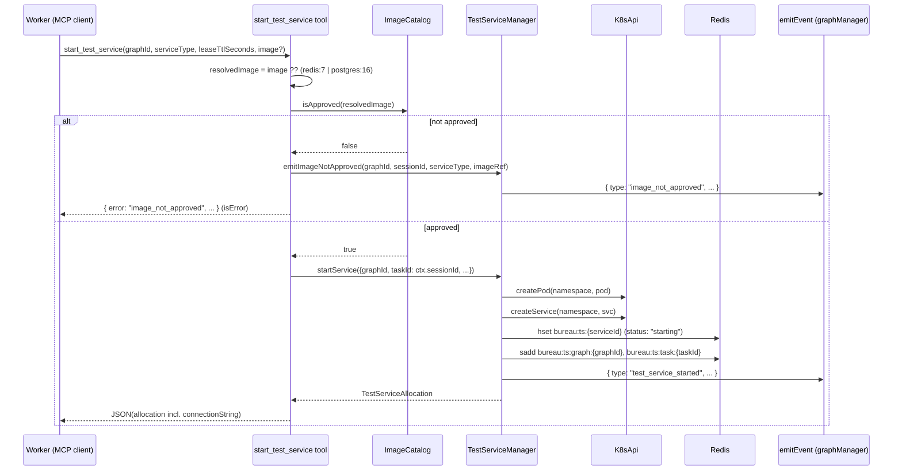
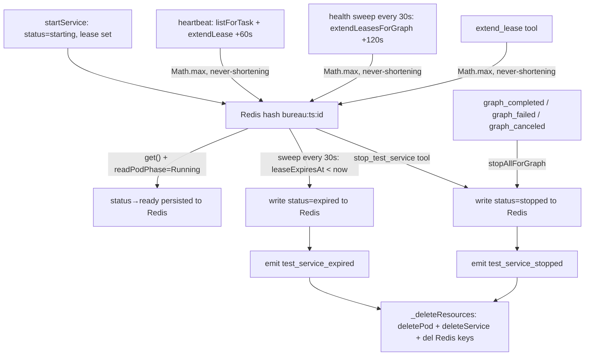

# Test Service Broker

## Overview

The Test Service Broker provisions ephemeral k8s services (Redis or Postgres) on demand for integration-test workloads, returning a ready-to-use connection string and reclaiming the resources automatically when the graph ends or the lease expires (`src/tools/start-test-service.ts:20-24`). It exists because worker pods are isolated by design and otherwise have no way to reach a test dependency like Redis or Postgres. This note documents the **engine-side logic** — the lease state machine, status transitions, lifecycle event emission, the image allowlist, the MCP tool surface, and the lifecycle wiring. The k8s Pod/Service primitives themselves live in `src/spawn/k8s-api.ts`; see k8s Spawn Strategy.

## Responsibilities

- Create one k8s Pod plus one ClusterIP Service per `start_test_service` call and return a `TestServiceAllocation` to the caller (`src/spawn/test-service-manager.ts:102-193`).
- Track each allocation's lease state in Redis with a periodic sweep that writes `expired` status and stops services whose lease has expired (`src/spawn/test-service-manager.ts:284-311`).
- Gate every requested image against a Redis-backed allowlist, rejecting unapproved images with an `image_not_approved` error and graph event (`src/tools/start-test-service.ts:40-55`, `src/spawn/image-catalog.ts:14-16`, `src/spawn/test-service-manager.ts:313-324`).
- Emit lifecycle graph events (`test_service_started`, `test_service_stopped`, `test_service_expired`, `image_not_approved`) via an injected `emitEvent` callback wired to `graphManager.emitEventPublic` (`src/spawn/test-service-manager.ts:65-70`, `src/mcp-server.ts:881`).
- Lazily advance allocation `status` from `"starting"` to `"ready"` when the Pod phase is `Running`, and persist `"stopped"`/`"expired"` to Redis before k8s cleanup so status is always meaningful (`src/spawn/test-service-manager.ts:210-216`, `src/spawn/test-service-manager.ts:251`, `src/spawn/test-service-manager.ts:298`).
- Renew leases of a graph's active services every 30s via the engine health sweep so a live worker's test service is never reaped under it (`src/health-sweep.ts:432-444`, `src/spawn/test-service-manager.ts:236-245`).
- Auto-extend the leases of a session's active services on each heartbeat (`src/tools/heartbeat.ts:38-49`).
- Tear down all of a graph's services when the graph reaches a terminal state (`src/graph-dispatch.ts:626-633`, `src/spawn/test-service-manager.ts:266-269`).

## Key flows

### Start a test service

This sequence shows a worker requesting a service, the allowlist check, Pod/Service creation, Redis lease persistence, and `test_service_started` event emission (`src/tools/start-test-service.ts:36-70`, `src/spawn/test-service-manager.ts:102-193`).

The `taskId` recorded for the allocation is the **caller's session id** (`ctx.sessionId`), not a graph task row id (`src/tools/start-test-service.ts:57-63`). The connection string is built as `redis://{host}:{port}` or `postgres://postgres:postgres@{host}:{port}/postgres`, where `host` is the ClusterIP Service DNS name `bts-{serviceId}.{namespace}.svc.cluster.local` (`src/spawn/test-service-manager.ts:44-48`, `src/spawn/test-service-manager.ts:108`). Postgres Pods are given `POSTGRES_PASSWORD=postgres`, `POSTGRES_USER=postgres`, and `POSTGRES_DB=postgres` env vars matching the hardcoded connection string, so the postgres/pgvector image boots correctly (`src/spawn/test-service-manager.ts:26-41`, `test: src/__tests__/test-service-manager.test.ts > "postgres pod is given auth env matching the hardcoded connection string"`).

### Lease lifecycle, status transitions, and cleanup

This flowchart shows the three independent reclaim paths, status transitions, and event emission points (`src/spawn/test-service-manager.ts:195-311`, `src/graph-dispatch.ts:626-633`, `src/tools/heartbeat.ts:38-49`, `src/health-sweep.ts:432-444`).

The sweep runs on a 30s interval (`src/spawn/test-service-manager.ts:90-93`) and is started at construction time (`src/mcp-server.ts:882`). It enumerates `bureau:ts:*` hash keys (excluding set keys) and for expired entries: writes `status: "expired"` to Redis, emits `test_service_expired`, then calls `_deleteResources` (`src/spawn/test-service-manager.ts:284-311`). `stopService` writes `status: "stopped"`, emits `test_service_stopped`, then calls `_deleteResources` (`src/spawn/test-service-manager.ts:247-264`). `_deleteResources` deletes the Pod and Service best-effort (catching and logging failures) then removes the Redis hash and both set memberships (`src/spawn/test-service-manager.ts:78-88`).

`extendLease` uses `Math.max(existingExpiry, candidate)` so a shorter extension (e.g. the heartbeat's +60s) can never claw back a longer lease already granted by `extend_lease` or the health sweep (`src/spawn/test-service-manager.ts:226-228`, `test: src/__tests__/test-service-manager.test.ts > "extendLease never shortens an already-longer lease"`). The health sweep additionally calls `extendLeasesForGraph(gid, 120)` for each supervised ACTIVE graph, providing engine-side graph-level lease renewal independent of the worker heartbeat (`src/health-sweep.ts:432-444`).

## Public interface

### `TestServiceManager` (`src/spawn/test-service-manager.ts:62-325`)

| Member | Signature | Purpose |
|---|---|---|
| constructor | `(api: K8sApi, redis: RedisClient, namespace: string, emitEvent?: (event: TaskEvent) => Promise<void>)` | Binds the k8s API, Redis client, namespace, and optional event callback (`src/spawn/test-service-manager.ts:65-70`) |
| `startSweep` | `(intervalMs = 30_000): void` | Starts the unref'd lease-expiry sweep timer (`src/spawn/test-service-manager.ts:90-93`) |
| `stopSweep` | `(): void` | Clears the sweep timer (`src/spawn/test-service-manager.ts:95-100`) |
| `startService` | `(params: StartServiceParams): Promise<TestServiceAllocation>` | Creates Pod + Service, persists lease (status: `"starting"`), emits `test_service_started` (`src/spawn/test-service-manager.ts:102-193`) |
| `get` | `(serviceId): Promise<TestServiceAllocation \| null>` | Reads an allocation from its Redis hash; lazily transitions `"starting"` → `"ready"` when Pod phase is `Running` and persists to Redis (`src/spawn/test-service-manager.ts:195-219`) |
| `extendLease` | `(serviceId, leaseTtlSeconds): Promise<number>` | Sets `leaseExpiresAt` to `Math.max(current, now+ttl)` — never shortens; returns 0 for terminal-status or missing services (`src/spawn/test-service-manager.ts:221-230`) |
| `extendLeasesForGraph` | `(graphId, leaseTtlSeconds): Promise<number>` | Extends all non-terminal services for a graph; returns count renewed; called by health sweep every 30s (`src/spawn/test-service-manager.ts:236-245`) |
| `stopService` | `(serviceId): Promise<void>` | Writes `status: "stopped"` to Redis, emits `test_service_stopped`, then best-effort Pod/Service delete + Redis cleanup (`src/spawn/test-service-manager.ts:247-264`) |
| `stopAllForGraph` | `(graphId): Promise<void>` | Stops every service in `bureau:ts:graph:{graphId}` via `stopService` (`src/spawn/test-service-manager.ts:266-270`) |
| `listForGraph` | `(graphId): Promise<TestServiceAllocation[]>` | Allocations for a graph (via `get`, so lazy status transitions apply) (`src/spawn/test-service-manager.ts:272-276`) |
| `listForTask` | `(taskId): Promise<TestServiceAllocation[]>` | Allocations for a session/task (via `get`) (`src/spawn/test-service-manager.ts:278-282`) |
| `sweepExpiredLeases` | `(): Promise<void>` | Writes `status: "expired"` to Redis, emits `test_service_expired`, then `_deleteResources` for all services past their lease (`src/spawn/test-service-manager.ts:284-311`) |
| `emitImageNotApproved` | `(graphId, taskId, serviceType, imageRef): Promise<void>` | Emits an `image_not_approved` graph event; called from the tool handler before `startService` is reached (`src/spawn/test-service-manager.ts:313-324`) |

Private helpers: `_emit(event)` fires the injected callback best-effort (swallows/logs failures) (`src/spawn/test-service-manager.ts:72-76`); `_deleteResources(alloc)` encapsulates the k8s delete + Redis cleanup shared by `stopService` and `sweepExpiredLeases` (`src/spawn/test-service-manager.ts:78-88`).

`StartServiceParams` has fields `graphId`, `taskId`, `serviceType`, `leaseTtlSeconds`, and optional `image` (`src/spawn/test-service-manager.ts:8-14`). The tool's `inputSchema` accepts exactly `graphId, serviceType, leaseTtlSeconds, image?` (`src/tools/start-test-service.ts:25-34`).

### `ImageCatalog` (`src/spawn/image-catalog.ts:11-49`)

| Member | Signature | Purpose |
|---|---|---|
| `isApproved` | `(image): Promise<boolean>` | True if `bureau:img:{image}` exists in Redis (`src/spawn/image-catalog.ts:14-16`) |
| `register` | `(image, approvedBy): Promise<void>` | Writes the image hash with `approvedAt`/`approvedBy` (`src/spawn/image-catalog.ts:18-24`) |
| `list` | `(): Promise<CatalogEntry[]>` | All approved images (`src/spawn/image-catalog.ts:26-40`) |
| `seedFromEnv` | `(envValue): Promise<void>` | Registers comma-separated images as `system` (`src/spawn/image-catalog.ts:42-48`) |

### MCP tools

| Tool | Inputs | Behavior | Availability |
|---|---|---|---|
| `start_test_service` | `graphId, serviceType, leaseTtlSeconds (30–1800, default 60), image?` | Allowlist check, emits `image_not_approved` on rejection, then `startService` + emits `test_service_started`; returns the allocation (`src/tools/start-test-service.ts:36-70`) | k8s mode only (`src/mcp-server.ts:787`) |
| `extend_lease` | `serviceId, leaseTtlSeconds (30–1800)` | Returns `service_not_found` if absent/terminal, else resets lease with `Math.max` (`src/tools/extend-lease.ts:24-37`) | k8s mode only (`src/mcp-server.ts:788`) |
| `stop_test_service` | `serviceId` | Calls `stopService` (writes status, emits event, deletes resources); returns `{ ok: true, serviceId }` (`src/tools/stop-test-service.ts:23-29`) | k8s mode only (`src/mcp-server.ts:789`) |
| `list_test_services` | `graphId` | Returns `listForGraph` allocations (lazy status transitions applied) (`src/tools/list-test-services.ts:20-26`) | k8s mode only (`src/mcp-server.ts:790`) |
| `register_image` | `image` | Registers the image as approved-by the caller's session id (`src/tools/register-image.ts:25-32`) | full profile only (`src/mcp-server.ts:780`) |

`register_image` is registered unconditionally and is full-profile only; the four manager-backed tools are gated behind a constructed `testServiceManager` (k8s mode) and are available to **minimal-profile workers** so workers can lease and manage their own test services without coordinator-level access (`src/mcp-profiles.ts:30-35`). Any authenticated Bureau user may call `register_image` — there is no admin approval step (`src/tools/register-image.ts:17-20`).

## Dependencies

- **Redis** (Redis Connection & Sentinel) — sole store for lease state and the image allowlist; key families `bureau:ts:{serviceId}` (hash), `bureau:ts:graph:{graphId}` / `bureau:ts:task:{taskId}` (sets), and `bureau:img:{image}` (hash) (`src/spawn/test-service-manager.ts:164-178`, `src/spawn/image-catalog.ts:3`).
- **`K8sApi`** — Pod/Service create/delete + `readPodPhase` operations; constructed via `createClientNodeApi()` in k8s mode (`src/mcp-server.ts:879`). Mechanics are documented in k8s Spawn Strategy, not here.
- **`ContextResolver`** ([MCP Server Core & Tool Surface](MCP%20Server%20Core%20%26%20Tool%20Surface.md)) — supplies `ctx.sessionId`, used as both the allocation's `taskId` and the `approvedBy` field (`src/tools/start-test-service.ts:59`, `src/tools/register-image.ts:27`).
- **`graphManager.emitEventPublic`** ([Task Graph Engine](Task%20Graph%20Engine.md)) — the concrete `emitEvent` implementation injected into `TestServiceManager` at construction; also invokes `stopAllForGraph` on terminal graph events (`src/mcp-server.ts:881`, `src/graph-dispatch.ts:626-633`).
- **[Health & Process Monitoring](Health%20%26%20Process%20Monitoring.md) heartbeat tool** — drives per-session lease auto-extension (+60s) (`src/tools/heartbeat.ts:38-49`).
- **[Health & Process Monitoring](Health%20%26%20Process%20Monitoring.md) health sweep** — drives per-graph lease renewal (+120s, never-shortening) every 30s cycle for supervised ACTIVE graphs (`src/health-sweep.ts:432-444`).

## Configuration

| Key | Type | Default | Effect |
|---|---|---|---|
| `BUREAU_TEST_IMAGES` | comma-separated string | `""` (none) | Images seeded into the allowlist as `system` at startup (`src/mcp-server.ts:860`, `src/spawn/image-catalog.ts:42-48`) |
| `BUREAU_WORKER_NAMESPACE` | string | `bureau-runner` | Namespace the broker creates test-service Pods/Services in (`src/mcp-server.ts:880`) |
| `leaseTtlSeconds` (tool arg) | int 30–1800 | 60 | Initial lease duration; heartbeat auto-extension uses a fixed 60s reset (`src/tools/start-test-service.ts:28-30`, `src/tools/heartbeat.ts:9`); health sweep renews at 120s |

Built-in service defaults are hardcoded: Redis on port 6379 image `redis:7` (no env); Postgres on port 5432 image `postgres:16` with `POSTGRES_PASSWORD/USER/DB=postgres` env vars matching the hardcoded connection string (`src/spawn/test-service-manager.ts:16-42`). Note the broker only seeds the allowlist if `BUREAU_TEST_IMAGES` is set; otherwise even the default `redis:7`/`postgres:16` images must be registered before they can start.

## Failure modes

- **Image not in allowlist** — `start_test_service` emits an `image_not_approved` graph event via `manager.emitImageNotApproved`, then returns `{ error: "image_not_approved", image, message }` with `isError: true`; no Pod is created (`src/tools/start-test-service.ts:40-54`, `src/spawn/test-service-manager.ts:313-324`).
- **Unknown serviceId on extend** — `extend_lease` returns `{ error: "service_not_found", serviceId }` with `isError: true` (`src/tools/extend-lease.ts:25-31`); `extendLease` also returns 0 for `stopped`/`expired` services (`src/spawn/test-service-manager.ts:223`).
- **Pod/Service delete failure** — `_deleteResources` swallows and logs the error (best-effort) and still removes Redis state, so a stuck k8s object will not block lease cleanup (`src/spawn/test-service-manager.ts:79-87`).
- **k8s API init failure** — if `createClientNodeApi()` throws, the manager is left undefined, the four manager tools are not registered, and a warning is logged (`src/mcp-server.ts:886-888`).
- **Dead worker** — the worker stops sending heartbeats; heartbeat-driven lease extension ceases, but the engine health sweep continues renewing leases for any supervised ACTIVE graph at 120s every 30s. Once the graph is no longer supervised (engine restarts, loses leadership), the safety-net lease TTL expiry (set at 120s) ensures the next sweep reaps the service within ~120s (`src/tools/heartbeat.ts:38-49`, `src/health-sweep.ts:432-444`, `src/spawn/test-service-manager.ts:284-311`).
- **Event emission failure** — `_emit` catches and logs errors, never propagating them to the caller; lifecycle operations proceed regardless of event delivery failure (`src/spawn/test-service-manager.ts:72-76`).

## Open questions

- Whether the `image` Pod field's resources block (typed `unknown`) is ever schema-validated by the k8s API at create time is out of scope here; see k8s Spawn Strategy for Pod-spec handling.

## Related

- [MCP Server Core & Tool Surface](MCP%20Server%20Core%20%26%20Tool%20Surface.md) — tool registration gating and `ContextResolver`
- [Task Graph Engine](Task%20Graph%20Engine.md) — terminal graph events that trigger cleanup
- [Health & Process Monitoring](Health%20%26%20Process%20Monitoring.md) — heartbeat-driven lease extension and health-sweep graph-level renewal
- k8s Spawn Strategy — Pod/Service provisioning primitives
- [Shared Types Package (@claude_the-bureau)](../Reference/Shared%20Types%20Package%20%28%40claude_the-bureau%29.md) — the four `test_service_*` `TaskEvent` variants
