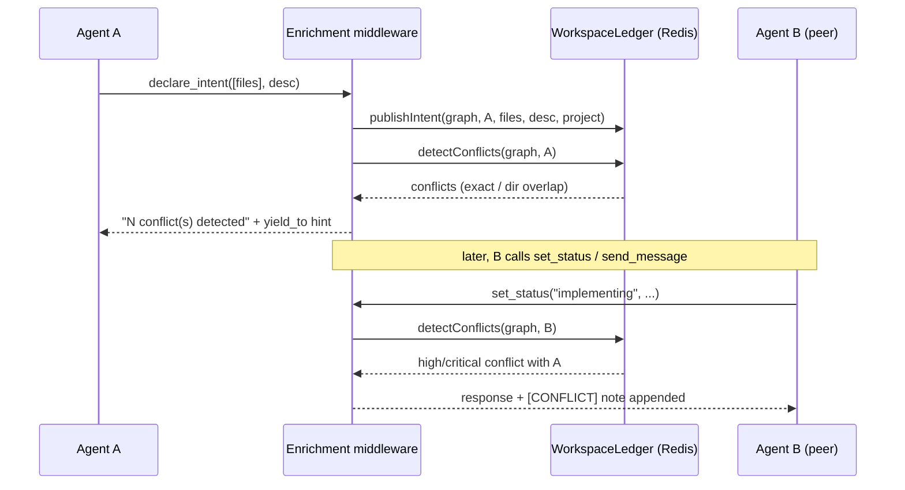
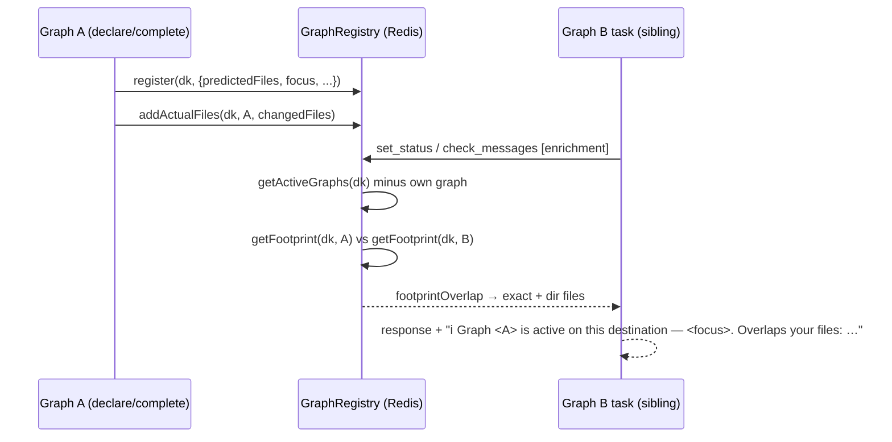
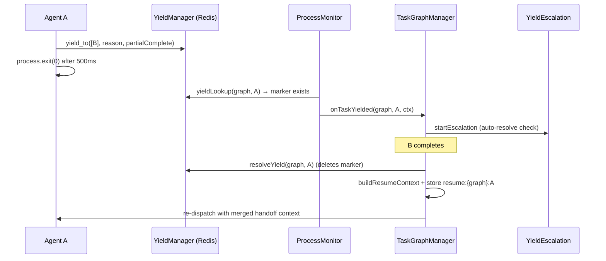
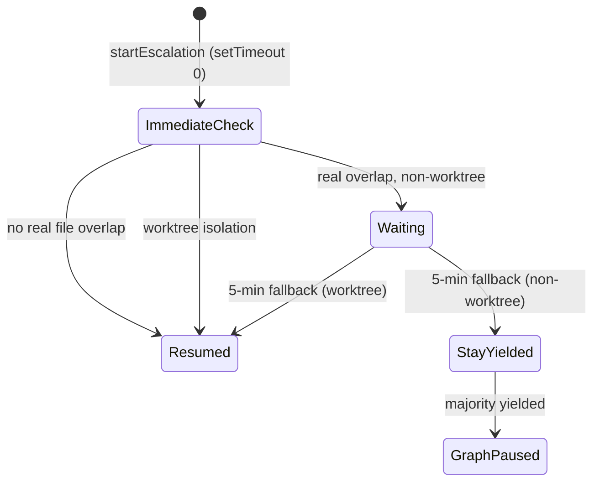

# Workspace Awareness & Locks

## Overview

This subsystem lets parallel agents in a task graph coordinate edits to shared files without a central scheduler. It has two layers: a **hard lock** layer (`FileLockManager`) that grants exclusive Redis-backed file leases, and a **soft awareness** layer (the `src/workspace/` modules) that tracks declared file intents, broadcasts mid-task discoveries, detects conflicts, and lets an agent voluntarily pause (yield) until a peer finishes (`src/file-locks.ts › FileLockManager`, `src/workspace/ledger.ts › WorkspaceLedger`). Awareness signals are surfaced passively by injecting notes into the responses of a fixed set of MCP tools rather than requiring agents to poll (`src/workspace/enrichment.ts › enrichResponse`). Cross-graph awareness has two independent data planes: a **destination-scoped `GraphRegistry`** that tracks every active graph's predicted-and-actual file footprint and drives a passive `ℹ️` situational note when sibling graphs touch the same destination (`src/workspace/graph-registry.ts › GraphRegistry`, `src/workspace/enrichment.ts › crossGraphNotes`), and a **project-scoped intent mirror** in the ledger that feeds the on-demand `get_workspace_state` read tool (`src/workspace/ledger.ts › WorkspaceLedger.getProjectIntents`, `src/tools/get-workspace-state.ts › registerGetWorkspaceState`). The same `GraphRegistry` was later extended to carry a third signal: when a graph's pre-promote validation gate fails, its summary is *retained* (not torn down) with a capped `ValidationFailure` payload so later peers on the same destination see a `⚠️` caution note and `get_workspace_state` exposes a `recentFailures` view — the workspace-awareness surface for the bounded auto-rework loop (`src/workspace/graph-registry.ts › GraphRegistry.recordValidationFailure`, `src/workspace/enrichment.ts › recentFailureNotes`, `src/types/workspace.ts › ValidationFailure`). The hard-lock layer predates the awareness layer: locks came first, while the ledger, enrichment, discovery, and yield were designed together afterward as the soft-awareness layer above them.

## Responsibilities

- Grant and release exclusive/shared file locks atomically across competing sessions, with a 5-minute auto-release TTL (`src/file-locks.ts › LOCK_TTL`, `src/file-locks.ts › FileLockManager.acquireLocks`, `test: tests/file-locks.test.ts > "should be all-or-nothing: no partial lock sets on conflict"`).
- Record each task's declared file intent (files + description + phase) in Redis with a 1-hour TTL, keyed by graph and task; when a `project` is supplied the intent is *also* mirrored to a project-scoped key (`workspace:project:{project}:intents:{graphId}:{taskId}`) with graph attribution and a 24-hour TTL (`src/workspace/ledger.ts › WorkspaceLedger.publishIntent`).
- Detect intent conflicts between tasks — exact file overlap (critical/high) and same-directory overlap (low) (`src/workspace/ledger.ts › WorkspaceLedger.detectConflicts`).
- Track every **active graph** in a destination-scoped registry — its predicted files (parsed from task descriptions at declare time) plus the actual files it changes as tasks complete — and expose peer graphs' footprints for overlap checks; a graph's `status` is one of `active` / `validating` / `done` / `validation_failed` / `reworking`, with `active`/`validating`/`reworking` counting as live peers and `done`/`validation_failed` excluded from the active set (`src/workspace/graph-registry.ts › GraphRegistry`, `src/workspace/graph-registry.ts › GraphSummary`, `src/workspace/graph-registry.ts › isActivePeer`).
- Retain a failed graph's summary with a bounded `ValidationFailure` record (level + capped failed criteria) instead of tearing it down, so peers on the same destination can be warned they may be reworking the same code; expose those records via `getRecentFailures` / `getAllRecentFailures` and clear superseded ones on a later success (`src/workspace/graph-registry.ts › GraphRegistry.recordValidationFailure`, `src/workspace/graph-registry.ts › GraphRegistry.clearFailuresOlderThan`, `src/workspace/validation-failure.ts › buildValidationFailure`).
- Expose the project-wide workspace to readers: list cross-graph intents (`getProjectIntents`), aggregate per-graph conflicts deduplicated by task-pair (`getProjectConflicts`), active locks (`listProjectLocks`), active sibling graphs (`getAllActiveGraphs`), and recent validation failures (`getAllRecentFailures`, newest-first, capped at 20) — all surfaced through the `get_workspace_state(project)` tool (`src/workspace/ledger.ts › WorkspaceLedger.getProjectIntents`, `src/workspace/ledger.ts › WorkspaceLedger.getProjectConflicts`, `src/file-locks.ts › FileLockManager.listProjectLocks`, `src/workspace/graph-registry.ts › GraphRegistry`, `src/tools/get-workspace-state.ts › registerGetWorkspaceState`).
- Persist mid-task discoveries to a per-graph Redis stream (and optionally a 24h project-wide stream), and match them to peers by topic substring or file overlap (`src/workspace/discovery.ts › DiscoveryStore`).
- Inject conflict warnings, discovery notes, workspace summaries, cross-graph situational notes, and validation-failure cautions into the responses of eight specific MCP tools (`src/mcp-server.ts › ENRICHED_TOOLS`, `src/workspace/enrichment.ts › enrichResponse`).
- Surface a non-actionable cross-graph situational note (prefixed `ℹ️`) on `set_status` / `check_messages` when another graph active on the same destination has an overlapping file footprint — advisory only, never triggers yield or conflict escalation (`src/workspace/enrichment.ts › crossGraphNotes`, `src/workspace/enrichment.ts › formatActiveGraphNote`, `test: tests/workspace/enrichment.test.ts > "surfaces a registry-backed peer note on set_status without any declare_intent"`).
- Surface a `⚠️` validation-failure caution note on `set_status` / `check_messages` for recent (<4h), same-project, deduplicated validation failures on the same destination, bounded to at most 3 notes and an aggregate byte cap — telling a fix agent the recorded failure so it need not re-run the whole suite (`src/workspace/enrichment.ts › recentFailureNotes`, `src/workspace/enrichment.ts › formatValidationFailureNote`, `test: tests/workspace/enrichment-failures.redis.test.ts > "surfaces the in-project recent failure, excludes other-project and stale failures, and excludes the caller"`).
- Checkpoint a yielding agent's partial progress, exit its process, and re-spawn it with merged context once the agents it waited on complete (`src/tools/yield-to.ts › registerYieldTo`, `src/task-graph.ts › TaskGraphManager.onTaskCompleted`).
- Auto-resolve or escalate yields on a timer ladder, including pausing the graph when a majority of tasks are yielded (`src/workspace/yield-escalation.ts › YieldEscalation`).
- Tear down all workspace state (registry entry + ledger + discovery keys) through a single path when a graph reaches a terminal status (`src/task-graph.ts › TaskGraphManager.teardownGraph`).

## Key flows

### Intent declaration and conflict detection

This shows how an agent declaring intent gets immediate conflict feedback, and how peers are later warned passively. Auto-publish from `set_status` (inside the enrichment interceptor) and explicit `declare_intent` both write to the same graph-scoped ledger key, and both forward the session's `project` so the intent is mirrored to the project-scoped namespace too (`src/mcp-server.ts › registerSurface`, `src/tools/declare-intent.ts › registerDeclareIntent`).

`detectConflicts` compares the caller's intent files against every other task's intent. Exact file matches are `critical` when both tasks are in phase `implementing`, otherwise `high`; tasks that share only a parent directory produce a `low`-severity conflict (`src/workspace/ledger.ts › WorkspaceLedger.detectConflicts`). Enrichment surfaces only `high`/`critical` conflicts on `set_status`/`send_message` and suppresses `low` ones (`src/workspace/enrichment.ts › enrichResponse`, `test: tests/workspace/enrichment.test.ts > "does NOT append workspace section when conflict severity is only low"`).

Both the enrichment middleware and `declare_intent` thread the session's `parentGraphId` into `detectConflicts` / `getAllIntents`, so a child-graph task's conflicts are computed against parent-graph intents too. The id originates from a session-scoped resolver that reads the `graph:{graphId}` record from Redis once. The enrichment interceptor calls `await parentGraphIdResolver.get()` on every enriched response (`src/mcp-server.ts › registerSurface`), while `declare_intent` reads `parentGraphId` off the `ConnectionContext` returned by `getContext(extra)` (`src/tools/declare-intent.ts › registerDeclareIntent`, `src/workspace/parent-resolver.ts › createParentGraphIdResolver`).

### Cross-graph situational map (registry-backed)

This shows how two independent graphs working the same **destination** become aware of each other without any coupling. On declare, each graph is registered with its predicted files; as tasks complete, actual changed files accumulate; enrichment reads active peers on the same destination key and folds an advisory `ℹ️` note into `set_status`/`check_messages` (`src/task-graph.ts › TaskGraphManager.declareGraph`, `src/task-graph.ts › TaskGraphManager.onTaskCompleted`, `src/workspace/enrichment.ts › crossGraphNotes`).

The situational note is registry-backed, not intent-backed. Both the peer notes and the validation-failure notes are fed from a single best-effort registry scan per enriched call: `enrichResponse` calls `getDestSummaries(opts)` once, which reads every graph summary for the destination (`GraphRegistry.getDestSummaries`) and partitions them in memory into active peers (`isActivePeer`) and recent failures (`isFailure`) — the consolidation that replaced two separate `:meta` scans (`src/workspace/enrichment.ts › getDestSummaries`, `src/workspace/graph-registry.ts › GraphRegistry.getDestSummaries`). `crossGraphNotes` then receives the active-peer slice, drops the caller's own graph, and for each peer computes `footprintOverlap(myFootprint, theirFootprint)` where each footprint is the union of predicted + actual files (`src/workspace/enrichment.ts › crossGraphNotes`, `src/workspace/graph-registry.ts › GraphRegistry.getFootprint`, `src/workspace/graph-registry.ts › footprintOverlap`). Every layer is best-effort: `getDestSummaries`, `crossGraphNotes`, and `recentFailureNotes` each wrap their reads in try/catch and return `[]` on any error, so a registry blip never fails an agent's tool call (`src/workspace/enrichment.ts › getDestSummaries`, `src/workspace/enrichment.ts › crossGraphNotes`, `src/workspace/enrichment.ts › recentFailureNotes`).

Alongside the `ℹ️` peer notes, `recentFailureNotes` folds in `⚠️` validation-failure cautions from the failure slice: it keeps only failures on a different graph, in the same project (when a project is set), whose `failure.at` is within the 4-hour recency window; sorts them newest-first; deduplicates by `(level, first-criterion-name)`; caps the count at `MAX_FAILURE_NOTES` (3); and then stops adding notes once the running total would exceed the `MAX_FAILURE_BYTES` (6 KB) aggregate cap (`src/workspace/enrichment.ts › recentFailureNotes`, `test: tests/workspace/enrichment-failures.redis.test.ts > "deduplicates failures by (level, first-criterion-name), keeping the most recent"`, `test: tests/workspace/enrichment-failures.redis.test.ts > "caps failure notes to MAX_FAILURE_NOTES (3), keeping the most recent"`). `formatValidationFailureNote` renders a `⚠️` line with the failed graph's short id, level, and each kept criterion's name/type plus the last three lines of its trimmed result (`src/workspace/enrichment.ts › formatValidationFailureNote`, `test: tests/workspace/enrichment-failures.test.ts > "renders graph short-id, level, criterion, and result tail"`). The note itself is purely informational — `formatActiveGraphNote` produces an `ℹ️`-prefixed line naming the peer graph (short id, project, status) and its focus, plus an overlap line when the footprints intersect; it contains no `yield_to` hint or `[CONFLICT]` marker and never feeds `detectConflicts`, the yield ladder, or escalation (`src/workspace/enrichment.ts › formatActiveGraphNote`, `test: tests/workspace/enrichment.test.ts > "surfaces a registry-backed peer note on set_status without any declare_intent"`). It fires in the `set_status` and `check_messages` branches; on `check_messages` it fires regardless of whether the caller ever declared intent (`src/workspace/enrichment.ts › enrichResponse`, `test: tests/workspace/enrichment.test.ts > "surfaces a registry-backed peer note on check_messages without any declare_intent"`). The calling graph's destination key is computed at the interceptor from the caller graph's `destination` and `cwd` (`src/mcp-server.ts › registerSurface`, `src/workspace/graph-registry.ts › destKey`).

Distinct from this, the **project-scoped intent mirror** (`workspace:project:{project}:intents:*`) is still written on every `publishIntent` that carries a `project`, but it now feeds only the on-demand `get_workspace_state` read tool, not the passive enrichment note (`src/workspace/ledger.ts › WorkspaceLedger.publishIntent`, `src/workspace/ledger.ts › WorkspaceLedger.getProjectIntents`, `src/tools/get-workspace-state.ts › registerGetWorkspaceState`).

### Yield, checkpoint, and resume

This shows the full yield lifecycle: an agent voluntarily pauses, its process exits, and the graph re-spawns it once dependencies complete. The yield marker in Redis is the single source of truth that distinguishes a yielded exit-0 from a completed one (`src/tools/yield-to.ts › registerYieldTo`, `src/workspace/yield.ts › YieldManager`).

On `yield_to`, the agent writes a yield marker (`bureau:yield:{graph}:{task}`, 24h TTL) then schedules `process.exit(0)` after 500ms to let the MCP response flush (`src/workspace/yield.ts › YieldManager.yieldTo`, `src/tools/yield-to.ts › registerYieldTo`). When the waited-on agents are all in the graph's `completed` set, `onTaskCompleted` resolves the marker, builds a resume context that includes the yielder's partial progress plus the completed agents' handoffs, stores it at `resume:{graph}:{task}`, and re-marks the task `ready` (`src/task-graph.ts › TaskGraphManager.onTaskCompleted`, `test: tests/workspace/yield.test.ts > "includes handoff content from completed agents"`).

### Yield escalation ladder

This shows the timer ladder that prevents yields from stalling a graph forever. It is driven by in-process `setTimeout` handles, not Redis (`src/workspace/yield-escalation.ts › YieldEscalation`).

The immediate check calls `shouldAutoResolve`: no declared files or no real overlap with the yielded-to agents returns `no-conflict` (auto-resume); overlap in a worktree returns `proceed` (auto-resume, isolation handles merge); overlap without a worktree returns `wait` (`src/workspace/yield.ts › shouldAutoResolve`, `test: tests/workspace/yield-escalation.test.ts > "does NOT call resumeYieldedTask at 0s (waits for human or 5min fallback)"`). The 5-minute fallback resumes worktree tasks and, regardless, pauses the graph (`graph_paused` event) when more than half of non-terminal tasks are yielded (`src/workspace/yield-escalation.ts › YieldEscalation`, `test: tests/workspace/yield-escalation.test.ts > "emits graph_paused when majority of active tasks are yielded after 5 minutes"`).

## Public interface

### FileLockManager (`src/file-locks.ts`)

- `acquireLocks(project, req): Promise<LockResult>` — atomically acquires all requested locks or none, via an embedded Lua script; re-acquiring own locks is allowed, conflicts return the holder's session/task (`src/file-locks.ts › FileLockManager.acquireLocks`, `src/file-locks.ts › ACQUIRE_LOCKS_LUA`). `lock_files` supplies `req` from the per-call `ConnectionContext` (`ctx.sessionId`/`taskId`/`graphId`/`project`) rather than registration-time globals (`src/tools/lock-files.ts › registerLockFiles`).
- `releaseLocks(project, sessionId, paths): Promise<ReleaseResult>` — releases only locks owned by the caller's session; others reported as `notHeld` (`src/file-locks.ts › FileLockManager.releaseLocks`, `test: tests/file-locks.test.ts > "does not release a lock held by a different session"`).
- `listProjectLocks(project): Promise<Array<{ path; lock }>>` — scans `locks:{project}:*` and returns every active lock with its decoded `FileLock` payload; the `locks` view of `get_workspace_state` (`src/file-locks.ts › FileLockManager.listProjectLocks`, `src/tools/get-workspace-state.ts › registerGetWorkspaceState`).
- `releaseAllForSession(project, sessionId): Promise<number>` — scans and deletes all of a session's locks; called automatically on task completion/failure (`src/file-locks.ts › FileLockManager.releaseAllForSession`). `FileLockManager` exposes only these four methods — the orphaned `recordFilesChanged` / `detectFileConflicts` / `FILES_TTL` were removed and have not returned (`src/file-locks.ts › FileLockManager`).

### GraphRegistry (`src/workspace/graph-registry.ts`)

The destination-scoped active-graph registry. It is the write/read store behind the cross-graph situational map and the `activeGraphs` view of `get_workspace_state` (`src/workspace/graph-registry.ts › GraphRegistry`).

- Data structure: a `GraphSummary` per graph — `{ graphId, project, status: "active" | "validating" | "done" | "validation_failed" | "reworking", destination, baseRef, focus[], predictedFiles[], startedAt, updatedAt, failure? }` — stored as JSON at `workspace:dest:{dk}:graph:{graphId}:meta` (24h TTL), with a companion Redis SET of actual changed files at `workspace:dest:{dk}:graph:{graphId}:files`; the optional `failure` (a `ValidationFailure`) is present only when `status === "validation_failed"` (`src/workspace/graph-registry.ts › GraphSummary`, `src/workspace/graph-registry.ts › GraphRegistry`).
- Two exported predicates classify a summary: `isActivePeer` is true for any status except `done` and `validation_failed` (so `reworking` is still a live file-holder), and `isFailure` is true for `validation_failed` and `reworking` (so an in-flight rework surfaces as a caution alongside completed failures) (`src/workspace/graph-registry.ts › isActivePeer`, `src/workspace/graph-registry.ts › isFailure`, `test: tests/workspace/graph-registry-reworking.redis.test.ts > "a reworking graph appears in BOTH getActiveGraphs (still a live file-holder) and getRecentFailures"`).
- `destKey(destination, cwd)` — the coordination key: the git destination name when present, else a per-cwd `local:{cwd}` bucket, so two graphs coordinate only when they target the same destination (or the same local cwd) (`src/workspace/graph-registry.ts › destKey`, `test: tests/workspace/graph-registry.redis.test.ts > "falls back to local:<cwd> when destination is null/empty"`).
- `register(dk, summary)` — writes the meta JSON with a 24h TTL (`src/workspace/graph-registry.ts › GraphRegistry.register`).
- `setStatus(dk, graphId, status)` — read-modify-writes the meta status; if the entry is gone (already deregistered) it is a no-op and never recreates it (`src/workspace/graph-registry.ts › GraphRegistry.setStatus`).
- `addActualFiles(dk, graphId, files)` — atomically `SADD`s changed files to the files SET and refreshes both TTLs; guarded by an `EXISTS` check on the meta key so a completed/deregistered graph never leaves a ghost files key (`src/workspace/graph-registry.ts › GraphRegistry.addActualFiles`, `test: tests/workspace/graph-registry.redis.test.ts > "addActualFiles after deregister does not recreate a ghost entry"`).
- `getFootprint(dk, graphId)` — returns the deduplicated union of the meta's `predictedFiles` and the actual-files SET (`src/workspace/graph-registry.ts › GraphRegistry.getFootprint`, `test: tests/workspace/graph-registry.redis.test.ts > "getFootprint unions predictedFiles and actual files"`).
- `getActiveGraphs(dk)` / `getAllActiveGraphs()` — scan one destination bucket (or all) and return summaries kept by `isActivePeer` (excludes `done` and `validation_failed`) (`src/workspace/graph-registry.ts › GraphRegistry.getActiveGraphs`, `test: tests/workspace/graph-registry-reworking.redis.test.ts > "a validation_failed graph appears ONLY in getRecentFailures, not getActiveGraphs"`).
- `getRecentFailures(dk)` / `getAllRecentFailures()` — scan one destination bucket (or all) and return summaries kept by `isFailure` (`validation_failed` + `reworking`); `getAllRecentFailures` backs the `recentFailures` view of `get_workspace_state` (`src/workspace/graph-registry.ts › GraphRegistry.getRecentFailures`, `src/workspace/graph-registry.ts › GraphRegistry.getAllRecentFailures`).
- `getDestSummaries(dk)` — a single unfiltered scan of every summary for a destination; callers that need both active peers and recent failures scan once here and partition in memory rather than calling `getActiveGraphs` + `getRecentFailures` separately (the double-scan consolidation used by enrichment) (`src/workspace/graph-registry.ts › GraphRegistry.getDestSummaries`).
- `recordValidationFailure(dk, graphId, failure)` — read-modify-writes the meta to `status: "validation_failed"` with the `ValidationFailure` payload and refreshes the 24h TTL, then `DEL`s the files SET (a failed graph is no longer a file-holder); a no-op if the entry is already gone, so it never recreates a torn-down summary (`src/workspace/graph-registry.ts › GraphRegistry.recordValidationFailure`).
- `clearFailuresOlderThan(dk, olderThanMs)` — destination-scoped sweep: deregisters `validation_failed` entries whose `failure.at` predates the cutoff, and returns the count cleared; it deliberately never sweeps `reworking` entries (live file-holders whose teardown is deferred and which carry no `.failure` timestamp) (`src/workspace/graph-registry.ts › GraphRegistry.clearFailuresOlderThan`).
- `deregister(dk, graphId)` — deletes both the meta and files keys (`src/workspace/graph-registry.ts › GraphRegistry.deregister`, `test: tests/workspace/graph-registry.redis.test.ts > "deregister removes both meta and files keys"`).
- `footprintOverlap(mine, theirs): { exact; dir }` — pure helper: exact file matches plus same-directory (non-exact) neighbours, used both by enrichment and by the `declare_task_graph` coupled-work advisory owned by [Task Graph Engine](Task%20Graph%20Engine.md) (`src/workspace/graph-registry.ts › footprintOverlap`, `test: tests/workspace/graph-registry.redis.test.ts > "finds same-directory (non-exact) overlap"`).

### ValidationFailure record (`src/workspace/validation-failure.ts`, `src/types/workspace.ts`)

The bounded record persisted in a failed graph's `GraphSummary` and rendered into the `⚠️` caution note. Part of the workspace-awareness surface of the auto-rework loop (`src/types/workspace.ts › ValidationFailure`).

- `ValidationFailure` — `{ graphId, level?, at, criteria: FailedCriterionResult[], omittedCriteria? }`; `level` is the validation level (`"unit"` / `"integration"` / undefined for criterion-driven), `at` is epoch-ms, and `criteria` is the capped list of failed criteria (`src/types/workspace.ts › ValidationFailure`, `src/types/workspace.ts › FailedCriterionResult`).
- `buildValidationFailure(graphId, level, criteria)` — pure builder: slices `criteria` to `MAX_CRITERIA` (2), trims each result to the last `RESULT_MAX_BYTES` (2048) chars, stamps `at = Date.now()`, and records `omittedCriteria` only when criteria were dropped and `level` only when defined (`src/workspace/validation-failure.ts › buildValidationFailure`, `test: tests/workspace/validation-failure.test.ts > "caps criteria to MAX_CRITERIA and records omittedCriteria"`).
- `trimResult(s)` — keeps the last `RESULT_MAX_BYTES` characters (test/build failures put the signal at the tail) (`src/workspace/validation-failure.ts › trimResult`, `test: tests/workspace/validation-failure.test.ts > "trims each result to the last RESULT_MAX_BYTES"`).
- The record is constructed and handed to the registry from the [Task Graph Engine](Task%20Graph%20Engine.md)'s validation-resolution path — `updateGraphStatus(graphId, "validation_failed", failure)` calls `recordValidationFailure`, while a `reworking` transition only `setStatus`es (keeping the files SET) (`src/task-graph.ts › TaskGraphManager.updateGraphStatus`).

### WorkspaceLedger (`src/workspace/ledger.ts`)

- `publishIntent(graph, task, partial, project?)` / `getIntent` / `getAllIntents(graph, parentGraphId?)` — hash-backed intent store; the optional fourth `project` arg additionally mirrors the intent to `workspace:project:{project}:intents:{graph}:{task}` (24h TTL, graph attribution), and `getAllIntents` optionally folds in parent-graph intents marked `fromParent` (`src/workspace/ledger.ts › WorkspaceLedger.publishIntent`, `src/workspace/ledger.ts › WorkspaceLedger.getAllIntents`).
- `getProjectIntents(project, excludeGraphId?)` — scans the project namespace and returns intents from every graph except `excludeGraphId`, reconstructing each `files` array; backs the `intents` view of `get_workspace_state` (`src/workspace/ledger.ts › WorkspaceLedger.getProjectIntents`, `test: tests/workspace/project-intents.redis.test.ts > "getProjectIntents returns intents from all graphs"`).
- `getProjectConflicts(project)` — aggregates the per-graph conflict hashes of every graph on the project, deduplicating by sorted `[taskA, taskB]` pair key (`src/workspace/ledger.ts › WorkspaceLedger.getProjectConflicts`, `test: tests/workspace/project-intents.redis.test.ts > "getProjectConflicts deduplicates the same conflict seen from both sides"`).
- `detectConflicts(graph, task, parentGraphId?)` — returns `WorkspaceConflict[]` and persists them to a conflicts hash (`src/workspace/ledger.ts › WorkspaceLedger.detectConflicts`).
- `cleanupGraph(graph)` — deletes all `workspace:{graph}:intents:*` keys, the conflicts hash, and the discoveries stream; invoked from the graph teardown path (`src/workspace/ledger.ts › WorkspaceLedger.cleanupGraph`, `src/task-graph.ts › TaskGraphManager.teardownGraph`).
- `parseFileRefsFromDescription(desc)` — extracts backtick-wrapped and slash-bearing file paths from free text; used to auto-derive intent files from `set_status` descriptions and to seed a graph's `predictedFiles` at declare time (`src/workspace/ledger.ts › parseFileRefsFromDescription`, `src/task-graph.ts › TaskGraphManager.declareGraph`).

### DiscoveryStore (`src/workspace/discovery.ts`)

- `postDiscovery(graph, d): Promise<string>` — appends to the per-graph stream (trimmed to ~500 entries); `scope: "project"` additionally writes a project stream trimmed to ~1000 with a 24h TTL (`src/workspace/discovery.ts › DiscoveryStore.postDiscovery`).
- `queryDiscoveries(graph, opts)` — newest-first, capped at 20, with topic/since/taskId filters (`src/workspace/discovery.ts › DiscoveryStore.queryDiscoveries`).
- `queryAllDiscoveries(opts?)` — cross-graph global query: scans every `workspace:{graphId}:discoveries` stream, tags each entry with its `graphId`, optionally filters by topic (matched against topic *or* content), sorts newest-first, and caps at `limit` (default 50); returns `DiscoveryWithGraph[]` (`src/workspace/discovery.ts › DiscoveryStore.queryAllDiscoveries`).
- `getNewDiscoveries(graph, lastId, desc, files)` — returns entries newer than a high-water mark that match the caller's description (topic) or files (`src/workspace/discovery.ts › DiscoveryStore.getNewDiscoveries`).

### YieldManager (`src/workspace/yield.ts`)

- `yieldTo`, `getYieldContext`, `resolveYield`, `getActiveYields`, `detectDeadlock`, `buildResumeContext` — manage the `bureau:yield:*` markers and produce resume prompts; `detectDeadlock` runs DFS cycle detection over the yield graph (`src/workspace/yield.ts › YieldManager`, `test: tests/workspace/yield.test.ts > "detects a three-node cycle: A→B, B→C, C→A"`).

### ParentGraphIdResolver (`src/workspace/parent-resolver.ts`)

- `createParentGraphIdResolver(redis, graphId, log): ParentGraphIdResolver` — factory returning an object with a single async `get(): Promise<string | undefined>` that reads `graph:{graphId}` from Redis once and caches the result; a falsy `graphId` short-circuits to `undefined` with no Redis call. A missing record or absent `parentGraphId` field is success and is cached; only a thrown error leaves it uncached so the next `get()` retries (`src/workspace/parent-resolver.ts › createParentGraphIdResolver`, `test: tests/workspace/parent-resolver.test.ts > "(c) returns undefined when graph record does not exist, caches the absence"`).

### MCP tools

Six of the eight workspace tool registrars take a `getContext: ContextResolver` as their last parameter and resolve the caller's identity per-call via `getContext(extra)`, instead of closing over a registration-time config object — part of the per-connection ContextResolver refactor (`src/tools/declare-intent.ts › registerDeclareIntent`). The other two, `get_workspace_state` and `query_all_discoveries`, are cross-graph reads that take injected stores (and, for `get_workspace_state`, a `project` argument), so they need no caller context (`src/tools/get-workspace-state.ts › registerGetWorkspaceState`, `src/tools/query-all-discoveries.ts › registerQueryAllDiscoveries`).

- `declare_intent(files, description)` — publishes intent (forwarding `project`) and returns conflicts immediately; requires graph context, read from `getContext(extra)`; passes the resolved `parentGraphId` into `detectConflicts` so a child task is checked against parent-graph intents (`src/tools/declare-intent.ts › registerDeclareIntent`, `test: tests/tools/declare-intent.test.ts > "passes parentGraphId to detectConflicts when provided in config"`).
- `lock_files(paths, mode)` — acquires hard locks using `ctx.sessionId`/`taskId`/`graphId`/`project` from `getContext(extra)`; `isError` only when nothing was acquired (`src/tools/lock-files.ts › registerLockFiles`).
- `unlock_files(paths?)` — releases listed paths, or all of the session's locks when omitted; the owning `sessionId`/`project` come from `getContext(extra)` (`src/tools/unlock-files.ts › registerUnlockFiles`).
- `post_discovery(topic, content, files?, scope?)` — shares a finding and reports how many active peers it matched; `graphId`/`taskId`/`role`/`project` come from `getContext(extra)`. The `files` schema accepts either a single path string or an array and normalizes a bare string to a one-element array via a Zod `transform` (`src/tools/post-discovery.ts › registerPostDiscovery`).
- `query_discoveries(topic?, since?, taskId?)` — reads the shared (graph-scoped) knowledge base; `graphId` comes from `getContext(extra)`. Its handler was extracted into `buildQueryDiscoveriesHandler` so tests can call it directly, and its text response now appends a machine-readable `\n---\n{ "discoveries": [...] }` JSON envelope after the prose — the array is empty (not prose) when nothing matches (`src/tools/query-discoveries.ts › registerQueryDiscoveries`, `src/tools/query-discoveries.ts › buildQueryDiscoveriesHandler`).
- `query_all_discoveries(topic?)` — global cross-graph read: returns the newest 50 discoveries across every graph (each tagged with its `graphId`) as prose plus the same `---`-delimited JSON envelope; takes no caller context, only the injected `discoveryStore`, and is gated in the base worker loadout (`src/tools/query-all-discoveries.ts › registerQueryAllDiscoveries`, `src/tools/query-all-discoveries.ts › buildQueryAllDiscoveriesHandler`, `src/mcp-profiles.ts › MINIMAL_TOOLS`).
- `yield_to(agents, reason, partialComplete?)` — checkpoints and exits; rejects self-yield; `graphId`/`taskId` come from `getContext(extra)` (`src/tools/yield-to.ts › registerYieldTo`).
- `get_workspace_state(project)` — returns a JSON snapshot `{ intents, conflicts, locks, activeGraphs, recentFailures }` for a project, computed in parallel from `getProjectIntents` / `getProjectConflicts` / `listProjectLocks` / `getAllActiveGraphs` / `getAllRecentFailures` (the graph-derived views filtered to the requested `project`); `recentFailures` is the project's `ValidationFailure` payloads sorted newest-first and sliced to 20. It takes `project` as an argument and is registered in the `coordinator` loadout so operators inherit it (`src/tools/get-workspace-state.ts › registerGetWorkspaceState`, `src/mcp-profiles.ts › COORDINATOR_TOOLS`). Built for the dashboard thin-MCP-client to read the workspace-awareness views without direct Redis access.

The enrichment module also exports `formatCapabilityNote`, which is unrelated to workspace awareness — it renders the MCP-capability advisory for the typed gateway and belongs to [MCP Gateway](MCP%20Gateway.md); it is cross-referenced here only because it lives in `enrichment.ts` (`src/workspace/enrichment.ts › formatCapabilityNote`).

## Dependencies

- **Redis** — every store is Redis-backed: locks (`locks:{project}:{path}`), graph-scoped intents (`workspace:{graph}:intents:{task}`), project-scoped intents (`workspace:project:{project}:intents:{graph}:{task}`), conflicts (`workspace:{graph}:conflicts`), discoveries (`workspace:{graph}:discoveries` stream), registry meta/files (`workspace:dest:{dk}:graph:{graph}:meta` / `:files`), yields (`bureau:yield:{graph}:{task}`), resume context (`resume:{graph}:{task}`) (`src/file-locks.ts › FileLockManager`, `src/workspace/ledger.ts › WorkspaceLedger`, `src/workspace/discovery.ts › DiscoveryStore`, `src/workspace/graph-registry.ts › GraphRegistry`, `src/workspace/yield.ts › YieldManager`).
- **[Task Graph Engine](Task%20Graph%20Engine.md)** — `TaskGraphManager` owns the registry lifecycle (register on declare, footprint capture on completion, status sync + teardown on terminal status) and yield resume; `YieldEscalation` calls back into it (`src/task-graph.ts › TaskGraphManager.declareGraph`, `src/task-graph.ts › TaskGraphManager.onTaskCompleted`, `src/task-graph.ts › TaskGraphManager.updateGraphStatus`, `src/task-graph.ts › TaskGraphManager.teardownGraph`). The `GraphRegistry` + git destinations are wired in after construction via `setGraphRegistry` (`src/task-graph.ts › TaskGraphManager.setGraphRegistry`).
- **ContextResolver / `registerSurface`** — the six context-aware tools receive the shared `getContext` resolver (`get_workspace_state` does not); in stdio mode `getContext` is a static resolver returning one context for every call, and HTTP mode supplies a per-connection map resolver (`src/runtime/connection-context.ts › ContextResolver`).
- **[Spawn & PTY](Spawn%20%26%20PTY.md) / ProcessMonitor** — `yieldLookup` + `onYielded` translate an exit-0-with-marker into a yield rather than a completion (`src/process-monitor.ts › ProcessMonitor`).
- **[Messaging & Handoffs](Messaging%20%26%20Handoffs.md)** — resume context is assembled from peer handoffs (`handoff:{graph}:{agent}`); footprint capture reads `handoff.filesChanged` for the actual-files SET (`src/task-graph.ts › TaskGraphManager.onTaskCompleted`).
- **Telemetry** — `recordLockContention` fires on the lock conflict path (`src/file-locks.ts › FileLockManager.acquireLocks`).
- **[MCP Server Core & Tool Surface](MCP%20Server%20Core%20%26%20Tool%20Surface.md)** — all seven workspace tools are gated and registered there inside `registerSurface`, and the enrichment interceptor wraps enriched tool responses (`src/mcp-server.ts › registerSurface`, `src/mcp-server.ts › ENRICHED_TOOLS`).
- **[MCP Gateway](MCP%20Gateway.md)** — shares `enrichment.ts` for `formatCapabilityNote`, but is otherwise independent (`src/workspace/enrichment.ts › formatCapabilityNote`).

## Configuration

| Key | Type | Default | Effect |
|---|---|---|---|
| `BUREAU_DISABLE_ENRICHMENT` | env (string) | unset (enrichment on) | When `"true"`, `enrichResponse` returns the response untouched (`src/workspace/enrichment.ts › enrichResponse`, `test: tests/workspace/enrichment.test.ts > "returns response unchanged when env var is "`) |
| `LOCK_TTL` | const | `300` s | File-lock auto-release window (`src/file-locks.ts › LOCK_TTL`) |
| `INTENT_TTL` | const | `3600` s | Graph-scoped intent + conflicts hash TTL (`src/workspace/ledger.ts › WorkspaceLedger`) |
| `PROJECT_INTENT_TTL` | const | `86400` s (24 h) | Project-scoped mirror-intent TTL (`src/workspace/ledger.ts › WorkspaceLedger.publishIntent`) |
| `GRAPH_TTL` | const | `86400` s (24 h) | Registry meta/files crash-backstop TTL; lifecycle deregister is the primary cleanup (`src/workspace/graph-registry.ts › GraphRegistry`) |
| `YIELD_TTL` | const | `86400` s | Yield-marker TTL, matched to graph TTL (`src/workspace/yield.ts › YieldManager`) |
| Discovery stream trim | const | ~500 (graph), ~1000 (project) | `XTRIM MAXLEN ~`; project stream also gets a 24h TTL (`src/workspace/discovery.ts › DiscoveryStore.postDiscovery`) |
| Escalation fallback | const | `300_000` ms (5 min) | Wait before the fallback fires (`src/workspace/yield-escalation.ts › YieldEscalation`) |
| `FAILURE_RECENCY_MS` | const | `4 * 60 * 60 * 1000` (4 h) | Recency window for surfacing a validation-failure note (`src/workspace/enrichment.ts › recentFailureNotes`) |
| `MAX_FAILURE_NOTES` | const | `3` | Max validation-failure notes per enriched response (`src/workspace/enrichment.ts › recentFailureNotes`) |
| `MAX_FAILURE_BYTES` | const | `6 * 1024` (6 KB) | Aggregate byte cap across surfaced failure notes (`src/workspace/enrichment.ts › recentFailureNotes`) |
| `MAX_CRITERIA` | const | `2` | Failed criteria retained per `ValidationFailure` (`src/workspace/validation-failure.ts › buildValidationFailure`) |
| `RESULT_MAX_BYTES` | const | `2048` | Tail chars kept per failed-criterion result (`src/workspace/validation-failure.ts › trimResult`) |
| `recentFailures` slice | const | `20` | Cap on `get_workspace_state`'s `recentFailures` payload (`src/tools/get-workspace-state.ts › registerGetWorkspaceState`) |

Enriched tools are a fixed allow-list of eight: `set_status`, `check_messages`, `lock_files`, `get_handoff`, `check_health`, `set_handoff`, `send_message`, `list_peers` (`src/mcp-server.ts › ENRICHED_TOOLS`). Both the cross-graph situational note *and* the validation-failure caution note fire only within the `set_status` and `check_messages` branches of `enrichResponse` (`src/workspace/enrichment.ts › enrichResponse`).

## Failure modes

- **Lock TOCTOU under concurrency** — handled: acquisition is a single Lua script that checks all keys then sets all keys, so two agents racing overlapping path sets cannot each end up with partial locks (`src/file-locks.ts › ACQUIRE_LOCKS_LUA`, `test: tests/file-locks.test.ts > "concurrent acquisition with overlapping paths: no partial sets"`).
- **Registry read failure during enrichment** — swallowed: the consolidated `getDestSummaries` scan and both note builders (`crossGraphNotes`, `recentFailureNotes`) wrap their reads in try/catch and return `[]` on any error, so a registry outage silently drops the situational/failure notes rather than failing the agent's tool call (`src/workspace/enrichment.ts › getDestSummaries`, `src/workspace/enrichment.ts › crossGraphNotes`, `src/workspace/enrichment.ts › recentFailureNotes`).
- **Registry sync during status change is best-effort** — the whole registry-sync block in `updateGraphStatus` (setStatus / recordValidationFailure / clearFailuresOlderThan / teardown) is wrapped in try/catch, so a registry error never blocks the authoritative graph-record write (`src/task-graph.ts › TaskGraphManager.updateGraphStatus`).
- **`reworking` graph swept as stale** — prevented: `clearFailuresOlderThan` only deregisters `validation_failed` entries (which carry a `.failure` timestamp to age against) and explicitly skips `reworking` entries, which are live file-holders whose teardown is deferred until the rework resolves (`src/workspace/graph-registry.ts › GraphRegistry.clearFailuresOlderThan`).
- **Ghost registry files key after teardown** — prevented: `addActualFiles` checks `EXISTS` on the meta key first and skips the `SADD` if the graph was already deregistered, and terminal-status handling marks the graph `done` *before* teardown so a racing footprint capture no-ops (`src/workspace/graph-registry.ts › GraphRegistry.addActualFiles`, `src/task-graph.ts › TaskGraphManager.updateGraphStatus`, `test: tests/workspace/graph-registry.redis.test.ts > "addActualFiles after deregister does not recreate a ghost entry"`).
- **Yield deadlock (cycle)** — `detectDeadlock` can find a cycle via DFS, but no caller in the workspace modules invokes it on the resume path; cycles are instead avoided by self-yield rejection and the escalation ladder (`src/workspace/yield.ts › YieldManager`, `src/tools/yield-to.ts › registerYieldTo`). See Open questions.
- **Yield marker lost / process killed before exit** — if the marker is missing, `yieldLookup` returns false and the exit-0 is treated as a normal completion (`src/process-monitor.ts › ProcessMonitor`).
- **Escalation resume dispatch fails** — `resumeYieldedTask` catches dispatch errors, sets the task `failed`, and emits `task_failed` so it is visible to retry (`src/task-graph.ts › TaskGraphManager.resumeYieldedTask`).
- **Parent-resolver degraded state** — if the one-time `graph:{graphId}` Redis GET throws, the resolver logs a `warn` and stays *uncached*, so the next enriched tool call retries; a missing record or absent `parentGraphId` field is treated as success and cached as `undefined` (`src/workspace/parent-resolver.ts › createParentGraphIdResolver`, `test: tests/workspace/parent-resolver.test.ts > "(d) retries after Redis error: first call returns undefined and warns; second call succeeds"`).

## Open questions

- `detectDeadlock` (`src/workspace/yield.ts › YieldManager`) is fully implemented and tested but appears to have no production caller; cycles are instead avoided by self-yield rejection and the escalation ladder.

## Related

- [Task Graph Engine](Task%20Graph%20Engine.md)
- [Messaging & Handoffs](Messaging%20%26%20Handoffs.md)
- [Spawn & PTY](Spawn%20%26%20PTY.md)
- [State Machine & Rework](State%20Machine%20%26%20Rework.md)
- [MCP Gateway](MCP%20Gateway.md)
- [MCP Server Core & Tool Surface](MCP%20Server%20Core%20%26%20Tool%20Surface.md)
