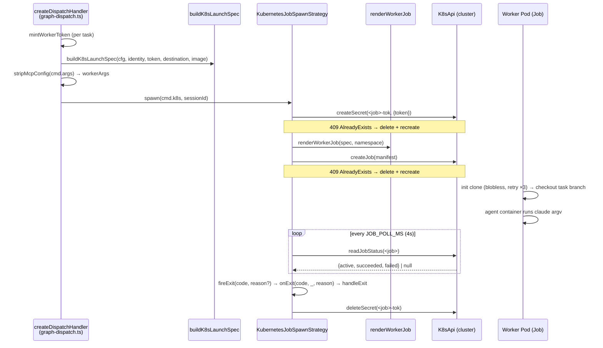
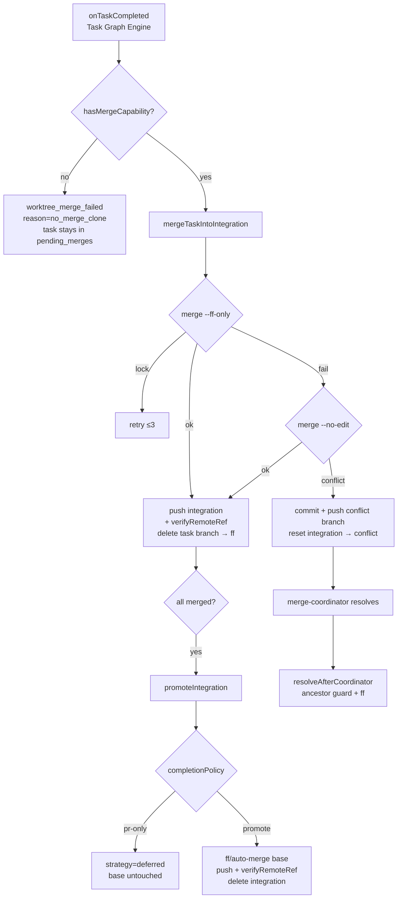

# k8s Spawn & Remote Merge

## Overview

This is the code-track view of how the engine runs agent workers on Kubernetes and reintegrates their work. Every agent worker is dispatched as a Kubernetes **Job** (pod-per-task): the engine renders a Job manifest, applies it via the cluster API, and — because a Job has no PID and no `onExit` — synthesizes a completion event by polling Job status (`src/spawn/k8s-strategy.ts › KubernetesJobSpawnStrategy`). Each worker blobless-clones its destination repo into its own pod, does its work, and pushes a `bureau/<g8>/<task>` branch; the engine then clones-and-merges that branch into a per-graph integration branch `bureau/<g8>/integration` and optionally promotes it to the base ref (`src/spawn/remote-merge.ts › DestinationMerge`, `src/spawn/integration-branch.ts › integrationBranchName`). A dependent pod-mode task does not clone the graph base ref — it clones that same integration branch, so it sees its predecessors' already-merged code (`src/spawn/integration-branch.ts › resolveHandoffBaseRef`). k8s is the **only** supported spawn family — `selectStrategyName` returns `"k8s"` unconditionally and the local PTY/raw families were removed (`src/spawn/strategy.ts › selectStrategyName`).

For the runtime/manifest/GitOps side (the live cluster, namespaces, deployment env, and GitOps automation), see the infra track: k8s Spawn Strategy under Deployment & Infrastructure. This note stays on the TypeScript: the `SpawnStrategy`, the manifest builder, the `RemoteMerge` class, and the git destination registry.

## Responsibilities

- Render a worker Job manifest per task — clone init-container, agent container, optional log-capture sidecar (`src/spawn/k8s-manifest.ts › renderWorkerJob`).
- Create the per-Job bearer-token Secret and the Job via the cluster API, recreating stale handles on `409 AlreadyExists` (`src/spawn/k8s-strategy.ts › KubernetesJobSpawnStrategy`).
- Synthesize an exit event from Job-status polling, since a k8s worker has no PID/`onExit` (`src/spawn/k8s-strategy.ts › KubernetesJobSpawnStrategy`).
- Fail closed for exec/criterion pods: a validation Job that vanishes before a terminal status is observed synthesizes exit 1 with reason `exec_verdict_lost`, never a silent pass (`src/spawn/k8s-strategy.ts › KubernetesJobSpawnStrategy`).
- Resolve a dependent pod-mode task's clone base ref to the per-graph integration branch so it inherits its predecessors' merged work (`src/spawn/integration-branch.ts › resolveHandoffBaseRef`).
- Provide handle-free teardown and status by deterministic identity for the cancel/kill seam and the restart-durable health sweep (`src/spawn/k8s-strategy.ts › KubernetesJobSpawnStrategy`).
- Assemble the per-task `K8sLaunchSpec` and strip `--mcp-config` so the worker token never lands in the Job manifest (`src/spawn/k8s-dispatch.ts › buildK8sLaunchSpec`, `src/spawn/k8s-dispatch.ts › stripMcpConfig`).
- Clone-and-merge each task branch into a per-graph integration branch with tiered ff/auto/conflict handling and post-push remote verification (`src/spawn/remote-merge.ts › DestinationMerge`).
- Promote the integration branch to base, or defer it for `pr-only` (GitOps) destinations (`src/spawn/remote-merge.ts › DestinationMerge`).
- Route each graph's merge to a per-destination working clone resolved from the git destination registry (`src/spawn/remote-merge.ts › RemoteMerge`, `src/spawn/git-registry.ts › resolveDestination`).
- Gate the whole merge on engine capability so a local dispatcher without a merge clone never silently no-ops a completed Job's work (`src/spawn/remote-merge.ts › RemoteMerge`).

## Key flows

### Pod dispatch

The dispatch handler (in [Task Graph Engine](Task%20Graph%20Engine.md) / [MCP Server Core & Tool Surface](MCP%20Server%20Core%20%26%20Tool%20Surface.md)) mints a worker token, builds the `K8sLaunchSpec`, and hands a `SpawnCommand` with `cmd.k8s` set to the strategy; the strategy creates the Secret then the Job and starts a status poll (`src/spawn/k8s-strategy.ts › KubernetesJobSpawnStrategy`).

The Job carries `backoffLimit: 0`, `ttlSecondsAfterFinished: 600`, `restartPolicy: Never`, `automountServiceAccountToken: false`, and runs non-root (`runAsUser/Group: 1000`, `fsGroup: 1000`) (`src/spawn/k8s-manifest.ts › renderWorkerJob`). The clone init-container blobless-clones the base ref with up to 3 attempts (exponential backoff), then checks out the task branch, authenticating via a `GIT_ASKPASS` script fed from the git Secret so the token never appears in the manifest (`src/spawn/k8s-manifest.ts › renderWorkerJob`). Both the clone init-container and the agent container receive `GIT_CONFIG_*` env that sets `safe.directory=*` plus a synthetic committer identity (`user.name = Bureau <role>`, `user.email = <role>@bureau.local`) so worker commits do not fail on an unconfigured identity (`src/spawn/k8s-manifest.ts › renderWorkerJob`). The agent container reads its bearer token from the per-Job Secret via `secretKeyRef` — the minted value is stored engine-side in the Secret and never written to the Job spec (`src/spawn/strategy.ts › K8sLaunchSpec`, `src/spawn/k8s-manifest.ts › renderWorkerJob`). Poll classification mirrors `jobStatusFor`: `succeeded > 0` wins over `failed > 0` (`src/spawn/k8s-strategy.ts › KubernetesJobSpawnStrategy`). A `null` (gone) Job counts as success for a normal worker — its product is the branch it already pushed — but an exec/criterion pod (identified by `cmd.k8s.extraEnv.BUREAU_EXEC_CMD`) fails closed with exit 1 and reason `exec_verdict_lost`, since a vanished validation Job's verdict is unrecoverable and must never silently promote unverified work (`src/spawn/k8s-strategy.ts › KubernetesJobSpawnStrategy`). The `onExit` callback signature carries that synthesized `reason` as a third argument, which the dispatch handler threads to `onTaskFailed` ahead of the generic git classifier (`src/spawn/strategy.ts › SpawnHandle`).

### Integration-branch handoff (dependent tasks)

Because the engine merges each completed task branch into `bureau/<g8>/integration`, that branch accumulates every predecessor's code. A pod-mode task with dependencies must therefore clone the integration branch, not the graph base ref (`main`), which lacks the predecessors' work. `resolveHandoffBaseRef` computes each task's clone base ref (`src/spawn/integration-branch.ts › resolveHandoffBaseRef`):

- An explicit `task.gitBaseRef` always wins — criterion tasks pin integration and merge-coordinator tasks pin the conflict branch (`src/spawn/integration-branch.ts › resolveHandoffBaseRef`).
- Handoff-from-integration is a pod-mode + git-destination concept only: `undefined` when not k8s or when the graph has no git destination (local/stdio shares an object store) (`src/spawn/integration-branch.ts › resolveHandoffBaseRef`, `test: src/__tests__/handoff-baseref.test.ts > "returns undefined when not k8s (local/stdio mode)"`).
- Exec-mode pods and `merge-*` tasks return `undefined` (they never touch git via this path) (`src/spawn/integration-branch.ts › resolveHandoffBaseRef`, `test: src/__tests__/handoff-baseref.test.ts > "returns undefined for exec-mode pods (no git work)"`).
- Root / no-dependency tasks clone the graph base ref (`undefined`); only tasks with a non-empty `dependsOn` base off `integrationBranchName(graphId)` = `bureau/<first-8-of-graphId>/integration` (`src/spawn/integration-branch.ts › resolveHandoffBaseRef`, `src/spawn/integration-branch.ts › integrationBranchName`, `test: src/__tests__/handoff-baseref.test.ts > "returns the integration branch for a pod-mode task WITH deps"`).

This note owns the integration-branch DAG mechanics; the sibling [Task Graph Engine](Task%20Graph%20Engine.md) and [Spawn & PTY](Spawn%20%26%20PTY.md) notes cite `resolveHandoffBaseRef` only at the dispatch seam and defer here.

### Remote-merge & promote lifecycle

On task completion the Task Graph Engine calls `mergeTaskIntoIntegration`; when all task branches are merged it calls `promoteIntegration` (`src/spawn/remote-merge.ts › RemoteMergeHooks`, `test: src/__tests__/merge-ownership.test.ts > "marks graph completed after successful merge and promotion"`).

`mergeTaskIntoIntegration` runs entirely in the engine-side working clone: it ensures the clone exists, fetches base / integration / the task branch, then tries a fast-forward, then an auto-merge, then treats the remainder as a real conflict — committing the conflict state onto `bureau/<g8>/conflict-<task>`, pushing it, and resetting integration so it stays unadvanced (`src/spawn/remote-merge.ts › DestinationMerge`). After a successful ff/auto push it calls `verifyRemoteRef`, which re-reads origin via `ls-remote` because a push can report exit-0 yet leave origin unchanged (`src/spawn/remote-merge.ts › DestinationMerge`). `promoteIntegration` short-circuits to `strategy: "deferred"` for `completionPolicy: "pr-only"` destinations, leaving the base ref untouched — critical for GitOps targets where pushing the base ref triggers an automatic deploy (`src/spawn/remote-merge.ts › DestinationMerge`). `resolveAfterCoordinator` adopts a merge-coordinator's resolved conflict branch: when integration is absent on origin it becomes the new integration state directly; otherwise an `merge-base --is-ancestor` guard precedes a fast-forward, and the conflict + task branches are deleted (`src/spawn/remote-merge.ts › DestinationMerge`).

Three best-effort, never-throw hooks support the rework-integrity guard (all optional on `RemoteMergeHooks`, present on `DestinationMerge`/`RemoteMerge`): `getIntegrationHead` ls-remotes the integration branch's origin HEAD, returning `undefined` on any failure — captured at rework entry as the round's `startHead` for the empty-fix guard (`src/spawn/remote-merge.ts › DestinationMerge`). `getIntegrationDiff` returns the `fromSha..toSha` name-status + patch (falling back to `origin/<integ>` HEAD only when `toSha` is omitted — the rework promote path must pass the captured re-validation SHA to avoid a TOCTOU window), returning `null` when unresolvable so a check that depends on it is skipped, never blocking a legitimate promote (`src/spawn/remote-merge.ts › DestinationMerge`). `deleteBranches` is the result-reporting sibling of `deleteRemote` — one `push --delete` per branch, per-branch success captured in the return value rather than raised — used by the rework-fix conflict cleanup to remove the pushed conflict branch and the fix task's own branch from origin (`src/spawn/remote-merge.ts › DestinationMerge`). Distinct from `classifyGitError`, `isIntegrationBranchMissing` matches the git output of a dependent pod cloning `bureau/<hex>/integration` before it exists (a race, or a validation/fix child cloning before any code landed) — classified ahead of the generic classifier so the trigger discriminator excludes an unrepairable condition (`src/utils/git-classify.ts › isIntegrationBranchMissing`).

## Public interface

| Symbol | File | Description |
|---|---|---|
| `selectStrategyName()` | `src/spawn/strategy.ts` | Returns `"k8s"` unconditionally — the only worker-spawn family (`src/spawn/strategy.ts › selectStrategyName`). |
| `buildStrategy(env)` | `src/spawn/strategy.ts` | Async factory: builds the client-node API and the `KubernetesJobSpawnStrategy`; namespace default `bureau-runner`; parses `BUREAU_WORKER_NODE_SELECTOR` (`src/spawn/strategy.ts › buildStrategy`). |
| `KubernetesJobSpawnStrategy` | `src/spawn/k8s-strategy.ts` | The k8s `SpawnStrategy` (`name="k8s"`, `streamable=false`): `spawn`, `isAlive`, `refresh`, `kill`, `jobStatusFor`, `killByIdentity` (`src/spawn/k8s-strategy.ts › KubernetesJobSpawnStrategy`). |
| `renderWorkerJob(spec, ns, opts)` | `src/spawn/k8s-manifest.ts` | Pure builder of the `batch/v1` Job manifest (`src/spawn/k8s-manifest.ts › renderWorkerJob`). |
| `workerJobName` / `workerTokenSecretName` / `dnsName` | `src/spawn/k8s-manifest.ts` | Deterministic RFC-1123-safe names for the Job and its token Secret (`src/spawn/k8s-manifest.ts › workerJobName`, `src/spawn/k8s-manifest.ts › workerTokenSecretName`, `src/spawn/k8s-manifest.ts › dnsName`). |
| `sessionLogPath(g, t)` | `src/spawn/k8s-manifest.ts` | Single source of truth for the captured transcript path `/sessions/<g>/<t>/session.log` (`src/spawn/k8s-manifest.ts › sessionLogPath`). |
| `graphPodSelector(g)` | `src/spawn/k8s-manifest.ts` | Label selector `bureau/graph=<dnsSafe(g)>` matching a graph's worker/validation pod (`src/spawn/k8s-manifest.ts › graphPodSelector`). |
| `resolveHandoffBaseRef(params)` / `integrationBranchName(g)` | `src/spawn/integration-branch.ts` | Compute a dependent pod-mode task's clone base ref (the integration branch) and the branch name `bureau/<g8>/integration` (`src/spawn/integration-branch.ts › resolveHandoffBaseRef`, `src/spawn/integration-branch.ts › integrationBranchName`). |
| `buildK8sLaunchSpec(params)` | `src/spawn/k8s-dispatch.ts` | Pure assembler of the per-task `K8sLaunchSpec` (`src/spawn/k8s-dispatch.ts › buildK8sLaunchSpec`). |
| `readK8sDispatchEnv(env)` | `src/spawn/k8s-dispatch.ts` | Reads cluster-level worker config from `BUREAU_*` env (`src/spawn/k8s-dispatch.ts › readK8sDispatchEnv`). |
| `stripMcpConfig(args)` | `src/spawn/k8s-dispatch.ts` | Removes the `--mcp-config <value>` pair from the claude argv (`src/spawn/k8s-dispatch.ts › stripMcpConfig`). |
| `defaultWorkerBranch(g, t)` | `src/spawn/k8s-dispatch.ts` | The default push branch `bureau/<g8>/<t>` (`src/spawn/k8s-dispatch.ts › defaultWorkerBranch`). |
| `K8sApi` / `createClientNodeApi()` / `isInCluster()` | `src/spawn/k8s-api.ts` | Minimal cluster-API port over `@kubernetes/client-node` for Jobs/Pods/Secrets/Services, plus `listPodNamesByLabel` / `readPodLog` for the validation-pod log reader (`src/spawn/k8s-api.ts › K8sApi`, `src/spawn/k8s-api.ts › createClientNodeApi`, `src/spawn/k8s-api.ts › isInCluster`). |
| `buildPodLogMethods(core)` | `src/spawn/k8s-api.ts` | Extracts the two pod-log methods over a `CoreV1Api` so their request mapping is unit-testable without the real client (`src/spawn/k8s-api.ts › buildPodLogMethods`). |
| `RemoteMerge` (implements `RemoteMergeHooks`) | `src/spawn/remote-merge.ts` | Registry-aware front routing each graph's merge to a per-destination `DestinationMerge`; surfaces `hasMergeCapability()` and the **required** `getCloneDir(destName?)` (where `command` criteria run) (`src/spawn/remote-merge.ts › RemoteMerge`, `src/spawn/remote-merge.ts › RemoteMergeHooks`). |
| `DestinationMerge` | `src/spawn/remote-merge.ts` | Per-destination clone-and-merge: `mergeTaskIntoIntegration`, `promoteIntegration`, `resolveAfterCoordinator`, plus the best-effort rework hooks `getIntegrationHead` / `getIntegrationDiff` / `deleteBranches` (`src/spawn/remote-merge.ts › DestinationMerge`). |
| `loadGitRegistry` / `resolveDestination` | `src/spawn/git-registry.ts` | Load and resolve the git destination registry (`src/spawn/git-registry.ts › loadGitRegistry`, `src/spawn/git-registry.ts › resolveDestination`). |

## Dependencies

- **`@kubernetes/client-node`** — loaded lazily by `createClientNodeApi`, which uses in-cluster config when `isInCluster` (env `KUBERNETES_SERVICE_HOST` or the projected SA-token file) else the default kubeconfig; `readJobStatus`/`readPodPhase` return `null` on a `404` (`src/spawn/k8s-api.ts › createClientNodeApi`, `src/spawn/k8s-api.ts › isInCluster`).
- **Git plumbing** — `gitSafeAsync` (subprocess git), `createAskpass` (provider-correct username + temp `GIT_ASKPASS` script, PAT never in the env dict), and `classifyGitError` (low-cardinality error typing, auth-first so auth is never promoted to transient) (`src/utils/git-classify.ts › classifyGitError`). See [Auth & Tokens](Auth%20%26%20Tokens.md).
- **[Task Graph Engine](Task%20Graph%20Engine.md)** — owns `onTaskCompleted` → `mergeTaskIntoIntegration` / `promoteIntegration` wiring via the `RemoteMergeHooks` port; drives Job exit → `handleExit` → task completion (`src/spawn/remote-merge.ts › RemoteMergeHooks`).
- **[Build Config & Toolchain Detection](Build%20Config%20%26%20Toolchain%20Detection.md)** — supplies the resolved per-task worker image passed into `buildK8sLaunchSpec` (`src/spawn/k8s-dispatch.ts › buildK8sLaunchSpec`).
- **[Health & Process Monitoring](Health%20%26%20Process%20Monitoring.md)** — `jobStatusFor` backs restart-durable exit detection with no in-memory handle (`src/spawn/k8s-strategy.ts › KubernetesJobSpawnStrategy`).

## Configuration

Cluster-level worker config read by `readK8sDispatchEnv` (`src/spawn/k8s-dispatch.ts › readK8sDispatchEnv`) and `buildStrategy` (`src/spawn/strategy.ts › buildStrategy`):

| Env var | Default | Effect |
|---|---|---|
| `BUREAU_WORKER_IMAGE` | `bureau-worker:latest` | Default worker container image (per-task toolchain image overrides it). |
| `BUREAU_ENGINE_URL` | `http://bureau-engine.bureau.svc:3917/mcp` | MCP URL the worker connects back to. |
| `BUREAU_GIT_URL` | `""` | Default clone/merge origin (also tier-3 registry synth). |
| `BUREAU_GIT_BASE_REF` | `main` | Default base branch cloned and (in `promote` mode) advanced. |
| `BUREAU_GIT_SECRET` | `bureau-git` | Name of the k8s Secret the clone init-container mounts. |
| `BUREAU_WORKER_CPU` / `BUREAU_WORKER_MEMORY` | unset | Agent-container resource **limits** (requests fixed at 250m/512Mi). |
| `BUREAU_SESSION_PVC` | unset | When set, the Job gains the capture emptyDir + log-shipping sidecar. |
| `BUREAU_WORKER_NAMESPACE` | `bureau-runner` | Namespace worker Jobs are created in. |
| `BUREAU_WORKER_NODE_SELECTOR` | unset | `key=value` pins worker Pods to a node. |
| `BUREAU_GIT_REGISTRY_FILE` | unset | Tier-1 git destination registry (YAML `destinations:` list) (`src/spawn/git-registry.ts › loadGitRegistry`). |
| `BUREAU_MERGE_CLONE_DIR` | `/workspace/bureau-merge` | Enables engine merge capability; its presence marks the engine as the merge owner (`src/spawn/remote-merge.ts › RemoteMerge`). |

The git destination registry has three-tier precedence: `BUREAU_GIT_REGISTRY_FILE` (YAML) → `.bureau/config.json` `destinations` → `BUREAU_GIT_URL` synthesizes a single default → `[]` (pod-mode merge stays off) (`src/spawn/git-registry.ts › loadGitRegistry`, `test: src/__tests__/git-registry.test.ts > "returns [] when no env vars and no cwd"`). Each `GitDestination` carries a `completionPolicy` of `promote` (default) or `pr-only` (`src/spawn/git-registry.ts › loadGitRegistry`, `test: src/__tests__/git-registry.test.ts > "tier 2: respects completionPolicy='pr-only' from config"`).

## Failure modes

- **Stale Secret/Job from a prior failed attempt** — `spawn` catches `409 AlreadyExists` on both the token Secret and the Job, deletes the stale handle and recreates it so the new token is in place before the pod starts (`src/spawn/k8s-strategy.ts › KubernetesJobSpawnStrategy`).
- **Invalid RFC-1123 names** — `dnsName` truncates to 63 chars and strips a trailing hyphen; `workerTokenSecretName` reserves room for the `-tok` suffix before the cap so it never lands on a `-` (which the API server rejects as an invalid RFC-1123 name) (`src/spawn/k8s-manifest.ts › dnsName`, `src/spawn/k8s-manifest.ts › workerTokenSecretName`).
- **Transient git-provider brownout** — network-facing ops retry up to `GIT_MAX_ATTEMPTS` (3) with delays `[2000, 6000]ms` + ±25% jitter when `isTransientGitError` (via `classifyGitError`) is true; auth failures and "not found" are never retried; `transient_lock` has a separate lock-retry path (`src/spawn/remote-merge.ts › DestinationMerge`, `src/utils/git-classify.ts › classifyGitError`, `test: src/__tests__/git-retry.test.ts > "does NOT retry non-transient fetch errors (mock called exactly once per call)"`).
- **Silent lost push** — `verifyRemoteRef` re-checks origin after every integration/base push; a mismatched or missing remote SHA is surfaced as `strategy: "error"` rather than reported as success (`src/spawn/remote-merge.ts › DestinationMerge`).
- **Non-capable engine merge** — an engine without a merge clone (`hasMergeCapability` false) does not call `mergeTaskIntoIntegration`; the Task Graph Engine emits `worktree_merge_failed` with reason `no_merge_clone` and keeps the task in `pending_merges`, so the graph cannot silently complete (`src/spawn/remote-merge.ts › RemoteMerge`, `test: src/__tests__/merge-ownership.test.ts > "emits worktree_merge_failed and does NOT emit worktree_merging"`).
- **Failed engine-side clone** — `ensureClone` throws with the git output instead of leaving later fetch/merge ops to fail against a non-existent repo with empty output (the symptom that once masked the bug) (`src/spawn/remote-merge.ts › DestinationMerge`).
- **Orphaned running Job after engine restart** — `killByIdentity` reconstructs the Job + Secret names from `graphId`/`taskId` and deletes both handle-free; it never throws so it is safe on the cancel/kill path (`src/spawn/k8s-strategy.ts › KubernetesJobSpawnStrategy`).
- **Vanished validation Job (lost verdict)** — for an exec/criterion pod, a `null` (gone) Job before a terminal status would otherwise read as exit-0 "passed"; the strategy fails it closed with exit 1 + reason `exec_verdict_lost` so unverified work is never promoted (`src/spawn/k8s-strategy.ts › KubernetesJobSpawnStrategy`).
- **Dependent clones integration branch before it exists** — a dependent pod cloning `bureau/<hex>/integration` while it is still missing (race, or a child cloning before any code landed) is matched by `isIntegrationBranchMissing` and classified distinctly ahead of `classifyGitError`, so the trigger discriminator excludes a condition no fix agent can repair (`src/utils/git-classify.ts › isIntegrationBranchMissing`).

## Design notes

- **Provider-agnostic plain-git core, PAT-only.** The merge/clone path uses only plain git protocol (clone/fetch/push over HTTPS) with PAT auth injected via `GIT_ASKPASS`, never embedded in remote URLs — so it works unchanged against any standard git host. `createAskpass` and `classifyGitError` are the primitives of that design.
- **Conflict-resolution path.** The `bureau/<g8>/conflict-<task>` branch + merge-coordinator handoff (`resolveAfterCoordinator`) exists because a merge conflict auto-adds a `merge-coordinator` task.
- **k8s-only spawn.** `isolateParallel: true` (the default) attempted a local `git worktree add` in the engine container, which has no checkout — breaking every concurrent k8s graph; pod-per-task already isolates via per-pod clone + branch-push. `selectStrategyName` returns `"k8s"` with no local fallback (`src/spawn/strategy.ts › selectStrategyName`).
- **Multi-repo destination registry + completion policy.** The per-graph destination and the `promote` vs `pr-only` completion policy exist so GitOps repos (whose `main` auto-deploys) are not promoted on merge; `promoteIntegration` returns `strategy: "deferred"` for `pr-only` (`src/spawn/remote-merge.ts › DestinationMerge`).
- **Merge ownership gating.** A local stdio dispatcher sharing Redis with the in-cluster engine could reach the merge step without a merge clone and silently no-op a completed graph's promotion. `hasMergeCapability` makes the clone-holding engine authoritative and forces an explicit `worktree_merge_failed` otherwise (`src/spawn/remote-merge.ts › RemoteMerge`).
- **Durable push verification.** A push reporting exit-0 while origin stayed unchanged motivated the `ls-remote` re-check in `verifyRemoteRef` (`src/spawn/remote-merge.ts › DestinationMerge`).
- **Worker commit identity.** Worker commits failed on an unconfigured git identity; `renderWorkerJob` injects `user.name`/`user.email` via `GIT_CONFIG_*` env in both the clone init-container and the agent container (`src/spawn/k8s-manifest.ts › renderWorkerJob`).
- **Pod-mode dependent handoff.** Dependent pod-mode tasks previously cloned the graph base ref and could not see predecessors' merged code; `resolveHandoffBaseRef` bases dependents off `bureau/<g8>/integration` (`src/spawn/integration-branch.ts › resolveHandoffBaseRef`).
- **Fail-closed exec verdicts.** An exec/criterion Job vanishing before a terminal status read as a silent pass; the strategy fails it closed via `exec_verdict_lost`, and the `onExit` reason channel carries that classification to `onTaskFailed` (`src/spawn/k8s-strategy.ts › KubernetesJobSpawnStrategy`, `src/spawn/strategy.ts › SpawnHandle`).
- **Rework-integrity guard.** Rework rounds use the best-effort `getIntegrationHead` (startHead capture), `getIntegrationDiff` (fix-integrity diff-shape tier, pinned to the re-validated SHA to close a TOCTOU window), `deleteBranches` (orphan-branch cleanup on a rework-fix merge conflict), and the `isIntegrationBranchMissing` classifier (`src/spawn/remote-merge.ts › DestinationMerge`, `src/utils/git-classify.ts › isIntegrationBranchMissing`).
- **Validation pod-log reader.** `K8sApi` provides `listPodNamesByLabel` / `readPodLog` (extracted as `buildPodLogMethods`) and `k8s-manifest` provides `graphPodSelector`, used to read a validation pod's logs by graph label (`src/spawn/k8s-api.ts › buildPodLogMethods`, `src/spawn/k8s-manifest.ts › graphPodSelector`).

## Open questions

- The exact set of task/graph events (`worktree_merging`, `worktree_merged`, `worktree_merge_failed`, `graph_failed`) and how `pending_merges` is drained live in the Task Graph Engine, not this subsystem; this note documents them only through the `RemoteMergeHooks` contract and the `merge-ownership` test. Their full state-machine handling is documented in [Task Graph Engine](Task%20Graph%20Engine.md).

## Related

- [Spawn & PTY](Spawn%20%26%20PTY.md) — the `SpawnStrategy` interface, `buildEnv`, and the removed local families.
- [Task Graph Engine](Task%20Graph%20Engine.md) — merge lifecycle wiring, `pending_merges`, completion gating.
- [MCP Server Core & Tool Surface](MCP%20Server%20Core%20%26%20Tool%20Surface.md) — `createDispatchHandler` (token mint, `K8sLaunchSpec` build, `--mcp-config` strip).
- [Auth & Tokens](Auth%20%26%20Tokens.md) — worker token minting and git PAT handling.
- [Build Config & Toolchain Detection](Build%20Config%20%26%20Toolchain%20Detection.md) — per-task worker image resolution.
- [Health & Process Monitoring](Health%20%26%20Process%20Monitoring.md) — restart-durable Job-status sweep.
- k8s Spawn Strategy (infra track, under Deployment & Infrastructure) — manifests, namespaces, deployment env, GitOps.
- [System Map](../Architecture/System%20Map.md)
